# Portfolio, Program & Project Management Ontology Module
## Architecture Documentation with OKR & RACI Integration

---

## Table of Contents
1. [Executive Summary](#executive-summary)
2. [Ontology Module Overview](#ontology-module-overview)
3. [Entity Relationship Architecture](#entity-relationship-architecture)
4. [OKR Integration Model](#okr-integration-model)
5. [RACI Framework Integration](#raci-framework-integration)
6. [Metrics, Dashboards & Scorecards](#metrics-dashboards-scorecards)
7. [Common Program & Project Outputs](#common-outputs)
8. [Implementation Guidelines](#implementation-guidelines)

---

## Executive Summary

This document defines the **PPM Ontology Module** - a comprehensive, organization-centric framework for managing portfolios, programs, and projects. The module integrates:

- **Core PPM Entities**: Organization, Portfolio, Program, Project, Stakeholder, Governance, Resources, Documents
- **Strategic Alignment**: OKR framework integration for objectives and key results tracking
- **Accountability Framework**: RACI matrix integration for role clarity
- **Performance Management**: Standardized metrics, dashboards, and scorecards
- **AI-Enabled Automation**: Built-in hooks for intelligent decision support

**Key Benefits:**
- Single source of truth across all client organizations
- Complete traceability from strategy (OKRs) to execution (Projects)
- Clear accountability through RACI integration
- Standardized reporting and analytics
- Schema.org compliance for enhanced discoverability

---

## Ontology Module Overview

### Module Boundary

The PPM Ontology Module encompasses all entities, relationships, and processes required for comprehensive portfolio, program, and project management across an organization.

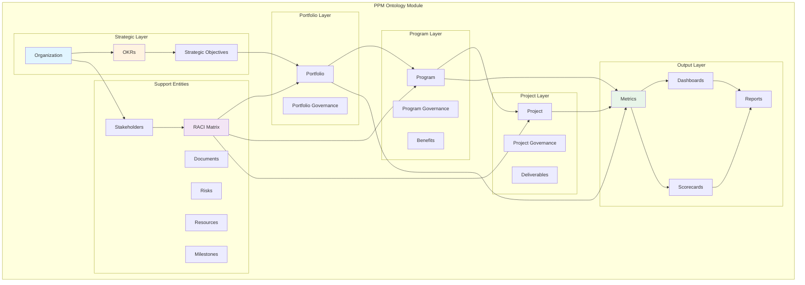

### Core Design Principles

1. **Organization-Centric**: Every entity anchored to `org_id`
2. **Hierarchical Integrity**: Portfolio → Program → Project with strict parent-child constraints
3. **Strategic Alignment**: Direct linkage from OKRs to execution entities
4. **Accountability**: RACI integration at all governance levels
5. **Performance-Driven**: Built-in metrics and KPI tracking
6. **AI-Ready**: Structured data for machine learning and automation

---

## Entity Relationship Architecture

### High-Level Entity Model

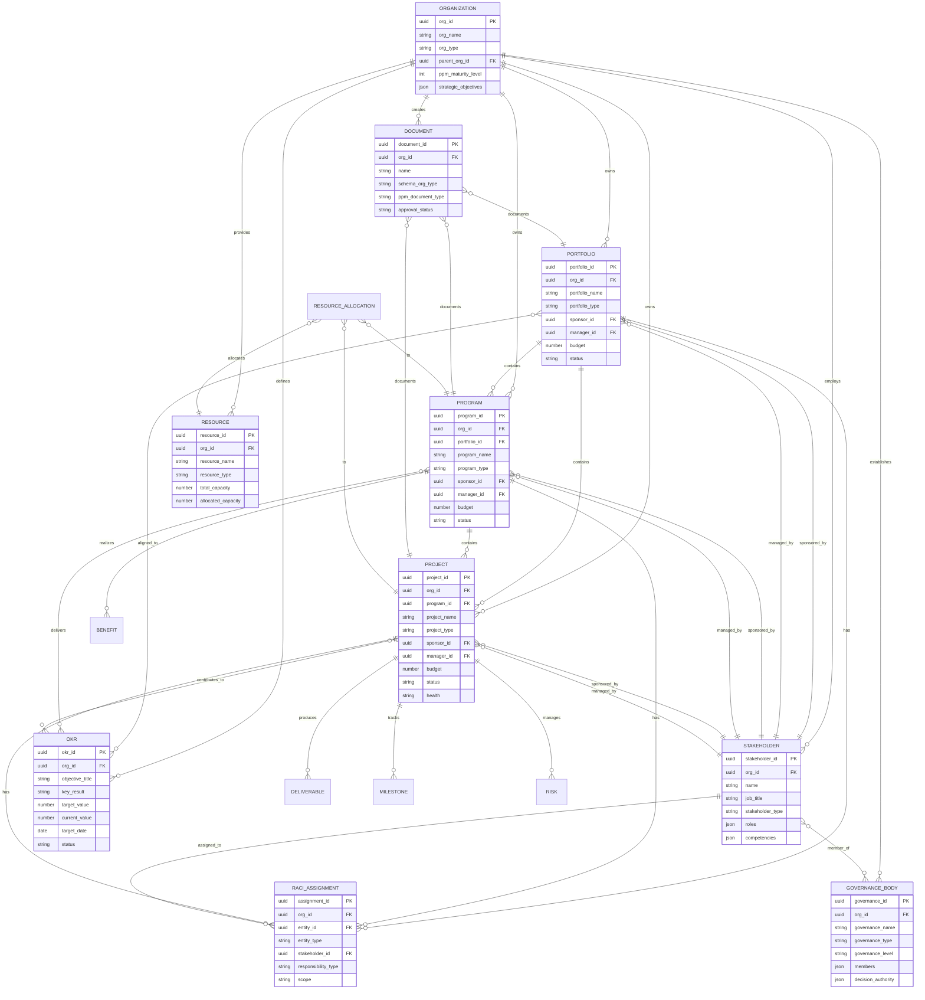

### Detailed Entity Connections

```mermaid
graph TD
    subgraph "Organization Level"
        ORG[Organization<br/>org_id]
        OKRORG[OKRs<br/>Strategic Objectives]
        STAKEHOLDER[Stakeholders<br/>People & Roles]
        GOVORG[Governance Framework]
    end
    
    subgraph "Portfolio Level"
        PORT[Portfolio<br/>portfolio_id]
        OKRPORT[Portfolio OKRs]
        RACIPORT[Portfolio RACI]
        GOVPORT[Portfolio Governance]
        METRICPORT[Portfolio Metrics]
    end
    
    subgraph "Program Level"
        PROG[Program<br/>program_id]
        OKRPROG[Program OKRs]
        RACIPROG[Program RACI]
        GOVPROG[Program Board]
        BEN[Benefits]
        METRICPROG[Program Metrics]
    end
    
    subgraph "Project Level"
        PROJ[Project<br/>project_id]
        OKRPROJ[Project OKRs]
        RACIPROJ[Project RACI]
        GOVPROJ[Project Board]
        DEL[Deliverables]
        MILE[Milestones]
        METRICPROJ[Project Metrics]
    end
    
    subgraph "Shared Resources"
        RES[Resources]
        DOC[Documents]
        RISK[Risks]
        BC[Business Cases]
    end
    
    ORG -->|defines| OKRORG
    ORG -->|employs| STAKEHOLDER
    ORG -->|establishes| GOVORG
    ORG -->|owns| PORT
    
    OKRORG -->|cascades to| OKRPORT
    OKRPORT -->|cascades to| OKRPROG
    OKRPROG -->|cascades to| OKRPROJ
    
    STAKEHOLDER -->|assigned via| RACIPORT
    STAKEHOLDER -->|assigned via| RACIPROG
    STAKEHOLDER -->|assigned via| RACIPROJ
    
    PORT -->|contains| PROG
    PORT -->|tracked by| METRICPORT
    PROG -->|contains| PROJ
    PROG -->|realizes| BEN
    PROG -->|tracked by| METRICPROG
    PROJ -->|produces| DEL
    PROJ -->|has| MILE
    PROJ -->|tracked by| METRICPROJ
    
    PORT -.->|shares| RES
    PROG -.->|shares| RES
    PROJ -.->|shares| RES
    
    PORT -.->|documented by| DOC
    PROG -.->|documented by| DOC
    PROJ -.->|documented by| DOC
    
    PORT -.->|manages| RISK
    PROG -.->|manages| RISK
    PROJ -.->|manages| RISK
    
    METRICPORT -->|aggregates| METRICPROG
    METRICPROG -->|aggregates| METRICPROJ
    
    style ORG fill:#e1f5ff
    style OKRORG fill:#fff3e0
    style OKRPORT fill:#fff3e0
    style OKRPROG fill:#fff3e0
    style OKRPROJ fill:#fff3e0
    style RACIPORT fill:#f3e5f5
    style RACIPROG fill:#f3e5f5
    style RACIPROJ fill:#f3e5f5
    style METRICPORT fill:#e8f5e9
    style METRICPROG fill:#e8f5e9
    style METRICPROJ fill:#e8f5e9
```

---

## OKR Integration Model

### OKR Entity Structure

```json
{
  "okr": {
    "primary_key": "okr_id",
    "foreign_keys": {
      "org_id": "organization.org_id",
      "parent_okr_id": "okr.okr_id"
    },
    "attributes": {
      "okr_id": "uuid",
      "org_id": "uuid",
      "okr_level": "enum[organization, portfolio, program, project]",
      "entity_id": "uuid",
      "entity_type": "enum[organization, portfolio, program, project]",
      "parent_okr_id": "uuid",
      "objective_title": "string",
      "objective_description": "string",
      "key_results": [
        {
          "kr_id": "uuid",
          "kr_title": "string",
          "kr_description": "string",
          "metric_type": "enum[quantitative, qualitative]",
          "target_value": "number",
          "current_value": "number",
          "unit_of_measure": "string",
          "start_value": "number",
          "target_date": "date",
          "confidence_level": "enum[low, medium, high]",
          "status": "enum[not_started, on_track, at_risk, behind, achieved]",
          "owner_id": "uuid"
        }
      ],
      "time_period": {
        "start_date": "date",
        "end_date": "date",
        "period_type": "enum[quarterly, annual, multi_year]"
      },
      "strategic_theme": "string",
      "priority": "enum[critical, high, medium, low]",
      "owner_id": "uuid",
      "status": "enum[draft, active, completed, cancelled]",
      "progress_percentage": "number"
    }
  }
}
```

### OKR Cascade Model

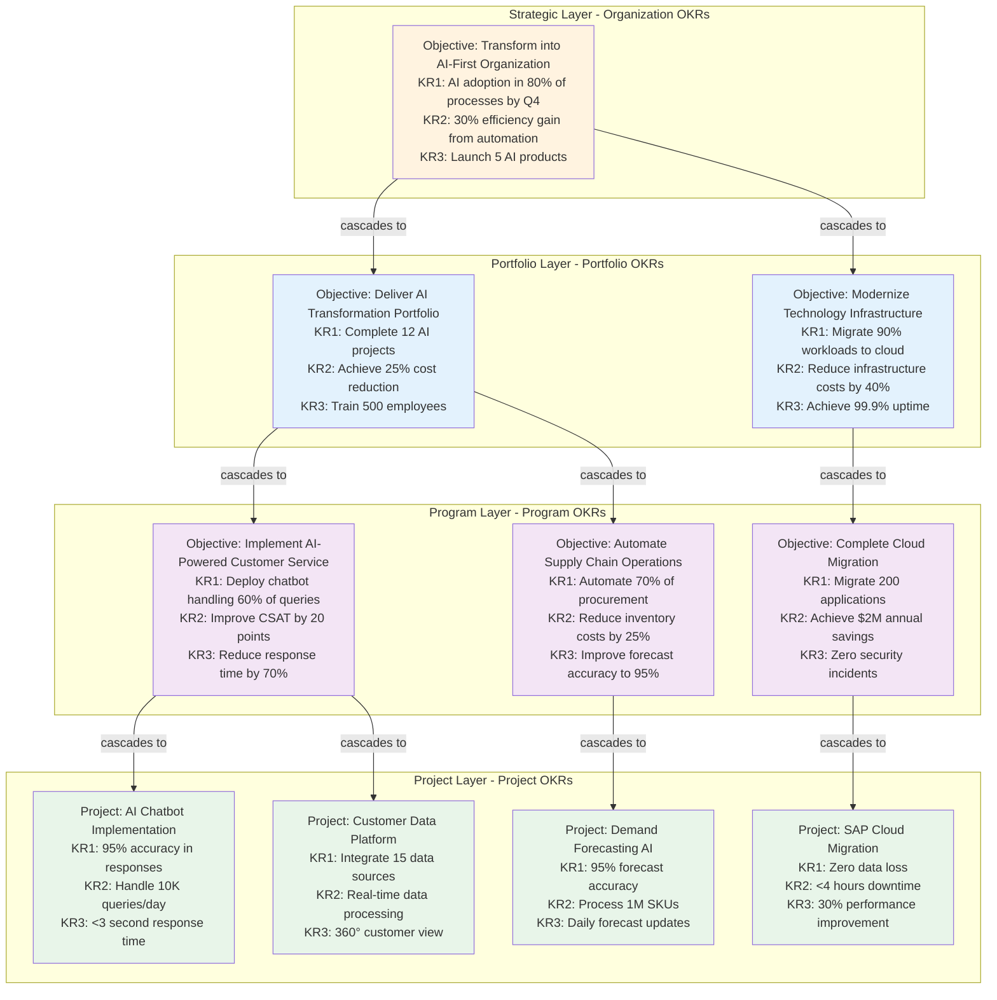

### OKR to Entity Linkage

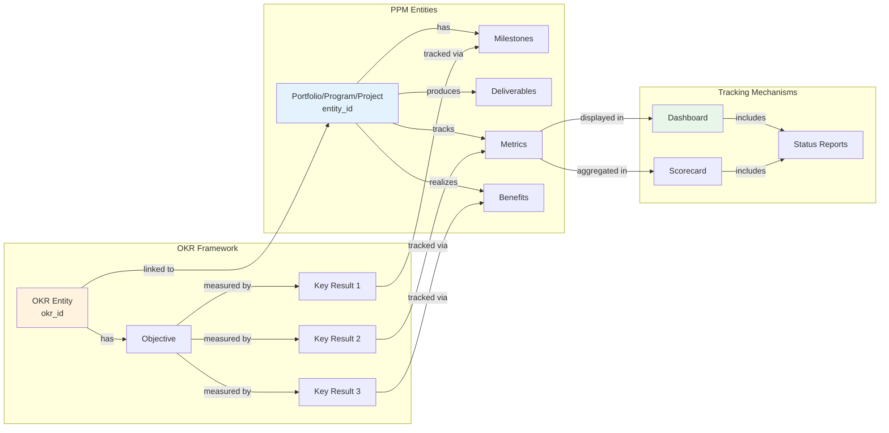

---

## RACI Framework Integration

### RACI Entity Structure

```json
{
  "raci_assignment": {
    "primary_key": "assignment_id",
    "foreign_keys": {
      "org_id": "organization.org_id",
      "entity_id": "ppm_entity.entity_id",
      "stakeholder_id": "stakeholder.stakeholder_id"
    },
    "attributes": {
      "assignment_id": "uuid",
      "org_id": "uuid",
      "entity_id": "uuid",
      "entity_type": "enum[portfolio, program, project, deliverable, milestone, decision]",
      "stakeholder_id": "uuid",
      "responsibility_type": "enum[responsible, accountable, consulted, informed]",
      "scope": "string",
      "activity_area": "enum[planning, execution, monitoring, governance, quality, risk]",
      "delegation_allowed": "boolean",
      "start_date": "date",
      "end_date": "date",
      "status": "enum[active, inactive, completed]",
      "notification_preferences": {
        "frequency": "enum[real_time, daily, weekly]",
        "channels": ["email", "slack", "teams"]
      }
    }
  }
}
```

### RACI Matrix Visualization

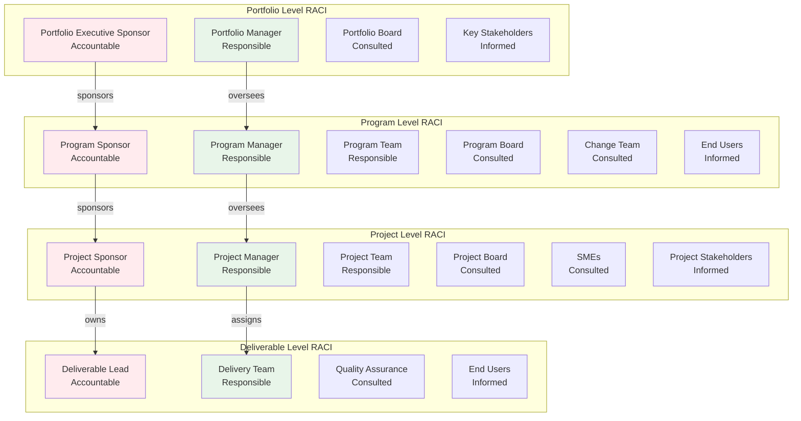

### RACI by Activity Area

```mermaid
graph TD
    subgraph "Portfolio Activities"
        PA1[Strategic Planning]
        PA2[Investment Decisions]
        PA3[Resource Allocation]
        PA4[Performance Review]
    end
    
    subgraph "Program Activities"
        PRA1[Benefits Planning]
        PRA2[Integration Management]
        PRA3[Stakeholder Engagement]
        PRA4[Change Management]
    end
    
    subgraph "Project Activities"
        PJA1[Scope Management]
        PJA2[Schedule Management]
        PJA3[Cost Management]
        PJA4[Quality Management]
        PJA5[Risk Management]
        PJA6[Deliverable Acceptance]
    end
    
    subgraph "RACI Assignments"
        R[Responsible<br/>Does the work]
        A[Accountable<br/>Makes decisions]
        C[Consulted<br/>Provides input]
        I[Informed<br/>Kept updated]
    end
    
    PA1 --> R
    PA1 --> A
    PA2 --> A
    PA3 --> R
    
    PRA1 --> R
    PRA1 --> C
    PRA2 --> R
    PRA3 --> R
    PRA3 --> I
    
    PJA1 --> R
    PJA1 --> A
    PJA2 --> R
    PJA3 --> R
    PJA4 --> C
    PJA5 --> R
    PJA5 --> A
    PJA6 --> A
    PJA6 --> C
    
    style R fill:#e8f5e9
    style A fill:#ffebee
    style C fill:#e3f2fd
    style I fill:#fff3e0
```

### RACI Assignment Flow

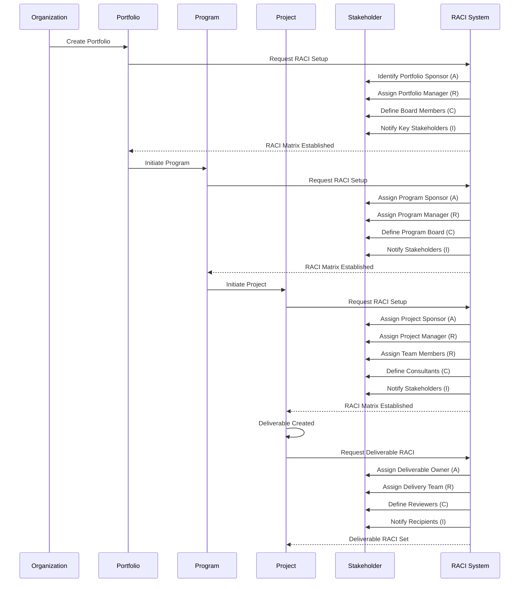

---

## Metrics, Dashboards & Scorecards

### Metrics Framework

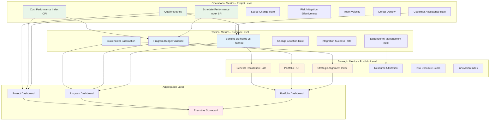

### Dashboard Architecture

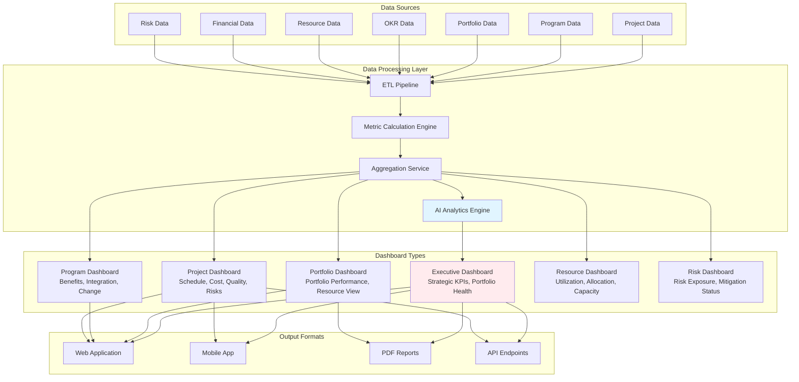

### Scorecard Model

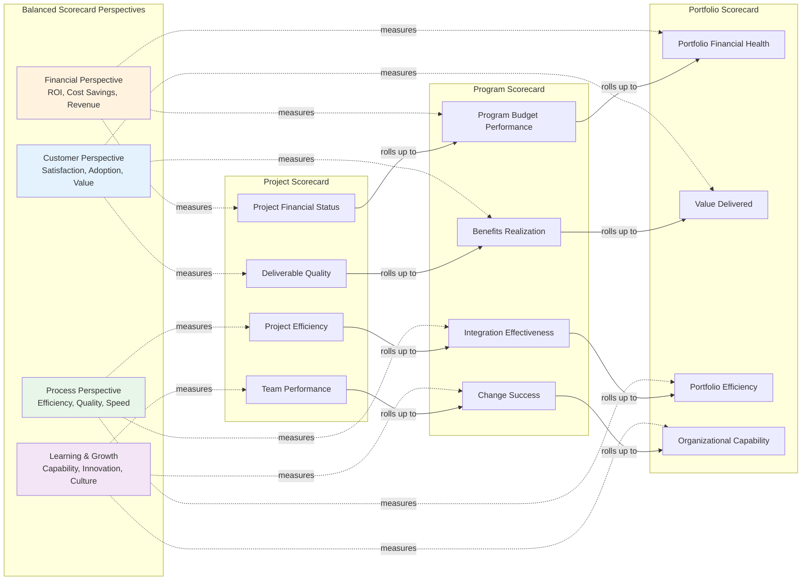

---

## Common Program & Project Outputs

### Output Categories & Hierarchy

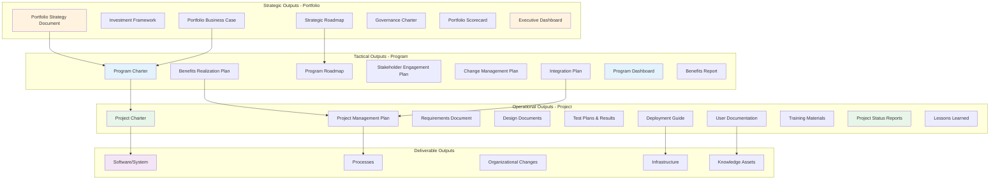

### Metrics Output Matrix

| **Category** | **Portfolio Metrics** | **Program Metrics** | **Project Metrics** | **Frequency** |
|--------------|----------------------|---------------------|---------------------|---------------|
| **Financial** | Portfolio ROI, Total Budget Variance, Cost Avoidance | Program Budget Variance, Benefits Value Delivered, Cost per Benefit | Project Budget Variance, CPI, EAC vs BAC | Monthly |
| **Schedule** | Portfolio Milestone Achievement, On-Time Completion Rate | Program Milestone Status, Phase Gate Success | Schedule Variance, SPI, Critical Path Status | Weekly |
| **Scope** | Strategic Initiative Completion | Benefits Realization %, Scope Change Impact | Scope Change Requests, Requirements Stability | Monthly |
| **Quality** | Portfolio Health Score, Defect Escape Rate | Integration Quality, UAT Success Rate | Defect Density, Test Coverage, Quality Gate Pass Rate | Weekly |
| **Risk** | Portfolio Risk Exposure, Top Risks by Impact | Program Risk Score, Benefit Realization Risks | Project Risk Score, Risk Velocity, Mitigation Effectiveness | Weekly |
| **Resources** | Resource Utilization Rate, Capacity Planning | Program Resource Allocation, Key Resource Availability | Team Velocity, Resource Burndown, Allocation % | Daily/Weekly |
| **Stakeholder** | Executive Satisfaction Score | Stakeholder Engagement Index, Change Adoption Rate | Team Satisfaction, Customer Acceptance Rate | Quarterly |
| **Value** | Strategic Alignment Index, Value Delivered | Benefit Realization Rate, Value Contribution | Deliverable Acceptance Rate, Customer Value Score | Monthly |

### Dashboard Output Specifications

#### 1. Executive Portfolio Dashboard

**Purpose**: Strategic overview for C-suite and executive leadership

**Key Components**:
- Portfolio health heatmap (RAG status)
- Strategic alignment gauge
- Financial summary (budget, spend, forecast)
- Top 10 risks across portfolio
- OKR progress tracker
- Resource utilization summary
- Benefits realization trend
- Investment pipeline

**Update Frequency**: Daily

**Access Level**: Executive, Portfolio Manager

---

#### 2. Portfolio Performance Dashboard

**Purpose**: Detailed portfolio management for Portfolio Managers

**Key Components**:
- Program/project status grid
- Budget performance by program
- Resource allocation matrix
- Risk exposure by category
- Milestone achievement timeline
- Dependency tracker
- Benefits pipeline
- Governance decision log

**Update Frequency**: Real-time

**Access Level**: Portfolio Manager, PMO

---

#### 3. Program Benefits Dashboard

**Purpose**: Track benefits realization for Program Managers

**Key Components**:
- Benefits realization tracker (planned vs actual)
- Benefits dependency map
- Stakeholder value matrix
- Change adoption metrics
- Integration status
- Benefits risk register
- Value stream map
- ROI calculator

**Update Frequency**: Weekly

**Access Level**: Program Manager, Program Sponsor

---

#### 4. Project Execution Dashboard

**Purpose**: Day-to-day project management for Project Managers

**Key Components**:
- Schedule performance (Gantt, burndown)
- Budget tracking (EVM charts)
- Quality metrics (defects, test coverage)
- Risk and issue summary
- Team velocity and capacity
- Deliverable status
- Milestone countdown
- Change request log

**Update Frequency**: Real-time/Daily

**Access Level**: Project Manager, Project Team

---

#### 5. Resource Management Dashboard

**Purpose**: Resource planning and optimization

**Key Components**:
- Resource utilization heatmap
- Capacity vs demand forecast
- Skill matrix and gaps
- Allocation timeline
- Resource conflicts
- Cost per resource type
- Availability calendar
- Onboarding pipeline

**Update Frequency**: Daily

**Access Level**: Resource Manager, Portfolio Manager

---

#### 6. Risk & Compliance Dashboard

**Purpose**: Enterprise risk management across portfolio

**Key Components**:
- Risk exposure matrix (probability/impact)
- Top risks by score
- Risk trend analysis
- Mitigation status tracker
- Compliance status by framework
- Audit findings tracker
- Control effectiveness
- Incident tracking

**Update Frequency**: Weekly

**Access Level**: Risk Manager, Compliance Officer, PMO

---

### Scorecard Output Specifications

#### 1. Portfolio Balanced Scorecard

**Dimensions**:

**Financial Perspective**
- Portfolio ROI: Target 25%, Actual 22%, Trend ↑
- Cost Savings: Target $5M, Actual $4.2M, Trend ↑
- Budget Variance: Target ±5%, Actual +3%, Trend →

**Customer/Stakeholder Perspective**
- Strategic Alignment: Target 90%, Actual 85%, Trend ↑
- Benefits Delivered: Target 100%, Actual 78%, Trend ↑
- Stakeholder Satisfaction: Target 4.5/5, Actual 4.2/5, Trend →

**Internal Process Perspective**
- Project Success Rate: Target 85%, Actual 80%, Trend ↑
- Resource Utilization: Target 85%, Actual 82%, Trend ↑
- Governance Compliance: Target 100%, Actual 95%, Trend ↑

**Learning & Growth Perspective**
- PMO Maturity Level: Target 4, Actual 3, Trend ↑
- Innovation Index: Target 75%, Actual 70%, Trend ↑
- Capability Development: Target 100 trained, Actual 85, Trend ↑

**Output Format**: PDF, PowerPoint, Web Dashboard
**Frequency**: Quarterly
**Audience**: Executive Leadership, Board

---

#### 2. Program Performance Scorecard

**Categories**:

**Benefits Realization**
- Financial Benefits: Target $2M, Actual $1.5M, 75% achieved
- Operational Benefits: 8 of 10 realized
- Strategic Benefits: 5 of 7 realized
- Overall Realization Rate: 73%

**Program Delivery**
- Schedule Adherence: 85% (Target: 90%)
- Budget Performance: CPI 0.92 (Target: 1.0)
- Quality Performance: 88% (Target: 95%)
- Scope Stability: 3 major changes (Target: <2)

**Stakeholder Management**
- Stakeholder Engagement: 82% (Target: 85%)
- Change Adoption: 75% (Target: 80%)
- Satisfaction Score: 4.1/5 (Target: 4.3/5)

**Risk Management**
- Risk Score: 12 (Target: <10)
- Mitigation Effectiveness: 85%
- Issues Closed: 92%

**Output Format**: Excel, PDF, Dashboard Widget
**Frequency**: Monthly
**Audience**: Program Board, Program Sponsor

---

#### 3. Project Health Scorecard

**Health Indicators**:

**Schedule Health** (Amber)
- SPI: 0.88 (behind schedule)
- Milestones on track: 7 of 10
- Critical path buffer: 5 days consumed

**Cost Health** (Green)
- CPI: 1.05 (under budget)
- Budget variance: -$50K (favorable)
- Forecast at completion: On target

**Scope Health** (Amber)
- Requirements stability: 85%
- Change requests: 12 (8 approved)
- Scope creep index: 8%

**Quality Health** (Green)
- Defect density: 2.1 per KLOC (Target: <3)
- Test coverage: 92% (Target: 90%)
- Customer acceptance: 95%

**Risk Health** (Red)
- High risks: 3 (Target: 0)
- Medium risks: 8
- Risk score: 18 (Target: <12)
- Mitigation overdue: 2

**Team Health** (Green)
- Velocity: On target
- Morale score: 4.3/5
- Turnover: 0%

**Overall Project RAG**: Amber

**Output Format**: PowerPoint, PDF, Email Summary
**Frequency**: Weekly
**Audience**: Project Board, Project Sponsor

---

### Standard Report Outputs

#### Portfolio Level Reports

1. **Portfolio Status Report** (Monthly)
   - Executive summary
   - Portfolio health overview
   - Financial performance
   - Strategic alignment status
   - Top risks and issues
   - Resource utilization
   - Key decisions required

2. **Investment Review Report** (Quarterly)
   - Portfolio composition analysis
   - Value delivery assessment
   - ROI analysis by program
   - Resource allocation effectiveness
   - Strategic recommendations
   - Pipeline review

3. **Benefits Realization Report** (Quarterly)
   - Aggregate benefits delivered
   - Benefits by type and program
   - Realization trajectory
   - Benefits at risk
   - Value contribution analysis
   - Lessons learned

4. **Portfolio Risk Report** (Monthly)
   - Consolidated risk register
   - Risk heat map
   - Top 10 enterprise risks
   - Risk trend analysis
   - Mitigation status
   - Emerging risks

#### Program Level Reports

1. **Program Status Report** (Bi-weekly)
   - Program overview
   - Benefits update
   - Component project status
   - Stakeholder engagement
   - Change management progress
   - Risks and issues
   - Decisions and actions

2. **Benefits Tracking Report** (Monthly)
   - Benefits realization dashboard
   - Benefits by category
   - Dependency status
   - Forecast to target
   - Benefit risk assessment
   - Recommendations

3. **Integration Status Report** (Weekly)
   - Integration activities status
   - Dependency management
   - Interface issues
   - Cross-project coordination
   - Blockers and impediments

4. **Change Management Report** (Monthly)
   - Change readiness assessment
   - Adoption metrics
   - Resistance management
   - Training completion
   - Communication effectiveness
   - Stakeholder feedback

#### Project Level Reports

1. **Project Status Report** (Weekly)
   - Executive summary (RAG status)
   - Accomplishments
   - Schedule status (SPI, milestones)
   - Budget status (CPI, variance)
   - Quality metrics
   - Risks and issues
   - Upcoming activities
   - Help needed

2. **Milestone Report** (Event-based)
   - Milestone achievement summary
   - Success criteria assessment
   - Lessons learned
   - Impact on schedule
   - Next milestone preview

3. **Risk & Issue Report** (Weekly)
   - Active risks register
   - Risk score changes
   - New risks identified
   - Mitigation status
   - Open issues
   - Issue resolution timeline

4. **Quality Report** (Weekly/Sprint)
   - Test results summary
   - Defect metrics
   - Code quality metrics
   - Test coverage
   - Quality gate status
   - Quality trends

5. **Resource Report** (Weekly)
   - Team allocation
   - Velocity and capacity
   - Resource conflicts
   - Skill gaps
   - Upcoming resource needs

6. **Lessons Learned Report** (Project Close)
   - What went well
   - What could be improved
   - Key learnings
   - Recommendations
   - Best practices identified
   - Knowledge assets created

---

### Metric Calculation Specifications

#### Schedule Performance Index (SPI)
```
SPI = Earned Value (EV) / Planned Value (PV)
Where:
- EV = % Complete × Budget at Completion
- PV = Planned % Complete × Budget at Completion
- SPI > 1.0 = Ahead of schedule
- SPI = 1.0 = On schedule
- SPI < 1.0 = Behind schedule
```

#### Cost Performance Index (CPI)
```
CPI = Earned Value (EV) / Actual Cost (AC)
Where:
- EV = % Complete × Budget at Completion
- AC = Actual costs incurred to date
- CPI > 1.0 = Under budget
- CPI = 1.0 = On budget
- CPI < 1.0 = Over budget
```

#### Benefits Realization Rate
```
BRR = (Actual Benefits Delivered / Target Benefits) × 100%
Where:
- Actual Benefits = Sum of realized benefits (financial + non-financial)
- Target Benefits = Sum of planned benefits
- BRR ≥ 100% = Benefits targets met/exceeded
- BRR < 100% = Benefits shortfall
```

#### Resource Utilization Rate
```
RUR = (Allocated Hours / Available Hours) × 100%
Where:
- Allocated Hours = Sum of hours allocated to projects
- Available Hours = Total capacity hours available
- RUR 75-85% = Optimal utilization
- RUR > 90% = Over-utilization risk
- RUR < 70% = Under-utilization
```

#### Strategic Alignment Index
```
SAI = Σ(Project Value × Strategic Weight) / Total Portfolio Value
Where:
- Project Value = Budget or strategic importance score
- Strategic Weight = Alignment score (0-1) to strategic objectives
- SAI > 0.8 = High strategic alignment
- SAI 0.6-0.8 = Moderate alignment
- SAI < 0.6 = Low alignment - review required
```

#### Risk Exposure Score
```
RES = Σ(Risk Probability × Risk Impact × Risk Count)
Where:
- Probability: Very Low (1) to Very High (5)
- Impact: Very Low (1) to Very High (5)
- RES < 50 = Low exposure
- RES 50-100 = Moderate exposure
- RES > 100 = High exposure - escalate
```

---

## Implementation Guidelines

### Module Deployment Phases

```mermaid
graph LR
    subgraph "Phase 1: Foundation - Months 1-3"
        P1A[Setup Core Entities<br/>Org, Portfolio, Program, Project]
        P1B[Implement Base Schema]
        P1C[Configure Governance]
        P1D[Deploy Basic Dashboards]
    end
    
    subgraph "Phase 2: Integration - Months 4-6"
        P2A[Integrate OKR Framework]
        P2B[Implement RACI System]
        P2C[Connect Documents]
        P2D[Enable Resource Management]
    end
    
    subgraph "Phase 3: Analytics - Months 7-9"
        P3A[Deploy Advanced Metrics]
        P3B[Build Scorecards]
        P3C[Implement AI Analytics]
        P3D[Enable Predictive Insights]
    end
    
    subgraph "Phase 4: Optimization - Months 10-12"
        P4A[Agentic Workflows]
        P4B[Automated Governance]
        P4C[ML Model Training]
        P4D[Continuous Improvement]
    end
    
    P1A --> P1B --> P1C --> P1D
    P1D --> P2A
    P2A --> P2B --> P2C --> P2D
    P2D --> P3A
    P3A --> P3B --> P3C --> P3D
    P3D --> P4A
    P4A --> P4B --> P4C --> P4D
    
    style P1A fill:#e8f5e9
    style P2A fill:#e3f2fd
    style P3A fill:#fff3e0
    style P4A fill:#f3e5f5
```

### Integration Architecture

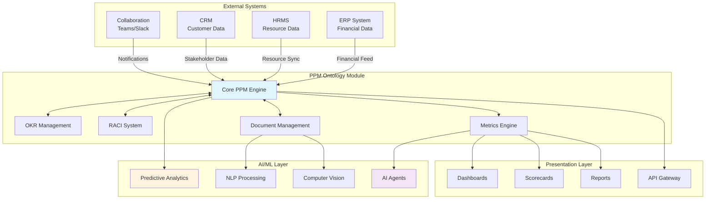

### Data Flow Architecture

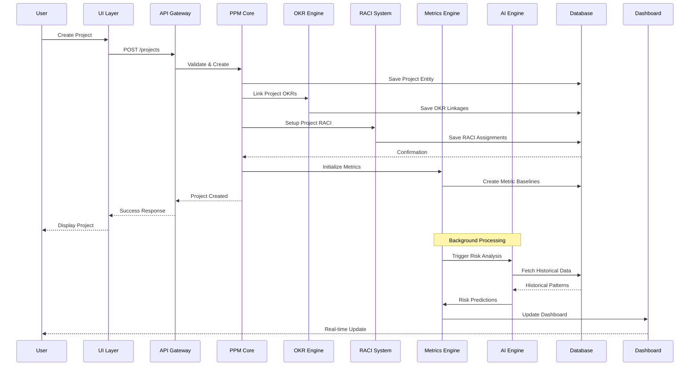

### Key Implementation Considerations

#### 1. **Data Migration Strategy**
- Map existing project data to consolidated schema
- Preserve historical metrics and performance data
- Migrate documents with proper classification
- Validate RACI assignments during migration
- Test OKR linkages post-migration

#### 2. **Security & Access Control**
- Implement org_id-based multi-tenancy
- Role-based access control (RBAC) aligned with RACI
- Document-level security based on classification
- Audit logging for all changes
- Encryption at rest and in transit

#### 3. **Integration Points**
- REST API for external system integration
- Webhook support for event-driven updates
- SSO/SAML for authentication
- OAuth for third-party integrations
- GraphQL for flexible data queries

#### 4. **Performance Optimization**
- Database indexing on org_id, entity_type, status
- Caching layer for frequently accessed data
- Async processing for metrics calculation
- Real-time updates via WebSockets
- CDN for dashboard assets

#### 5. **AI Model Training**
- Collect sufficient historical data (minimum 2 years)
- Label data for supervised learning
- Implement feedback loops for model improvement
- A/B test predictions before full deployment
- Monitor model drift and retrain quarterly

---

## Conclusion

This PPM Ontology Module provides a comprehensive, organization-centric framework that:

✅ **Unifies** portfolio, program, and project management in a single schema
✅ **Aligns** strategic objectives (OKRs) with execution (projects)
✅ **Clarifies** accountability through integrated RACI framework
✅ **Enables** data-driven decision making with standardized metrics
✅ **Delivers** actionable insights through dashboards and scorecards
✅ **Scales** across multiple organizations with org_id multi-tenancy
✅ **Supports** AI automation and predictive analytics
✅ **Complies** with schema.org standards for enhanced discoverability

The module is designed for progressive implementation, starting with core PPM entities and expanding to advanced analytics and AI-driven automation. Each phase builds on the previous, ensuring continuous value delivery while maintaining data integrity and organizational alignment.

---

**Document Version**: 2.0
**Last Updated**: 2025-01-01
**Maintained By**: PPM Architecture Team
**Review Cycle**: Quarterly