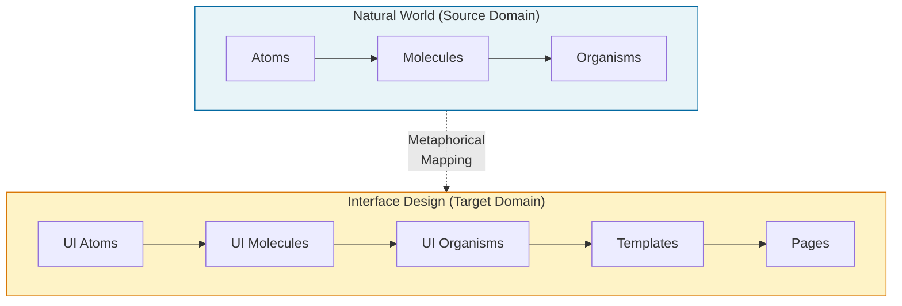
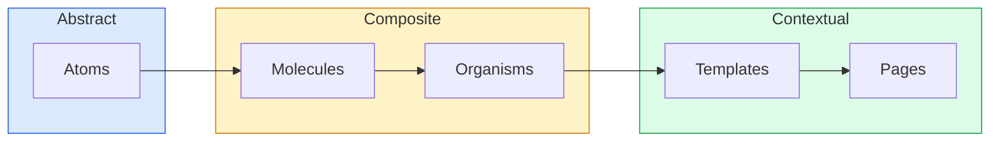
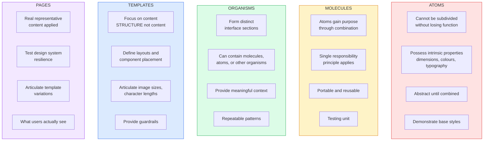
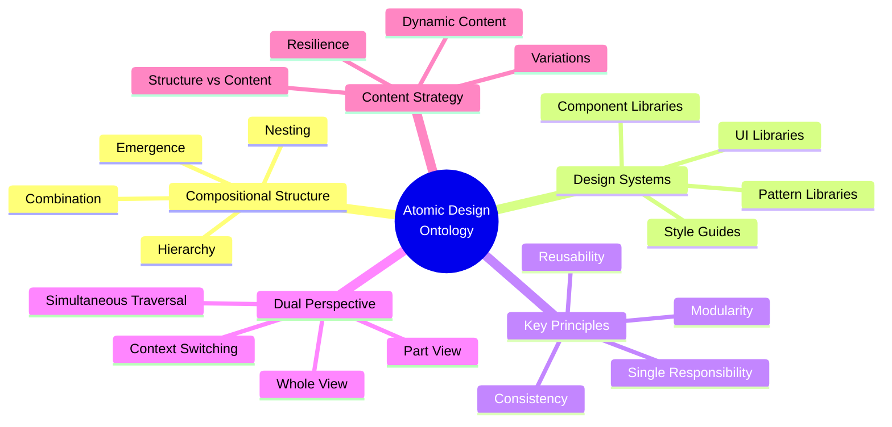
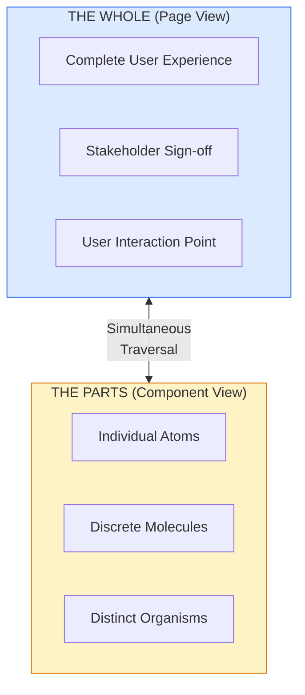
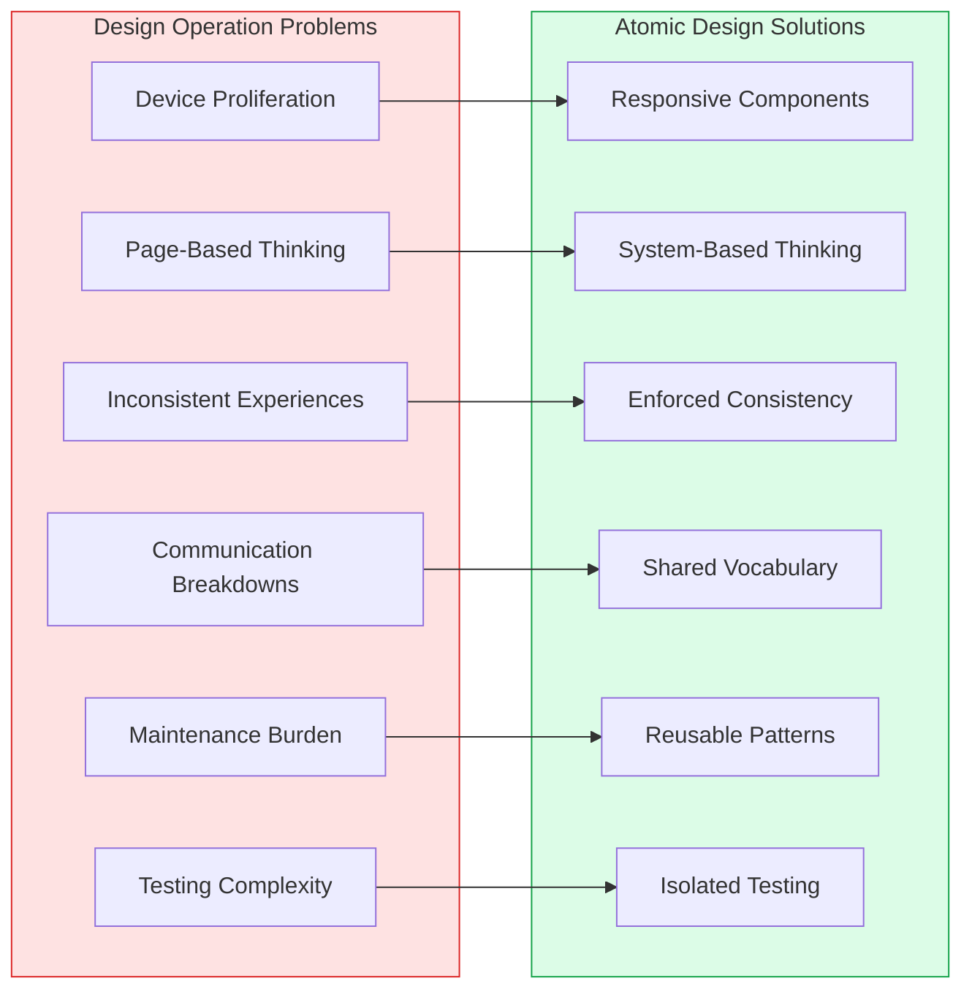
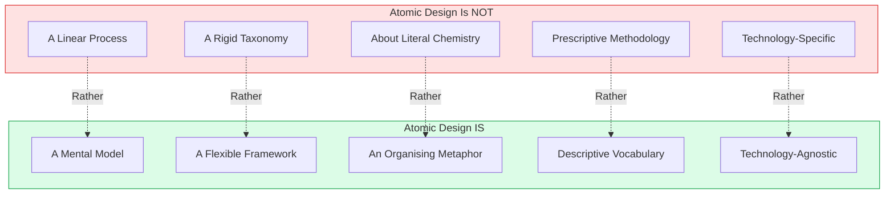
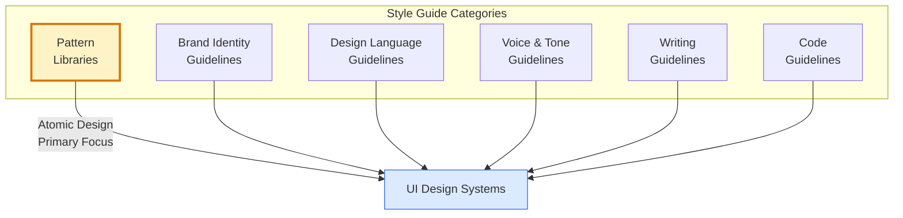
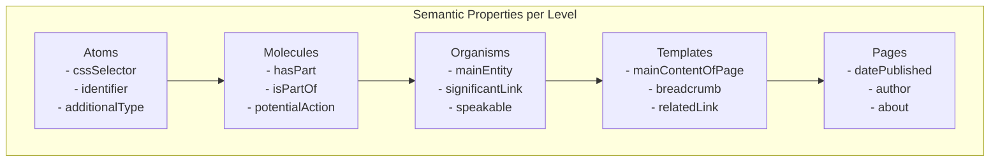
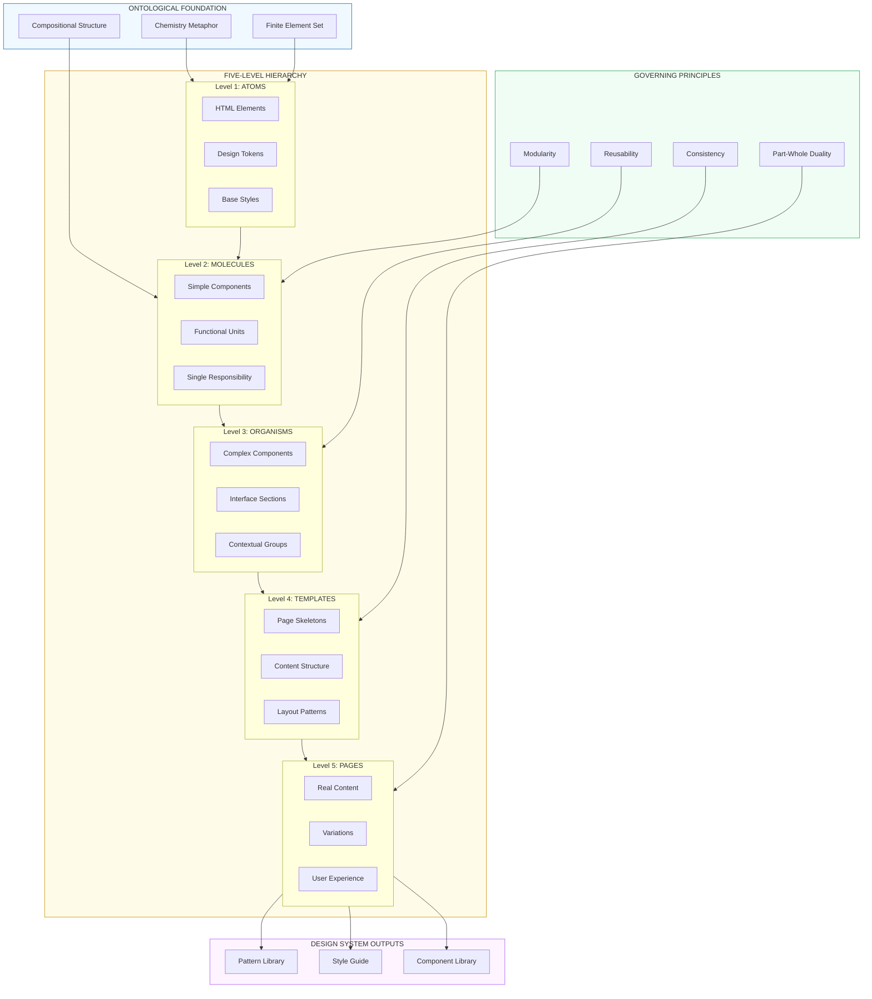

# Atomic Design Core Ontology Map

## Original Concepts, Relevance & Purpose

**Source:** Brad Frost, *Atomic Design* (2016)  
**Version:** 1.0.0  
**Date:** December 2025

---

## 1. Ontological Foundation

### 1.1 Core Metaphor: Chemistry → Interface Design

Brad Frost's atomic design draws its conceptual framework from chemistry and the natural world. The fundamental insight is that **interfaces, like matter, can be broken down into finite elemental building blocks** that combine to form increasingly complex structures.

### 1.2 The Ontological Claim

> "All matter in the universe can be broken down into a finite set of atomic elements... our interfaces can be broken down into a similar finite set of elements."
> — Brad Frost

This is a **structural ontology**: it asserts that user interfaces possess an inherent compositional structure analogous to physical matter. The Periodic Table of HTML Elements (Josh Duck) demonstrates that all web interfaces are composed from the same ~100 HTML elements.

---

## 2. The Five-Stage Hierarchy

### 2.1 Ontological Structure

Atomic design defines five **ontological levels** that exist simultaneously, not sequentially:

| Level | Definition | Characteristics | Example |
|-------|------------|-----------------|---------|
| **Atoms** | UI elements that cannot be broken down further without losing functionality | Foundational, abstract, context-independent | Label, Input, Button, Heading |
| **Molecules** | Simple groups of atoms functioning as a unit | Purposeful, portable, reusable | Search form (label + input + button) |
| **Organisms** | Complex components composed of molecules and/or atoms | Section-forming, context-providing | Header (logo + nav + search) |
| **Templates** | Page-level structures defining content layout | Skeletal, structural, content-agnostic | Homepage layout with placeholder content |
| **Pages** | Specific template instances with real content | Concrete, testable, user-facing | Actual homepage with real text/images |

### 2.2 Ontological Properties by Level

---

## 3. Core Ontological Concepts

### 3.1 Concept Taxonomy

### 3.2 Core Concept Definitions

| Concept | Definition | Ontological Role |
|---------|------------|------------------|
| **Modularity** | Breaking interfaces into discrete, reusable components | Foundation principle enabling composition |
| **Hierarchy** | Ordered levels from simple to complex | Structural organisation of the ontology |
| **Composition** | Combining simpler elements into complex structures | Mechanism of level transitions |
| **Emergence** | New properties arising from combination | Molecules gain purpose atoms lack |
| **Single Responsibility** | Components should do one thing well | Quality constraint on molecules |
| **Reusability** | Components usable across contexts | Economic value proposition |
| **Consistency** | Uniform behaviour and appearance | User experience outcome |
| **Traversal** | Moving between abstract and concrete views | Designer/developer workflow capability |

---

## 4. The Part-Whole Relationship

### 4.1 Bidirectional Perspective

A key ontological insight is the ability to view interfaces as **both a cohesive whole AND a collection of parts simultaneously**:

> "We can simultaneously see our interfaces broken down to their atomic elements and also see how those elements combine together to form our final experiences."
> — Brad Frost

### 4.2 The Painter Analogy (Frank Chimero)

Frost quotes Frank Chimero's description of how painters work:

- **Distance from easel:** Assess and analyse the whole
- **Close to canvas:** Make individual marks
- **The dance:** Pitter-patter pacing between contexts
- **Result:** Tight feedback loop between mark-making and mark-assessing

This maps directly to atomic design's value: enabling designers to zoom between atomic details and page-level composition fluidly.

---

## 5. Purpose & Relevance

### 5.1 Problems Addressed

### 5.2 Value Propositions

| Value | Description | Beneficiary |
|-------|-------------|-------------|
| **Consistency** | Uniform look and feel across touchpoints | Users, Brands |
| **Shared Vocabulary** | Common language for components | Teams, Disciplines |
| **Education** | Demonstrates systems thinking to stakeholders | Clients, Organisations |
| **Empathy** | Forces consideration of broader system impact | Designers, Developers |
| **Testing** | Components can be tested in isolation | QA, Development |
| **Speed** | Reusable components accelerate development | Projects, Business |
| **Longevity** | Systems improve over time with iteration | Long-term maintenance |

### 5.3 What Atomic Design Is NOT

---

## 6. Relationship to Design Systems

### 6.1 Style Guide Taxonomy

Frost identifies multiple types of style guides that atomic design relates to:

### 6.2 Pattern Library as Central Artefact

The **pattern library** (also called front-end style guide, UI library, component library) is the primary deliverable of atomic design thinking:

| Characteristic | Purpose |
|----------------|---------|
| Documents all components | Reference for team |
| Shows components in isolation | Testing and review |
| Demonstrates variations | Edge case handling |
| Provides usage guidelines | Governance |
| Enables component discovery | Reuse promotion |

---

## 7. Semantic Mapping to schema.org

### 7.1 Potential Schema.org Alignments

For ontology-driven implementations, atomic design concepts can map to schema.org structures:

| Atomic Design Concept | schema.org Type | Relationship |
|-----------------------|-----------------|--------------|
| Atom | `WebPageElement` | Base UI element |
| Molecule | `WebPageElement` (composite) | Functional grouping |
| Organism | `WPHeader`, `WPFooter`, `WPSideBar` | Semantic sections |
| Template | `WebPage` (abstract) | Page structure |
| Page | `WebPage` (instance) | Concrete page |
| Pattern Library | `CollectionPage` | Component collection |
| Design System | `CreativeWork` | Documented system |

### 7.2 Semantic Properties

---

## 8. Ontology Diagram: Complete Structure

### 8.1 Full Atomic Design Ontology

---

## 9. Key Quotations (Ontological Significance)

### 9.1 On the Core Insight

> "We're not designing pages, we're designing systems of components."
> — Stephen Hay

### 9.2 On Structure vs Content

> "You can create good experiences without knowing the content. What you can't do is create good experiences without knowing your content structure."
> — Mark Boulton

### 9.3 On Mental Model

> "Atomic design is not a linear process, but rather a mental model to help us think of our user interfaces as both a cohesive whole and a collection of parts at the same time."
> — Brad Frost

### 9.4 On Custom Systems

> "It's not necessarily about using Bootstrap for every client, but rather creating 'tiny Bootstraps for every client.'"
> — Dave Rupert

### 9.5 On the Machine

> "The hard part is building the machine that builds the product."
> — Dennis Crowley

---

## 10. Summary: Core Ontological Claims

### 10.1 Fundamental Assertions

1. **Finite Element Set:** All interfaces are composed from a finite set of HTML elements
2. **Compositional Hierarchy:** Simple elements combine to form complex structures
3. **Emergent Properties:** Combinations gain properties their parts lack
4. **Part-Whole Duality:** Interfaces exist simultaneously as wholes and collections of parts
5. **Structure over Content:** Templates define structure independent of specific content
6. **System over Page:** Design systems, not individual pages, are the unit of design

### 10.2 Ontological Contribution

Atomic design provides a **structural ontology for user interface composition** that:

- Names and categorises levels of UI abstraction
- Establishes a shared vocabulary for cross-disciplinary teams
- Creates a mental model for traversing between abstract and concrete
- Enables systematic approaches to design, development, and testing
- Supports long-term maintenance and evolution of design systems

---

## Appendix A: Glossary

| Term | Definition |
|------|------------|
| **Atom** | Smallest functional UI element |
| **Molecule** | Simple combination of atoms with unified purpose |
| **Organism** | Complex component forming interface section |
| **Template** | Page-level layout with placeholder content |
| **Page** | Template instance with real content |
| **Pattern Library** | Documented collection of UI patterns |
| **Design System** | Comprehensive set of design standards and components |
| **Modularity** | Principle of breaking systems into discrete parts |
| **Traversal** | Movement between abstract and concrete views |
| **Emergence** | Properties arising from combination that parts lack individually |

---

## Appendix B: References

- Frost, Brad. *Atomic Design*. Self-published, 2016.
- Duck, Josh. "Periodic Table of HTML Elements"
- Chimero, Frank. *The Shape of Design*
- Boulton, Mark. "Structure First. Content Always."
- Hay, Stephen. On responsive design systems
- Rupert, Dave. "Tiny Bootstraps for Every Client"
- Warren, Samantha. Style Tiles methodology
- Mall, Dan. Element Collages concept
- Debenham, Anna. *Front-End Style Guides*

---

*Document Version: 1.0.0 | December 2025*
