# PF-Core Frontend FIGMA: 2 Architecture & Design Principles

## 📐 Document Overview

**Purpose:** Comprehensive reference for understanding Figma design system architecture, atomic design implementation, node-based structure, and integration patterns with Claude Code SDK.

**Audience:** 
- Design System Architects
- Senior Designers
- Frontend Architects
- AI/Agentic Development Teams

**Schema.org Compliance:** All components map to Schema.org types for machine-readable, semantic HTML generation.

---

## Table of Contents

1. [Core Architecture Principles](#core-architecture-principles)
2. [Figma Node System Explained](#figma-node-system-explained)
3. [Token Architecture & Inheritance](#token-architecture--inheritance)
4. [Atomic Design Implementation](#atomic-design-implementation)
5. [Multi-Brand Mode Strategy](#multi-brand-mode-strategy)
6. [Component Design Patterns](#component-design-patterns)
7. [Code Generation Pipeline](#code-generation-pipeline)
8. [Integration Architecture](#integration-architecture)
9. [Scalability & Governance](#scalability--governance)

---

## Core Architecture Principles

### 1. Single Source of Truth (SSOT)

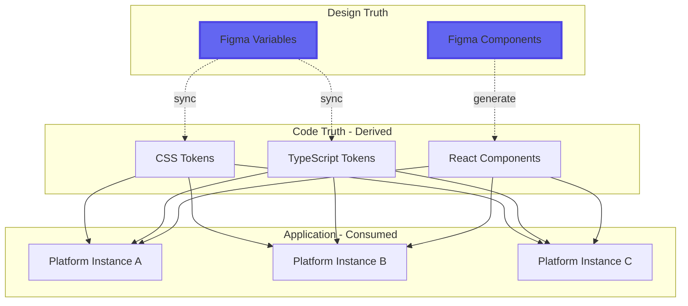

**Principle:** Design decisions made in Figma cascade automatically to code. Never the reverse.

**Benefits:**
- Designers own the source of truth
- Developers consume, not create, design tokens
- Single update propagates everywhere
- No design-code drift

**Anti-Pattern to Avoid:**
```
❌ Developer creates custom color in code → Designer unaware
✅ Designer adds color to Figma → Auto-exported to code
```

---

### 2. Semantic Naming Over Value-Based Naming

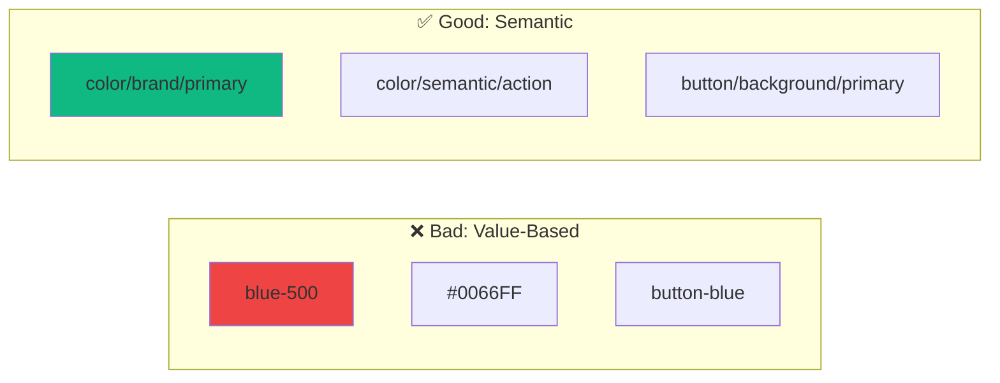

**Why Semantic Naming?**

| Value-Based | Semantic | Benefit |
|-------------|----------|---------|
| `blue-500` | `color/brand/primary` | Can change blue → orange without renaming |
| `font-16` | `typography/fontSize/base` | Can change 16px → 18px without breaking |
| `spacing-20` | `spacing/content/gap` | Meaning preserved across updates |

**Example Evolution:**
```
Launch:    color/brand/primary = #0066FF (blue)
Rebrand:   color/brand/primary = #FF5500 (orange)
Result:    All buttons automatically orange, no code changes
```

---

### 3. Inheritance & Fallback Model

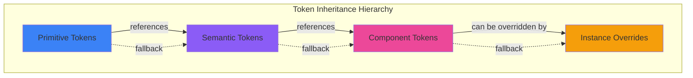

**Inheritance Rules:**

1. **Primitive Tokens** (bottom layer)
   - Raw values only
   - Defined once in PF-Core
   - Can be overridden in Instance modes
   - Example: `color/brand/blue/500 = #0066FF`

2. **Semantic Tokens** (middle layer)
   - Reference primitive tokens
   - Rarely overridden
   - Example: `color/semantic/action → color/brand/blue/500`

3. **Component Tokens** (top layer)
   - Reference semantic tokens
   - Never overridden (always inherit)
   - Example: `button/background/primary → color/semantic/action`

4. **Instance Overrides**
   - Only override primitives
   - Cascades through semantic → component
   - Example: Instance-A sets `color/brand/blue/500 = #FF5500`

**Visual Example:**

```
PF-Core Mode:
  color/brand/blue/500 = #0066FF
  color/semantic/action → color/brand/blue/500 (inherits #0066FF)
  button/background/primary → color/semantic/action (inherits #0066FF)

Instance-A Mode:
  color/brand/blue/500 = #FF5500 (OVERRIDE)
  color/semantic/action → color/brand/blue/500 (now inherits #FF5500)
  button/background/primary → color/semantic/action (now inherits #FF5500)

Result: All buttons instantly orange in Instance-A
```

---

### 4. Separation of Structure from Content

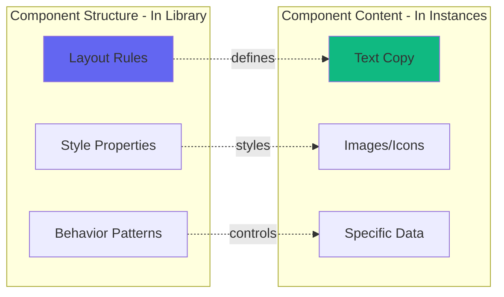

**Implementation:**

**Structure (Master Component):**
- Auto Layout rules
- Padding/spacing references
- Color variable references
- Typography style references
- Component properties (boolean, instance swap)

**Content (Component Instance):**
- Actual text strings
- Specific images/icons
- State-specific data

**Example: Card Component**

```
Master Component Properties:
- Layout: Auto Layout, vertical, 16px gap
- Background: variable → card/background/default
- Border: variable → card/border/default
- Padding: variable → spacing/4
- Boolean: showImage
- Instance Swap: image
- Instance Swap: primaryAction

Component Instance:
- showImage: true
- image: [specific product photo]
- title: "Premium Widget"
- description: "The best widget ever made"
- primaryAction: Button with text "Buy Now"
```

---

## Figma Node System Explained

### What is a Figma Node?

A **node** is the fundamental unit in Figma's document object model. Every element—frames, components, text layers, groups—is a node with:
- Unique identifier (nodeId): `123:456`
- Type: FRAME, COMPONENT, INSTANCE, TEXT, VECTOR, etc.
- Properties: position, size, fills, effects, constraints
- Relationships: parent, children, siblings

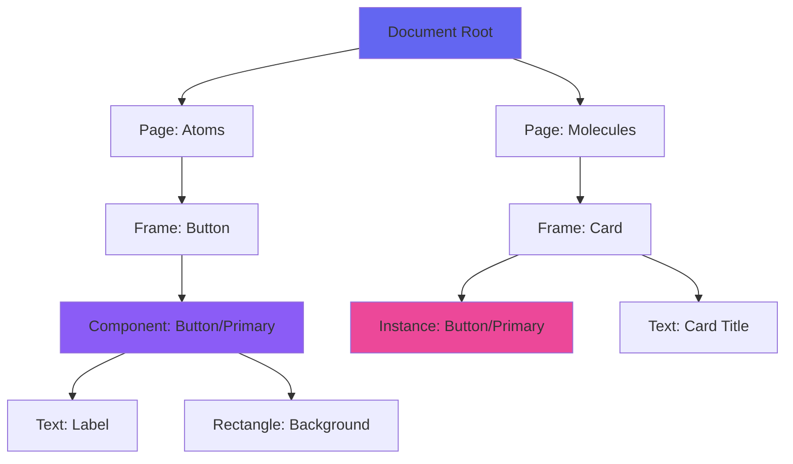

### Node Hierarchy in Design System

```
Document
└── Canvas (Page: Atomic Components)
    └── FRAME node (nodeId: 0:123)
        └── COMPONENT node (nodeId: 123:456) ← Button Master
            ├── TEXT node (nodeId: 123:457) ← Label
            └── RECTANGLE node (nodeId: 123:458) ← Background
└── Canvas (Page: Templates)
    └── FRAME node (nodeId: 0:500)
        └── INSTANCE node (nodeId: 500:501) ← Button Instance
            └── References: 123:456 (master component)
```

### Node Types in Design Systems

| Node Type | Purpose | Example | MCP Tool Access |
|-----------|---------|---------|-----------------|
| **COMPONENT** | Master definition | Button master | ✅ get_design_context |
| **INSTANCE** | Component reference | Button on a page | ✅ get_design_context |
| **COMPONENT_SET** | Variant container | Button variants | ✅ get_design_context |
| **FRAME** | Layout container | Card body | ✅ get_design_context |
| **TEXT** | Text content | Heading | ✅ get_design_context |
| **VECTOR** | Icon/shape | Icon | ✅ get_design_context |
| **GROUP** | Logical grouping | Icon + Label | ✅ get_design_context |

### NodeId Format & Usage

**URL Format:** `https://figma.com/design/FILE_KEY/File-Name?node-id=123-456`
**API Format:** `123:456`

**Conversion:**
```javascript
// URL to API
'123-456' → '123:456'

// Extract from URL
const url = 'https://figma.com/design/abc123/MyFile?node-id=10-20';
const nodeId = url.match(/node-id=(\d+)-(\d+)/);
const apiFormat = `${nodeId[1]}:${nodeId[2]}`; // "10:20"
```

### Node Relationships for Code Generation

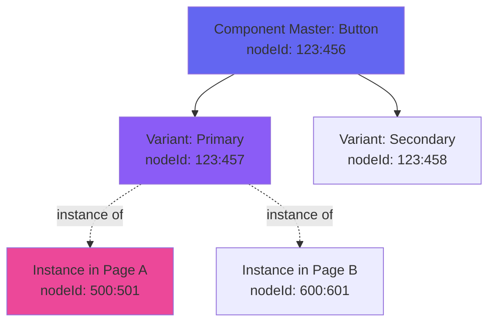

**Key Insight:** When fetching design context for code generation:
- Fetch the **COMPONENT node** (master) to get structure
- Instance nodes automatically reference the master's properties
- Variants are children of the COMPONENT_SET

---

## Token Architecture & Inheritance

### Complete Token Taxonomy

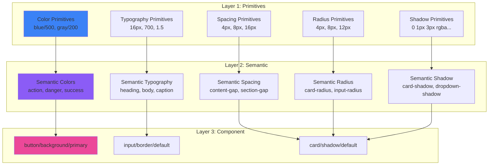

### Primitive Token Structure

**Color Primitives:**
```
color/
  brand/
    blue/
      50   → #EFF6FF (lightest)
      100  → #DBEAFE
      200  → #BFDBFE
      300  → #93C5FD
      400  → #60A5FA
      500  → #0066FF (base)
      600  → #0052CC
      700  → #003D99
      800  → #002966
      900  → #001433 (darkest)
  neutral/
    gray/
      50-900 (same pattern)
```

**Typography Primitives:**
```
typography/
  fontFamily/
    primary   → "Inter, system-ui, sans-serif"
    secondary → "Roboto, sans-serif"
    mono      → "Fira Code, monospace"
  fontSize/
    xs   → 12px
    sm   → 14px
    base → 16px
    lg   → 18px
    xl   → 20px
    2xl  → 24px
    3xl  → 30px
    4xl  → 36px
    5xl  → 48px
    6xl  → 60px
  fontWeight/
    regular  → 400
    medium   → 500
    semibold → 600
    bold     → 700
    black    → 900
  lineHeight/
    tight  → 1.25
    snug   → 1.375
    normal → 1.5
    relaxed → 1.625
    loose  → 2
```

**Spacing Primitives (4px base):**
```
spacing/
  1   → 4px
  2   → 8px
  3   → 12px
  4   → 16px
  5   → 20px
  6   → 24px
  8   → 32px
  10  → 40px
  12  → 48px
  16  → 64px
  20  → 80px
  24  → 96px
```

### Semantic Token Mapping

**Semantic Colors:**
```
color/semantic/
  action/
    base      → color/brand/blue/500
    hover     → color/brand/blue/600
    active    → color/brand/blue/700
    disabled  → color/neutral/gray/300
  danger/
    base      → #DC2626
    hover     → #B91C1C
    light     → #FEE2E2
  success/
    base      → #10B981
    hover     → #059669
    light     → #D1FAE5
  warning/
    base      → #F59E0B
    hover     → #D97706
    light     → #FEF3C7
  info/
    base      → color/brand/blue/500
    light     → color/brand/blue/50
  surface/
    background  → #FFFFFF
    foreground  → color/neutral/gray/900
    muted       → color/neutral/gray/50
    border      → color/neutral/gray/200
```

**Semantic Typography:**
```
typography/semantic/
  heading/
    h1/size        → typography/fontSize/4xl
    h1/weight      → typography/fontWeight/bold
    h1/lineHeight  → typography/lineHeight/tight
    h2/size        → typography/fontSize/3xl
    h2/weight      → typography/fontWeight/bold
    ...
  body/
    base/size       → typography/fontSize/base
    base/weight     → typography/fontWeight/regular
    base/lineHeight → typography/lineHeight/normal
    large/size      → typography/fontSize/lg
    small/size      → typography/fontSize/sm
  label/
    size       → typography/fontSize/sm
    weight     → typography/fontWeight/medium
    lineHeight → typography/lineHeight/tight
```

### Component Token Mapping

**Button Component:**
```
button/
  background/
    primary     → color/semantic/action/base
    secondary   → color/surface/muted
    tertiary    → transparent
    destructive → color/semantic/danger/base
    ghost       → transparent
  text/
    primary     → #FFFFFF
    secondary   → color/semantic/action/base
    tertiary    → color/surface/foreground
    destructive → #FFFFFF
    ghost       → color/semantic/action/base
  border/
    default     → color/surface/border
    hover       → color/semantic/action/base
  shadow/
    default     → shadow/sm
    hover       → shadow/md
  spacing/
    padding-x/small  → spacing/3
    padding-x/medium → spacing/4
    padding-x/large  → spacing/6
    padding-y/small  → spacing/2
    padding-y/medium → spacing/2
    padding-y/large  → spacing/3
  radius/
    default     → radius/md
```

**Input Component:**
```
input/
  background/
    default  → color/surface/background
    disabled → color/surface/muted
    focus    → color/surface/background
    error    → color/semantic/danger/light
  border/
    default  → color/surface/border
    focus    → color/semantic/action/base
    error    → color/semantic/danger/base
    disabled → color/neutral/gray/200
  text/
    default     → color/surface/foreground
    placeholder → color/neutral/gray/400
    disabled    → color/neutral/gray/400
  spacing/
    padding-x → spacing/3
    padding-y → spacing/2
  radius/
    default → radius/md
```

### Mode-Based Override Strategy

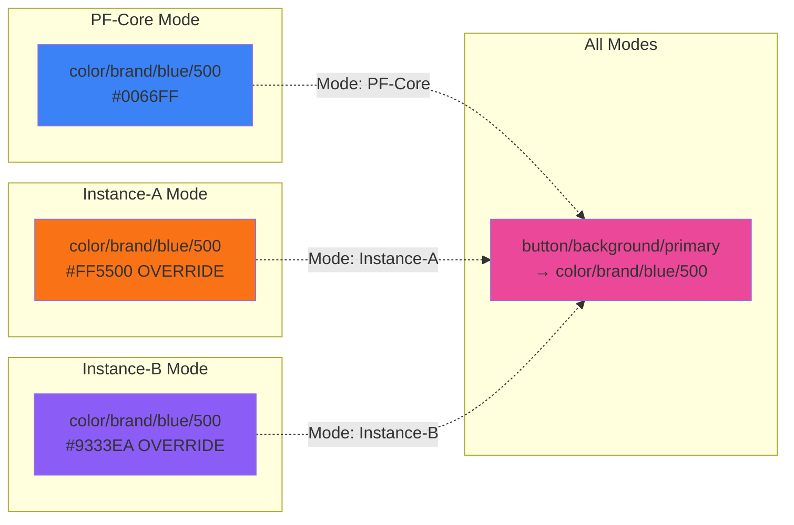

**Override Decision Matrix:**

| Token Layer | PF-Core | Instance-A | Instance-B | Instance-C | Client |
|-------------|---------|-----------|-----------|-----------|---------|
| **Primitive Color** | Define all | Override brand colors | Override brand colors | Override brand colors | Override brand colors |
| **Semantic Color** | Define all | Inherit (rare override) | Inherit | Inherit | Inherit |
| **Component Token** | Define all | Never override | Never override | Never override | Never override |
| **Typography** | Define all | Override if needed | Override if needed | Override if needed | Override if needed |
| **Spacing** | Define all | Inherit | Inherit | Inherit | Inherit |
| **Radius** | Define all | Inherit | Inherit | Inherit | Inherit |
| **Shadow** | Define all | Inherit | Inherit | Inherit | Inherit |

---

## Atomic Design Implementation

### Atomic Design Hierarchy

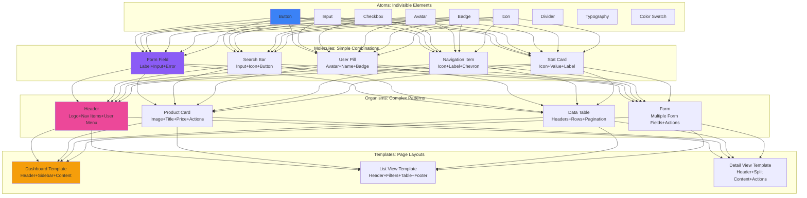

### Atom: Button Component Blueprint

```mermaid
graph TB
    BUTTON[Button Component]
    
    BUTTON --> PROPS[Properties]
    BUTTON --> VARS[Variants]
    BUTTON --> LAYOUT[Auto Layout]
    BUTTON --> TOKENS[Token References]
    
    PROPS --> P1[Size: Small/Medium/Large]
    PROPS --> P2[Type: Primary/Secondary/...]
    PROPS --> P3[State: Default/Hover/...]
    PROPS --> P4[Icon Position: Left/Right/None]
    PROPS --> P5[Loading: Boolean]
    PROPS --> P6[Disabled: Boolean]
    
    VARS --> V1[8 Type Variants]
    VARS --> V2[3 Size Variants]
    VARS --> V3[5 State Variants]
    
    LAYOUT --> L1[Direction: Horizontal]
    LAYOUT --> L2[Gap: spacing/2]
    LAYOUT --> L3[Padding: spacing/3, spacing/2]
    LAYOUT --> L4[Alignment: Center]
    
    TOKENS --> T1[Background: button/background/*]
    TOKENS --> T2[Text: button/text/*]
    TOKENS --> T3[Border: button/border/*]
    TOKENS --> T4[Radius: button/radius/default]
    
    style BUTTON fill:#6366f1
    style PROPS fill:#8b5cf6
    style VARS fill:#ec4899
    style LAYOUT fill:#f59e0b
    style TOKENS fill:#10b981
```

**Component Structure:**
```
Button [Component Set]
├── Properties
│   ├── Size: Small | Medium | Large
│   ├── Type: Primary | Secondary | Tertiary | Destructive | Ghost
│   ├── State: Default | Hover | Active | Focus | Disabled
│   ├── Boolean: showLeftIcon
│   ├── Boolean: showRightIcon
│   ├── Boolean: loading
│   └── Instance Swap: leftIcon, rightIcon
├── Children
│   ├── [Icon-Left] (optional, instance swap)
│   ├── [Label] (text layer)
│   ├── [Icon-Right] (optional, instance swap)
│   └── [Loading Spinner] (optional, visible when loading=true)
└── Styling
    ├── Background: button/background/[type]
    ├── Text Style: typography/button
    ├── Text Color: button/text/[type]
    ├── Border: button/border/[type]
    ├── Radius: button/radius/default
    ├── Shadow: button/shadow/default
    └── Padding: button/spacing/*
```

### Molecule: Form Field Component

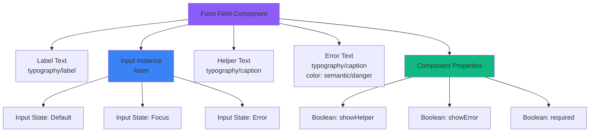

**Composition Rules:**
1. **Atom Reuse:** Use Input atom instance, never recreate
2. **Spacing:** Vertical gap = `spacing/2` (8px)
3. **State Sync:** Form Field state controls Input state
4. **Error Priority:** Error message replaces helper when shown
5. **Token Consistency:** All text uses defined typography tokens

### Organism: Product Card

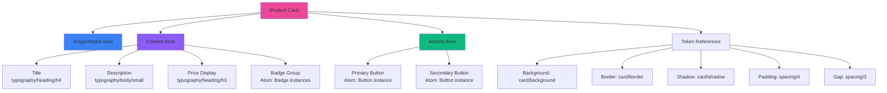

**Organism Principles:**
1. **Composition:** Only use Atoms and Molecules
2. **Self-Contained:** Card includes all necessary elements
3. **Responsive:** Auto Layout ensures proper stacking
4. **Variant Control:** Component properties for optional elements
5. **No Hardcoding:** All values from token system

---

## Multi-Brand Mode Strategy

### Mode Architecture

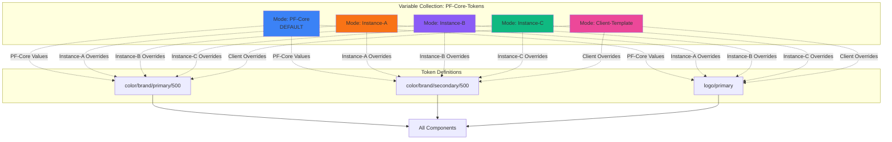

### Brand Differentiation Strategy

**Tier 1: PF-Core (Platform Foundation)**
- Purpose: Base design language shared across all instances
- Defines: Complete token system, all components
- Override: Never (this is the fallback)
- Use Case: Internal tools, default platform state

**Tier 2: Platform Instances (A, B, C)**
- Purpose: Individual brand expression for each platform
- Overrides: Primary colors, secondary colors, logo, font (optional)
- Inherits: Spacing, radius, shadows, component structure
- Use Case: Public-facing branded platforms

**Tier 3: Client Whitelabel**
- Purpose: Client-specific branding on top of an Instance
- Overrides: Colors, logo only (limited customization)
- Inherits: Everything from Instance + PF-Core
- Use Case: White-labeled client deployments

**Brand Override Matrix:**

| Element | PF-Core | Instance | Client | Rationale |
|---------|---------|----------|--------|-----------|
| **Primary Color** | ✅ Define | ⚠️ Override | ⚠️ Override | Brand identity |
| **Secondary Color** | ✅ Define | ⚠️ Override | ⚠️ Override | Brand identity |
| **Neutral Colors** | ✅ Define | ❌ Inherit | ❌ Inherit | Consistency |
| **Typography Family** | ✅ Define | ⚠️ Override | ❌ Inherit | Brand flexibility |
| **Typography Scale** | ✅ Define | ❌ Inherit | ❌ Inherit | Consistency |
| **Spacing System** | ✅ Define | ❌ Inherit | ❌ Inherit | Layout consistency |
| **Border Radius** | ✅ Define | ❌ Inherit | ❌ Inherit | Style consistency |
| **Shadows** | ✅ Define | ❌ Inherit | ❌ Inherit | Depth consistency |
| **Logo Asset** | ✅ Define | ⚠️ Override | ⚠️ Override | Brand identity |
| **Component Structure** | ✅ Define | ❌ Inherit | ❌ Inherit | Architecture |

**Key:** ✅ Define | ⚠️ Can Override | ❌ Must Inherit

### Mode Switching Mechanism

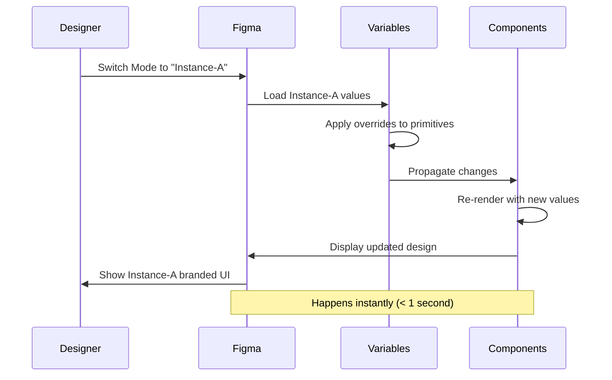

**How It Works:**
1. Designer selects page/frame
2. Changes mode dropdown to "Instance-A"
3. Figma resolves all token references:
   - Primitive tokens use Instance-A values
   - Semantic tokens inherit from updated primitives
   - Component tokens inherit from semantic
4. All components automatically update
5. No manual work required

### Client Whitelabel Workflow

```mermaid
graph LR
    subgraph "1. Client Onboarding"
        C1[Receive Brand Assets]
        C2[Extract Colors]
        C3[Upload Logo]
    end
    
    subgraph "2. Configure Mode"
        C4[Clone Instance-A Mode]
        C5[Override Primary Color]
        C6[Override Secondary Color]
        C7[Set Logo Variable]
    end
    
    subgraph "3. Validation"
        C8[Test All Components]
        C9[Export Assets]
        C10[Verify Accessibility]
    end
    
    subgraph "4. Deployment"
        C11[Export Tokens]
        C12[Deploy to Client Env]
        C13[Monitor]
    end
    
    C1 --> C2 --> C3 --> C4
    C4 --> C5 --> C6 --> C7 --> C8
    C8 --> C9 --> C10 --> C11
    C11 --> C12 --> C13
    
    style C1 fill:#3b82f6
    style C4 fill:#8b5cf6
    style C8 fill:#ec4899
    style C11 fill:#10b981
```

**Client Whitelabel Checklist:**
- [ ] Receive client brand guidelines
- [ ] Extract primary color (hex)
- [ ] Extract secondary color (hex)
- [ ] Receive logo assets (SVG preferred)
- [ ] Create new mode: "Client-[Name]"
- [ ] Override `color/brand/primary/*` shades
- [ ] Override `color/brand/secondary/*` shades
- [ ] Set `logo/primary` to client logo
- [ ] Test contrast ratios (WCAG AA minimum)
- [ ] Export sample components for approval
- [ ] Get client sign-off
- [ ] Export token JSON
- [ ] Deploy to client environment

---

## Component Design Patterns

### Pattern 1: Progressive Disclosure

**Principle:** Show essential information first, reveal details on interaction.

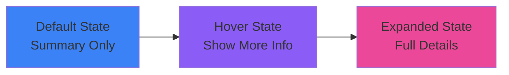

**Implementation:**
- Use component properties: `expanded: boolean`
- Default: Show title + minimal content
- Hover: Reveal actions/metadata
- Click: Full expansion with all details

**Example: Product Card**
```
Default:
- Image
- Title
- Price

Hover (add):
- Quick View button
- Add to Cart button
- Rating stars

Expanded (add):
- Full description
- Specifications
- Reviews
```

### Pattern 2: State Visualization

**Principle:** Every component has clear visual feedback for all states.

```mermaid
stateDiagram-v2
    [*] --> Default
    Default --> Hover: Mouse Enter
    Hover --> Active: Mouse Down
    Active --> Default: Mouse Up
    Default --> Focus: Keyboard Focus
    Focus --> Default: Blur
    Default --> Disabled: Programmatic
    Default --> Loading: API Call
    Loading --> Default: Complete
    Loading --> Error: Failed
    Error --> Default: Retry
```

**Required States:**
- **Default:** Baseline appearance
- **Hover:** Indicates interactivity
- **Active:** Click/tap feedback
- **Focus:** Keyboard navigation indicator
- **Disabled:** Non-interactive state
- **Loading:** Async operation in progress
- **Error:** Validation or system error

**Visual Indicators:**
```
Default → Hover:
- Background color change (semantic/action/base → semantic/action/hover)
- Elevation increase (shadow/sm → shadow/md)
- Border emphasis (optional)

Active:
- Background color darken (semantic/action/active)
- Elevation decrease (shadow removed or inverted)
- Scale transform (scale: 0.98)

Disabled:
- Opacity reduction (0.5)
- Cursor: not-allowed
- Remove hover/active states
```

### Pattern 3: Responsive Composition

**Principle:** Components adapt to container width using Auto Layout.

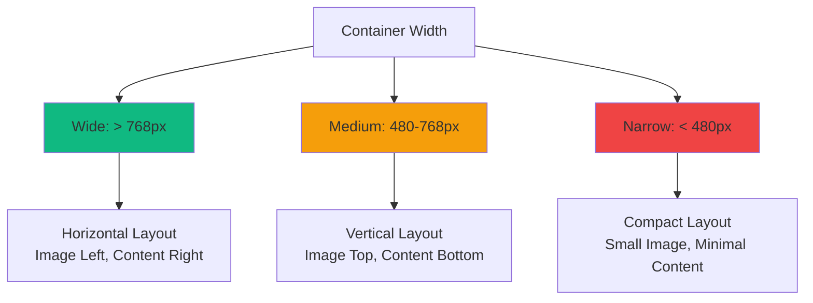

**Auto Layout Configuration:**
```
Card Component:
- Direction: Varies by variant
- Gap: spacing/4 (consistent)
- Padding: spacing/4 (consistent)
- Width: Fill container (hug: false, fill: true)
- Height: Hug content (hug: true, fill: false)

Responsive Variants:
- Desktop: Direction = Horizontal
- Tablet: Direction = Vertical
- Mobile: Direction = Vertical + Reduced padding (spacing/3)
```

### Pattern 4: Accessibility First

**Principle:** Design for accessibility from the start, not as an afterthought.

**WCAG AA Compliance Checklist:**

**Color Contrast:**
- [ ] Text on background: minimum 4.5:1 ratio (body text)
- [ ] Large text (18px+): minimum 3:1 ratio
- [ ] Interactive elements: minimum 3:1 against background
- [ ] Focus indicators: minimum 3:1 against adjacent colors

**Test in Figma:**
Use plugins like "Stark" or "Color Contrast Checker" to validate.

**Keyboard Navigation:**
- [ ] All interactive components have focus state
- [ ] Focus indicator is clearly visible (2px outline, semantic/action/base)
- [ ] Tab order is logical (top-to-bottom, left-to-right)
- [ ] No keyboard traps

**Screen Reader Support:**
- [ ] Use semantic layer names (e.g., "Button: Submit", not "Rectangle 47")
- [ ] Include descriptive names for icons ("Icon: Search", not "Icon")
- [ ] Group related elements in frames with labels

**Touch Targets:**
- [ ] Minimum size: 44×44px (iOS), 48×48px (Material)
- [ ] Spacing between targets: minimum 8px
- [ ] Important actions: generous padding (16px+)

**Visual Indicators:**
```
Focus State:
- Outline: 2px solid semantic/action/base
- Offset: 2px
- Radius: Inherit from component

Error State:
- Border: 2px solid semantic/danger/base
- Icon: Error icon (visual + semantic)
- Text: Error message (color: semantic/danger/base)
- Aria-label: Descriptive error message
```

### Pattern 5: Consistent Iconography

**Principle:** Icons follow a unified design language.

**Icon System Rules:**
```
Size Grid:
- XS: 12×12px (inline with small text)
- SM: 16×16px (inline with body text)
- MD: 24×24px (buttons, navigation)
- LG: 32×32px (feature highlights)
- XL: 48×48px (empty states, illustrations)

Stroke Width:
- 1.5px (consistent across all sizes)
- Rounded caps and joins

Style:
- Outline (default)
- Filled (for selected/active states)
- Duotone (for emphasis, 2-color)

Semantic Usage:
- Action icons: semantic/action/base
- Destructive icons: semantic/danger/base
- Success icons: semantic/success/base
- Muted icons: neutral/gray/500
```

**Icon Component Structure:**
```
Icon [Component Set]
├── Properties
│   ├── Name: search | user | settings | ...
│   ├── Size: xs | sm | md | lg | xl
│   ├── Style: outline | filled | duotone
│   └── Color: Link to color variable
└── Variants
    └── [Name] × [Size] × [Style] combinations
```

---

## Code Generation Pipeline

### End-to-End Flow

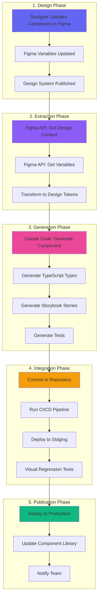

### Figma → Tokens Pipeline

```typescript
// scripts/sync-figma-tokens.ts
import { FigmaAPI } from '@figma/api';
import { transformToDesignTokens } from './transform';
import { generateCSS, generateTypeScript } from './generate';

async function syncTokens() {
  // 1. Fetch from Figma
  const figma = new FigmaAPI(process.env.FIGMA_TOKEN!);
  const variables = await figma.getVariables(process.env.FILE_KEY!);
  
  // 2. Transform
  const tokens = transformToDesignTokens(variables);
  
  // 3. Generate artifacts
  const modes = ['PF-Core', 'Instance-A', 'Instance-B', 'Instance-C'];
  for (const mode of modes) {
    await generateCSS(tokens, mode, `./src/tokens/${mode}.css`);
  }
  await generateTypeScript(tokens, './src/tokens/tokens.ts');
  
  // 4. Commit
  await git.add('./src/tokens/*');
  await git.commit(`chore: sync tokens from Figma`);
  
  console.log('✅ Tokens synchronized');
}
```

### Figma → Component Pipeline

```yaml
# .claude/workflows/generate-component.yml
name: Generate Component from Figma
description: Full pipeline from Figma design to production code

inputs:
  componentName:
    required: true
    description: Name of component (e.g., Button)
  nodeId:
    required: true
    description: Figma node ID (e.g., 123:456)

steps:
  - name: Fetch Design Context
    tool: figma:get_design_context
    params:
      fileKey: ${{ env.FIGMA_FILE_KEY }}
      nodeId: ${{ inputs.nodeId }}
    
  - name: Fetch Code Connect Map
    tool: figma:get_code_connect_map
    params:
      fileKey: ${{ env.FIGMA_FILE_KEY }}
      nodeId: ${{ inputs.nodeId }}
    
  - name: Generate Component Code
    prompt: |
      Generate a production-ready React component from this Figma design.
      
      Requirements:
      - TypeScript with strict mode
      - Use tokens from @/tokens
      - Use class-variance-authority for variants
      - Include JSDoc with link to Figma
      - Export as named export
      - Forward refs
      - Support all variants from Figma
      
      Design Context:
      ${{ steps.fetchDesign.output }}
      
      Code Connect:
      ${{ steps.fetchCodeConnect.output }}
      
      Token Schema:
      ${{ file.read('src/tokens/design-tokens.json') }}
    output: componentCode
    
  - name: Generate Types
    prompt: |
      Generate TypeScript types for this component's props.
      Include JSDoc descriptions for each prop.
      
      Component code:
      ${{ steps.generateComponent.output }}
    output: typesCode
    
  - name: Generate Storybook Stories
    prompt: |
      Generate Storybook stories showing all variants and states.
      Include:
      - Default story
      - All variants (size, type, state combinations)
      - Interactive controls
      - Accessibility checks
      
      Component code:
      ${{ steps.generateComponent.output }}
    output: storiesCode
    
  - name: Generate Tests
    prompt: |
      Generate comprehensive Vitest tests including:
      - Render tests for all variants
      - Accessibility tests (axe-core)
      - Interaction tests
      - Snapshot tests
      
      Component code:
      ${{ steps.generateComponent.output }}
    output: testsCode
    
  - name: Write Files
    files:
      - path: src/components/${{ inputs.componentName }}/${{ inputs.componentName }}.tsx
        content: ${{ steps.generateComponent.output }}
      - path: src/components/${{ inputs.componentName }}/${{ inputs.componentName }}.types.ts
        content: ${{ steps.generateTypes.output }}
      - path: src/components/${{ inputs.componentName }}/${{ inputs.componentName }}.stories.tsx
        content: ${{ steps.generateStories.output }}
      - path: src/components/${{ inputs.componentName }}/${{ inputs.componentName }}.test.tsx
        content: ${{ steps.generateTests.output }}
      - path: src/components/${{ inputs.componentName }}/index.ts
        content: export * from './${{ inputs.componentName }}';
    
  - name: Format Code
    run: npx prettier --write 'src/components/${{ inputs.componentName }}/**/*.{ts,tsx}'
    
  - name: Lint
    run: npx eslint 'src/components/${{ inputs.componentName }}/**/*.{ts,tsx}' --fix
    
  - name: Run Tests
    run: npm test src/components/${{ inputs.componentName }}
    
  - name: Notify
    output: |
      ✅ Component generated: ${{ inputs.componentName }}
      📁 Files created: 5
      🧪 Tests: Passing
      📖 Storybook: Ready
      🔗 Figma: https://figma.com/file/${{ env.FIGMA_FILE_KEY }}?node-id=${{ inputs.nodeId }}
```

### Schema.org Mapping

**Component → Schema Type Mapping:**

| Component | Schema.org Type | Properties |
|-----------|----------------|------------|
| **Button** | `Action` | `@type: Action`, `name`, `target` |
| **Card** | `Thing` | `@type`, `name`, `description`, `image` |
| **Product Card** | `Product` | `@type: Product`, `name`, `offers`, `image` |
| **Article Card** | `Article` | `@type: Article`, `headline`, `author`, `datePublished` |
| **Person Card** | `Person` | `@type: Person`, `name`, `jobTitle`, `image` |
| **Navigation** | `SiteNavigationElement` | `@type: SiteNavigationElement`, `name`, `url` |
| **Breadcrumb** | `BreadcrumbList` | `@type: BreadcrumbList`, `itemListElement` |
| **Form** | `Action` | `@type: SearchAction`, `target`, `query-input` |
| **Review Card** | `Review` | `@type: Review`, `reviewRating`, `author` |

**Example: Product Card with Schema.org**

```typescript
// Generated component includes structured data
export const ProductCard = ({ product }: ProductCardProps) => {
  const structuredData = {
    '@context': 'https://schema.org',
    '@type': 'Product',
    name: product.name,
    description: product.description,
    image: product.imageUrl,
    offers: {
      '@type': 'Offer',
      price: product.price,
      priceCurrency: 'USD',
    },
  };
  
  return (
    <article itemScope itemType="https://schema.org/Product">
      <script type="application/ld+json">
        {JSON.stringify(structuredData)}
      </script>
      {/* Visual component JSX */}
    </article>
  );
};
```

---

## Integration Architecture

### Full Stack Integration

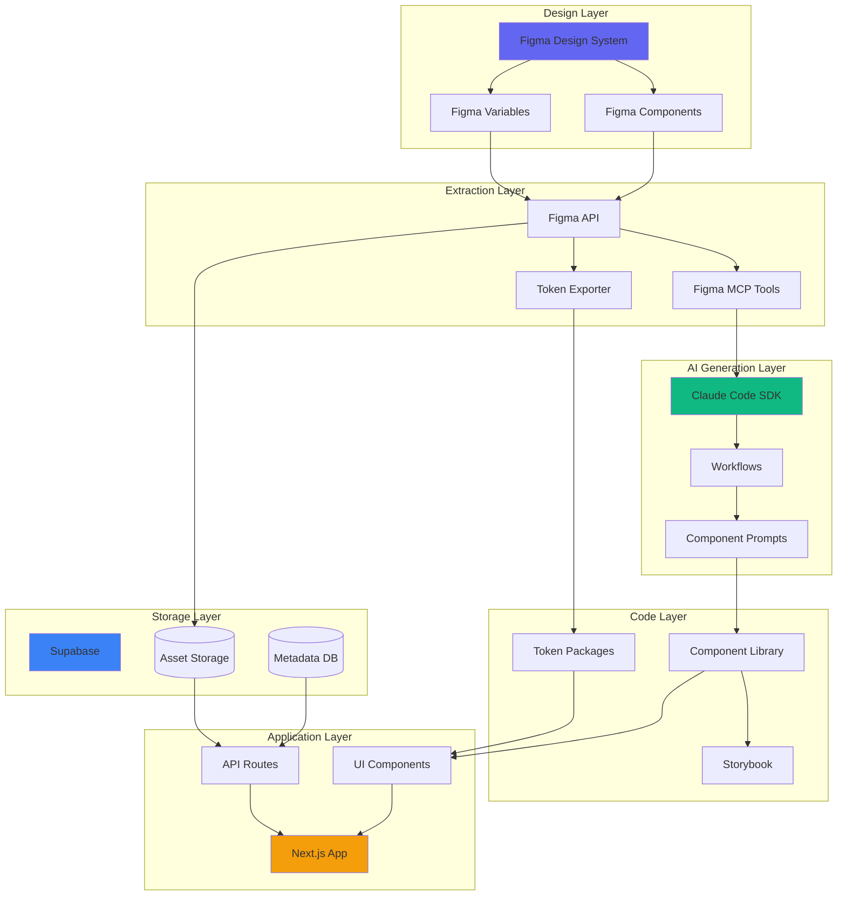

### Supabase Schema

```sql
-- Design System Versions (Token History)
CREATE TABLE design_system_versions (
  id UUID PRIMARY KEY DEFAULT uuid_generate_v4(),
  version VARCHAR(20) NOT NULL,
  figma_file_key VARCHAR(50) NOT NULL,
  figma_file_url TEXT,
  published_at TIMESTAMP DEFAULT NOW(),
  tokens_json JSONB NOT NULL,
  components_json JSONB,
  changelog TEXT,
  published_by UUID REFERENCES auth.users(id),
  is_production BOOLEAN DEFAULT false
);

CREATE INDEX idx_versions_production ON design_system_versions(is_production);
CREATE INDEX idx_versions_published ON design_system_versions(published_at DESC);

-- Design Assets (Images, Templates)
CREATE TABLE design_assets (
  id UUID PRIMARY KEY DEFAULT uuid_generate_v4(),
  asset_type VARCHAR(50) NOT NULL,  -- 'social-media', 'email', 'logo', 'icon'
  platform VARCHAR(50),              -- 'instagram', 'linkedin', 'twitter'
  format VARCHAR(50),                -- 'post', 'story', 'banner'
  brand_mode VARCHAR(50) NOT NULL,   -- 'PF-Core', 'Instance-A', etc.
  file_path TEXT NOT NULL,
  file_size INTEGER,
  file_type VARCHAR(20),             -- 'png', 'svg', 'jpg'
  figma_node_id VARCHAR(50),
  figma_file_key VARCHAR(50),
  dimensions VARCHAR(20),            -- '1080x1080'
  public_url TEXT,
  created_at TIMESTAMP DEFAULT NOW(),
  updated_at TIMESTAMP DEFAULT NOW(),
  metadata JSONB,
  tags TEXT[]
);

CREATE INDEX idx_assets_type ON design_assets(asset_type);
CREATE INDEX idx_assets_platform ON design_assets(platform);
CREATE INDEX idx_assets_brand ON design_assets(brand_mode);
CREATE INDEX idx_assets_tags ON design_assets USING gin(tags);

-- Component Metadata (Code Connect)
CREATE TABLE component_metadata (
  id UUID PRIMARY KEY DEFAULT uuid_generate_v4(),
  component_name VARCHAR(100) NOT NULL,
  figma_node_id VARCHAR(50) NOT NULL,
  figma_file_key VARCHAR(50) NOT NULL,
  code_path TEXT NOT NULL,           -- 'src/components/Button.tsx'
  storybook_url TEXT,
  npm_package VARCHAR(100),
  version VARCHAR(20),
  variants JSONB,                    -- {size: ['sm','md','lg'], type: [...]}
  props_schema JSONB,
  schema_org_type VARCHAR(50),       -- 'Action', 'Thing', etc.
  accessibility_notes TEXT,
  created_at TIMESTAMP DEFAULT NOW(),
  updated_at TIMESTAMP DEFAULT NOW()
);

CREATE INDEX idx_components_name ON component_metadata(component_name);
CREATE INDEX idx_components_node ON component_metadata(figma_node_id);

-- RLS Policies
ALTER TABLE design_system_versions ENABLE ROW LEVEL SECURITY;
ALTER TABLE design_assets ENABLE ROW LEVEL SECURITY;
ALTER TABLE component_metadata ENABLE ROW LEVEL SECURITY;

-- Public read access
CREATE POLICY "Public read versions" ON design_system_versions
  FOR SELECT USING (is_production = true);

CREATE POLICY "Public read assets" ON design_assets
  FOR SELECT USING (true);

CREATE POLICY "Public read components" ON component_metadata
  FOR SELECT USING (true);

-- Authenticated write access
CREATE POLICY "Authenticated write versions" ON design_system_versions
  FOR INSERT WITH CHECK (auth.role() = 'authenticated');

CREATE POLICY "Authenticated write assets" ON design_assets
  FOR INSERT WITH CHECK (auth.role() = 'authenticated');

CREATE POLICY "Authenticated write components" ON component_metadata
  FOR INSERT WITH CHECK (auth.role() = 'authenticated');
```

### API Endpoints

**Token API:**
```typescript
// pages/api/tokens/[mode].ts
export default async function handler(req, res) {
  const { mode } = req.query;
  
  const { data } = await supabase
    .from('design_system_versions')
    .select('tokens_json')
    .eq('is_production', true)
    .order('published_at', { ascending: false })
    .limit(1)
    .single();
  
  const tokens = data.tokens_json[mode] || data.tokens_json['PF-Core'];
  
  res.setHeader('Cache-Control', 's-maxage=3600, stale-while-revalidate');
  return res.json({ tokens });
}
```

**Asset API:**
```typescript
// pages/api/assets/[platform]/[format].ts
export default async function handler(req, res) {
  const { platform, format } = req.query;
  const brandMode = req.headers['x-brand-mode'] || 'PF-Core';
  
  const { data } = await supabase
    .from('design_assets')
    .select('*')
    .eq('platform', platform)
    .eq('format', format)
    .eq('brand_mode', brandMode)
    .order('created_at', { ascending: false });
  
  res.setHeader('Cache-Control', 's-maxage=3600, stale-while-revalidate');
  return res.json({ assets: data });
}
```

---

## Scalability & Governance

### Design System Governance Model

```mermaid
graph TB
    subgraph "Proposal Phase"
        P1[Component Proposal]
        P2[Design Review]
        P3[Technical Feasibility]
    end
    
    subgraph "Design Phase"
        D1[Prototype in Figma]
        D2[Token Validation]
        D3[Accessibility Check]
        D4[Multi-Brand Test]
    end
    
    subgraph "Development Phase"
        DEV1[Generate Code]
        DEV2[Write Tests]
        DEV3[Create Stories]
        DEV4[Code Review]
    end
    
    subgraph "Release Phase"
        R1[Publish to Library]
        R2[Document Usage]
        R3[Notify Team]
        R4[Monitor Adoption]
    end
    
    P1 --> P2 --> P3
    P3 --> D1 --> D2 --> D3 --> D4
    D4 --> DEV1 --> DEV2 --> DEV3 --> DEV4
    DEV4 --> R1 --> R2 --> R3 --> R4
    
    style P1 fill:#3b82f6
    style D1 fill:#8b5cf6
    style DEV1 fill:#ec4899
    style R1 fill:#10b981
```

### Version Control Strategy

**Semantic Versioning:**
```
Major.Minor.Patch
├── Major: Breaking changes (e.g., removed component properties)
├── Minor: New features (e.g., new component added)
└── Patch: Bug fixes, small tweaks
```

**Version History:**
```
v1.0.0 - Initial MVP Release
├── 100+ tokens
├── 8 atomic components
├── 5 molecular components
└── 3 brand instances

v1.1.0 - Add Data Table Component
├── New: Data Table organism
├── Update: Pagination component
└── Fix: Button focus state contrast

v1.2.0 - Add Client Whitelabel
├── New: Client-Template mode
├── New: Client onboarding docs
└── Update: Logo variable system

v2.0.0 - Breaking: Token Restructure
├── BREAKING: Renamed color tokens
├── BREAKING: Removed deprecated spacing tokens
├── New: Dark mode support
└── Migration guide provided
```

### Change Management

**Component Deprecation Process:**
1. **Announce:** 90 days before removal
2. **Mark:** Add "deprecated" tag in Figma
3. **Document:** Migration guide to replacement
4. **Warning:** Console warnings in code
5. **Remove:** After 90-day grace period

**Token Update Process:**
1. **Propose:** RFC (Request for Comments)
2. **Review:** Design + Engineering review
3. **Test:** Verify no regressions
4. **Stage:** Deploy to staging environment
5. **Monitor:** Check for issues
6. **Prod:** Deploy to production
7. **Document:** Update token docs

---

## Conclusion

This architecture document provides the complete blueprint for implementing a scalable, multi-brand Figma design system that seamlessly integrates with Claude Code SDK and modern development workflows.

**Key Takeaways:**

✅ **Single Source of Truth:** Figma is the authoritative source for all design decisions  
✅ **Token-Driven:** Every visual property references the token system  
✅ **Atomic Composition:** Components built from smaller, reusable pieces  
✅ **Multi-Brand Support:** One system, multiple brand expressions  
✅ **AI-Powered Generation:** Automated code generation from design  
✅ **Schema.org Compliant:** Machine-readable, semantic HTML  

**Next Steps:**
1. Review Flying Start MVP Guide for implementation timeline
2. Use Quick Reference Checklist for daily progress tracking
3. Follow this Architecture document for decision-making
4. Begin with Week 1: Foundation Setup

---

**Document Version:** 1.0  
**Last Updated:** November 18, 2025  
**Status:** Ready for Reference

---

*This document is the architectural foundation for PF-Core Frontend FIGMA Design System. Refer to it when making structural decisions, onboarding new team members, or planning expansions.*
