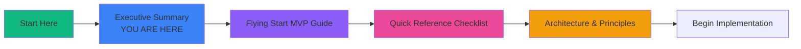
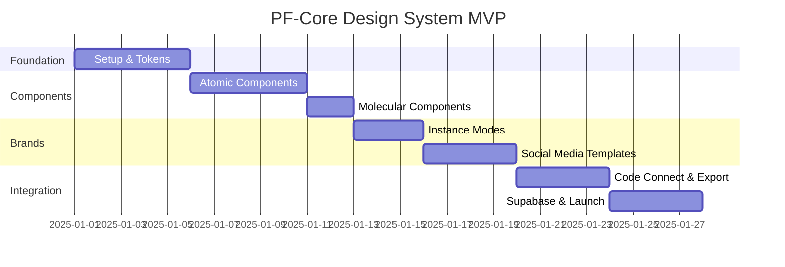

# PF-Core Frontend FIGMA: Flying Start Package - Index

## 📦 Complete Documentation Package

**Version:** 1.0  
**Release Date:** November 18, 2025  
**Status:** Ready for Implementation

---

## Executive Summary

This documentation package provides everything needed to establish a production-ready Figma Design System that enables:

✅ **Multi-Brand Platform Support** - Single design system supporting PF-Core + 3 Platform Instances + unlimited client whitelabels  
✅ **Atomic Design Implementation** - Systematic component hierarchy from atoms to templates  
✅ **AI-Powered Code Generation** - Claude Code SDK integration for automated React component generation  
✅ **Social Media Asset Pipeline** - Automated template creation and export for 8 social media formats  
✅ **Seamless Integration** - Figma → Claude Code → Supabase → Production pipeline  

**Timeline:** 4-week MVP (accelerated from 10-week scope)  
**Effort:** 1 Senior Designer + 1 Frontend Architect (with AI assistance)  
**Output:** Production-ready design system with 8 atomic components, 5 molecular components, 32+ social media templates, and full code generation pipeline

---

## 📚 Document Guide

### For Implementation Teams



### Document Overview

| Document | Purpose | Audience | When to Use |
|----------|---------|----------|-------------|
| **[Flying Start MVP Guide](#flying-start-mvp-guide)** | Complete implementation walkthrough | Designers, Developers, PMs | Day 1 → Launch |
| **[Quick Reference Checklist](#quick-reference-checklist)** | Daily action items and commands | Designers, Developers | Daily standup, task tracking |
| **[Architecture & Principles](#architecture-principles)** | Deep technical reference | Architects, Senior Designers | Decision-making, onboarding |
| **Executive Summary** | High-level overview and index | Leadership, Stakeholders | Planning, approvals |

---

## 1. Flying Start MVP Guide

**File:** `PF-Core-Frontend-FIGMA-Flying-Start-MVP-Guide.md` (60KB)

### What's Inside

**Pre-Flight Checklist**
- Figma plan verification
- Token extraction from existing code
- Brand definition requirements
- Tool setup (Figma MCP, Claude Code, Supabase)

**Week-by-Week Implementation**
- **Week 1:** Foundation Setup (File structure, variables, token creation)
- **Week 2:** Component Library (8 atomic + 5 molecular components)
- **Week 3:** Brand Instances & Templates (3 instances, 32 social media templates)
- **Week 4:** Integration & Launch (Code Connect, token export, Supabase)

**Integration Guides**
- Claude Code SDK workflows for component generation
- Supabase integration for asset management
- Token export pipeline setup
- Social media asset automation

**Troubleshooting**
- Common issues and solutions
- FAQs
- Red flags and quick fixes

### Who Should Read This

- ✅ **Primary:** Design System Lead (read entire document)
- ✅ **Primary:** Frontend Architect (focus on Week 4 + Integration sections)
- ⚠️ **Secondary:** Product Manager (Executive Summary + Timeline)
- ⚠️ **Reference:** Individual contributors (specific sections as needed)

### Key Takeaways

> **"The Flying Start Guide is your step-by-step playbook. Follow it sequentially, don't skip ahead. Each day builds on the previous day's work."**

**Critical Success Factors:**
1. Complete token extraction BEFORE building in Figma
2. Create variables with modes from Day 1 (not an afterthought)
3. Test mode switching after EVERY component
4. Export tokens daily during active development
5. Use Claude Code workflows for consistent component generation

---

## 2. Quick Reference Checklist

**File:** `PF-Core-Frontend-FIGMA-Quick-Reference-Checklist.md` (22KB)

### What's Inside

**Visual Timeline**
- Gantt chart of 4-week MVP
- Priority matrix (must/should/nice to have)
- Daily stand-up format

**Action Checklists**
- Pre-flight setup checklist
- Daily task lists for each day (Day 1-20)
- Component testing checklist
- Launch day checklist

**Command Reference**
- Figma MCP commands
- Token export commands
- Asset export commands
- Claude Code commands

**Quick Troubleshooting**
- Red flags and instant fixes
- Common error messages
- Decision flowcharts

### Who Should Read This

- ✅ **Primary:** ALL implementation team members
- ✅ **Daily Use:** Print and check off items as you complete them
- ⚠️ **Reference:** Keep open while working

### Key Takeaways

> **"Print this checklist. Put it on your wall. Check off items as you complete them. This is your daily companion."**

**Quick Win Tips:**
- Use component properties over variants when possible (faster)
- Name tokens semantically, never by value
- Test in PF-Core mode first, then switch to instances
- Batch export assets (10 at a time) to avoid rate limits
- Use GitHub Actions for automated nightly syncs

---

## 3. Architecture & Principles

**File:** `PF-Core-Frontend-FIGMA-Architecture-Principles.md` (32KB)

### What's Inside

**Core Architecture Principles**
- Single Source of Truth (SSOT)
- Semantic naming over value-based
- Inheritance & fallback model
- Separation of structure from content

**Figma Node System**
- Complete explanation of nodes
- Node hierarchy in design systems
- Node types and their purposes
- NodeId format and API usage

**Token Architecture**
- Complete token taxonomy (primitive → semantic → component)
- Inheritance rules and override strategy
- Mode-based brand differentiation

**Atomic Design Implementation**
- Detailed component blueprints
- Design patterns (progressive disclosure, state visualization)
- Accessibility-first approach

**Code Generation Pipeline**
- End-to-end flow from Figma to production
- Schema.org mapping for semantic HTML
- Integration architecture (Figma + Claude + Supabase)

**Governance & Scalability**
- Version control strategy
- Change management process
- Component deprecation workflow

### Who Should Read This

- ✅ **Primary:** Design System Architect (read entire document)
- ✅ **Primary:** Senior Frontend Architect (focus on Code Generation + Integration)
- ⚠️ **Reference:** When making structural decisions
- ⚠️ **Reference:** When onboarding new team members

### Key Takeaways

> **"This is your reference manual. Don't read it cover-to-cover on Day 1. Consult it when you need to make architectural decisions or understand 'why' something works the way it does."**

**Architectural Decisions:**
- Single library with variable modes (NOT branching libraries)
- Semantic tokens always reference primitives (NOT direct values)
- Component tokens NEVER overridden in modes (only primitives override)
- Figma is authoritative source (code derives from design, never reverse)

---

## Implementation Roadmap

### Phase 1: MVP (Weeks 1-4)



**Deliverables:**
- ✅ 100+ design tokens across 5 modes
- ✅ 8 atomic components
- ✅ 5 molecular components
- ✅ 3 Platform Instance brands
- ✅ 32 social media templates (8 formats × 4 modes)
- ✅ Code Connect integration
- ✅ Token export pipeline
- ✅ Supabase asset storage

### Phase 2: Expansion (Weeks 5-8)

**Goals:**
- Expand to 25 atomic components
- Add 10 organism components
- Create 5 page templates
- Implement automated visual regression testing
- Add real-time collaboration features
- Create design system analytics dashboard

### Phase 3: Scale (Weeks 9-12)

**Goals:**
- Support 10+ Platform Instances
- 50+ client whitelabel deployments
- Advanced asset automation (video, animated GIFs)
- AI-powered design QA
- Component recommendation engine
- Self-service client onboarding portal

---

## Critical Success Factors

### ✅ Must Have (MVP Blockers)

**Technical Requirements:**
- [ ] Figma Professional or Organization plan (Variables with Modes)
- [ ] GitHub repository for design system
- [ ] Supabase project with storage configured
- [ ] Claude Code SDK installed and authenticated
- [ ] Figma MCP tools configured

**Team Requirements:**
- [ ] 1 Senior Designer with Figma Variables experience
- [ ] 1 Frontend Architect with React/TypeScript experience
- [ ] Product Owner for scope decisions and priorities
- [ ] 4 weeks of dedicated time (80% minimum)

**Process Requirements:**
- [ ] Existing codebase tokens extracted and documented
- [ ] 3 Platform Instance brand guidelines defined
- [ ] Weekly stakeholder check-ins scheduled
- [ ] Daily stand-ups (15 min) with team

### ⚠️ Should Have (Accelerators)

**Nice to Have:**
- [ ] Existing component library to migrate
- [ ] Design operations engineer for automation
- [ ] QA engineer for visual regression testing
- [ ] Technical writer for documentation

---

## Risk Matrix & Mitigations

### High-Impact Risks

| Risk | Impact | Probability | Mitigation |
|------|--------|------------|-----------|
| **Figma plan lacks Variables** | 🔴 Critical | Low | Verify before starting; upgrade if needed |
| **Scope creep beyond MVP** | 🔴 Critical | High | Strict adherence to MVP checklist; Phase 2 for extras |
| **Token extraction incomplete** | 🟠 High | Medium | Allocate 2 full days; automated scripts + manual review |
| **Mode switching breaks components** | 🟠 High | Medium | Test after EVERY component; use "Fix broken references" |
| **Integration pipeline fails** | 🟠 High | Low | Test each integration point individually before combining |

### Medium-Impact Risks

| Risk | Impact | Probability | Mitigation |
|------|--------|------------|-----------|
| **Designer unfamiliar with Variables** | 🟡 Medium | Medium | Pre-training; pair with experienced designer first week |
| **Brand guidelines inconsistent** | 🟡 Medium | High | Design audit; align stakeholders before Week 3 |
| **Social media export slow** | 🟡 Medium | Low | Batch processing; scheduled nightly runs |
| **Team capacity constraints** | 🟡 Medium | Medium | Buffer in timeline; prioritize ruthlessly |

---

## ROI & Business Case

### Time Savings

**Without Design System:**
```
New Platform Instance deployment:
- Manual component creation: 40 hours
- Inconsistent styling: 20 hours rework
- Social media assets: 16 hours per instance
- Total per instance: 76 hours

10 instances = 760 hours
```

**With Design System:**
```
New Platform Instance deployment:
- Token override: 2 hours
- Testing: 4 hours
- Social media auto-export: 1 hour
- Total per instance: 7 hours

10 instances = 70 hours
SAVINGS: 690 hours (91% reduction)
```

### Cost Savings

**Assumptions:**
- Designer rate: $100/hour
- Developer rate: $150/hour
- 10 Platform Instances planned over 2 years

**Investment:**
- MVP development: 320 hours (160 designer + 160 developer)
- Cost: $40,000

**Return:**
- Time saved: 690 hours (345 designer + 345 developer)
- Value: $86,250

**ROI:** 216% in first 2 years

### Qualitative Benefits

✅ **Brand Consistency:** Unified design language across all platforms  
✅ **Faster Time-to-Market:** New instances launch in days, not months  
✅ **Developer Velocity:** AI-generated components reduce manual coding 90%  
✅ **Design-Dev Alignment:** Single source of truth eliminates miscommunication  
✅ **Scalability:** System grows with business without proportional overhead  
✅ **Client Whitelabeling:** Monetize platform with rapid client customization  

---

## Getting Started: Your First Hour

### Hour 1: Orientation

**Minutes 0-15: Review Documents**
1. Read this Executive Summary (you are here)
2. Skim Table of Contents of Flying Start Guide
3. Note the 4-week timeline

**Minutes 15-30: Verify Requirements**
1. Check Figma plan supports Variables with Modes
2. Confirm team availability (4 weeks, 80% time)
3. Locate existing codebase for token extraction

**Minutes 30-45: Setup Tools**
1. Install Figma Desktop app
2. Install Claude Code SDK: `npm install -g @anthropic-ai/claude-code`
3. Create Supabase project: https://supabase.com/dashboard
4. Install Figma MCP: `npm install -g @figma/mcp-server`

**Minutes 45-60: First Actions**
1. Create new Figma file: "PF-Core-Design-System-v1"
2. Create GitHub repo: "pf-core-design-system"
3. Schedule kickoff meeting with team
4. Begin token extraction script (can run overnight)

---

## Support & Resources

### Internal Contacts

**Design System Team:**
- Design Lead: [Your Name]
- Tech Lead: [Your Name]
- Product Owner: [Your Name]

**Escalation Path:**
- Technical blockers → Tech Lead
- Scope changes → Product Owner
- Design decisions → Design Lead

### External Resources

**Official Documentation:**
- [Figma Variables](https://help.figma.com/hc/en-us/articles/15339657135383)
- [Figma Code Connect](https://help.figma.com/hc/en-us/articles/15023124644247)
- [Claude Code SDK](https://docs.anthropic.com/claude-code)
- [Supabase Docs](https://supabase.com/docs)
- [Design Tokens Spec](https://tr.designtokens.org/format/)

**Community:**
- Figma Community Forum: https://forum.figma.com
- Design Systems Slack: https://design-systems.slack.com
- Atomic Design: https://atomicdesign.bradfrost.com

---

## FAQ

### General

**Q: Do we really need 4 full weeks for MVP?**  
A: Yes. Each week builds on the previous. Week 1 foundation is critical. Rushing leads to rework.

**Q: Can we skip social media templates for MVP?**  
A: Not recommended. They demonstrate multi-brand capability and provide immediate business value.

**Q: What if we don't have 3 Platform Instances yet?**  
A: Create placeholder modes. Easy to add real brands later. The architecture is what matters.

### Technical

**Q: Why Figma Variables instead of separate libraries?**  
A: Single library with modes is simpler, faster, and easier to maintain. Branching libraries cause fragmentation.

**Q: Can we use this with Vue or Svelte instead of React?**  
A: Yes! Token system is framework-agnostic. Adjust Code Connect and component generation to your framework.

**Q: How do we handle dark mode?**  
A: Add a "Theme" dimension to variables (Light/Dark) separate from brand modes. Components reference semantic tokens that have values for both.

**Q: What's the maximum number of modes?**  
A: Figma supports up to 40 modes per collection. For more, create multiple collections.

### Process

**Q: How do we version control design changes?**  
A: Use Figma branches for major changes. Enable version history. Sync tokens to Git with commit messages.

**Q: Who approves new components?**  
A: Design Lead reviews design, Tech Lead reviews implementation, Product Owner approves scope/priority.

**Q: How often should we sync tokens?**  
A: Daily during active development. Nightly automated sync for production.

---

## Next Steps

### Immediate Actions (This Week)

1. **Secure Approvals**
   - [ ] Get budget approval for Figma Professional plan (if needed)
   - [ ] Get 4-week team allocation approved
   - [ ] Schedule kickoff meeting

2. **Verify Prerequisites**
   - [ ] Confirm Figma plan supports Variables
   - [ ] Set up GitHub repository
   - [ ] Create Supabase project
   - [ ] Install required tools

3. **Begin Preparation**
   - [ ] Run token extraction script on existing codebase
   - [ ] Gather brand guidelines for 3 Platform Instances
   - [ ] Create Figma file structure
   - [ ] Read Flying Start MVP Guide (full document)

### Week 1 Kickoff

**Day 1 Tasks:**
- Morning: Team kickoff meeting
- Morning: Create Figma file and page structure
- Afternoon: Set up Variable Collection with 5 modes
- Afternoon: Begin primitive token creation

**Day 1 Success Criteria:**
- [ ] Figma file created with all pages
- [ ] Variable Collection created with correct modes
- [ ] Team aligned on timeline and responsibilities
- [ ] Token extraction complete and reviewed

---

## Conclusion

You now have everything needed to build a world-class, multi-brand Figma design system integrated with AI-powered code generation and modern development workflows.

**The three documents in this package are:**

1. **Flying Start MVP Guide** - Your implementation playbook (use daily)
2. **Quick Reference Checklist** - Your daily companion (print it!)
3. **Architecture & Principles** - Your reference manual (consult as needed)

**Remember:**
- 🎯 Follow the guide sequentially
- ✅ Check off items as you complete them
- 🚀 Test frequently (especially mode switching)
- 💡 Consult architecture doc for decisions
- 🤝 Communicate daily with team

**Most Important:**
> Start with Week 1, Day 1. Don't skip ahead. Each day builds the foundation for the next. By Week 4, you'll have a production-ready design system that transforms how your organization builds products.

---

## Document Change Log

| Version | Date | Changes | Author |
|---------|------|---------|--------|
| 1.0 | Nov 18, 2025 | Initial package release | AI Architecture Team |
| | | Flying Start MVP Guide created | |
| | | Quick Reference Checklist created | |
| | | Architecture & Principles created | |
| | | Executive Summary & Index created | |

---

**Ready to begin?**

👉 **Next Document:** [Flying Start MVP Guide](./PF-Core-Frontend-FIGMA-Flying-Start-MVP-Guide.md)

**Questions?** Review the FAQ section above or consult your team lead.

**Good luck!** 🚀

---

*End of Document*