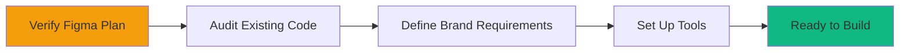
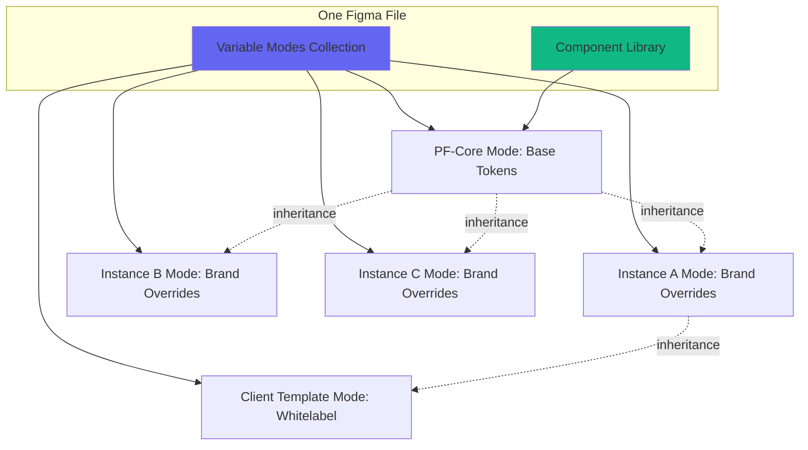
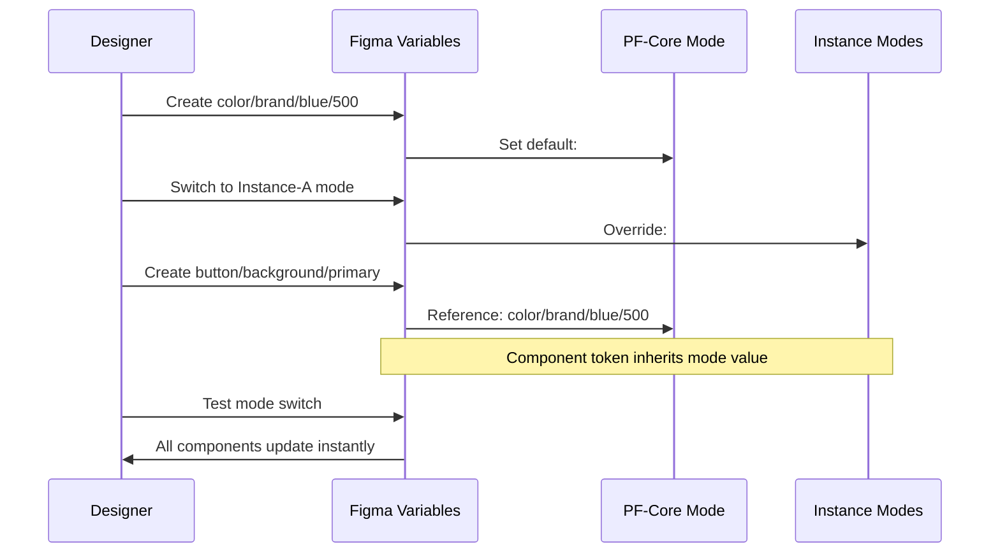
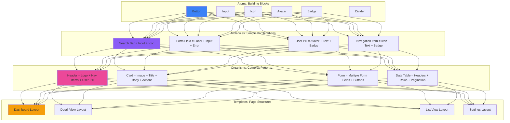
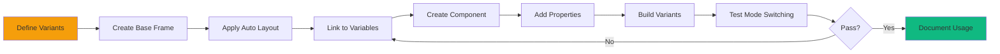
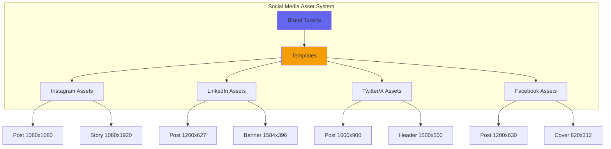
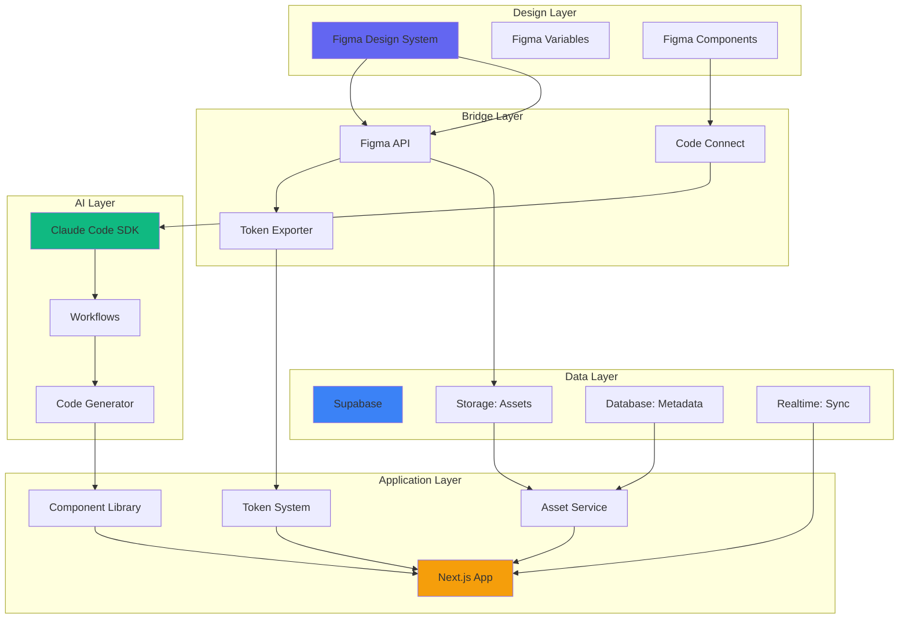
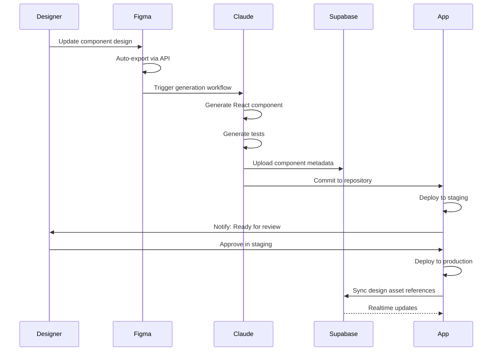
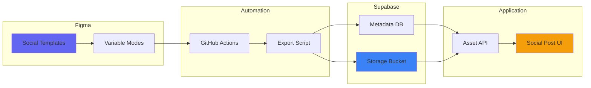

# PF-Core Frontend FIGMA: Flying Start MVP Guide

## 🚀 Executive Summary

**Purpose:** Rapid-deployment guide for establishing a production-ready Figma Design System that powers multi-brand platforms, enables whitelabeling, and seamlessly integrates with Claude Code SDK and Supabase backend infrastructure.

**Timeline:** 2-4 weeks for MVP (accelerated from original 10-week scope)  
**Goal:** Single source of truth for PF-Core + 3 Platform Instances + Client whitelabeling  
**Output:** Reusable components, social media templates, brand tokens, and code-ready assets

---

## 📋 Table of Contents

1. [Pre-Flight Checklist](#pre-flight-checklist)
2. [Week 1: Foundation Setup](#week-1-foundation-setup)
3. [Week 2: Component Library](#week-2-component-library)
4. [Week 3: Brand Instances & Templates](#week-3-brand-instances--templates)
5. [Week 4: Integration & Launch](#week-4-integration--launch)
6. [Daily Action Checklists](#daily-action-checklists)
7. [Integration with Claude Code & Supabase](#integration-with-claude-code--supabase)
8. [Social Media Asset Pipeline](#social-media-asset-pipeline)
9. [Troubleshooting & FAQs](#troubleshooting--faqs)

---

## Pre-Flight Checklist

### ✅ Before You Start (Complete These First)



#### 1. Figma Environment Setup

**Required Figma Plan Features:**
- [ ] **Variables with Modes** (Professional or Organization plan)
- [ ] **Component Properties** (all plans)
- [ ] **Team Library Publishing** (Professional+)
- [ ] **Auto Layout** (all plans)
- [ ] **Figma Dev Mode** (optional but recommended)

**Action:** Go to `Settings → Billing` and verify your plan supports Variables. If not, upgrade immediately.

#### 2. Extract Current Design Tokens from Code

**Critical Path:** You need existing token values before building in Figma.

```bash
# Clone your repository
git clone [your-repo-url]
cd pf-core-frontend

# Search for design token definitions
grep -r "color:" src/ --include="*.css" --include="*.scss" > colors.txt
grep -r "font-" src/ --include="*.css" --include="*.scss" > typography.txt
grep -r "spacing" src/ --include="*.css" --include="*.scss" > spacing.txt
grep -r "shadow" src/ --include="*.css" --include="*.scss" > shadows.txt
grep -r "radius" src/ --include="*.css" --include="*.scss" > radii.txt

# Or if using CSS-in-JS/styled-components
grep -r "colors =" src/ --include="*.ts" --include="*.tsx" --include="*.js"
grep -r "theme =" src/ --include="*.ts" --include="*.tsx" --include="*.js"
```

**Output Required:**
- Color palette (primary, secondary, neutral, semantic colors)
- Typography scale (font families, sizes, weights, line heights)
- Spacing system (4px, 8px, 12px, 16px, etc.)
- Border radii values
- Shadow definitions
- Breakpoints for responsive design

**Template for Token Extraction:**
```json
{
  "colors": {
    "pfCore": {
      "primary": {"value": "#0066FF", "usage": "Primary actions, links"},
      "secondary": {"value": "#6B7280", "usage": "Secondary actions"},
      "error": {"value": "#DC2626", "usage": "Error states"},
      "success": {"value": "#10B981", "usage": "Success states"}
    }
  },
  "typography": {
    "fontFamily": {
      "primary": "Inter, system-ui, sans-serif",
      "mono": "Fira Code, monospace"
    },
    "fontSize": {
      "xs": "12px",
      "sm": "14px",
      "base": "16px",
      "lg": "18px",
      "xl": "20px",
      "2xl": "24px",
      "3xl": "30px",
      "4xl": "36px"
    }
  },
  "spacing": {
    "1": "4px",
    "2": "8px",
    "3": "12px",
    "4": "16px",
    "6": "24px",
    "8": "32px",
    "12": "48px",
    "16": "64px"
  }
}
```

#### 3. Define Your 3 Platform Instance Brands

**For each Platform Instance (A, B, C), document:**

| Attribute | Instance A | Instance B | Instance C |
|-----------|-----------|-----------|-----------|
| **Brand Name** | ___________ | ___________ | ___________ |
| **Primary Color** | #______ | #______ | #______ |
| **Secondary Color** | #______ | #______ | #______ |
| **Logo Assets** | ✓ / ✗ | ✓ / ✗ | ✓ / ✗ |
| **Typography** | Same/Different | Same/Different | Same/Different |
| **Brand Guidelines URL** | ___________ | ___________ | ___________ |

**Critical Questions:**
1. Which elements stay consistent across all instances? (PF-Core DNA)
2. Which elements change per instance? (Brand differentiation)
3. Which elements can clients customize? (Whitelabel scope)

#### 4. Tool Integration Setup

**Required Tools:**
- [ ] **Figma Desktop App** (for MCP access)
- [ ] **Claude Code SDK** installed locally
- [ ] **Supabase Project** created (for asset storage)
- [ ] **GitHub Repository** for design system exports
- [ ] **Node.js v18+** (for token transformation scripts)

**Figma MCP Setup:**
```bash
# Install Figma MCP server
npm install -g @figma/mcp-server

# Authenticate with Figma
figma login

# Verify connection
figma whoami
```

**Supabase Storage Bucket Setup:**
```sql
-- Create storage bucket for design assets
INSERT INTO storage.buckets (id, name, public) 
VALUES ('design-assets', 'design-assets', true);

-- Create storage policy for public read
CREATE POLICY "Public read access" ON storage.objects 
FOR SELECT USING (bucket_id = 'design-assets');
```

---

## Week 1: Foundation Setup

### Architecture Decision: Single Library with Variable Modes



**Why This Approach:**
- ✅ Single source of truth (no library fragmentation)
- ✅ Mode switching is instant (designer experience)
- ✅ Inheritance model is clear (Core → Instance → Client)
- ✅ Scales easily (add modes without duplicating components)
- ✅ Exports cleanly to code (direct token mapping)

### Day 1-2: Create Figma File Structure

**Step 1: Create New Figma File**
1. Open Figma Desktop
2. Create new Design File: `PF-Core-Design-System-v1`
3. Create pages:
   - `📖 Documentation` (cover, changelog, how-to)
   - `🎨 Tokens & Styles` (color, typography, spacing definitions)
   - `⚛️ Atomic Components` (buttons, inputs, icons)
   - `🧬 Molecular Components` (cards, forms, navigation)
   - `🏗️ Organisms` (headers, footers, complex modules)
   - `📐 Templates` (page layouts, app shells)
   - `📱 Social Media Assets` (Instagram, LinkedIn, etc.)
   - `🧪 Testing Playground` (mode comparison, QA)

**Step 2: Create Variable Collection**
1. Go to `Local Variables` panel (bottom right)
2. Click `Create Variable Collection`
3. Name it: `PF-Core-Tokens`
4. Create 5 modes:
   - `PF-Core` (set as default)
   - `Instance-A`
   - `Instance-B`
   - `Instance-C`
   - `Client-Template`

### Day 3-4: Define Token Architecture

**Token Taxonomy (Semantic Naming):**

```
Primitive Tokens (PF-Core Mode Only)
├── color/
│   ├── brand/
│   │   ├── blue/50-900 (9 shades)
│   │   ├── purple/50-900
│   │   └── gray/50-900
│   └── semantic/
│       ├── success/light-dark
│       ├── error/light-dark
│       ├── warning/light-dark
│       └── info/light-dark
├── typography/
│   ├── fontFamily/primary
│   ├── fontFamily/secondary
│   ├── fontSize/xs-4xl (10 sizes)
│   ├── fontWeight/regular-black (5 weights)
│   └── lineHeight/tight-loose (5 values)
├── spacing/
│   └── 1-16 (14 values based on 4px grid)
├── radius/
│   └── none-full (6 values)
└── shadow/
    └── sm-2xl (5 elevations)

Component Tokens (All Modes)
├── button/
│   ├── background/primary
│   ├── background/secondary
│   ├── text/primary
│   ├── border/default
│   └── shadow/default
├── input/
│   ├── background/default
│   ├── border/default
│   ├── text/default
│   └── placeholder/color
├── card/
│   ├── background/default
│   ├── border/default
│   └── shadow/default
└── ... (repeat for all components)
```

**Token Creation Workflow in Figma:**



**Checklist: Token Creation**
- [ ] Create all primitive color tokens in PF-Core mode
- [ ] Create typography tokens (family, size, weight, line-height)
- [ ] Create spacing tokens (1-16 using 4px base)
- [ ] Create radius tokens (none, sm, md, lg, xl, full)
- [ ] Create shadow tokens (sm, md, lg, xl, 2xl)
- [ ] Define semantic tokens (success, error, warning, info)
- [ ] Create component-specific tokens (button, input, card, etc.)
- [ ] Test token reference chain (primitive → semantic → component)
- [ ] Document token usage rules in Documentation page

**Instance Mode Overrides:**
For each Instance mode (A, B, C), only override the tokens that differ:

| Token | PF-Core | Instance-A | Instance-B | Instance-C |
|-------|---------|-----------|-----------|-----------|
| color/brand/blue/500 | #0066FF | #FF5500 | #9333EA | #10B981 |
| color/brand/blue/600 | #0052CC | #E64D00 | #7E22CE | #059669 |
| button/background/primary | → blue/500 | → blue/500 | → blue/500 | → blue/500 |

**Key Insight:** Instance modes don't redefine everything—they only override the primitive tokens that change. Component tokens automatically inherit these changes through their references.

### Day 5: Create Color & Typography Styles

**Color Styles (for fills, strokes, effects):**
1. Go to `🎨 Tokens & Styles` page
2. Create rectangles for each color token
3. Right-click → `Selection Colors` → `Create Style`
4. Name using token path: `color/brand/blue/500`
5. Link to variable: Select style → `Edit variable` → Link to matching variable

**Typography Styles:**
1. Create text layers with each combination:
   - Heading 1 (4xl, bold, tight)
   - Heading 2 (3xl, bold, tight)
   - Heading 3 (2xl, semibold, snug)
   - Heading 4 (xl, semibold, snug)
   - Body Large (lg, regular, normal)
   - Body (base, regular, normal)
   - Body Small (sm, regular, normal)
   - Caption (xs, regular, relaxed)
   - Code (base, mono, normal)
2. Right-click → `Create Text Style`
3. Name semantically: `typography/heading/h1`
4. Link font-size, weight, line-height to variables

---

## Week 2: Component Library

### Atomic Design Hierarchy



### Day 6-7: Build Atomic Components (Buttons & Inputs)

**Component: Button**

**Variants Structure:**
```
Button
├── Size: Small | Medium | Large
├── Type: Primary | Secondary | Tertiary | Destructive | Ghost
└── State: Default | Hover | Active | Disabled
```

**Build Steps:**
1. Create base frame: `Button` with Auto Layout
2. Add text layer: Link to `typography/button` style
3. Add background fill: Link to `button/background/primary` variable
4. Set padding: Link to `spacing/3` (horizontal) and `spacing/2` (vertical)
5. Set corner radius: Link to `radius/md` variable
6. Create component: `Component → Create Component`
7. Add variants:
   - Property: `Size` (Small, Medium, Large)
   - Property: `Type` (Primary, Secondary, Tertiary, Destructive, Ghost)
   - Property: `State` (Default, Hover, Active, Disabled)
8. For each variant combination:
   - Update background to correct token (e.g., `button/background/secondary`)
   - Update text color to correct token
   - Adjust padding for size variants
   - Set opacity for disabled state

**Testing Checklist:**
- [ ] Switch to each mode → Verify button updates colors
- [ ] Test all size variants render correctly
- [ ] Test all type variants have distinct styles
- [ ] Test hover/active states are visually clear
- [ ] Test disabled state has reduced opacity
- [ ] Verify token references are correct (no hardcoded values)

**Component: Input Field**

**Variants Structure:**
```
Input
├── Size: Small | Medium | Large
├── Type: Text | Password | Email | Number | Search
└── State: Default | Focus | Error | Disabled
```

**Build Steps:**
1. Create base frame: `Input` with Auto Layout
2. Add sub-components:
   - `[Icon-Left]` (optional, using component property)
   - `[Input-Text]` placeholder text
   - `[Icon-Right]` (optional, using component property)
3. Set background: Link to `input/background/default`
4. Set border: Link to `input/border/default`
5. Set padding: Link to spacing variables
6. Set corner radius: Link to `radius/md`
7. Create component with variants
8. Add component properties:
   - Boolean: `ShowLeftIcon`
   - Boolean: `ShowRightIcon`
   - Instance Swap: `LeftIcon` (link to icon component)
   - Instance Swap: `RightIcon` (link to icon component)

**Advanced: Form Field Molecule**

Combine Input atom with supporting elements:
```
Form Field
├── Label (typography/label style)
├── Input (instance of Input component)
└── Helper/Error Text (typography/caption style)
```

### Day 8-9: Build 8 Core Atomic Components

**Priority Component List (MVP):**
1. ✅ Button (completed above)
2. ✅ Input (completed above)
3. **Checkbox**
   - Variants: Default | Checked | Indeterminate | Disabled
   - States: Default | Hover | Focus
4. **Radio Button**
   - Variants: Default | Selected | Disabled
   - States: Default | Hover | Focus
5. **Toggle/Switch**
   - Variants: Off | On | Disabled
   - States: Default | Hover | Focus
6. **Badge**
   - Variants: Info | Success | Warning | Error | Neutral
   - Sizes: Small | Medium | Large
7. **Avatar**
   - Sizes: XS | SM | MD | LG | XL | 2XL
   - Variants: Image | Initials | Icon | Placeholder
   - Status: None | Online | Offline | Away | Busy
8. **Icon Button**
   - Sizes: Small | Medium | Large
   - Types: Primary | Secondary | Ghost
   - States: Default | Hover | Active | Disabled

**Component Creation Pattern:**


### Day 10: Build 5 Molecular Components

**1. Card Component**
```
Card
├── Image/Media (optional)
├── Header
│   ├── Title (typography/heading/h4)
│   └── Subtitle (typography/body/small)
├── Body (typography/body)
└── Footer
    ├── Tags (Badge instances)
    └── Actions (Button instances)
```

**Component Properties:**
- Boolean: `ShowImage`
- Boolean: `ShowFooter`
- Instance Swap: `Image`
- Instance Swap: `Tag1`, `Tag2`, `Tag3`
- Instance Swap: `PrimaryAction`, `SecondaryAction`

**2. Navigation Item**
```
Nav Item
├── Icon (optional)
├── Label
├── Badge (optional)
└── Chevron (for nested items)
```

**Variants:**
- State: Default | Hover | Active | Disabled
- Type: Primary | Secondary | Tertiary
- Has Submenu: True | False

**3. Search Bar**
```
Search Bar = Input (type: search) + Search Icon + Optional Filters
```

**4. User Menu**
```
User Menu
├── Avatar (with status)
├── User Name
├── User Role/Status
└── Dropdown Trigger
```

**5. Alert/Toast**
```
Alert
├── Icon (type-specific: info/success/warning/error)
├── Content
│   ├── Title
│   └── Message
└── Actions
    ├── Dismiss Button
    └── Action Button (optional)
```

**Variants:**
- Type: Info | Success | Warning | Error
- Size: Compact | Default | Expanded
- Dismissible: True | False

---

## Week 3: Brand Instances & Templates

### Day 11-12: Create Instance Mode Definitions

**Instance A Mode Setup:**

1. Switch to `Instance-A` mode in Variables panel
2. Override brand color tokens:
   ```
   color/brand/blue/500 → #FF5500 (Instance A Primary)
   color/brand/blue/600 → #E64D00 (Instance A Primary Dark)
   color/brand/blue/400 → #FF7733 (Instance A Primary Light)
   ```
3. Override logo token (if using image variables):
   ```
   logo/primary → instance-a-logo.svg
   ```
4. Test component library:
   - Go to Testing Playground page
   - Place instances of all components
   - Switch between PF-Core and Instance-A modes
   - Verify colors update correctly

**Instance B & C Mode Setup:**
Repeat process for remaining instances with their respective brand colors.

**Client Template Mode:**
Set up as a starting point for whitelabeling:
- Clone Instance-A mode as base
- Add sample client branding
- Document which tokens clients can customize
- Create whitelabel setup guide

### Day 13-15: Social Media Templates



**Template Requirements:**

Each template must:
- Use only variable references (no hardcoded colors)
- Include all required safe zones
- Support text overlay variations
- Export cleanly at correct dimensions
- Work across all brand modes

**Instagram Post Template (1080x1080):**

**Frame Structure:**
```
Instagram-Post-Template [1080x1080]
├── Background (variable: card/background/default)
├── Brand-Element-Top (logo/accent)
├── Content-Area [auto-layout]
│   ├── Headline (typography/heading/h2)
│   ├── Subheading (typography/heading/h4)
│   ├── Body-Text (typography/body/large)
│   └── CTA-Area
│       └── Button (instance with custom text)
├── Brand-Element-Bottom (pattern/accent)
└── Logo-Lockup (bottom-right, 80x80 safe zone)
```

**Component Properties:**
- Text: `Headline`
- Text: `Subheadline`
- Text: `Body`
- Text: `CTA Text`
- Instance Swap: `Background Pattern`
- Boolean: `Show Top Element`
- Boolean: `Show Bottom Element`

**Build Steps:**
1. Create 1080x1080 frame
2. Apply background fill from variable
3. Add Auto Layout for content area with vertical stacking
4. Link all text to typography styles
5. Create component with properties
6. Build 3-5 layout variants:
   - Hero Image + Text
   - Text Only (centered)
   - Split Layout (image + text)
   - Quote Format
   - Announcement Card

**Export Settings:**
- PNG, 1x scale, @2x for retina
- Suffix: `-ig-post`
- Include all variants

**Repeat for All Social Formats:**

| Platform | Format | Dimensions | Safe Zone | Variants |
|----------|--------|-----------|-----------|----------|
| Instagram | Post | 1080x1080 | 80px margin | 5 layouts |
| Instagram | Story | 1080x1920 | Top 250px, Bottom 250px | 4 layouts |
| LinkedIn | Post | 1200x627 | 60px margin | 5 layouts |
| LinkedIn | Banner | 1584x396 | 120px margin | 3 layouts |
| Twitter/X | Post | 1600x900 | 80px margin | 5 layouts |
| Twitter/X | Header | 1500x500 | Center 1000x333 | 3 layouts |
| Facebook | Post | 1200x630 | 60px margin | 5 layouts |
| Facebook | Cover | 820x312 | Center 640x312 | 3 layouts |

**Automation Setup with Figma API:**

Create export automation script:

```javascript
// export-social-assets.js
const Figma = require('figma-api');
const fs = require('fs');

const figma = new Figma.Api({ personalAccessToken: process.env.FIGMA_TOKEN });

const fileKey = 'YOUR_FILE_KEY';
const nodeIds = {
  instagram: 'NODE_ID_IG',
  linkedin: 'NODE_ID_LI',
  twitter: 'NODE_ID_TW',
  facebook: 'NODE_ID_FB'
};

async function exportAssets(platform, mode) {
  const images = await figma.getImage(fileKey, {
    ids: nodeIds[platform],
    scale: 2,
    format: 'png'
  });
  
  // Download and save to Supabase
  for (const [nodeId, url] of Object.entries(images.images)) {
    const response = await fetch(url);
    const buffer = await response.buffer();
    
    // Upload to Supabase Storage
    await supabase.storage
      .from('design-assets')
      .upload(`social-media/${platform}/${mode}-${nodeId}.png`, buffer);
  }
}

// Export for all modes
['pfCore', 'instanceA', 'instanceB', 'instanceC'].forEach(mode => {
  ['instagram', 'linkedin', 'twitter', 'facebook'].forEach(platform => {
    exportAssets(platform, mode);
  });
});
```

**Marketing Material Templates:**

**Email Header Template (600px width):**
- Desktop: 600x200
- Mobile-friendly: Single column, 48px min touch targets
- Dark mode variant: Test with both light/dark backgrounds

**Presentation Slide Template (16:9):**
- Frame: 1920x1080
- Safe zone: 1760x940 (80px margin)
- Text hierarchy: Title (h1) → Subtitle (h2) → Body points (body)
- Logo lockup: Bottom right

**One-Pager Template (A4/Letter):**
- Frame: 2480x3508 (A4) or 2550x3300 (Letter)
- Margin: 200px all sides
- Grid: 12-column
- Sections: Header → Hero → Features → CTA → Footer

---

## Week 4: Integration & Launch

### Day 16-17: Code Connect Setup

**What is Code Connect:**
Figma's official bridge between design components and code implementation. It creates a mapping file that tells developers exactly how to implement each design component.

**Setup Steps:**

1. **Install Code Connect CLI:**
```bash
npm install -g @figma/code-connect
```

2. **Authenticate:**
```bash
figma login
```

3. **Initialize in Your Project:**
```bash
cd pf-core-frontend/src/components
figma connect init
```

4. **Generate Component Mappings:**
```bash
# For each atomic component
figma connect create --component Button --file YOUR_FILE_KEY --node NODE_ID

# This creates a file like:
# Button.figma.tsx
```

**Example Code Connect File:**

```typescript
// Button.figma.tsx
import figma from '@figma/code-connect';
import { Button } from './Button';

figma.connect(Button, 'https://figma.com/file/YOUR_FILE_KEY?node-id=123:456', {
  props: {
    size: figma.enum('Size', {
      Small: 'sm',
      Medium: 'md',
      Large: 'lg',
    }),
    type: figma.enum('Type', {
      Primary: 'primary',
      Secondary: 'secondary',
      Tertiary: 'tertiary',
      Destructive: 'destructive',
    }),
    disabled: figma.boolean('Disabled'),
    children: figma.string('Label'),
  },
  example: props => <Button {...props} />,
});
```

5. **Publish Code Connect:**
```bash
figma connect publish
```

**Result:** Designers can now see your actual component code in Figma Dev Mode.

### Day 18: Token Export Pipeline

**Goal:** Export Figma variables as usable code tokens.

**Option 1: Figma Variables REST API**

```javascript
// fetch-tokens.js
const fetch = require('node-fetch');

const FIGMA_TOKEN = process.env.FIGMA_TOKEN;
const FILE_KEY = 'YOUR_FILE_KEY';

async function fetchVariables() {
  const response = await fetch(
    `https://api.figma.com/v1/files/${FILE_KEY}/variables/local`,
    {
      headers: { 'X-Figma-Token': FIGMA_TOKEN }
    }
  );
  
  const data = await response.json();
  const variables = data.meta.variables;
  const collections = data.meta.variableCollections;
  
  // Transform to token format
  const tokens = {};
  Object.values(variables).forEach(variable => {
    const path = variable.name.replace(/\//g, '.');
    const modes = {};
    
    Object.entries(variable.valuesByMode).forEach(([modeId, value]) => {
      const mode = findModeName(collections, modeId);
      modes[mode] = value;
    });
    
    tokens[path] = modes;
  });
  
  return tokens;
}

function findModeName(collections, modeId) {
  for (const collection of Object.values(collections)) {
    const mode = collection.modes.find(m => m.modeId === modeId);
    if (mode) return mode.name;
  }
  return 'default';
}

// Export as JSON
fetchVariables().then(tokens => {
  fs.writeFileSync(
    './src/tokens/figma-tokens.json',
    JSON.stringify(tokens, null, 2)
  );
  console.log('✅ Tokens exported successfully');
});
```

**Option 2: Design Tokens Format (Industry Standard)**

Use the [Design Tokens Format](https://tr.designtokens.org/format/) spec:

```json
{
  "color": {
    "brand": {
      "blue": {
        "500": {
          "$type": "color",
          "$value": "#0066FF",
          "$description": "Primary brand color"
        }
      }
    }
  },
  "typography": {
    "fontSize": {
      "base": {
        "$type": "dimension",
        "$value": "16px"
      }
    }
  }
}
```

**Transform Script:**

```javascript
// transform-tokens.js
const figmaTokens = require('./figma-tokens.json');

function transformToDesignTokens(tokens) {
  const output = {};
  
  Object.entries(tokens).forEach(([path, modes]) => {
    const segments = path.split('.');
    let current = output;
    
    // Navigate nested object
    for (let i = 0; i < segments.length - 1; i++) {
      current[segments[i]] = current[segments[i]] || {};
      current = current[segments[i]];
    }
    
    const key = segments[segments.length - 1];
    current[key] = {
      $type: detectType(path),
      $value: modes['PF-Core'], // Use default mode
      $extensions: {
        modes: modes // Keep all mode values
      }
    };
  });
  
  return output;
}

function detectType(path) {
  if (path.includes('color')) return 'color';
  if (path.includes('fontSize') || path.includes('spacing')) return 'dimension';
  if (path.includes('fontWeight')) return 'fontWeight';
  if (path.includes('fontFamily')) return 'fontFamily';
  return 'string';
}

// Generate CSS variables
function generateCSS(tokens, mode = 'PF-Core') {
  let css = `:root {\n`;
  
  function traverse(obj, prefix = '') {
    Object.entries(obj).forEach(([key, value]) => {
      const varName = `--${prefix}${prefix ? '-' : ''}${key}`;
      
      if (value.$value !== undefined) {
        const modeValue = value.$extensions?.modes?.[mode] || value.$value;
        css += `  ${varName}: ${modeValue};\n`;
      } else if (typeof value === 'object') {
        traverse(value, `${prefix}${prefix ? '-' : ''}${key}`);
      }
    });
  }
  
  traverse(tokens);
  css += `}\n`;
  return css;
}

// Generate TypeScript
function generateTypeScript(tokens) {
  let ts = `export const tokens = {\n`;
  ts += JSON.stringify(tokens, null, 2)
    .split('\n')
    .slice(1, -1)
    .join('\n');
  ts += `\n} as const;\n\n`;
  ts += `export type TokenPath = /* ... generate type from keys ... */;\n`;
  return ts;
}

// Execute
const designTokens = transformToDesignTokens(figmaTokens);
fs.writeFileSync('./src/tokens/design-tokens.json', JSON.stringify(designTokens, null, 2));

['PF-Core', 'Instance-A', 'Instance-B', 'Instance-C'].forEach(mode => {
  const css = generateCSS(designTokens, mode);
  fs.writeFileSync(`./src/tokens/${mode}.css`, css);
});

const ts = generateTypeScript(designTokens);
fs.writeFileSync('./src/tokens/tokens.ts', ts);

console.log('✅ All token formats generated');
```

### Day 19: Claude Code SDK Integration

**Setup Claude Code for Component Generation:**

```bash
# Install Claude Code CLI
npm install -g @anthropic-ai/claude-code

# Initialize in project
claude-code init

# Configure with Figma integration
claude-code config set figma.enabled true
claude-code config set figma.fileKey YOUR_FILE_KEY
```

**Create Component Generation Workflow:**

```yaml
# .claude/workflows/generate-component.yml
name: Generate Component from Figma
description: Converts Figma component to React code using design system tokens

steps:
  - name: Fetch Figma Component
    tool: figma:get_design_context
    params:
      nodeId: ${{ input.nodeId }}
      fileKey: ${{ figma.fileKey }}
  
  - name: Generate Component Code
    prompt: |
      Generate a React component based on this Figma design.
      
      Requirements:
      - Use TypeScript
      - Import tokens from '@/tokens'
      - Use Tailwind CSS with our custom theme
      - Support all variants defined in Figma
      - Include JSDoc comments
      - Export as named export
      
      Figma Design Context:
      ${{ steps.fetchFigma.output }}
      
      Token Schema:
      ${{ file.read('src/tokens/design-tokens.json') }}
  
  - name: Create Test File
    prompt: |
      Create a Storybook story for this component with examples of all variants.
  
  - name: Write Files
    files:
      - path: src/components/${{ input.componentName }}.tsx
        content: ${{ steps.generateComponent.output }}
      - path: src/components/${{ input.componentName }}.stories.tsx
        content: ${{ steps.createTest.output }}
```

**Usage:**

```bash
# Generate Button component from Figma
claude-code run generate-component \
  --input nodeId=123:456 \
  --input componentName=Button

# Output:
# ✅ Generated: src/components/Button.tsx
# ✅ Generated: src/components/Button.stories.tsx
# ✅ Tokens validated
# ✅ TypeScript types generated
```

**Example Generated Component:**

```typescript
// Auto-generated from Figma Design System
// Node ID: 123:456
// Last updated: 2025-11-18

import { tokens } from '@/tokens';
import { cva, type VariantProps } from 'class-variance-authority';

const buttonVariants = cva(
  'inline-flex items-center justify-center rounded-md font-medium transition-colors focus-visible:outline-none focus-visible:ring-2 disabled:pointer-events-none disabled:opacity-50',
  {
    variants: {
      type: {
        primary: 'bg-[var(--button-background-primary)] text-[var(--button-text-primary)]',
        secondary: 'bg-[var(--button-background-secondary)] text-[var(--button-text-secondary)]',
        tertiary: 'bg-transparent border border-[var(--button-border-default)]',
        destructive: 'bg-[var(--color-semantic-error-base)] text-white',
      },
      size: {
        sm: 'h-9 px-3 text-sm',
        md: 'h-10 px-4 text-base',
        lg: 'h-11 px-6 text-lg',
      },
    },
    defaultVariants: {
      type: 'primary',
      size: 'md',
    },
  }
);

export interface ButtonProps
  extends React.ButtonHTMLAttributes<HTMLButtonElement>,
    VariantProps<typeof buttonVariants> {
  /** Button label text */
  children: React.ReactNode;
}

/**
 * Button component from PF-Core Design System
 * 
 * @see Figma: https://figma.com/file/YOUR_FILE_KEY?node-id=123-456
 */
export const Button = React.forwardRef<HTMLButtonElement, ButtonProps>(
  ({ type, size, className, children, ...props }, ref) => {
    return (
      <button
        className={cn(buttonVariants({ type, size, className }))}
        ref={ref}
        {...props}
      >
        {children}
      </button>
    );
  }
);

Button.displayName = 'Button';
```

### Day 20: Supabase Integration for Asset Management

**Setup Supabase Storage for Design Assets:**

```sql
-- Create tables for design system metadata
CREATE TABLE design_system_versions (
  id UUID PRIMARY KEY DEFAULT uuid_generate_v4(),
  version VARCHAR(20) NOT NULL,
  figma_file_key VARCHAR(50) NOT NULL,
  published_at TIMESTAMP DEFAULT NOW(),
  tokens_json JSONB,
  components_json JSONB
);

CREATE TABLE design_assets (
  id UUID PRIMARY KEY DEFAULT uuid_generate_v4(),
  asset_type VARCHAR(50) NOT NULL, -- 'social-media', 'email', 'logo', etc.
  platform VARCHAR(50), -- 'instagram', 'linkedin', etc.
  format VARCHAR(50), -- 'post', 'story', 'banner', etc.
  brand_mode VARCHAR(50) NOT NULL, -- 'PF-Core', 'Instance-A', etc.
  file_path TEXT NOT NULL,
  figma_node_id VARCHAR(50),
  dimensions VARCHAR(20),
  created_at TIMESTAMP DEFAULT NOW(),
  metadata JSONB
);

-- Create RLS policies
ALTER TABLE design_assets ENABLE ROW LEVEL SECURITY;

CREATE POLICY "Public read access" ON design_assets
  FOR SELECT USING (true);

CREATE POLICY "Authenticated users can insert" ON design_assets
  FOR INSERT WITH CHECK (auth.role() = 'authenticated');
```

**Asset Upload Script:**

```javascript
// upload-design-assets.js
const { createClient } = require('@supabase/supabase-js');
const fetch = require('node-fetch');

const supabase = createClient(
  process.env.SUPABASE_URL,
  process.env.SUPABASE_SERVICE_KEY
);

async function uploadFigmaAsset(nodeId, assetType, platform, format, brandMode) {
  // 1. Export from Figma
  const exportUrl = await figma.getImage(fileKey, {
    ids: nodeId,
    format: 'png',
    scale: 2
  });
  
  const response = await fetch(exportUrl.images[nodeId]);
  const buffer = await response.buffer();
  
  // 2. Upload to Supabase Storage
  const filePath = `${assetType}/${platform}/${format}/${brandMode}-${nodeId}.png`;
  const { data: uploadData, error: uploadError } = await supabase.storage
    .from('design-assets')
    .upload(filePath, buffer, {
      contentType: 'image/png',
      upsert: true
    });
  
  if (uploadError) throw uploadError;
  
  // 3. Create metadata record
  const { data: metadataData, error: metadataError } = await supabase
    .from('design_assets')
    .insert({
      asset_type: assetType,
      platform: platform,
      format: format,
      brand_mode: brandMode,
      file_path: filePath,
      figma_node_id: nodeId,
      dimensions: '1080x1080', // Get from Figma API
      metadata: {
        exported_at: new Date().toISOString(),
        figma_file_key: fileKey
      }
    });
  
  if (metadataError) throw metadataError;
  
  // 4. Get public URL
  const { data: publicUrlData } = supabase.storage
    .from('design-assets')
    .getPublicUrl(filePath);
  
  console.log(`✅ Uploaded: ${publicUrlData.publicUrl}`);
  return publicUrlData.publicUrl;
}

// Batch upload all social media templates
async function uploadAllTemplates() {
  const templates = [
    { nodeId: 'IG_POST_NODE', type: 'social-media', platform: 'instagram', format: 'post' },
    { nodeId: 'IG_STORY_NODE', type: 'social-media', platform: 'instagram', format: 'story' },
    { nodeId: 'LI_POST_NODE', type: 'social-media', platform: 'linkedin', format: 'post' },
    { nodeId: 'TW_POST_NODE', type: 'social-media', platform: 'twitter', format: 'post' },
    // ... add all templates
  ];
  
  const modes = ['PF-Core', 'Instance-A', 'Instance-B', 'Instance-C'];
  
  for (const template of templates) {
    for (const mode of modes) {
      await uploadFigmaAsset(
        template.nodeId,
        template.type,
        template.platform,
        template.format,
        mode
      );
    }
  }
}

uploadAllTemplates();
```

**API Endpoint for Runtime Asset Access:**

```typescript
// pages/api/design-assets/[platform]/[format].ts
import { createClient } from '@supabase/supabase-js';
import type { NextApiRequest, NextApiResponse } from 'next';

export default async function handler(req: NextApiRequest, res: NextApiResponse) {
  const { platform, format } = req.query;
  const brandMode = req.headers['x-brand-mode'] || 'PF-Core';
  
  const supabase = createClient(
    process.env.SUPABASE_URL!,
    process.env.SUPABASE_ANON_KEY!
  );
  
  const { data, error } = await supabase
    .from('design_assets')
    .select('*')
    .eq('platform', platform)
    .eq('format', format)
    .eq('brand_mode', brandMode)
    .order('created_at', { ascending: false })
    .limit(10);
  
  if (error) {
    return res.status(500).json({ error: error.message });
  }
  
  return res.status(200).json({ assets: data });
}
```

**Usage in Application:**

```typescript
// app/social-media/InstagramPostGenerator.tsx
'use client';

import { useEffect, useState } from 'react';

export function InstagramPostGenerator() {
  const [templates, setTemplates] = useState([]);
  const brandMode = useBrandMode(); // Custom hook for current brand
  
  useEffect(() => {
    fetch('/api/design-assets/instagram/post', {
      headers: { 'x-brand-mode': brandMode }
    })
      .then(res => res.json())
      .then(data => setTemplates(data.assets));
  }, [brandMode]);
  
  return (
    <div className="grid grid-cols-3 gap-4">
      {templates.map(template => (
        <TemplateCard key={template.id} template={template} />
      ))}
    </div>
  );
}
```

---

## Daily Action Checklists

### Design Phase Checklist (Days 1-15)

#### Day 1: Setup
- [ ] Verify Figma plan supports Variables with Modes
- [ ] Create new design file with page structure
- [ ] Set up version control (Figma branches)
- [ ] Create Variable Collection with 5 modes

#### Day 2: Token Extraction
- [ ] Run code token extraction scripts
- [ ] Document current color palette
- [ ] Document typography scale
- [ ] Document spacing system
- [ ] Identify gaps in current system

#### Day 3: Primitive Tokens
- [ ] Create all color primitive tokens in PF-Core mode
- [ ] Create typography primitive tokens
- [ ] Create spacing tokens (1-16)
- [ ] Create radius tokens
- [ ] Create shadow tokens

#### Day 4: Semantic Tokens
- [ ] Create button-specific tokens
- [ ] Create input-specific tokens
- [ ] Create card-specific tokens
- [ ] Create navigation-specific tokens
- [ ] Test token reference chains

#### Day 5: Styles
- [ ] Create color styles linked to variables
- [ ] Create typography styles linked to variables
- [ ] Create effect styles (shadows) linked to variables
- [ ] Document style usage guidelines

#### Day 6-7: Atomic Components (Set 1)
- [ ] Build Button component with all variants
- [ ] Build Input component with all variants
- [ ] Test mode switching on both components
- [ ] Document component properties
- [ ] Create usage examples

#### Day 8-9: Atomic Components (Set 2)
- [ ] Build Checkbox, Radio, Toggle
- [ ] Build Badge component
- [ ] Build Avatar component
- [ ] Build Icon Button component
- [ ] Test all components across modes

#### Day 10: Molecular Components
- [ ] Build Card component
- [ ] Build Navigation Item component
- [ ] Build Search Bar component
- [ ] Build User Menu component
- [ ] Build Alert/Toast component

#### Day 11-12: Instance Modes
- [ ] Define Instance-A brand overrides
- [ ] Define Instance-B brand overrides
- [ ] Define Instance-C brand overrides
- [ ] Test all components in each mode
- [ ] Create mode comparison page

#### Day 13-14: Social Media Templates (Part 1)
- [ ] Create Instagram Post templates (5 layouts)
- [ ] Create Instagram Story templates (4 layouts)
- [ ] Create LinkedIn Post templates (5 layouts)
- [ ] Create LinkedIn Banner templates (3 layouts)
- [ ] Test all templates across modes

#### Day 15: Social Media Templates (Part 2)
- [ ] Create Twitter/X Post templates (5 layouts)
- [ ] Create Twitter/X Header templates (3 layouts)
- [ ] Create Facebook Post templates (5 layouts)
- [ ] Create Facebook Cover templates (3 layouts)
- [ ] Document export settings

### Integration Phase Checklist (Days 16-20)

#### Day 16: Code Connect
- [ ] Install Code Connect CLI
- [ ] Authenticate with Figma
- [ ] Initialize in project repository
- [ ] Create component mappings for 8 core components
- [ ] Publish Code Connect

#### Day 17: Token Export
- [ ] Set up Figma API access
- [ ] Create token fetch script
- [ ] Transform tokens to Design Tokens format
- [ ] Generate CSS variables for all modes
- [ ] Generate TypeScript types

#### Day 18: Claude Code Integration
- [ ] Install Claude Code CLI
- [ ] Create component generation workflow
- [ ] Test workflow with Button component
- [ ] Generate all atomic components
- [ ] Review and refine generated code

#### Day 19: Supabase Setup
- [ ] Create Supabase project
- [ ] Set up storage buckets
- [ ] Create database tables for metadata
- [ ] Configure RLS policies
- [ ] Test upload script

#### Day 20: Asset Upload
- [ ] Export all social media templates from Figma
- [ ] Upload to Supabase Storage for all modes
- [ ] Create API endpoints for asset access
- [ ] Test asset retrieval in application
- [ ] Document asset management workflow

---

## Integration with Claude Code & Supabase

### Architecture Overview



### Workflow: Design to Production



### Token Synchronization Strategy

**1. Single Source of Truth: Figma Variables**

```typescript
// tokens/sync.ts
import { syncFigmaTokens } from './figma-sync';
import { publishToSupabase } from './supabase-sync';

export async function syncDesignTokens() {
  // 1. Fetch latest from Figma
  const figmaTokens = await syncFigmaTokens();
  
  // 2. Transform to design tokens format
  const designTokens = transformTokens(figmaTokens);
  
  // 3. Generate code artifacts
  await generateCSS(designTokens);
  await generateTypeScript(designTokens);
  await generateTailwindConfig(designTokens);
  
  // 4. Publish to Supabase for runtime access
  await publishToSupabase(designTokens);
  
  // 5. Commit to repository
  await commitToGit('chore: sync design tokens from Figma');
  
  console.log('✅ Design tokens synchronized');
}

// Run every 4 hours via GitHub Actions
```

**2. Multi-Brand Runtime Theme Switching**

```typescript
// app/providers/BrandProvider.tsx
'use client';

import { createContext, useContext, useState, useEffect } from 'react';
import { createClient } from '@supabase/supabase-js';

type BrandMode = 'PF-Core' | 'Instance-A' | 'Instance-B' | 'Instance-C';

const BrandContext = createContext<{
  brandMode: BrandMode;
  setBrandMode: (mode: BrandMode) => void;
  tokens: Record<string, any>;
}>({
  brandMode: 'PF-Core',
  setBrandMode: () => {},
  tokens: {},
});

export function BrandProvider({ children }: { children: React.ReactNode }) {
  const [brandMode, setBrandMode] = useState<BrandMode>('PF-Core');
  const [tokens, setTokens] = useState({});
  
  useEffect(() => {
    // Fetch tokens for current brand mode
    const supabase = createClient(
      process.env.NEXT_PUBLIC_SUPABASE_URL!,
      process.env.NEXT_PUBLIC_SUPABASE_ANON_KEY!
    );
    
    supabase
      .from('design_system_versions')
      .select('tokens_json')
      .order('published_at', { ascending: false })
      .limit(1)
      .single()
      .then(({ data }) => {
        if (data) {
          setTokens(data.tokens_json[brandMode]);
          // Apply CSS variables
          applyTheme(data.tokens_json[brandMode]);
        }
      });
  }, [brandMode]);
  
  return (
    <BrandContext.Provider value={{ brandMode, setBrandMode, tokens }}>
      {children}
    </BrandContext.Provider>
  );
}

function applyTheme(tokens: Record<string, any>) {
  Object.entries(tokens).forEach(([key, value]) => {
    document.documentElement.style.setProperty(`--${key}`, String(value));
  });
}

export const useBrand = () => useContext(BrandContext);
```

**Usage in Components:**

```typescript
// components/Button.tsx
import { useBrand } from '@/app/providers/BrandProvider';

export function Button({ children, ...props }: ButtonProps) {
  const { tokens } = useBrand();
  
  return (
    <button
      className="bg-[var(--button-background-primary)]"
      {...props}
    >
      {children}
    </button>
  );
}

// Usage in app
function MyPage() {
  const { brandMode, setBrandMode } = useBrand();
  
  return (
    <>
      <select value={brandMode} onChange={e => setBrandMode(e.target.value)}>
        <option value="PF-Core">PF Core</option>
        <option value="Instance-A">Instance A</option>
        <option value="Instance-B">Instance B</option>
        <option value="Instance-C">Instance C</option>
      </select>
      
      <Button>Click me</Button> {/* Automatically themed */}
    </>
  );
}
```

---

## Social Media Asset Pipeline

### Automated Asset Generation Workflow



### GitHub Actions Workflow

```yaml
# .github/workflows/export-social-assets.yml
name: Export Social Media Assets from Figma

on:
  schedule:
    - cron: '0 2 * * *' # Daily at 2 AM
  workflow_dispatch: # Manual trigger
  repository_dispatch:
    types: [figma-design-updated] # Trigger from Figma webhook

jobs:
  export-assets:
    runs-on: ubuntu-latest
    
    steps:
      - name: Checkout repository
        uses: actions/checkout@v3
      
      - name: Setup Node.js
        uses: actions/setup-node@v3
        with:
          node-version: '18'
      
      - name: Install dependencies
        run: npm ci
      
      - name: Export social media assets
        env:
          FIGMA_TOKEN: ${{ secrets.FIGMA_TOKEN }}
          FIGMA_FILE_KEY: ${{ secrets.FIGMA_FILE_KEY }}
          SUPABASE_URL: ${{ secrets.SUPABASE_URL }}
          SUPABASE_SERVICE_KEY: ${{ secrets.SUPABASE_SERVICE_KEY }}
        run: |
          node scripts/export-social-assets.js
      
      - name: Notify Slack
        if: success()
        uses: slackapi/slack-github-action@v1
        with:
          payload: |
            {
              "text": "✅ Social media assets exported successfully"
            }
```

### Social Media Post Generator Component

```typescript
// app/social-media/SocialPostGenerator.tsx
'use client';

import { useState } from 'react';
import { useBrand } from '@/app/providers/BrandProvider';

interface Template {
  id: string;
  platform: string;
  format: string;
  thumbnail_url: string;
  file_path: string;
  dimensions: string;
}

export function SocialPostGenerator() {
  const { brandMode } = useBrand();
  const [templates, setTemplates] = useState<Template[]>([]);
  const [selectedTemplate, setSelectedTemplate] = useState<Template | null>(null);
  const [customText, setCustomText] = useState({
    headline: '',
    subheadline: '',
    body: '',
    cta: ''
  });
  
  // Fetch templates for current brand
  useEffect(() => {
    fetch(`/api/design-assets/social-media?brand=${brandMode}`)
      .then(res => res.json())
      .then(data => setTemplates(data.assets));
  }, [brandMode]);
  
  const generatePost = async () => {
    // Use Claude API to customize template with user text
    const response = await fetch('/api/generate-social-post', {
      method: 'POST',
      headers: { 'Content-Type': 'application/json' },
      body: JSON.stringify({
        templateId: selectedTemplate?.id,
        customText,
        brandMode
      })
    });
    
    const { imageUrl } = await response.json();
    
    // Download or share
    window.open(imageUrl, '_blank');
  };
  
  return (
    <div className="grid grid-cols-2 gap-8">
      <div>
        <h2>Select Template</h2>
        <div className="grid grid-cols-3 gap-4">
          {templates.map(template => (
            <button
              key={template.id}
              onClick={() => setSelectedTemplate(template)}
              className={cn(
                'border-2 rounded-lg overflow-hidden',
                selectedTemplate?.id === template.id && 'border-blue-500'
              )}
            >
              
              <p className="text-sm p-2">{template.platform} - {template.format}</p>
            </button>
          ))}
        </div>
      </div>
      
      <div>
        <h2>Customize Content</h2>
        <form className="space-y-4">
          <Input
            label="Headline"
            value={customText.headline}
            onChange={e => setCustomText(prev => ({ ...prev, headline: e.target.value }))}
          />
          <Input
            label="Subheadline"
            value={customText.subheadline}
            onChange={e => setCustomText(prev => ({ ...prev, subheadline: e.target.value }))}
          />
          <Textarea
            label="Body"
            value={customText.body}
            onChange={e => setCustomText(prev => ({ ...prev, body: e.target.value }))}
          />
          <Input
            label="CTA Button Text"
            value={customText.cta}
            onChange={e => setCustomText(prev => ({ ...prev, cta: e.target.value }))}
          />
          
          <Button onClick={generatePost}>
            Generate Post
          </Button>
        </form>
        
        {selectedTemplate && (
          <div className="mt-8">
            <h3>Preview</h3>
            <div className="border rounded-lg p-4 bg-gray-50">
              
              <p className="text-sm mt-2">{selectedTemplate.dimensions}</p>
            </div>
          </div>
        )}
      </div>
    </div>
  );
}
```

---

## Troubleshooting & FAQs

### Common Issues

#### 1. Variables Not Updating Across Components

**Problem:** Changed a variable value but components didn't update.

**Solution:**
- Ensure component properties reference variables, not styles
- Check variable mode is correct
- Clear Figma cache: `Help → Troubleshooting → Clear Cache`
- Re-publish library if components are in separate file

#### 2. Mode Switching Breaks Some Components

**Problem:** Some components show broken references when switching modes.

**Solution:**
- Check all primitive tokens are defined in all modes
- Use "Fix broken references" in Variables panel
- Verify inheritance chain: primitive → semantic → component
- Never reference a token from a different collection

#### 3. Code Connect Not Finding Components

**Problem:** Code Connect publish fails or doesn't find components.

**Solution:**
```bash
# Re-authenticate
figma logout
figma login

# Verify file access
figma file info --file YOUR_FILE_KEY

# Check node IDs are correct format
# Good: 123:456
# Bad: 123-456
```

#### 4. Token Export Generates Invalid CSS

**Problem:** Generated CSS variables have undefined values.

**Solution:**
- Check token transformation logic handles all types
- Verify color values are hex or rgba format
- Ensure dimensions have units (px, rem, em)
- Test transform script with sample data first

#### 5. Supabase Upload Fails

**Problem:** Asset upload returns 401 or 403 error.

**Solution:**
```javascript
// Verify service key has correct permissions
const supabase = createClient(
  process.env.SUPABASE_URL,
  process.env.SUPABASE_SERVICE_KEY // Not anon key!
);

// Check storage bucket exists and is public
// In Supabase Dashboard: Storage → Buckets → design-assets → Make public
```

### Performance Optimization

#### 1. Reduce Component Variants

**Problem:** Too many variants make components slow.

**Strategy:**
- Combine related variants: Size + Type instead of separate
- Use component properties for optional elements
- Split complex components into smaller pieces
- Max recommended: 3 properties with 3-4 options each = 27-64 variants

#### 2. Optimize Asset Export

**Problem:** Exporting hundreds of assets takes too long.

**Strategy:**
```javascript
// Batch requests
const batches = chunk(nodeIds, 10); // 10 nodes per request

for (const batch of batches) {
  const images = await figma.getImage(fileKey, {
    ids: batch.join(','),
    scale: 2,
    format: 'png'
  });
  
  // Process batch in parallel
  await Promise.all(
    Object.entries(images.images).map(([id, url]) => 
      uploadToSupabase(id, url)
    )
  );
}
```

#### 3. Token Sync Frequency

**Problem:** Constant syncing slows down development.

**Strategy:**
- Sync tokens on-demand during development
- Schedule automatic sync during off-peak hours
- Use webhooks for production deployments only
- Cache tokens in Redis/Vercel KV for fast access

### FAQ

**Q: Can I use this design system with Vue or Svelte?**
A: Yes! The token system is framework-agnostic. Adjust the Code Connect and component generation to your framework.

**Q: How do I add a new Platform Instance?**
A: Add a new mode to your Variable Collection, define brand overrides, test all components, and update the asset export script.

**Q: Can clients customize more than just colors?**
A: Yes! Define which tokens are customizable (color, logo, typography) and create a client onboarding workflow that overrides only those tokens.

**Q: How do I handle dark mode?**
A: Add a "Theme" dimension to your variables (Light/Dark) separate from brand modes. Components reference `color/semantic/background` which has values for both Light and Dark themes across all brand modes.

**Q: What if I need more than 5 modes?**
A: Figma Variables support up to 40 modes per collection. For more, create multiple collections (e.g., one for brand, one for theme, one for client-specific).

**Q: How do I version control design system changes?**
A: Use Figma branches for major changes, enable version history in Figma, and sync tokens to Git with commit messages. Maintain a CHANGELOG.md in your repository.

---

## Success Metrics & KPIs

### MVP Launch Criteria

- [ ] **Design System Foundation**
  - PF-Core token system complete (100+ tokens)
  - 8 atomic components built and documented
  - 5 molecular components built and documented
  - All components support all brand modes

- [ ] **Brand Differentiation**
  - 3 Platform Instances with distinct branding
  - Client whitelabel template created
  - Mode switching verified across all components

- [ ] **Asset Library**
  - 8 social media formats created
  - 5 layout variants per format
  - All assets export correctly for all modes

- [ ] **Integration**
  - Code Connect published for all components
  - Token export pipeline functional
  - Supabase storage and metadata operational
  - Claude Code workflows generating valid components

- [ ] **Documentation**
  - Component usage guide complete
  - Token system documented
  - Integration guide for developers
  - Troubleshooting guide available

### Phase 2 Goals (Post-MVP)

- [ ] Expand to 25 atomic components
- [ ] Add 10 organism components
- [ ] Create 5 page templates
- [ ] Implement automated visual regression testing
- [ ] Add real-time collaboration features
- [ ] Create design system analytics dashboard

---

## Next Steps After MVP

### Week 5+: Expansion & Optimization

1. **Component Library Expansion**
   - Data tables with sorting/filtering
   - Advanced form components (multi-select, date picker)
   - Charts and data visualization
   - Empty states and illustrations
   - Onboarding flows

2. **Advanced Asset Automation**
   - Video template generation (After Effects integration)
   - Animated social media assets
   - PDF reports with dynamic data
   - Email templates (MJML integration)

3. **Design System Governance**
   - Component proposal workflow
   - Design review checklist
   - Contribution guidelines
   - Breaking change policy

4. **Developer Experience**
   - Storybook with all components
   - Chromatic for visual regression
   - Component playground (Sandpack/CodeSandbox)
   - CLI for scaffolding new components

5. **AI-Enhanced Workflows**
   - Claude agent for design QA
   - Automated accessibility testing
   - Smart component recommendations
   - Design-to-copy generation for social posts

---

## Resources & References

### Official Documentation
- [Figma Variables Docs](https://help.figma.com/hc/en-us/articles/15339657135383-Guide-to-variables-in-Figma)
- [Figma Code Connect](https://help.figma.com/hc/en-us/articles/15023124644247-Guide-to-Dev-Mode)
- [Design Tokens Format Spec](https://tr.designtokens.org/format/)
- [Atomic Design by Brad Frost](https://atomicdesign.bradfrost.com/)
- [Supabase Storage Docs](https://supabase.com/docs/guides/storage)
- [Claude Code SDK Docs](https://docs.anthropic.com/claude-code)

### Tools & Libraries
- [class-variance-authority](https://cva.style/docs) - Type-safe component variants
- [tailwind-merge](https://github.com/dcastil/tailwind-merge) - Merge Tailwind classes
- [Figma Plugin SDK](https://www.figma.com/plugin-docs/) - Build custom plugins
- [Schema.org](https://schema.org/) - Structured data standards

### Community Resources
- [Design Systems Repo](https://designsystemsrepo.com/) - Examples from top companies
- [Adele](https://adele.uxpin.com/) - Repository of design systems
- [Design Tokens Community](https://www.designtokens.org/) - Standards and best practices

---

## Conclusion

This Flying Start guide provides a complete, accelerated path to launching a production-ready Figma Design System integrated with Claude Code SDK and Supabase. By following the 4-week timeline and daily checklists, you'll have:

✅ **Single source of truth** for all design decisions  
✅ **Multi-brand support** with instant theme switching  
✅ **Automated asset generation** for social media and marketing  
✅ **Seamless design-to-code pipeline** via Claude Code  
✅ **Scalable architecture** ready for growth

The system you build will not only serve your current Platform Foundation and 3 Instances but will scale effortlessly as you add clients, sub-brands, and new platforms.

**Start building today. Your design system awaits. 🚀**

---

**Document Version:** 1.0  
**Last Updated:** November 18, 2025  
**Status:** Ready for Implementation

---

*For questions, issues, or contributions, please refer to your project's GitHub repository or internal documentation.*