# PF-Core Frontend FIGMA: Quick Reference Checklist

## 📌 Pre-Flight: Before You Start

### Essential Setup (Complete in Order)

```mermaid
graph LR
    A[1. Verify Figma Plan] --> B[2. Extract Tokens]
    B --> C[3. Define Brands]
    C --> D[4. Setup Tools]
    D --> E[✓ Ready to Build]
    
    style A fill:#ef4444
    style B fill:#f59e0b
    style C fill:#eab308
    style D fill:#84cc16
    style E fill:#10b981
```



#### ☑️ Checklist: Pre-Flight

- [ ] **Figma Professional/Org Plan** (Variables with Modes required)
- [ ] **3 Brand Definitions** documented (colors, logos, typography)
- [ ] **Current tokens extracted** from codebase (colors, spacing, typography)
- [ ] **GitHub repo** ready for design system
- [ ] **Supabase project** created
- [ ] **Claude Code SDK** installed locally
- [ ] **Figma MCP** authenticated
- [ ] **Node.js 18+** installed

---

## 🗓️ 4-Week MVP Timeline


---

## Week 1: Foundation 🏗️

### Day 1-2: File Structure & Variables

#### Create Figma File Structure
```
PF-Core-Design-System-v1
├── 📖 Documentation
├── 🎨 Tokens & Styles
├── ⚛️ Atomic Components
├── 🧬 Molecular Components
├── 🏗️ Organisms
├── 📐 Templates
├── 📱 Social Media Assets
└── 🧪 Testing Playground
```

#### Create Variable Collection
- [ ] Collection name: `PF-Core-Tokens`
- [ ] Mode 1: `PF-Core` (default)
- [ ] Mode 2: `Instance-A`
- [ ] Mode 3: `Instance-B`
- [ ] Mode 4: `Instance-C`
- [ ] Mode 5: `Client-Template`

#### ⚡ Quick Token Structure
```
color/
  brand/
    primary/500 → #0066FF (PF-Core)
    primary/600 → #0052CC
  semantic/
    success → #10B981
    error → #DC2626

typography/
  fontFamily/primary → "Inter"
  fontSize/base → 16px

spacing/
  4 → 16px
  8 → 32px

button/
  background/primary → color/brand/primary/500
  text/primary → #FFFFFF
```

### Day 3-5: Token Creation

#### Primitive Tokens (PF-Core Mode Only)
- [ ] 9 shades for primary color (50-900)
- [ ] 9 shades for secondary color
- [ ] 9 shades for neutral/gray
- [ ] Semantic colors (success, error, warning, info)
- [ ] Typography tokens (family, size, weight, line-height)
- [ ] Spacing scale (1-16, 4px base)
- [ ] Border radius (none, sm, md, lg, xl, full)
- [ ] Shadow elevations (sm, md, lg, xl, 2xl)

#### Component Tokens (All Modes)
- [ ] Button tokens (background, text, border, shadow)
- [ ] Input tokens (background, border, text, placeholder)
- [ ] Card tokens (background, border, shadow)
- [ ] Navigation tokens
- [ ] Alert/Toast tokens

#### Create Styles
- [ ] Color styles linked to variables
- [ ] Typography styles linked to variables
- [ ] Effect styles (shadows) linked to variables

---

## Week 2: Components 🎨

### Core Atomic Components


#### Day 6-7: Button & Input
- [ ] **Button Component**
  - [ ] Variants: Size (S/M/L) × Type (Primary/Secondary/Tertiary/Destructive/Ghost) × State (Default/Hover/Active/Disabled)
  - [ ] All fills/borders reference variables
  - [ ] Test mode switching
  
- [ ] **Input Component**
  - [ ] Variants: Size (S/M/L) × Type (Text/Password/Email/Number/Search) × State (Default/Focus/Error/Disabled)
  - [ ] Component properties: ShowLeftIcon, ShowRightIcon
  - [ ] Instance swap: LeftIcon, RightIcon

#### Day 8-9: Additional Atoms
- [ ] Checkbox (Default/Checked/Indeterminate/Disabled)
- [ ] Radio Button (Default/Selected/Disabled)
- [ ] Toggle/Switch (Off/On/Disabled)
- [ ] Badge (Info/Success/Warning/Error/Neutral)
- [ ] Avatar (Image/Initials/Icon) + Status indicator
- [ ] Icon Button (Primary/Secondary/Ghost)

#### Day 10: Molecular Components
- [ ] **Card**: Image + Header + Body + Footer + Tags + Actions
- [ ] **Navigation Item**: Icon + Label + Badge + Chevron
- [ ] **Search Bar**: Input + Icon + Filters
- [ ] **User Menu**: Avatar + Name + Role + Dropdown
- [ ] **Alert/Toast**: Icon + Title + Message + Actions

### Component Testing Checklist
For each component:
- [ ] Switch to each brand mode → Verify colors update
- [ ] Test all size variants render correctly
- [ ] Test all state variants are visually distinct
- [ ] Verify zero hardcoded values (all variables)
- [ ] Document component properties
- [ ] Create usage examples

---

## Week 3: Brands & Assets 🎯

### Day 11-12: Instance Mode Setup

#### Instance-A Override Pattern
```
PF-Core Mode:          Instance-A Mode:
color/brand/primary/500 = #0066FF  →  #FF5500
color/brand/primary/600 = #0052CC  →  #E64D00

Component token (unchanged):
button/background/primary → color/brand/primary/500
(Automatically uses Instance-A value)
```

#### Brand Mode Checklist
- [ ] **Instance-A**
  - [ ] Primary color overrides defined
  - [ ] Secondary color overrides defined
  - [ ] Logo variable set (if using)
  - [ ] All components tested
  
- [ ] **Instance-B**
  - [ ] Brand overrides defined
  - [ ] All components tested
  
- [ ] **Instance-C**
  - [ ] Brand overrides defined
  - [ ] All components tested
  
- [ ] **Client-Template**
  - [ ] Sample whitelabel colors set
  - [ ] Documentation for client customization

### Day 13-15: Social Media Templates

#### Template Matrix

| Platform | Format | Size | Safe Zone | Layouts | Priority |
|----------|--------|------|-----------|---------|----------|
| Instagram | Post | 1080×1080 | 80px | 5 | ⭐⭐⭐ |
| Instagram | Story | 1080×1920 | 250px T/B | 4 | ⭐⭐⭐ |
| LinkedIn | Post | 1200×627 | 60px | 5 | ⭐⭐⭐ |
| LinkedIn | Banner | 1584×396 | 120px | 3 | ⭐⭐ |
| Twitter/X | Post | 1600×900 | 80px | 5 | ⭐⭐⭐ |
| Twitter/X | Header | 1500×500 | Center | 3 | ⭐⭐ |
| Facebook | Post | 1200×630 | 60px | 5 | ⭐⭐ |
| Facebook | Cover | 820×312 | Center | 3 | ⭐⭐ |

#### Template Checklist (Per Format)
- [ ] Frame created at correct dimensions
- [ ] Background uses variable reference
- [ ] Auto Layout for content area
- [ ] Typography styles linked to variables
- [ ] Component properties for customization
- [ ] 3-5 layout variants created
- [ ] Export settings configured (@2x PNG)
- [ ] Tested across all brand modes

---

## Week 4: Integration & Launch 🚀

### Day 16-17: Code Connect

#### Setup Steps
```bash
# Install
npm install -g @figma/code-connect

# Authenticate
figma login

# Initialize
cd pf-core-frontend/src/components
figma connect init

# Create mappings (repeat for each component)
figma connect create --component Button --file FILE_KEY --node NODE_ID

# Publish
figma connect publish
```

#### Component Mapping Checklist
- [ ] Button → `Button.figma.tsx`
- [ ] Input → `Input.figma.tsx`
- [ ] Checkbox → `Checkbox.figma.tsx`
- [ ] Radio → `Radio.figma.tsx`
- [ ] Toggle → `Toggle.figma.tsx`
- [ ] Badge → `Badge.figma.tsx`
- [ ] Avatar → `Avatar.figma.tsx`
- [ ] Icon Button → `IconButton.figma.tsx`

### Day 18: Token Export Pipeline

#### Export Workflow


#### Output Files Checklist
- [ ] `figma-tokens.json` (raw from Figma)
- [ ] `design-tokens.json` (Design Tokens Format)
- [ ] `PF-Core.css` (CSS variables)
- [ ] `Instance-A.css`
- [ ] `Instance-B.css`
- [ ] `Instance-C.css`
- [ ] `tokens.ts` (TypeScript exports)
- [ ] `tailwind.config.js` (Tailwind theme)

### Day 19: Claude Code SDK Integration

#### Workflow Setup Checklist
- [ ] Install Claude Code CLI
- [ ] Create `.claude/workflows/` directory
- [ ] Create `generate-component.yml` workflow
- [ ] Test workflow with Button component
- [ ] Generate all atomic components
- [ ] Review generated code quality
- [ ] Adjust prompts if needed
- [ ] Document workflow usage

#### Component Generation Test
```bash
# Test command
claude-code run generate-component \
  --input nodeId=123:456 \
  --input componentName=Button

# Expected outputs:
# ✅ src/components/Button.tsx
# ✅ src/components/Button.stories.tsx
# ✅ src/components/Button.test.tsx
```

### Day 20: Supabase Integration

#### Database Setup
- [ ] Create `design_system_versions` table
- [ ] Create `design_assets` table
- [ ] Create storage bucket: `design-assets`
- [ ] Configure RLS policies (public read)
- [ ] Test upload script
- [ ] Test API endpoints

#### Asset Upload Checklist
- [ ] Export Instagram templates (all modes)
- [ ] Export LinkedIn templates (all modes)
- [ ] Export Twitter templates (all modes)
- [ ] Export Facebook templates (all modes)
- [ ] Create metadata records
- [ ] Generate public URLs
- [ ] Test asset retrieval API

---

## 📊 Success Metrics Dashboard

### MVP Launch Criteria

```mermaid
graph LR
    A[Design System] --> B{MVP Complete?}
    B -->|8 Atoms| C[✓]
    B -->|5 Molecules| C
    B -->|3 Instances| C
    B -->|8 Templates| C
    B -->|Code Connect| C
    B -->|Token Export| C
    B -->|Supabase| C
    C --> D[🚀 Launch Ready]
    
    style D fill:#10b981
```



#### Core Deliverables
- [ ] **100+ design tokens** defined across all modes
- [ ] **8 atomic components** built and documented
- [ ] **5 molecular components** built and documented
- [ ] **3 Platform Instances** with distinct branding
- [ ] **8 social media formats** × 4 modes = 32 templates
- [ ] **Code Connect** published for all components
- [ ] **Token export pipeline** operational
- [ ] **Supabase storage** with 32+ assets uploaded

#### Documentation
- [ ] Component usage guide
- [ ] Token system documentation
- [ ] Brand switching guide
- [ ] Developer integration guide
- [ ] Troubleshooting FAQ

---

## 🎯 Priority Matrix

### Must Have (Week 1-2)
**Foundation:** Without these, nothing else works
- ✅ Variable collection with 5 modes
- ✅ Complete token system (primitive + semantic + component)
- ✅ 8 core atomic components
- ✅ Button & Input fully functional

### Should Have (Week 3)
**Differentiation:** What makes it valuable
- ✅ 3 Instance modes with brand overrides
- ✅ Social media templates (8 formats)
- ✅ Client whitelabel template
- ✅ 5 molecular components

### Nice to Have (Week 4)
**Automation:** What makes it scalable
- ✅ Code Connect integration
- ✅ Automated token export
- ✅ Supabase asset storage
- ✅ Claude Code workflows

---

## 🔥 Daily Stand-up Format

### What to Report Each Day

```markdown
## Day X Update

### ✅ Completed
- [ ] Specific deliverable 1
- [ ] Specific deliverable 2

### 🚧 In Progress
- [ ] Current task with % complete

### ⚠️ Blockers
- [ ] Any issues preventing progress

### 📅 Tomorrow's Goals
- [ ] Task 1
- [ ] Task 2
```

---

## 🛠️ Command Reference

### Figma MCP Commands
```bash
# Authenticate
figma login

# Check authentication
figma whoami

# Get design context
figma get-design-context --file FILE_KEY --node NODE_ID

# Get variable definitions
figma get-variable-defs --file FILE_KEY --node NODE_ID

# Get screenshot
figma get-screenshot --file FILE_KEY --node NODE_ID

# Create design system rules
figma create-design-system-rules --file FILE_KEY --node NODE_ID
```

### Token Export Commands
```bash
# Fetch and transform tokens
npm run tokens:fetch

# Generate CSS for all modes
npm run tokens:generate-css

# Generate TypeScript
npm run tokens:generate-ts

# Sync to Supabase
npm run tokens:sync-supabase

# Full pipeline
npm run tokens:sync-all
```

### Asset Export Commands
```bash
# Export all social media assets
npm run assets:export-social

# Export specific platform
npm run assets:export-social -- --platform=instagram

# Upload to Supabase
npm run assets:upload-supabase

# Full pipeline
npm run assets:sync-all
```

### Claude Code Commands
```bash
# Generate component from Figma
claude-code run generate-component \
  --input nodeId=NODE_ID \
  --input componentName=COMPONENT_NAME

# Generate all components
claude-code run generate-all-components

# Update component
claude-code run update-component \
  --input componentName=COMPONENT_NAME
```

---

## 🚨 Red Flags & Quick Fixes

### ⚠️ Problem: Mode switching breaks components
**Quick Fix:**
1. Go to Variables panel
2. Click "Fix broken references"
3. Check all primitive tokens exist in all modes
4. Verify component tokens reference primitives, not styles

### ⚠️ Problem: Code Connect not finding components
**Quick Fix:**
```bash
# Check node ID format (should be 123:456 not 123-456)
figma get-metadata --file FILE_KEY --node 0:1

# Re-authenticate
figma logout && figma login

# Verify permissions
figma file info --file FILE_KEY
```

### ⚠️ Problem: Token export generates undefined values
**Quick Fix:**
1. Check token values in Figma (no empty references)
2. Verify all modes have values defined
3. Test transform script with sample data:
   ```bash
   node scripts/test-token-transform.js
   ```

### ⚠️ Problem: Supabase upload fails
**Quick Fix:**
```bash
# Check environment variables
echo $SUPABASE_URL
echo $SUPABASE_SERVICE_KEY

# Test connection
curl "$SUPABASE_URL/rest/v1/" \
  -H "apikey: $SUPABASE_SERVICE_KEY"

# Verify bucket exists and is public
# Supabase Dashboard → Storage → design-assets → Make public
```

---

## 📚 Essential Reading

### Before You Start
1. [Figma Variables Guide](https://help.figma.com/hc/en-us/articles/15339657135383)
2. [Atomic Design Methodology](https://atomicdesign.bradfrost.com/)
3. [Design Tokens Format Spec](https://tr.designtokens.org/format/)

### During Implementation
4. [Figma Code Connect Docs](https://help.figma.com/hc/en-us/articles/15023124644247)
5. [Supabase Storage Guide](https://supabase.com/docs/guides/storage)
6. [Claude Code SDK Docs](https://docs.anthropic.com/claude-code)

### For Advanced Topics
7. [Design Systems Repo](https://designsystemsrepo.com/)
8. [Schema.org Specifications](https://schema.org/)

---

## 🎉 Launch Checklist

### Pre-Launch (Day 20)
- [ ] All MVP components complete and tested
- [ ] All brand modes functional
- [ ] Social media templates exported
- [ ] Code Connect published
- [ ] Token pipeline operational
- [ ] Supabase assets uploaded
- [ ] Documentation complete

### Launch Day
- [ ] Publish Figma library to team
- [ ] Deploy token packages to npm/registry
- [ ] Notify developers of new components
- [ ] Share social media templates with marketing
- [ ] Update project README with links
- [ ] Schedule design system demo/training

### Post-Launch (Week 5)
- [ ] Gather feedback from designers
- [ ] Gather feedback from developers
- [ ] Monitor usage analytics
- [ ] Plan Phase 2 expansions
- [ ] Document learnings
- [ ] Celebrate success! 🎊

---

## 💡 Pro Tips

### 🔥 Speed Up Development
1. **Use component properties over variants** when possible (faster switching)
2. **Name tokens semantically**, not by value (easier to update)
3. **Test in PF-Core mode first**, then switch to instances (validate foundation)
4. **Batch export assets** (10 at a time) to avoid API rate limits
5. **Use GitHub Actions** for automated nightly syncs

### 🎨 Design Best Practices
1. **Never hardcode values** in components (always use variables)
2. **Keep variant combinations under 64** per component (performance)
3. **Use Auto Layout extensively** (responsive by default)
4. **Document edge cases** in component descriptions
5. **Create a playground page** for testing mode switches

### 👨‍💻 Developer Experience
1. **Sync tokens daily** during active development
2. **Use TypeScript** for type-safe token access
3. **Generate Storybook stories** automatically from Figma
4. **Set up visual regression** testing with Chromatic
5. **Create CLI commands** for common tasks

---

## 📞 Support & Resources

### Internal Contacts
- **Design Lead:** [Name] - Figma questions
- **Tech Lead:** [Name] - Integration questions
- **Product Owner:** [Name] - Scope/priority questions

### External Resources
- **Figma Community Forum:** [forum.figma.com](https://forum.figma.com)
- **Claude Code Discord:** [discord.gg/claude-code](https://discord.gg/claude-code)
- **Supabase Discord:** [discord.supabase.com](https://discord.supabase.com)

---

**Document Version:** 1.0  
**Last Updated:** November 18, 2025  
**Print this checklist and check off items as you go! ✅**