# Figma Design System PRD: MVP Architecture & Implementation

## Executive Summary

This PRD defines a systematic approach to building a scalable Figma design system that enables brand platforms and sub-brands to create reusable components following atomic design principles, with seamless code integration via Claude Code SDK and other development tools.

**MVP Timeline:** 4-6 weeks (accelerated scope)  
**Target:** Enterprise-grade design system foundation  
**Integration:** Figma → Code Connect → Claude Code SDK → Production

---

## 1. Design System Architecture Overview

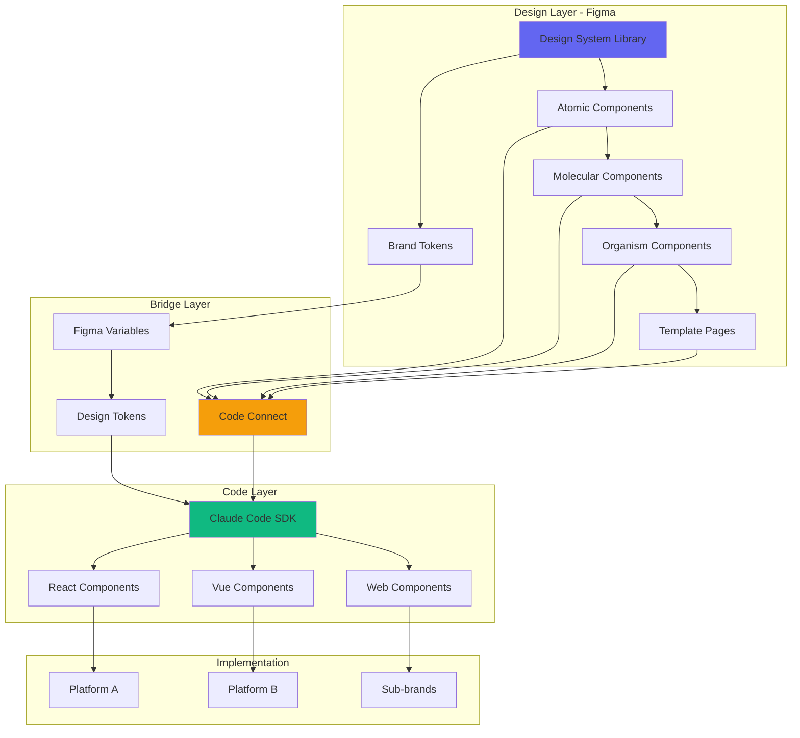

---

## 2. Atomic Design Hierarchy in Figma

### 2.1 Component Classification

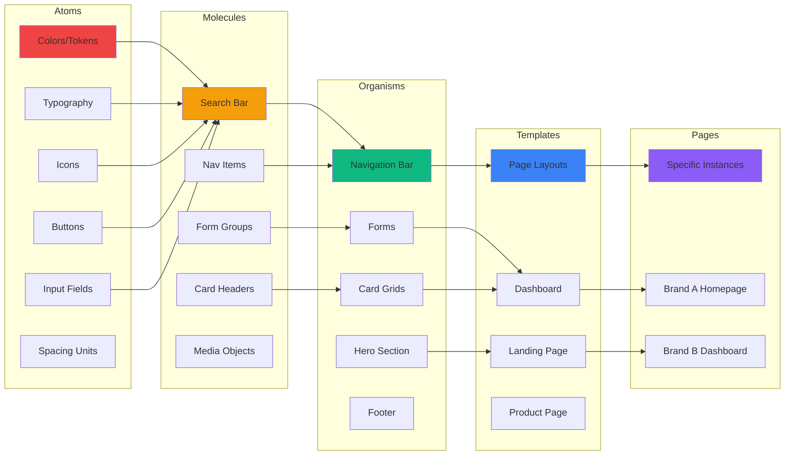

### 2.2 Component Naming Convention

```
Structure: [Category]/[Type]/[Variant]/[State]

Examples:
- atoms/button/primary/default
- atoms/button/primary/hover
- atoms/button/primary/disabled
- molecules/search-bar/with-filters/expanded
- organisms/navigation/header/desktop
- templates/dashboard/2-column/empty-state
```

---

## 3. Brand & Sub-Brand Architecture

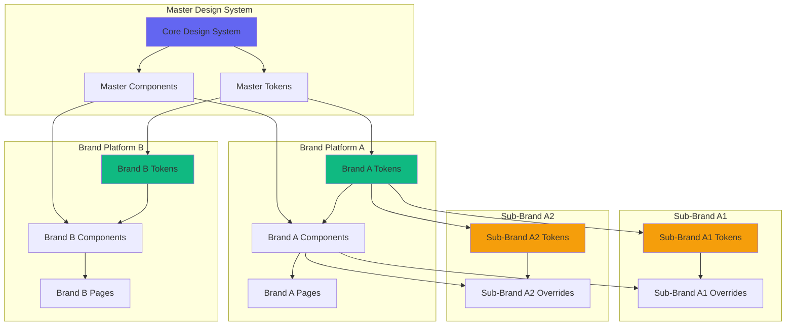

### 3.1 Token Inheritance Strategy

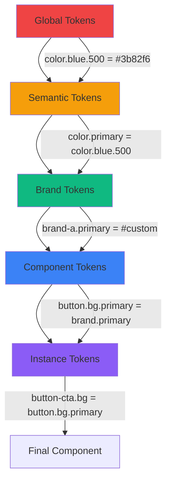

---

## 4. Figma Variables & Design Tokens

### 4.1 Token Structure

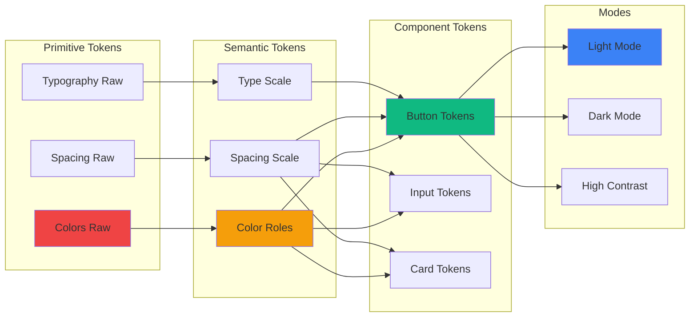

### 4.2 JSON Schema (Schema.org based)

```json
{
  "@context": "https://schema.org/",
  "@type": "DesignSystemToken",
  "name": "primary-color",
  "identifier": "color.brand.primary",
  "value": {
    "@type": "Color",
    "hexValue": "#3b82f6"
  },
  "category": "color",
  "subcategory": "brand",
  "modes": [
    {
      "@type": "Mode",
      "name": "light",
      "value": "#3b82f6"
    },
    {
      "@type": "Mode",
      "name": "dark",
      "value": "#60a5fa"
    }
  ],
  "metadata": {
    "wcagCompliance": "AAA",
    "usage": "Primary brand color for CTAs and key interactions",
    "aliases": ["primary", "brand-primary"]
  }
}
```

---

## 5. Code Integration Architecture

### 5.1 Figma → Code Flow

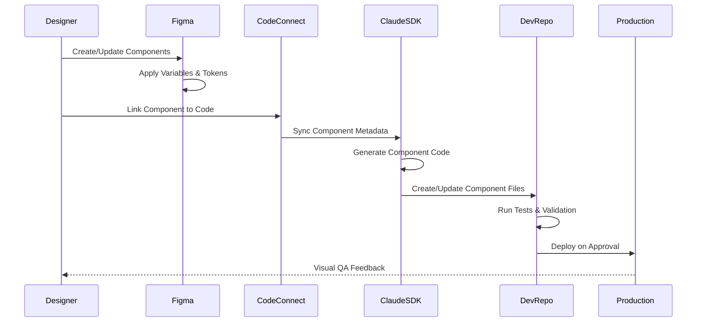

### 5.2 Component Code Generation

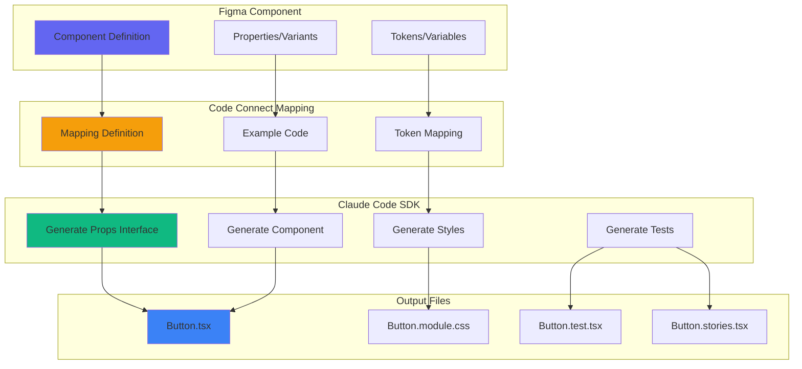

---

## 6. MVP Scope & Implementation Phases

### 6.1 MVP Phase Breakdown

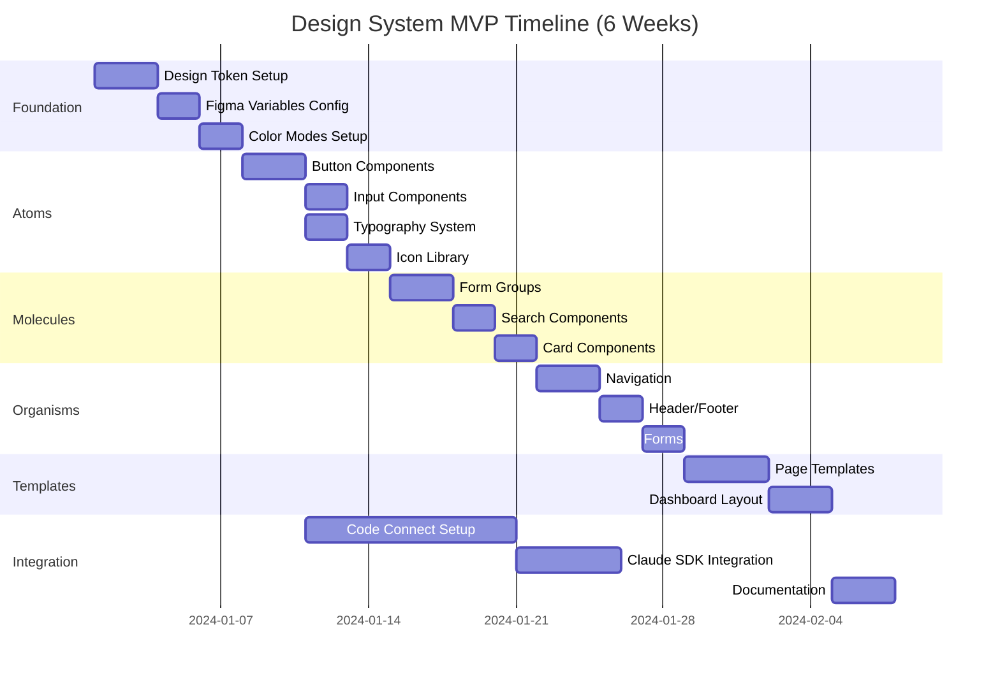

### 6.2 MVP Component Priority Matrix

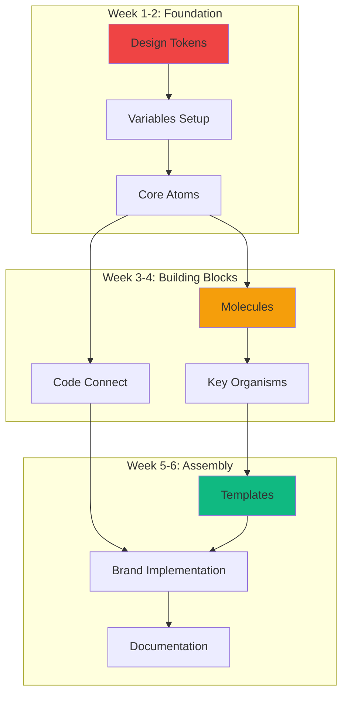

---

## 7. Component Specification Template

### 7.1 Atomic Component Structure

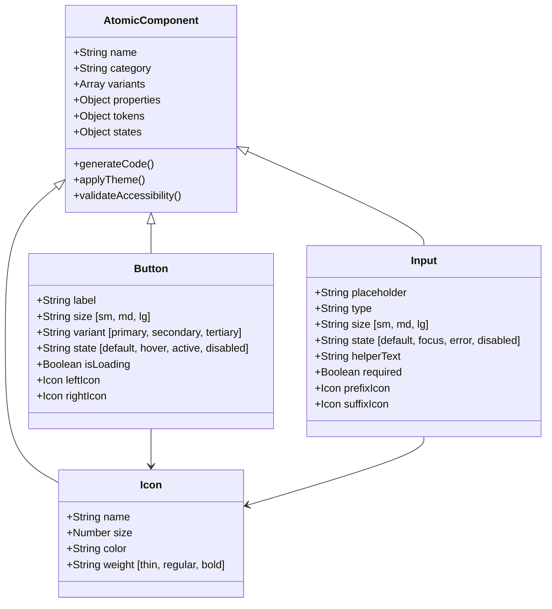

---

## 8. File Structure & Organization

### 8.1 Figma File Architecture

```
Master Design System
├── 📁 00_Foundations
│   ├── Color Tokens
│   ├── Typography Scale
│   ├── Spacing Scale
│   ├── Border Radius
│   └── Shadows & Effects
│
├── 📁 01_Atoms
│   ├── Buttons
│   ├── Inputs
│   ├── Icons
│   ├── Badges
│   └── Avatars
│
├── 📁 02_Molecules
│   ├── Form Groups
│   ├── Search Bars
│   ├── Card Components
│   ├── Media Objects
│   └── List Items
│
├── 📁 03_Organisms
│   ├── Navigation
│   ├── Headers
│   ├── Footers
│   ├── Forms
│   └── Data Tables
│
├── 📁 04_Templates
│   ├── Dashboard Layouts
│   ├── Landing Pages
│   ├── Product Pages
│   └── Admin Layouts
│
├── 📁 05_Brand_A
│   ├── Brand Tokens
│   ├── Component Overrides
│   └── Brand Pages
│
└── 📁 06_Documentation
    ├── Usage Guidelines
    ├── Accessibility Notes
    └── Code Examples
```

### 8.2 Code Repository Structure

```
design-system/
├── packages/
│   ├── tokens/
│   │   ├── src/
│   │   │   ├── colors.json
│   │   │   ├── typography.json
│   │   │   └── spacing.json
│   │   └── package.json
│   │
│   ├── components/
│   │   ├── atoms/
│   │   │   ├── Button/
│   │   │   │   ├── Button.tsx
│   │   │   │   ├── Button.module.css
│   │   │   │   ├── Button.test.tsx
│   │   │   │   ├── Button.stories.tsx
│   │   │   │   └── index.ts
│   │   │   └── ...
│   │   ├── molecules/
│   │   ├── organisms/
│   │   └── templates/
│   │
│   └── themes/
│       ├── brand-a/
│       ├── brand-b/
│       └── sub-brands/
│
├── apps/
│   ├── storybook/
│   └── documentation/
│
└── tools/
    ├── figma-sync/
    └── code-generator/
```

---

## 9. Claude Code SDK Integration

### 9.1 Integration Workflow

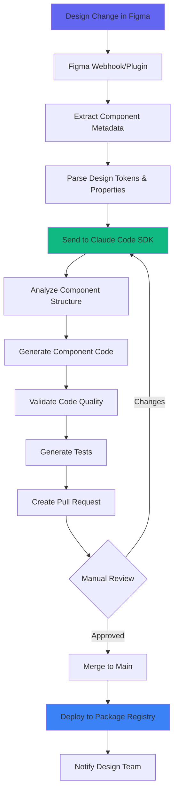

### 9.2 SDK Configuration Schema

```json
{
  "@context": "https://schema.org/",
  "@type": "SoftwareSourceCode",
  "name": "design-system-sdk-config",
  "programmingLanguage": "TypeScript",
  "configuration": {
    "figma": {
      "fileKey": "YOUR_FIGMA_FILE_KEY",
      "accessToken": "FIGMA_TOKEN",
      "componentLibraries": ["atoms", "molecules", "organisms"]
    },
    "codeGeneration": {
      "framework": "react",
      "styling": "css-modules",
      "typescript": true,
      "generateTests": true,
      "generateStories": true
    },
    "tokenTransform": {
      "format": "json",
      "platforms": ["web", "ios", "android"],
      "outputPath": "./packages/tokens"
    },
    "validation": {
      "accessibility": true,
      "wcagLevel": "AA",
      "linting": true,
      "typeChecking": true
    },
    "deployment": {
      "registry": "npm",
      "packageScope": "@your-org",
      "automaticPublish": false
    }
  }
}
```

---

## 10. Quality Assurance & Validation

### 10.1 Component Validation Flow

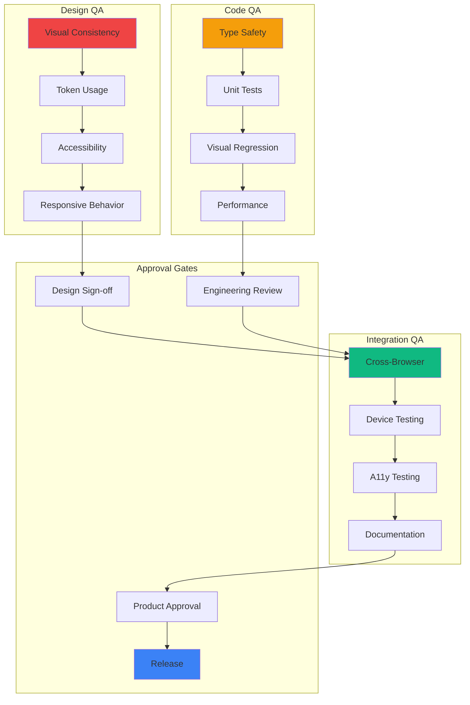

---

## 11. MVP Deliverables Checklist

### 11.1 Phase 1: Foundation (Week 1-2)
- [ ] Design token system (colors, typography, spacing)
- [ ] Figma variables setup with modes (light/dark)
- [ ] Base component structure
- [ ] Naming conventions documented
- [ ] Initial atoms (Button, Input, Icon, Typography)

### 11.2 Phase 2: Components (Week 3-4)
- [ ] Core molecules (Form Groups, Cards, Search)
- [ ] Key organisms (Navigation, Header, Footer)
- [ ] Component variants and states
- [ ] Code Connect mappings
- [ ] Accessibility annotations

### 11.3 Phase 3: Integration (Week 5-6)
- [ ] 2-3 page templates
- [ ] Brand A implementation
- [ ] Claude Code SDK integration
- [ ] Component documentation
- [ ] Usage guidelines
- [ ] Code generation pipeline
- [ ] Testing framework

---

## 12. Success Metrics

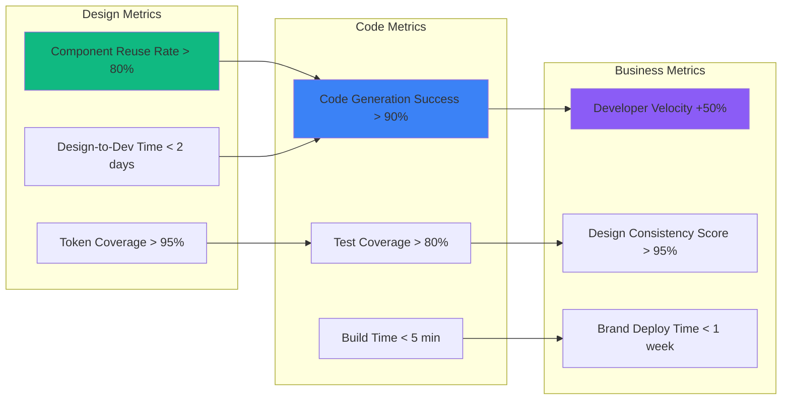

---

## 13. Risk Mitigation

### 13.1 Timeline Risks

| Risk | Impact | Mitigation |
|------|--------|-----------|
| Scope creep beyond atoms/molecules | HIGH | Lock MVP scope, defer advanced features to v2 |
| Code Connect learning curve | MEDIUM | Dedicate 2 days for team training |
| Brand token complexity | MEDIUM | Start with single brand, expand post-MVP |
| Integration issues with Claude SDK | HIGH | Run parallel prototype in week 1 |
| Design/dev sync delays | MEDIUM | Daily 15-min standups |

### 13.2 Risk Response Flow

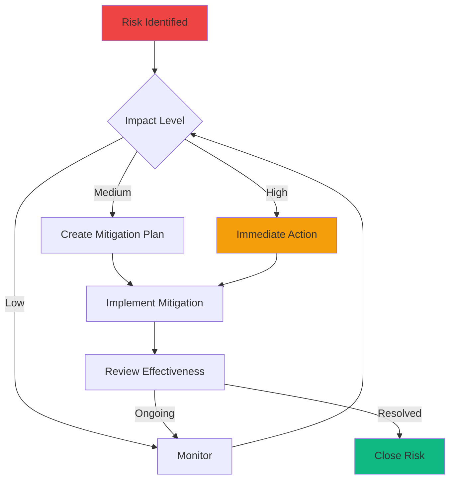

---

## 14. Post-MVP Roadmap

### 14.1 Future Phases

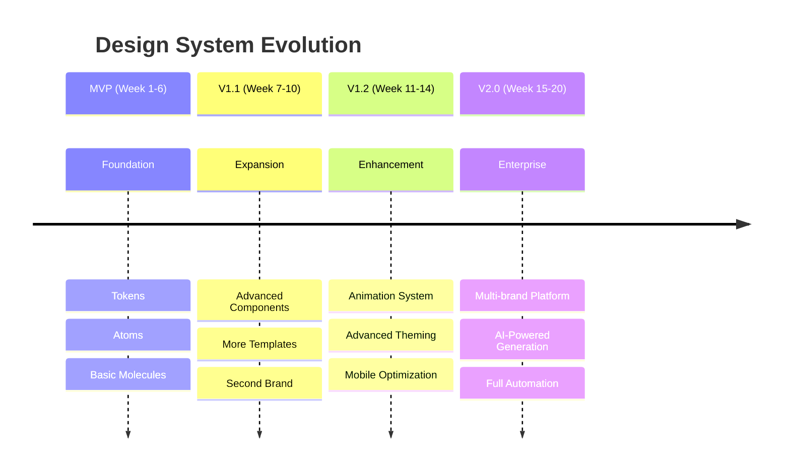

---

## 15. Team & Responsibilities

### 15.1 Role Matrix

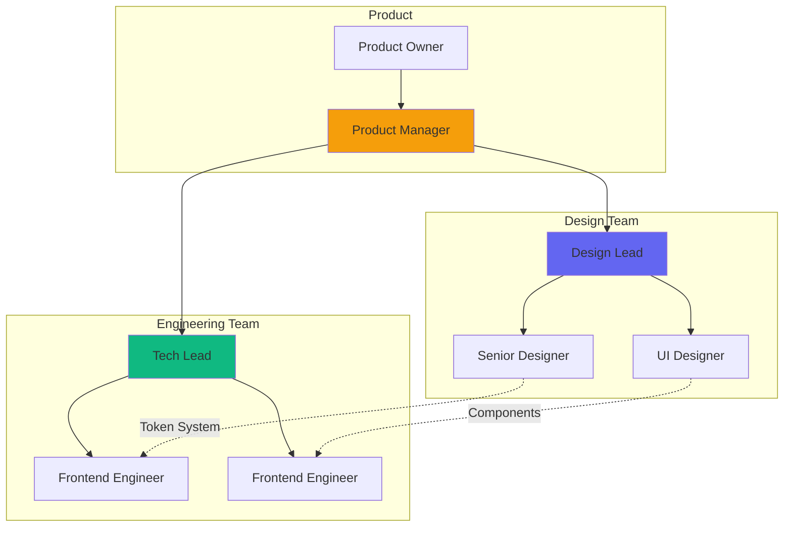

---

## 16. Documentation & Training

### 16.1 Documentation Types

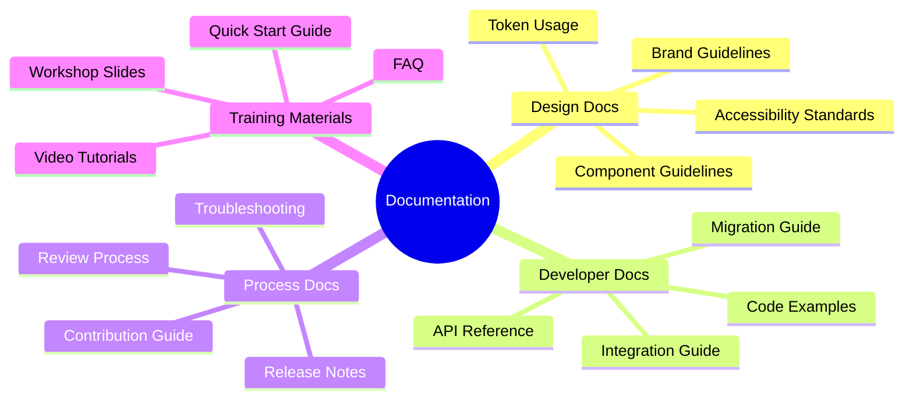

---

## 17. Appendix: Tool Stack

### 17.1 Recommended Tools

| Category | Tool | Purpose |
|----------|------|---------|
| Design | Figma | Component design & prototyping |
| Variables | Figma Variables | Token management |
| Sync | Code Connect | Design-code linking |
| Generation | Claude Code SDK | Code generation |
| Version Control | Git | Component versioning |
| Package Manager | npm/yarn | Distribution |
| Documentation | Storybook | Component showcase |
| Testing | Jest + RTL | Component testing |
| CI/CD | GitHub Actions | Automation |
| Token Transform | Style Dictionary | Multi-platform tokens |

### 17.2 Integration Stack Diagram

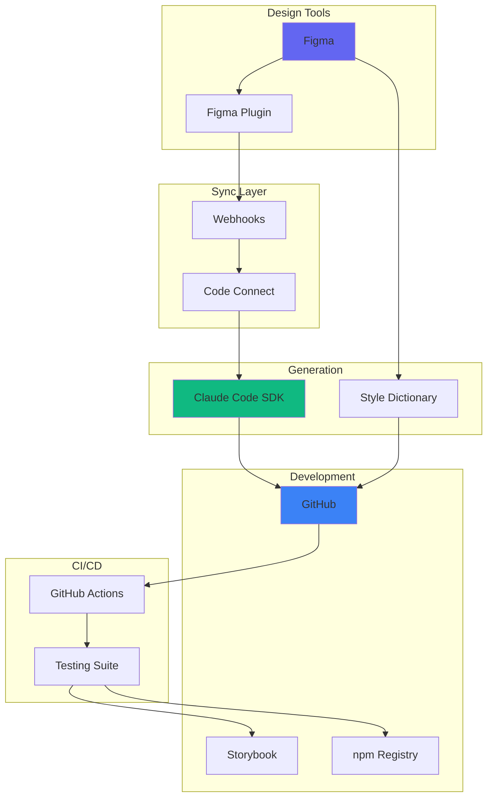

---

## 18. MVP Acceptance Criteria

### Final Checklist

**Design System Foundation:**
- [ ] 50+ design tokens defined and documented
- [ ] Light and dark modes fully implemented
- [ ] 15+ atomic components with all variants
- [ ] 8+ molecular components
- [ ] 5+ organism components
- [ ] 2+ page templates

**Code Integration:**
- [ ] Code Connect mappings for all components
- [ ] Claude SDK successfully generating 90%+ of components
- [ ] Generated code passes all tests
- [ ] Storybook documentation live
- [ ] npm package published

**Brand Implementation:**
- [ ] Master design system file complete
- [ ] Brand A tokens and overrides implemented
- [ ] Sample pages built for Brand A
- [ ] Migration guide documented

**Quality:**
- [ ] All components WCAG 2.1 AA compliant
- [ ] 80%+ test coverage
- [ ] Performance benchmarks met
- [ ] Documentation complete
- [ ] Training materials delivered

---

**Document Version:** 1.0  
**Last Updated:** November 2024  
**Status:** MVP Scoping  
**Next Review:** Week 2 of Implementation
