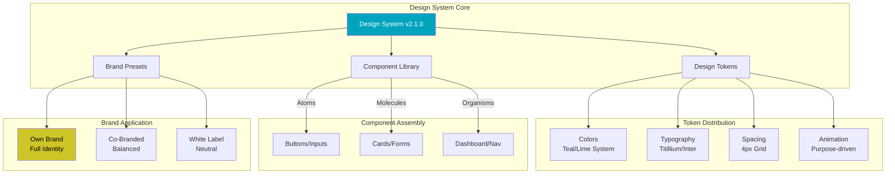
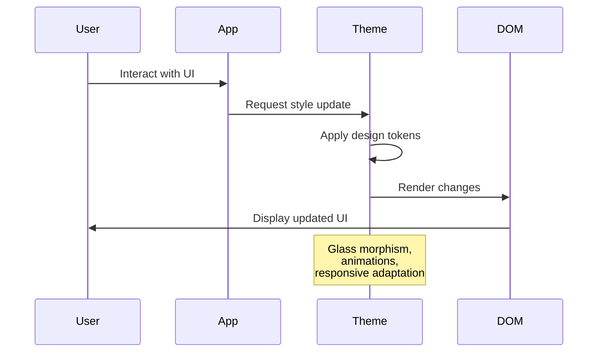

# BAIV App Style Guide v2.3.0

## Table of Contents

1. [Executive Summary](#1-executive-summary)
2. [Document Control](#2-document-control)
3. [Design Philosophy](#3-design-philosophy)
4. [Color System](#4-color-system)
5. [Typography](#5-typography)
6. [Spacing & Layout](#6-spacing--layout)
7. [Component Library](#7-component-library)
8. [Animation & Transitions](#8-animation--transitions)
9. [Glass Morphism System](#9-glass-morphism-system)
10. [Responsive Framework](#10-responsive-framework)
11. [Accessibility Standards](#11-accessibility-standards)
12. [Brand Modes](#12-brand-modes)
13. [Implementation Guidelines](#13-implementation-guidelines)
14. [Appendix A: Ontology Framework](#appendix-a-ontology-framework)
15. [Appendix B: Design System Architecture](#appendix-b-design-system-architecture)
16. [Appendix C: JSON Schema](#appendix-c-json-schema)

---

## 1. Executive Summary

### Purpose
This App Style Guide defines the ultra-minimalist design system for BAIV (Be AI Visible) platform applications. It prioritizes clarity, functionality, and user focus while maintaining visual sophistication through subtle depth and intelligent use of space.

### What Makes This Guide Different
Unlike traditional design systems that add layers of complexity, the BAIV approach removes everything unnecessary. Every pixel, every color, and every animation serves a specific purpose: helping users focus on what matters - their AI visibility transformation.

### Key Principles
- **Ultra Minimalism**: Maximum impact with minimum elements
- **Functional Beauty**: Every design element serves a purpose
- **User Focus**: Remove distractions, amplify value
- **Intelligent Space**: Strategic use of whitespace as a design element
- **Subtle Sophistication**: Depth through glass morphism and gradients

### Scope
This guide applies to all BAIV platform interfaces including:
- WordPress plugins
- Web applications
- Mobile interfaces
- Marketing materials
- Documentation

---

## 2. Document Control

### Version Information
| Version | Date | Author | Status | Changes |
|---------|------|--------|---------|---------|
| 2.3.0 | 2025-01-17 | BAIV Design Team | Current | Removed scraper, streamlined brand management |
| 2.2.0 | 2025-01-17 | BAIV Design Team | Superseded | Added logo management system |
| 2.1.0 | 2025-01-17 | BAIV Design Team | Superseded | Added narratives & visual examples |
| 2.0.0 | 2025-01-17 | BAIV Design Team | Superseded | Complete redesign for ultra-minimalism |
| 1.0.0 | 2024-09-04 | Original Team | Archived | Initial release |

### Version Numbering Convention
- **Major (X.0.0)**: Breaking changes to design system
- **Minor (2.X.0)**: New components or significant enhancements
- **Patch (2.1.X)**: Bug fixes and minor adjustments

### Change Control Process

#### Change Request Procedure
1. **Submission**: Submit change requests via BAIV Design Committee
2. **Review**: Quarterly design review meetings
3. **Approval**: Requires 2/3 majority of Design Committee
4. **Implementation**: 30-day notice before changes take effect
5. **Documentation**: All changes logged in Change History

#### Change History
| Date | Version | Change Description | Approved By | Impact |
|------|---------|-------------------|-------------|---------|
| 2025-01-17 | 2.1.0 | Added narrative explanations and visual examples | Design Committee | Minor |
| 2025-01-17 | 2.0.0 | Complete redesign for ultra-minimalism | Design Committee | Major |
| 2025-01-17 | 2.0.0 | Added glass morphism system | Design Committee | Major |
| 2025-01-17 | 2.0.0 | Introduced ontology framework | Tech Committee | Major |

### Governance
- **Design Committee**: Reviews and approves all changes
- **Technical Committee**: Validates technical implementation
- **Brand Committee**: Ensures brand consistency
- **Review Cycle**: Quarterly with annual major revision

---

## 3. Design Philosophy

### Core Tenets

#### Ultra Minimalism
**Philosophy**: In a world of information overload, clarity becomes competitive advantage. We remove everything that doesn't directly serve the user's goals.

**In Practice**: A dashboard shows only essential metrics on first view. Additional details appear on demand, never by default. White space isn't empty - it's functional breathing room that guides attention.

```
❌ Traditional Approach:          ✅ BAIV Approach:
┌─────────────────────┐          ┌─────────────────────┐
│ ▪️▪️▪️ ▫️▫️ ▪️▪️ │          │                     │
│ ━━━━━━━━━━━━━━━━━━ │          │    60% Visible ↑    │
│ ░░░░░░░░░░░░░░░░░░ │          │                     │
│ ▓▓▓▓▓▓▓▓▓▓▓▓▓▓▓▓▓ │          │    [View Details]   │
│ ▒▒▒▒▒▒▒▒▒▒▒▒▒▒▒▒▒ │          │                     │
└─────────────────────┘          └─────────────────────┘
   Information Overload            Focused Clarity
```

#### Functional Hierarchy
**Philosophy**: Users should never wonder what to do next. The visual hierarchy creates an obvious path through complexity.

```
Priority 1: Core Action (Primary CTA) ━━━━━ Largest, boldest
Priority 2: Supporting Information    ────── Clear but secondary  
Priority 3: Navigation/Wayfinding    ╌╌╌╌╌ Subtle, always available
Priority 4: Contextual Help          ····· On-demand only
Priority 5: Decorative Elements      ˙˙˙˙˙ Minimal to none
```

#### Cognitive Load Reduction
**Philosophy**: Every decision point adds friction. We minimize choices while maximizing clarity.

**Implementation Rules**:
- Maximum 3 primary actions per screen
- Clear visual hierarchy through size and contrast
- Consistent patterns reduce learning curve
- Predictable interactions

### Design Principles with Examples

1. **Clarity Over Cleverness**: 
   - ❌ "Initiate Visibility Enhancement Protocol"
   - ✅ "Start Analysis"

2. **Space Is Content**: 
   - Whitespace creates visual relationships better than borders
   - Generous padding reduces anxiety and improves focus

3. **Depth Without Clutter**: 
   - Glass morphism creates layers without heavy shadows
   - Subtle gradients add dimension without distraction

4. **Motion With Purpose**: 
   - Animation only for state changes (not decoration)
   - Smooth transitions reduce cognitive jarring

5. **Accessibility First**: 
   - High contrast ratios aren't just compliant - they're clearer for everyone
   - Focus states that are obvious without being obtrusive

---

## 4. Color System

### Understanding Our Palette
Our color system isn't just aesthetically pleasing - each color has a specific psychological and functional purpose.

### Primary Palette

#### Core Colors
```css
:root {
  /* Primary Brand Colors */
  --primary: #00a4bf;        /* Teal - Trust & Technology */
  --primary-dark: #005260;   /* Deep Teal - Authority & Depth */
  --primary-light: #cce8ee;  /* Light Teal - Breathing Room */
  
  /* Accent Colors */
  --accent: #cec528;         /* Lime - Energy & Attention */
  --success: #019587;        /* Green - Growth & Confirmation */
  --warning: #cf057d;        /* Magenta - Alert Without Alarm */
  --danger: #cf057d;         /* Magenta - Serious Attention */
```

#### Visual Color Examples

**Primary Teal (#00a4bf)** - The Digital Ocean
```
╔═══════════════════════════════╗
║                               ║ Used for primary actions
║     START ANALYSIS            ║ that move users forward
║                               ║
╚═══════════════════════════════╝
```

**Accent Lime (#cec528)** - The Lightning Strike
```
    ⚡ NEW INSIGHT AVAILABLE
```
Draws attention without overwhelming. Used sparingly for maximum impact.

**Success Green (#019587)** - The Growth Signal
```
✓ Analysis Complete
■■■■■■■■■■ 100%
```

### Semantic Color Application

| Context | Color | Why This Works |
|---------|-------|----------------|
| Primary Actions | Teal `#00a4bf` | Trustworthy, professional, forward-moving |
| Focus States | Lime `#cec528` | Impossible to miss, energetic without anxiety |
| Success States | Green `#019587` | Universal positive, calming achievement |
| Warnings/Errors | Magenta `#cf057d` | Attention-getting without panic-inducing red |
| Body Text | Dark Gray `#393939` | Softer than black, reduces eye strain |
| Backgrounds | Warm White `#f5f3d4` | Warmer than pure white, reduces glare |

### Gradient Philosophy
Gradients add depth without complexity. Our primary gradient subtly suggests progress and sophistication:

```css
/* The Journey Gradient */
--gradient: linear-gradient(135deg, #00a4bf 30%, #005260 100%);
```

Visual representation:
```
Start (Light Teal) ████████░░░░░░░░ End (Deep Teal)
                   Progress & Depth
```

---

## 5. Typography

### Font Philosophy
Typography isn't just about readability - it's about personality and pace. Our dual-font system creates rhythm and hierarchy.

### Font Stack
```css
:root {
  /* Titillium Web: The Voice of Authority */
  --font-heading: 'Titillium Web', -apple-system, BlinkMacSystemFont, sans-serif;
  
  /* Inter: The Conversational Companion */
  --font-body: 'Inter', -apple-system, BlinkMacSystemFont, 'Segoe UI', sans-serif;
  
  /* SF Mono: The Technical Truth */
  --font-mono: 'SF Mono', Monaco, 'Cascadia Code', monospace;
}
```

### Why These Fonts?

**Titillium Web for Headings**
- Distinctive personality without being decorative
- Excellent readability at large sizes
- Technical yet approachable

**Inter for Body**
- Optimized for screen reading
- Neutral enough to not compete with content
- Outstanding at small sizes

### Type Scale in Action

```
H1: Your AI Visibility Score     (32px - Titillium - Bold)
    ════════════════════════

H2: Performance Overview          (24px - Titillium - Bold)
    ────────────────────

H3: Recent Activity              (18px - Titillium - Semibold)
    ╌╌╌╌╌╌╌╌╌╌╌╌

Body: Your visibility improved    (14px - Inter - Normal)
      by 25% this month.

Small: Last updated 2 hours ago   (12px - Inter - Normal)

Micro: PRO TIP                    (11px - Inter - Medium)
```

### Typography Hierarchy Rules

| Level | When to Use | Visual Weight |
|-------|------------|---------------|
| H1 | One per page maximum | Unmistakable focal point |
| H2 | Major sections (3-5 per page) | Clear section breaks |
| H3 | Subsections within H2 | Gentle subdivision |
| Body | All content text | Comfortable reading |
| Small | Supporting information | Present but not prominent |
| Micro | Labels and metadata | Functional whispers |

---

## 6. Spacing & Layout

### The 4px Grid System
Everything aligns to a 4px grid. This invisible structure creates harmony without rigid constraints.

```
Base Unit = 4px

1 unit  = ▪️ (4px)  - Hairline spacing
2 units = ▪️▪️ (8px)  - Tight grouping
4 units = ▪️▪️▪️▪️ (16px) - Standard spacing
6 units = ▪️▪️▪️▪️▪️▪️ (24px) - Section breaks
8 units = ▪️▪️▪️▪️▪️▪️▪️▪️ (32px) - Major divisions
```

### Spacing in Practice

**Tight Spacing (8px)** - Related elements
```
┌─────────────┐
│ Label       │ ← 8px gap
│ Value: 100  │
└─────────────┘
```

**Standard Spacing (16px)** - Default separation
```
┌─────────────┐
│  Section A  │
└─────────────┘
                ← 16px gap
┌─────────────┐
│  Section B  │
└─────────────┘
```

**Generous Spacing (32px)** - Major sections
```
┌─────────────────────────┐
│      Dashboard          │
└─────────────────────────┘
                           ← 32px gap
┌─────────────────────────┐
│      Analytics          │
└─────────────────────────┘
```

### Container Philosophy
Containers aren't boxes - they're stages that frame content:

```css
.container {
  max-width: 1400px;  /* Optimal reading width */
  margin: 0 auto;      /* Centered stage */
  padding: 24px;       /* Breathing room */
}
```

Visual representation:
```
┌─ Browser Window ─────────────────────────────────┐
│                                                  │
│     ┌─ Container (1400px max) ─────────┐       │
│     │                                   │       │
│     │   Your content lives here        │       │
│     │   with comfortable margins       │       │
│     │                                   │       │
│     └───────────────────────────────────┘       │
│                                                  │
└──────────────────────────────────────────────────┘
```

---

## 7. Component Library

### Logo System

#### Logo Philosophy
Logos adapt to brand modes while maintaining structural consistency. Each brand configuration requires multiple logo variations for different contexts and backgrounds.

#### Logo Specifications

**Logo Variations Required**:
```
Primary Logo     - Full color version for main use
Light Version    - For dark backgrounds
Dark Version     - For light backgrounds  
Icon Only        - Square format for avatars/favicons
Wordmark Only    - Text-only version
```

**Logo Formats & Sizes**:
```
Format Priority:
1. SVG (vector, scalable)
2. PNG (transparency support)
3. WebP (modern optimization)

Size Requirements:
- Icon: 512x512px minimum
- Header: 200px height max
- Mobile: 40px height min
- Favicon: 32x32px, 16x16px
```

#### Logo Implementation

**HTML Structure**:
```html
<div class="logo-container">
  
</div>
```

**CSS Styling**:
```css
.logo-container {
  width: 60px;
  height: 60px;
  display: flex;
  align-items: center;
  justify-content: center;
  overflow: hidden;
}

.logo-img {
  max-width: 100%;
  max-height: 100%;
  object-fit: contain;
}
```

#### Logo Storage Structure

```
/assets/logos/
├── baiv/
│   ├── primary.svg
│   ├── light.svg
│   ├── dark.svg
│   ├── icon.svg
│   └── wordmark.svg
├── partners/
│   ├── w4m/
│   └── thinktank/
└── whitelabel/
    └── client-template/
```

#### Co-Branding Logo Rules

**Layout Options**:
```
Side-by-Side:      [Logo A] + [Logo B]
Stacked:           [Logo A]
                   [Logo B]
Blended:           [Combined Mark]
```

**Size Relationships**:
- Primary brand: 60% visual weight
- Secondary brand: 40% visual weight
- Equal partnership: 50/50 split

### Design Components as Building Blocks
Each component is crafted to work alone or in combination, maintaining consistency while allowing flexibility.

### Cards

#### Glass Card - The Floating Panel
Our signature component that appears to hover above the background:

```css
.card-glass {
  background: rgba(255, 255, 255, 0.95);
  backdrop-filter: blur(20px);
  border-radius: 16px;
  padding: 24px;
  box-shadow: 0 20px 40px rgba(0, 0, 0, 0.1);
  border: 1px solid rgba(255, 255, 255, 0.1);
}
```

Visual representation:
```
╔══════════════════════════════╗
║  ░░░░░░░░░░░░░░░░░░░░░░░░░  ║ ← Translucent background
║  ░  Dashboard Overview   ░  ║ ← Content floats
║  ░                       ░  ║
║  ░  60% Visibility ↑     ░  ║ ← Key metric prominent
║  ░                       ░  ║
║  ░░░░░░░░░░░░░░░░░░░░░░░░░  ║
╚══════════════════════════════╝
     ↓ Soft shadow creates depth
```

### Buttons

#### Primary Button - The Call to Action
Designed to be impossible to ignore when needed, invisible when not:

```
┌─────────────────────────┐
│                         │
│   ANALYZE MY SITE →     │  ← Gradient background
│                         │  ← Forward arrow suggests progress
└─────────────────────────┘
    ▒▒▒▒▒▒▒▒▒▒▒▒▒▒▒      ← Colored shadow reinforces importance
```

**States:**
- Default: Gradient background with subtle shadow
- Hover: Lifts 2px with enhanced shadow
- Active: Pressed appearance
- Disabled: 50% opacity, no shadow

#### Secondary Button - The Alternative Path
```
┌─────────────────────┐
│   ← Back            │  ← Subtle gray, doesn't compete
└─────────────────────┘
```

### Form Elements

#### Input Fields - The Information Gateway
Inputs transform from passive to active when engaged:

```
Default State:
┌──────────────────────────────┐
│  Enter your website URL      │  ← Placeholder text
└──────────────────────────────┘

Focus State:
┌══════════════════════════════┐
║  https://example.com|        ║  ← Lime accent border
└══════════════════════════════┘
    ░░░░░░░░░░░░░░░░░░░░       ← Soft glow reinforces focus
```

### Progress Indicators

#### Progress Bar - The Journey Visualization
Shows advancement without anxiety:

```
Progress: 60%
╔══════════════════════════════════════╗
║████████████████████░░░░░░░░░░░░░░░░░║
╚══════════════════════════════════════╝
        ↓                    ↓
   Completed             Remaining
   (Gradient)           (Neutral)

   ✨ Shimmer effect shows active progress
```

#### Step Indicators - The Roadmap
```
  ① -------- ② -------- ③ -------- ④ -------- ⑤
  ✓          ✓          ●          ○          ○
Done       Done     Current    Future     Future

Green     Green      Teal       Gray       Gray
```

---

## 8. Animation & Transitions

### Motion Principles
Animation should feel inevitable, not decorative. Every movement has meaning.

### Core Transitions
```css
/* The Smooth Operator */
--transition: all 0.3s cubic-bezier(0.4, 0, 0.2, 1);
```

This creates natural, organic movement that feels responsive without being jarring.

### Animation Library Examples

#### Entrance Animations
**Slide Down** - For headers and notifications:
```
Frame 1:    _____ (invisible, above viewport)
Frame 2:    ▔▔▔▔▔ (fading in, moving down)
Frame 3:    █████ (fully visible, in position)
```

**Fade In** - For content loading:
```
Frame 1:    ░░░░░ (0% opacity)
Frame 2:    ▒▒▒▒▒ (50% opacity)
Frame 3:    █████ (100% opacity)
```

#### Continuous Animations
**Pulse** - For live indicators:
```
   ●  →  ◉  →  ◎  →  ◉  →  ●
Small → Grow → Large → Shrink → Small
         (2s cycle)
```

**Shimmer** - For loading states:
```
░░░░░█░░░░░  →  ░░░░░░█░░░░  →  ░░░░░░░█░░░
    Light moves across surface
```

### When to Animate

| Scenario | Animation | Duration | Purpose |
|----------|-----------|----------|---------|
| Page load | Fade in | 0.5s | Gentle arrival |
| Button hover | Lift | 0.15s | Immediate feedback |
| Modal open | Slide down + fade | 0.3s | Smooth transition |
| Progress update | Width change | 0.5s | Show advancement |
| Loading | Shimmer | Continuous | Activity indicator |

---

## 9. Glass Morphism System

### The Art of Translucency
Glass morphism creates depth without heavy visual elements. It suggests layers and hierarchy through transparency.

### Glass Effect Variations

#### Standard Glass - The Default Layer
```css
.glass {
  background: rgba(255, 255, 255, 0.95);  /* 95% white */
  backdrop-filter: blur(20px);            /* Background blur */
  border: 1px solid rgba(255, 255, 255, 0.1);
}
```

Visual representation:
```
Background Pattern:  ################
                     ################
Glass Panel:         ┌──────────────┐
                     │░░░░░░░░░░░░░░│ ← See-through
                     │░ Content   ░░│ ← But readable
                     │░░░░░░░░░░░░░░│
                     └──────────────┘
Result:              Blurred background visible
```

#### Dark Glass - For overlays and modals
```
╔═══════════════════════╗
║▓▓▓▓▓▓▓▓▓▓▓▓▓▓▓▓▓▓▓▓▓║ ← 50% black
║▓   Modal Content    ▓║ ← High contrast text
║▓                    ▓║
╚═══════════════════════╝
```

#### Subtle Glass - For nested components
```
┌─────────────┐
│·············│ ← 70% white
│· Light Box ·│ ← Minimal blur
│·············│
└─────────────┘
```

### Depth System Through Shadows

```
Depth 1: ─     Barely lifted (1px shadow)
Depth 2: ═     Floating (10px shadow)
Depth 3: ▬     Hovering (20px shadow)
Depth 4: ▓     Elevated (30px shadow)
```

---

## 10. Responsive Framework

### Mobile-First Philosophy
Design for the smallest screen first, then enhance. This ensures core functionality works everywhere.

### Breakpoint System
```
320px       640px      768px       1024px      1280px      1536px
Mobile      Mobile     Tablet      Desktop     Large       Ultra
  │           │          │           │           │           │
  └─ Phone ───┴─ Phablet─┴─ Tablet ──┴─ Laptop ──┴─ Desktop ─┘
```

### Responsive Behavior Examples

#### Navigation Evolution
```
Mobile (320px):          Tablet (768px):         Desktop (1024px):
┌──────────┐            ┌──────────────────┐    ┌────────────────────┐
│ ☰ Menu   │            │ Logo    Menu ▼   │    │ Logo  Home About.. │
└──────────┘            └──────────────────┘    └────────────────────┘
  Hamburger              Dropdown                 Full horizontal
```

#### Grid Adaptation
```
Mobile:     Tablet:          Desktop:
┌────┐      ┌────┬────┐      ┌────┬────┬────┬────┐
│ A  │      │ A  │ B  │      │ A  │ B  │ C  │ D  │
├────┤      ├────┴────┤      ├────┴────┴────┴────┤
│ B  │      │    C    │      │        E          │
├────┤      ├────┬────┤      └───────────────────┘
│ C  │      │ D  │ E  │      
├────┤      └────┴────┘      
│ D  │                        
├────┤                        
│ E  │                        
└────┘                        
Stack       2 Column          4 Column + Full Width
```

### Touch Target Sizing
```
Desktop:                    Mobile:
┌─────────┐                ┌───────────────┐
│ 32x32px │                │    44x44px    │
│  Small  │                │    Minimum    │
└─────────┘                └───────────────┘
                           
Mouse precision            Finger friendly
```

---

## 11. Accessibility Standards

### Inclusive by Default
Accessibility isn't an afterthought - it's the foundation. What's good for accessibility is good for all users.

### Color Contrast in Practice

#### Text Contrast Examples
```
Background: White (#FFFFFF)

AAA Compliant:              AA Compliant:           Fails:
■ Dark Gray (#393939)       ■ Medium Gray (#6B7280) ■ Light Gray (#D1D5DB)
Ratio: 11.4:1 ✓            Ratio: 4.8:1 ✓          Ratio: 1.8:1 ✗
Perfect readability         Acceptable              Hard to read
```

### Focus State Implementation
Never hide focus indicators. Make them beautiful instead:

```
Default Button:             Focused Button:
┌────────────┐             ╔════════════╗
│   Click    │             ║   Click    ║ ← Lime outline
└────────────┘             ╚════════════╝
                              ░░░░░░░░░   ← 2px offset glow
```

### Screen Reader Considerations

#### Semantic HTML Structure
```html
<!-- Correct: Semantic and accessible -->
<button class="btn-primary">
  Start Analysis
  <span class="sr-only">Opens analysis dashboard</span>
</button>

<!-- Wrong: Div with click handler -->
<div onclick="startAnalysis()">Start Analysis</div>
```

### Keyboard Navigation Map
```
TAB KEY FLOW:
[Logo] → [Nav Item 1] → [Nav Item 2] → [Search] → 
[Main Content] → [Primary CTA] → [Secondary Actions] →
[Footer Links]

All interactive elements reachable via keyboard
```

---

## 12. Brand Modes

### Three Faces, One System
The design system adapts to three distinct brand modes while maintaining consistency. Each mode includes specific logo and color configurations managed through Master Organization IDs.

### Master Organization Architecture

```
Master Org IDs:
├── master-001 (BAIV Home Brand)
│   └── Full brand identity
├── partner-002 (W4M Co-Brand)
│   └── Bridged relationship
├── partner-003 (Think Tank Co-Brand)
│   └── Bridged relationship
└── client-004+ (White Label Clients)
    └── Custom configurations
```

### Own Brand Mode - Full BAIV Identity
```
┌─────────────────────────────────────┐
│ 🔷 BAIV Logo    [Teal/Lime Accents] │
│                                     │
│  ▣ Full gradient buttons            │
│  ◉ Glass morphism effects           │
│  ✨ Complete animation suite        │
│  📁 Logo: /images/BAIV_Logo.svg     │
│                                     │
└─────────────────────────────────────┘
```

Configuration:
```json
{
  "brandMode": "own",
  "masterId": "master-001",
  "primaryColor": "#00a4bf",
  "logos": {
    "primary": "/images/BAIV_Logo_Master3Color.svg",
    "variations": ["light", "dark", "icon", "wordmark"]
  },
  "animations": "full",
  "glassEffects": true
}
```

### Co-Branded Mode - Shared Identity
```
┌─────────────────────────────────────┐
│ 🔷 BAIV  +  🟢 Partner              │
│                                     │
│  ▢ Blended color palette           │
│  ○ Reduced glass effects           │
│  - Subtle animations               │
│  📁 Dual logos side-by-side        │
│                                     │
└─────────────────────────────────────┘
```

Visual balance: 60% BAIV, 40% Partner identity
Logo arrangement: Side-by-side or stacked based on context

### White Label Mode - Client Identity
```
┌─────────────────────────────────────┐
│ 🟩 Client Logo     [Client Colors] │
│                                     │
│  □ Solid colors only               │
│  ○ No glass effects                │
│  · Minimal animations              │
│  📁 Client logos only              │
│                                     │
└─────────────────────────────────────┘
```

Only structural elements remain from BAIV system.
Client provides all brand assets via configuration.

---

## 13. Implementation Guidelines

### Getting Started Checklist

#### Phase 1: Foundation (Day 1)
- [ ] Load font files (Titillium Web, Inter)
- [ ] Set up CSS custom properties
- [ ] Implement base reset styles
- [ ] Configure responsive breakpoints

#### Phase 2: Components (Week 1)
- [ ] Build button components
- [ ] Create card templates
- [ ] Implement form elements
- [ ] Add progress indicators

#### Phase 3: Enhancement (Week 2)
- [ ] Add glass morphism effects
- [ ] Implement animations
- [ ] Configure brand mode switching
- [ ] Test accessibility

### Code Organization

```css
/* Recommended CSS Architecture */

/* 1. Reset Layer */
@layer reset {
  *, *::before, *::after { box-sizing: border-box; }
}

/* 2. Base Layer */
@layer base {
  :root { /* All custom properties */ }
}

/* 3. Component Layer */
@layer components {
  .btn { /* Component styles */ }
}

/* 4. Utility Layer */
@layer utilities {
  .mt-4 { margin-top: 16px; }
}
```

### Performance Optimization

#### Critical CSS Strategy
```html
<!-- Inline critical styles -->
<style>
  /* Only above-the-fold styles */
  :root { --primary: #00a4bf; }
  .container { max-width: 1400px; }
</style>

<!-- Load full stylesheet async -->
<link rel="preload" href="styles.css" as="style">
```

#### Image Optimization
```html
<!-- Modern format with fallback -->
<picture>
  <source srcset="hero.webp" type="image/webp">
  <source srcset="hero.jpg" type="image/jpeg">
  
</picture>
```

---

## Appendix A: Ontology Framework

### Conceptual Overview
The ontology transforms static design rules into a living, intelligent system that can adapt and evolve.

### Visual Ontology Structure

```
🌍 Design System Universe
    │
    ├─ 🎨 Visual Language
    │   ├─ Color Relationships
    │   ├─ Type Hierarchies
    │   └─ Spatial Systems
    │
    ├─ 🧩 Component Taxonomy
    │   ├─ Atomic Elements
    │   ├─ Molecular Patterns
    │   └─ Organism Templates
    │
    └─ 🔄 Adaptation Rules
        ├─ Brand Transformations
        ├─ Responsive Mutations
        └─ Context Awareness
```

### Relationship Mapping
```
Component A  ──uses──>     Design Token
     ↓                           ↑
  inherits                    modifies
     ↓                           ↑
Component B  ←─requires──  Brand Mode
```

### Implementation Benefits

1. **Consistency**: Automatic rule enforcement
2. **Flexibility**: Easy mode switching
3. **Scalability**: Self-documenting system
4. **Evolution**: Version-controlled changes
5. **Intelligence**: Self-validating design

---

## Appendix B: Design System Architecture

### System Overview Diagram



### Component Interaction Flow



---

## Appendix C: JSON Schema Configuration

### Quick Implementation Guide

The JSON configuration file enables instant style application across any framework or platform.

### Usage Examples

#### Vanilla JavaScript
```javascript
// Load and apply styles
fetch('baiv-style-config.json')
  .then(res => res.json())
  .then(config => {
    // Apply CSS custom properties
    const root = document.documentElement;
    Object.entries(config.customProperties.css).forEach(([prop, value]) => {
      root.style.setProperty(prop, value);
    });
  });
```

#### React Implementation
```jsx
import styleConfig from './baiv-style-config.json';

function ThemeProvider({ children }) {
  const theme = styleConfig.colors.primary.base;
  
  return (
    <div style={{ '--primary': theme }}>
      {children}
    </div>
  );
}
```

#### WordPress Integration
```php
function baiv_enqueue_styles() {
    $config = json_decode(
        file_get_contents('baiv-style-config.json'), 
        true
    );
    
    wp_add_inline_style('baiv-style', 
        ':root {' . 
        '--primary: ' . $config['colors']['primary']['base'] . ';' .
        '}'
    );
}
```

### Dynamic Brand Switching
```javascript
function switchBrand(mode) {
    const overrides = styleConfig.brandOverrides[mode];
    
    if (mode === 'white-label') {
        // Remove BAIV branding
        document.body.classList.add('white-label');
        // Apply client colors
    } else if (mode === 'co-branded') {
        // Blend identities
        document.body.classList.add('co-branded');
    }
}
```

---

## Change Request Form

### Template for Style Guide Changes

**Request ID**: [Auto-generated]  
**Date**: [Submission date]  
**Requestor**: [Name/Department]  
**Version Impact**: [Major/Minor/Patch]  
**Priority**: [Critical/High/Medium/Low]

**Change Description**:
[Detailed description of proposed change]

**Visual Impact**:
```
Current:           Proposed:
┌─────────┐       ┌─────────┐
│ Before  │  →    │ After   │
└─────────┘       └─────────┘
```

**Rationale**:
[Business or design justification]

**Impact Assessment**:
- [ ] Colors
- [ ] Typography
- [ ] Spacing
- [ ] Components
- [ ] Animations
- [ ] Responsive behavior
- [ ] Accessibility
- [ ] Brand modes

**Backwards Compatibility**:
- [ ] Breaking change (requires major version)
- [ ] Enhancement (minor version)
- [ ] Fix (patch version)

**Implementation Timeline**:
[Proposed timeline]

**Testing Requirements**:
- [ ] Visual regression testing
- [ ] Cross-browser testing
- [ ] Accessibility audit
- [ ] Performance impact

**Approval Chain**:
1. Design Lead: [Name] - [ ] Approved
2. Technical Lead: [Name] - [ ] Approved
3. Brand Manager: [Name] - [ ] Approved
4. Accessibility: [Name] - [ ] Approved

---

*End of BAIV App Style Guide v2.1.0*

**Document Status**: Released  
**Version**: 2.1.0  
**Effective Date**: January 17, 2025  
**Review Date**: April 17, 2025  
**Distribution**: All BAIV Development Teams  
**License**: Proprietary - BAIV Internal Use Only

---

## Quick Reference Card

### Essential Values
```css
/* Copy these for immediate use */
--primary: #00a4bf;
--accent: #cec528;
--success: #019587;
--warning: #cf057d;
--gradient: linear-gradient(135deg, #00a4bf 30%, #005260 100%);
--glass: rgba(255, 255, 255, 0.95);
--font-heading: 'Titillium Web';
--font-body: 'Inter';
--space-unit: 4px;
--transition: all 0.3s cubic-bezier(0.4, 0, 0.2, 1);
```

### Component Classes
```css
.card-glass    /* Floating panel */
.btn-primary   /* Main CTA */
.btn-secondary /* Alternative action */
.form-input    /* Text input */
.progress-bar  /* Progress indicator */
.step-dot      /* Step indicator */
```

### Responsive Breakpoints
```css
@media (min-width: 640px)  /* Mobile landscape */
@media (min-width: 768px)  /* Tablet */
@media (min-width: 1024px) /* Desktop */
@media (min-width: 1280px) /* Large */
```

**For implementation support, contact**: design@baiv.ai