# How the shadcn-to-Figma Generator Works

## Technical Documentation

---

## Table of Contents

1. [Overview](#overview)
2. [Architecture](#architecture)
3. [The Translation Pipeline](#the-translation-pipeline)
4. [Design Token Extraction](#design-token-extraction)
5. [Component Structure Mapping](#component-structure-mapping)
6. [Figma Plugin API Usage](#figma-plugin-api-usage)
7. [Atomic Design Implementation](#atomic-design-implementation)
8. [Code Walkthrough](#code-walkthrough)
9. [Extending the Generator](#extending-the-generator)
10. [Schema.org Integration](#schemaorg-integration)

---

## Overview

The shadcn-to-Figma generator bridges the gap between code-based component libraries and design tools. It programmatically creates Figma components that mirror the structure, styling, and behaviour of shadcn/ui React components.

### The Problem It Solves

```mermaid
flowchart LR
    subgraph TRADITIONAL["❌ Traditional Workflow"]
        direction LR
        T1[Designer creates\nFigma component] --> T2[Developer recreates\nin React] --> T3[Drift occurs\nover time]
    end
    
    subgraph AUTOMATED["✅ Automated Workflow"]
        direction LR
        A1[shadcn React\nsource] --> A2[Parse &\nExtract] --> A3[Generate Figma\ncomponents] --> A4[Perfect\nparity]
    end
    
    TRADITIONAL ~~~ AUTOMATED
```



### Key Principles

1. **Source of Truth**: shadcn/ui React components are the source
2. **Token Fidelity**: Design tokens map exactly from Tailwind CSS to Figma Variables
3. **Atomic Design**: Components follow atoms → molecules → organisms → templates hierarchy
4. **Programmatic Creation**: No manual Figma work — everything is generated via API

---

## Architecture

```mermaid
flowchart TB
    subgraph SOURCE["📦 shadcn/ui Source"]
        S1[breadcrumb.tsx]
        S2[globals.css]
        S3[Lucide Icons]
    end

    subgraph PARSE["🔍 Parse Layer"]
        P1[Extract Component\nHierarchy]
        P2[Extract Tailwind\nClasses]
        P3[Extract Icon\nSVG Paths]
    end

    subgraph TOKENS["🎨 Token Layer"]
        T1[CSS Variables →\nRGB Colors]
        T2[Tailwind Spacing →\nPixel Values]
        T3[Font Specs →\nFigma Fonts]
    end

    subgraph MAPPING["🔄 Mapping Layer"]
        M1[nav → FrameNode]
        M2[a → TextNode]
        M3[svg → VectorNode]
        M4[Props → Variants]
    end

    subgraph API["⚙️ Figma Plugin API"]
        A1[figma.createComponent]
        A2[figma.createText]
        A3[figma.createVector]
        A4[Auto-Layout Config]
    end

    subgraph OUTPUT["✅ Figma Canvas"]
        O1[Atoms]
        O2[Molecules]
        O3[Organisms]
        O4[Templates]
    end

    S1 --> P1
    S2 --> P2
    S3 --> P3

    P1 --> M1
    P1 --> M4
    P2 --> T1
    P2 --> T2
    P2 --> T3
    P3 --> M3

    T1 --> A2
    T2 --> A4
    T3 --> A2

    M1 --> A1
    M2 --> A2
    M3 --> A3
    M4 --> A1

    A1 --> O1
    A2 --> O1
    A3 --> O1
    A4 --> O1

    O1 --> O2
    O2 --> O3
    O3 --> O4
```



---

## The Translation Pipeline

```mermaid
flowchart LR
    subgraph STEP1["Step 1: Analyse"]
        A1[Read TSX]
        A2[Parse JSX]
        A3[Extract Classes]
    end
    
    subgraph STEP2["Step 2: Extract Tokens"]
        B1[Colors]
        B2[Spacing]
        B3[Typography]
    end
    
    subgraph STEP3["Step 3: Map Elements"]
        C1[nav → Frame]
        C2[a → Text]
        C3[svg → Vector]
    end
    
    subgraph STEP4["Step 4: Generate"]
        D1[Create Components]
        D2[Set Properties]
        D3[Nest Children]
    end
    
    subgraph STEP5["Step 5: Output"]
        E1[Atoms]
        E2[Molecules]
        E3[Organisms]
    end
    
    STEP1 --> STEP2 --> STEP3 --> STEP4 --> STEP5
```



### Step 1: Analyse shadcn Source

The shadcn breadcrumb component structure:

```tsx
// shadcn/ui breadcrumb.tsx (simplified)
const Breadcrumb = forwardRef<HTMLElement, BreadcrumbProps>(({ ... }) => (
  <nav aria-label="breadcrumb">
    {children}
  </nav>
))

const BreadcrumbList = forwardRef<HTMLOListElement, BreadcrumbListProps>(({ className, ... }) => (
  <ol className={cn(
    "flex flex-wrap items-center gap-1.5 text-sm",
    className
  )}>
    {children}
  </ol>
))

const BreadcrumbItem = forwardRef<HTMLLIElement, BreadcrumbItemProps>(({ ... }) => (
  <li className="inline-flex items-center gap-1.5">
    {children}
  </li>
))

const BreadcrumbLink = forwardRef<HTMLAnchorElement, BreadcrumbLinkProps>(({ ... }) => (
  <a className="text-muted-foreground hover:text-foreground transition-colors">
    {children}
  </a>
))

const BreadcrumbPage = forwardRef<HTMLSpanElement, BreadcrumbPageProps>(({ ... }) => (
  <span className="text-foreground font-medium">
    {children}
  </span>
))

const BreadcrumbSeparator = ({ ... }) => (
  <li className="[&>svg]:size-3.5">
    {children ?? <ChevronRight />}
  </li>
)
```

### Step 2: Extract Design Tokens

From the Tailwind classes, we extract:

| Tailwind Class | CSS Value | Figma Equivalent |
|----------------|-----------|------------------|
| `gap-1.5` | `0.375rem` (6px) | `itemSpacing: 6` |
| `text-sm` | `14px` | `fontSize: 14` |
| `text-muted-foreground` | `hsl(240 3.8% 46.1%)` | `fills: [{ color: {r,g,b} }]` |
| `text-foreground` | `hsl(240 10% 3.9%)` | `fills: [{ color: {r,g,b} }]` |
| `font-medium` | `font-weight: 500` | `fontName: { style: 'Medium' }` |
| `flex` | `display: flex` | `layoutMode: 'HORIZONTAL'` |
| `items-center` | `align-items: center` | `counterAxisAlignItems: 'CENTER'` |
| `[&>svg]:size-3.5` | `14px` | Icon `resize(14, 14)` |

### Step 3: Map to Figma Node Types

| React/HTML Element | Figma Node Type | Configuration |
|--------------------|-----------------|---------------|
| `<nav>` | `FrameNode` | Container, no fills |
| `<ol>` | `FrameNode` | Auto-layout horizontal |
| `<li>` | `FrameNode` | Auto-layout horizontal |
| `<a>` | `TextNode` | With color fills |
| `<span>` | `TextNode` | With color fills |
| `<svg>` (ChevronRight) | `VectorNode` | Stroke path |

### Step 4: Generate Figma Components

Each React component becomes a Figma `ComponentNode` that can be:
- Instantiated multiple times
- Published to team libraries
- Bound to Figma Variables for theming

---

## Design Token Extraction

```mermaid
flowchart LR
    subgraph CSS["Tailwind / CSS Variables"]
        C1["--muted-foreground:\nhsl(240 3.8% 46.1%)"]
        C2["gap-1.5\n(0.375rem)"]
        C3["text-sm\n(14px)"]
        C4["font-medium\n(500)"]
    end

    subgraph CONVERT["Conversion"]
        X1["HSL → RGB\n(0-1 range)"]
        X2["rem → px\n(×16)"]
        X3["class → value"]
        X4["weight → style"]
    end

    subgraph FIGMA["Figma Properties"]
        F1["fills: [{\n  r: 0.455,\n  g: 0.455,\n  b: 0.478\n}]"]
        F2["itemSpacing: 6"]
        F3["fontSize: 14"]
        F4["fontName: {\n  style: 'Medium'\n}"]
    end

    C1 --> X1 --> F1
    C2 --> X2 --> F2
    C3 --> X3 --> F3
    C4 --> X4 --> F4
```



### shadcn CSS Variables → Figma

shadcn uses CSS custom properties defined in `globals.css`:

```css
/* shadcn globals.css */
:root {
  --background: 0 0% 100%;
  --foreground: 240 10% 3.9%;
  --muted: 240 4.8% 95.9%;
  --muted-foreground: 240 3.8% 46.1%;
  /* ... */
}

.dark {
  --background: 240 10% 3.9%;
  --foreground: 0 0% 98%;
  --muted: 240 3.7% 15.9%;
  --muted-foreground: 240 5% 64.9%;
  /* ... */
}
```

### HSL to RGB Conversion

Figma uses RGB (0-1 range), so we convert:

```javascript
// HSL: hsl(240 3.8% 46.1%) → muted-foreground
// Conversion formula applied:
const mutedForeground = {
  r: 0.455,  // Red channel (0-1)
  g: 0.455,  // Green channel (0-1)
  b: 0.478   // Blue channel (0-1)
};
```

### Token Object Structure

```javascript
const SHADCN_TOKENS = {
  colors: {
    light: {
      foreground: { r: 0.024, g: 0.024, b: 0.027 },
      mutedForeground: { r: 0.455, g: 0.455, b: 0.478 },
    },
    dark: {
      foreground: { r: 0.98, g: 0.98, b: 0.98 },
      mutedForeground: { r: 0.64, g: 0.64, b: 0.66 },
    }
  },
  spacing: {
    sm: 6,   // gap-1.5 = 0.375rem = 6px
    md: 8,   // gap-2 = 0.5rem = 8px
  },
  typography: {
    fontSize: 14,        // text-sm
    fontFamily: 'Inter',
    fontWeight: {
      normal: 400,
      medium: 500,       // font-medium
    }
  },
  iconSize: 14,          // size-3.5 = 14px
};
```

---

## Component Structure Mapping

```mermaid
flowchart TB
    subgraph REACT["React Component"]
        R1["BreadcrumbLink"]
        R2["Props: href, className, children"]
        R3["Element: &lt;a&gt;"]
        R4["Classes: text-muted-foreground"]
        R1 --> R2 --> R3 --> R4
    end
    
    subgraph TRANSFORM["⬇️ Transforms To ⬇️"]
        T1["Parse structure"]
        T2["Extract tokens"]
        T3["Map to Figma API"]
    end
    
    subgraph FIGMA["Figma Component"]
        F1["ComponentNode\n'BreadcrumbLink / Default'"]
        F2["layoutMode: 'HORIZONTAL'"]
        F3["primaryAxisSizingMode: 'AUTO'"]
        F4["TextNode 'Label'\nfills: mutedForeground"]
        F1 --> F2 --> F3 --> F4
    end
    
    REACT --> TRANSFORM --> FIGMA
```



### React Component → Figma Component

```
React: BreadcrumbLink
├── Props: { href, className, children }
├── Element: <a>
├── Classes: text-muted-foreground hover:text-foreground
└── Children: text content

        ↓ TRANSFORMS TO ↓

Figma: ComponentNode "BreadcrumbLink / Default"
├── layoutMode: 'HORIZONTAL'
├── primaryAxisSizingMode: 'AUTO'
├── counterAxisSizingMode: 'AUTO'
├── fills: []
└── children:
    └── TextNode "Label"
        ├── characters: 'Link'
        ├── fontSize: 14
        └── fills: [{ type: 'SOLID', color: mutedForeground }]
```

### Variant Mapping


React hover states become Figma component variants:

```
React States:
├── default: text-muted-foreground
└── hover: text-foreground (via hover: prefix)

        ↓ TRANSFORMS TO ↓

Figma Variants:
├── BreadcrumbLink / Default  (mutedForeground color)
└── BreadcrumbLink / Hover    (foreground color)
```

---

## Figma Plugin API Usage

### Core API Methods Used

```javascript
// 1. Create a Component (reusable)
const component = figma.createComponent();
component.name = 'BreadcrumbLink / Default';

// 2. Set Auto-Layout (replaces CSS flexbox)
component.layoutMode = 'HORIZONTAL';           // flex-direction: row
component.itemSpacing = 6;                     // gap: 6px
component.primaryAxisSizingMode = 'AUTO';      // width: auto
component.counterAxisSizingMode = 'AUTO';      // height: auto
component.counterAxisAlignItems = 'CENTER';    // align-items: center

// 3. Create Text Node
const text = figma.createText();
await figma.loadFontAsync({ family: 'Inter', style: 'Regular' });
text.characters = 'Link';
text.fontSize = 14;
text.fills = [{ type: 'SOLID', color: { r: 0.455, g: 0.455, b: 0.478 } }];

// 4. Nest nodes
component.appendChild(text);

// 5. Create Vector (for icons)
const vector = figma.createVector();
vector.vectorPaths = [{
  windingRule: 'NONZERO',
  data: 'M 4 2 L 10 7 L 4 12'  // Chevron path
}];
vector.strokes = [{ type: 'SOLID', color: mutedForeground }];
vector.strokeWeight = 1.75;

// 6. Create Instance (use component)
const instance = component.createInstance();
parentFrame.appendChild(instance);
```

### Auto-Layout Property Mapping

| CSS Flexbox | Figma Auto-Layout |
|-------------|-------------------|
| `display: flex` | `layoutMode: 'HORIZONTAL'` or `'VERTICAL'` |
| `flex-direction: row` | `layoutMode: 'HORIZONTAL'` |
| `flex-direction: column` | `layoutMode: 'VERTICAL'` |
| `gap: 6px` | `itemSpacing: 6` |
| `align-items: center` | `counterAxisAlignItems: 'CENTER'` |
| `justify-content: center` | `primaryAxisAlignItems: 'CENTER'` |
| `padding: 8px` | `paddingTop/Right/Bottom/Left: 8` |
| `width: auto` | `primaryAxisSizingMode: 'AUTO'` |
| `width: 100%` | `primaryAxisSizingMode: 'FILL'` |

---

## Atomic Design Implementation


The generator follows atomic design methodology:

The generator outputs a complete component hierarchy:

| Level | Components | Description |
|-------|------------|-------------|
| **Atoms** | Link, Page, Separator, Ellipsis | Base building blocks, no child components |
| **Molecules** | BreadcrumbItem | Link + Separator combined |
| **Organisms** | BreadcrumbList | Multiple Items + current Page |
| **Templates** | Breadcrumb | Nav wrapper with List |

### Why This Matters

1. **Consistency**: Change an atom, all molecules/organisms update
2. **Maintainability**: Fix styling once, propagates everywhere
3. **Scalability**: Add new variants without restructuring
4. **Design-Dev Parity**: Mirrors React component composition

---

## Code Walkthrough

### Main Generator Function

```javascript
async function generateShadcnBreadcrumb() {
  // 1. Notify user
  figma.notify('🚀 Generating shadcn Breadcrumb components...');
  
  try {
    // 2. Create container frame for organisation
    const container = figma.createFrame();
    container.name = '🧩 shadcn/Breadcrumb Component Set';
    container.layoutMode = 'VERTICAL';
    container.itemSpacing = 40;
    // ... padding, fills, etc.
    
    // 3. Create ATOMS
    const linkDefault = await createBreadcrumbLink('default');
    const linkHover = await createBreadcrumbLink('hover');
    const page = await createBreadcrumbPage();
    const separator = await createBreadcrumbSeparator();
    const ellipsis = await createBreadcrumbEllipsis();
    
    // 4. Create MOLECULES (using atom instances)
    const item = await createBreadcrumbItem(linkDefault, separator);
    
    // 5. Create ORGANISMS (using molecule instances)
    const list = await createBreadcrumbList(item, page);
    
    // 6. Create TEMPLATES (using organism instances)
    const breadcrumb = await createBreadcrumb(list);
    
    // 7. Position in viewport and select
    container.x = figma.viewport.center.x - 200;
    container.y = figma.viewport.center.y - 200;
    figma.currentPage.selection = [container];
    figma.viewport.scrollAndZoomIntoView([container]);
    
    figma.notify('✅ shadcn Breadcrumb generated!');
    
  } catch (error) {
    figma.notify('❌ Error: ' + error.message, { error: true });
  }
}
```

### Atom Creator Example

```javascript
async function createBreadcrumbLink(variant = 'default') {
  // Create component node
  const comp = figma.createComponent();
  comp.name = variant === 'hover' 
    ? 'BreadcrumbLink / Hover' 
    : 'BreadcrumbLink / Default';
  
  // Configure auto-layout (matches: flex items-center)
  comp.layoutMode = 'HORIZONTAL';
  comp.primaryAxisSizingMode = 'AUTO';
  comp.counterAxisSizingMode = 'AUTO';
  comp.fills = [];  // Transparent background
  
  // Load font (required before setting text)
  await figma.loadFontAsync({ family: 'Inter', style: 'Regular' });
  
  // Create text child
  const text = figma.createText();
  text.name = 'Label';
  text.characters = 'Link';
  text.fontSize = TOKENS.fontSize;  // 14
  
  // Apply color based on variant
  text.fills = [{ 
    type: 'SOLID', 
    color: variant === 'hover' 
      ? TOKENS.colors.foreground        // Dark text
      : TOKENS.colors.mutedForeground   // Muted text
  }];
  
  // Add text to component
  comp.appendChild(text);
  
  return comp;
}
```

### Icon Creator Example

```javascript
function createChevronIcon(color) {
  const vector = figma.createVector();
  vector.name = 'ChevronRight';
  
  // SVG path data (from Lucide icons)
  // Original: M9 18l6-6-6-6
  // Scaled to 14x14 viewport
  vector.vectorPaths = [{
    windingRule: 'NONZERO',
    data: 'M 4 2 L 10 7 L 4 12'
  }];
  
  vector.resize(14, 14);
  
  // Stroke styling (not fill - it's a line icon)
  vector.strokes = [{ type: 'SOLID', color: color }];
  vector.strokeWeight = 1.75;
  vector.strokeCap = 'ROUND';
  vector.strokeJoin = 'ROUND';
  vector.fills = [];
  
  return vector;
}
```

### Molecule Creator Example

```javascript
async function createBreadcrumbItem(linkComp, sepComp) {
  const comp = figma.createComponent();
  comp.name = 'BreadcrumbItem';
  
  // Auto-layout: horizontal, centered, 6px gap
  comp.layoutMode = 'HORIZONTAL';
  comp.itemSpacing = TOKENS.spacing.sm;  // 6px (gap-1.5)
  comp.primaryAxisSizingMode = 'AUTO';
  comp.counterAxisSizingMode = 'AUTO';
  comp.counterAxisAlignItems = 'CENTER';
  comp.fills = [];
  
  // Create INSTANCES of atoms (not copies)
  const linkInst = linkComp.createInstance();
  linkInst.name = 'Link';
  comp.appendChild(linkInst);
  
  const sepInst = sepComp.createInstance();
  sepInst.name = 'Separator';
  comp.appendChild(sepInst);
  
  return comp;
}
```

---

## Extending the Generator

```mermaid
flowchart TB
    subgraph STEP1["1️⃣ Analyse Source"]
        S1["Find component in\nshadcn/ui repo"]
        S2["Extract structure,\nclasses, variants"]
    end
    
    subgraph STEP2["2️⃣ Extract Tokens"]
        T1["Map Tailwind classes\nto pixel values"]
        T2["Convert colors\nto RGB"]
    end
    
    subgraph STEP3["3️⃣ Create Generators"]
        G1["createAtom()"]
        G2["createMolecule()"]
        G3["createOrganism()"]
    end
    
    subgraph STEP4["4️⃣ Add to Main"]
        M1["generateAll()"]
        M2["Export plugin"]
    end
    
    STEP1 --> STEP2 --> STEP3 --> STEP4
```



### Adding a New Component

1. **Analyse the shadcn source**:
   ```tsx
   // Find the component in shadcn/ui repo
   // Extract: structure, classes, variants, children
   ```

2. **Extract tokens**:
   ```javascript
   const NEW_TOKENS = {
     colors: { /* from Tailwind classes */ },
     spacing: { /* from gap-*, p-*, m-* */ },
     // ...
   };
   ```

3. **Create atom generators**:
   ```javascript
   async function createNewComponentAtom() {
     const comp = figma.createComponent();
     // ... configure
     return comp;
   }
   ```

4. **Create molecule/organism generators**:
   ```javascript
   async function createNewComponentMolecule(atomComp) {
     const comp = figma.createComponent();
     const atomInstance = atomComp.createInstance();
     comp.appendChild(atomInstance);
     return comp;
   }
   ```

5. **Add to main generator**:
   ```javascript
   async function generateAll() {
     await generateShadcnBreadcrumb();
     await generateShadcnButton();
     await generateShadcnInput();
     // ...
   }
   ```

### Component Mapping Template

```javascript
const COMPONENT_MAPPING = {
  name: 'ComponentName',
  reactSource: 'component.tsx',
  atoms: [
    {
      name: 'AtomName',
      figmaType: 'COMPONENT',
      autoLayout: { mode: 'HORIZONTAL', gap: 6 },
      children: [
        { type: 'TEXT', content: 'Label', style: 'mutedForeground' }
      ]
    }
  ],
  molecules: [
    {
      name: 'MoleculeName',
      atoms: ['AtomName'],
      autoLayout: { mode: 'HORIZONTAL', gap: 8 }
    }
  ]
};
```

---

## Schema.org Integration

The generator includes a JSON Schema aligned with schema.org vocabulary:

```json
{
  "$schema": "http://json-schema.org/draft-07/schema#",
  "$id": "https://schema.org/SoftwareSourceCode/FigmaComponent/Breadcrumb",
  "@context": "https://schema.org",
  "@type": "SoftwareSourceCode",
  "name": "shadcn/ui Breadcrumb",
  "programmingLanguage": "TypeScript",
  "codeRepository": "https://github.com/shadcn-ui/ui",
  "designTokens": {
    "colors": {
      "foreground": {
        "light": { "r": 0.024, "g": 0.024, "b": 0.027 },
        "cssVariable": "--foreground",
        "hsl": "hsl(240 10% 3.9%)"
      }
    }
  },
  "componentHierarchy": {
    "atoms": [...],
    "molecules": [...],
    "organisms": [...],
    "templates": [...]
  }
}
```

### Why Schema.org?

1. **AI Discoverability**: LLMs can understand component relationships
2. **Standardisation**: Common vocabulary across tools
3. **Extensibility**: Add custom properties while maintaining compatibility
4. **Documentation**: Self-describing component definitions

---

## Summary

The shadcn-to-Figma generator works by:

1. **Parsing** shadcn React component structure and Tailwind classes
2. **Extracting** design tokens (colors, spacing, typography)
3. **Mapping** React elements to Figma node types
4. **Generating** Figma components via the Plugin API
5. **Organising** in atomic design hierarchy
6. **Documenting** via schema.org aligned JSON schemas

This enables:
- **Design-development parity** — identical components in both tools
- **Token consistency** — same values, just different formats
- **Automation** — no manual recreation of components
- **Scalability** — add components by following the pattern

---

*Part of the PF Tools suite for AI-led design-to-development automation*
