# Product Breakdown Structure (PBS) & Work Breakdown Structure (WBS)

## shadcn-to-Figma Design System Agent

**Document Version**: 1.0  
**PRD Reference**: PRD-shadcn-figma-agent.md v1.0  
**Date**: November 2024

---

## Table of Contents

1. [Product Breakdown Structure (PBS)](#1-product-breakdown-structure-pbs)
2. [Work Breakdown Structure (WBS)](#2-work-breakdown-structure-wbs)
3. [PBS-to-PRD Traceability Matrix](#3-pbs-to-prd-traceability-matrix)
4. [PRD-to-PBS Traceability Matrix](#4-prd-to-pbs-traceability-matrix)
5. [WBS-to-PBS Traceability Matrix](#5-wbs-to-pbs-traceability-matrix)
6. [Completeness Analysis](#6-completeness-analysis)
7. [Gap Analysis](#7-gap-analysis)

---

## 1. Product Breakdown Structure (PBS)

The PBS decomposes the product into deliverable components.

### PBS Dictionary

| PBS ID | Name | Description | Deliverable Type |
|--------|------|-------------|------------------|
| **PBS-0** | shadcn-to-Figma Agent System | Complete autonomous agent system for design system conversion | System |
| | | | |
| **PBS-1** | Agent Core | All specialist agents and orchestration | Subsystem |
| PBS-1.1 | Orchestrator | Task planning and execution monitoring using Claude Agent SDK | Component |
| PBS-1.2 | Source Parser Agent | Fetches and parses shadcn/ui React source code | Component |
| PBS-1.3 | Token Extractor Agent | Extracts design tokens from CSS/Tailwind | Component |
| PBS-1.4 | Component Mapper Agent | Maps React structure to Figma specification | Component |
| PBS-1.5 | Figma Generator Agent | Generates Figma components via Plugin API | Component |
| PBS-1.6 | Validation Agent | Validates generated components against specifications | Component |
| | | | |
| **PBS-2** | Tool Layer | External integrations and utilities | Subsystem |
| PBS-2.1 | GitHub Integration | GitHub API client for fetching shadcn source | Component |
| PBS-2.2 | Figma Plugin Bridge | Bridge server between agent and Figma Plugin | Component |
| PBS-2.3 | Schema Registry | Central registry for component specifications | Component |
| PBS-2.4 | File System Tools | Local file operations and caching | Component |
| | | | |
| **PBS-3** | Integration Layer | External API integrations | Subsystem |
| PBS-3.1 | Claude Agent SDK | Anthropic SDK integration for agent execution | Component |
| PBS-3.2 | Figma REST API | REST API client for Figma operations | Component |
| PBS-3.3 | Figma Plugin API | Plugin-side API implementation | Component |
| | | | |
| **PBS-4** | Output Artifacts | Generated deliverables | Subsystem |
| PBS-4.1 | Figma Components | Generated component library in Figma | Artifact |
| PBS-4.2 | Design Tokens | Figma Variables and Styles | Artifact |
| PBS-4.3 | Sync Reports | Validation and sync status reports | Artifact |
| | | | |
| **PBS-5** | User Interface | User interaction interfaces | Subsystem |
| PBS-5.1 | CLI Interface | Command-line interface for agent operations | Component |
| PBS-5.2 | Configuration System | YAML-based configuration management | Component |
| PBS-5.3 | Web Dashboard | Browser-based monitoring dashboard (Future) | Component |
| | | | |
| **PBS-6** | Documentation | System documentation | Subsystem |
| PBS-6.1 | Technical Docs | Architecture and implementation documentation | Document |
| PBS-6.2 | User Guide | End-user operation guide | Document |
| PBS-6.3 | API Reference | Tool and schema API documentation | Document |

---

## 2. Work Breakdown Structure (WBS)

The WBS decomposes the work required to deliver the PBS items.

### WBS Dictionary

| WBS ID | Name | Description | Duration | Dependencies | Delivers PBS |
|--------|------|-------------|----------|--------------|--------------|
| **WBS-1** | **Phase 1: Foundation** | | **2 weeks** | | |
| WBS-1.1 | Environment Setup | Project scaffolding, dependencies, CI/CD | 2d | - | PBS-3.1 |
| WBS-1.2 | Agent SDK Integration | Claude Agent SDK setup, tool definitions | 3d | WBS-1.1 | PBS-1.1, PBS-3.1 |
| WBS-1.3 | Figma Bridge Development | Plugin bridge server, WebSocket/REST | 5d | WBS-1.1 | PBS-2.2, PBS-3.2, PBS-3.3 |
| WBS-1.4 | Token Extraction | CSS parser, Tailwind mapper, variable generator | 4d | WBS-1.3 | PBS-1.3, PBS-4.2 |
| | | | | | |
| **WBS-2** | **Phase 2: Core Components** | | **2 weeks** | | |
| WBS-2.1 | Parser Agent Dev | GitHub fetcher, TSX parser, AST extractor | 3d | WBS-1.2 | PBS-1.2, PBS-2.1 |
| WBS-2.2 | Mapper Agent Dev | React→Figma mapping rules, spec generator | 3d | WBS-2.1 | PBS-1.4, PBS-2.3 |
| WBS-2.3 | Generator Agent Dev | Figma component creation, variable binding | 4d | WBS-2.2, WBS-1.3 | PBS-1.5 |
| WBS-2.4 | Validation Framework | Validation checks, reporting, remediation | 3d | WBS-2.3 | PBS-1.6, PBS-4.3 |
| WBS-2.5 | Core Component Implementation | Button, Input, Label, Breadcrumb, Card | 5d | WBS-2.4 | PBS-4.1 |
| | | | | | |
| **WBS-3** | **Phase 3: Scale** | | **3 weeks** | | |
| WBS-3.1 | Batch Processing | Parallel execution, queue management | 3d | WBS-2.5 | PBS-1.1 |
| WBS-3.2 | P0 Components | Navigation, Data Display components | 7d | WBS-3.1 | PBS-4.1 |
| WBS-3.3 | P1 Components | Feedback, Overlay, Form components | 7d | WBS-3.2 | PBS-4.1 |
| WBS-3.4 | Incremental Updates | Change detection, selective regeneration | 4d | WBS-3.3 | PBS-1.1 |
| | | | | | |
| **WBS-4** | **Phase 4: Polish** | | **2 weeks** | | |
| WBS-4.1 | CLI Development | Command interface, argument parsing | 3d | WBS-3.4 | PBS-5.1 |
| WBS-4.2 | Configuration System | YAML parser, validation, defaults | 2d | WBS-4.1 | PBS-5.2 |
| WBS-4.3 | Documentation | Technical docs, user guide, API reference | 4d | WBS-4.2 | PBS-6.1, PBS-6.2, PBS-6.3 |
| WBS-4.4 | Dashboard (Optional) | Web UI for monitoring | 5d | WBS-4.2 | PBS-5.3 |
| WBS-4.5 | Deployment | Production deployment, handover | 2d | WBS-4.3 | All |
| | | | | | |
| **WBS-5** | **Project Management** | | **Ongoing** | | |
| WBS-5.1 | Planning | Sprint planning, backlog management | Ongoing | - | - |
| WBS-5.2 | Monitoring | Progress tracking, risk management | Ongoing | - | - |
| WBS-5.3 | Quality Assurance | Testing, code review, acceptance | Ongoing | - | All |

### WBS Gantt Chart

---

## 3. PBS-to-PRD Traceability Matrix

This matrix traces each PBS item back to its source requirements in the PRD.

| PBS ID | PBS Name | PRD Section | PRD Requirement | Coverage |
|--------|----------|-------------|-----------------|----------|
| **PBS-1** | **Agent Core** | | | |
| PBS-1.1 | Orchestrator | §2 Agent Specs, §4.1 Claude Agent SDK | Task planning, execution monitoring | ✅ Full |
| PBS-1.2 | Source Parser Agent | §2.1 Source Parser Agent | Fetch/parse shadcn source from GitHub | ✅ Full |
| PBS-1.3 | Token Extractor Agent | §2.2 Token Extractor Agent | Extract/convert design tokens | ✅ Full |
| PBS-1.4 | Component Mapper Agent | §2.3 Component Mapper Agent | Map React→Figma structure | ✅ Full |
| PBS-1.5 | Figma Generator Agent | §2.4 Figma Generator Agent | Generate Figma components | ✅ Full |
| PBS-1.6 | Validation Agent | §2.5 Validation Agent | Validate generated components | ✅ Full |
| | | | | |
| **PBS-2** | **Tool Layer** | | | |
| PBS-2.1 | GitHub Integration | §2.1 Tools Required | GitHub API for fetching | ✅ Full |
| PBS-2.2 | Figma Plugin Bridge | §4.2 Figma Plugin Bridge | Bridge server (Option A/B) | ✅ Full |
| PBS-2.3 | Schema Registry | §4.3 Schema Registry | Component specification schemas | ✅ Full |
| PBS-2.4 | File System Tools | §2.1 Tools Required | File system operations | ✅ Full |
| | | | | |
| **PBS-3** | **Integration Layer** | | | |
| PBS-3.1 | Claude Agent SDK | §4.1 Claude Agent SDK Integration | Anthropic SDK, tool definitions | ✅ Full |
| PBS-3.2 | Figma REST API | §4.2 Option B | REST API client | ✅ Full |
| PBS-3.3 | Figma Plugin API | §4.2 Option A | Plugin API implementation | ✅ Full |
| | | | | |
| **PBS-4** | **Output Artifacts** | | | |
| PBS-4.1 | Figma Components | §1.1 Component Coverage | 50+ components (P0, P1, P2) | ✅ Full |
| PBS-4.2 | Design Tokens | §1.3 Token Coverage | Colors, spacing, typography, etc. | ✅ Full |
| PBS-4.3 | Sync Reports | §2.5 Outputs, §6 Metrics | Validation/sync reports | ✅ Full |
| | | | | |
| **PBS-5** | **User Interface** | | | |
| PBS-5.1 | CLI Interface | §5.1 CLI Interface | Command-line interface | ✅ Full |
| PBS-5.2 | Configuration System | §5.2 Configuration File | YAML configuration | ✅ Full |
| PBS-5.3 | Web Dashboard | §5.3 Web Dashboard (Future) | Browser monitoring UI | ✅ Full |
| | | | | |
| **PBS-6** | **Documentation** | | | |
| PBS-6.1 | Technical Docs | §8 Implementation Phases | Architecture documentation | ⚠️ Implicit |
| PBS-6.2 | User Guide | §5 User Interface | Operation guide | ⚠️ Implicit |
| PBS-6.3 | API Reference | §4 Technical Implementation | API documentation | ⚠️ Implicit |

### Coverage Summary

| Status | Count | Percentage |
|--------|-------|------------|
| ✅ Full Coverage | 18 | 85.7% |
| ⚠️ Implicit Coverage | 3 | 14.3% |
| ❌ Missing Coverage | 0 | 0% |

---

## 4. PRD-to-PBS Traceability Matrix

This matrix ensures every PRD requirement is addressed by a PBS item.

| PRD Section | PRD Requirement ID | Requirement Description | PBS ID | Status |
|-------------|-------------------|-------------------------|--------|--------|
| **§1 Scope Definition** | | | | |
| §1.1 | PRD-1.1.1 | Core UI Components (Button, Input, etc.) | PBS-4.1 | ✅ |
| §1.1 | PRD-1.1.2 | Navigation Components (Breadcrumb, Tabs, etc.) | PBS-4.1 | ✅ |
| §1.1 | PRD-1.1.3 | Data Display Components (Table, Card, etc.) | PBS-4.1 | ✅ |
| §1.1 | PRD-1.1.4 | Feedback Components (Alert, Toast, etc.) | PBS-4.1 | ✅ |
| §1.1 | PRD-1.1.5 | Overlay Components (Dialog, Drawer, etc.) | PBS-4.1 | ✅ |
| §1.1 | PRD-1.1.6 | Form Components (Checkbox, Select, etc.) | PBS-4.1 | ✅ |
| §1.2 | PRD-1.2.1 | Block Coverage (Sidebars, Auth, Dashboard) | PBS-4.1 | ✅ |
| §1.3 | PRD-1.3.1 | Color Tokens | PBS-4.2 | ✅ |
| §1.3 | PRD-1.3.2 | Spacing Tokens | PBS-4.2 | ✅ |
| §1.3 | PRD-1.3.3 | Typography Tokens | PBS-4.2 | ✅ |
| §1.3 | PRD-1.3.4 | Shadow Tokens | PBS-4.2 | ✅ |
| §1.3 | PRD-1.3.5 | Border Radius Tokens | PBS-4.2 | ✅ |
| | | | | |
| **§2 Agent Specifications** | | | | |
| §2.1 | PRD-2.1.1 | Source Parser - Fetch from GitHub | PBS-1.2, PBS-2.1 | ✅ |
| §2.1 | PRD-2.1.2 | Source Parser - Parse TSX/JSX | PBS-1.2 | ✅ |
| §2.1 | PRD-2.1.3 | Source Parser - Extract Tailwind classes | PBS-1.2 | ✅ |
| §2.2 | PRD-2.2.1 | Token Extractor - Parse CSS variables | PBS-1.3 | ✅ |
| §2.2 | PRD-2.2.2 | Token Extractor - Convert HSL→RGB | PBS-1.3 | ✅ |
| §2.2 | PRD-2.2.3 | Token Extractor - Generate Figma Variables | PBS-1.3, PBS-4.2 | ✅ |
| §2.3 | PRD-2.3.1 | Component Mapper - Element mapping rules | PBS-1.4 | ✅ |
| §2.3 | PRD-2.3.2 | Component Mapper - Atomic design hierarchy | PBS-1.4 | ✅ |
| §2.4 | PRD-2.4.1 | Figma Generator - Create ComponentNodes | PBS-1.5 | ✅ |
| §2.4 | PRD-2.4.2 | Figma Generator - Configure auto-layout | PBS-1.5 | ✅ |
| §2.4 | PRD-2.4.3 | Figma Generator - Bind variables | PBS-1.5 | ✅ |
| §2.5 | PRD-2.5.1 | Validation - Structure check | PBS-1.6 | ✅ |
| §2.5 | PRD-2.5.2 | Validation - Token binding check | PBS-1.6 | ✅ |
| §2.5 | PRD-2.5.3 | Validation - Spacing accuracy check | PBS-1.6 | ✅ |
| §2.5 | PRD-2.5.4 | Validation - Generate reports | PBS-1.6, PBS-4.3 | ✅ |
| | | | | |
| **§3 Workflow Orchestration** | | | | |
| §3.1 | PRD-3.1.1 | Full Sync Workflow | PBS-1.1 | ✅ |
| §3.2 | PRD-3.2.1 | Incremental Update Workflow | PBS-1.1 | ✅ |
| §3.3 | PRD-3.3.1 | Single Component Workflow | PBS-1.1 | ✅ |
| | | | | |
| **§4 Technical Implementation** | | | | |
| §4.1 | PRD-4.1.1 | Claude Agent SDK Integration | PBS-3.1 | ✅ |
| §4.1 | PRD-4.1.2 | Tool Definitions | PBS-1.1, PBS-3.1 | ✅ |
| §4.1 | PRD-4.1.3 | Agent Execution Loop | PBS-1.1 | ✅ |
| §4.2 | PRD-4.2.1 | Figma Plugin Bridge Server | PBS-2.2 | ✅ |
| §4.2 | PRD-4.2.2 | REST API + Webhook option | PBS-3.2 | ✅ |
| §4.3 | PRD-4.3.1 | Schema Registry - Zod schemas | PBS-2.3 | ✅ |
| §4.3 | PRD-4.3.2 | Schema Registry - Schema.org alignment | PBS-2.3 | ✅ |
| | | | | |
| **§5 User Interface** | | | | |
| §5.1 | PRD-5.1.1 | CLI - Full sync command | PBS-5.1 | ✅ |
| §5.1 | PRD-5.1.2 | CLI - Single component command | PBS-5.1 | ✅ |
| §5.1 | PRD-5.1.3 | CLI - Token sync command | PBS-5.1 | ✅ |
| §5.1 | PRD-5.1.4 | CLI - Validation command | PBS-5.1 | ✅ |
| §5.2 | PRD-5.2.1 | Configuration - Source settings | PBS-5.2 | ✅ |
| §5.2 | PRD-5.2.2 | Configuration - Target settings | PBS-5.2 | ✅ |
| §5.2 | PRD-5.2.3 | Configuration - Token settings | PBS-5.2 | ✅ |
| §5.2 | PRD-5.2.4 | Configuration - Component settings | PBS-5.2 | ✅ |
| §5.3 | PRD-5.3.1 | Web Dashboard (Future) | PBS-5.3 | ✅ |
| | | | | |
| **§6 Success Metrics** | | | | |
| §6.1 | PRD-6.1.1 | Component coverage metric | PBS-4.3 | ✅ |
| §6.1 | PRD-6.1.2 | Token accuracy metric | PBS-4.3 | ✅ |
| §6.1 | PRD-6.1.3 | Generation speed metric | PBS-4.3 | ✅ |
| §6.1 | PRD-6.1.4 | Validation pass rate metric | PBS-4.3 | ✅ |
| §6.2 | PRD-6.2.1 | Designer satisfaction metric | PBS-4.3 | ✅ |
| | | | | |
| **§7 Risks & Mitigations** | | | | |
| §7 | PRD-7.1 | Figma API limitations mitigation | PBS-2.2, PBS-3.2, PBS-3.3 | ✅ |
| §7 | PRD-7.2 | shadcn breaking changes mitigation | PBS-1.2, PBS-5.2 | ✅ |
| §7 | PRD-7.3 | Complex component edge cases | PBS-1.4, PBS-5.2 | ✅ |
| | | | | |
| **§8 Implementation Phases** | | | | |
| §8 | PRD-8.1 | Phase 1: Foundation deliverables | PBS-1.1, PBS-2.2, PBS-1.3 | ✅ |
| §8 | PRD-8.2 | Phase 2: Core Components deliverables | PBS-1.2-1.6, PBS-4.1 | ✅ |
| §8 | PRD-8.3 | Phase 3: Scale deliverables | PBS-4.1 | ✅ |
| §8 | PRD-8.4 | Phase 4: Polish deliverables | PBS-5.1-5.3, PBS-6.1-6.3 | ✅ |

### Coverage Summary

| Total Requirements | Covered | Not Covered |
|-------------------|---------|-------------|
| 53 | 53 (100%) | 0 (0%) |

---

## 5. WBS-to-PBS Traceability Matrix

This matrix shows which WBS work packages deliver which PBS items.

| WBS ID | WBS Name | Delivers PBS | Verification Method |
|--------|----------|--------------|---------------------|
| **WBS-1** | **Phase 1: Foundation** | | |
| WBS-1.1 | Environment Setup | PBS-3.1 | Build success |
| WBS-1.2 | Agent SDK Integration | PBS-1.1, PBS-3.1 | Unit tests |
| WBS-1.3 | Figma Bridge Development | PBS-2.2, PBS-3.2, PBS-3.3 | Integration tests |
| WBS-1.4 | Token Extraction | PBS-1.3, PBS-4.2 | Token comparison test |
| | | | |
| **WBS-2** | **Phase 2: Core Components** | | |
| WBS-2.1 | Parser Agent Dev | PBS-1.2, PBS-2.1 | Parse validation tests |
| WBS-2.2 | Mapper Agent Dev | PBS-1.4, PBS-2.3 | Mapping accuracy tests |
| WBS-2.3 | Generator Agent Dev | PBS-1.5 | Component generation tests |
| WBS-2.4 | Validation Framework | PBS-1.6, PBS-4.3 | Validation coverage tests |
| WBS-2.5 | Core Component Implementation | PBS-4.1 (partial) | Visual comparison |
| | | | |
| **WBS-3** | **Phase 3: Scale** | | |
| WBS-3.1 | Batch Processing | PBS-1.1 (enhanced) | Performance tests |
| WBS-3.2 | P0 Components | PBS-4.1 (P0) | Component checklist |
| WBS-3.3 | P1 Components | PBS-4.1 (P1) | Component checklist |
| WBS-3.4 | Incremental Updates | PBS-1.1 (enhanced) | Update scenario tests |
| | | | |
| **WBS-4** | **Phase 4: Polish** | | |
| WBS-4.1 | CLI Development | PBS-5.1 | CLI command tests |
| WBS-4.2 | Configuration System | PBS-5.2 | Config validation tests |
| WBS-4.3 | Documentation | PBS-6.1, PBS-6.2, PBS-6.3 | Documentation review |
| WBS-4.4 | Dashboard (Optional) | PBS-5.3 | UI acceptance tests |
| WBS-4.5 | Deployment | All | Deployment checklist |

### PBS Coverage by WBS

---

## 6. Completeness Analysis

### PBS Completeness Check

| Criterion | Status | Notes |
|-----------|--------|-------|
| All PRD requirements have PBS items | ✅ Complete | 53/53 requirements covered |
| All PBS items have WBS work packages | ✅ Complete | All 21 PBS items have assigned work |
| All PBS items have PRD traceability | ✅ Complete | 100% traced back to PRD |
| No orphan PBS items | ✅ Complete | All PBS items derived from PRD |
| No orphan WBS items | ✅ Complete | All WBS items deliver PBS items |

### WBS Completeness Check

| Criterion | Status | Notes |
|-----------|--------|-------|
| All PBS items have delivery work | ✅ Complete | All 21 PBS items have WBS coverage |
| All WBS items have dependencies | ✅ Complete | Dependencies documented |
| All WBS items have duration estimates | ✅ Complete | Estimates provided |
| All WBS items have verification methods | ✅ Complete | Test methods specified |
| Critical path identified | ✅ Complete | Via Gantt chart |

### Cross-Reference Completeness

| Matrix | Coverage | Status |
|--------|----------|--------|
| PBS → PRD | 100% (21/21 items traced) | ✅ |
| PRD → PBS | 100% (53/53 requirements covered) | ✅ |
| WBS → PBS | 100% (19/19 work packages mapped) | ✅ |
| PBS → WBS | 100% (21/21 items have work) | ✅ |

---

## 7. Gap Analysis

### Identified Gaps

| Gap ID | Description | Source | Impact | Resolution |
|--------|-------------|--------|--------|------------|
| GAP-1 | Documentation not explicitly required in PRD | PRD §8 | Low | PBS-6.x added as implicit requirement |
| GAP-2 | Testing/QA not detailed in PRD | PRD §6 | Medium | WBS-5.3 added for QA activities |
| GAP-3 | Error handling not specified in PRD | PRD §4 | Medium | Include in WBS-2.x implementation |
| GAP-4 | Rollback mechanism not specified | PRD §7 | Low | Add to WBS-3.4 scope |
| GAP-5 | Monitoring/logging not specified | PRD §5.3 | Low | Include in WBS-4.4 scope |

### Gap Resolution Matrix

| Gap ID | Resolution Action | Responsible | Target WBS | Status |
|--------|-------------------|-------------|------------|--------|
| GAP-1 | Add documentation deliverables | Tech Lead | WBS-4.3 | ✅ Resolved |
| GAP-2 | Add QA work stream | QA Lead | WBS-5.3 | ✅ Resolved |
| GAP-3 | Define error handling in specs | Architect | WBS-2.1-2.4 | 🔄 In Progress |
| GAP-4 | Add rollback capability | Developer | WBS-3.4 | 📋 Planned |
| GAP-5 | Add logging/monitoring | DevOps | WBS-4.4 | 📋 Planned |

### PRD Enhancement Recommendations

Based on gap analysis, the following PRD enhancements are recommended:

1. **Add Documentation Requirements Section**
   - Technical documentation requirements
   - User documentation requirements
   - API documentation requirements

2. **Add Testing Requirements Section**
   - Unit testing requirements
   - Integration testing requirements
   - Acceptance criteria

3. **Add Operational Requirements Section**
   - Logging requirements
   - Monitoring requirements
   - Error handling standards

4. **Add Recovery Requirements Section**
   - Rollback procedures
   - Data recovery
   - Failure modes

---

## 8. Summary

### Traceability Status

```mermaid
flowchart TB
    PRD["📋 PRD<br/>53 Requirements"] 
    PBS["📦 PBS<br/>21 Items"]
    WBS["📊 WBS<br/>19 Work Packages"]
    
    PRD -->|"100% Coverage"| PBS
    PBS -->|"100% Traced"| PRD
    PBS -->|"100% Coverage"| WBS
    WBS -->|"100% Delivers"| PBS
    
    style PRD fill:#4ade80
    style PBS fill:#4ade80
    style WBS fill:#4ade80
```

### Key Metrics

| Metric | Value | Target | Status |
|--------|-------|--------|--------|
| PRD→PBS Coverage | 100% | 100% | ✅ |
| PBS→PRD Traceability | 100% | 100% | ✅ |
| WBS→PBS Coverage | 100% | 100% | ✅ |
| Identified Gaps | 5 | <10 | ✅ |
| Gaps Resolved | 2/5 | 5/5 | 🔄 |

### Approval

| Role | Name | Date | Signature |
|------|------|------|-----------|
| Product Owner | | | |
| Technical Lead | | | |
| Project Manager | | | |

---

*Document Version: 1.0*  
*Last Updated: November 2024*
