# Visual Reference

# PF-Core Agent D2C: shadcn-to-Figma — Diagram Library

**Document ID**: PF-CORE-D2C-DIAG-001  
**Version**: 1.1  
**Date**: November 2024

---

## 1. System Architecture

### 1.1 Full System View

```mermaid
flowchart TB
    subgraph INPUT["📥 Inputs"]
        I1["shadcn/ui<br/>GitHub Repo"]
        I2["Configuration<br/>YAML"]
        I3["User<br/>Commands"]
    end
    
    subgraph ORCHESTRATOR["🎯 Orchestrator"]
        O1["Claude Agent SDK"]
        O2["Task Planner"]
        O3["Execution Monitor"]
    end
    
    subgraph AGENTS["🤖 Specialist Agents"]
        A1["Source<br/>Parser"]
        A2["Token<br/>Extractor"]
        A3["Component<br/>Mapper"]
        A4["Figma<br/>Generator"]
        A5["Validator"]
    end
    
    subgraph TOOLS["🔧 Tools"]
        T1["GitHub API"]
        T2["Figma Bridge"]
        T3["Schema Registry"]
    end
    
    subgraph OUTPUT["📤 Outputs"]
        OUT1["Figma<br/>Components"]
        OUT2["Design<br/>Tokens"]
        OUT3["Reports"]
    end
    
    INPUT --> ORCHESTRATOR
    ORCHESTRATOR --> AGENTS
    AGENTS --> TOOLS
    TOOLS --> OUTPUT
```



### 1.2 Agent Pipeline

```mermaid
flowchart LR
    P1["1️⃣<br/>Source<br/>Parser"]
    P2["2️⃣<br/>Token<br/>Extractor"]
    P3["3️⃣<br/>Component<br/>Mapper"]
    P4["4️⃣<br/>Figma<br/>Generator"]
    P5["5️⃣<br/>Validator"]
    
    P1 --> P2 --> P3 --> P4 --> P5
```



---

## 2. Component Hierarchy

### 2.1 Atomic Design


### 2.2 Figma Node Structure


---

## 3. Token Mapping

### 3.1 Conversion Flow

```mermaid
flowchart LR
    subgraph SOURCE["CSS / Tailwind"]
        S1["--muted-foreground"]
        S2["gap-1.5"]
        S3["text-sm"]
        S4["font-medium"]
    end
    
    subgraph CONVERT["Convert"]
        C1["HSL→RGB"]
        C2["rem→px"]
        C3["lookup"]
        C4["lookup"]
    end
    
    subgraph FIGMA["Figma"]
        F1["fills: RGB"]
        F2["itemSpacing: 6"]
        F3["fontSize: 14"]
        F4["fontName: Medium"]
    end
    
    S1 --> C1 --> F1
    S2 --> C2 --> F2
    S3 --> C3 --> F3
    S4 --> C4 --> F4
```



### 3.2 Color Token Structure


---

## 4. Workflow Diagrams

### 4.1 Full Sync

```mermaid
flowchart TB
    START([🚀 Start]) --> CONFIG["Load config"]
    CONFIG --> FETCH["Fetch shadcn repo"]
    FETCH --> LIST["List components"]
    LIST --> TOKENS["Extract tokens"]
    TOKENS --> VARS["Create variables"]
    
    VARS --> LOOP{{"For each<br/>component"}}
    LOOP -->|Next| PARSE["Parse"]
    PARSE --> MAP["Map"]
    MAP --> GEN["Generate"]
    GEN --> VAL["Validate"]
    VAL --> LOOP
    
    LOOP -->|Done| REPORT["Create report"]
    REPORT --> END([✅ Complete])
```



### 4.2 Incremental Update

```mermaid
flowchart TB
    START([🔄 Change Detected]) --> DIFF["Compute diff"]
    DIFF --> AFFECTED["Find affected"]
    
    AFFECTED --> CHECK{{"Token<br/>changes?"}}
    CHECK -->|Yes| UPDATE["Update variables"]
    CHECK -->|No| SKIP["Skip variables"]
    
    UPDATE --> REGEN
    SKIP --> REGEN["Regenerate"]
    
    REGEN --> VAL["Validate"]
    VAL --> REPORT["Report"]
    REPORT --> END([✅ Done])
```



### 4.3 Single Component


---

## 5. State Diagrams

### 5.1 Component States

```mermaid
stateDiagram-v2
    [*] --> Default
    Default --> Hover: mouseenter
    Hover --> Default: mouseleave
    Default --> Focus: focus
    Focus --> Default: blur
    Default --> Active: click
    Active --> Default: release
    
    note right of Default: mutedForeground
    note right of Hover: foreground
```

### 5.2 Agent States


---

## 6. Sequence Diagrams

### 6.1 Generation Sequence


### 6.2 Plugin Bridge Sequence


---

## 7. Project Timeline

### 7.1 Gantt Chart


---

## 8. Traceability

### 8.1 Coverage Flow

```mermaid
flowchart LR
    PRD["📋 PRD<br/>53 Requirements"]
    PBS["📦 PBS<br/>21 Items"]
    WBS["📊 WBS<br/>19 Packages"]
    
    PRD <-->|"100%"| PBS
    PBS <-->|"100%"| WBS
    
    style PRD fill:#4ade80
    style PBS fill:#4ade80
    style WBS fill:#4ade80
```



### 8.2 Coverage Pie


---

## Document Control

| Version | Date | Changes |
|---------|------|---------|
| 1.0 | Nov 2024 | Initial diagrams |
| 1.1 | Nov 2024 | PF-Core prefix, expanded |

---

*Document ID: PF-CORE-D2C-DIAG-001*  
*Part of PF-Core Agent Suite*
