# Product & Work Breakdown Structures

# PF-Core Agent D2C: shadcn-to-Figma — PBS, WBS & Traceability

**Document ID**: PF-CORE-D2C-PBS-001  
**Version**: 1.1  
**PRD Reference**: PF-CORE-D2C-PRD-001 v1.1  
**Date**: November 2024

---

## 1. Product Breakdown Structure (PBS)

### 1.1 PBS Hierarchy

### 1.2 PBS Dictionary

| PBS ID | Name | Description | Type |
|--------|------|-------------|------|
| **PBS-0** | PF-Core Agent D2C | Complete autonomous agent system | System |
| | | | |
| **PBS-1** | Agent Core | Specialist agents and orchestration | Subsystem |
| PBS-1.1 | Orchestrator | Task planning via Claude Agent SDK | Component |
| PBS-1.2 | Source Parser Agent | Fetches/parses shadcn React source | Component |
| PBS-1.3 | Token Extractor Agent | Extracts design tokens from CSS | Component |
| PBS-1.4 | Component Mapper Agent | Maps React→Figma structure | Component |
| PBS-1.5 | Figma Generator Agent | Generates Figma components | Component |
| PBS-1.6 | Validation Agent | Validates generated components | Component |
| | | | |
| **PBS-2** | Tool Layer | External integrations | Subsystem |
| PBS-2.1 | GitHub Integration | GitHub API client | Component |
| PBS-2.2 | Figma Plugin Bridge | Bridge server for Plugin API | Component |
| PBS-2.3 | Schema Registry | Component specification schemas | Component |
| PBS-2.4 | File System Tools | Local file operations | Component |
| | | | |
| **PBS-3** | Integration Layer | External API integrations | Subsystem |
| PBS-3.1 | Claude Agent SDK | Anthropic SDK integration | Component |
| PBS-3.2 | Figma REST API | REST API client | Component |
| PBS-3.3 | Figma Plugin API | Plugin-side implementation | Component |
| | | | |
| **PBS-4** | Output Artifacts | Generated deliverables | Subsystem |
| PBS-4.1 | Figma Components | Generated component library | Artifact |
| PBS-4.2 | Design Tokens | Figma Variables and Styles | Artifact |
| PBS-4.3 | Sync Reports | Validation/sync reports | Artifact |
| | | | |
| **PBS-5** | User Interface | User interaction interfaces | Subsystem |
| PBS-5.1 | CLI Interface | Command-line interface | Component |
| PBS-5.2 | Configuration System | YAML configuration | Component |
| PBS-5.3 | Web Dashboard | Browser monitoring (Future) | Component |
| | | | |
| **PBS-6** | Documentation | System documentation | Subsystem |
| PBS-6.1 | Technical Docs | Architecture documentation | Document |
| PBS-6.2 | User Guide | Operation guide | Document |
| PBS-6.3 | API Reference | Tool/schema documentation | Document |

---

## 2. Work Breakdown Structure (WBS)

### 2.1 WBS Hierarchy

### 2.2 WBS Dictionary

| WBS ID | Name | Duration | Dependencies | Delivers PBS |
|--------|------|----------|--------------|--------------|
| **WBS-1** | **Phase 1: Foundation** | **2 weeks** | | |
| WBS-1.1 | Environment Setup | 2d | - | PBS-3.1 |
| WBS-1.2 | Agent SDK Integration | 3d | WBS-1.1 | PBS-1.1, PBS-3.1 |
| WBS-1.3 | Figma Bridge Development | 5d | WBS-1.1 | PBS-2.2, PBS-3.2, PBS-3.3 |
| WBS-1.4 | Token Extraction | 4d | WBS-1.3 | PBS-1.3, PBS-4.2 |
| | | | | |
| **WBS-2** | **Phase 2: Core Components** | **2 weeks** | | |
| WBS-2.1 | Parser Agent Dev | 3d | WBS-1.2 | PBS-1.2, PBS-2.1 |
| WBS-2.2 | Mapper Agent Dev | 3d | WBS-2.1 | PBS-1.4, PBS-2.3 |
| WBS-2.3 | Generator Agent Dev | 4d | WBS-2.2, WBS-1.3 | PBS-1.5 |
| WBS-2.4 | Validation Framework | 3d | WBS-2.3 | PBS-1.6, PBS-4.3 |
| WBS-2.5 | Core Components (5) | 5d | WBS-2.4 | PBS-4.1 |
| | | | | |
| **WBS-3** | **Phase 3: Scale** | **3 weeks** | | |
| WBS-3.1 | Batch Processing | 3d | WBS-2.5 | PBS-1.1 |
| WBS-3.2 | P0 Components | 7d | WBS-3.1 | PBS-4.1 |
| WBS-3.3 | P1 Components | 7d | WBS-3.2 | PBS-4.1 |
| WBS-3.4 | Incremental Updates | 4d | WBS-3.3 | PBS-1.1 |
| | | | | |
| **WBS-4** | **Phase 4: Polish** | **2 weeks** | | |
| WBS-4.1 | CLI Development | 3d | WBS-3.4 | PBS-5.1 |
| WBS-4.2 | Configuration System | 2d | WBS-4.1 | PBS-5.2 |
| WBS-4.3 | Documentation | 4d | WBS-4.2 | PBS-6.1, PBS-6.2, PBS-6.3 |
| WBS-4.4 | Dashboard (Optional) | 5d | WBS-4.2 | PBS-5.3 |
| WBS-4.5 | Deployment | 2d | WBS-4.3 | All |

### 2.3 WBS Timeline

```mermaid
gantt
    title PF-Core Agent D2C — WBS Timeline
    dateFormat YYYY-MM-DD
    
    section Phase 1: Foundation
    WBS-1.1 Environment Setup      :w1_1, 2024-12-01, 2d
    WBS-1.2 Agent SDK Integration  :w1_2, after w1_1, 3d
    WBS-1.3 Figma Bridge Dev       :w1_3, after w1_1, 5d
    WBS-1.4 Token Extraction       :w1_4, after w1_3, 4d
    
    section Phase 2: Core
    WBS-2.1 Parser Agent           :w2_1, after w1_2, 3d
    WBS-2.2 Mapper Agent           :w2_2, after w2_1, 3d
    WBS-2.3 Generator Agent        :w2_3, after w2_2, 4d
    WBS-2.4 Validation Framework   :w2_4, after w2_3, 3d
    WBS-2.5 Core Components        :w2_5, after w2_4, 5d
    
    section Phase 3: Scale
    WBS-3.1 Batch Processing       :w3_1, after w2_5, 3d
    WBS-3.2 P0 Components          :w3_2, after w3_1, 7d
    WBS-3.3 P1 Components          :w3_3, after w3_2, 7d
    WBS-3.4 Incremental Updates    :w3_4, after w3_3, 4d
    
    section Phase 4: Polish
    WBS-4.1 CLI Development        :w4_1, after w3_4, 3d
    WBS-4.2 Configuration          :w4_2, after w4_1, 2d
    WBS-4.3 Documentation          :w4_3, after w4_2, 4d
    WBS-4.4 Dashboard              :w4_4, after w4_2, 5d
    WBS-4.5 Deployment             :w4_5, after w4_3, 2d
```

---

## 3. PBS-to-PRD Traceability Matrix

### 3.1 Full Traceability

```mermaid
flowchart LR
    subgraph PRD["📋 PRD Sections"]
        P1["§2 Agent Specs"]
        P2["§3 Scope"]
        P3["§4 Technical"]
        P4["§5 User Interface"]
        P5["§6 Metrics"]
    end
    
    subgraph PBS["📦 PBS Items"]
        B1["PBS-1 Agent Core"]
        B2["PBS-2 Tool Layer"]
        B3["PBS-3 Integration"]
        B4["PBS-4 Outputs"]
        B5["PBS-5 UI"]
        B6["PBS-6 Docs"]
    end
    
    P1 --> B1
    P2 --> B4
    P3 --> B2 & B3
    P4 --> B5
    P5 --> B4
```

### 3.2 Detailed Matrix

| PBS ID | PBS Name | PRD Section | PRD Requirement | Status |
|--------|----------|-------------|-----------------|--------|
| **PBS-1.1** | Orchestrator | §2, §4.1 | Task planning, execution | ✅ |
| **PBS-1.2** | Source Parser | §2.1 | Fetch/parse shadcn source | ✅ |
| **PBS-1.3** | Token Extractor | §2.2 | Extract/convert tokens | ✅ |
| **PBS-1.4** | Component Mapper | §2.3 | React→Figma mapping | ✅ |
| **PBS-1.5** | Figma Generator | §2.4 | Generate components | ✅ |
| **PBS-1.6** | Validation Agent | §2.5 | Validate components | ✅ |
| **PBS-2.1** | GitHub Integration | §2.1 | GitHub API | ✅ |
| **PBS-2.2** | Figma Bridge | §4.2 | Plugin bridge server | ✅ |
| **PBS-2.3** | Schema Registry | §4.3 | Component schemas | ✅ |
| **PBS-2.4** | File System | §2.1 | File operations | ✅ |
| **PBS-3.1** | Claude SDK | §4.1 | Anthropic SDK | ✅ |
| **PBS-3.2** | Figma REST | §4.2 | REST API client | ✅ |
| **PBS-3.3** | Figma Plugin | §4.2 | Plugin API | ✅ |
| **PBS-4.1** | Components | §3.1 | 50+ components | ✅ |
| **PBS-4.2** | Tokens | §3.3 | Design tokens | ✅ |
| **PBS-4.3** | Reports | §2.5, §6 | Sync reports | ✅ |
| **PBS-5.1** | CLI | §5.1 | Command interface | ✅ |
| **PBS-5.2** | Configuration | §5.2 | YAML config | ✅ |
| **PBS-5.3** | Dashboard | §5.3 | Web UI (future) | ✅ |
| **PBS-6.1** | Tech Docs | §8 | Architecture docs | ⚠️ Implicit |
| **PBS-6.2** | User Guide | §5 | Operation guide | ⚠️ Implicit |
| **PBS-6.3** | API Reference | §4 | API docs | ⚠️ Implicit |

---

## 4. PRD-to-PBS Traceability Matrix

### 4.1 Coverage Summary

### 4.2 Detailed Matrix

| PRD ID | PRD Requirement | PBS ID | Status |
|--------|-----------------|--------|--------|
| **§1 Problem** | | | |
| PRD-1.1 | Eliminate manual recreation | PBS-1.5 | ✅ |
| PRD-1.2 | Maintain design-dev parity | PBS-1.6 | ✅ |
| | | | |
| **§3 Scope** | | | |
| PRD-3.1.1 | P0 Components (15) | PBS-4.1 | ✅ |
| PRD-3.1.2 | P1 Components (20) | PBS-4.1 | ✅ |
| PRD-3.1.3 | P2 Components (15) | PBS-4.1 | ✅ |
| PRD-3.2.1 | Block coverage | PBS-4.1 | ✅ |
| PRD-3.3.1 | Color tokens | PBS-4.2 | ✅ |
| PRD-3.3.2 | Spacing tokens | PBS-4.2 | ✅ |
| PRD-3.3.3 | Typography tokens | PBS-4.2 | ✅ |
| PRD-3.3.4 | Shadow tokens | PBS-4.2 | ✅ |
| PRD-3.3.5 | Border radius tokens | PBS-4.2 | ✅ |
| | | | |
| **§4 Agents** | | | |
| PRD-4.1.1 | Source Parser - Fetch | PBS-1.2, PBS-2.1 | ✅ |
| PRD-4.1.2 | Source Parser - Parse | PBS-1.2 | ✅ |
| PRD-4.1.3 | Source Parser - Extract | PBS-1.2 | ✅ |
| PRD-4.2.1 | Token Extractor - Parse CSS | PBS-1.3 | ✅ |
| PRD-4.2.2 | Token Extractor - Convert | PBS-1.3 | ✅ |
| PRD-4.2.3 | Token Extractor - Generate | PBS-1.3, PBS-4.2 | ✅ |
| PRD-4.3.1 | Mapper - Element rules | PBS-1.4 | ✅ |
| PRD-4.3.2 | Mapper - Atomic design | PBS-1.4 | ✅ |
| PRD-4.4.1 | Generator - Create nodes | PBS-1.5 | ✅ |
| PRD-4.4.2 | Generator - Auto-layout | PBS-1.5 | ✅ |
| PRD-4.4.3 | Generator - Bind vars | PBS-1.5 | ✅ |
| PRD-4.5.1 | Validator - Structure | PBS-1.6 | ✅ |
| PRD-4.5.2 | Validator - Tokens | PBS-1.6 | ✅ |
| PRD-4.5.3 | Validator - Spacing | PBS-1.6 | ✅ |
| PRD-4.5.4 | Validator - Reports | PBS-1.6, PBS-4.3 | ✅ |
| | | | |
| **§5 Workflows** | | | |
| PRD-5.1.1 | Full Sync | PBS-1.1 | ✅ |
| PRD-5.2.1 | Incremental Update | PBS-1.1 | ✅ |
| PRD-5.3.1 | Single Component | PBS-1.1 | ✅ |
| | | | |
| **§6 Technical** | | | |
| PRD-6.1.1 | Claude Agent SDK | PBS-3.1 | ✅ |
| PRD-6.1.2 | Tool definitions | PBS-1.1, PBS-3.1 | ✅ |
| PRD-6.2.1 | Figma Plugin Bridge | PBS-2.2 | ✅ |
| PRD-6.3.1 | Schema Registry | PBS-2.3 | ✅ |
| | | | |
| **§7 User Interface** | | | |
| PRD-7.1.1 | CLI - sync | PBS-5.1 | ✅ |
| PRD-7.1.2 | CLI - generate | PBS-5.1 | ✅ |
| PRD-7.1.3 | CLI - tokens | PBS-5.1 | ✅ |
| PRD-7.1.4 | CLI - validate | PBS-5.1 | ✅ |
| PRD-7.2.1 | Config - source | PBS-5.2 | ✅ |
| PRD-7.2.2 | Config - target | PBS-5.2 | ✅ |
| PRD-7.3.1 | Dashboard | PBS-5.3 | ✅ |
| | | | |
| **§8 Metrics** | | | |
| PRD-8.1.1 | Component coverage | PBS-4.3 | ✅ |
| PRD-8.1.2 | Token accuracy | PBS-4.3 | ✅ |
| PRD-8.1.3 | Generation speed | PBS-4.3 | ✅ |
| PRD-8.1.4 | Pass rate | PBS-4.3 | ✅ |

---

## 5. WBS-to-PBS Traceability

### 5.1 Delivery Matrix

### 5.2 Full Matrix

| WBS ID | WBS Name | Delivers PBS | Verification |
|--------|----------|--------------|--------------|
| WBS-1.1 | Environment Setup | PBS-3.1 | Build success |
| WBS-1.2 | Agent SDK | PBS-1.1, PBS-3.1 | Unit tests |
| WBS-1.3 | Figma Bridge | PBS-2.2, PBS-3.2, PBS-3.3 | Integration tests |
| WBS-1.4 | Token Extraction | PBS-1.3, PBS-4.2 | Token comparison |
| WBS-2.1 | Parser Agent | PBS-1.2, PBS-2.1 | Parse validation |
| WBS-2.2 | Mapper Agent | PBS-1.4, PBS-2.3 | Mapping accuracy |
| WBS-2.3 | Generator Agent | PBS-1.5 | Generation tests |
| WBS-2.4 | Validation | PBS-1.6, PBS-4.3 | Coverage tests |
| WBS-2.5 | Core Components | PBS-4.1 | Visual comparison |
| WBS-3.1 | Batch Processing | PBS-1.1 | Performance tests |
| WBS-3.2 | P0 Components | PBS-4.1 | Checklist |
| WBS-3.3 | P1 Components | PBS-4.1 | Checklist |
| WBS-3.4 | Incremental | PBS-1.1 | Update tests |
| WBS-4.1 | CLI | PBS-5.1 | Command tests |
| WBS-4.2 | Configuration | PBS-5.2 | Config tests |
| WBS-4.3 | Documentation | PBS-6.1-6.3 | Review |
| WBS-4.4 | Dashboard | PBS-5.3 | UI tests |
| WBS-4.5 | Deployment | All | Deployment check |

---

## 6. Completeness Analysis

### 6.1 Coverage Summary

```mermaid
flowchart LR
    subgraph COVERAGE["Traceability Coverage"]
        C1["PRD → PBS<br/><b>100%</b><br/>53/53"]
        C2["PBS → PRD<br/><b>100%</b><br/>21/21"]
        C3["WBS → PBS<br/><b>100%</b><br/>19/19"]
        C4["PBS → WBS<br/><b>100%</b><br/>21/21"]
    end
    
    style C1 fill:#4ade80
    style C2 fill:#4ade80
    style C3 fill:#4ade80
    style C4 fill:#4ade80
```

### 6.2 Completeness Checklist

| Criterion | Status | Evidence |
|-----------|--------|----------|
| All PRD requirements have PBS | ✅ | 53/53 mapped |
| All PBS items trace to PRD | ✅ | 21/21 traced |
| All PBS items have WBS work | ✅ | 21/21 covered |
| All WBS delivers PBS items | ✅ | 19/19 mapped |
| No orphan requirements | ✅ | Zero orphans |
| Critical path identified | ✅ | Gantt chart |
| Dependencies documented | ✅ | WBS dictionary |
| Verification methods defined | ✅ | Test types listed |

---

## 7. Gap Analysis

### 7.1 Identified Gaps

### 7.2 Gap Resolution Status

| Gap ID | Description | Resolution | Status |
|--------|-------------|------------|--------|
| GAP-1 | Documentation not explicit | Add PBS-6.x | ✅ Resolved |
| GAP-2 | Testing/QA not detailed | Add WBS-5.3 | ✅ Resolved |
| GAP-3 | Error handling | Include in WBS-2.x | 🔄 In Progress |
| GAP-4 | Rollback mechanism | Add to WBS-3.4 | 📋 Planned |
| GAP-5 | Monitoring/logging | Include in WBS-4.4 | 📋 Planned |

---

## 8. Summary

### 8.1 Traceability Status

```mermaid
flowchart TB
    PRD["📋 PRD<br/>53 Requirements"]
    PBS["📦 PBS<br/>21 Items"]
    WBS["📊 WBS<br/>19 Work Packages"]
    
    PRD <-->|"100%"| PBS
    PBS <-->|"100%"| WBS
    
    style PRD fill:#4ade80
    style PBS fill:#4ade80
    style WBS fill:#4ade80
```

### 8.2 Key Metrics

| Metric | Value | Target | Status |
|--------|-------|--------|--------|
| PRD→PBS Coverage | 100% | 100% | ✅ |
| PBS→PRD Trace | 100% | 100% | ✅ |
| WBS→PBS Coverage | 100% | 100% | ✅ |
| Gaps Identified | 5 | <10 | ✅ |
| Gaps Resolved | 2/5 | 5/5 | 🔄 |

---

## Document Control

| Version | Date | Changes |
|---------|------|---------|
| 1.0 | Nov 2024 | Initial draft |
| 1.1 | Nov 2024 | PF-Core prefix, Mermaid diagrams |

---

*Document ID: PF-CORE-D2C-PBS-001*  
*Part of PF-Core Agent Suite*
