# Product Requirements Document (PRD)

# PF-Core Agent D2C: shadcn-to-Figma Design System Agent

**Document ID**: PF-CORE-D2C-PRD-001  
**Version**: 1.1  
**Status**: Draft  
**Author**: PF Tools  
**Date**: November 2024

---

## Executive Summary

An autonomous agent system built on Claude Agent SDK that programmatically converts the complete shadcn/ui component library into Figma design system components. The agent orchestrates multi-step workflows to parse React source, extract design tokens, generate Figma components, and maintain design-development parity at scale.

### Strategic Value

This agent creates a **sustainable competitive advantage** by:

1. Eliminating manual design-to-dev translation overhead
2. Ensuring pixel-perfect parity between code and design
3. Enabling rapid design system updates when shadcn releases new components
4. Creating reusable IP for client engagements

---

## 1. Problem Statement

### 1.1 Current State vs Desired State

```mermaid
flowchart TB
    subgraph CURRENT["❌ Current Manual Process"]
        direction LR
        C1["Designer creates<br/>Figma component"] --> C2["Developer inspects<br/>Figma design"]
        C2 --> C3["Developer codes<br/>React component"]
        C3 --> C4["Components drift<br/>over time"]
        C4 --> C5["Rework &<br/>inconsistency"]
        C5 -.->|"Cycle repeats"| C1
    end
    
    subgraph DESIRED["✅ Agent-Driven Process"]
        direction LR
        D1["shadcn/ui<br/>GitHub repo"] --> D2["Agent parses<br/>& extracts"]
        D2 --> D3["Agent generates<br/>Figma components"]
        D3 --> D4["Perfect parity<br/>maintained"]
        D4 --> D5["Continuous<br/>sync"]
    end
    
    CURRENT -.->|"Transform to"| DESIRED
```



### 1.2 Pain Points & Impact

| Pain Point | Current Impact | With Agent |
|------------|----------------|------------|
| Manual recreation | 2-4 hours per component | < 30 seconds |
| Design-dev drift | Inconsistent UX | 100% parity |
| Token misalignment | Brand violations | Exact match |
| Update lag | Weeks behind shadcn | Same-day sync |
| No single source of truth | Conflicting versions | Code is source |

---

## 2. Solution Architecture

### 2.1 System Overview

```mermaid
flowchart TB
    subgraph ORCHESTRATOR["🎯 Orchestration Layer"]
        O1["Claude Agent SDK"]
        O2["Task Planner"]
        O3["Execution Monitor"]
        O1 --> O2
        O2 --> O3
    end

    subgraph AGENTS["🤖 Specialist Agents"]
        A1["Source Parser<br/>Agent"]
        A2["Token Extractor<br/>Agent"]
        A3["Component Mapper<br/>Agent"]
        A4["Figma Generator<br/>Agent"]
        A5["Validation<br/>Agent"]
    end

    subgraph TOOLS["🔧 Tool Layer"]
        T1["GitHub API"]
        T2["Figma Plugin API"]
        T3["Figma REST API"]
        T4["File System"]
        T5["Schema Registry"]
    end

    subgraph OUTPUTS["📦 Outputs"]
        OUT1["Figma<br/>Components"]
        OUT2["Design<br/>Tokens"]
        OUT3["Sync<br/>Reports"]
    end

    O2 --> A1 & A2 & A3 & A4 & A5
    O3 -.->|"monitors"| AGENTS

    A1 --> T1 & T4
    A2 --> T4 & T5
    A3 --> T5
    A4 --> T2 & T3
    A5 --> T3

    A4 --> OUT1
    A2 --> OUT2
    A5 --> OUT3
```



### 2.2 Agent Pipeline Flow

```mermaid
flowchart LR
    subgraph INPUT["📥 Input"]
        I1["Component<br/>Name"]
        I2["Config<br/>File"]
    end
    
    subgraph PIPELINE["🔄 Agent Pipeline"]
        P1["1️⃣ Source<br/>Parser"]
        P2["2️⃣ Token<br/>Extractor"]
        P3["3️⃣ Component<br/>Mapper"]
        P4["4️⃣ Figma<br/>Generator"]
        P5["5️⃣ Validator"]
        
        P1 --> P2 --> P3 --> P4 --> P5
    end
    
    subgraph OUTPUT["📤 Output"]
        O1["Figma<br/>Component"]
        O2["Validation<br/>Report"]
    end
    
    INPUT --> PIPELINE --> OUTPUT
```



---

## 3. Scope Definition

### 3.1 Component Coverage


| Priority | Components | Count | Timeline |
|----------|------------|-------|----------|
| **P0 Critical** | Core UI, Navigation, Data Display | 15 | Phase 2 |
| **P1 Important** | Feedback, Overlay, Form | 20 | Phase 3 |
| **P2 Standard** | Layout, Advanced | 15 | Phase 3 |
| **Total** | | **50** | |

### 3.2 Block Coverage

| Block Category | Examples | Priority |
|----------------|----------|----------|
| Sidebars | sidebar-01 through sidebar-15 | P1 |
| Authentication | login-01, signup-01 | P1 |
| Dashboard | dashboard layouts | P2 |
| Marketing | hero sections, features | P2 |

### 3.3 Token Coverage

```mermaid
flowchart LR
    subgraph SOURCE["CSS/Tailwind Source"]
        S1["CSS Variables<br/>(globals.css)"]
        S2["Tailwind Config<br/>(tailwind.config.js)"]
    end
    
    subgraph TOKENS["Token Types"]
        T1["🎨 Colors"]
        T2["📏 Spacing"]
        T3["🔤 Typography"]
        T4["🌫️ Shadows"]
        T5["⭕ Border Radius"]
    end
    
    subgraph FIGMA["Figma Output"]
        F1["Color Variables"]
        F2["Number Variables"]
        F3["Text Styles"]
        F4["Effect Styles"]
    end
    
    S1 --> T1 & T4
    S2 --> T2 & T3 & T5
    
    T1 --> F1
    T2 & T5 --> F2
    T3 --> F3
    T4 --> F4
```



---

## 4. Agent Specifications

### 4.1 Source Parser Agent


**Tools Required**:
- GitHub API (fetch raw files)
- TypeScript/Babel parser
- File system operations

### 4.2 Token Extractor Agent

```mermaid
flowchart TB
    subgraph INPUTS["Inputs"]
        I1["globals.css"]
        I2["tailwind.config.js"]
        I3["Component classes"]
    end
    
    subgraph CONVERSION["Conversion Rules"]
        C1["HSL → RGB<br/>(0-1 range)"]
        C2["rem → px<br/>(×16)"]
        C3["class → value<br/>(lookup)"]
        C4["Light/Dark<br/>modes"]
    end
    
    subgraph OUTPUTS["Outputs"]
        O1["Figma Variables"]
        O2["Variable Modes"]
        O3["Text Styles"]
        O4["Effect Styles"]
    end
    
    INPUTS --> CONVERSION --> OUTPUTS
```



**Conversion Table**:

| Source | Conversion | Figma |
|--------|------------|-------|
| `hsl(240 10% 3.9%)` | HSL→RGB | `{ r: 0.024, g: 0.024, b: 0.027 }` |
| `gap-1.5` | ×4 | `itemSpacing: 6` |
| `text-sm` | lookup | `fontSize: 14` |
| `font-medium` | lookup | `fontName: { style: 'Medium' }` |
| `rounded-md` | lookup | `cornerRadius: 6` |
| `shadow-sm` | parse | `effects: [{ type: 'DROP_SHADOW' }]` |

### 4.3 Component Mapper Agent

```mermaid
flowchart TB
    subgraph REACT["React Structure"]
        R1["<nav>"]
        R2["<ol>"]
        R3["<li>"]
        R4["<a>"]
        R5["<span>"]
        R6["<svg>"]
    end
    
    subgraph MAPPING["Mapping Rules"]
        M1["Element → Node Type"]
        M2["Props → Variants"]
        M3["Children → Hierarchy"]
        M4["Classes → Styles"]
    end
    
    subgraph FIGMA["Figma Structure"]
        F1["FrameNode"]
        F2["FrameNode<br/>(auto-layout)"]
        F3["FrameNode<br/>(item)"]
        F4["TextNode"]
        F5["TextNode"]
        F6["VectorNode"]
    end
    
    R1 --> M1 --> F1
    R2 --> M1 --> F2
    R3 --> M1 --> F3
    R4 --> M1 --> F4
    R5 --> M1 --> F5
    R6 --> M1 --> F6
```



### 4.4 Figma Generator Agent


### 4.5 Validation Agent

```mermaid
flowchart TB
    subgraph CHECKS["Validation Checks"]
        V1["✓ Structure Match"]
        V2["✓ Token Binding"]
        V3["✓ Spacing Accuracy"]
        V4["✓ Typography"]
        V5["✓ Variant Coverage"]
        V6["✓ Naming Convention"]
    end
    
    subgraph RESULTS["Results"]
        R1["✅ PASS"]
        R2["⚠️ WARNING"]
        R3["❌ FAIL"]
    end
    
    subgraph ACTIONS["Actions"]
        A1["Log success"]
        A2["Flag for review"]
        A3["Trigger remediation"]
    end
    
    V1 & V2 & V3 & V4 & V5 & V6 --> R1 & R2 & R3
    R1 --> A1
    R2 --> A2
    R3 --> A3
```



---

## 5. Workflow Orchestration

### 5.1 Full Sync Workflow

```mermaid
flowchart TB
    START([🚀 Start Full Sync]) --> CONFIG[Load configuration]
    CONFIG --> FETCH[Fetch shadcn repo]
    FETCH --> LIST[List all components]
    LIST --> TOKENS[Extract global tokens]
    TOKENS --> VARS[Create Figma Variables]
    
    VARS --> LOOP{For each<br/>component}
    LOOP -->|Next| PARSE[Parse component]
    PARSE --> MAP[Map to Figma spec]
    MAP --> GEN[Generate component]
    GEN --> VAL[Validate]
    VAL --> LOOP
    
    LOOP -->|All done| DOC[Generate documentation]
    DOC --> REPORT[Create sync report]
    REPORT --> NOTIFY[Notify completion]
    NOTIFY --> END([✅ End])
```



### 5.2 Incremental Update Workflow

```mermaid
flowchart TB
    START([🔄 Detect Change]) --> DIFF[Compute diff with last sync]
    DIFF --> AFFECTED[Identify affected components]
    
    AFFECTED --> TOKENS{Token<br/>changes?}
    TOKENS -->|Yes| UPDATE_VARS[Update Figma variables]
    TOKENS -->|No| SKIP_VARS[Skip variable update]
    
    UPDATE_VARS --> REGEN
    SKIP_VARS --> REGEN[Regenerate affected components]
    
    REGEN --> VALIDATE[Validate changes]
    VALIDATE --> REPORT[Generate change report]
    REPORT --> END([✅ End])
```



### 5.3 Single Component Workflow


---

## 6. Technical Implementation

### 6.1 Claude Agent SDK Integration


### 6.2 Figma Plugin Bridge


### 6.3 Schema Registry


---

## 7. User Interface

### 7.1 CLI Commands

```bash
# Full sync
pf-d2c sync --all --target "Design System v2"

# Single component
pf-d2c generate button --variants default,outline,ghost

# Token sync only
pf-d2c tokens --source ./globals.css --target "Tokens"

# Validation
pf-d2c validate --file "Design System v2"

# Incremental update
pf-d2c update --since "2024-01-01"

# Status check
pf-d2c status
```

### 7.2 Configuration Structure


---

## 8. Success Metrics

### 8.1 Quantitative Metrics

| Metric | Target | Measurement |
|--------|--------|-------------|
| Component coverage | 100% of P0/P1 | Components generated / total |
| Token accuracy | 100% | Tokens matching source |
| Generation speed | <30s per component | Time to complete |
| Validation pass rate | >95% | Components passing checks |
| Design-dev parity | 100% | Visual diff score |

### 8.2 Dashboard View (Future)

```mermaid
flowchart TB
    subgraph DASHBOARD["📊 Agent Dashboard"]
        D1["Component Status Grid<br/>━━━━━━━━━━<br/>✅ 45 Synced<br/>⚠️ 3 Outdated<br/>❌ 2 Failed"]
        D2["Token Sync Status<br/>━━━━━━━━━━<br/>Colors: ✅<br/>Spacing: ✅<br/>Typography: ⚠️"]
        D3["Recent Activity<br/>━━━━━━━━━━<br/>• Button updated<br/>• Card synced<br/>• Dialog failed"]
    end
```



---

## 9. Risks & Mitigations

| Risk | Impact | Probability | Mitigation |
|------|--------|-------------|------------|
| Figma API limitations | High | Medium | Hybrid REST + Plugin approach |
| shadcn breaking changes | Medium | Medium | Version pinning, CI monitoring |
| Complex component edge cases | Medium | High | Manual override capability |
| Performance at scale | Medium | Low | Batch processing, caching |
| Token drift over time | High | Medium | Scheduled validation runs |

---

## 10. Implementation Roadmap


---

## Appendices

### Appendix A: Component List

See full shadcn/ui component inventory in separate reference document.

### Appendix B: Figma Plugin API Reference

See Figma Plugin API documentation for implementation details.

### Appendix C: Schema.org Alignment

All schemas align with schema.org vocabulary for AI discoverability.

---

## Document Control

| Version | Date | Author | Changes |
|---------|------|--------|---------|
| 1.0 | Nov 2024 | PF Tools | Initial draft |
| 1.1 | Nov 2024 | PF Tools | Added PF-Core prefix, Mermaid diagrams |

---

*Document ID: PF-CORE-D2C-PRD-001*  
*Part of PF-Core Agent Suite*
