# Technical Documentation

# PF-Core Agent D2C: shadcn-to-Figma — How It Works

**Document ID**: PF-CORE-D2C-TECH-001  
**Version**: 1.1  
**Date**: November 2024

---

## 1. Overview

The PF-Core Agent D2C system bridges the gap between code-based component libraries and design tools. It programmatically creates Figma components that mirror the structure, styling, and behaviour of shadcn/ui React components.

### 1.1 The Problem It Solves

```mermaid
flowchart LR
    subgraph BEFORE["❌ Before: Manual Process"]
        B1["Designer<br/>creates Figma"] --> B2["Developer<br/>recreates React"]
        B2 --> B3["Drift<br/>occurs"]
        B3 -.-> B1
    end
    
    subgraph AFTER["✅ After: Automated"]
        A1["shadcn<br/>source"] --> A2["Agent<br/>processes"]
        A2 --> A3["Figma<br/>generated"]
        A3 --> A4["Perfect<br/>parity"]
    end
```



### 1.2 Key Principles

| Principle | Description |
|-----------|-------------|
| **Source of Truth** | shadcn/ui React components are the source |
| **Token Fidelity** | Design tokens map exactly from Tailwind to Figma |
| **Atomic Design** | Atoms → Molecules → Organisms → Templates |
| **Programmatic** | No manual Figma work — API-generated |

---

## 2. Architecture

### 2.1 System Architecture


---

## 3. Translation Pipeline

### 3.1 Pipeline Overview

```mermaid
flowchart LR
    subgraph STEP1["1️⃣ Analyse"]
        S1A["Read TSX"]
        S1B["Parse JSX"]
        S1C["Extract Classes"]
        S1A --> S1B --> S1C
    end
    
    subgraph STEP2["2️⃣ Extract"]
        S2A["Colors"]
        S2B["Spacing"]
        S2C["Typography"]
    end
    
    subgraph STEP3["3️⃣ Map"]
        S3A["nav → Frame"]
        S3B["a → Text"]
        S3C["svg → Vector"]
    end
    
    subgraph STEP4["4️⃣ Generate"]
        S4A["Create Components"]
        S4B["Set Properties"]
        S4C["Nest Children"]
        S4A --> S4B --> S4C
    end
    
    subgraph STEP5["5️⃣ Output"]
        S5A["Atoms"]
        S5B["Molecules"]
        S5C["Organisms"]
        S5A --> S5B --> S5C
    end
    
    STEP1 --> STEP2 --> STEP3 --> STEP4 --> STEP5
```



### 3.2 Step 1: Analyse shadcn Source

The shadcn breadcrumb component structure:

```tsx
// shadcn/ui breadcrumb.tsx (simplified)
const Breadcrumb = forwardRef(({ ... }) => (
  <nav aria-label="breadcrumb">{children}</nav>
))

const BreadcrumbList = forwardRef(({ className, ... }) => (
  <ol className={cn("flex flex-wrap items-center gap-1.5 text-sm", className)}>
    {children}
  </ol>
))

const BreadcrumbLink = forwardRef(({ ... }) => (
  <a className="text-muted-foreground hover:text-foreground">
    {children}
  </a>
))
```

### 3.3 Step 2: Extract Design Tokens

```mermaid
flowchart LR
    subgraph CSS["Tailwind / CSS"]
        C1["--muted-foreground<br/>hsl(240 3.8% 46.1%)"]
        C2["gap-1.5<br/>(0.375rem)"]
        C3["text-sm<br/>(14px)"]
        C4["font-medium<br/>(500)"]
    end

    subgraph CONVERT["Conversion"]
        X1["HSL → RGB"]
        X2["rem → px"]
        X3["class → value"]
        X4["weight → style"]
    end

    subgraph FIGMA["Figma"]
        F1["fills: [{<br/>r: 0.455,<br/>g: 0.455,<br/>b: 0.478<br/>}]"]
        F2["itemSpacing: 6"]
        F3["fontSize: 14"]
        F4["fontName: {<br/>style: 'Medium'<br/>}"]
    end

    C1 --> X1 --> F1
    C2 --> X2 --> F2
    C3 --> X3 --> F3
    C4 --> X4 --> F4
```



**Token Conversion Table**:

| Source | Conversion | Figma |
|--------|------------|-------|
| `hsl(240 10% 3.9%)` | HSL→RGB | `{ r: 0.024, g: 0.024, b: 0.027 }` |
| `gap-1.5` | ×4 | `itemSpacing: 6` |
| `text-sm` | lookup | `fontSize: 14` |
| `font-medium` | lookup | `fontName: { style: 'Medium' }` |
| `rounded-md` | lookup | `cornerRadius: 6` |

### 3.4 Step 3: Map to Figma Nodes


**Element Mapping**:

| React/HTML | Figma Node | Configuration |
|------------|------------|---------------|
| `<nav>` | FrameNode | Container |
| `<ol>` | FrameNode | Auto-layout horizontal |
| `<li>` | FrameNode | Item wrapper |
| `<a>` | TextNode | With fills |
| `<span>` | TextNode | With fills |
| `<svg>` | VectorNode | Stroke path |

---

## 4. Atomic Design Implementation

### 4.1 Hierarchy


### 4.2 Component Table

| Level | Components | Description |
|-------|------------|-------------|
| **Atoms** | Link, Page, Separator, Ellipsis | Base building blocks |
| **Molecules** | BreadcrumbItem | Link + Separator combined |
| **Organisms** | BreadcrumbList | Multiple Items + Page |
| **Templates** | Breadcrumb | Nav wrapper with List |

---

## 5. Figma Plugin API Usage

### 5.1 API Call Sequence


### 5.2 Auto-Layout Mapping

| CSS Flexbox | Figma Auto-Layout |
|-------------|-------------------|
| `display: flex` | `layoutMode: 'HORIZONTAL'` |
| `flex-direction: column` | `layoutMode: 'VERTICAL'` |
| `gap: 6px` | `itemSpacing: 6` |
| `align-items: center` | `counterAxisAlignItems: 'CENTER'` |
| `justify-content: center` | `primaryAxisAlignItems: 'CENTER'` |
| `padding: 8px` | `paddingTop/Right/Bottom/Left: 8` |
| `width: auto` | `primaryAxisSizingMode: 'AUTO'` |
| `width: 100%` | `primaryAxisSizingMode: 'FILL'` |

---

## 6. Variant Mapping

### 6.1 State Variants

```mermaid
stateDiagram-v2
    [*] --> Default
    Default --> Hover: Mouse enter
    Hover --> Default: Mouse leave
    Default --> Active: Click
    Active --> Default: Navigate
    
    note right of Default: mutedForeground
    note right of Hover: foreground
```

### 6.2 Figma Variant Structure


---

## 7. Extending the Generator

### 7.1 Adding New Components

```mermaid
flowchart TB
    subgraph STEP1["1️⃣ Analyse Source"]
        S1["Find component<br/>in shadcn/ui"]
        S2["Extract structure<br/>& classes"]
    end
    
    subgraph STEP2["2️⃣ Extract Tokens"]
        T1["Map Tailwind<br/>to values"]
        T2["Convert colors<br/>to RGB"]
    end
    
    subgraph STEP3["3️⃣ Create Generators"]
        G1["createAtom()"]
        G2["createMolecule()"]
        G3["createOrganism()"]
    end
    
    subgraph STEP4["4️⃣ Integrate"]
        I1["Add to registry"]
        I2["Test generation"]
        I3["Validate output"]
    end
    
    STEP1 --> STEP2 --> STEP3 --> STEP4
```



### 7.2 Component Template

```typescript
interface ComponentSpec {
  name: string;
  type: 'COMPONENT' | 'COMPONENT_SET';
  autoLayout: {
    mode: 'HORIZONTAL' | 'VERTICAL' | 'NONE';
    itemSpacing: number;
    padding: { top: number; right: number; bottom: number; left: number };
  };
  children: ChildSpec[];
  variants?: VariantSpec[];
}
```

---

## 8. Schema.org Integration

### 8.1 Schema Structure


### 8.2 Why Schema.org?

| Benefit | Description |
|---------|-------------|
| **AI Discoverability** | LLMs understand relationships |
| **Standardisation** | Common vocabulary |
| **Extensibility** | Custom properties allowed |
| **Documentation** | Self-describing |

---

## 9. Summary

The PF-Core Agent D2C generator works by:

```mermaid
flowchart LR
    A["1️⃣ Parse<br/>shadcn source"] --> B["2️⃣ Extract<br/>design tokens"]
    B --> C["3️⃣ Map<br/>to Figma spec"]
    C --> D["4️⃣ Generate<br/>via Plugin API"]
    D --> E["5️⃣ Validate<br/>& document"]
```



This enables:
- **Design-development parity** — identical components
- **Token consistency** — same values, different formats
- **Automation** — no manual recreation
- **Scalability** — add components by pattern

---

## Document Control

| Version | Date | Changes |
|---------|------|---------|
| 1.0 | Nov 2024 | Initial draft |
| 1.1 | Nov 2024 | PF-Core prefix, Mermaid diagrams |

---

*Document ID: PF-CORE-D2C-TECH-001*  
*Part of PF-Core Agent Suite*
