# Product Requirements Document (PRD)

# shadcn-to-Figma Design System Agent

**Version**: 1.0  
**Status**: Draft  
**Author**: PF Tools / Quantum Lane AI Solutions  
**Date**: November 2024

---

## Executive Summary

An autonomous agent system built on Claude Agent SDK that programmatically converts the complete shadcn/ui component library into Figma design system components. The agent orchestrates multi-step workflows to parse React source, extract design tokens, generate Figma components, and maintain design-development parity at scale.

### Strategic Value

This agent creates a **sustainable competitive advantage** by:

1. Eliminating manual design-to-dev translation overhead
2. Ensuring pixel-perfect parity between code and design
3. Enabling rapid design system updates when shadcn releases new components
4. Creating reusable IP for client engagements

---

## Problem Statement

### Current State

```mermaid
flowchart LR
    subgraph MANUAL["❌ Current Manual Process"]
        M1[Designer creates\nFigma component] --> M2[Developer inspects\nFigma] --> M3[Developer codes\nReact component]
        M3 --> M4[Components drift\nover time]
        M4 --> M5[Rework &\ninconsistency]
    end
```



| Pain Point | Impact |
|------------|--------|
| Manual recreation | 2-4 hours per component |
| Design-dev drift | Inconsistent user experience |
| Token misalignment | Brand violations |
| Update lag | shadcn updates not reflected in Figma |
| No single source of truth | Conflicting component versions |

### Desired State

```mermaid
flowchart LR
    subgraph AUTOMATED["✅ Agent-Driven Process"]
        A1[shadcn/ui\nGitHub repo] --> A2[Agent parses\n& extracts] --> A3[Agent generates\nFigma components]
        A3 --> A4[Perfect parity\nmaintained]
        A4 --> A5[Continuous\nsync]
    end
```



---

## Solution Overview

### Agent Architecture

```mermaid
flowchart TB
    subgraph ORCHESTRATOR["🎯 Orchestration Layer"]
        O1[Claude Agent SDK]
        O2[Task Planner]
        O3[Execution Monitor]
    end

    subgraph AGENTS["🤖 Specialist Agents"]
        A1[Source Parser Agent]
        A2[Token Extractor Agent]
        A3[Component Mapper Agent]
        A4[Figma Generator Agent]
        A5[Validation Agent]
    end

    subgraph TOOLS["🔧 Tool Layer"]
        T1[GitHub API]
        T2[Figma Plugin API]
        T3[Figma REST API]
        T4[File System]
        T5[Schema Registry]
    end

    subgraph OUTPUTS["📦 Outputs"]
        OUT1[Figma Components]
        OUT2[Design Tokens]
        OUT3[Documentation]
        OUT4[Sync Reports]
    end

    O1 --> O2
    O2 --> A1
    O2 --> A2
    O2 --> A3
    O2 --> A4
    O2 --> A5
    O3 --> AGENTS

    A1 --> T1
    A1 --> T4
    A2 --> T4
    A2 --> T5
    A3 --> T5
    A4 --> T2
    A4 --> T3
    A5 --> T3

    A4 --> OUT1
    A2 --> OUT2
    A5 --> OUT3
    A5 --> OUT4
```



---

## Detailed Requirements

### 1. Scope Definition

#### 1.1 Component Coverage

| Category | Components | Priority |
|----------|------------|----------|
| **Core UI** | Button, Input, Label, Textarea | P0 |
| **Navigation** | Breadcrumb, Tabs, Navigation Menu, Pagination | P0 |
| **Data Display** | Table, Card, Badge, Avatar | P0 |
| **Feedback** | Alert, Toast, Progress, Skeleton | P1 |
| **Overlay** | Dialog, Drawer, Sheet, Popover, Tooltip | P1 |
| **Form** | Checkbox, Radio, Select, Switch, Slider | P1 |
| **Layout** | Separator, Scroll Area, Resizable | P2 |
| **Advanced** | Command, Calendar, Date Picker, Data Table | P2 |

**Total**: ~50 components across shadcn/ui library

#### 1.2 Block Coverage

| Block Category | Examples | Priority |
|----------------|----------|----------|
| **Sidebars** | sidebar-01 through sidebar-15 | P1 |
| **Authentication** | login-01, signup-01 | P1 |
| **Dashboard** | dashboard layouts | P2 |
| **Marketing** | hero sections, features | P2 |

#### 1.3 Token Coverage

| Token Type | Source | Target |
|------------|--------|--------|
| Colors | CSS variables (globals.css) | Figma Variables (Color) |
| Spacing | Tailwind spacing scale | Figma Variables (Number) |
| Typography | Tailwind font classes | Figma Text Styles |
| Shadows | Tailwind shadow classes | Figma Effect Styles |
| Border Radius | Tailwind radius classes | Figma Variables (Number) |

---

### 2. Agent Specifications

#### 2.1 Source Parser Agent

**Purpose**: Fetch and parse shadcn/ui source code from GitHub

**Inputs**:
- Component name or "all"
- shadcn/ui repository reference
- Optional: specific version/tag

**Outputs**:
- Parsed AST of React component
- Extracted JSX structure
- Tailwind class list
- Import dependencies

**Tools Required**:
- GitHub API (fetch raw files)
- TypeScript/Babel parser
- File system operations


**Schema Definition** (schema.org aligned):

```json
{
  "@context": "https://schema.org",
  "@type": "SoftwareSourceCode",
  "name": "ParsedComponent",
  "properties": {
    "componentName": "string",
    "filePath": "string",
    "jsxStructure": "object",
    "tailwindClasses": "array",
    "imports": "array",
    "variants": "array",
    "props": "array"
  }
}
```

#### 2.2 Token Extractor Agent

**Purpose**: Extract and convert design tokens from Tailwind/CSS to Figma format

**Inputs**:
- globals.css file content
- tailwind.config.js content
- Parsed component classes

**Outputs**:
- Figma Variable definitions
- Color token mappings (light/dark)
- Spacing scale
- Typography definitions

**Conversion Rules**:

| Source Format | Conversion | Figma Format |
|---------------|------------|--------------|
| `hsl(240 10% 3.9%)` | HSL→RGB (0-1) | `{ r: 0.024, g: 0.024, b: 0.027 }` |
| `gap-1.5` | ×4 (rem→px) | `itemSpacing: 6` |
| `text-sm` | class→value | `fontSize: 14` |
| `font-medium` | weight→style | `fontName: { style: 'Medium' }` |
| `rounded-md` | class→value | `cornerRadius: 6` |
| `shadow-sm` | class→effect | `effects: [{ type: 'DROP_SHADOW', ... }]` |

```mermaid
flowchart TB
    subgraph INPUT["Inputs"]
        I1[globals.css]
        I2[tailwind.config.js]
        I3[Component classes]
    end

    subgraph PROCESS["Processing"]
        P1[Parse CSS variables]
        P2[Parse Tailwind config]
        P3[Map class→value]
        P4[Convert units]
        P5[Generate modes]
    end

    subgraph OUTPUT["Outputs"]
        O1[Color Variables]
        O2[Spacing Variables]
        O3[Typography Styles]
        O4[Effect Styles]
    end

    I1 --> P1
    I2 --> P2
    I3 --> P3
    P1 --> P4
    P2 --> P4
    P3 --> P4
    P4 --> P5
    P5 --> O1
    P5 --> O2
    P5 --> O3
    P5 --> O4
```



#### 2.3 Component Mapper Agent

**Purpose**: Map React component structure to Figma node hierarchy

**Inputs**:
- Parsed component AST
- Token definitions
- Atomic design rules

**Outputs**:
- Figma node tree specification
- Auto-layout configuration
- Variant definitions
- Instance relationships

**Mapping Rules**:

| React Element | Figma Node | Configuration |
|---------------|------------|---------------|
| `<div>`, `<nav>`, `<section>` | `FrameNode` | layoutMode based on flex |
| `<span>`, `<p>`, `<h1-6>` | `TextNode` | fontSize, fills from classes |
| `<a>` | `TextNode` | With interaction hints |
| `<button>` | `FrameNode` | With nested TextNode |
| `<svg>` | `VectorNode` | From path data |
| `` | `RectangleNode` | With image fill |
| `<input>` | `FrameNode` | With placeholder TextNode |

**Atomic Design Mapping**:


#### 2.4 Figma Generator Agent

**Purpose**: Generate Figma components via Plugin API

**Inputs**:
- Component specification from Mapper
- Token variable references
- Target Figma file/page

**Outputs**:
- Created Figma ComponentNodes
- Published component library
- Component documentation

**Generation Sequence**:


**Code Generation Pattern**:

```typescript
interface ComponentSpec {
  name: string;
  type: 'COMPONENT' | 'COMPONENT_SET';
  autoLayout: {
    mode: 'HORIZONTAL' | 'VERTICAL' | 'NONE';
    itemSpacing: number;
    padding: { top: number; right: number; bottom: number; left: number };
    primaryAxisSizingMode: 'AUTO' | 'FIXED' | 'FILL';
    counterAxisSizingMode: 'AUTO' | 'FIXED' | 'FILL';
    counterAxisAlignItems: 'MIN' | 'CENTER' | 'MAX';
  };
  children: ChildSpec[];
  variants?: VariantSpec[];
  properties?: PropertySpec[];
}

interface ChildSpec {
  type: 'TEXT' | 'FRAME' | 'VECTOR' | 'INSTANCE';
  name: string;
  // ... type-specific properties
  variableBindings?: {
    property: string;
    variableId: string;
  }[];
}
```

#### 2.5 Validation Agent

**Purpose**: Verify generated components match source specifications

**Inputs**:
- Generated Figma components
- Original component specifications
- Token definitions

**Outputs**:
- Validation report
- Discrepancy list
- Remediation actions

**Validation Checks**:

| Check | Method | Pass Criteria |
|-------|--------|---------------|
| Structure match | Compare node trees | Hierarchy matches spec |
| Token binding | Verify variable refs | All fills/effects bound |
| Spacing accuracy | Measure gaps/padding | ±1px tolerance |
| Typography | Compare font specs | Exact match |
| Variant coverage | Count variants | All states present |
| Naming convention | Regex validation | Follows pattern |

```mermaid
flowchart TB
    subgraph VALIDATION["Validation Pipeline"]
        V1[Structure Check]
        V2[Token Check]
        V3[Spacing Check]
        V4[Typography Check]
        V5[Variant Check]
        V6[Naming Check]
    end

    subgraph RESULTS["Results"]
        R1[✅ Pass]
        R2[⚠️ Warning]
        R3[❌ Fail]
    end

    V1 --> R1
    V1 --> R3
    V2 --> R1
    V2 --> R2
    V3 --> R2
    V4 --> R1
    V5 --> R3
    V6 --> R2
```



---

### 3. Workflow Orchestration

#### 3.1 Full Sync Workflow


#### 3.2 Incremental Update Workflow


#### 3.3 Single Component Workflow


---

### 4. Technical Implementation

#### 4.1 Claude Agent SDK Integration

```typescript
import Anthropic from "@anthropic-ai/sdk";

const client = new Anthropic();

// Define tools for the agent
const tools: Anthropic.Tool[] = [
  {
    name: "fetch_shadcn_component",
    description: "Fetch a shadcn/ui component source from GitHub",
    input_schema: {
      type: "object",
      properties: {
        component_name: {
          type: "string",
          description: "Name of the component (e.g., 'button', 'breadcrumb')"
        },
        variant: {
          type: "string",
          enum: ["default", "new-york"],
          description: "Style variant"
        }
      },
      required: ["component_name"]
    }
  },
  {
    name: "parse_component_structure",
    description: "Parse React component into structured specification",
    input_schema: {
      type: "object",
      properties: {
        source_code: { type: "string" },
        component_name: { type: "string" }
      },
      required: ["source_code", "component_name"]
    }
  },
  {
    name: "extract_design_tokens",
    description: "Extract design tokens from CSS/Tailwind",
    input_schema: {
      type: "object",
      properties: {
        css_content: { type: "string" },
        tailwind_classes: { type: "array", items: { type: "string" } }
      },
      required: ["css_content"]
    }
  },
  {
    name: "generate_figma_component",
    description: "Generate Figma component from specification",
    input_schema: {
      type: "object",
      properties: {
        component_spec: { type: "object" },
        target_page: { type: "string" }
      },
      required: ["component_spec"]
    }
  },
  {
    name: "validate_component",
    description: "Validate generated component against specification",
    input_schema: {
      type: "object",
      properties: {
        component_id: { type: "string" },
        expected_spec: { type: "object" }
      },
      required: ["component_id", "expected_spec"]
    }
  }
];

// Agent execution loop
async function runAgent(task: string) {
  const messages: Anthropic.MessageParam[] = [
    { role: "user", content: task }
  ];

  let response = await client.messages.create({
    model: "claude-sonnet-4-20250514",
    max_tokens: 4096,
    system: AGENT_SYSTEM_PROMPT,
    tools,
    messages
  });

  while (response.stop_reason === "tool_use") {
    const toolUse = response.content.find(
      block => block.type === "tool_use"
    );
    
    if (toolUse) {
      const toolResult = await executeToolCall(
        toolUse.name,
        toolUse.input
      );
      
      messages.push(
        { role: "assistant", content: response.content },
        { role: "user", content: [{ 
          type: "tool_result", 
          tool_use_id: toolUse.id, 
          content: toolResult 
        }]}
      );
      
      response = await client.messages.create({
        model: "claude-sonnet-4-20250514",
        max_tokens: 4096,
        system: AGENT_SYSTEM_PROMPT,
        tools,
        messages
      });
    }
  }

  return response;
}
```

#### 4.2 Figma Plugin Bridge

The agent requires a Figma plugin to execute API calls. Two approaches:

**Option A: Headless Plugin (Recommended)**

```typescript
// figma-bridge-server.ts
import { Server } from "@anthropic-ai/mcp";

const server = new Server({
  name: "figma-bridge",
  version: "1.0.0"
});

server.tool("create_component", async (params) => {
  // Execute via Figma Plugin API
  const result = await figmaPlugin.execute("createComponent", params);
  return result;
});

server.tool("create_variable", async (params) => {
  const result = await figmaPlugin.execute("createVariable", params);
  return result;
});

// ... more tools
```

**Option B: REST API + Webhook**


#### 4.3 Schema Registry

Central registry for component specifications:

```typescript
// schemas/component-registry.ts
import { z } from "zod";

export const ComponentSpecSchema = z.object({
  "@context": z.literal("https://schema.org"),
  "@type": z.literal("SoftwareSourceCode"),
  name: z.string(),
  identifier: z.string(),
  codeRepository: z.string().url(),
  version: z.string(),
  
  designTokens: z.object({
    colors: z.record(z.object({
      light: z.object({ r: z.number(), g: z.number(), b: z.number() }),
      dark: z.object({ r: z.number(), g: z.number(), b: z.number() }),
      cssVariable: z.string(),
      hsl: z.string()
    })),
    spacing: z.record(z.number()),
    typography: z.object({
      fontSize: z.number(),
      fontFamily: z.string(),
      fontWeight: z.record(z.number())
    })
  }),
  
  componentHierarchy: z.object({
    atoms: z.array(FigmaComponentSchema),
    molecules: z.array(FigmaComponentSchema),
    organisms: z.array(FigmaComponentSchema),
    templates: z.array(FigmaComponentSchema)
  }),
  
  figmaMapping: z.record(z.string())
});

export const FigmaComponentSchema = z.object({
  name: z.string(),
  type: z.enum(["COMPONENT", "COMPONENT_SET", "INSTANCE"]),
  reactEquivalent: z.string(),
  autoLayout: z.object({
    mode: z.enum(["HORIZONTAL", "VERTICAL", "NONE"]),
    itemSpacing: z.number().optional(),
    padding: z.object({
      top: z.number(),
      right: z.number(),
      bottom: z.number(),
      left: z.number()
    }).optional()
  }).optional(),
  variants: z.array(z.object({
    property: z.string(),
    value: z.string()
  })).optional(),
  children: z.array(z.lazy(() => FigmaComponentSchema)).optional()
});
```

---

### 5. User Interface

#### 5.1 CLI Interface

```bash
# Full sync
shadcn-figma sync --all --target "Design System v2"

# Single component
shadcn-figma generate button --variants default,outline,ghost

# Token sync only
shadcn-figma tokens --source ./globals.css --target "Tokens"

# Validation
shadcn-figma validate --file "Design System v2"

# Incremental update
shadcn-figma update --since "2024-01-01"
```

#### 5.2 Configuration File

```yaml
# shadcn-figma.config.yaml
source:
  repository: "shadcn-ui/ui"
  branch: "main"
  variant: "new-york"  # or "default"

target:
  figma_file: "Design System Production"
  pages:
    atoms: "01 - Atoms"
    molecules: "02 - Molecules"
    organisms: "03 - Organisms"
    templates: "04 - Templates"
    tokens: "00 - Tokens"

tokens:
  color_collection: "shadcn Colors"
  spacing_collection: "shadcn Spacing"
  modes:
    - light
    - dark

components:
  priority_0:
    - button
    - input
    - label
    - breadcrumb
  priority_1:
    - card
    - dialog
    - table
  exclude:
    - calendar  # Complex, handle separately

naming:
  prefix: "shadcn/"
  separator: " / "
  variant_format: "{component} / {variant}"

validation:
  spacing_tolerance: 1  # pixels
  require_variable_binding: true
  require_documentation: true
```

#### 5.3 Web Dashboard (Future)

```mermaid
flowchart TB
    subgraph DASHBOARD["Agent Dashboard"]
        D1[Component Status Grid]
        D2[Token Sync Status]
        D3[Validation Reports]
        D4[Sync History]
        D5[Manual Triggers]
    end

    subgraph STATUS["Status Indicators"]
        S1[✅ Synced]
        S2[⚠️ Outdated]
        S3[❌ Failed]
        S4[🔄 In Progress]
    end

    D1 --> STATUS
```



---

### 6. Success Metrics

#### 6.1 Quantitative Metrics

| Metric | Target | Measurement |
|--------|--------|-------------|
| Component coverage | 100% of P0/P1 | Components generated / total |
| Token accuracy | 100% | Tokens matching source |
| Generation speed | <30s per component | Time from trigger to complete |
| Validation pass rate | >95% | Components passing all checks |
| Design-dev parity | 100% | Visual diff score |

#### 6.2 Qualitative Metrics

| Metric | Target | Measurement |
|--------|--------|-------------|
| Designer satisfaction | >4.5/5 | Survey |
| Developer adoption | >80% | Usage analytics |
| Maintenance reduction | >70% | Time saved vs manual |

---

### 7. Risks & Mitigations

| Risk | Impact | Probability | Mitigation |
|------|--------|-------------|------------|
| Figma API limitations | High | Medium | Hybrid approach: REST + Plugin |
| shadcn breaking changes | Medium | Medium | Version pinning, CI monitoring |
| Complex component edge cases | Medium | High | Manual override capability |
| Performance at scale | Medium | Low | Batch processing, caching |
| Token drift over time | High | Medium | Scheduled validation runs |

---

### 8. Implementation Phases


#### Phase 1: Foundation (Weeks 1-2)

- [ ] Set up Claude Agent SDK project
- [ ] Create Figma Plugin bridge server
- [ ] Implement token extraction from globals.css
- [ ] Create Figma Variable generation
- [ ] Build basic component generation (single component)

#### Phase 2: Core Components (Weeks 3-4)

- [ ] Implement 5 core components (Button, Input, Label, Breadcrumb, Card)
- [ ] Build validation framework
- [ ] Create atomic design hierarchy logic
- [ ] Implement variant generation
- [ ] Add component documentation generation

#### Phase 3: Scale (Weeks 5-7)

- [ ] Batch processing for all components
- [ ] Complete P0 component coverage
- [ ] Complete P1 component coverage
- [ ] Implement incremental update workflow
- [ ] Add CLI interface

#### Phase 4: Polish (Weeks 8-9)

- [ ] Web dashboard (optional)
- [ ] Production deployment
- [ ] Documentation
- [ ] Client handover materials

---

### 9. Appendices

#### Appendix A: shadcn/ui Component List

<details>
<summary>Full component list (click to expand)</summary>

**Form Components**
- Accordion
- Alert
- Alert Dialog
- Aspect Ratio
- Avatar
- Badge
- Breadcrumb ✓
- Button
- Calendar
- Card
- Carousel
- Checkbox
- Collapsible
- Combobox
- Command
- Context Menu
- Data Table
- Date Picker
- Dialog
- Drawer
- Dropdown Menu
- Form
- Hover Card
- Input
- Input OTP
- Label
- Menubar
- Navigation Menu
- Pagination
- Popover
- Progress
- Radio Group
- Resizable
- Scroll Area
- Select
- Separator
- Sheet
- Sidebar
- Skeleton
- Slider
- Sonner
- Switch
- Table
- Tabs
- Textarea
- Toast
- Toggle
- Toggle Group
- Tooltip

</details>

#### Appendix B: Figma Plugin API Reference

Key methods used:

```typescript
// Component creation
figma.createComponent(): ComponentNode
figma.createComponentSet(): ComponentSetNode

// Node creation
figma.createFrame(): FrameNode
figma.createText(): TextNode
figma.createVector(): VectorNode
figma.createRectangle(): RectangleNode

// Variables
figma.variables.createVariableCollection(): VariableCollection
figma.variables.createVariable(): Variable

// Styles
figma.createTextStyle(): TextStyle
figma.createEffectStyle(): EffectStyle

// Instance
component.createInstance(): InstanceNode
```

#### Appendix C: Related Resources

- [shadcn/ui GitHub](https://github.com/shadcn-ui/ui)
- [Figma Plugin API Docs](https://www.figma.com/plugin-docs/)
- [Claude Agent SDK](https://docs.anthropic.com/en/docs/agents-and-tools)
- [Tailwind CSS Docs](https://tailwindcss.com/docs)

---

## Approval

| Role | Name | Date | Signature |
|------|------|------|-----------|
| Product Owner | | | |
| Technical Lead | | | |
| Design Lead | | | |

---

*Document Version: 1.0*  
*Last Updated: November 2024*  
*Next Review: December 2024*
