# PF-Core Agent D2C: shadcn-to-Figma

**Design-to-Code Automation Agent Suite**

---

## Overview

PF-Core Agent D2C is an autonomous agent system that programmatically converts shadcn/ui React components into Figma design system components using Claude Agent SDK.

```mermaid
flowchart LR
    A["shadcn/ui<br/>Source"] --> B["🤖 Agent<br/>Pipeline"] --> C["Figma<br/>Components"]
```

---

## Package Contents

| File | Description |
|------|-------------|
| **docs/** | Complete documentation suite |
| `PF-Core-Agent-D2C-PRD.md` | Product Requirements Document |
| `PF-Core-Agent-D2C-PBS-WBS.md` | Product & Work Breakdown Structures |
| `PF-Core-Agent-D2C-Technical.md` | Technical implementation guide |
| `PF-Core-Agent-D2C-Diagrams.md` | Visual diagram reference |
| **plugin/** | Figma plugin structure |
| **schemas/** | Schema.org aligned JSON schemas |
| `paste-in-figma-console.js` | Quick-start generator script |
| `shadcn-breadcrumb-generator.ts` | TypeScript source |

---

## Quick Start

### Option 1: Paste in Figma Console

1. Open Figma Desktop
2. Go to **Plugins → Development → Open Console**
3. Paste contents of `paste-in-figma-console.js`
4. Press Enter

### Option 2: Install as Plugin

1. In Figma: **Plugins → Development → Import plugin from manifest**
2. Select `plugin/manifest.json`
3. Run via Plugins menu

---

## Documentation

| Document | Purpose |
|----------|---------|
| **PRD** | Requirements, scope, agent specifications |
| **PBS/WBS** | Product breakdown, work packages, traceability |
| **Technical** | How the pipeline works, API usage |
| **Diagrams** | All visual diagrams in one reference |

---

## Document IDs

| ID | Document |
|----|----------|
| PF-CORE-D2C-PRD-001 | Product Requirements |
| PF-CORE-D2C-PBS-001 | PBS/WBS & Traceability |
| PF-CORE-D2C-TECH-001 | Technical Documentation |
| PF-CORE-D2C-DIAG-001 | Diagram Library |

---

## Agent Architecture

```mermaid
flowchart TB
    subgraph AGENTS["🤖 5 Specialist Agents"]
        A1["1️⃣ Source Parser"]
        A2["2️⃣ Token Extractor"]
        A3["3️⃣ Component Mapper"]
        A4["4️⃣ Figma Generator"]
        A5["5️⃣ Validator"]
    end
    
    A1 --> A2 --> A3 --> A4 --> A5
```

---

## License

MIT — Part of PF Tools Suite

---

*PF-Core Agent D2C v1.1*  
*PF Tools*
