# Visual Diagrams

All diagrams render inline using Mermaid syntax.

---

## Generator Pipeline

```mermaid
flowchart TB
    subgraph SOURCE["📦 shadcn/ui Source"]
        A1[breadcrumb.tsx]
        A2[globals.css]
        A3[Lucide Icons]
    end

    subgraph PARSE["🔍 Parse Layer"]
        B1[Extract Component\nHierarchy]
        B2[Extract Tailwind\nClasses]
        B3[Extract Icon\nSVG Paths]
    end

    subgraph TOKENS["🎨 Token Layer"]
        C1[CSS Variables →\nRGB Colors]
        C2[Tailwind Spacing →\nPixel Values]
        C3[Font Specs →\nFigma Fonts]
    end

    subgraph MAPPING["🔄 Mapping Layer"]
        D1[nav → FrameNode]
        D2[a → TextNode]
        D3[svg → VectorNode]
        D4[Props → Variants]
    end

    subgraph API["⚙️ Figma Plugin API"]
        E1[figma.createComponent]
        E2[figma.createText]
        E3[figma.createVector]
        E4[Auto-Layout Config]
    end

    subgraph OUTPUT["✅ Figma Output"]
        F1[Atoms]
        F2[Molecules]
        F3[Organisms]
        F4[Templates]
    end

    A1 --> B1
    A2 --> B2
    A3 --> B3

    B1 --> D1
    B1 --> D4
    B2 --> C1
    B2 --> C2
    B2 --> C3
    B3 --> D3

    C1 --> E2
    C2 --> E4
    C3 --> E2

    D1 --> E1
    D2 --> E2
    D3 --> E3
    D4 --> E1

    E1 --> F1
    F1 --> F2
    F2 --> F3
    F3 --> F4
```



---

## Component Hierarchy


---

## Token Mapping Flow

```mermaid
flowchart LR
    subgraph CSS["Tailwind/CSS"]
        C1["--muted-foreground:\nhsl(240 3.8% 46.1%)"]
        C2["gap-1.5"]
        C3["text-sm"]
        C4["font-medium"]
    end

    subgraph CONVERT["Conversion"]
        X1["HSL → RGB"]
        X2["rem → px"]
        X3["class → size"]
        X4["weight → style"]
    end

    subgraph FIGMA["Figma Properties"]
        F1["fills: [{r: 0.455,\ng: 0.455, b: 0.478}]"]
        F2["itemSpacing: 6"]
        F3["fontSize: 14"]
        F4["fontName:\n{style: 'Medium'}"]
    end

    C1 --> X1 --> F1
    C2 --> X2 --> F2
    C3 --> X3 --> F3
    C4 --> X4 --> F4
```



---

## Figma Node Relationship


---

## State Variants

```mermaid
stateDiagram-v2
    [*] --> Default
    Default --> Hover: Mouse enter
    Hover --> Default: Mouse leave
    Default --> Active: Click
    Active --> Default: Navigate
    
    state Default {
        color: mutedForeground
        cursor: pointer
    }
    
    state Hover {
        color: foreground
        cursor: pointer
    }
```

---

## API Call Sequence


