# Figma Export & FigJam Import Guide

**Quick Reference for BAIV Multi-Brand Platform**

Version 1.0.0 | December 2025

---

| Field | Value |
|-------|-------|
| **Document ID** | PF-CORE-DESIGN-EXPORT-002 |
| **Version** | 1.0.0 |
| **Document Purpose** | Step-by-step guide for exporting Figma designs and importing to FigJam |
| **Target Audience** | Designers, developers, platform architects |
| **Related Schema** | Business Directory v3.1.0 |
| **Last Updated** | 2025-12-07 |

---

## Table of Contents

1. [Available Export Formats](#1-available-export-formats)
2. [Export from Figma Design](#2-export-from-figma-design)
3. [Import to FigJam](#3-import-to-figjam)
4. [Method Comparison](#4-method-comparison)
5. [BAIV Integration Workflows](#5-baiv-integration-workflows)
6. [Quick Reference Card](#6-quick-reference-card)

---

## 1. Available Export Formats

Figma supports multiple export formats, each optimized for different use cases. Choose the format based on your downstream workflow—whether for documentation, asset pipelines, or direct code integration.

> ⚠️ **Note:** Figma does NOT support ODF (Open Document Format) export directly.

```mermaid
flowchart LR
    subgraph Figma["FIGMA DESIGN"]
        F[Selected Frame]
    end
    
    subgraph Formats["EXPORT FORMATS"]
        PDF["📄 PDF<br/>Documents, Print"]
        PNG["🖼️ PNG<br/>Images, Assets"]
        JPG["📷 JPG<br/>Photos, Web"]
        SVG["⚡ SVG<br/>Icons, Code"]
    end
    
    subgraph Usage["BEST FOR"]
        U1["Presentations<br/>Handoff Docs"]
        U2["Asset Pipeline<br/>Transparency"]
        U3["Backgrounds<br/>Compressed"]
        U4["Scalable Graphics<br/>Direct Code Use"]
    end
    
    F --> PDF --> U1
    F --> PNG --> U2
    F --> JPG --> U3
    F --> SVG --> U4
```

### Format Comparison Table

| Format | Extension | Best Use Case | Code Integration |
|--------|-----------|---------------|------------------|
| PDF | `.pdf` | Documents, presentations, print | Limited - view only |
| PNG | `.png` | Images with transparency, assets | Asset pipeline |
| JPG | `.jpg` | Photos, backgrounds, web images | Asset pipeline |
| **SVG** | `.svg` | **Icons, logos, scalable graphics** | **Direct code use** |

---

## 2. Export from Figma Design

### 2.1 Method A: Single/Multiple Frame Export

This is the most common export method. Select your target frames and use the Export panel to configure format, scale, and destination. Multiple frames can be exported simultaneously by holding Shift during selection.

```mermaid
flowchart TB
    subgraph Step1["STEP 1: SELECT"]
        S1["Click frame in canvas<br/>or Layers panel"]
        S1a["Hold Shift for<br/>multiple selection"]
    end
    
    subgraph Step2["STEP 2: OPEN EXPORT"]
        S2["Right sidebar →<br/>Export section"]
        S2a["Or press<br/>Ctrl/Cmd + Shift + E"]
    end
    
    subgraph Step3["STEP 3: CONFIGURE"]
        S3["Click + to add format"]
        S3a["Choose PDF/PNG/JPG/SVG"]
        S3b["Set scale: 1x, 2x, 3x"]
    end
    
    subgraph Step4["STEP 4: EXPORT"]
        S4["Click Export button"]
        S4a["Choose save location"]
    end
    
    Step1 --> Step2 --> Step3 --> Step4
```

#### Step-by-Step Instructions

| Step | Action | Details |
|------|--------|---------|
| **1** | **Select Frame(s)** | Click on the frame(s) in canvas or Layers panel. Hold `Shift` for multiple. |
| **2** | **Open Export Panel** | Look at right sidebar → Find "Export" section at bottom. If hidden, press `Ctrl/Cmd + Shift + E` |
| **3** | **Configure Export** | Click `+` to add format → Choose PDF, PNG, JPG, or SVG → Set scale (1x, 2x, 3x) |
| **4** | **Export** | Click "Export [Frame Name]" → Choose save location → Done! |

### 2.2 Method B: Export Entire Page as PDF

For exporting multiple frames as a single PDF document, use the File menu approach. This is ideal for design review decks or stakeholder presentations.

```mermaid
flowchart LR
    A["File Menu"] --> B["Export frames<br/>to PDF"]
    B --> C["Select frames<br/>to include"]
    C --> D["Choose location<br/>& filename"]
    D --> E["✓ Exported"]
```

#### Quick Steps

1. **File** → **Export frames to PDF**
2. Check/uncheck frames to include
3. Choose location and filename → Export

---

## 3. Import to FigJam

FigJam is Figma's collaborative whiteboarding tool, ideal for wireframing, brainstorming, and design reviews. There are three methods to get your designs into FigJam, each suited to different workflows.

### Import Methods Overview

The three methods offer different trade-offs between speed, fidelity, and editability. Copy-paste is fastest for quick reviews, embedding maintains live links, and wireframe kits enable iterative lo-fi exploration.

```mermaid
flowchart TB
    subgraph Source["FROM FIGMA"]
        FD["Figma Design File"]
    end
    
    subgraph Methods["IMPORT METHODS"]
        MA["Method A<br/>Copy-Paste<br/>⚡ Fastest"]
        MB["Method B<br/>Embed File<br/>🔗 Live Link"]
        MC["Method C<br/>Wireframe Kit<br/>✏️ Editable"]
    end
    
    subgraph Result["IN FIGJAM"]
        RA["Flattened Image<br/>Annotate freely"]
        RB["Live Preview<br/>Updates with source"]
        RC["Shape Components<br/>Build from scratch"]
    end
    
    FD --> MA --> RA
    FD --> MB --> RB
    FD --> MC --> RC
```

### 3.1 Method A: Copy-Paste (Quickest)

Best for quick iteration, single frames, and design review sessions. Designs appear as flattened images that you can annotate with sticky notes, arrows, and comments.

#### Steps

1. Open Figma Design file
2. Select frame(s) to wireframe
3. Copy: `Ctrl/Cmd + C`
4. Open FigJam file (or create new)
5. Paste: `Ctrl/Cmd + V`
6. Designs appear as images → annotate freely

### 3.2 Method B: Embed Live Figma File

Best for design presentations and stakeholder reviews. The embedded preview updates automatically when the source file changes, maintaining a live connection.

#### Steps

1. In FigJam, press `/` (slash) to open quick actions
2. Type "Figma" and select "Figma file"
3. Paste your Figma file URL
4. Design embeds as live preview (updates with source)

### 3.3 Method C: Use FigJam Wireframe Kit

Best for building wireframes from scratch during early ideation. FigJam includes pre-made UI shapes that you can combine to create lo-fi mockups quickly.

#### Steps

1. In FigJam, click **Stickers/Widgets** icon (left toolbar)
2. Search for "Wireframe"
3. Drag wireframe components onto canvas
4. Build wireframes using pre-made UI shapes

---

## 4. Method Comparison

Each import method offers different trade-offs. Choose based on your primary need: speed for quick reviews, live updates for ongoing collaboration, or editability for iterative wireframing.

### Comparison Table

| Method | Speed | Fidelity | Editable | Live Link | Best For |
|--------|-------|----------|----------|-----------|----------|
| **A: Copy-Paste** | ⚡ Fastest | High (image) | No | No | Quick reviews |
| **B: Embed File** | Fast | High (preview) | No | **Yes ✓** | Stakeholder presentations |
| **C: Wireframe Kit** | Moderate | Low (shapes) | **Yes ✓** | N/A | Early ideation |

---

## 5. BAIV Integration Workflows

The BAIV platform uses Figma exports at multiple points in the design-to-code pipeline. Each workflow has specific format requirements for optimal downstream processing.

```mermaid
flowchart TB
    subgraph Workflows["BAIV WORKFLOWS"]
        W1["Component Library<br/>→ Code"]
        W2["Brand Assets<br/>→ Platform"]
        W3["Wireframes<br/>→ Documentation"]
        W4["Design Review<br/>→ Stakeholders"]
    end
    
    subgraph Formats["EXPORT FORMAT"]
        F1["SVG + Design<br/>Tokens JSON"]
        F2["PNG @2x<br/>+ SVG"]
        F3["PDF<br/>+ PNG"]
        F4["FigJam<br/>Embed"]
    end
    
    subgraph Next["NEXT STEP"]
        N1["Claude Code SDK<br/>Processing"]
        N2["Asset Pipeline<br/>Ingestion"]
        N3["Notion/Confluence<br/>Upload"]
        N4["Live Presentation<br/>Link"]
    end
    
    W1 --> F1 --> N1
    W2 --> F2 --> N2
    W3 --> F3 --> N3
    W4 --> F4 --> N4
```

### Workflow Reference

| Workflow | Export Format | Next Step |
|----------|---------------|-----------|
| Component Library → Code | SVG + Design Tokens JSON | Claude Code SDK processing |
| Brand Assets → Platform | PNG @2x, SVG | Asset pipeline ingestion |
| Wireframes → Documentation | PDF, PNG | Notion/Confluence upload |
| Design Review → Stakeholders | FigJam embed | Live presentation link |

---

## 6. Quick Reference Card

### Export from Figma

The export shortcut `Ctrl/Cmd + Shift + E` is the fastest path from selection to exported file. For SVG exports destined for code, ensure "Include id attribute" is enabled in export settings.

**Quick Export:** `Select Frame → Ctrl/Cmd + Shift + E → Choose Format → Export`

**Formats:** PDF | PNG | JPG | SVG

**Pro Tip:** Use SVG for icons and logos (scalable + code-ready)

---

### Import to FigJam

Three paths to get designs into FigJam. Copy-paste for speed, embed for live updates, wireframe kit for editable lo-fi mockups.

```mermaid
flowchart TB
    FJ["FigJam Canvas"]
    
    FJ --> O1["Option 1<br/>Paste from Figma"]
    FJ --> O2["Option 2<br/>/ → 'Figma file' → URL"]
    FJ --> O3["Option 3<br/>Wireframe stickers"]
    
    style O1 fill:#1a365d,color:#fff
    style O2 fill:#2c5282,color:#fff
    style O3 fill:#38b2ac,color:#fff
```

**Option 1:** Copy in Figma → Paste in FigJam

**Option 2:** `/` → "Figma file" → Paste URL

**Option 3:** Use FigJam's wireframe stickers (left toolbar)

---

### Keyboard Shortcuts

| Action | Windows | Mac |
|--------|---------|-----|
| Export Selected | `Ctrl + Shift + E` | `⌘ + Shift + E` |
| Copy as PNG | `Ctrl + Shift + C` | `⌘ + Shift + C` |
| Copy as SVG | Right-click → Copy as SVG | Right-click → Copy as SVG |
| Paste in FigJam | `Ctrl + V` | `⌘ + V` |

---

### Decision Flowchart

Use this flowchart to quickly determine the best export format or import method based on your immediate need.

---

## Summary

This guide covered the essential workflows for moving designs between Figma and FigJam. The key takeaways:

- **SVG** is the preferred format for code integration
- **Copy-paste** is fastest for quick FigJam imports
- **Embed** maintains live links for ongoing reviews
- **Wireframe Kit** enables editable lo-fi exploration

For integration with the BAIV design-to-code pipeline, pair these export methods with the Claude Code SDK workflow documented in the companion guide.

---

*— End of Document —*

**W4M BAIV PF-Core v1.0.0 | BAIV Instance | Shared Files**
