# FIGMA DESIGN SYSTEM
## Architecture & Principles for Multi-Brand Platforms

**BAIV • W4M • ECCOAI • Falcon**

Version 1.0.0 | December 2025

---

| Field | Value |
|-------|-------|
| **Document ID** | PF-CORE-DESIGN-ARCH-001 |
| **Version** | 1.0.0 |
| **Document Type** | Technical Architecture Guide |
| **Audience** | Platform Architects, Designers, Developers |
| **Schema Reference** | schema.org + Business Directory v3.1.0 |
| **Last Updated** | 2025-12-07 |

---

## Table of Contents

1. [Introduction & Design Philosophy](#1-introduction--design-philosophy)
2. [Atomic Design Methodology](#2-atomic-design-methodology)
3. [Multi-Tier Brand System Architecture](#3-multi-tier-brand-system-architecture)
4. [Component Design Standards](#4-component-design-standards)
5. [Figma-to-Code Integration](#5-figma-to-code-integration)
6. [Design-to-Code Workflow](#6-design-to-code-workflow)
7. [Appendix: Quick Reference](#7-appendix-quick-reference)

---

## 1. Introduction & Design Philosophy

This document establishes the architectural foundation for building scalable, multi-brand design systems using Figma. The approach combines Atomic Design principles with schema.org semantic standards to create component libraries that translate directly into production code via the Claude Code SDK.

### 1.1 Core Principles

- **Single Source of Truth:** Figma serves as the canonical design reference
- **Semantic Components:** Every component maps to schema.org types
- **Brand Inheritance:** Master → Platform → Client theming hierarchy
- **Code-First Variants:** Design variants mirror code component props
- **Automation-Ready:** Structure enables AI-driven code generation

### 1.2 Multi-Brand Architecture Context

The BAIV platform requires a sophisticated theming system supporting multiple brand configurations as defined in the Business Directory ontology:

| Brand Mode | Description | Example Organizations |
|------------|-------------|----------------------|
| **own** | Organization uses own branding with master template | C/A Heating, Mancini Electric, Evergreen Irrigation |
| **co-branded** | Partner branding with platform elements | AC Rank Construction, ACCO Engineered Systems |
| **white-label** | Fully rebrandable with no platform visibility | Midco, Western States Fire Protection |

---

## 2. Atomic Design Methodology

Atomic Design provides a systematic approach to building design systems by breaking interfaces into fundamental building blocks. This methodology maps directly to component-based development frameworks like React/Next.js.

### 2.1 Component Hierarchy

| Level | Description | Figma Structure | Code Mapping |
|-------|-------------|-----------------|--------------|
| **ATOMS** | Smallest units: colors, typography, icons, spacing | Variables, Styles | CSS Variables, Tokens |
| **MOLECULES** | Simple groups: buttons, inputs, badges, avatars | Components with variants | shadcn/ui primitives |
| **ORGANISMS** | Complex groups: cards, forms, navigation, tables | Nested components | Composite components |
| **TEMPLATES** | Page layouts with placeholder content | Frame templates | Layout components |
| **PAGES** | Complete screens with real content | Design pages/frames | Next.js pages/routes |

### Atomic Hierarchy Flow

The atomic design methodology creates a clear progression from simple to complex. Each level builds upon the previous, ensuring consistency and reusability across all platform instances and client brands.

```mermaid
flowchart LR
    subgraph Atoms["🔹 ATOMS"]
        A1[Colors]
        A2[Typography]
        A3[Icons]
        A4[Spacing]
    end
    
    subgraph Molecules["🔸 MOLECULES"]
        M1[Button]
        M2[Input]
        M3[Badge]
        M4[Avatar]
    end
    
    subgraph Organisms["🔶 ORGANISMS"]
        O1[Card]
        O2[Form]
        O3[Table]
        O4[Navigation]
    end
    
    subgraph Templates["📄 TEMPLATES"]
        T1[Dashboard]
        T2[Profile]
        T3[Settings]
    end
    
    Atoms --> Molecules --> Organisms --> Templates
```



### 2.2 Figma File Structure

Organize your Figma files to mirror the atomic hierarchy:

1. **📁 Foundation:** Variables, color modes, typography scales
2. **📁 Primitives:** Icons, spacing, shadows, borders
3. **📁 Components:** Molecules and organisms with variants
4. **📁 Patterns:** Common UI patterns (forms, data display)
5. **📁 Templates:** Page layouts and wireframes
6. **📁 Pages:** Final designs per platform/brand

---

## 3. Multi-Tier Brand System Architecture

The BAIV platform implements a three-tier theming system that enables brand customization while maintaining design consistency across all platform instances.

### 3.1 Theme Inheritance Hierarchy

The three-tier inheritance model ensures foundational design decisions cascade through platform instances to client brands. Changes at the core level propagate automatically, while each tier can override specific tokens without breaking the chain.


### 3.2 Figma Variables Strategy

Use Figma Variables to implement the theming hierarchy with semantic naming:

| Variable Category | Naming Pattern | Example |
|-------------------|----------------|---------|
| Primitive Colors | `color/{hue}/{shade}` | `color/blue/500`, `color/gray/100` |
| Semantic Colors | `semantic/{purpose}/{state}` | `semantic/primary/default`, `semantic/error/hover` |
| Component Colors | `component/{name}/{element}/{state}` | `component/button/background/pressed` |
| Spacing | `spacing/{size}` | `spacing/xs`, `spacing/md`, `spacing/2xl` |
| Typography | `font/{property}/{scale}` | `font/size/lg`, `font/weight/bold` |

### Token Inheritance Flow

Design tokens flow from primitive values through semantic abstraction to component-specific applications. This layered approach allows brand customization at the semantic level without modifying component logic.


---

## 4. Component Design Standards

### 4.1 Component Anatomy

Every component should be structured with the following considerations:

1. **Auto Layout:** Use auto layout for all components to ensure responsive behavior
2. **Variants:** Create variants for size, state, type, and brand modes
3. **Instance Swapping:** Enable icon and slot swapping where appropriate
4. **Boolean Properties:** Toggle visibility of optional elements
5. **Text Properties:** Expose editable text layers

### 4.2 Variant Naming Convention

Use consistent property names that map to code props:

| Property | Values | Code Mapping |
|----------|--------|--------------|
| `size` | sm, md, lg, xl | `<Button size="md" />` |
| `variant` | default, secondary, outline, ghost, destructive | `<Button variant="outline" />` |
| `state` | default, hover, focus, active, disabled | CSS pseudo-classes (`:hover`, `:focus`) |
| `hasIcon` | true, false | `<Button icon={<IconPlus />} />` |

### Component Variant Matrix

Components expose multiple variant axes that combine to create all possible states. The variant matrix shows how size, style, and state properties intersect. Figma components should mirror this structure for accurate code generation.


### 4.3 Schema.org Semantic Mapping

Map components to schema.org types for semantic consistency:

| Component | Schema Type | Key Properties |
|-----------|-------------|----------------|
| OrganizationCard | Organization | name, url, logo, industry |
| PersonCard | Person | name, email, jobTitle, worksFor |
| RolePermissions | Role | roleName, description, capabilities |
| AffiliateStatus | AffiliateProgram | affiliateLevel, commissionRate, benefits |
| RACIMatrix | RACIChart | activityName, activityDescription |

### Schema.org Entity Relationships

Each UI component maps to schema.org types from the Business Directory ontology. This semantic alignment ensures data consistency between design, code, and database layers.


---

## 5. Figma-to-Code Integration

### 5.1 Code Connect Configuration

Figma Code Connect links design components directly to your codebase. Configure this in your component library:

1. Install the Figma Code Connect CLI in your project
2. Create `.figma.tsx` files alongside your components
3. Map Figma variants to component props
4. Push configuration to Figma using CLI
5. Developers see code snippets in Figma Dev Mode

### 5.2 Claude Code SDK Integration

The Claude Code SDK processes Figma designs and generates production code through a five-stage pipeline. Each stage transforms the design closer to deployable React components.


### 5.3 Design Token Export

Design tokens flow from Figma through transformation tools into multiple output formats. The Tokens Studio plugin exports raw JSON, which Style Dictionary transforms into CSS, Tailwind, and JavaScript formats.


---

## 6. Design-to-Code Workflow

### 6.1 End-to-End Process

The complete workflow from design to production:

1. **Design in Figma:** Create components using atomic methodology
2. **Define Variables:** Set up design tokens with semantic naming
3. **Configure Variants:** Create all states and brand variations
4. **Link Code Connect:** Map components to codebase
5. **Export Tokens:** Generate CSS variables and config files
6. **Generate Code:** Use Claude Code SDK to create components
7. **Test & Validate:** Run visual regression tests
8. **Deploy:** Push to Storybook and production

### Complete Workflow Sequence

The end-to-end workflow follows a linear progression from design creation through production deployment. Each step has specific deliverables and validation checkpoints.


### 6.2 Automation Opportunities

Key areas where automation delivers the greatest ROI:

| Task | Manual Time | Automated Time |
|------|-------------|----------------|
| Client Dashboard Creation | 40-80 hours | **~10 minutes** |
| Brand Theme Creation | 8-16 hours | **~5 minutes** |
| Component Documentation | 4-8 hours per component | **Auto-generated** |
| Visual Regression Testing | 2-4 hours per release | **CI/CD automated** |

### Automation Impact

The automation pipeline delivers dramatic efficiency gains. Client dashboard creation sees 50x faster delivery at ~10 minutes versus 40-80 hours manually. These gains compound when onboarding multiple clients.


---

## 7. Appendix: Quick Reference

### 7.1 Figma Keyboard Shortcuts

| Action | Windows | Mac |
|--------|---------|-----|
| Create Component | `Ctrl + Alt + K` | `⌘ + Option + K` |
| Detach Instance | `Ctrl + Alt + B` | `⌘ + Option + B` |
| Export Selection | `Ctrl + Shift + E` | `⌘ + Shift + E` |
| Toggle Auto Layout | `Shift + A` | `Shift + A` |
| Open Variables Panel | Right panel → Variables | Right panel → Variables |

### 7.2 Recommended Figma Plugins

- **Tokens Studio:** Design token management and export
- **Stark:** Accessibility checking and contrast validation
- **Iconify:** Access to 100k+ open source icons
- **Content Reel:** Realistic placeholder content
- **Figma to Code (HTML/CSS):** Quick code export for prototypes

### 7.3 Related Documentation

- Business Directory Ontology v3.1.0
- BAIV Style Guide v3.0.0
- shadcn/ui Component Reference
- Claude Code SDK Integration Guide
- Figma Code Connect Documentation

---

## CSS Token Reference

```css
/* TIER 1: PRIMITIVE TOKENS */
:root {
  --color-blue-500: #1a365d;
  --color-blue-600: #2c5282;
  --color-teal-500: #38b2ac;
  --color-gray-100: #e2e8f0;
  --color-gray-900: #1a202c;
  --space-4: 16px;
  --font-family-heading: 'Titillium Web', sans-serif;
  --font-family-body: 'Inter', sans-serif;
}

/* TIER 2: SEMANTIC TOKENS */
:root {
  --color-primary: var(--color-blue-500);
  --color-secondary: var(--color-blue-600);
  --color-accent: var(--color-teal-500);
  --spacing-md: var(--space-4);
}

/* TIER 3: COMPONENT TOKENS */
:root {
  --button-bg-primary: var(--color-primary);
  --button-height-md: 40px;
  --card-border-radius: 8px;
}

/* BRAND MODE OVERRIDES */
[data-brand-mode="white-label"] {
  --color-primary: var(--client-primary);
  --color-secondary: var(--client-secondary);
}
```

---

*— End of Document —*

**W4M BAIV PF-Core v1.0.0 | BAIV Instance | Shared Files**
