# Figma MCP Tools Cheatsheet & Visual Guide
## Complete Reference for Designers & Developers

---

## 🚀 Quick Reference Matrix

| Tool | One-Line Purpose | When to Use | Key Output |
|------|-----------------|-------------|------------|
| **Create Design System Rules** | Codify design patterns into rules | Starting new project or standardizing existing | Design system documentation |
| **Get Code Connect Map** | Map Figma components → code files | Before generating new code | `{nodeId: {src, name}}` |
| **Get Design Context** ⭐ | Full design extraction + code generation | Converting designs to code | Code + asset URLs |
| **Get FigJam** | Parse whiteboard/brainstorm content | Processing workshop outputs | Structured board data |
| **Get Metadata** | File structure tree | Exploring large files | Hierarchical node tree |
| **Get Screenshot** | Visual capture of any node | Documentation/verification | PNG/image file |
| **Get Variable Defs** | Extract design tokens | Building theme systems | Token key-value pairs |
| **Whoami** | Check authentication status | Troubleshooting access | User details + permissions |

---

## 📊 Visual Workflow Diagrams

### 1. Overall Figma MCP Architecture

```mermaid
graph TB
    subgraph "☁️ Figma Cloud"
        F[🎨 Figma Design File]
        FJ[📝 FigJam Board]
        V[🎯 Variables/Tokens]
        CC[🔗 Code Connect Config]
    end
    
    subgraph "🔌 MCP Layer"
        API[Figma MCP Plugin]
    end
    
    subgraph "🤖 Claude AI"
        C[Claude Agent]
        CG[Code Generator]
        DA[Design Analyzer]
    end
    
    subgraph "💻 Your Codebase"
        RC[React Components]
        TS[TypeScript Files]
        CSS[Stylesheets]
        TH[Theme Config]
    end
    
    F --> API
    FJ --> API
    V --> API
    CC --> API
    
    API --> C
    C --> CG
    C --> DA
    
    CG --> RC
    CG --> TS
    DA --> CSS
    DA --> TH
    
    style API fill:#FF6B6B,stroke:#333,stroke-width:2px
    style C fill:#4ECDC4,stroke:#333,stroke-width:2px
```



### 2. Tool Selection Decision Flow

```mermaid
flowchart TD
    START([🎯 What do you need?]) --> Q1{Need to<br/>generate code?}
    
    Q1 -->|Yes| Q2{Single component<br/>or full system?}
    Q1 -->|No| Q3{Need visual<br/>reference?}
    
    Q2 -->|Single Component| GDC[✅ Get Design Context]
    Q2 -->|Full System| Q4{Have existing<br/>code mappings?}
    
    Q4 -->|Yes| GCCM[✅ Get Code Connect Map<br/>then Get Design Context]
    Q4 -->|No| CDSR[✅ Create Design System Rules<br/>then Get Design Context]
    
    Q3 -->|Yes| GS[✅ Get Screenshot]
    Q3 -->|No| Q5{Need to explore<br/>file structure?}
    
    Q5 -->|Yes| GM[✅ Get Metadata]
    Q5 -->|No| Q6{Working with<br/>FigJam board?}
    
    Q6 -->|Yes| GFJ[✅ Get FigJam]
    Q6 -->|No| Q7{Need design<br/>tokens/variables?}
    
    Q7 -->|Yes| GVD[✅ Get Variable Defs]
    Q7 -->|No| Q8{Authentication<br/>issues?}
    
    Q8 -->|Yes| WAI[✅ Whoami]
    Q8 -->|No| START
    
    style GDC fill:#00FF00,stroke:#333,stroke-width:3px
    style START fill:#FFD700,stroke:#333,stroke-width:2px
```



### 3. Design-to-Code Pipeline

```mermaid
sequenceDiagram
    participant D as 👨‍🎨 Designer
    participant F as 🎨 Figma
    participant MCP as 🔌 MCP Plugin
    participant C as 🤖 Claude
    participant DEV as 👨‍💻 Developer
    
    D->>F: Creates/Updates Design
    F->>F: Stores Variables & Components
    
    DEV->>C: "Generate code for this design"
    C->>MCP: whoami()
    MCP-->>C: ✅ Authenticated
    
    C->>MCP: get_metadata(pageId)
    MCP-->>C: File structure tree
    
    C->>MCP: get_variable_defs(nodeId)
    MCP-->>C: Design tokens
    
    C->>MCP: get_design_context(nodeId)
    MCP-->>C: Code + Assets
    
    C->>DEV: Generated React/TypeScript code
    DEV->>DEV: Review & Integrate
    
    Note over D,DEV: Complete cycle: Design → Code in minutes
```



### 4. Node ID Extraction from URLs


### 5. Figma File Hierarchy


### 6. Variables to Code Token Flow


---

## ⚡ Command Cheatsheet

### Essential Commands (Copy & Paste Ready)

```
# Check authentication first
"Check my Figma authentication" → whoami

# Explore a file structure
"Get metadata for node 0:1 in file ABC123" → get_metadata

# Extract full design + code
"Get design context for node 456:789 in file ABC123 using React/TypeScript/Tailwind"

# Get design tokens
"Extract variable definitions from node 456:789 in file ABC123"

# Create design system rules
"Create design system rules for node 123:456 in file ABC123"

# Visual capture
"Get screenshot of node 456:789 in file ABC123"

# FigJam board parsing
"Parse FigJam board at node 100:200 in file XYZ789"

# Check existing code connections
"Get code connect map for node 456:789 in file ABC123"
```

---

## 🎯 Tool Deep Dives

### Get Design Context - The Power Tool

```mermaid
graph TD
    INPUT[Input: nodeId + fileKey] --> PROCESS[MCP Processing]
    
    PROCESS --> OUT1[📐 Layout Info<br/>Auto-layout, constraints,<br/>flex properties]
    PROCESS --> OUT2[🎨 Styling<br/>Colors, shadows, borders,<br/>opacity, blend modes]
    PROCESS --> OUT3[📝 Content<br/>Text content, font specs,<br/>line height, letter spacing]
    PROCESS --> OUT4[🖼️ Assets<br/>Image URLs, icon SVGs,<br/>export settings]
    PROCESS --> OUT5[💻 Generated Code<br/>React JSX, HTML,<br/>CSS/Tailwind classes]
    
    OUT1 --> FINAL[Complete Component<br/>Ready for Production]
    OUT2 --> FINAL
    OUT3 --> FINAL
    OUT4 --> FINAL
    OUT5 --> FINAL
    
    style INPUT fill:#FFD93D,stroke:#333,stroke-width:2px
    style FINAL fill:#6BCB77,stroke:#333,stroke-width:3px
```



**Use Cases:**
- Convert Figma frame to React component
- Extract responsive layout rules
- Generate TypeScript interfaces from design
- Batch process multiple screens

### Get FigJam - From Ideas to Implementation

```mermaid
graph LR
    subgraph "FigJam Board Elements"
        STICKY[📌 Sticky Notes]
        SHAPES[🔷 Shapes]
        CONN[↔️ Connections]
        DIAGRAMS[📊 Diagrams]
    end
    
    subgraph "Extracted Data"
        REQ[📋 Requirements]
        USER[👤 User Stories]
        FLOW[🔄 Workflows]
        ARCH[🏗️ Architecture]
    end
    
    STICKY --> REQ
    SHAPES --> FLOW
    CONN --> ARCH
    DIAGRAMS --> USER
    
    style REQ fill:#FF9F1C,stroke:#333,stroke-width:2px
    style USER fill:#2EC4B6,stroke:#333,stroke-width:2px
    style FLOW fill:#E71D36,stroke:#333,stroke-width:2px
    style ARCH fill:#011627,stroke:#333,stroke-width:2px,color:#fff
```



---

## 📖 Figma Terminology Glossary

### Core Concepts

| Term | Definition | MCP Relevance |
|------|-----------|---------------|
| **Node** | Any single element in Figma (frame, component, text, shape, etc.) | Every MCP call targets specific nodes via nodeId |
| **Node ID** | Unique identifier for each element (format: `123:456` or `123-456`) | Required parameter for most MCP tools |
| **File Key** | Unique identifier for the entire Figma file | Found in URL: `figma.com/design/**ABC123**/...` |
| **Frame** | Container/artboard that holds other elements; equivalent to a "canvas" or "screen" | Primary target for `get_design_context` |
| **Component** | Reusable design element with variants; Figma's version of "UI widget" | Can have multiple instances |
| **Instance** | A copy of a component that stays linked to the original (master) | `get_code_connect_map` tracks these |
| **Auto Layout** | Figma's responsive layout system (similar to CSS Flexbox) | Extracted as flex properties in code |
| **Constraints** | Rules for how elements resize relative to their parent | Maps to CSS positioning/sizing |
| **Variables** | Reusable values (colors, spacing, etc.) - Figma's design tokens | `get_variable_defs` extracts these |
| **Styles** | Saved combinations of properties (text styles, color styles, effects) | Part of design system rules |

### File Structure Terms

| Term | Definition | Example |
|------|-----------|---------|
| **Page** | Top-level container within a file; like tabs | "Login Screens", "Components", "Wireframes" |
| **Section** | Organizational grouping within a page | "Header Components", "Footer Variants" |
| **Layer** | Any element in the layer panel hierarchy | Frames, groups, text, shapes |
| **Group** | Collection of layers bundled together | Unlike components, groups aren't reusable |
| **Boolean Group** | Shape created by combining/subtracting paths | Union, subtract, intersect, exclude operations |
| **Mask** | Layer that clips content to its shape | Creates cropped/shaped content areas |

### Design Properties

| Term | Definition | Code Equivalent |
|------|-----------|----------------|
| **Fill** | Background color or gradient | `background-color`, `background-image` |
| **Stroke** | Border/outline of a shape | `border`, `outline` |
| **Effects** | Drop shadow, blur, etc. | `box-shadow`, `filter: blur()` |
| **Opacity** | Transparency level (0-100%) | `opacity` |
| **Blend Mode** | How layers combine visually | `mix-blend-mode` |
| **Corner Radius** | Rounded corners | `border-radius` |
| **Rotation** | Element rotation in degrees | `transform: rotate()` |

### Layout & Spacing

| Term | Definition | CSS/Code Mapping |
|------|-----------|------------------|
| **Auto Layout** | Smart resizing system | Flexbox properties |
| **Spacing** | Gap between child elements | `gap` in flexbox |
| **Padding** | Internal space within a frame | `padding` |
| **Alignment** | How items align within container | `align-items`, `justify-content` |
| **Constraints** | Resize behavior (left/right/center/scale) | `position`, `width`, `height` |
| **Absolute Position** | Element positioned outside normal flow | `position: absolute` |
| **Resizing** | How element responds to parent size changes | Responsive behavior rules |

### Typography

| Term | Definition | Extracted Property |
|------|-----------|-------------------|
| **Font Family** | The typeface (Inter, Roboto, etc.) | `font-family` |
| **Font Weight** | Thickness (Regular, Bold, 600) | `font-weight` |
| **Font Size** | Text size in pixels | `font-size` |
| **Line Height** | Vertical space between lines | `line-height` |
| **Letter Spacing** | Horizontal space between characters | `letter-spacing` |
| **Paragraph Spacing** | Space between paragraphs | `margin-bottom` |
| **Text Decoration** | Underline, strikethrough | `text-decoration` |
| **Text Case** | UPPERCASE, lowercase, Title Case | `text-transform` |

### Component System

| Term | Definition | MCP Usage |
|------|-----------|-----------|
| **Main Component** | The original/master component | Source of truth |
| **Instance** | Copy that inherits from main component | What you usually place in designs |
| **Variant** | Different state/version of component | Button/default, Button/hover, Button/disabled |
| **Property** | Configurable aspect of component | Boolean, text, instance swap |
| **Overrides** | Changes made to instance vs. main | Customizations per usage |
| **Swap Instance** | Replace instance with different component | Icon swapping, slot filling |

### Modern Figma Features

| Term | Definition | Business Value |
|------|-----------|---------------|
| **Variables** | Design tokens with modes (light/dark) | Single source for theming |
| **Variable Collections** | Groups of related variables | Organized token libraries |
| **Modes** | Different values for same variable | Light mode, dark mode, brand variants |
| **Code Connect** | Links between Figma components and code | Maps design to existing codebase |
| **Dev Mode** | Developer-focused view in Figma | Shows specs, measurements, code snippets |
| **Annotations** | Notes and specs added to designs | Documentation for handoff |

### FigJam Specific

| Term | Definition | Extracted As |
|------|-----------|-------------|
| **Sticky Note** | Virtual post-it for ideas | Text content + color |
| **Shape** | Geometric forms with text | Process steps, decisions |
| **Connector** | Lines linking elements | Relationships, flow |
| **Section** | Bounded area grouping elements | Categories, phases |
| **Stamp** | Emoji/icon markers | Status, reactions |
| **Table** | Grid of information | Structured data |

---

## 🔧 Troubleshooting Quick Guide


---

## 🚀 Power User Patterns

### Pattern 1: New Project Bootstrap
```
1. whoami → Verify auth
2. get_metadata → Explore file
3. get_variable_defs → Extract tokens
4. create_design_system_rules → Codify standards
5. Loop: get_design_context for each component
```

### Pattern 2: Component Library Sync
```
1. get_code_connect_map → Find existing mappings
2. get_metadata → Identify new components
3. get_design_context → Generate new code
4. get_screenshot → Visual verification
```

### Pattern 3: Workshop to Code
```
1. get_figjam → Parse brainstorm board
2. Extract requirements from sticky notes
3. get_design_context → Convert mockups to code
4. get_variable_defs → Apply design tokens
```

### Pattern 3: Design Audit
```
1. get_metadata → Full file tree
2. get_variable_defs → Token usage
3. create_design_system_rules → Pattern analysis
4. get_screenshot → Visual documentation
```

---

## 📐 API Parameter Quick Reference

| Parameter | Format | Example | Found In URL |
|-----------|--------|---------|--------------|
| **fileKey** | Alphanumeric string | `ABC123xyz` | `/design/ABC123xyz/FileName` |
| **nodeId** | `number:number` or `number-number` | `456:789` or `456-789` | `?node-id=456-789` |
| **page nodeId** | Usually starts with `0:` | `0:1` | First page is typically `0:1` |

### URL Breakdown Example

```
https://www.figma.com/design/ABC123xyz/My-Design-File?node-id=456-789&t=xxx
                            ▲                              ▲
                            │                              │
                        fileKey                        nodeId (use 456:789)
```

---

## 🎯 Common Scenarios & Solutions

| Scenario | Best Tool | Command Example |
|----------|-----------|-----------------|
| "Generate React code from this button design" | get_design_context | `get_design_context(nodeId, fileKey)` |
| "What components exist in this file?" | get_metadata | `get_metadata(pageId, fileKey)` |
| "Extract our brand colors" | get_variable_defs | `get_variable_defs(nodeId, fileKey)` |
| "Convert workshop sticky notes to user stories" | get_figjam | `get_figjam(nodeId, fileKey)` |
| "Show me what this looks like" | get_screenshot | `get_screenshot(nodeId, fileKey)` |
| "Which component maps to which code file?" | get_code_connect_map | `get_code_connect_map(nodeId, fileKey)` |
| "Create standards from our design system" | create_design_system_rules | `create_design_system_rules(nodeId, fileKey)` |
| "Is my Figma connection working?" | whoami | `whoami()` |

---

## 🏆 Success Metrics

Track these to measure your Figma MCP effectiveness:


**Typical Time Savings:**
- Manual design-to-code: 4-8 hours per component
- With Figma MCP: 15-30 minutes per component
- **ROI: 85-95% time reduction**

---

## 📚 Additional Resources

- **Figma Dev Mode**: Enable in Figma for enhanced specs
- **Code Connect Setup**: Configure in Figma plugin settings
- **Variables Panel**: Right sidebar in Figma for token management
- **Schema.org Integration**: Map extracted properties to standard schemas

---

*Cheatsheet Version 1.0 | Created for AI-Led Digital Transformation Projects*
*Print this guide and keep it handy during design-to-code sessions*
