```mermaid
flowchart TB
    subgraph QuickRef["🚀 TOKEN QUICK REFERENCE"]
        direction TB
        
        subgraph Extract["EXTRACTION"]
            E1["All tokens: nodeId='0:1'"]
            E2["Frame tokens: nodeId='123:456'"]
            E3["Layout + tokens: get_design_context"]
        end
        
        subgraph Output["OUTPUT FORMAT"]
            O1["JSON: path → value mapping"]
            O2["CSS: --variable: value;"]
            O3["Modes: :root, .dark scopes"]
        end
        
        subgraph Mapping["SHADCN MAPPING"]
            M1["color/primary → --primary"]
            M2["color/background → --background"]
            M3["spacing/md → --spacing-md or 1rem"]
            M4["radius/md → --radius"]
        end
    end
```

# Appendix A: Figma Design Tokens & Universal Variables

## Complete Guide to Token-Based Design Systems

**Appendix to:** PFC-Figma2Claude Quick Start Guide v1.2  
**Version:** 1.0.0  
**Last Updated:** 2025-01-17

---

## A.1 Understanding Figma Variables (Design Tokens)

### What Are Design Tokens?

Design tokens are the foundational building blocks of any design system. They represent the smallest, most atomic design decisions—colors, typography values, spacing units, border radii, and shadows—stored as named, reusable values. In Figma, these tokens are implemented through the **Variables** feature, which allows you to define values once and reference them throughout your entire design.

Think of tokens as the "API" between your design and your code. Instead of a button having a background color of `#0066FF`, it has a background color of `color/primary/default`. This abstraction layer means you can change what "primary" means across your entire product by updating a single variable value. The same principle applies to spacing (`spacing/md` instead of `16px`), typography (`font/body/size` instead of `16px`), and every other design decision.

The power of tokens becomes evident at scale. A product with 500 screens using hardcoded color values requires 500 manual updates for a rebrand. The same product using tokens requires updating perhaps 20 variable values—everything downstream updates automatically. This is why enterprise design systems universally adopt token-based architectures.


### Figma Variable Types

Figma supports four variable types, each serving specific design needs. **Color variables** store RGBA values and are the most commonly used—they power your entire color system from primitives through semantic tokens. **Number variables** store numeric values for spacing, sizing, border radius, and any other measurement. **String variables** store text content, useful for managing copy, labels, and localization. **Boolean variables** store true/false values, primarily used in prototyping for visibility toggles and state management.

Understanding which type to use is straightforward: if the value is a color, use Color; if it's a measurement or number, use Number; if it's text content, use String; if it's a toggle, use Boolean. The MCP extraction via `get_variable_defs` returns all variable types, but Color and Number are most relevant for code generation since they map directly to CSS custom properties.


---

## A.2 Token Architecture: The Three-Tier System

### Why Structure Matters

Professional design systems organize tokens into tiers, typically three: **Primitive**, **Semantic**, and **Component-Specific**. This hierarchy isn't arbitrary—it solves the problem of balancing flexibility with consistency. Primitive tokens define your raw values (the actual hex colors, pixel values). Semantic tokens reference primitives but add meaning ("primary" references a specific blue). Component tokens reference semantic tokens for specific use cases ("button-primary-background" references "primary").

This layered approach enables powerful workflows. Want to change your brand's primary blue? Update one primitive, and it cascades through semantic tokens to every component. Want to use a different shade of that blue for buttons specifically? Override at the component level without affecting other uses of "primary." The system is both unified and flexible.

For MCP extraction, this structure translates directly to CSS variable architecture. Primitive tokens become your base CSS variables, semantic tokens become aliases that reference primitives, and component tokens (if used) provide the most specific overrides. The `get_variable_defs` tool extracts all tiers, letting you reconstruct this hierarchy in your codebase.


### Aliasing: How Tokens Reference Other Tokens

Figma's variable aliasing feature is what makes the three-tier system work. When you create a semantic token like `color/primary/default`, you don't enter a hex value—you reference the primitive token `blue/500`. This creates a chain: the component uses the semantic token, which points to the primitive, which holds the actual value.

This reference chain is preserved in MCP extraction. When `get_variable_defs` returns your tokens, it includes both the resolved values (the actual hex codes) and the reference relationships. Your code generation can then choose whether to flatten everything to values or preserve the alias structure using CSS variable references (`var(--primary)` referencing `var(--blue-500)`).

The practical benefit is change propagation. Update `blue/500` in Figma, re-extract via MCP, and your CSS variables update automatically. The semantic and component layers don't need to change—they still reference the same token names, which now resolve to new values.


---

## A.3 Universal Tokens via Published Libraries

### Making Tokens Available Everywhere

Figma's **Team Libraries** feature transforms local variables into organization-wide design tokens. When you publish a file as a library, its variables become available in every other file across your team or organization. This is how you achieve universal tokens—define once in your design system file, use everywhere in product files.

The publishing workflow is straightforward: create your variables in a dedicated design system file, then publish that file as a library via the Assets panel. Other files can then enable this library and access all its variables. When you update variables in the source file and republish, every consuming file receives the updates automatically.

For MCP extraction, this means you can extract tokens from your central design system file once, generate your CSS variables, and know they'll be consistent across all designs. Product files using those library tokens will reference the same variable names, ensuring your extracted components use the correct token references regardless of which file they came from.

```mermaid
flowchart TB
    subgraph Source["📚 DESIGN SYSTEM FILE<br/>(Source of Truth)"]
        Vars["Variables Defined Here:<br/>• color/primary<br/>• color/secondary<br/>• spacing/md<br/>• radius/md"]
    end
    
    subgraph Publish["📤 PUBLISH AS LIBRARY"]
        Pub["Team Library Published<br/>Variables now available org-wide"]
    end
    
    subgraph Consumers["📱 PRODUCT FILES<br/>(Consumers)"]
        direction TB
        File1["Dashboard.fig<br/>Uses library tokens"]
        File2["Settings.fig<br/>Uses library tokens"]
        File3["Checkout.fig<br/>Uses library tokens"]
    end
    
    Source --> Publish
    Publish --> File1
    Publish --> File2
    Publish --> File3
    
    subgraph Update["🔄 UPDATE FLOW"]
        U1["Update source file"]
        U2["Republish library"]
        U3["All consumers update"]
        U1 --> U2 --> U3
    end
```



### Step-by-Step: Publishing Your Token Library

Publishing tokens as a library requires Figma's paid plans (Professional, Organization, or Enterprise). The process involves creating your variable collections, organizing them properly, then using Figma's publish feature to make them available. Here's the exact workflow:

**Step 1:** Create a dedicated file for your design system (e.g., "Brand Design System"). This file will contain all your variables, styles, and components. Keeping tokens in a dedicated file rather than scattered across product files ensures a single source of truth.

**Step 2:** Open the Variables panel (click the variables icon or use the keyboard shortcut) and create your collections. Organize by category: Colors, Spacing, Typography, etc. Define your three tiers within each collection—primitives first, then semantic tokens referencing them, then component tokens if needed.

**Step 3:** For tokens you don't want designers using directly (like primitive values), right-click the variable and select "Hide from publishing." This keeps your API clean—designers see semantic tokens like "color/primary" but not raw primitives like "blue/500."

**Step 4:** Publish the library via Assets panel → Click the book icon → Publish. Add release notes describing what changed. Your variables are now available to any file that enables this library.

```mermaid
flowchart TB
    subgraph Step1["STEP 1: Create Design System File"]
        S1A["Create: Brand-Design-System.fig"]
        S1B["This becomes your single source of truth"]
    end
    
    subgraph Step2["STEP 2: Create Variable Collections"]
        S2A["Open Variables panel"]
        S2B["Create collections:<br/>• Colors<br/>• Spacing<br/>• Typography<br/>• Radius"]
        S2C["Define primitives first"]
        S2D["Then semantic tokens referencing primitives"]
    end
    
    subgraph Step3["STEP 3: Configure Publishing"]
        S3A["Right-click primitive tokens"]
        S3B["Select: Hide from publishing"]
        S3C["Designers see only semantic tokens"]
    end
    
    subgraph Step4["STEP 4: Publish Library"]
        S4A["Assets panel → Book icon"]
        S4B["Click: Publish"]
        S4C["Add release notes"]
        S4D["Library now available org-wide"]
    end
    
    Step1 --> Step2 --> Step3 --> Step4
```



---

## A.4 Modes: Theming Your Token System

### What Are Modes?

Modes are Figma's answer to theming. A single variable can have different values depending on which mode is active. The most common example is light/dark mode: your `color/background` variable might be `#FFFFFF` in light mode and `#1F2937` in dark mode. Same variable name, different values based on context.

This is incredibly powerful for design systems. Instead of maintaining separate component sets for light and dark themes (doubling your maintenance burden), you maintain one set of components that automatically adapt based on the active mode. Designers can switch a frame's mode and instantly see how it looks in dark theme without any manual changes.

For MCP extraction, modes translate to CSS variable scoping. Each mode becomes a CSS scope (`:root` for light, `.dark` for dark, or `[data-theme="dark"]` depending on your convention). The `get_variable_defs` tool can extract values for each mode, letting you generate the complete theme CSS for all variants.

```mermaid
flowchart TB
    subgraph Modes["🌓 MODES = THEME VARIANTS"]
        direction LR
        
        subgraph LightMode["☀️ LIGHT MODE"]
            L1["color/background = #FFFFFF"]
            L2["color/text = #111827"]
            L3["color/primary = #0066FF"]
            L4["color/surface = #F3F4F6"]
        end
        
        subgraph DarkMode["🌙 DARK MODE"]
            D1["color/background = #111827"]
            D2["color/text = #F9FAFB"]
            D3["color/primary = #60A5FA"]
            D4["color/surface = #1F2937"]
        end
    end
    
    subgraph CSS["GENERATED CSS"]
        CSS1[":root {<br/>  --background: #FFFFFF;<br/>  --text: #111827;<br/>}"]
        CSS2[".dark {<br/>  --background: #111827;<br/>  --text: #F9FAFB;<br/>}"]
    end
    
    LightMode --> CSS1
    DarkMode --> CSS2
```



### Beyond Light/Dark: Other Mode Use Cases

While light/dark theming is the most common use case, modes support many other scenarios. **Responsive breakpoints** let you define different spacing or sizing values for mobile vs. desktop. **Localization** modes can adjust text direction (LTR/RTL) or spacing to accommodate different languages. **Brand variants** let multi-brand companies use the same components with different brand colors.

Figma's free plan limits you to 4 modes per collection; Enterprise plans support up to 40. Plan your mode strategy based on your actual needs—most projects require only light/dark modes, but enterprise design systems may need brand variants, platform variants (iOS/Android/Web), or density variants (compact/comfortable/spacious).

When extracting via MCP, each mode generates a separate set of CSS variables. Your code can then apply the appropriate mode class or data attribute to switch themes at runtime. The component code stays identical—only the CSS variable values change.

```mermaid
flowchart TB
    subgraph UseCases["MODE USE CASES"]
        direction TB
        
        subgraph Theming["🎨 Theming"]
            Theme1["Light Mode"]
            Theme2["Dark Mode"]
            Theme3["High Contrast"]
        end
        
        subgraph Responsive["📱 Responsive"]
            Resp1["Mobile: spacing/md = 12px"]
            Resp2["Tablet: spacing/md = 16px"]
            Resp3["Desktop: spacing/md = 24px"]
        end
        
        subgraph Brands["🏢 Multi-Brand"]
            Brand1["Brand A: primary = #0066FF"]
            Brand2["Brand B: primary = #10B981"]
            Brand3["Brand C: primary = #8B5CF6"]
        end
        
        subgraph Localization["🌐 Localization"]
            Loc1["English: direction = LTR"]
            Loc2["Arabic: direction = RTL"]
            Loc3["German: spacing adjusted for longer text"]
        end
    end
```



---

## A.5 MCP Extraction: Getting Tokens Into Code

### The get_variable_defs Tool

The `get_variable_defs` MCP tool is your bridge from Figma tokens to CSS variables. When called, it returns a JSON object containing all published variables from the specified Figma file. Each variable includes its name, value, type, and—crucially—which mode the value belongs to.

To extract all tokens from a design system file, target the root node (`0:1`). This returns file-wide variables regardless of where they're used. If you target a specific frame, you'll only receive variables actually applied to that frame—useful for verifying which tokens a component uses, but not for extracting your complete token system.

The response format maps variable paths to resolved values. A variable named `color/primary/default` in Figma returns as `"color/primary/default": "#0066FF"` in the response. This flat structure is intentional—it's easy to parse and transform into CSS custom properties.

```mermaid
flowchart TB
    subgraph ToolCall["🔧 MCP TOOL CALL"]
        TC["Figma:get_variable_defs<br/><br/>fileKey: 'YOUR_FILE_KEY'<br/>nodeId: '0:1'<br/>clientFrameworks: 'react,nextjs'"]
    end
    
    subgraph FigmaFile["📐 FIGMA FILE"]
        Vars["Published Variables:<br/>• color/primary/default<br/>• color/background<br/>• spacing/md<br/>• radius/md"]
    end
    
    subgraph Response["📤 RESPONSE"]
        R1["'color/primary/default': '#0066FF'"]
        R2["'color/background': '#FFFFFF'"]
        R3["'spacing/md': '16px'"]
        R4["'radius/md': '8px'"]
    end
    
    FigmaFile --> ToolCall
    ToolCall --> Response
```



### Transforming Tokens to CSS Variables

Once extracted, tokens need transformation to match your CSS variable naming convention. Figma uses forward slashes (`color/primary/default`), but CSS custom properties typically use hyphens (`--color-primary-default`) or a flattened approach (`--primary`). This transformation happens in the Claude processing step.

For shadcn/ui projects, the convention is specific: `color/primary` maps to `--primary`, `color/background` to `--background`, etc. The agent applies these conventions automatically when generating components, ensuring consistency with shadcn's expected variable names.

The transformation also handles unit conversion. Figma stores spacing as raw numbers (`16`) while CSS needs units (`16px` or `1rem`). The agent converts based on your project's configuration—typically to `rem` units for better accessibility and responsive behavior.


---

## A.6 Complete Token Workflow: End-to-End

### The Full Pipeline

Putting it all together, here's the complete workflow from Figma tokens to production code. It starts with proper token architecture in Figma—primitives, semantic tokens, and optionally component tokens organized into collections with appropriate modes. These tokens are published as a team library for universal access.

When extraction begins, the MCP tools pull both the design (via `get_design_context`) and the tokens (via `get_variable_defs`). The Claude agent then transforms raw tokens into CSS custom properties following your project's conventions. These CSS variables power your globals.css or theme file.

Generated components reference these CSS variables via Tailwind classes or direct CSS. The shadcn/ui mapping layer ensures components use the correct variable names. The result is production code that's fully tokenized—updating Figma tokens and re-extracting automatically updates your codebase's theme.


### Step-by-Step Instructions

Follow these steps to implement a complete token-based design system with MCP extraction:

**Step 1: Set Up Your Figma Token Architecture**
- Create a new Figma file: "Brand-Design-System"
- Open Variables panel
- Create collection: "Colors"
- Add primitives: `blue/500: #0066FF`, `blue/600: #0052CC`, etc.
- Add semantics: `color/primary/default` → reference `blue/500`
- Create collection: "Spacing" with values: `xs: 4`, `sm: 8`, `md: 16`, `lg: 24`
- Create collection: "Radius" with values: `sm: 4`, `md: 8`, `lg: 12`

**Step 2: Configure Modes for Theming**
- In Colors collection, click "+" next to "Mode 1" to add "Mode 2"
- Rename Mode 1 to "Light", Mode 2 to "Dark"
- Enter dark mode values for each semantic token
- Apply modes to frames using the mode switcher dropdown

**Step 3: Publish Your Library**
- Open Assets panel (left sidebar)
- Click the book icon
- Select "Publish"
- Add release notes
- Confirm publication

**Step 4: Extract Tokens via MCP**
- Obtain your file key from the Figma URL
- Call `get_variable_defs` with `nodeId: "0:1"`
- Receive JSON with all token values

**Step 5: Generate CSS Variables**
- Transform token names to CSS convention
- Output to `globals.css` or theme file
- Include mode-specific scopes (`:root`, `.dark`)

```mermaid
flowchart TB
    subgraph Instructions["📋 STEP-BY-STEP INSTRUCTIONS"]
        direction TB
        
        subgraph S1["Step 1: Create Token Architecture"]
            S1A["Create Brand-Design-System.fig"]
            S1B["Add Collections: Colors, Spacing, Radius"]
            S1C["Define primitives first"]
            S1D["Then semantic tokens referencing primitives"]
        end
        
        subgraph S2["Step 2: Configure Modes"]
            S2A["Add Mode 2 to collections"]
            S2B["Rename: Light, Dark"]
            S2C["Enter dark values for each token"]
        end
        
        subgraph S3["Step 3: Publish Library"]
            S3A["Assets panel → Book icon"]
            S3B["Click Publish"]
            S3C["Add release notes"]
        end
        
        subgraph S4["Step 4: Extract via MCP"]
            S4A["get_variable_defs(fileKey, '0:1')"]
            S4B["Receive token JSON"]
        end
        
        subgraph S5["Step 5: Generate CSS"]
            S5A["Transform to CSS variables"]
            S5B["Output to globals.css"]
            S5C["Include mode scopes"]
        end
        
        S1 --> S2 --> S3 --> S4 --> S5
    end
```



---

## A.7 Recommended Token Naming Conventions

### Naming Structure

Consistent token naming is critical for maintainability. The recommended structure uses a hierarchical path format: `category/property/variant/state`. This creates predictable, scannable names that both designers and developers can understand.

For colors: `color/[semantic-name]/[variant]` where semantic name describes purpose (primary, background, text, border) and variant describes state or emphasis (default, hover, muted, subtle). For example: `color/primary/default`, `color/primary/hover`, `color/text/muted`.

For spacing: `spacing/[size]` using a consistent scale (xs, sm, md, lg, xl, 2xl) or numeric identifiers (1, 2, 4, 6, 8). For example: `spacing/md` or `spacing/4`.

For typography: `font/[element]/[property]` where element is the text purpose and property is the specific attribute. For example: `font/heading/size`, `font/body/weight`, `font/caption/line-height`.


### Mapping to shadcn/ui Variables

When working with shadcn/ui, your Figma tokens should align with shadcn's expected CSS variable names. The shadcn theme system uses specific variable names that components reference directly. Mapping your Figma tokens to these names ensures generated components work immediately with your shadcn setup.

The core shadcn variables are: `--background`, `--foreground`, `--primary`, `--primary-foreground`, `--secondary`, `--secondary-foreground`, `--muted`, `--muted-foreground`, `--accent`, `--accent-foreground`, `--border`, `--input`, `--ring`, `--radius`.

Your Figma tokens can use any naming convention internally, but the CSS output must match these names. The Claude transformation step handles this mapping—it knows that `color/primary/default` should become `--primary` for shadcn projects.


---

## A.8 Quick Reference: Token Commands

### Essential MCP Commands

This reference summarizes the key commands for token extraction and usage.

**Extract All Tokens from Design System File:**
```
Tool: Figma:get_variable_defs
fileKey: "YOUR_FILE_KEY"
nodeId: "0:1"
```

**Extract Tokens Used in Specific Frame:**
```
Tool: Figma:get_variable_defs
fileKey: "YOUR_FILE_KEY"  
nodeId: "123:456"
```

**Extract Layout with Token References:**
```
Tool: Figma:get_design_context
fileKey: "YOUR_FILE_KEY"
nodeId: "456:789"
```

### Example Output

**Token Extraction Response:**
```json
{
  "color/primary/default": "#0066FF",
  "color/primary/hover": "#0052CC",
  "color/background": "#FFFFFF",
  "color/text/primary": "#111827",
  "spacing/sm": "8",
  "spacing/md": "16",
  "spacing/lg": "24",
  "radius/md": "8"
}
```

**Generated CSS Output:**
```css
:root {
  --primary: 221.2 83.2% 53.3%;
  --primary-hover: 221.2 83.2% 46.5%;
  --background: 0 0% 100%;
  --foreground: 222.2 84% 4.9%;
  --spacing-sm: 0.5rem;
  --spacing-md: 1rem;
  --spacing-lg: 1.5rem;
  --radius: 0.5rem;
}

.dark {
  --background: 222.2 84% 4.9%;
  --foreground: 210 40% 98%;
}
```



---

**Appendix Owner:** PF-Core Architecture Team  
**Version:** 1.0.0  
**Last Updated:** 2025-01-17
