# PFC-Figma2Claude Quick Start Guide

## Complete Layout Extraction via MCP

**Version:** 1.1.0  
**Last Updated:** 2025-01-17  
**Audience:** Developers, Solution Architects, UI Engineers

---

## 📋 Table of Contents

1. [Overview](#1-overview)
2. [Prerequisites](#2-prerequisites)
3. [Step 1: Prepare Your Figma File](#3-step-1-prepare-your-figma-file)
4. [Step 2: Get File Key & Node ID](#4-step-2-get-file-key--node-id)
5. [Step 3: Extract Design Tokens](#5-step-3-extract-design-tokens)
6. [Step 4: Extract Complete Layout](#6-step-4-extract-complete-layout)
7. [Step 5: Generate Production Code](#7-step-5-generate-production-code)
8. [Step 6: Integrate with Agent SDK](#8-step-6-integrate-with-agent-sdk)
9. [Automation Options](#9-automation-options)
10. [Troubleshooting](#10-troubleshooting)

---

## 1. Overview

### What This Guide Covers

```mermaid
flowchart LR
    subgraph Input["📐 FIGMA MAKE"]
        A1[Complete Layout]
        A2[Design Tokens]
        A3[Components]
        A4[Assets]
    end

    subgraph Process["🔌 MCP EXTRACTION"]
        B1[Extract Code]
        B2[Extract Tokens]
        B3[Extract Structure]
    end

    subgraph Output["📁 OUTPUT"]
        C1[React Components]
        C2[TypeScript Types]
        C3[Tailwind CSS]
        C4[shadcn/ui]
    end

    A1 --> B1
    A2 --> B2
    A3 --> B3
    A4 --> B1
    
    B1 --> C1
    B2 --> C3
    B3 --> C2
    C1 --> C4
```



### Key Principle: MCP Handles Everything


---

## 2. Prerequisites

### Checklist

| Requirement | Status | Notes |
|-------------|--------|-------|
| ☐ Figma Account | Required | With edit access to target file |
| ☐ MCP Figma Connection | Required | Connected in Claude/your agent |
| ☐ Figma File URL | Required | The design you want to extract |
| ☐ Target Node ID | Required | Frame/page to extract |

### MCP Tools You'll Use

| Tool | Purpose | When to Use |
|------|---------|-------------|
| `get_design_context` | **PRIMARY** - Extract full layout code | Always |
| `get_variable_defs` | Extract design tokens | For theming |
| `get_metadata` | Get structure overview | Large files |

---

## 3. Step 1: Prepare Your Figma File

### Figma Best Practices for Clean Extraction

```mermaid
flowchart TB
    subgraph FileStructure["📁 FIGMA FILE STRUCTURE"]
        direction TB
        Root["📁 Your Project"]
        
        subgraph Pages["📄 Pages"]
            P1["🖼️ Dashboard ◀ Target Frame"]
            P2["🖼️ Settings"]
            P3["🖼️ Profile"]
        end
        
        subgraph Components["📄 Components"]
            C1["🔲 Button"]
            C2["🔲 Card"]
            C3["🔲 Input"]
        end
        
        subgraph Tokens["📄 Tokens/Variables"]
            T1["🎨 Colors"]
            T2["📝 Typography"]
            T3["📏 Spacing"]
        end
        
        Root --> Pages
        Root --> Components
        Root --> Tokens
    end
```



### Pre-Extraction Checklist

```mermaid
flowchart TB
    subgraph Checklist["✅ PRE-EXTRACTION CHECKLIST"]
        direction TB
        
        subgraph Step1["1️⃣ USE AUTO-LAYOUT"]
            AL1["Figma Auto-Layout"] --> AL2["= Flexbox/Grid in code"]
        end
        
        subgraph Step2["2️⃣ NAME YOUR LAYERS"]
            N1["❌ Frame 427"] --> N1R["className='frame-427'"]
            N2["✅ MetricCard"] --> N2R["className='metric-card'"]
        end
        
        subgraph Step3["3️⃣ USE DESIGN TOKENS"]
            DT1["Variable: color/primary"] --> DT2["var(--primary)"]
        end
        
        subgraph Step4["4️⃣ SET CONSTRAINTS"]
            SC1["Scale constraint"] --> SC1R["width: 100%"]
            SC2["Fixed constraint"] --> SC2R["width: 200px"]
        end
    end
```



---

## 4. Step 2: Get File Key & Node ID

### URL Anatomy


### Extraction Examples

| URL Pattern | File Key | Node ID |
|-------------|----------|---------|
| `figma.com/design/ABC123/Name?node-id=456-789` | `ABC123` | `456:789` |
| `figma.com/design/XYZ789/Name?node-id=12-34` | `XYZ789` | `12:34` |
| `figma.com/file/DEF456/Name` | `DEF456` | Use `0:1` for root |

### How to Find Node ID in Figma

```mermaid
flowchart TB
    subgraph Methods["THREE METHODS TO GET NODE ID"]
        direction TB
        
        subgraph M1["METHOD 1: From URL"]
            M1A["Click frame in Figma"] --> M1B["Look at URL bar"] --> M1C["Copy node-id parameter"]
            M1C --> M1D["?node-id=123-456 → 123:456"]
        end
        
        subgraph M2["METHOD 2: Right-Click"]
            M2A["Right-click frame"] --> M2B["Copy/Paste as → Copy link"] --> M2C["Extract from URL"]
        end
        
        subgraph M3["METHOD 3: Dev Mode"]
            M3A["Toggle Dev Mode"] --> M3B["Select frame"] --> M3C["Node ID in properties"]
        end
    end
```



---

## 5. Step 3: Extract Design Tokens

### MCP Tool: `get_variable_defs`

```mermaid
flowchart TB
    subgraph ToolCall["🔧 TOOL CALL"]
        TC["{<br/>tool: 'Figma:get_variable_defs'<br/>fileKey: 'YOUR_FILE_KEY'<br/>nodeId: '0:1' ◀ Root node<br/>clientFrameworks: 'react,nextjs'<br/>}"]
    end
    
    subgraph Response["📤 RESPONSE"]
        R1["color/primary/default: '#0066FF'"]
        R2["color/background/default: '#FFFFFF'"]
        R3["typography/heading-1/fontSize: '32px'"]
        R4["spacing/md: '16px'"]
        R5["radius/md: '8px'"]
    end
    
    ToolCall --> Response
```



### Token Mapping to CSS Variables


**Generated globals.css:**

```css
:root {
  --primary: 221.2 83.2% 53.3%;
  --background: 0 0% 100%;
  --foreground: 222.2 84% 4.9%;
  --radius: 0.5rem;
}
```

---

## 6. Step 4: Extract Complete Layout

### MCP Tool: `get_design_context`


### What Gets Extracted


### Large Layouts: Use `get_metadata` First


---

## 7. Step 5: Generate Production Code

### Claude Agent Transformation

```mermaid
flowchart TB
    subgraph Input["📥 RAW MCP OUTPUT"]
        I1["Basic JSX structure"]
        I2["Inline Tailwind classes"]
        I3["Asset URLs"]
    end
    
    subgraph Process["🤖 CLAUDE PROCESSING"]
        P1["Parse structure"]
        P2["Map to shadcn/ui"]
        P3["Add TypeScript types"]
        P4["Apply responsive design"]
    end
    
    subgraph Output["📁 PRODUCTION FILES"]
        O1["Dashboard.tsx<br/>TypeScript component"]
        O2["Dashboard.types.ts<br/>Interface definitions"]
        O3["index.ts<br/>Barrel export"]
    end
    
    I1 --> P1
    I2 --> P1
    I3 --> P1
    P1 --> P2 --> P3 --> P4
    P4 --> O1
    P4 --> O2
    P4 --> O3
```



### Example Generated Component

```tsx
// Dashboard.tsx - Generated from Figma
"use client";

import { Card, CardContent, CardHeader, CardTitle } from "@/components/ui/card";
import { Avatar, AvatarFallback, AvatarImage } from "@/components/ui/avatar";
import { Button } from "@/components/ui/button";
import { cn } from "@/lib/utils";

interface DashboardProps {
  className?: string;
  userName?: string;
}

export function Dashboard({ className, userName = "User" }: DashboardProps) {
  return (
    <div className={cn("flex min-h-screen bg-background", className)}>
      {/* Header */}
      <header className="fixed top-0 w-full h-16 px-6 flex items-center border-b">
        <div className="font-bold text-xl">Logo</div>
        <nav className="flex gap-4 ml-8">
          <Button variant="ghost">Dashboard</Button>
          <Button variant="ghost">Analytics</Button>
        </nav>
        <div className="ml-auto">
          <Avatar>
            <AvatarImage src="/avatar.png" />
            <AvatarFallback>{userName[0]}</AvatarFallback>
          </Avatar>
        </div>
      </header>

      {/* Main Content */}
      <main className="mt-16 flex-1 p-6">
        <div className="grid grid-cols-1 md:grid-cols-3 gap-4">
          <Card>
            <CardHeader>
              <CardTitle>Metric 1</CardTitle>
            </CardHeader>
            <CardContent>
              <p className="text-3xl font-bold">1,234</p>
            </CardContent>
          </Card>
        </div>
      </main>
    </div>
  );
}
```

---

## 8. Step 6: Integrate with Agent SDK

### Agent Tool Definition

```mermaid
flowchart TB
    subgraph AgentReg["🤖 AGENT REGISTRATION"]
        AR1["agent_id: 'ui-generation-agent'"]
        AR2["cluster: 'generation'"]
        AR3["capabilities:<br/>• figma_extraction<br/>• code_generation<br/>• token_mapping"]
        AR4["mcp_integrations: ['figma']"]
    end
    
    subgraph Tools["🔧 TOOLS"]
        T1["extract_figma_layout"]
        T2["Input: figma_url, output_format, apply_tokens"]
        T1 --> T2
    end
    
    AgentReg --> Tools
```



### Agent Workflow


---

## 9. Automation Options

### Option A: On-Demand (Manual)


**Best for:** Initial development, new features

### Option B: Scheduled Sync (Automated)

```mermaid
flowchart LR
    subgraph Trigger["⏰ TRIGGER"]
        T1["Daily/Weekly Schedule"]
    end
    
    subgraph Process["🔄 PROCESS"]
        P1["Detect Changes"] --> P2["Generate Updates"] --> P3["Create PR"]
    end
    
    subgraph Options["TRIGGER OPTIONS"]
        O1["n8n workflow"]
        O2["GitHub Action"]
        O3["Figma Webhook"]
    end
    
    Trigger --> Process
    Options -.-> Trigger
```



**Best for:** Design systems, ongoing projects

### Option C: Webhook (Real-Time)


**Best for:** Fast-moving teams, CI/CD integration

---

## 10. Troubleshooting

### Common Issues & Solutions


### Node ID Format Reference

```mermaid
flowchart LR
    subgraph Conversion["⚠️ FORMAT CONVERSION"]
        URL["URL format:<br/>node-id=123-456"]
        MCP["MCP format:<br/>nodeId='123:456'"]
        
        URL -->|"Convert - to :"| MCP
    end
    
    style URL fill:#ffebee
    style MCP fill:#e8f5e9
```



---

## Quick Reference Card

```mermaid
flowchart TB
    subgraph QuickRef["🚀 QUICK REFERENCE"]
        direction TB
        
        subgraph Tools["MCP TOOLS"]
            T1["get_variable_defs(fileKey, '0:1')<br/>→ Extract tokens"]
            T2["get_design_context(fileKey, nodeId)<br/>→ Extract layout"]
            T3["get_metadata(fileKey, nodeId)<br/>→ Get structure"]
        end
        
        subgraph URLParsing["URL PARSING"]
            U1["figma.com/design/[FILE_KEY]/Name?node-id=[NODE_ID]"]
        end
        
        subgraph NodeID["NODE ID CONVERSION"]
            N1["URL: 123-456 → MCP: 123:456"]
        end
        
        subgraph Stack["OUTPUT STACK"]
            S1["Next.js 14 + TypeScript + shadcn/ui + Tailwind"]
        end
    end
```



---

## Complete Pipeline Diagram

```mermaid
flowchart TB
    subgraph Figma["📐 FIGMA MAKE"]
        F1[Complete<br/>Layout Frame]
        F2[Design<br/>Tokens]
        F3[Components]
    end

    subgraph MCP["🔌 MCP TOOLS"]
        M1[get_design_context<br/>Extract Layout Code]
        M2[get_variable_defs<br/>Extract Tokens]
        M3[get_metadata<br/>Structure Overview]
    end

    subgraph Claude["🤖 CLAUDE AGENT"]
        C1[Parse &<br/>Transform]
        C2[Map to<br/>shadcn/ui]
        C3[Generate<br/>TypeScript]
    end

    subgraph Output["📁 OUTPUT"]
        O1[Component.tsx]
        O2[Component.types.ts]
        O3[globals.css]
    end

    F1 --> M1
    F2 --> M2
    F3 --> M3
    
    M1 --> C1
    M2 --> C1
    M3 --> C1
    
    C1 --> C2
    C2 --> C3
    
    C3 --> O1
    C3 --> O2
    C3 --> O3

    style F1 fill:#e8f5e9
    style M1 fill:#e3f2fd
    style C1 fill:#fff3e0
    style O1 fill:#f3e5f5
```

---

**Document Owner:** PF-Core Architecture Team  
**Version:** 1.1.0  
**Last Updated:** 2025-01-17
