# PFC-Figma2Claude Quick Start Guide

## Complete Layout Extraction via MCP

**Version:** 1.2.0  
**Last Updated:** 2025-01-17  
**Audience:** Developers, Solution Architects, UI Engineers

---

## 📋 Table of Contents

1. [Overview](#1-overview)
2. [Prerequisites](#2-prerequisites)
3. [Step 1: Prepare Your Figma File](#3-step-1-prepare-your-figma-file)
4. [Step 2: Get File Key & Node ID](#4-step-2-get-file-key--node-id)
5. [Step 3: Extract Design Tokens](#5-step-3-extract-design-tokens)
6. [Step 4: Extract Complete Layout](#6-step-4-extract-complete-layout)
7. [Step 5: Generate Production Code](#7-step-5-generate-production-code)
8. [Step 6: Integrate with Agent SDK](#8-step-6-integrate-with-agent-sdk)
9. [Automation Options](#9-automation-options)
10. [Troubleshooting](#10-troubleshooting)

---

## 1. Overview

### What This Guide Covers

This guide walks you through the complete process of extracting UI designs from Figma Make and transforming them into production-ready Next.js components using Claude agents and the Figma MCP (Model Context Protocol) integration. Unlike traditional design handoff workflows that require manual translation of designs to code, this pipeline automates the entire process.

The pipeline operates in three stages: First, your complete Figma layouts, design tokens, and component definitions serve as the input source. Second, the MCP tools extract this design data programmatically—pulling code structures, token values, and asset references without requiring direct Figma API management. Third, Claude processes this raw extraction and generates production-quality React components with TypeScript types, Tailwind CSS styling, and shadcn/ui component mappings.

This approach eliminates the traditional gap between design and development. Designers work in Figma as usual, while developers receive generated code that maintains exact fidelity to the designs. Updates flow automatically when designs change, keeping code synchronized without manual intervention.

```mermaid
flowchart LR
    subgraph Input["📐 FIGMA MAKE"]
        A1[Complete Layout]
        A2[Design Tokens]
        A3[Components]
        A4[Assets]
    end

    subgraph Process["🔌 MCP EXTRACTION"]
        B1[Extract Code]
        B2[Extract Tokens]
        B3[Extract Structure]
    end

    subgraph Output["📁 OUTPUT"]
        C1[React Components]
        C2[TypeScript Types]
        C3[Tailwind CSS]
        C4[shadcn/ui]
    end

    A1 --> B1
    A2 --> B2
    A3 --> B3
    A4 --> B1
    
    B1 --> C1
    B2 --> C3
    B3 --> C2
    C1 --> C4
```

### Why MCP Changes Everything

Before MCP, integrating Figma with code generation required substantial custom development. You needed to manage Figma API authentication, handle rate limiting, parse deeply nested JSON responses, transform design data into usable code structures, and manage temporary asset URLs. This typically meant 500+ lines of integration code before you could even begin the actual design-to-code transformation.

With MCP, all of this complexity disappears behind a standardized tool interface. A single tool call to `get_design_context` handles authentication, makes the appropriate API calls, parses the response, and returns ready-to-use code with Tailwind classes applied. The MCP server manages rate limits, retries failed requests, and provides consistent output formats regardless of the underlying Figma API changes.

This abstraction is critical for agent-based workflows. Claude agents can call MCP tools directly without needing custom API integration code. The agent focuses on the higher-level task of transforming designs into production components, while MCP handles all the low-level Figma communication.


---

## 2. Prerequisites

Before starting the extraction process, ensure you have the necessary access and tooling in place. The Figma MCP connection must be established in your Claude environment—this is typically configured once and persists across sessions. You'll also need edit access to the Figma file you want to extract, as view-only permissions may limit certain extraction capabilities.

### Checklist

| Requirement | Status | Notes |
|-------------|--------|-------|
| ☐ Figma Account | Required | With edit access to target file |
| ☐ MCP Figma Connection | Required | Connected in Claude/your agent |
| ☐ Figma File URL | Required | The design you want to extract |
| ☐ Target Node ID | Required | Frame/page to extract |

### MCP Tools Reference

The Figma MCP provides several tools, but three are essential for layout extraction. The `get_design_context` tool is your primary workhorse—it extracts complete layouts with generated code. The `get_variable_defs` tool pulls design tokens (colors, typography, spacing) that you'll map to CSS variables. For large or complex files, `get_metadata` provides a structural overview so you can identify specific node IDs before extraction.

| Tool | Purpose | When to Use |
|------|---------|-------------|
| `get_design_context` | **PRIMARY** - Extract full layout code | Always |
| `get_variable_defs` | Extract design tokens | For theming |
| `get_metadata` | Get structure overview | Large files |

---

## 3. Step 1: Prepare Your Figma File

### Why Preparation Matters

The quality of your extracted code directly depends on how well your Figma file is structured. Figma's flexibility means designers can achieve the same visual result through many different approaches—but not all approaches translate cleanly to code. A frame using fixed positioning might look identical to one using Auto-Layout, but only the Auto-Layout version generates responsive flexbox code.

Taking 15-30 minutes to review and optimize your Figma file structure before extraction typically saves hours of post-extraction cleanup. The MCP tools extract what they find; they cannot infer intent from poorly structured designs. Well-organized Figma files with semantic naming, proper Auto-Layout usage, and linked design tokens produce code that's nearly production-ready on first extraction.

### Recommended File Structure

Organize your Figma file with clear separation between pages (complete screens), reusable components, and design tokens. This structure mirrors how your codebase will be organized and makes extraction more predictable. When you target a specific page for extraction, all its nested components come along—but having a separate Components page lets you extract and manage reusable elements independently.

```mermaid
flowchart TB
    subgraph FileStructure["📁 FIGMA FILE STRUCTURE"]
        direction TB
        Root["📁 Your Project"]
        
        subgraph Pages["📄 Pages"]
            P1["🖼️ Dashboard ◀ Target Frame"]
            P2["🖼️ Settings"]
            P3["🖼️ Profile"]
        end
        
        subgraph Components["📄 Components"]
            C1["🔲 Button"]
            C2["🔲 Card"]
            C3["🔲 Input"]
        end
        
        subgraph Tokens["📄 Tokens/Variables"]
            T1["🎨 Colors"]
            T2["📝 Typography"]
            T3["📏 Spacing"]
        end
        
        Root --> Pages
        Root --> Components
        Root --> Tokens
    end
```

### Pre-Extraction Checklist

Four practices dramatically improve extraction quality. First, **Auto-Layout** is non-negotiable—it translates directly to CSS flexbox and grid, while fixed positioning creates brittle, non-responsive code. Second, **semantic layer naming** ensures your generated code has meaningful class names and component identifiers instead of "Frame-427" scattered throughout. Third, **design tokens** (Figma Variables) link your colors, typography, and spacing to named values that become CSS custom properties. Fourth, **constraints** tell the extraction how elements should behave when containers resize.

Each of these practices takes minimal extra effort during design but provides substantial benefits during extraction. A frame named "MetricCard" with Auto-Layout and linked color tokens becomes a clean `<MetricCard>` component with responsive behavior and theme support. The same visual design without these practices becomes an unnamed div with hardcoded pixel values.

```mermaid
flowchart TB
    subgraph Checklist["✅ PRE-EXTRACTION CHECKLIST"]
        direction TB
        
        subgraph Step1["1️⃣ USE AUTO-LAYOUT"]
            AL1["Figma Auto-Layout"] --> AL2["= Flexbox/Grid in code"]
        end
        
        subgraph Step2["2️⃣ NAME YOUR LAYERS"]
            N1["❌ Frame 427"] --> N1R["className='frame-427'"]
            N2["✅ MetricCard"] --> N2R["className='metric-card'"]
        end
        
        subgraph Step3["3️⃣ USE DESIGN TOKENS"]
            DT1["Variable: color/primary"] --> DT2["var(--primary)"]
        end
        
        subgraph Step4["4️⃣ SET CONSTRAINTS"]
            SC1["Scale constraint"] --> SC1R["width: 100%"]
            SC2["Fixed constraint"] --> SC2R["width: 200px"]
        end
    end
```

---

## 4. Step 2: Get File Key & Node ID

### Understanding Figma URLs

Every Figma design has a unique address composed of two critical identifiers: the **file key** and the **node ID**. The file key identifies which Figma document you're accessing—it's the alphanumeric string that appears after `/design/` in your browser URL. The node ID specifies which element within that file you want to extract, appearing after `?node-id=` in the URL.

These identifiers are essential because Figma files often contain multiple pages, each with dozens of frames. When you call `get_design_context`, you need to specify exactly which frame to extract. Targeting the wrong node ID might give you a single button instead of an entire dashboard, or an entire page when you only wanted a sidebar component.

Note the format difference: URLs display node IDs with hyphens (456-789) but MCP tools require colons (456:789). This is a common source of errors—always convert hyphens to colons before making MCP calls.


### URL Examples

| URL Pattern | File Key | Node ID |
|-------------|----------|---------|
| `figma.com/design/ABC123/Name?node-id=456-789` | `ABC123` | `456:789` |
| `figma.com/design/XYZ789/Name?node-id=12-34` | `XYZ789` | `12:34` |
| `figma.com/file/DEF456/Name` | `DEF456` | Use `0:1` for root |

### Finding Node IDs

There are three reliable methods to obtain node IDs from Figma. The quickest approach is simply clicking on your target frame and reading the `node-id` parameter from your browser's URL bar. For elements that don't update the URL when selected, right-click the frame and use "Copy link" to get a shareable URL containing the node ID. In Figma's Dev Mode (the `</>` toggle), selecting any element displays its node ID in the properties panel.

For complex files where you're unsure which node ID corresponds to which element, use the `get_metadata` MCP tool first. It returns an XML structure showing all frames with their IDs and names, letting you map node IDs to visual elements before extraction.

```mermaid
flowchart TB
    subgraph Methods["THREE METHODS TO GET NODE ID"]
        direction TB
        
        subgraph M1["METHOD 1: From URL"]
            M1A["Click frame in Figma"] --> M1B["Look at URL bar"] --> M1C["Copy node-id parameter"]
            M1C --> M1D["?node-id=123-456 → 123:456"]
        end
        
        subgraph M2["METHOD 2: Right-Click"]
            M2A["Right-click frame"] --> M2B["Copy/Paste as → Copy link"] --> M2C["Extract from URL"]
        end
        
        subgraph M3["METHOD 3: Dev Mode"]
            M3A["Toggle Dev Mode"] --> M3B["Select frame"] --> M3C["Node ID in properties"]
        end
    end
```

---

## 5. Step 3: Extract Design Tokens

### What Are Design Tokens?

Design tokens are the atomic values that define your visual design system—colors, typography scales, spacing units, border radii, and shadows. In Figma, these are managed through the Variables feature, where you define named values like `color/primary/default: #0066FF` that can be applied throughout your designs. When extracted, these become CSS custom properties that power your theme system.

Extracting tokens separately from layouts serves two purposes. First, it establishes your CSS variable foundation before generating components, ensuring all generated code references theme tokens rather than hardcoded values. Second, it creates a single source of truth for your design system that can be updated independently—change a token value in Figma, re-extract, and all components automatically use the new value.

The `get_variable_defs` tool extracts all published variables from your Figma file. Use node ID `0:1` (the root) to capture file-wide tokens, or target specific frames if you've organized tokens into collections.

```mermaid
flowchart TB
    subgraph ToolCall["🔧 TOOL CALL"]
        TC["{<br/>tool: 'Figma:get_variable_defs'<br/>fileKey: 'YOUR_FILE_KEY'<br/>nodeId: '0:1' ◀ Root node<br/>clientFrameworks: 'react,nextjs'<br/>}"]
    end
    
    subgraph Response["📤 RESPONSE"]
        R1["color/primary/default: '#0066FF'"]
        R2["color/background/default: '#FFFFFF'"]
        R3["typography/heading-1/fontSize: '32px'"]
        R4["spacing/md: '16px'"]
        R5["radius/md: '8px'"]
    end
    
    ToolCall --> Response
```

### Mapping Tokens to CSS Variables

Figma's variable naming conventions (using `/` separators) need to be mapped to CSS custom property format. The mapping follows a predictable pattern: `color/primary/default` becomes `--primary`, `spacing/md` becomes `--spacing-4` (or the shadcn convention), and `radius/md` becomes `--radius`. This mapping happens during the Claude transformation phase, where the agent applies your tech stack's conventions.

For shadcn/ui projects, tokens map to the specific variable names that shadcn components expect. This ensures generated components work immediately with your existing shadcn setup without requiring variable renaming or custom configuration.


**Generated globals.css:**

```css
:root {
  --primary: 221.2 83.2% 53.3%;
  --background: 0 0% 100%;
  --foreground: 222.2 84% 4.9%;
  --radius: 0.5rem;
}
```

---

## 6. Step 4: Extract Complete Layout

### The Core Extraction Tool

The `get_design_context` tool is the heart of this pipeline. When you call it with a file key and node ID pointing to a complete layout frame, it returns generated JSX code with Tailwind classes, plus a manifest of all assets (images, icons) used in the design with temporary download URLs.

Unlike tools that only extract metadata or structure, `get_design_context` performs actual code generation. It analyzes the Figma frame's structure, interprets Auto-Layout as flexbox, translates fill colors to background classes, and assembles the complete JSX tree. The output is functional React code—not a wireframe or specification document.

The tool is intelligent about component boundaries. When your frame contains instances of Figma components, the extraction recognizes these as reusable elements. If you have Code Connect configured, it maps these to your existing codebase components. Without Code Connect, it generates the component inline but marks it for potential extraction into a separate file.


### Understanding the Extraction Output

The MCP response contains two primary elements: the generated code string and an assets object. The code is valid JSX that can be dropped into a React component file—it includes the complete element hierarchy, all Tailwind utility classes for styling, and text content from the design. The assets object maps filenames to temporary S3 URLs where you can download images and icons used in the design.

These asset URLs are temporary (typically valid for a few hours), so your workflow should download them immediately after extraction. The generated code references assets by filename, so you'll need to place downloaded files in your project's public directory and potentially adjust paths based on your project structure.


### Handling Large Layouts

For complex pages with many sections, a two-step approach works better than extracting everything at once. First, call `get_metadata` on the page root to get the structural hierarchy—this returns an XML document showing all frames with their node IDs and names. You can then review this structure and decide whether to extract the entire page or target specific sections.

Extracting sections separately gives you more modular code. A dashboard extracted as one unit becomes a monolithic component; the same dashboard extracted as Header, Sidebar, and MainContent becomes three focused components that are easier to maintain and test. The trade-off is more MCP calls and manual assembly, but the resulting code architecture is cleaner.


---

## 7. Step 5: Generate Production Code

### From Raw Extraction to Production Components

The MCP extraction provides functional code, but it's not yet production-ready. It needs TypeScript types, proper component structure, shadcn/ui component mapping, and responsive breakpoint handling. This transformation is where Claude's capabilities shine—the agent takes the raw extraction and applies software engineering best practices to produce code you'd actually ship.

The transformation process follows a consistent pattern. First, Claude parses the extracted JSX to understand the component structure and identify patterns like repeated elements (which become mapped arrays) and common UI patterns (which map to shadcn components). Second, it generates TypeScript interfaces for any props the component should accept. Third, it replaces generic elements with shadcn/ui equivalents where appropriate—a styled button becomes `<Button variant="ghost">`, a card layout becomes the `<Card>` component with its subcomponents.

The output is a complete component file ready to drop into your Next.js project, along with a types file for complex components. The generated code follows your project's conventions (App Router patterns, proper client/server component boundaries, import paths) because these are specified in the transformation prompt.

```mermaid
flowchart TB
    subgraph Input["📥 RAW MCP OUTPUT"]
        I1["Basic JSX structure"]
        I2["Inline Tailwind classes"]
        I3["Asset URLs"]
    end
    
    subgraph Process["🤖 CLAUDE PROCESSING"]
        P1["Parse structure"]
        P2["Map to shadcn/ui"]
        P3["Add TypeScript types"]
        P4["Apply responsive design"]
    end
    
    subgraph Output["📁 PRODUCTION FILES"]
        O1["Dashboard.tsx<br/>TypeScript component"]
        O2["Dashboard.types.ts<br/>Interface definitions"]
        O3["index.ts<br/>Barrel export"]
    end
    
    I1 --> P1
    I2 --> P1
    I3 --> P1
    P1 --> P2 --> P3 --> P4
    P4 --> O1
    P4 --> O2
    P4 --> O3
```

### Example Generated Component

Below is a representative example of generated output. Notice how the raw extraction's generic divs have been transformed into semantic shadcn/ui components (`Card`, `Avatar`, `Button`). The component accepts typed props, uses the `cn()` utility for conditional class merging, and follows Next.js App Router conventions with the `"use client"` directive where needed.

This level of polish comes from Claude's understanding of React best practices and the shadcn/ui component library. The transformation isn't just mechanical replacement—Claude makes judgment calls about component boundaries, prop interfaces, and code organization based on the specific design structure.

```tsx
// Dashboard.tsx - Generated from Figma
"use client";

import { Card, CardContent, CardHeader, CardTitle } from "@/components/ui/card";
import { Avatar, AvatarFallback, AvatarImage } from "@/components/ui/avatar";
import { Button } from "@/components/ui/button";
import { cn } from "@/lib/utils";

interface DashboardProps {
  className?: string;
  userName?: string;
}

export function Dashboard({ className, userName = "User" }: DashboardProps) {
  return (
    <div className={cn("flex min-h-screen bg-background", className)}>
      {/* Header */}
      <header className="fixed top-0 w-full h-16 px-6 flex items-center border-b">
        <div className="font-bold text-xl">Logo</div>
        <nav className="flex gap-4 ml-8">
          <Button variant="ghost">Dashboard</Button>
          <Button variant="ghost">Analytics</Button>
        </nav>
        <div className="ml-auto">
          <Avatar>
            <AvatarImage src="/avatar.png" />
            <AvatarFallback>{userName[0]}</AvatarFallback>
          </Avatar>
        </div>
      </header>

      {/* Main Content */}
      <main className="mt-16 flex-1 p-6">
        <div className="grid grid-cols-1 md:grid-cols-3 gap-4">
          <Card>
            <CardHeader>
              <CardTitle>Metric 1</CardTitle>
            </CardHeader>
            <CardContent>
              <p className="text-3xl font-bold">1,234</p>
            </CardContent>
          </Card>
        </div>
      </main>
    </div>
  );
}
```

---

## 8. Step 6: Integrate with Agent SDK

### Agent Architecture

The extraction and transformation process described above can be encapsulated in a Claude Agent SDK agent. This agent becomes a reusable tool that any part of your system can invoke—whether that's a developer asking Claude to "extract the settings page from Figma" or an automated workflow triggered by design changes.

The agent registers with your Agent Manager in the "generation" cluster, declaring its capabilities (figma_extraction, code_generation, token_mapping) and its MCP dependencies. When invoked, it orchestrates the multi-step extraction process: parsing the Figma URL, extracting tokens, extracting the layout, transforming to production code, and outputting the final files.

This agent-based approach provides consistency across extractions. Every team member calling the agent gets the same high-quality output because the transformation logic is centralized. It also enables automation—the same agent that handles manual requests can be triggered by scheduled sync jobs or webhook events.

```mermaid
flowchart TB
    subgraph AgentReg["🤖 AGENT REGISTRATION"]
        AR1["agent_id: 'ui-generation-agent'"]
        AR2["cluster: 'generation'"]
        AR3["capabilities:<br/>• figma_extraction<br/>• code_generation<br/>• token_mapping"]
        AR4["mcp_integrations: 'figma'"]
    end
    
    subgraph Tools["🔧 TOOLS"]
        T1["extract_figma_layout"]
        T2["Input: figma_url, output_format, apply_tokens"]
        T1 --> T2
    end
    
    AgentReg --> Tools
```

### Agent Execution Flow

When a user requests layout extraction, the agent follows a deterministic workflow. It begins by parsing the provided Figma URL to extract the file key and node ID. It then makes sequential MCP calls—first for tokens (to establish the CSS variable foundation), then for the layout (the main extraction). The Claude transformation step converts this raw data into production components. Finally, the agent outputs the generated files along with a manifest tracking the source-to-output relationship.

This workflow is designed for reliability. Each step validates its inputs before proceeding, and failures at any stage produce clear error messages indicating what went wrong. The manifest output enables future sync operations—by comparing the current Figma state against the manifest, subsequent runs can determine what has changed and regenerate only affected components.


---

## 9. Automation Options

### Choosing Your Workflow

Different teams and projects benefit from different levels of automation. A solo developer building an MVP might prefer on-demand extraction—manually triggering extraction when needed and reviewing each output. An established product team might want scheduled sync that checks for design changes daily and creates PRs for review. A fast-moving agency might use webhook-triggered real-time sync where design changes flow to code within minutes.

The underlying extraction process is identical in all cases; what changes is the trigger mechanism and the output handling. On-demand workflows output files for manual integration. Scheduled workflows create PRs for team review. Webhook workflows can auto-merge style-only changes while flagging structural changes for human review.

Consider your team's design-to-development cadence when choosing. If designers and developers work in tight sprints with daily handoffs, webhook-triggered sync reduces friction. If design happens in concentrated phases followed by extended development, on-demand extraction during design review meetings may be sufficient.

### Option A: On-Demand (Manual)

The simplest workflow: when you need code from a design, you ask for it. Copy the Figma URL, call the agent (via Claude chat, API, or UI), and receive generated files. You then manually add these files to your project, review them, and commit.

This approach gives you maximum control. You decide when extraction happens, you review every output, and you handle integration yourself. It's ideal for initial development when designs are still evolving rapidly and you want to be selective about what gets extracted.


**Best for:** Initial development, new features, teams new to the workflow

### Option B: Scheduled Sync (Automated)

Scheduled sync runs automatically at defined intervals (daily, weekly) to check for design changes and regenerate affected components. This uses the fingerprint-based change detection described in the Design Sync documentation—comparing current Figma state against the last sync manifest to identify what has changed.

When changes are detected, the sync agent regenerates only the affected components (not the entire codebase) and creates a pull request with the updates. Your team reviews the PR, verifies the changes look correct, and merges when ready. This provides automation while maintaining human oversight on what enters your codebase.

You can configure sync behavior per-component: some components might auto-merge style changes while requiring review for structural changes. This flexibility lets you balance automation with control based on each component's stability and importance.

```mermaid
flowchart LR
    subgraph Trigger["⏰ TRIGGER"]
        T1["Daily/Weekly Schedule"]
    end
    
    subgraph Process["🔄 PROCESS"]
        P1["Detect Changes"] --> P2["Generate Updates"] --> P3["Create PR"]
    end
    
    subgraph Options["TRIGGER OPTIONS"]
        O1["n8n workflow"]
        O2["GitHub Action"]
        O3["Cron job"]
    end
    
    Trigger --> Process
    Options -.-> Trigger
```

**Best for:** Design systems, ongoing products, teams with established review processes

### Option C: Webhook (Real-Time)

Webhook-triggered sync provides the tightest design-to-code loop. When a designer saves changes in Figma, a webhook fires to your endpoint, which triggers the extraction agent. Within minutes, a PR appears with the updated code. For non-breaking changes (colors, spacing, copy), you might even configure auto-merge.

This approach requires more infrastructure setup—you need a webhook endpoint, queue system for handling multiple rapid changes, and careful configuration of auto-merge rules. But for teams where design and development happen in parallel continuously, real-time sync eliminates the delay between "design is ready" and "code reflects design."

The webhook approach works especially well when combined with preview deployments. Each sync-generated PR can trigger a Vercel preview, giving designers immediate visual confirmation that their changes are reflected correctly in the running application.


**Best for:** Fast-moving teams, continuous design iteration, CI/CD-heavy workflows

---

## 10. Troubleshooting

### Common Issues Overview

Most extraction problems fall into four categories: access issues (can't reach the file), targeting issues (wrong node extracted), token issues (design variables not appearing), and asset issues (images not loading). Each has straightforward solutions once you understand the root cause.

The diagram below maps symptoms to causes and fixes. When encountering an issue, identify which category it falls into and apply the corresponding solution. Most issues resolve immediately once the underlying cause is addressed.

```mermaid
flowchart TB
    subgraph Issues["🔧 COMMON ISSUES"]
        direction TB
        
        subgraph I1["File not found / Permission error"]
            I1A["Cause: MCP lacks access"]
            I1B["Fix: Check file permissions, verify file key"]
        end
        
        subgraph I2["Empty code returned"]
            I2A["Cause: Wrong node ID"]
            I2B["Fix: Use get_metadata first, target FRAME not GROUP"]
        end
        
        subgraph I3["No tokens returned"]
            I3A["Cause: Variables not published"]
            I3B["Fix: Publish library in Figma, use node '0:1'"]
        end
        
        subgraph I4["Assets not loading"]
            I4A["Cause: Temporary URLs expired"]
            I4B["Fix: Download immediately, store locally"]
        end
    end
```

### Detailed Troubleshooting

**File not found / Permission error:** The MCP connection authenticates separately from your Figma login. If you can see a file in Figma but MCP can't access it, the file may be in a restricted project or team. Try sharing the file more broadly, or verify the file key is correct (it's easy to accidentally grab a different file's key from browser history).

**Empty or minimal code returned:** This usually means your node ID points to the wrong element type. `get_design_context` expects a FRAME—if you've targeted a GROUP, COMPONENT, or other element type, results may be empty or incomplete. Use `get_metadata` to view the node hierarchy and confirm you're targeting a FRAME.

**No design tokens returned:** Figma Variables must be published to be accessible via API. If you've defined variables but they're not appearing in extraction, check that you've clicked "Publish" in the Variables panel. Also verify you're using node ID `0:1` for file-wide tokens—targeting a specific frame only returns tokens used within that frame.

**Assets not loading:** The asset URLs in extraction responses are temporary S3 presigned URLs, typically valid for a few hours. If you're trying to use URLs from an earlier extraction, they've likely expired. Re-run the extraction and download assets immediately. Store them in your project rather than hotlinking to Figma-provided URLs.

### Node ID Format

A frequent source of errors is node ID format mismatch. Figma URLs use hyphens (`node-id=123-456`) but MCP tools require colons (`nodeId: "123:456"`). Always convert before making tool calls. The diagram below emphasizes this critical conversion.

```mermaid
flowchart LR
    subgraph Conversion["⚠️ FORMAT CONVERSION"]
        URL["URL format:<br/>node-id=123-456"]
        MCP["MCP format:<br/>nodeId='123:456'"]
        
        URL -->|"Convert - to :"| MCP
    end
    
    style URL fill:#ffebee
    style MCP fill:#e8f5e9
```

---

## Quick Reference

### Essential Commands

This reference card summarizes the key information you'll need during extraction. Keep it handy as you work through the process—it covers the three main MCP tools, URL parsing rules, and the output tech stack.

```mermaid
flowchart TB
    subgraph QuickRef["🚀 QUICK REFERENCE"]
        direction TB
        
        subgraph Tools["MCP TOOLS"]
            T1["get_variable_defs fileKey, '0:1'<br/>→ Extract tokens"]
            T2["get_design_context fileKey, nodeId<br/>→ Extract layout"]
            T3["get_metadata fileKey, nodeId<br/>→ Get structure"]
        end
        
        subgraph URLParsing["URL PARSING"]
            U1["figma.com/design/FILE_KEY/Name?node-id=NODE_ID"]
        end
        
        subgraph NodeID["NODE ID CONVERSION"]
            N1["URL: 123-456 → MCP: 123:456"]
        end
        
        subgraph Stack["OUTPUT STACK"]
            S1["Next.js 14 + TypeScript + shadcn/ui + Tailwind"]
        end
    end
```

---

## Complete Pipeline Summary

The complete pipeline brings together everything covered in this guide. Starting from your Figma Make designs, MCP tools extract the raw design data, Claude transforms it into production-quality code, and the output integrates directly into your Next.js project. Each stage builds on the previous, creating a seamless flow from design to deployment.

This pipeline can run manually, on schedule, or via webhook—the core process remains the same regardless of trigger mechanism. By understanding each stage, you can troubleshoot issues effectively and customize the workflow for your team's specific needs.

```mermaid
flowchart TB
    subgraph Figma["📐 FIGMA MAKE"]
        F1[Complete<br/>Layout Frame]
        F2[Design<br/>Tokens]
        F3[Components]
    end

    subgraph MCP["🔌 MCP TOOLS"]
        M1[get_design_context<br/>Extract Layout Code]
        M2[get_variable_defs<br/>Extract Tokens]
        M3[get_metadata<br/>Structure Overview]
    end

    subgraph Claude["🤖 CLAUDE AGENT"]
        C1[Parse &<br/>Transform]
        C2[Map to<br/>shadcn/ui]
        C3[Generate<br/>TypeScript]
    end

    subgraph Output["📁 OUTPUT"]
        O1[Component.tsx]
        O2[Component.types.ts]
        O3[globals.css]
    end

    F1 --> M1
    F2 --> M2
    F3 --> M3
    
    M1 --> C1
    M2 --> C1
    M3 --> C1
    
    C1 --> C2
    C2 --> C3
    
    C3 --> O1
    C3 --> O2
    C3 --> O3

    style F1 fill:#e8f5e9
    style M1 fill:#e3f2fd
    style C1 fill:#fff3e0
    style O1 fill:#f3e5f5
```

---

**Document Owner:** PF-Core Architecture Team  
**Version:** 1.2.0  
**Last Updated:** 2025-01-17
