# Technical Glossary: Frontend Stack Reference

## Tailwind CSS, TypeScript, React Components & shadcn/ui

**Appendix to:** PFC-Figma2Claude Quick Start Guide v1.2  
**Version:** 1.0.0  
**Last Updated:** 2025-01-17  
**Audience:** Architects, Developers, Technical Stakeholders

---

## Table of Contents

1. [Tailwind CSS Framework](#1-tailwind-css-framework)
2. [TypeScript Types](#2-typescript-types)
3. [React Components](#3-react-components)
4. [shadcn/ui Component Library](#4-shadcnui-component-library)
5. [How They Work Together](#5-how-they-work-together)
6. [Quick Reference](#6-quick-reference)

---

## 1. Tailwind CSS Framework

### Definition

**Tailwind CSS** is a utility-first CSS framework that provides low-level utility classes for building custom designs directly in your HTML/JSX markup. Unlike traditional CSS frameworks like Bootstrap that provide pre-designed components, Tailwind gives you building blocks (utilities) that you compose to create any design.

Instead of writing custom CSS like `margin-top: 16px; display: flex; justify-content: center;`, you apply utility classes directly: `mt-4 flex justify-center`. This approach eliminates the need for separate CSS files, naming conventions, and the constant context-switching between HTML and CSS.

Tailwind has become the dominant CSS approach in modern React/Next.js development because it scales exceptionally well. Your CSS bundle only includes the utilities you actually use (via purging), keeping production builds small regardless of project size. It also provides built-in design constraints through its spacing scale, color palette, and typography system—ensuring consistency without requiring a separate design system.


### Core Concepts

**Utility Classes** are single-purpose CSS classes that do one thing. `p-4` adds padding, `text-center` centers text, `bg-blue-500` sets background color. You combine these utilities to build complete designs. This is fundamentally different from semantic class names like `.card` or `.sidebar`—utilities describe what they do, not what they're for.

**Responsive Design** in Tailwind uses breakpoint prefixes. `md:flex` means "apply flex display at medium screens and above." The breakpoints are mobile-first: styles apply from that breakpoint upward. `sm:` (640px), `md:` (768px), `lg:` (1024px), `xl:` (1280px), `2xl:` (1536px).

**State Variants** handle hover, focus, active, and other states with prefixes. `hover:bg-blue-600` applies on hover, `focus:ring-2` adds a ring on focus. These can be combined: `md:hover:bg-blue-600` means "on hover, at medium screens and above."

**Design Tokens** in Tailwind are built into the class names. The spacing scale (`p-1` through `p-96`), color palette (`blue-50` through `blue-950`), and typography scale are all pre-defined. You can customize these in `tailwind.config.js` to match your design system.


### Example: Traditional vs Tailwind

The following example shows the same card component built with traditional CSS versus Tailwind. Notice how Tailwind eliminates the separate stylesheet and the mental overhead of naming things.

**Traditional CSS Approach:**
```css
/* styles.css */
.card {
  padding: 1.5rem;
  background-color: white;
  border-radius: 0.5rem;
  box-shadow: 0 1px 3px rgba(0,0,0,0.1);
}
.card-title {
  font-size: 1.25rem;
  font-weight: 600;
  margin-bottom: 0.5rem;
}
.card-description {
  color: #6b7280;
}
```

```jsx
// Component
<div className="card">
  <h3 className="card-title">Title</h3>
  <p className="card-description">Description</p>
</div>
```

**Tailwind Approach:**
```jsx
// No separate CSS file needed
<div className="p-6 bg-white rounded-lg shadow">
  <h3 className="text-xl font-semibold mb-2">Title</h3>
  <p className="text-gray-500">Description</p>
</div>
```


### Key Tailwind Classes Reference

| Category | Classes | What They Do |
|----------|---------|--------------|
| **Spacing** | `p-4`, `m-2`, `px-6`, `mt-8` | Padding, margin (all sides, x-axis, y-axis, individual) |
| **Flexbox** | `flex`, `flex-col`, `items-center`, `justify-between` | Flex container, direction, alignment |
| **Grid** | `grid`, `grid-cols-3`, `gap-4` | Grid container, columns, gaps |
| **Sizing** | `w-full`, `h-screen`, `max-w-md` | Width, height, max constraints |
| **Typography** | `text-lg`, `font-bold`, `text-gray-600` | Size, weight, color |
| **Background** | `bg-white`, `bg-primary`, `bg-opacity-50` | Colors, opacity |
| **Border** | `border`, `rounded-lg`, `border-gray-200` | Width, radius, color |
| **Shadow** | `shadow`, `shadow-lg`, `shadow-none` | Box shadows |
| **Position** | `relative`, `absolute`, `fixed`, `top-0` | Positioning |

---

## 2. TypeScript Types

### Definition

**TypeScript** is a strongly-typed superset of JavaScript that adds static type checking. Types define the shape of data—what properties an object has, what arguments a function accepts, what a variable can contain. The TypeScript compiler catches type errors before your code runs, preventing entire categories of bugs.

In the context of React components, TypeScript types define the **props interface**—what data a component accepts. This creates a contract: the component promises to handle certain props, and consumers must provide them. Editors use this information for autocomplete, and the compiler enforces correctness.

For Figma-to-code generation, TypeScript types are essential. When Claude generates a component, it also generates the type definitions that document what the component needs. This makes generated code self-documenting and immediately integrable into typed codebases.

```mermaid
flowchart TB
    subgraph JavaScript["❌ JAVASCRIPT (Untyped)"]
        JS1["function greet(user) {"]
        JS2["  return 'Hello ' + user.name"]
        JS3["}"]
        JS4["greet({ nam: 'John' })"]
        JS5["// Typo in 'nam' - no error!"]
        JS6["// Crashes at runtime"]
    end
    
    subgraph TypeScript["✅ TYPESCRIPT (Typed)"]
        TS1["interface User { name: string }"]
        TS2["function greet(user: User) {"]
        TS3["  return 'Hello ' + user.name"]
        TS4["}"]
        TS5["greet({ nam: 'John' })"]
        TS6["// ❌ Error: 'nam' not in User"]
        TS7["// Caught before running!"]
    end
```



### Core Type Concepts

**Primitive Types** are the basic building blocks: `string`, `number`, `boolean`, `null`, `undefined`. Variables can be typed directly: `const name: string = "John"`.

**Object Types / Interfaces** define the shape of objects. An interface lists property names and their types. Interfaces can be extended (inherited) and composed.

**Union Types** allow a value to be one of several types: `string | number` means "either a string or a number." This is useful for props that accept multiple formats.

**Optional Properties** use `?` to indicate a property may be undefined: `name?: string` means name can be a string or omitted entirely.

**Generic Types** are templates that work with multiple types: `Array<string>` is an array of strings, `Array<number>` is an array of numbers. Generics make code reusable while maintaining type safety.


### Component Props Interface

In React, the props interface is the most important type definition. It specifies exactly what a component accepts, enabling IDE autocomplete, compile-time checking, and self-documenting code.

A well-designed props interface includes required props (data the component must have), optional props (with sensible defaults), and callback props (functions the component can call). The `className?: string` pattern is standard for allowing style customization.

```typescript
// Props interface for a Button component
interface ButtonProps {
  // Required props
  children: React.ReactNode;        // Button text/content
  
  // Optional props with defaults
  variant?: 'primary' | 'secondary' | 'ghost';  // Button style
  size?: 'sm' | 'md' | 'lg';                    // Button size
  disabled?: boolean;                            // Disabled state
  className?: string;                            // Additional classes
  
  // Callback props
  onClick?: () => void;                          // Click handler
}

// Component using the interface
function Button({ 
  children, 
  variant = 'primary',   // Default value
  size = 'md',
  disabled = false,
  className,
  onClick 
}: ButtonProps) {
  // Component implementation
}
```



```mermaid
flowchart LR
    subgraph Interface["PROPS INTERFACE"]
        I1["Required Props<br/>Must be provided"]
        I2["Optional Props<br/>Have defaults"]
        I3["Callback Props<br/>Event handlers"]
    end
    
    subgraph Usage["USAGE"]
        U1["<Button>Click</Button><br/>✓ children required"]
        U2["<Button variant='ghost'><br/>✓ variant optional"]
        U3["<Button onClick={fn}><br/>✓ callback optional"]
    end
    
    I1 --> U1
    I2 --> U2
    I3 --> U3
```

### Common TypeScript Patterns in React

| Pattern | Syntax | Use Case |
|---------|--------|----------|
| **Props Interface** | `interface Props { }` | Define component inputs |
| **Children Prop** | `children: React.ReactNode` | Accept nested content |
| **Event Handler** | `onClick: () => void` | Button/interaction callbacks |
| **Event with Data** | `onChange: (value: string) => void` | Input change handlers |
| **Optional Prop** | `title?: string` | Props with defaults |
| **Union Prop** | `size: 'sm' \| 'md' \| 'lg'` | Constrained options |
| **Extending** | `interface Props extends BaseProps` | Inherit from other types |
| **Component Ref** | `ref: React.Ref<HTMLDivElement>` | DOM element references |

---

## 3. React Components

### Definition

**React Components** are reusable, self-contained pieces of UI. Each component is a JavaScript/TypeScript function that accepts props (inputs) and returns JSX (the UI to render). Components can be composed together—a page is made of sections, sections contain cards, cards contain buttons.

The component model solves the fundamental challenge of UI development: managing complexity. Instead of one massive HTML file, you have focused, testable units. Each component handles its own rendering logic, can maintain its own state, and can be developed and tested in isolation.

In the Figma-to-code pipeline, each Figma frame or component maps to a React component. The generated code maintains this structure—a dashboard frame becomes a `Dashboard` component, which contains `Header`, `Sidebar`, and `MainContent` components. This mirrors how designers think about their designs.


### Component Anatomy

A React component has several parts. The **function declaration** names the component (always PascalCase). The **props destructuring** extracts the inputs. The **return statement** contains the JSX to render. Optionally, there's **logic** before the return (calculations, hooks, conditionals).

**JSX** is the syntax that looks like HTML but is actually JavaScript. It gets compiled to `React.createElement()` calls. JSX allows you to write UI declaratively—you describe what the UI should look like, and React handles actually updating the DOM.

**Hooks** are functions that let components use React features like state and lifecycle. `useState` creates reactive state variables. `useEffect` runs code when things change. `useRef` creates persistent references. Hooks enable functional components to do everything class components could do, with cleaner syntax.


### Example Component

```tsx
// Complete React component with TypeScript
"use client";  // Next.js App Router directive

import { useState } from "react";
import { cn } from "@/lib/utils";

// Props interface
interface CounterProps {
  initialValue?: number;
  step?: number;
  className?: string;
  onValueChange?: (value: number) => void;
}

// Component function
export function Counter({
  initialValue = 0,
  step = 1,
  className,
  onValueChange
}: CounterProps) {
  // State hook
  const [count, setCount] = useState(initialValue);
  
  // Event handler
  const increment = () => {
    const newValue = count + step;
    setCount(newValue);
    onValueChange?.(newValue);  // Call callback if provided
  };
  
  // Return JSX
  return (
    <div className={cn("flex items-center gap-4", className)}>
      <span className="text-2xl font-bold">{count}</span>
      <button 
        onClick={increment}
        className="px-4 py-2 bg-primary text-white rounded"
      >
        +{step}
      </button>
    </div>
  );
}
```


### Component Composition

Components compose together like building blocks. A `Page` component renders a `Header` and `MainContent`. `MainContent` renders multiple `Card` components. Each `Card` might contain `Button` components. This hierarchical structure mirrors both the DOM and Figma's layer hierarchy.

**Props flow down** from parent to child. A parent passes data to children via props. Children cannot modify props—they're read-only. This one-way data flow makes applications predictable and debuggable.

**Events flow up** from child to parent via callback props. When a button is clicked, it calls the `onClick` function passed by its parent. The parent handles the event and may update state, which flows back down as new props.

```mermaid
flowchart TB
    subgraph Composition["COMPONENT COMPOSITION"]
        Page["<Page>"]
        Header["<Header>"]
        Main["<MainContent>"]
        Sidebar["<Sidebar>"]
        Card1["<Card>"]
        Card2["<Card>"]
        Card3["<Card>"]
        Button["<Button>"]
        
        Page --> Header
        Page --> Main
        Page --> Sidebar
        Main --> Card1
        Main --> Card2
        Main --> Card3
        Card1 --> Button
    end
    
    subgraph DataFlow["DATA FLOW"]
        Down["Props flow DOWN<br/>Parent → Child"]
        Up["Events flow UP<br/>Child → Parent"]
    end
```



---

## 4. shadcn/ui Component Library

### Definition

**shadcn/ui** is a collection of beautifully designed, accessible, and customizable React components. Unlike traditional component libraries that you install as npm packages, shadcn/ui components are copied directly into your project. You own the code—there's no dependency to update, no breaking changes from library updates, and complete freedom to modify.

The philosophy is "build your own component library, but start with well-designed defaults." Each shadcn/ui component is built with Radix UI primitives (for accessibility and behavior) and styled with Tailwind CSS. You get production-ready components out of the box, but you can customize every aspect because the code is yours.

For Figma-to-code generation, shadcn/ui is ideal because it provides the building blocks that generated code maps to. Instead of generating raw `<button>` elements, Claude generates `<Button variant="primary">`. These components already have proper accessibility, keyboard handling, and styling—the generated code is immediately production-ready.


### Architecture

shadcn/ui components have three layers. **Radix UI** provides the unstyled primitives—accessible, keyboard-navigable components with proper ARIA attributes. **Tailwind CSS** provides the styling through utility classes. **Your customizations** are layered on top, either by modifying the copied code or through the `className` prop.

The **variants** system (powered by `class-variance-authority` or CVA) lets components have multiple visual styles. A Button can be `variant="primary"`, `variant="secondary"`, or `variant="ghost"`. A component can also have size variants: `size="sm"`, `size="md"`, `size="lg"`. These variants are defined in the component code and fully customizable.

The **theming** system uses CSS custom properties (variables). All colors reference variables like `--primary`, `--secondary`, `--background`. Changing these variables (in `globals.css`) changes every component's appearance. This is why the Figma token extraction maps directly to shadcn/ui—tokens become CSS variables, which shadcn components consume.


### Available Components

shadcn/ui provides a comprehensive set of components covering most UI needs. These are categorized by function:

**Layout:** `Card`, `Separator`, `Tabs`, `Accordion`, `Collapsible`  
**Forms:** `Button`, `Input`, `Textarea`, `Select`, `Checkbox`, `Radio`, `Switch`, `Slider`  
**Feedback:** `Alert`, `Toast`, `Progress`, `Skeleton`  
**Overlay:** `Dialog`, `Sheet`, `Popover`, `Tooltip`, `Dropdown Menu`, `Context Menu`  
**Data Display:** `Table`, `Avatar`, `Badge`, `Calendar`  
**Navigation:** `Navigation Menu`, `Breadcrumb`, `Pagination`, `Command`

Each component is added individually via CLI: `npx shadcn-ui@latest add button`. This installs only what you need, keeping bundle size minimal.


### Example: Button Component

```tsx
// components/ui/button.tsx (simplified)
import * as React from "react";
import { cva, type VariantProps } from "class-variance-authority";
import { cn } from "@/lib/utils";

// Variant definitions using CVA
const buttonVariants = cva(
  // Base styles applied to all buttons
  "inline-flex items-center justify-center rounded-md text-sm font-medium transition-colors focus-visible:outline-none focus-visible:ring-2 disabled:pointer-events-none disabled:opacity-50",
  {
    variants: {
      variant: {
        default: "bg-primary text-primary-foreground hover:bg-primary/90",
        secondary: "bg-secondary text-secondary-foreground hover:bg-secondary/80",
        ghost: "hover:bg-accent hover:text-accent-foreground",
        destructive: "bg-destructive text-destructive-foreground hover:bg-destructive/90",
        outline: "border border-input bg-background hover:bg-accent",
        link: "text-primary underline-offset-4 hover:underline",
      },
      size: {
        default: "h-10 px-4 py-2",
        sm: "h-9 rounded-md px-3",
        lg: "h-11 rounded-md px-8",
        icon: "h-10 w-10",
      },
    },
    defaultVariants: {
      variant: "default",
      size: "default",
    },
  }
);

// Props interface extending variant props
interface ButtonProps
  extends React.ButtonHTMLAttributes<HTMLButtonElement>,
    VariantProps<typeof buttonVariants> {}

// Component
const Button = React.forwardRef<HTMLButtonElement, ButtonProps>(
  ({ className, variant, size, ...props }, ref) => {
    return (
      <button
        className={cn(buttonVariants({ variant, size, className }))}
        ref={ref}
        {...props}
      />
    );
  }
);

Button.displayName = "Button";

export { Button, buttonVariants };
```


---

## 5. How They Work Together

### The Complete Stack

These four technologies form a cohesive frontend stack. **React** provides the component architecture—the mental model of reusable, composable UI pieces. **TypeScript** adds type safety, ensuring props are correct and providing IDE intelligence. **Tailwind CSS** handles styling with utility classes, eliminating CSS files and naming headaches. **shadcn/ui** provides pre-built, accessible components styled with Tailwind.

Together, they enable the Figma-to-code pipeline. Figma designs map to React components. Figma's Auto-Layout maps to Tailwind's flexbox utilities. Figma's design tokens map to CSS variables that shadcn/ui consumes. TypeScript ensures generated components are type-safe and self-documenting.

This isn't just a convenient stack—it's specifically optimized for AI-generated code. Each layer has clear conventions that language models can follow. The generated code is immediately runnable, properly typed, and visually accurate.

```mermaid
flowchart TB
    subgraph Stack["THE COMPLETE STACK"]
        direction TB
        
        subgraph React["⚛️ REACT"]
            R1["Component architecture"]
            R2["Composable UI pieces"]
            R3["State management"]
        end
        
        subgraph TypeScript["📘 TYPESCRIPT"]
            TS1["Type safety"]
            TS2["Props interfaces"]
            TS3["IDE autocomplete"]
        end
        
        subgraph Tailwind["🎨 TAILWIND"]
            TW1["Utility-first CSS"]
            TW2["No separate stylesheets"]
            TW3["Responsive built-in"]
        end
        
        subgraph Shadcn["🧩 SHADCN/UI"]
            SH1["Pre-built components"]
            SH2["Accessible by default"]
            SH3["Fully customizable"]
        end
        
        React --> TypeScript --> Tailwind --> Shadcn
    end
    
    subgraph Integration["INTEGRATION"]
        I1["React component uses TypeScript types"]
        I2["Component styled with Tailwind"]
        I3["shadcn/ui provides base components"]
        I4["All use CSS variables for theming"]
    end
```



### Data Flow: Figma to Running Code

When Claude generates code from Figma, it produces a complete component that leverages all four technologies. The Figma frame's structure becomes the React component hierarchy. The design tokens become CSS variables. The styling becomes Tailwind classes. Recognizable UI patterns become shadcn/ui components.

The generated component is immediately usable. Import it into your Next.js app, and it renders exactly as designed in Figma. The TypeScript types provide documentation. The Tailwind classes are responsive. The shadcn/ui components are accessible. No additional work required.

```mermaid
flowchart TB
    subgraph Figma["📐 FIGMA INPUT"]
        FI1["Frame structure"]
        FI2["Auto-Layout"]
        FI3["Design tokens"]
        FI4["Component instances"]
        FI5["Text content"]
    end
    
    subgraph Transform["🔄 TRANSFORMATION"]
        TR1["Structure → React hierarchy"]
        TR2["Auto-Layout → Tailwind flex/grid"]
        TR3["Tokens → CSS variables"]
        TR4["Instances → shadcn components"]
        TR5["Content → JSX text"]
    end
    
    subgraph Output["📁 OUTPUT"]
        OUT1["React component (.tsx)"]
        OUT2["TypeScript types"]
        OUT3["Tailwind classes"]
        OUT4["shadcn/ui imports"]
        OUT5["CSS variables"]
    end
    
    FI1 --> TR1 --> OUT1
    FI2 --> TR2 --> OUT3
    FI3 --> TR3 --> OUT5
    FI4 --> TR4 --> OUT4
    FI5 --> TR5 --> OUT1
```



### Example: Full Generated Component

```tsx
// Dashboard.tsx - Generated from Figma
"use client";

import { Card, CardContent, CardHeader, CardTitle } from "@/components/ui/card";
import { Avatar, AvatarFallback, AvatarImage } from "@/components/ui/avatar";
import { Button } from "@/components/ui/button";
import { Badge } from "@/components/ui/badge";
import { cn } from "@/lib/utils";

// TypeScript: Props interface
interface DashboardProps {
  userName: string;
  avatarUrl?: string;
  className?: string;
}

// React: Function component
export function Dashboard({ 
  userName, 
  avatarUrl,
  className 
}: DashboardProps) {
  return (
    // Tailwind: Utility classes for layout
    <div className={cn("min-h-screen bg-background", className)}>
      
      {/* Tailwind: Responsive header */}
      <header className="sticky top-0 z-50 w-full border-b bg-background/95 backdrop-blur">
        <div className="container flex h-16 items-center justify-between">
          <span className="text-xl font-bold">Dashboard</span>
          
          {/* shadcn/ui: Avatar component */}
          <Avatar>
            <AvatarImage src={avatarUrl} alt={userName} />
            <AvatarFallback>{userName[0]}</AvatarFallback>
          </Avatar>
        </div>
      </header>
      
      {/* Tailwind: Responsive grid */}
      <main className="container py-6">
        <div className="grid gap-4 md:grid-cols-2 lg:grid-cols-3">
          
          {/* shadcn/ui: Card component */}
          <Card>
            <CardHeader className="flex flex-row items-center justify-between">
              <CardTitle className="text-sm font-medium">Revenue</CardTitle>
              {/* shadcn/ui: Badge component */}
              <Badge variant="secondary">+12%</Badge>
            </CardHeader>
            <CardContent>
              <p className="text-2xl font-bold">$45,231</p>
              <p className="text-xs text-muted-foreground">
                +20.1% from last month
              </p>
            </CardContent>
          </Card>
          
          {/* More cards... */}
        </div>
        
        {/* shadcn/ui: Button variants */}
        <div className="mt-6 flex gap-2">
          <Button>Primary Action</Button>
          <Button variant="secondary">Secondary</Button>
          <Button variant="outline">Outline</Button>
        </div>
      </main>
    </div>
  );
}
```

---

## 6. Quick Reference

### Technology Summary

| Technology | Purpose | Key Concept |
|------------|---------|-------------|
| **Tailwind CSS** | Styling | Utility classes instead of custom CSS |
| **TypeScript** | Type Safety | Interfaces define component props |
| **React** | UI Architecture | Components are reusable functions returning JSX |
| **shadcn/ui** | Components | Pre-built, accessible, owned by you |

### Common Patterns


### Essential Imports

```tsx
// Tailwind - no imports needed, just use classes

// TypeScript - types are syntax, not imports

// React
import { useState, useEffect, useRef } from "react";

// shadcn/ui - each component imported separately
import { Button } from "@/components/ui/button";
import { Card, CardContent, CardHeader, CardTitle } from "@/components/ui/card";
import { Input } from "@/components/ui/input";
import { Avatar, AvatarImage, AvatarFallback } from "@/components/ui/avatar";
import { Badge } from "@/components/ui/badge";
import { Dialog, DialogTrigger, DialogContent } from "@/components/ui/dialog";

// Utility function for conditional classes
import { cn } from "@/lib/utils";
```

### File Structure

```
src/
├── components/
│   ├── ui/                    # shadcn/ui components (copied)
│   │   ├── button.tsx
│   │   ├── card.tsx
│   │   ├── input.tsx
│   │   └── ...
│   └── generated/             # Figma-generated components
│       ├── Dashboard.tsx
│       ├── Dashboard.types.ts
│       └── index.ts
├── lib/
│   └── utils.ts               # cn() utility
├── app/
│   ├── globals.css            # CSS variables (tokens)
│   └── page.tsx               # Uses components
└── tailwind.config.ts         # Tailwind configuration
```

---

**Glossary Owner:** PF-Core Architecture Team  
**Version:** 1.0.0  
**Last Updated:** 2025-01-17
