# Product Requirements Document
## PF-Core Design System Intelligence

**Figma-to-Claude Design System Integration**

| | |
|---|---|
| **Version** | 1.1.0 |
| **Date** | November 28, 2025 |
| **Product** | PF-Core (Platform Foundation Core) |
| **Ontology Management** | OAA (Ontology Architect Agent) v3.0 |
| **Supported Variants** | BAIV • AIR • W4M • DJM • Future Platforms |

---

## Document History

| Version | Date | Changes |
|---------|------|---------|
| 1.0.0 | Nov 28, 2025 | Initial PRD with three-tier hierarchy |
| 1.1.0 | Nov 28, 2025 | Added four-tier model, OAA ontology inventory, Figma Make module compliance, application instance layer |

---

## Table of Contents

1. [Executive Summary](#1-executive-summary)
2. [Four-Tier Architecture](#2-four-tier-architecture)
3. [Ontology Inventory (OAA Managed)](#3-ontology-inventory-oaa-managed)
4. [Figma Make Module Compliance](#4-figma-make-module-compliance)
5. [Objectives & Success Criteria](#5-objectives--success-criteria)
6. [Scope Definition](#6-scope-definition)
7. [Functional Requirements](#7-functional-requirements)
8. [Non-Functional Requirements](#8-non-functional-requirements)
9. [Implementation Plan](#9-implementation-plan)
10. [Governance & Change Control](#10-governance--change-control)
11. [Risk Assessment](#11-risk-assessment)
12. [Acceptance Criteria](#12-acceptance-criteria)
13. [Glossary](#13-glossary)
14. [Appendix](#14-appendix)

---

## 1. Executive Summary

### 1.1 Purpose

This PRD defines requirements for **PF-Core (Platform Foundation Core)**, a design system intelligence layer that enables Claude Code SDK to generate UI/UX strictly adhering to defined design tokens, components, and reusable modules. The system supports a **four-tier architecture** enabling customization at platform, client, and application levels while maintaining design consistency.

### 1.2 Key Updates (v1.1.0)

- **Four-Tier Model**: Added Application Instance layer for app-specific functional and brand enhancements
- **OAA Integration**: All ontologies managed by Ontology Architect Agent v3.0
- **Figma Make Module Compliance**: Pipeline for processing Figma Make output into design-compliant reusable modules
- **Module Pattern Library**: Pre-validated UI/UX workflow patterns for Claude consumption

### 1.3 System Overview


### 1.4 Strategic Value

- **Single source of truth** via OAA-managed ontology stack
- **Four-tier customization** from platform to application level
- **Pre-validated modules** from Figma Make reduce generation errors
- **Application-specific enhancements** without breaking design system compliance
- **50-70% reduction** in UI development time through constrained generation

---

## 2. Four-Tier Architecture

### 2.1 Tier Overview

The architecture extends the original three-tier model with an Application Instance layer, supporting both functional and brand enhancements at the application level.


### 2.2 Tier Definitions

| Tier | Name | Scope | Override Capability |
|------|------|-------|---------------------|
| **Tier 1** | PF-Core | Immutable foundation | None (locked) |
| **Tier 2** | Platform Instance | Brand variants (BAIV, AIR, W4M, DJM) | Semantic tokens, component variants |
| **Tier 3** | Client Whitelabel | Customer branding | Brand colors, logos, limited styling |
| **Tier 4** | Application Instance | App-specific enhancements | Functional extensions, brand refinements |

### 2.3 Tier 4: Application Instance Layer

The Application Instance layer enables app-specific customization without breaking inheritance chain compliance.


#### 2.3.1 Functional Enhancements

Application-specific functional extensions that add capabilities without modifying core design system:

| Enhancement Type | Description | Example |
|-----------------|-------------|---------|
| **Custom Workflows** | App-specific user flows not in standard module library | Multi-step approval workflow |
| **App-Specific Modules** | Unique UI patterns for this application only | Custom dashboard widget |
| **Feature Extensions** | Additions to standard components | Extra button variant for this app |
| **Integration Patterns** | App-specific integration UI | Third-party embed wrapper |

#### 2.3.2 Brand Enhancements

Application-specific styling that extends (not replaces) inherited branding:

| Enhancement Type | Description | Example |
|-----------------|-------------|---------|
| **App-Specific Colors** | Additional semantic colors for this app | Status colors for workflow states |
| **Custom Typography** | App-specific type treatments | Monospace for code-heavy app |
| **Unique Iconography** | App-specific icon set extensions | Domain-specific icons |
| **Micro-Interactions** | App-specific animation/motion | Custom loading states |

### 2.4 Inheritance Resolution Order

```mermaid
flowchart LR
    subgraph "Token Resolution Chain"
        S1["1️⃣ PF-Core<br/><i>Base primitives</i>"]
        S2["2️⃣ Platform<br/><i>Semantic override</i>"]
        S3["3️⃣ Client<br/><i>Brand override</i>"]
        S4["4️⃣ Application<br/><i>App enhancement</i>"]
        S5["5️⃣ Resolved<br/><i>Final value</i>"]
    end
    
    S1 --> S2 --> S3 --> S4 --> S5
    
    style S1 fill:#1a365d,color:#fff
    style S2 fill:#2c5282,color:#fff
    style S3 fill:#166534,color:#fff
    style S4 fill:#9333ea,color:#fff
    style S5 fill:#f59e0b,color:#fff
```



**Resolution Rules:**
1. PF-Core primitives are **locked** - never overridden
2. Each tier can only override its **allowed scope**
3. Application Instance **extends** (adds to), does not **replace** inherited values
4. Functional enhancements **must use** existing token vocabulary or register new tokens via OAA

---

## 3. Ontology Inventory (OAA Managed)

All ontologies are managed by **Ontology Architect Agent (OAA) v3.0**. This section inventories the required ontologies without implementation details.

### 3.1 Ontology Architecture Overview


### 3.2 Ontology Inventory Table

| # | Ontology | Scope | Purpose | Dependencies |
|---|----------|-------|---------|--------------|
| 1 | **PF-Core Ontology** | Foundation | Master schema defining core vocabulary, base types, inheritance rules | Schema.org |
| 2 | **Design Token Ontology** | Design | Token categories, primitives, semantics, component tokens, resolution rules | PF-Core |
| 3 | **shadcn/ui Component Ontology** | Design | Component anatomy, variants, composition rules, accessibility requirements | PF-Core, Design Token |
| 4 | **Module Pattern Ontology** | Pattern | Reusable UI/UX patterns, module categories, composition schemas | Design Token, shadcn/ui |
| 5 | **Workflow Ontology** | Pattern | Multi-step workflows, state machines, transition rules | Module Pattern |
| 6 | **Platform Instance Ontology** | Instance | Platform variant definitions (BAIV, AIR, W4M, DJM), semantic overrides | Design Token |
| 7 | **Client Whitelabel Ontology** | Instance | Client configurations, brand modes, override scopes | Platform Instance |
| 8 | **Application Instance Ontology** | Instance | App-specific functional and brand enhancements, extension rules | Client Whitelabel |
| 9 | **Figma Make Ontology** | Integration | Figma Make output schema, compliance mapping, transformation rules | Module Pattern |
| 10 | **Claude Code Ontology** | Integration | Agent constraints, generation rules, validation schemas | All above |

### 3.3 Ontology Specifications

#### 3.3.1 PF-Core Ontology

**Purpose:** Master foundation defining the vocabulary and rules all other ontologies inherit from.

**Scope:**
- Base entity types (Token, Component, Module, Pattern)
- Inheritance rules and tier definitions
- Schema.org alignment mappings
- Versioning and compatibility schemas
- Cross-ontology relationship definitions

**Key Entities:**
- `pf:DesignEntity` - Base type for all design system entities
- `pf:InheritanceChain` - Tier relationship definitions
- `pf:ComplianceRule` - Validation rule structures
- `pf:VersionedArtifact` - Version control schema

---

#### 3.3.2 Design Token Ontology

**Purpose:** Define the complete visual vocabulary for the design system.

**Scope:**
- Primitive token definitions (colors, spacing, typography, radii, shadows)
- Semantic token mappings (purpose-driven references)
- Component token bindings (scoped to specific components)
- Token resolution rules (cascade logic)
- Mode support (light/dark, responsive)

**Key Entities:**
- `dt:PrimitiveToken` - Raw values (locked at PF-Core)
- `dt:SemanticToken` - Purpose-driven references (overridable)
- `dt:ComponentToken` - Component-scoped tokens
- `dt:TokenCollection` - Grouped token sets
- `dt:ResolutionRule` - Cascade resolution logic

**Token Categories:**
```
├── color/
│   ├── primitive/     (blue.600, gray.100, etc.)
│   ├── semantic/      (interactive.primary, surface.card, etc.)
│   └── component/     (button.primary.background, etc.)
├── spacing/
│   ├── primitive/     (4, 8, 12, 16, 24, 32, etc.)
│   └── semantic/      (spacing.xs, spacing.sm, etc.)
├── typography/
│   ├── primitive/     (font families, weights, sizes)
│   └── semantic/      (heading.lg, body.md, etc.)
├── radius/
├── shadow/
└── motion/            (Phase 2)
```

---

#### 3.3.3 shadcn/ui Component Ontology

**Purpose:** Define component structures, variants, and composition rules aligned with shadcn/ui library.

**Scope:**
- Component anatomy (internal structure, slots, parts)
- Variant definitions (visual and behavioral)
- Composition rules (parent-child relationships)
- Prop schemas (required, optional, types)
- Accessibility requirements (ARIA, keyboard, focus)
- Token binding specifications

**Key Entities:**
- `sc:Component` - Base component definition
- `sc:Variant` - Component variant configuration
- `sc:Anatomy` - Internal structure definition
- `sc:CompositionRule` - Valid composition patterns
- `sc:AccessibilitySpec` - A11y requirements

**Atomic Design Categorization:**
```
├── atoms/
│   ├── Button, Input, Badge, Avatar, Icon, etc.
├── molecules/
│   ├── SearchInput, FormField, UserCard, etc.
├── organisms/
│   ├── NavigationHeader, DataTable, FormSection, etc.
├── templates/
│   └── DashboardLayout, AuthLayout, SettingsLayout, etc.
```

---

#### 3.3.4 Module Pattern Ontology

**Purpose:** Define reusable UI/UX workflow patterns that combine components into functional units.

**Scope:**
- Module category taxonomy
- Pattern definitions (structure, behavior)
- Component composition schemas
- Token binding templates
- Variant support per pattern
- Platform compatibility flags

**Key Entities:**
- `mp:Module` - Reusable UI/UX pattern
- `mp:Category` - Module taxonomy classification
- `mp:Composition` - Component arrangement schema
- `mp:TokenTemplate` - Token binding template
- `mp:PlatformSupport` - Variant compatibility

**Module Categories:**
```
├── auth/              (login, register, forgot-password, mfa)
├── data-entry/        (single-form, wizard, inline-edit)
├── data-display/      (table, card-grid, detail-view, dashboard)
├── navigation/        (sidebar, topbar, breadcrumb, tabs)
├── feedback/          (toast, modal, alert, progress)
├── content/           (article, media-gallery, timeline)
└── commerce/          (cart, checkout, product-card)
```

---

#### 3.3.5 Workflow Ontology

**Purpose:** Define multi-step workflows, state machines, and transition rules.

**Scope:**
- Workflow state definitions
- Transition rules and conditions
- Step sequencing logic
- Branching and conditional flows
- Completion and error states
- Module-to-workflow mappings

**Key Entities:**
- `wf:Workflow` - Multi-step process definition
- `wf:State` - Workflow state
- `wf:Transition` - State-to-state transition
- `wf:Condition` - Transition condition
- `wf:StepModule` - Module assigned to step

---

#### 3.3.6 Platform Instance Ontology

**Purpose:** Define platform variant configurations (BAIV, AIR, W4M, DJM).

**Scope:**
- Platform variant registration
- Semantic token override sets
- Component variant preferences
- Default configurations
- Figma source file mappings
- Supported module patterns

**Key Entities:**
- `pi:PlatformInstance` - Platform variant definition
- `pi:SemanticOverride` - Token override set
- `pi:ComponentPreference` - Default component variants
- `pi:FigmaSource` - Figma file reference

**Registered Platforms:**
```
├── BAIV/    (AI Visibility Platform)
├── AIR/     (AI Readiness Assessment)
├── W4M/     (Workforce for Marketing)
├── DJM/     (Digital Journey Mapping)
└── [future]/
```

---

#### 3.3.7 Client Whitelabel Ontology

**Purpose:** Define client-specific branding configurations within platform constraints.

**Scope:**
- Client registration and assignment
- Brand mode definitions (white-label, co-branded, own)
- Override scope per brand mode
- Logo and asset references
- CSS namespace generation rules
- Parent platform binding

**Key Entities:**
- `cw:ClientWhitelabel` - Client configuration
- `cw:BrandMode` - Customization level
- `cw:OverrideScope` - Allowed override boundaries
- `cw:AssetReference` - Logo/asset definitions
- `cw:CSSNamespace` - Generated namespace

**Brand Modes:**
```
├── white-label/    (full semantic override)
├── co-branded/     (partial merge)
└── own/            (inherit platform defaults)
```

---

#### 3.3.8 Application Instance Ontology

**Purpose:** Define application-specific functional and brand enhancements.

**Scope:**
- Application registration within client
- Functional enhancement definitions
- Brand enhancement definitions
- Extension token registration
- Custom module definitions
- Integration pattern schemas

**Key Entities:**
- `ai:ApplicationInstance` - Application definition
- `ai:FunctionalEnhancement` - Functional extension
- `ai:BrandEnhancement` - Brand extension
- `ai:ExtensionToken` - App-specific token
- `ai:CustomModule` - App-specific module
- `ai:IntegrationPattern` - Integration UI pattern

**Enhancement Types:**

*Functional:*
```
├── custom-workflow/      (app-specific flows)
├── app-module/           (unique UI patterns)
├── feature-extension/    (component additions)
└── integration-pattern/  (third-party UI)
```

*Brand:*
```
├── app-color/            (additional semantic colors)
├── custom-typography/    (app-specific type)
├── unique-iconography/   (domain icons)
└── micro-interaction/    (app animations)
```

---

#### 3.3.9 Figma Make Ontology

**Purpose:** Define schemas for Figma Make output processing and compliance mapping.

**Scope:**
- Figma Make output structure parsing
- Component recognition and mapping
- Style extraction rules
- Token mapping logic
- Compliance validation rules
- Module registration process

**Key Entities:**
- `fm:FigmaMakeOutput` - Raw output structure
- `fm:ComponentMapping` - Figma-to-shadcn mapping
- `fm:StyleExtraction` - Style parsing rules
- `fm:TokenMapping` - Value-to-token mapping
- `fm:ComplianceCheck` - Validation rule
- `fm:ModuleRegistration` - Registration process

**Processing Pipeline:**
```
FigmaMakeOutput → Parse → Map Components → Extract Styles → 
Map Tokens → Validate Compliance → Register Module
```

---

#### 3.3.10 Claude Code Ontology

**Purpose:** Define agent constraints, generation rules, and validation schemas for Claude Code SDK.

**Scope:**
- Agent context resolution rules
- Token resolution logic
- Component generation constraints
- Module assembly rules
- Validation schemas
- Escape hatch definitions
- Audit logging requirements

**Key Entities:**
- `cc:AgentContext` - Active context definition
- `cc:GenerationConstraint` - Code generation rules
- `cc:ValidationSchema` - Output validation
- `cc:ModuleAssembly` - Module composition rules
- `cc:EscapeHatch` - Override mechanism
- `cc:AuditLog` - Logging schema

---

### 3.4 Ontology Relationship Map


---

## 4. Figma Make Module Compliance

### 4.1 Overview

Figma Make creates UI/UX workflow modules that must be processed for design system compliance before consumption by Claude. This pipeline validates, transforms, and registers modules as reusable patterns.


### 4.2 Compliance Pipeline Steps

| Step | Name | Action | Ontology Used |
|------|------|--------|---------------|
| 1 | **Parse** | Extract structure from Figma Make output | Figma Make Ontology |
| 2 | **Map** | Match components to shadcn/ui equivalents | shadcn/ui Component Ontology |
| 3 | **Extract** | Pull styling values (colors, spacing, typography) | Design Token Ontology |
| 4 | **Validate** | Check compliance against design system rules | All design ontologies |
| 5 | **Register** | Add to Module Pattern Ontology and library | Module Pattern Ontology |

### 4.3 Compliance Validation Rules

```mermaid
flowchart TD
    subgraph "Compliance Checks"
        C1["No Hardcoded Colors<br/><i>All colors → tokens</i>"]
        C2["No Hardcoded Spacing<br/><i>All spacing → tokens</i>"]
        C3["All Components Mapped<br/><i>→ shadcn/ui</i>"]
        C4["Composition Valid<br/><i>Parent-child rules</i>"]
        C5["Accessibility Met<br/><i>ARIA, keyboard</i>"]
        C6["Token References Valid<br/><i>Exist in ontology</i>"]
    end
    
    C1 --> PASS
    C2 --> PASS
    C3 --> PASS
    C4 --> PASS
    C5 --> PASS
    C6 --> PASS
    
    PASS["✅ Compliant<br/>Register Module"]
    
    style PASS fill:#10b981,color:#fff
```



### 4.4 Module Library Structure

```
/module-library
├── /auth
│   ├── login-default.module.json
│   ├── login-social-oauth.module.json
│   ├── register-wizard.module.json
│   └── forgot-password.module.json
├── /data-entry
│   ├── contact-form.module.json
│   ├── multi-step-wizard.module.json
│   └── inline-edit-table.module.json
├── /data-display
│   ├── data-table.module.json
│   ├── dashboard-cards.module.json
│   └── detail-view.module.json
├── /navigation
│   ├── sidebar-nav.module.json
│   └── topbar-nav.module.json
├── /feedback
│   ├── toast-notification.module.json
│   └── confirmation-modal.module.json
├── /app-specific
│   └── [application-instance-modules]
└── _registry.json
```

### 4.5 Claude Module Consumption Flow

```mermaid
sequenceDiagram
    participant U as User Request
    participant C as Claude Agent
    participant ML as Module Library
    participant OAA as OAA v3.0
    participant TR as Token Resolver
    
    U->>C: "Build login for BAIV ClientX AppY"
    
    C->>OAA: Get context ontologies
    OAA->>C: Platform + Client + App configs
    
    C->>ML: Query: category=auth, pattern=login
    ML->>C: login-default.module.json
    
    C->>TR: Resolve tokens (4-tier cascade)
    Note over TR: PF-Core → BAIV → ClientX → AppY
    TR->>C: Resolved token values
    
    C->>C: Assemble module with tokens
    C->>C: Apply app-specific enhancements
    
    C->>U: Compliant React component
```



---

## 5. Objectives & Success Criteria

### 5.1 Primary Objectives

1. **Zero Token Drift**: Claude never generates hardcoded values—only token references resolved through four-tier cascade
2. **Component Conformance**: Every generated component passes validation against shadcn/ui Component Ontology
3. **Module Compliance**: All Figma Make modules pass compliance checks before library registration
4. **Four-Tier Consistency**: Token resolution correctly cascades through all four tiers
5. **Application Enhancement Support**: App-specific functional and brand enhancements integrate without breaking compliance
6. **OAA Integration**: All ontologies managed through OAA v3.0 with proper versioning

### 5.2 Success Metrics

| Metric | Target | Measurement |
|--------|--------|-------------|
| Token compliance rate (all tiers) | 100% | Automated lint scan |
| Module compliance pass rate | > 95% | Compliance pipeline |
| Component validation pass rate | > 98% | CI/CD validation |
| Figma-to-library sync latency | < 1 hour | Pipeline monitoring |
| New platform instance setup | < 4 hours | Time tracking |
| New client whitelabel setup | < 30 minutes | Deployment logs |
| New application instance setup | < 2 hours | Time tracking |
| Design review rework | < 5% | PR review metrics |

---

## 6. Scope Definition

### 6.1 In Scope

**Foundation:**
- PF-Core ontology definition via OAA
- Four-tier inheritance model implementation
- Design Token Ontology (primitives, semantics, components)
- shadcn/ui Component Ontology (atoms through templates)

**Patterns:**
- Module Pattern Ontology (all categories)
- Workflow Ontology (multi-step flows)
- Figma Make compliance pipeline

**Instances:**
- Platform Instance configurations (BAIV, AIR, W4M, DJM)
- Client Whitelabel system (all brand modes)
- Application Instance layer (functional + brand enhancements)

**Integration:**
- Figma Make Ontology (compliance mapping)
- Claude Code Ontology (agent constraints)
- Module library management

### 6.2 Out of Scope (Phase 1)

- Motion/animation token ontology (Phase 2)
- Bi-directional Figma sync
- Multi-language/i18n variations
- Real-time collaborative editing
- Third-party component libraries beyond shadcn/ui

### 6.3 Platform Instances

| Instance | Description | Status |
|----------|-------------|--------|
| **BAIV** | AI Visibility Platform | Launch |
| **AIR** | AI Readiness Assessment | Launch |
| **W4M** | Workforce for Marketing | Launch |
| **DJM** | Digital Journey Mapping | Launch |

---

## 7. Functional Requirements

### 7.1 Ontology Management Requirements

| ID | Requirement |
|----|-------------|
| FR-O01 | All ontologies SHALL be managed through OAA v3.0 |
| FR-O02 | OAA SHALL enforce Schema.org alignment for foundation ontologies |
| FR-O03 | OAA SHALL maintain version history for all ontology changes |
| FR-O04 | OAA SHALL validate cross-ontology references before commits |
| FR-O05 | OAA SHALL support ontology rollback to previous versions |

### 7.2 Four-Tier Requirements

| ID | Requirement |
|----|-------------|
| FR-T01 | System SHALL support four-tier inheritance (PF-Core → Platform → Client → Application) |
| FR-T02 | Each tier SHALL only override its defined scope |
| FR-T03 | Application Instance SHALL support both functional and brand enhancements |
| FR-T04 | Token resolution SHALL follow strict cascade order |
| FR-T05 | Cross-tier override violations SHALL be rejected with clear errors |

### 7.3 Module Compliance Requirements

| ID | Requirement |
|----|-------------|
| FR-M01 | All Figma Make output SHALL pass compliance pipeline before registration |
| FR-M02 | Compliance pipeline SHALL validate against Design Token Ontology |
| FR-M03 | Compliance pipeline SHALL validate against shadcn/ui Component Ontology |
| FR-M04 | Non-compliant modules SHALL receive actionable remediation guidance |
| FR-M05 | Compliant modules SHALL be registered in Module Pattern Ontology |

### 7.4 Application Instance Requirements

| ID | Requirement |
|----|-------------|
| FR-A01 | Application Instance SHALL inherit from assigned Client Whitelabel |
| FR-A02 | Functional enhancements SHALL be registered as extension patterns |
| FR-A03 | Brand enhancements SHALL extend (not replace) inherited tokens |
| FR-A04 | App-specific tokens SHALL be registered in OAA before use |
| FR-A05 | Application Instance SHALL support custom module definitions |

### 7.5 Claude Agent Requirements

| ID | Requirement |
|----|-------------|
| FR-C01 | Agent SHALL determine full context (Platform + Client + Application) before generation |
| FR-C02 | Agent SHALL resolve tokens through complete four-tier cascade |
| FR-C03 | Agent SHALL use registered modules from library when available |
| FR-C04 | Agent SHALL apply application-specific enhancements when context includes Application Instance |
| FR-C05 | Agent SHALL validate all generated components against ontologies |

---

## 8. Non-Functional Requirements

### 8.1 Performance

| ID | Requirement | Target |
|----|-------------|--------|
| NFR-P01 | Four-tier token resolution | < 150ms total |
| NFR-P02 | Module compliance check | < 30 seconds per module |
| NFR-P03 | OAA ontology query | < 200ms |
| NFR-P04 | Agent context load | < 3 seconds |

### 8.2 Scalability

| ID | Requirement | Target |
|----|-------------|--------|
| NFR-S01 | Supported Platform Instances | > 20 |
| NFR-S02 | Clients per Platform Instance | > 100 |
| NFR-S03 | Applications per Client | > 50 |
| NFR-S04 | Modules in library | > 500 |
| NFR-S05 | Ontology entities (total) | > 10,000 |

### 8.3 Maintainability

| ID | Requirement |
|----|-------------|
| NFR-M01 | New ontology versions SHALL not require agent code changes |
| NFR-M02 | New Application Instance SHALL be configurable via OAA only |
| NFR-M03 | Module library updates SHALL propagate within 15 minutes |

---

## 9. Implementation Plan

### 9.1 Phase Overview


### 9.2 Phase Summary

| Phase | Focus | Duration | Key Deliverable |
|-------|-------|----------|-----------------|
| 1 | OAA Ontology Setup | 2 weeks | OAA v3.0 configured with PF-Core foundation |
| 2 | Design Token Ontology | 1.5 weeks | Complete token vocabulary |
| 3 | shadcn/ui Ontology | 1.5 weeks | Component definitions |
| 4 | Module Pattern Ontology | 2 weeks | Pattern taxonomy |
| 5 | Figma Make Pipeline | 2 weeks | Compliance processor |
| 6 | Platform Instances | 1.5 weeks | BAIV, AIR, W4M, DJM configs |
| 7 | Client Whitelabels | 1.5 weeks | Brand mode system |
| 8 | Application Instances | 2 weeks | Functional + brand enhancements |
| 9 | Claude Agent Integration | 2 weeks | Four-tier resolution |
| 10 | Testing & Validation | 2 weeks | Full system validation |

---

## 10. Governance & Change Control

### 10.1 Change Control by Tier


| Tier | Change Type | Approval Required | Impact |
|------|-------------|-------------------|--------|
| PF-Core | Primitive token | Architecture Board | All downstream |
| PF-Core | Component anatomy | Architecture Board | All downstream |
| Platform | Semantic override | Platform Owner | Platform clients + apps |
| Client | Brand override | Client + Platform | Client apps |
| Application | Functional enhancement | App Owner + Client | Single app |
| Application | Brand enhancement | App Owner + Client | Single app |

### 10.2 Versioning Strategy

| Tier | Version Format | Compatibility |
|------|---------------|---------------|
| PF-Core | `pf-core@MAJOR.MINOR.PATCH` | All tiers |
| Platform | `[platform]@MAJOR.MINOR.PATCH` | Requires `pf-core@X.Y` |
| Client | `[client]@MAJOR.MINOR.PATCH` | Requires `[platform]@X.Y` |
| Application | `[app]@MAJOR.MINOR.PATCH` | Requires `[client]@X.Y` |

---

## 11. Risk Assessment

| Risk | Likelihood | Impact | Mitigation |
|------|------------|--------|------------|
| OAA ontology corruption | Low | Critical | Version control, backups, rollback |
| Four-tier cascade complexity | Medium | High | Comprehensive testing, clear documentation |
| Module compliance bottleneck | Medium | Medium | Parallel processing, async pipeline |
| Application enhancement sprawl | High | Medium | Strict registration process, audits |
| Cross-tier token conflicts | Medium | High | Namespace isolation, validation |

---

## 12. Acceptance Criteria

### 12.1 OAA Integration
- [ ] All 10 ontologies registered and managed by OAA v3.0
- [ ] Cross-ontology references validate correctly
- [ ] Version history maintained for all changes

### 12.2 Four-Tier Resolution
- [ ] Token resolution correctly cascades through all four tiers
- [ ] Each tier respects its override scope
- [ ] Application enhancements extend without replacing

### 12.3 Module Compliance
- [ ] Figma Make output successfully processes through pipeline
- [ ] Non-compliant modules receive clear remediation guidance
- [ ] Compliant modules register in library correctly

### 12.4 Application Instances
- [ ] Functional enhancements integrate without breaking compliance
- [ ] Brand enhancements extend inherited tokens correctly
- [ ] App-specific modules register and resolve properly

---

## 13. Glossary

| Term | Definition |
|------|------------|
| **OAA** | Ontology Architect Agent v3.0 - manages all ontologies |
| **PF-Core** | Platform Foundation Core - immutable base layer (Tier 1) |
| **Platform Instance** | Brand variant: BAIV, AIR, W4M, DJM (Tier 2) |
| **Client Whitelabel** | Customer branding configuration (Tier 3) |
| **Application Instance** | App-specific enhancements (Tier 4) |
| **Functional Enhancement** | App-specific workflow/feature additions |
| **Brand Enhancement** | App-specific styling extensions |
| **Module Pattern** | Reusable UI/UX workflow block |
| **Figma Make** | Tool creating UI/UX workflow modules |
| **Compliance Pipeline** | Process validating Figma Make output |

---

## 14. Appendix

### 14.1 Complete Four-Tier Resolution Example


### 14.2 Ontology Dependency Graph


---

*End of Document - PRD v1.1.0*
