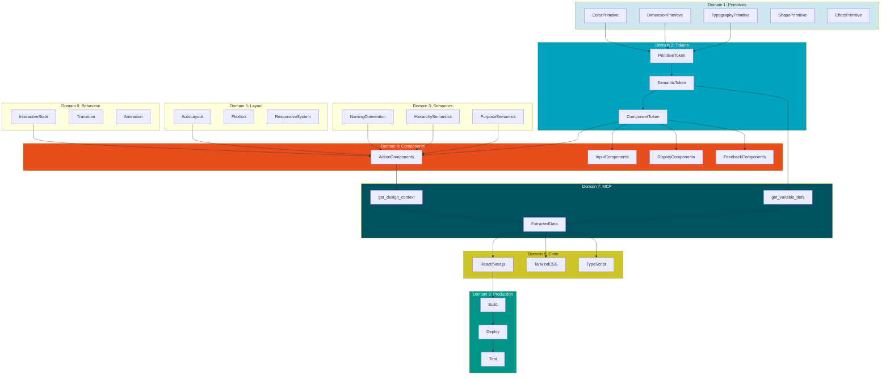

# BAIV Design-to-Code Ontology

## A Comprehensive Taxonomy of Design System Concepts & Capabilities

**Version:** 2.1.0  
**Platform:** BAIV — Be AI Visible  
**Last Updated:** December 2025  
**Purpose:** Provide complete conceptual framework for Figma Make → MCP → Claude 4.5 code generation

---

## Introduction

This ontology defines the complete vocabulary, relationships, and capabilities involved in transforming AI-generated Figma designs into production-ready code. It serves as a reference for understanding how design concepts map to code constructs, and how each layer of the pipeline contributes to the final output.

The ontology follows Schema.org conventions where applicable and establishes clear taxonomic relationships between concepts.

---

## Ontology Structure

```
┌─────────────────────────────────────────────────────────────────────┐
│                     DESIGN-TO-CODE ONTOLOGY                          │
├─────────────────────────────────────────────────────────────────────┤
│                                                                      │
│  DOMAIN 1: Design Primitives                                        │
│  └── Raw visual building blocks                                      │
│                                                                      │
│  DOMAIN 2: Design Tokens                                            │
│  └── Named, reusable design decisions                               │
│                                                                      │
│  DOMAIN 3: Design Semantics                                         │
│  └── Contextual meaning and relationships                           │
│                                                                      │
│  DOMAIN 4: Design Components                                        │
│  └── Assembled UI building blocks                                    │
│                                                                      │
│  DOMAIN 5: Design Layout                                            │
│  └── Spatial arrangement systems                                     │
│                                                                      │
│  DOMAIN 6: Design Behaviour                                         │
│  └── Interactive states and transitions                             │
│                                                                      │
│  DOMAIN 7: Extraction & Transfer                                    │
│  └── MCP tools and data transformation                              │
│                                                                      │
│  DOMAIN 8: Code Generation                                          │
│  └── Output formats and patterns                                     │
│                                                                      │
│  DOMAIN 9: Production Systems                                       │
│  └── Build tools and deployment                                      │
│                                                                      │
└─────────────────────────────────────────────────────────────────────┘
```

---

## Domain 1: Design Primitives

### Definition
Raw visual building blocks that form the foundation of all design elements. These are the atomic units from which everything else is constructed.

### Taxonomy

```
DesignPrimitive
├── ColorPrimitive
│   ├── SolidColor
│   │   ├── HexColor (#00A4BF)
│   │   ├── RGBColor (rgb(0, 164, 191))
│   │   ├── RGBAColor (rgba(0, 164, 191, 0.5))
│   │   └── HSLColor (hsl(189, 100%, 37%))
│   ├── Gradient
│   │   ├── LinearGradient
│   │   ├── RadialGradient
│   │   └── AngularGradient
│   └── ImageFill
│       ├── FillMode (fill, fit, crop, tile)
│       └── ImageSource (url, embedded)
│
├── DimensionPrimitive
│   ├── Length
│   │   ├── Pixels (px)
│   │   ├── Percentage (%)
│   │   ├── Viewport (vw, vh, vmin, vmax)
│   │   └── Relative (em, rem)
│   ├── Angle (deg, rad, turn)
│   └── Duration (ms, s)
│
├── TypographyPrimitive
│   ├── FontFamily
│   │   ├── SystemFont
│   │   ├── WebFont (Google Fonts, Adobe Fonts)
│   │   └── CustomFont (self-hosted)
│   ├── FontWeight (100-900, named)
│   ├── FontSize (absolute, relative)
│   ├── LineHeight (unitless, length, percentage)
│   ├── LetterSpacing (length)
│   └── TextDecoration (underline, strikethrough, none)
│
├── ShapePrimitive
│   ├── Rectangle
│   ├── Ellipse
│   ├── Polygon
│   ├── Star
│   ├── Line
│   └── Vector (SVG path)
│
└── EffectPrimitive
    ├── Shadow
    │   ├── DropShadow (x, y, blur, spread, color)
    │   └── InnerShadow
    ├── Blur
    │   ├── GaussianBlur
    │   └── BackgroundBlur
    └── Opacity (0-1)
```

### BAIV Primitive Examples

| Primitive | BAIV Value | Usage |
|-----------|------------|-------|
| HexColor | #00A4BF | Primary brand teal |
| HexColor | #E84E1C | Secondary orange |
| HexColor | #CEC528 | Accent gold |
| FontFamily | Titillium Web | Heading typeface |
| FontFamily | Open Sans | Body typeface |
| Length | 16px | Base spacing unit |
| Length | 8px | Border radius default |

---

## Domain 2: Design Tokens

### Definition
Named, platform-agnostic design decisions that abstract primitives into reusable values. Tokens enable consistency, theming, and systematic design changes.

### Taxonomy

```
DesignToken
├── TokenTier
│   ├── PrimitiveToken (Tier 1)
│   │   └── Raw values with semantic names
│   ├── SemanticToken (Tier 2)
│   │   └── Contextual aliases to primitives
│   └── ComponentToken (Tier 3)
│       └── Specific component usage
│
├── TokenType
│   ├── ColorToken
│   │   ├── BrandColor
│   │   ├── StatusColor
│   │   ├── NeutralColor
│   │   └── SurfaceColor
│   ├── SpacingToken
│   │   ├── InlineSpacing (horizontal)
│   │   ├── StackSpacing (vertical)
│   │   └── InsetSpacing (padding)
│   ├── SizingToken
│   │   ├── IconSize
│   │   ├── AvatarSize
│   │   └── ContainerSize
│   ├── TypographyToken
│   │   ├── FontFamilyToken
│   │   ├── FontSizeToken
│   │   ├── FontWeightToken
│   │   └── LineHeightToken
│   ├── BorderToken
│   │   ├── BorderWidthToken
│   │   ├── BorderRadiusToken
│   │   └── BorderColorToken
│   ├── ShadowToken
│   │   └── ElevationLevel (sm, md, lg, xl)
│   └── MotionToken
│       ├── DurationToken
│       └── EasingToken
│
├── TokenMode
│   ├── LightMode
│   ├── DarkMode
│   ├── HighContrastMode
│   └── CompactMode
│
└── TokenFormat
    ├── FigmaVariables
    ├── W3CDTCG (Design Tokens Community Group)
    ├── StyleDictionary
    └── TokensStudio
```

### BAIV Token Hierarchy

```
┌─────────────────────────────────────────────────────────────────────┐
│  TIER 1: PRIMITIVE TOKENS                                           │
│  Raw values with semantic paths                                      │
├─────────────────────────────────────────────────────────────────────┤
│  primitive/color/brand/primary          → #00A4BF                   │
│  primitive/color/brand/primaryDark      → #005260                   │
│  primitive/color/brand/secondary        → #E84E1C                   │
│  primitive/color/brand/accent           → #CEC528                   │
│  primitive/color/status/success         → #019587                   │
│  primitive/color/status/warning         → #CF057D                   │
│  primitive/color/status/info            → #1C3E8E                   │
│  primitive/spacing/4                    → 16px                      │
│  primitive/borderRadius/lg              → 8px                       │
│  primitive/typography/fontFamily/heading → Titillium Web            │
│  primitive/typography/fontFamily/body   → Open Sans                 │
└─────────────────────────────────────────────────────────────────────┘
                              │
                              ▼
┌─────────────────────────────────────────────────────────────────────┐
│  TIER 2: SEMANTIC TOKENS                                            │
│  Contextual meaning via aliases                                      │
├─────────────────────────────────────────────────────────────────────┤
│  semantic/color/primary/default         → {brand/primary}           │
│  semantic/color/primary/hover           → {primary/600}             │
│  semantic/color/primary/active          → {brand/primaryDark}       │
│  semantic/color/secondary/default       → {brand/secondary}         │
│  semantic/color/accent/default          → {brand/accent}            │
│  semantic/color/success/default         → {status/success}          │
│  semantic/color/background/default      → {neutral/white}           │
│  semantic/color/background/brand        → {brand/neutral}           │
│  semantic/color/foreground/default      → {neutral/900}             │
│  semantic/spacing/content               → {spacing/6}               │
│  semantic/spacing/section               → {spacing/16}              │
└─────────────────────────────────────────────────────────────────────┘
                              │
                              ▼
┌─────────────────────────────────────────────────────────────────────┐
│  TIER 3: COMPONENT TOKENS                                           │
│  Specific component binding                                          │
├─────────────────────────────────────────────────────────────────────┤
│  component/button/primary/background    → {primary/default}         │
│  component/button/primary/text          → {white}                   │
│  component/button/primary/border        → {transparent}             │
│  component/card/background              → {background/default}      │
│  component/card/border                  → {border/default}          │
│  component/card/padding                 → {spacing/content}         │
│  component/header/background            → {background/default}      │
│  component/footer/background            → {primary/active}          │
└─────────────────────────────────────────────────────────────────────┘
```

---

## Domain 3: Design Semantics

### Definition
The meaning, purpose, and relationships between design elements. Semantics provide context that enables intelligent code generation.

### Taxonomy

```
DesignSemantics
├── NamingConvention
│   ├── LayerNaming
│   │   ├── PageLevel (page/{name})
│   │   ├── SectionLevel (section/{name})
│   │   ├── ComponentLevel ({category}/{type}/{variant})
│   │   └── InternalLevel (_{part})
│   ├── TokenNaming
│   │   ├── TierPrefix (primitive/, semantic/, component/)
│   │   ├── TypeSegment (color/, spacing/, typography/)
│   │   └── VariantSuffix (/default, /hover, /active)
│   └── FileNaming
│       └── Prefix convention (figma-ds-{name})
│
├── HierarchySemantics
│   ├── DocumentHierarchy
│   │   ├── Page
│   │   ├── Frame
│   │   ├── Section
│   │   └── Component
│   ├── ComponentHierarchy
│   │   ├── Atom (button, input, badge)
│   │   ├── Molecule (card, form-field, nav-item)
│   │   ├── Organism (header, footer, sidebar)
│   │   └── Template (page layout)
│   └── TokenHierarchy
│       ├── Primitive → Semantic → Component
│       └── Global → Theme → Local
│
├── RelationshipSemantics
│   ├── ParentChild (container → content)
│   ├── Sibling (adjacent elements)
│   ├── Reference (alias, inheritance)
│   └── Dependency (requires, extends)
│
├── PurposeSemantics
│   ├── Functional
│   │   ├── Navigation
│   │   ├── Action (CTA, button)
│   │   ├── Input (form, search)
│   │   ├── Display (content, data)
│   │   └── Feedback (alert, toast, modal)
│   ├── Informational
│   │   ├── Status (success, warning, error, info)
│   │   ├── Progress (loading, step indicator)
│   │   └── Empty (placeholder, skeleton)
│   └── Decorative
│       ├── Illustration
│       ├── Background
│       └── Divider
│
└── AccessibilitySemantics
    ├── Role (button, link, heading, region)
    ├── State (expanded, selected, disabled)
    ├── Property (label, description, required)
    └── Relationship (labelledby, describedby, controls)
```

### Semantic Mapping: Figma → Code

| Figma Semantic | HTML/React Semantic |
|----------------|---------------------|
| `page/{name}` | `<main>` or page component |
| `section/{name}` | `<section>` with aria-label |
| `header` | `<header>` |
| `footer` | `<footer>` |
| `nav/primary` | `<nav aria-label="Primary">` |
| `button/primary` | `<button className="btn-primary">` |
| `heading/h1` | `<h1>` |
| `link/inline` | `<a>` within text |
| `card/{variant}` | `<article>` or `<div role="region">` |
| `alert/success` | `<div role="alert">` |
| `input/text` | `<input type="text">` |

---

## Domain 4: Design Components

### Definition
Reusable UI building blocks assembled from primitives, tokens, and semantic structures. Components encapsulate design decisions and enable consistent implementation.

### Taxonomy

```
DesignComponent
├── ComponentArchitecture
│   ├── AtomicDesign
│   │   ├── Atom
│   │   ├── Molecule
│   │   ├── Organism
│   │   ├── Template
│   │   └── Page
│   └── ComponentAPI
│       ├── Props (configurable attributes)
│       ├── Slots (content injection points)
│       ├── Events (interactive callbacks)
│       └── Refs (imperative handles)
│
├── ComponentCategory
│   ├── ActionComponents
│   │   ├── Button
│   │   │   ├── Variants: primary, secondary, accent, outline, ghost, destructive
│   │   │   ├── Sizes: sm, md, lg
│   │   │   └── States: default, hover, active, focus, disabled, loading
│   │   ├── IconButton
│   │   ├── Link
│   │   ├── Toggle
│   │   └── Menu
│   │
│   ├── InputComponents
│   │   ├── TextInput
│   │   ├── TextArea
│   │   ├── Select
│   │   ├── Checkbox
│   │   ├── Radio
│   │   ├── Switch
│   │   ├── Slider
│   │   ├── DatePicker
│   │   └── FileUpload
│   │
│   ├── DisplayComponents
│   │   ├── Card
│   │   ├── Badge
│   │   ├── Avatar
│   │   ├── Icon
│   │   ├── Image
│   │   ├── Table
│   │   ├── List
│   │   └── Tree
│   │
│   ├── FeedbackComponents
│   │   ├── Alert
│   │   ├── Toast
│   │   ├── Modal
│   │   ├── Dialog
│   │   ├── Tooltip
│   │   ├── Popover
│   │   ├── Progress
│   │   └── Skeleton
│   │
│   ├── NavigationComponents
│   │   ├── Navbar
│   │   ├── Sidebar
│   │   ├── Tabs
│   │   ├── Breadcrumb
│   │   ├── Pagination
│   │   └── Stepper
│   │
│   └── LayoutComponents
│       ├── Container
│       ├── Grid
│       ├── Stack
│       ├── Divider
│       ├── Spacer
│       └── AspectRatio
│
├── ComponentProperty
│   ├── VisualProperty
│   │   ├── Variant
│   │   ├── Size
│   │   ├── Color
│   │   └── Elevation
│   ├── ContentProperty
│   │   ├── Label
│   │   ├── Icon
│   │   ├── Image
│   │   └── Children
│   ├── StateProperty
│   │   ├── Disabled
│   │   ├── Loading
│   │   ├── Selected
│   │   └── Error
│   └── BehaviourProperty
│       ├── OnClick
│       ├── OnChange
│       ├── OnFocus
│       └── OnBlur
│
└── ComponentVariant
    ├── VariantDimension
    │   ├── Appearance (filled, outline, ghost)
    │   ├── Intent (primary, secondary, destructive)
    │   ├── Size (xs, sm, md, lg, xl)
    │   └── State (default, hover, active, disabled)
    └── VariantCombination
        └── Matrix of all valid dimension combinations
```

### BAIV Component Library

```
┌─────────────────────────────────────────────────────────────────────┐
│  BAIV COMPONENT INVENTORY                                           │
├─────────────────────────────────────────────────────────────────────┤
│                                                                      │
│  ACTIONS                          INPUTS                            │
│  ─────────                        ──────                            │
│  button/primary    #00A4BF        input/text                        │
│  button/secondary  #E84E1C        input/search                      │
│  button/accent     #CEC528        input/password                    │
│  button/outline    border         select/default                    │
│  button/ghost      transparent    checkbox                          │
│  button/destructive              switch/default                     │
│                                                                      │
│  DISPLAY                          FEEDBACK                          │
│  ───────                          ────────                          │
│  card/default                     alert/success    #019587          │
│  card/stat                        alert/warning    #CF057D          │
│  card/feature                     alert/error      #CEC528          │
│  badge/default                    alert/info       #1C3E8E          │
│  badge/success                    modal/default                     │
│  badge/warning                    toast/default                     │
│  avatar/sm,md,lg                  tooltip                           │
│                                                                      │
│  NAVIGATION                       LAYOUT                            │
│  ──────────                       ──────                            │
│  nav/primary                      container                         │
│  nav/sidebar                      grid/2-col,3-col                  │
│  nav-item/default                 stack/vertical                    │
│  nav-item/active                  stack/horizontal                  │
│  tabs                             divider                           │
│  breadcrumb                       spacer                            │
│                                                                      │
└─────────────────────────────────────────────────────────────────────┘
```

---

## Domain 5: Design Layout

### Definition
Systems for spatial arrangement, positioning, and responsive behaviour of elements within a design.

### Taxonomy

```
DesignLayout
├── LayoutSystem
│   ├── AutoLayout (Figma)
│   │   ├── Direction
│   │   │   ├── Horizontal (row)
│   │   │   └── Vertical (column)
│   │   ├── Alignment
│   │   │   ├── PrimaryAxis (start, center, end, space-between)
│   │   │   └── CounterAxis (start, center, end, baseline, stretch)
│   │   ├── Spacing
│   │   │   ├── Gap (itemSpacing)
│   │   │   └── Padding (top, right, bottom, left)
│   │   └── Sizing
│   │       ├── Fill (stretch to parent)
│   │       ├── Hug (shrink to content)
│   │       └── Fixed (explicit dimension)
│   │
│   ├── Flexbox (CSS)
│   │   ├── flex-direction
│   │   ├── justify-content
│   │   ├── align-items
│   │   ├── gap
│   │   ├── flex-wrap
│   │   └── flex (grow, shrink, basis)
│   │
│   ├── Grid (CSS)
│   │   ├── grid-template-columns
│   │   ├── grid-template-rows
│   │   ├── grid-gap
│   │   ├── grid-area
│   │   └── grid-auto-flow
│   │
│   └── Positioning
│       ├── Static (normal flow)
│       ├── Relative (offset from normal)
│       ├── Absolute (positioned to ancestor)
│       ├── Fixed (positioned to viewport)
│       └── Sticky (hybrid relative/fixed)
│
├── ResponsiveSystem
│   ├── Breakpoints
│   │   ├── Mobile (< 640px)
│   │   ├── Tablet (640px - 1024px)
│   │   ├── Desktop (1024px - 1440px)
│   │   └── Wide (> 1440px)
│   │
│   ├── ResponsiveBehaviour
│   │   ├── FluidScaling (viewport units, clamp)
│   │   ├── AdaptiveLayout (breakpoint-based)
│   │   └── ContainerQueries (parent-based)
│   │
│   └── ContentStrategy
│       ├── Reflow (columns → stacked)
│       ├── Resize (proportional scaling)
│       ├── Reveal/Hide (show/hide elements)
│       └── Rearrange (change order)
│
├── ConstraintSystem
│   ├── MinMax
│   │   ├── min-width, max-width
│   │   └── min-height, max-height
│   ├── AspectRatio
│   └── Overflow
│       ├── visible
│       ├── hidden
│       ├── scroll
│       └── auto
│
└── SpacingSystem
    ├── SpacingScale
    │   └── 0, 1, 2, 4, 6, 8, 12, 16, 20, 24, 32, 40, 48, 64, 80, 96
    ├── SpacingApplication
    │   ├── Margin (external spacing)
    │   ├── Padding (internal spacing)
    │   └── Gap (between children)
    └── SpacingDirection
        ├── Inline (horizontal)
        ├── Block (vertical)
        └── Inset (all sides)
```

### Layout Mapping: Figma → CSS

| Figma Auto Layout | CSS Flexbox/Grid |
|-------------------|------------------|
| `layoutMode: HORIZONTAL` | `display: flex; flex-direction: row` |
| `layoutMode: VERTICAL` | `display: flex; flex-direction: column` |
| `primaryAxisAlignItems: SPACE_BETWEEN` | `justify-content: space-between` |
| `counterAxisAlignItems: CENTER` | `align-items: center` |
| `itemSpacing: 16` | `gap: 16px` |
| `paddingLeft: 24` | `padding-left: 24px` |
| `layoutSizingHorizontal: FILL` | `width: 100%` or `flex: 1` |
| `layoutSizingVertical: HUG` | `height: auto` |
| `layoutSizingHorizontal: FIXED` | `width: {value}px` |

---

## Domain 6: Design Behaviour

### Definition
Interactive states, transitions, animations, and dynamic behaviour of design elements.

### Taxonomy

```
DesignBehaviour
├── InteractiveState
│   ├── BaseState
│   │   ├── Default (resting state)
│   │   ├── Hover (pointer over)
│   │   ├── Focus (keyboard/programmatic focus)
│   │   ├── Active (being activated)
│   │   ├── Pressed (mouse down)
│   │   └── Visited (link state)
│   │
│   ├── DataState
│   │   ├── Empty (no data)
│   │   ├── Loading (fetching)
│   │   ├── Success (complete)
│   │   ├── Error (failed)
│   │   └── Partial (incomplete)
│   │
│   ├── EnablementState
│   │   ├── Enabled
│   │   ├── Disabled
│   │   └── ReadOnly
│   │
│   └── SelectionState
│       ├── Selected
│       ├── Unselected
│       ├── Indeterminate
│       └── Current (active item)
│
├── Transition
│   ├── TransitionProperty
│   │   ├── Color
│   │   ├── BackgroundColor
│   │   ├── BorderColor
│   │   ├── Opacity
│   │   ├── Transform
│   │   └── BoxShadow
│   │
│   ├── TransitionTiming
│   │   ├── Duration (150ms, 200ms, 300ms)
│   │   └── Easing
│   │       ├── ease
│   │       ├── ease-in
│   │       ├── ease-out
│   │       ├── ease-in-out
│   │       └── cubic-bezier
│   │
│   └── TransitionTrigger
│       ├── Hover
│       ├── Focus
│       ├── Active
│       └── StateChange
│
├── Animation
│   ├── AnimationType
│   │   ├── Entrance (fade-in, slide-in, scale-in)
│   │   ├── Exit (fade-out, slide-out, scale-out)
│   │   ├── Emphasis (pulse, shake, bounce)
│   │   └── Continuous (spin, pulse, breathe)
│   │
│   ├── AnimationProperty
│   │   ├── Keyframes
│   │   ├── Duration
│   │   ├── Delay
│   │   ├── IterationCount
│   │   └── Direction
│   │
│   └── AnimationContext
│       ├── PageTransition
│       ├── ComponentMount
│       ├── DataUpdate
│       └── UserAction
│
└── Gesture
    ├── Click/Tap
    ├── LongPress
    ├── Swipe
    ├── Drag
    ├── Pinch
    └── Scroll
```

### BAIV State Definitions

| Component | State | Visual Change |
|-----------|-------|---------------|
| button/primary | hover | `#00A4BF` → `#008A9F` (darker) |
| button/primary | active | `#00A4BF` → `#005260` (darkest) |
| button/primary | disabled | 50% opacity |
| input/text | focus | border `#00A4BF`, ring |
| input/text | error | border `#CEC528` |
| nav-item | active | bg `#00A4BF`, text white |
| card | hover | shadow increase, subtle lift |

---

## Domain 7: Extraction & Transfer (MCP)

### Definition
The process of extracting design data from Figma and transferring it to Claude for code generation via the Model Context Protocol.

### Taxonomy

```
ExtractionTransfer
├── MCPProtocol
│   ├── Connection
│   │   ├── Authentication (Figma token)
│   │   ├── FileAccess (file key)
│   │   └── NodeSelection (node ID)
│   │
│   ├── MCPTools
│   │   ├── get_design_context
│   │   │   ├── Input: fileKey, nodeId
│   │   │   └── Output: LayerHierarchy, Styles, Layout, Assets
│   │   │
│   │   ├── get_variable_defs
│   │   │   ├── Input: fileKey, nodeId
│   │   │   └── Output: Collections, Variables, Modes, Values
│   │   │
│   │   ├── get_metadata
│   │   │   ├── Input: fileKey, nodeId
│   │   │   └── Output: FileStructure, PageList, FrameList
│   │   │
│   │   ├── get_code_connect_map
│   │   │   ├── Input: fileKey, nodeId
│   │   │   └── Output: ComponentCodeMappings
│   │   │
│   │   └── add_code_connect_map
│   │       ├── Input: fileKey, nodeId, componentName, source
│   │       └── Output: MappingConfirmation
│   │
│   └── DataFormat
│       ├── JSON (structured data)
│       ├── XML (metadata)
│       └── URL (assets)
│
├── ExtractedData
│   ├── StructuralData
│   │   ├── LayerTree (parent-child hierarchy)
│   │   ├── LayerNames (semantic names)
│   │   ├── LayerTypes (FRAME, TEXT, RECTANGLE, etc.)
│   │   └── LayerOrder (z-index, DOM order)
│   │
│   ├── VisualData
│   │   ├── Fills (colors, gradients, images)
│   │   ├── Strokes (borders)
│   │   ├── Effects (shadows, blurs)
│   │   ├── Opacity
│   │   └── BlendMode
│   │
│   ├── TypographyData
│   │   ├── FontFamily
│   │   ├── FontWeight
│   │   ├── FontSize
│   │   ├── LineHeight
│   │   ├── LetterSpacing
│   │   ├── TextAlign
│   │   └── TextContent
│   │
│   ├── LayoutData
│   │   ├── LayoutMode (AUTO, NONE)
│   │   ├── Direction (HORIZONTAL, VERTICAL)
│   │   ├── Spacing (itemSpacing)
│   │   ├── Padding (top, right, bottom, left)
│   │   ├── Alignment (primary, counter axis)
│   │   └── Sizing (FILL, HUG, FIXED)
│   │
│   ├── DimensionData
│   │   ├── Width, Height
│   │   ├── MinWidth, MaxWidth
│   │   ├── MinHeight, MaxHeight
│   │   └── Constraints
│   │
│   ├── TokenBindingData
│   │   ├── BoundVariables
│   │   │   ├── VariableID
│   │   │   ├── VariableName
│   │   │   └── ResolvedValue
│   │   └── UnboundValues (raw hex, px)
│   │
│   └── AssetData
│       ├── ImageURLs
│       ├── IconReferences
│       └── ExportSettings
│
└── TransformationRules
    ├── ColorTransform
    │   ├── HexNormalization (uppercase)
    │   ├── RGBtoHex
    │   └── TokenResolution
    │
    ├── SpacingTransform
    │   ├── SnapToScale (nearest token)
    │   └── UnitConversion (px → rem)
    │
    ├── TypographyTransform
    │   ├── FontMapping (Figma → CSS)
    │   └── SizeMapping (px → Tailwind class)
    │
    └── LayoutTransform
        ├── AutoLayoutToFlexbox
        ├── ConstraintsToCSS
        └── SizingToFlexProperties
```

### MCP Data Flow

```
┌─────────────────────────────────────────────────────────────────────┐
│                         MCP DATA FLOW                                │
├─────────────────────────────────────────────────────────────────────┤
│                                                                      │
│  FIGMA FILE                                                         │
│  ──────────                                                         │
│  ┌─────────────────────────────────────────────────────────────┐   │
│  │ page/dashboard                                               │   │
│  │ ├── header                                                   │   │
│  │ │   ├── logo (IMAGE)                                         │   │
│  │ │   └── nav/primary (FRAME, Auto Layout)                     │   │
│  │ ├── section/stats                                            │   │
│  │ │   └── card/stat (COMPONENT)                                │   │
│  │ └── footer                                                   │   │
│  └─────────────────────────────────────────────────────────────┘   │
│                              │                                       │
│                              ▼                                       │
│  MCP EXTRACTION                                                     │
│  ──────────────                                                     │
│  get_design_context() + get_variable_defs()                         │
│                              │                                       │
│                              ▼                                       │
│  STRUCTURED JSON                                                    │
│  ───────────────                                                    │
│  {                                                                   │
│    "node": {                                                        │
│      "name": "page/dashboard",                                      │
│      "layoutMode": "VERTICAL",                                      │
│      "children": [                                                  │
│        {                                                            │
│          "name": "header",                                          │
│          "fills": [{ "boundVariables": {...} }],                    │
│          ...                                                        │
│        }                                                            │
│      ]                                                              │
│    },                                                               │
│    "variables": {                                                   │
│      "semantic/color/primary/default": "#00A4BF",                   │
│      ...                                                            │
│    }                                                                │
│  }                                                                   │
│                              │                                       │
│                              ▼                                       │
│  CLAUDE PROCESSING                                                  │
│  ─────────────────                                                  │
│  • Parse hierarchy → Component tree                                 │
│  • Map tokens → CSS variables                                       │
│  • Convert layout → Flexbox/Grid                                    │
│  • Generate code → React/Next.js                                    │
│                                                                      │
└─────────────────────────────────────────────────────────────────────┘
```

---

## Domain 8: Code Generation

### Definition
The process of transforming extracted design data into production-ready code, including frameworks, patterns, and output formats.

### Taxonomy

```
CodeGeneration
├── OutputFramework
│   ├── React
│   │   ├── FunctionalComponent
│   │   ├── Hooks (useState, useEffect, etc.)
│   │   └── Context
│   │
│   ├── Next.js
│   │   ├── AppRouter
│   │   ├── PageRouter
│   │   ├── ServerComponents
│   │   └── ClientComponents
│   │
│   ├── Vue
│   │   ├── CompositionAPI
│   │   └── OptionsAPI
│   │
│   └── Svelte
│       └── SvelteComponent
│
├── StylingSystem
│   ├── TailwindCSS
│   │   ├── UtilityClasses
│   │   ├── CustomConfiguration
│   │   └── Plugins
│   │
│   ├── CSSModules
│   │   └── ScopedStyles
│   │
│   ├── CSS-in-JS
│   │   ├── StyledComponents
│   │   └── Emotion
│   │
│   └── CSSVariables
│       ├── GlobalVariables (:root)
│       └── ScopedVariables
│
├── ComponentLibrary
│   ├── shadcn/ui
│   │   ├── RadixPrimitives
│   │   └── TailwindStyling
│   │
│   ├── RadixUI
│   │   └── HeadlessComponents
│   │
│   ├── ChakraUI
│   │   └── ThemedComponents
│   │
│   └── Custom
│       └── FromTokens
│
├── TypeSystem
│   ├── TypeScript
│   │   ├── InterfaceDefinition
│   │   ├── TypeDefinition
│   │   ├── GenericTypes
│   │   └── UnionTypes
│   │
│   └── PropTypes
│       └── RuntimeValidation
│
├── CodePattern
│   ├── ComponentPattern
│   │   ├── ContainerPresenter
│   │   ├── CompoundComponent
│   │   ├── RenderProps
│   │   └── HOC
│   │
│   ├── FileStructure
│   │   ├── ComponentFile (.tsx)
│   │   ├── StyleFile (.css, .module.css)
│   │   ├── TypeFile (.types.ts)
│   │   └── IndexFile (exports)
│   │
│   └── NamingPattern
│       ├── PascalCase (components)
│       ├── camelCase (functions, variables)
│       ├── kebab-case (files, CSS classes)
│       └── SCREAMING_SNAKE (constants)
│
└── OutputArtifact
    ├── ComponentCode
    │   └── .tsx files
    │
    ├── StyleCode
    │   ├── globals.css (CSS variables)
    │   ├── tailwind.config.ts
    │   └── component styles
    │
    ├── ConfigurationCode
    │   ├── next.config.js
    │   ├── tsconfig.json
    │   └── package.json
    │
    └── AssetOutput
        ├── Optimized images
        ├── Icon sprites
        └── Font files
```

### BAIV Code Generation Map

```
┌─────────────────────────────────────────────────────────────────────┐
│  FIGMA → CODE MAPPING                                               │
├─────────────────────────────────────────────────────────────────────┤
│                                                                      │
│  FIGMA ELEMENT              REACT/NEXT.JS OUTPUT                    │
│  ─────────────              ──────────────────                      │
│                                                                      │
│  page/dashboard         →   app/dashboard/page.tsx                  │
│  section/hero           →   components/sections/HeroSection.tsx     │
│  button/primary         →   components/ui/Button.tsx (variant)      │
│  card/stat              →   components/ui/StatCard.tsx              │
│  nav/primary            →   components/layout/PrimaryNav.tsx        │
│  input/text             →   components/ui/Input.tsx                 │
│                                                                      │
│  TOKEN BINDING              CSS OUTPUT                              │
│  ─────────────              ──────────                              │
│                                                                      │
│  semantic/color/primary →   --baiv-primary: #00A4BF                 │
│  primitive/spacing/4    →   --spacing-4: 16px                       │
│  component/button/bg    →   .btn-primary { bg: var(--baiv-primary) }│
│                                                                      │
│  AUTO LAYOUT                TAILWIND CLASSES                        │
│  ───────────                ────────────────                        │
│                                                                      │
│  HORIZONTAL, gap 16     →   flex flex-row gap-4                     │
│  VERTICAL, gap 24       →   flex flex-col gap-6                     │
│  padding 24             →   p-6                                     │
│  FILL width             →   w-full                                  │
│  HUG height             →   h-auto                                  │
│  CENTER, CENTER         →   justify-center items-center             │
│                                                                      │
└─────────────────────────────────────────────────────────────────────┘
```

---

## Domain 9: Production Systems

### Definition
Build tools, deployment pipelines, and runtime systems that take generated code to production.

### Taxonomy

```
ProductionSystem
├── BuildSystem
│   ├── Bundler
│   │   ├── Webpack
│   │   ├── Vite
│   │   ├── Turbopack
│   │   └── esbuild
│   │
│   ├── Compiler
│   │   ├── TypeScript (tsc)
│   │   ├── SWC
│   │   └── Babel
│   │
│   ├── PostProcessor
│   │   ├── PostCSS
│   │   ├── Autoprefixer
│   │   └── PurgeCSS
│   │
│   └── Optimizer
│       ├── Minification
│       ├── TreeShaking
│       ├── CodeSplitting
│       └── ImageOptimization
│
├── RuntimeEnvironment
│   ├── Client (Browser)
│   │   ├── CSR (Client-Side Rendering)
│   │   └── Hydration
│   │
│   ├── Server
│   │   ├── SSR (Server-Side Rendering)
│   │   ├── SSG (Static Site Generation)
│   │   └── ISR (Incremental Static Regeneration)
│   │
│   └── Edge
│       └── EdgeFunctions
│
├── DeploymentPlatform
│   ├── Vercel
│   ├── Netlify
│   ├── AWS (Amplify, S3, CloudFront)
│   ├── Cloudflare Pages
│   └── Self-hosted
│
├── QualityAssurance
│   ├── Testing
│   │   ├── UnitTest (Jest, Vitest)
│   │   ├── IntegrationTest
│   │   ├── E2ETest (Playwright, Cypress)
│   │   └── VisualRegression (Chromatic)
│   │
│   ├── Linting
│   │   ├── ESLint
│   │   ├── Prettier
│   │   └── Stylelint
│   │
│   └── TypeChecking
│       └── tsc --noEmit
│
└── VersionControl
    ├── Git
    ├── BranchStrategy
    │   ├── GitFlow
    │   ├── TrunkBased
    │   └── FeatureBranches
    │
    └── CI/CD
        ├── GitHubActions
        ├── GitLabCI
        └── CircleCI
```

---

## Cross-Domain Relationships

### Ontology Graph



---

## Capability Matrix

### What Each Domain Enables

| Domain | Enables | Required For |
|--------|---------|--------------|
| **Primitives** | Raw values exist | Everything |
| **Tokens** | Consistency, theming | Semantic design |
| **Semantics** | Meaningful structure | Good code output |
| **Components** | Reusable UI | Efficient development |
| **Layout** | Spatial arrangement | Responsive design |
| **Behaviour** | Interactivity | User experience |
| **MCP** | Design extraction | Code generation |
| **Code** | Implementation | Production |
| **Production** | Deployment | Users |

### Pipeline Capability Flow

```
Primitives → Tokens → Semantics → Components
                ↓           ↓           ↓
            Theming    Structure    Reuse
                ↓           ↓           ↓
              Layout + Behaviour + Assets
                        ↓
                   MCP Extraction
                        ↓
                  Code Generation
                        ↓
                    Production
```

---

## BAIV Implementation Reference

### Complete Token Path Example

```
USER SEES:        Teal button
                      │
                      ▼
PRIMITIVE:        primitive/color/brand/primary = #00A4BF
                      │
                      ▼
SEMANTIC:         semantic/color/primary/default = {brand/primary}
                      │
                      ▼
COMPONENT:        component/button/primary/background = {primary/default}
                      │
                      ▼
FIGMA:            button/primary frame with fill bound to component token
                      │
                      ▼
MCP:              { "fills": [{ "boundVariables": { "color": {...} } }] }
                      │
                      ▼
CLAUDE:           Understands this is BAIV primary button
                      │
                      ▼
CODE:             <Button variant="primary" />
                  .btn-primary { background: var(--baiv-primary); }
                      │
                      ▼
BROWSER:          Teal button rendered
```

---

## Glossary

| Term | Definition |
|------|------------|
| **Auto Layout** | Figma's layout system that maps to CSS Flexbox |
| **Bound Variable** | A Figma property linked to a variable/token |
| **Code Connect** | Figma feature linking design components to code |
| **Component Token** | Tier 3 token for specific component usage |
| **DTCG** | Design Tokens Community Group (W3C format) |
| **MCP** | Model Context Protocol — AI tool interface |
| **Primitive Token** | Tier 1 token containing raw values |
| **Semantic Token** | Tier 2 token with contextual meaning |
| **shadcn/ui** | React component library built on Radix + Tailwind |
| **Token Alias** | A token that references another token |
| **Variable Collection** | Figma grouping of related variables |
| **Variable Mode** | Theme variant (Light, Dark, etc.) |

---

## Version History

| Version | Date | Changes |
|---------|------|---------|
| 2.1.0 | Dec 2025 | Initial ontology document |
