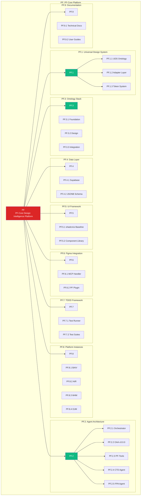
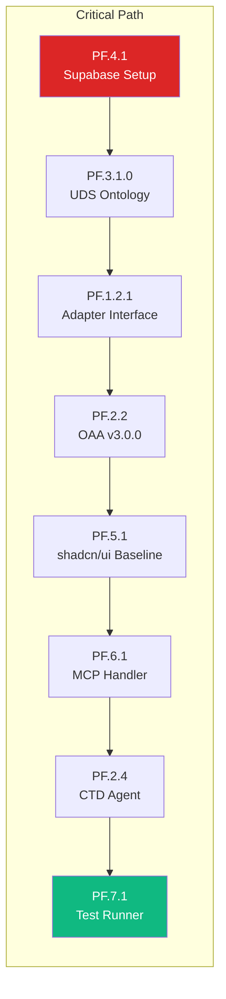

# Product Breakdown Structure (PBS)
## PF-Core Design Intelligence Platform

| | |
|---|---|
| **Document** | PBS-PF-Core-v1.0.0 |
| **Source PRD** | PRD-PF-Core-v1.6.1-APPROVED |
| **Generated By** | PBS Generator Agent |
| **Date** | November 28, 2025 |
| **Status** | Generated |

---

## 1. PBS Overview

### 1.1 Purpose

This Product Breakdown Structure decomposes the approved PF-Core PRD into hierarchical deliverables, providing a complete inventory of all products, components, and artifacts required for implementation.

### 1.2 PBS Numbering Convention

```
PF.[Category].[Component].[Sub-component].[Element]

Example: PF.2.3.1.2
         │  │ │ │ └── Element (Token Resolver Function)
         │  │ │ └──── Sub-component (Token Resolver)
         │  │ └────── Component (PF-Tools)
         │  └──────── Category (Agent Architecture)
         └────────── Product (PF-Core)
```

---

## 2. PBS Hierarchy Diagram



---

## 3. Complete PBS Structure

### PF: PF-Core Design Intelligence Platform

```
PF: PF-Core Design Intelligence Platform
│
├── PF.1: Universal Design System
│   ├── PF.1.1: UDS Ontology (#0)
│   │   ├── PF.1.1.1: Core Entity Schemas
│   │   ├── PF.1.1.2: Relationship Definitions
│   │   ├── PF.1.1.3: Validation Rules
│   │   └── PF.1.1.4: Version Management
│   │
│   ├── PF.1.2: Adapter Layer
│   │   ├── PF.1.2.1: Adapter Interface (IDesignSystemAdapter)
│   │   ├── PF.1.2.2: Figma Adapter
│   │   │   ├── PF.1.2.2.1: Import Operations
│   │   │   ├── PF.1.2.2.2: Export Operations
│   │   │   └── PF.1.2.2.3: Validation
│   │   ├── PF.1.2.3: JSON Adapter
│   │   │   ├── PF.1.2.3.1: JSON Import
│   │   │   ├── PF.1.2.3.2: YAML Import
│   │   │   └── PF.1.2.3.3: Export Formats
│   │   ├── PF.1.2.4: Code Adapter
│   │   │   ├── PF.1.2.4.1: AST Parser
│   │   │   ├── PF.1.2.4.2: Token Extractor
│   │   │   └── PF.1.2.4.3: Component Mapper
│   │   └── PF.1.2.5: Adapter Manager
│   │
│   └── PF.1.3: Token System
│       ├── PF.1.3.1: Primitive Tokens
│       ├── PF.1.3.2: Semantic Tokens
│       ├── PF.1.3.3: Component Tokens
│       └── PF.1.3.4: Token Resolution Engine
│
├── PF.2: Agent Architecture
│   ├── PF.2.1: Orchestrator Agent
│   │   ├── PF.2.1.1: Task Router
│   │   ├── PF.2.1.2: Context Manager
│   │   ├── PF.2.1.3: Error Handler
│   │   └── PF.2.1.4: Message Protocol
│   │
│   ├── PF.2.2: OAA v3.0.0 (Ontology Agent Architect)
│   │   ├── PF.2.2.1: Ontology CRUD Operations
│   │   ├── PF.2.2.2: Schema Validation
│   │   ├── PF.2.2.3: Cross-Reference Checker
│   │   ├── PF.2.2.4: Version Controller
│   │   └── PF.2.2.5: Rollback Manager
│   │
│   ├── PF.2.3: PF-Tools (Utilities)
│   │   ├── PF.2.3.1: Token Resolver
│   │   │   ├── PF.2.3.1.1: Four-Tier Cascade
│   │   │   ├── PF.2.3.1.2: Override Resolution
│   │   │   └── PF.2.3.1.3: Fallback Handling
│   │   ├── PF.2.3.2: Component Validator
│   │   │   ├── PF.2.3.2.1: Schema Validation
│   │   │   ├── PF.2.3.2.2: Token Binding Check
│   │   │   └── PF.2.3.2.3: Anatomy Validation
│   │   ├── PF.2.3.3: Module Assembler
│   │   ├── PF.2.3.4: TDDD Test Runner
│   │   ├── PF.2.3.5: Audit Logger
│   │   └── PF.2.3.6: Supabase Client
│   │
│   ├── PF.2.4: CTD Agent (Code-to-Design)
│   │   ├── PF.2.4.1: Source Parser
│   │   ├── PF.2.4.2: Token Extractor
│   │   ├── PF.2.4.3: Variant Analyzer
│   │   ├── PF.2.4.4: Figma Spec Generator
│   │   └── PF.2.4.5: Test Generator
│   │
│   └── PF.2.5: FPA Agent (Figma Plugin Agent)
│       ├── PF.2.5.1: Component Creator
│       ├── PF.2.5.2: Variable Creator
│       ├── PF.2.5.3: Style Creator
│       ├── PF.2.5.4: Component Updater
│       └── PF.2.5.5: Code Connect Linker
│
├── PF.3: Ontology Stack (13 Ontologies)
│   ├── PF.3.1: Foundation Layer
│   │   ├── PF.3.1.0: Universal Design System Ontology (#0)
│   │   └── PF.3.1.1: PF-Core Ontology (#1)
│   │
│   ├── PF.3.2: Design Layer
│   │   ├── PF.3.2.1: Design Token Ontology (#2)
│   │   └── PF.3.2.2: shadcn/ui Component Ontology (#3)
│   │
│   ├── PF.3.3: Pattern Layer
│   │   ├── PF.3.3.1: Module Pattern Ontology (#4)
│   │   └── PF.3.3.2: Workflow Ontology (#5)
│   │
│   ├── PF.3.4: Instance Layer
│   │   ├── PF.3.4.1: Platform Instance Ontology (#6)
│   │   ├── PF.3.4.2: Client Whitelabel Ontology (#7)
│   │   └── PF.3.4.3: Application Instance Ontology (#8)
│   │
│   └── PF.3.5: Integration Layer
│       ├── PF.3.5.1: Figma Integration Ontology (#9)
│       ├── PF.3.5.2: Claude Code Ontology (#10)
│       ├── PF.3.5.3: Code Connect Ontology (#11)
│       └── PF.3.5.4: Code-to-Design Ontology (#12)
│
├── PF.4: Data Layer
│   ├── PF.4.1: Supabase Configuration
│   │   ├── PF.4.1.1: Project Setup
│   │   ├── PF.4.1.2: Authentication Config
│   │   ├── PF.4.1.3: Row Level Security
│   │   └── PF.4.1.4: Edge Functions
│   │
│   └── PF.4.2: JSONB Schema
│       ├── PF.4.2.1: Ontologies Table
│       ├── PF.4.2.2: Entities Table
│       ├── PF.4.2.3: Mappings Table
│       ├── PF.4.2.4: Audit Log Table
│       └── PF.4.2.5: GIN Indexes
│
├── PF.5: UI Framework
│   ├── PF.5.1: shadcn/ui Baseline
│   │   ├── PF.5.1.1: Token Extraction
│   │   │   ├── PF.5.1.1.1: Color Tokens
│   │   │   ├── PF.5.1.1.2: Spacing Tokens
│   │   │   ├── PF.5.1.1.3: Typography Tokens
│   │   │   └── PF.5.1.1.4: Radius Tokens
│   │   ├── PF.5.1.2: Component Extraction (47 Components)
│   │   │   ├── PF.5.1.2.1: Atoms (12)
│   │   │   ├── PF.5.1.2.2: Molecules (30)
│   │   │   └── PF.5.1.2.3: Organisms (5)
│   │   └── PF.5.1.3: UDS Conversion
│   │
│   ├── PF.5.2: Component Library
│   │   ├── PF.5.2.1: Base Components
│   │   ├── PF.5.2.2: Composite Components
│   │   ├── PF.5.2.3: Pattern Components
│   │   └── PF.5.2.4: Module Components
│   │
│   └── PF.5.3: Next.js Application
│       ├── PF.5.3.1: App Router Setup
│       ├── PF.5.3.2: API Routes
│       ├── PF.5.3.3: Middleware
│       └── PF.5.3.4: Configuration
│
├── PF.6: Figma Integration
│   ├── PF.6.1: MCP Handler
│   │   ├── PF.6.1.1: get_design_context Handler
│   │   ├── PF.6.1.2: get_variable_defs Handler
│   │   ├── PF.6.1.3: get_code_connect_map Handler
│   │   ├── PF.6.1.4: create_design_system_rules Handler
│   │   └── PF.6.1.5: get_metadata Handler
│   │
│   └── PF.6.2: PF Figma Plugin
│       ├── PF.6.2.1: Plugin Manifest
│       ├── PF.6.2.2: Plugin UI
│       ├── PF.6.2.3: API Client
│       ├── PF.6.2.4: Operations Module
│       │   ├── PF.6.2.4.1: createComponent
│       │   ├── PF.6.2.4.2: createVariables
│       │   ├── PF.6.2.4.3: createStyles
│       │   ├── PF.6.2.4.4: updateComponent
│       │   └── PF.6.2.4.5: linkCodeConnect
│       └── PF.6.2.5: Authentication
│
├── PF.7: TDDD Framework
│   ├── PF.7.1: Test Runner
│   │   ├── PF.7.1.1: Design Test Runner
│   │   ├── PF.7.1.2: Code Test Runner
│   │   ├── PF.7.1.3: Integration Test Runner
│   │   └── PF.7.1.4: Visual Regression Runner
│   │
│   ├── PF.7.2: Test Suites
│   │   ├── PF.7.2.1: Design Hypothesis Tests
│   │   ├── PF.7.2.2: Design Compliance Tests
│   │   ├── PF.7.2.3: Unit Tests
│   │   ├── PF.7.2.4: Integration Tests
│   │   └── PF.7.2.5: Cross-Validation Tests
│   │
│   ├── PF.7.3: 3+3+3 Pattern Framework
│   │   ├── PF.7.3.1: Good Record Templates
│   │   ├── PF.7.3.2: Bad Record Templates
│   │   └── PF.7.3.3: Anti-Pattern Templates
│   │
│   └── PF.7.4: Reporters
│       ├── PF.7.4.1: Console Reporter
│       ├── PF.7.4.2: JSON Reporter
│       └── PF.7.4.3: CI/CD Reporter
│
├── PF.8: Platform Instances (Four-Tier)
│   ├── PF.8.0: Tier 1 - PF-Core (Immutable)
│   │
│   ├── PF.8.1: Tier 2 - BAIV Platform
│   │   ├── PF.8.1.1: BAIV Token Overrides
│   │   ├── PF.8.1.2: BAIV Component Variants
│   │   └── PF.8.1.3: BAIV Configuration
│   │
│   ├── PF.8.2: Tier 2 - AIR Platform
│   │   ├── PF.8.2.1: AIR Token Overrides
│   │   ├── PF.8.2.2: AIR Component Variants
│   │   └── PF.8.2.3: AIR Configuration
│   │
│   ├── PF.8.3: Tier 2 - W4M Platform
│   │   ├── PF.8.3.1: W4M Token Overrides
│   │   ├── PF.8.3.2: W4M Component Variants
│   │   └── PF.8.3.3: W4M Configuration
│   │
│   ├── PF.8.4: Tier 2 - DJM Platform
│   │   ├── PF.8.4.1: DJM Token Overrides
│   │   ├── PF.8.4.2: DJM Component Variants
│   │   └── PF.8.4.3: DJM Configuration
│   │
│   ├── PF.8.5: Tier 3 - Client Whitelabel Template
│   │   ├── PF.8.5.1: Brand Configuration Schema
│   │   ├── PF.8.5.2: Override Mechanisms
│   │   └── PF.8.5.3: Validation Rules
│   │
│   └── PF.8.6: Tier 4 - Application Instance Template
│       ├── PF.8.6.1: Functional Enhancement Schema
│       ├── PF.8.6.2: Brand Enhancement Schema
│       └── PF.8.6.3: Validation Rules
│
├── PF.9: Documentation
│   ├── PF.9.1: Technical Documentation
│   │   ├── PF.9.1.1: Architecture Guide
│   │   ├── PF.9.1.2: API Reference
│   │   ├── PF.9.1.3: Ontology Reference
│   │   ├── PF.9.1.4: Integration Guide
│   │   └── PF.9.1.5: Deployment Guide
│   │
│   ├── PF.9.2: User Documentation
│   │   ├── PF.9.2.1: Getting Started Guide
│   │   ├── PF.9.2.2: Designer Guide
│   │   ├── PF.9.2.3: Developer Guide
│   │   ├── PF.9.2.4: Admin Guide
│   │   └── PF.9.2.5: Troubleshooting Guide
│   │
│   └── PF.9.3: Training Materials
│       ├── PF.9.3.1: Video Tutorials
│       ├── PF.9.3.2: Interactive Workshops
│       └── PF.9.3.3: Certification Program
│
└── PF.10: DevOps & Infrastructure
    ├── PF.10.1: CI/CD Pipeline
    │   ├── PF.10.1.1: GitHub Actions Workflows
    │   ├── PF.10.1.2: Build Configuration
    │   ├── PF.10.1.3: Test Automation
    │   └── PF.10.1.4: Deployment Scripts
    │
    ├── PF.10.2: Monitoring
    │   ├── PF.10.2.1: Performance Monitoring
    │   ├── PF.10.2.2: Error Tracking
    │   ├── PF.10.2.3: Usage Analytics
    │   └── PF.10.2.4: Alerting
    │
    └── PF.10.3: Security
        ├── PF.10.3.1: Authentication
        ├── PF.10.3.2: Authorization (RBAC)
        ├── PF.10.3.3: API Security
        └── PF.10.3.4: Data Encryption
```

---

## 4. PBS Summary Statistics

| Category | Count |
|----------|-------|
| **Level 1 (Categories)** | 10 |
| **Level 2 (Components)** | 42 |
| **Level 3 (Sub-components)** | 98 |
| **Level 4 (Elements)** | 67 |
| **Total Deliverables** | **217** |

### By Category

| PBS Code | Category | Components | Deliverables |
|----------|----------|------------|--------------|
| PF.1 | Universal Design System | 3 | 18 |
| PF.2 | Agent Architecture | 5 | 32 |
| PF.3 | Ontology Stack | 5 | 17 |
| PF.4 | Data Layer | 2 | 10 |
| PF.5 | UI Framework | 3 | 19 |
| PF.6 | Figma Integration | 2 | 13 |
| PF.7 | TDDD Framework | 4 | 16 |
| PF.8 | Platform Instances | 7 | 22 |
| PF.9 | Documentation | 3 | 14 |
| PF.10 | DevOps & Infrastructure | 3 | 12 |
| **Total** | | **42** | **217** |

---

## 5. Critical Path Deliverables

The following deliverables are on the critical path:



---

## 6. Traceability Matrix

| PBS Code | PRD Section | Requirement IDs |
|----------|-------------|-----------------|
| PF.1 | Section 4 | FR-UDS01 - FR-UDS10 |
| PF.2 | Section 16 | FR-AGT01 - FR-AGT10 |
| PF.3 | Section 9 | FR-O01 - FR-O06 |
| PF.4 | Section 3 | FR-TECH01 - FR-TECH10 |
| PF.5 | Section 3.3 | FR-SHAD01 - FR-SHAD06 |
| PF.6 | Section 6 | FR-PFP01 - FR-PFP10 |
| PF.7 | Section 11 | FR-TDDD01 - FR-TDDD10 |
| PF.8 | Section 5 | FR-T01 - FR-T05 |

---

*End of PBS Document*
*Generated by PBS Generator Agent*
*Next: WBS Generation*
