# Product Breakdown Structure & Work Breakdown Structure
## PF-Core Design System Intelligence

**Agent-Ready Implementation Specification**

| | |
|---|---|
| **Version** | 1.0.0 |
| **Date** | November 28, 2025 |
| **Source PRD** | PRD-PF-Core-Design-System-v1.1.0 |
| **Target Agent** | Claude Agent SDK |
| **Ontology Manager** | OAA v3.0 |

---

## Document Purpose

This document translates the PRD into actionable structures for agent-driven implementation:

1. **Product Breakdown Structure (PBS)** - What we're building (components, deliverables)
2. **Product Specifications** - How each component works (detailed specs)
3. **Work Breakdown Structure (WBS)** - How we build it (tasks, sequences, dependencies)

---

## Table of Contents

### Part A: Product Breakdown Structure
1. [PBS Overview](#1-pbs-overview)
2. [PBS Level 1: Major Systems](#2-pbs-level-1-major-systems)
3. [PBS Level 2: Subsystems](#3-pbs-level-2-subsystems)
4. [PBS Level 3: Components](#4-pbs-level-3-components)
5. [Component Specifications](#5-component-specifications)

### Part B: Work Breakdown Structure
6. [WBS Overview](#6-wbs-overview)
7. [WBS Phase Details](#7-wbs-phase-details)
8. [Task Dependencies](#8-task-dependencies)
9. [Agent Task Specifications](#9-agent-task-specifications)
10. [Implementation Sequence](#10-implementation-sequence)

### Part C: Appendices
11. [File Structure](#11-file-structure)
12. [Technology Stack](#12-technology-stack)
13. [Agent Instructions Template](#13-agent-instructions-template)

---

# Part A: Product Breakdown Structure

## 1. PBS Overview

The Product Breakdown Structure decomposes PF-Core into hierarchical components that can be independently developed, tested, and integrated.

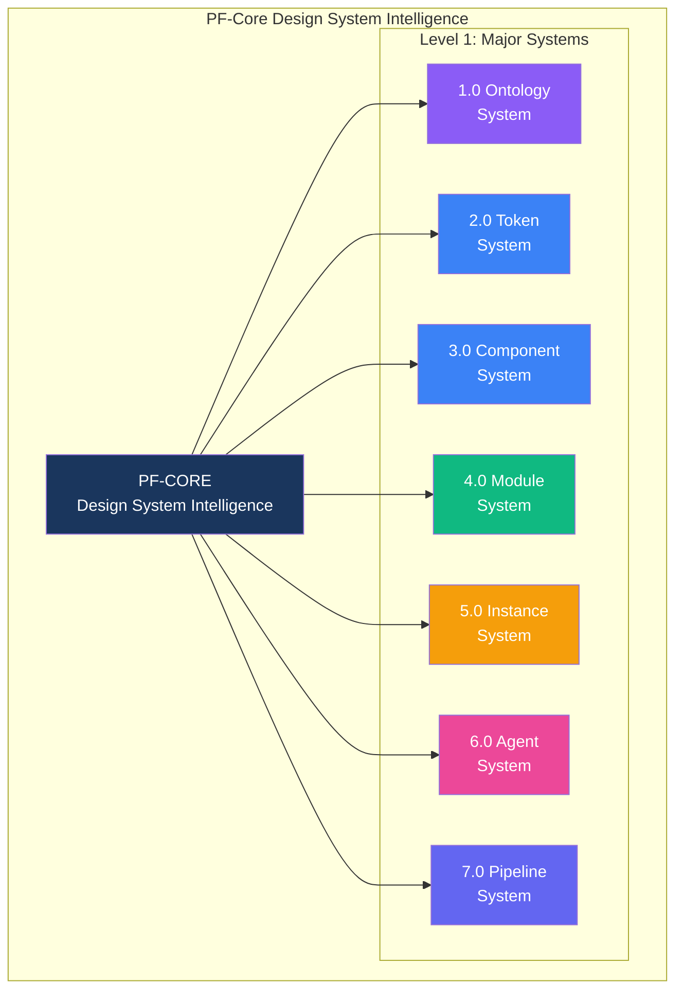

### PBS Numbering Convention

```
X.0       = Major System (Level 1)
X.Y       = Subsystem (Level 2)
X.Y.Z     = Component (Level 3)
X.Y.Z.N   = Sub-component (Level 4)
```

---

## 2. PBS Level 1: Major Systems

| ID | System | Description | Primary Deliverable |
|----|--------|-------------|---------------------|
| **1.0** | Ontology System | OAA-managed ontology infrastructure | 10 registered ontologies |
| **2.0** | Token System | Design token definitions and resolution | Token resolution engine |
| **3.0** | Component System | shadcn/ui component definitions | Component ontology + validators |
| **4.0** | Module System | Reusable UI/UX pattern library | Module library + registry |
| **5.0** | Instance System | Four-tier instance configurations | Platform/Client/App configs |
| **6.0** | Agent System | Claude Code SDK integration | Design enforcement agent |
| **7.0** | Pipeline System | Figma Make compliance processing | Compliance pipeline |

---

## 3. PBS Level 2: Subsystems

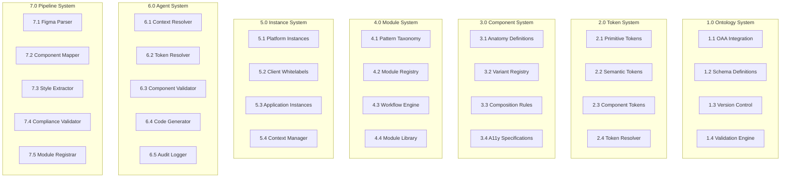

### Subsystem Summary Table

| System | ID | Subsystem | Purpose |
|--------|-----|-----------|---------|
| Ontology | 1.1 | OAA Integration | Connect to OAA v3.0 APIs |
| Ontology | 1.2 | Schema Definitions | Define all 10 ontology schemas |
| Ontology | 1.3 | Version Control | Semantic versioning for ontologies |
| Ontology | 1.4 | Validation Engine | Cross-ontology reference validation |
| Token | 2.1 | Primitive Tokens | Locked base values |
| Token | 2.2 | Semantic Tokens | Purpose-driven references |
| Token | 2.3 | Component Tokens | Component-scoped tokens |
| Token | 2.4 | Token Resolver | Four-tier cascade resolution |
| Component | 3.1 | Anatomy Definitions | Component structure schemas |
| Component | 3.2 | Variant Registry | All component variants |
| Component | 3.3 | Composition Rules | Parent-child relationships |
| Component | 3.4 | A11y Specifications | Accessibility requirements |
| Module | 4.1 | Pattern Taxonomy | Module category hierarchy |
| Module | 4.2 | Module Registry | Pattern registration system |
| Module | 4.3 | Workflow Engine | Multi-step flow processor |
| Module | 4.4 | Module Library | Compliant module storage |
| Instance | 5.1 | Platform Instances | BAIV, AIR, W4M, DJM configs |
| Instance | 5.2 | Client Whitelabels | Client brand configurations |
| Instance | 5.3 | Application Instances | App enhancement configs |
| Instance | 5.4 | Context Manager | Active context detection |
| Agent | 6.1 | Context Resolver | Determine active tier/variant |
| Agent | 6.2 | Token Resolver | Execute token cascade |
| Agent | 6.3 | Component Validator | Validate against ontology |
| Agent | 6.4 | Code Generator | Generate compliant React |
| Agent | 6.5 | Audit Logger | Log all generations/overrides |
| Pipeline | 7.1 | Figma Parser | Parse Figma Make output |
| Pipeline | 7.2 | Component Mapper | Map to shadcn/ui |
| Pipeline | 7.3 | Style Extractor | Extract styling values |
| Pipeline | 7.4 | Compliance Validator | Validate against tokens |
| Pipeline | 7.5 | Module Registrar | Register compliant modules |

---

## 4. PBS Level 3: Components

### 4.1 Ontology System Components

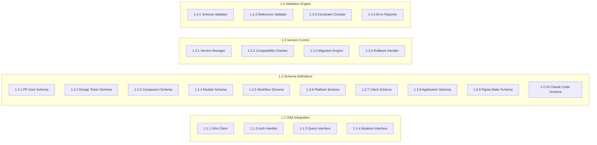

### 4.2 Token System Components

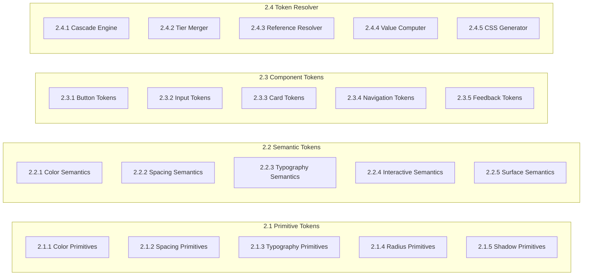

### 4.3 Component System Components

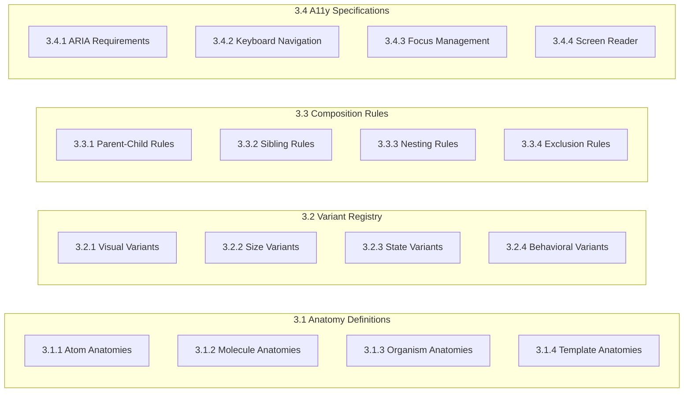

### 4.4 Module System Components

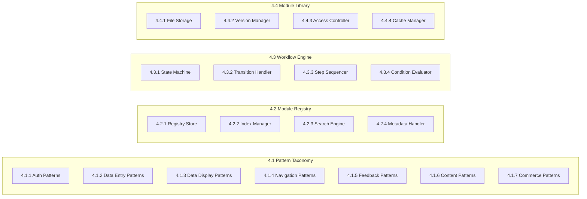

### 4.5 Instance System Components

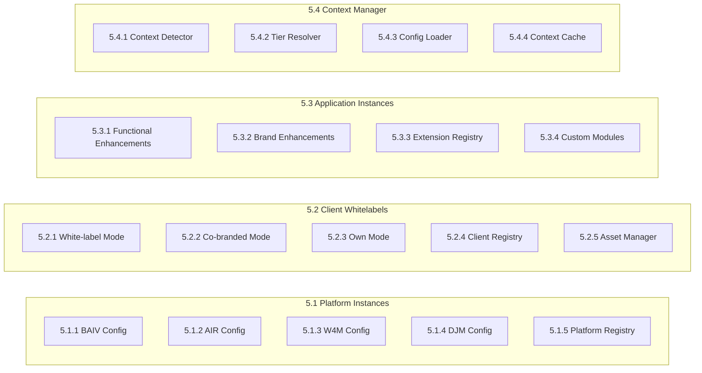

### 4.6 Agent System Components

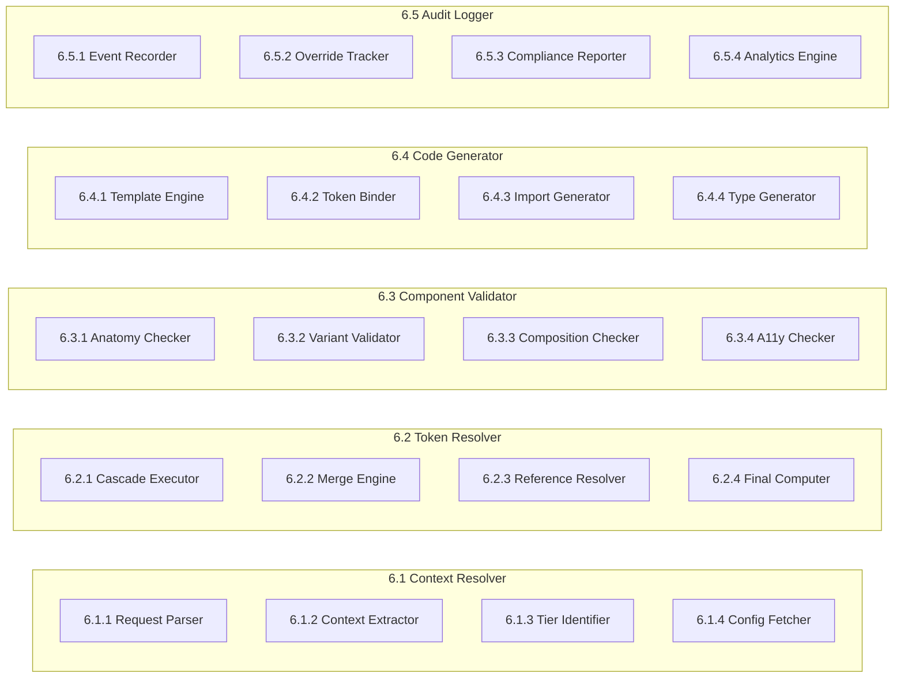

### 4.7 Pipeline System Components

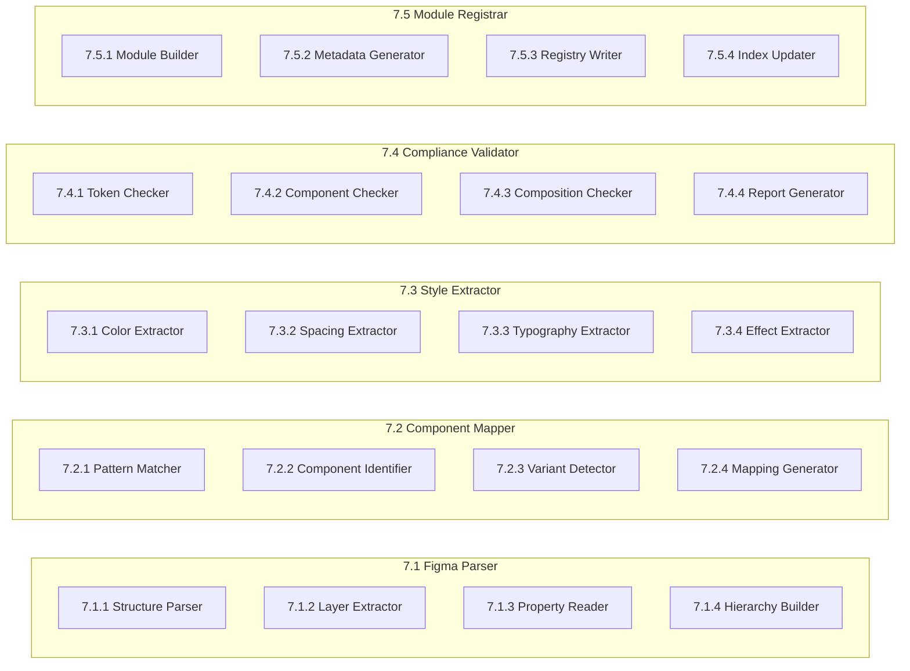

---

## 5. Component Specifications

### 5.1 Ontology System Specifications

#### 5.1.1 OAA Client (1.1.1)

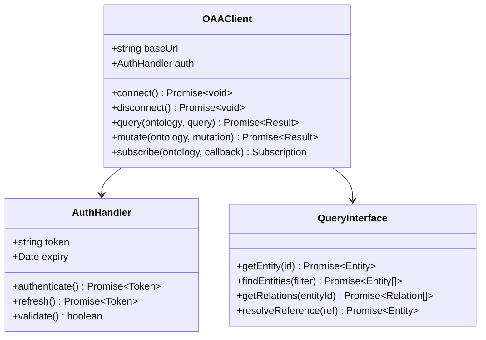

**Specification:**

| Property | Type | Description |
|----------|------|-------------|
| `baseUrl` | `string` | OAA v3.0 API endpoint |
| `auth` | `AuthHandler` | Authentication manager |
| `timeout` | `number` | Request timeout (ms) |
| `retries` | `number` | Retry attempts on failure |

**Methods:**

| Method | Input | Output | Description |
|--------|-------|--------|-------------|
| `connect()` | - | `Promise<void>` | Establish connection to OAA |
| `query()` | `ontology: string, query: Query` | `Promise<Result>` | Execute read query |
| `mutate()` | `ontology: string, mutation: Mutation` | `Promise<Result>` | Execute write mutation |
| `subscribe()` | `ontology: string, callback: Function` | `Subscription` | Subscribe to changes |

---

#### 5.1.2 Schema Definitions (1.2.x)

**PF-Core Schema (1.2.1):**

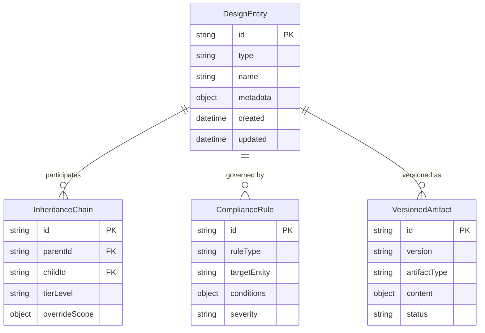

---

### 5.2 Token System Specifications

#### 5.2.1 Token Resolver (2.4)

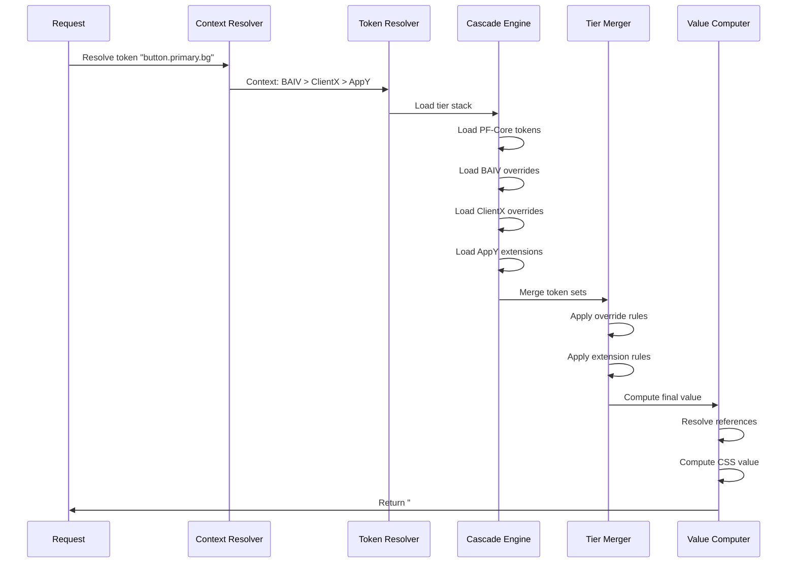

**Cascade Engine Specification:**

```typescript
interface CascadeEngine {
  // Load all applicable tokens for context
  loadTierStack(context: Context): Promise<TierStack>;
  
  // Get token value at specific tier
  getTokenAtTier(token: string, tier: Tier): TokenValue | null;
  
  // Check if token is overridable at tier
  isOverridable(token: string, tier: Tier): boolean;
  
  // Get override chain for token
  getOverrideChain(token: string): OverrideChain;
}

interface TierStack {
  pfCore: TokenSet;        // Tier 1: Locked
  platform: TokenSet;      // Tier 2: Semantic overrides
  client: TokenSet;        // Tier 3: Brand overrides
  application: TokenSet;   // Tier 4: Extensions
}
```

**Resolution Rules:**

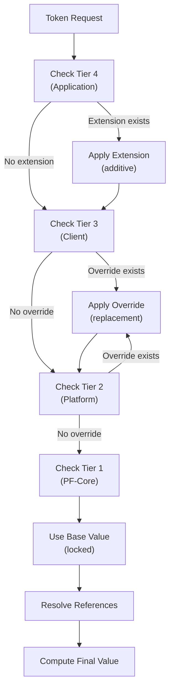

---

### 5.3 Component System Specifications

#### 5.3.1 Component Anatomy Definition

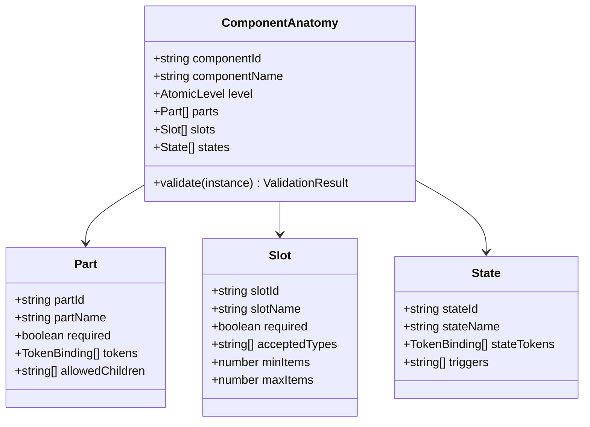

**Example: Button Anatomy**

```json
{
  "componentId": "shadcn:button",
  "componentName": "Button",
  "level": "atom",
  "parts": [
    {
      "partId": "root",
      "partName": "Button Root",
      "required": true,
      "tokens": [
        { "property": "background", "token": "button.{variant}.background" },
        { "property": "color", "token": "button.{variant}.foreground" },
        { "property": "borderRadius", "token": "radius.md" },
        { "property": "padding", "token": "spacing.button.{size}" }
      ]
    }
  ],
  "slots": [
    {
      "slotId": "icon-left",
      "slotName": "Left Icon",
      "required": false,
      "acceptedTypes": ["Icon"],
      "maxItems": 1
    },
    {
      "slotId": "content",
      "slotName": "Content",
      "required": true,
      "acceptedTypes": ["Text", "Icon"],
      "minItems": 1
    }
  ],
  "states": [
    {
      "stateId": "hover",
      "stateName": "Hover",
      "stateTokens": [
        { "property": "background", "token": "button.{variant}.background.hover" }
      ],
      "triggers": ["mouseenter"]
    },
    {
      "stateId": "disabled",
      "stateName": "Disabled",
      "stateTokens": [
        { "property": "opacity", "token": "opacity.disabled" }
      ],
      "triggers": ["disabled=true"]
    }
  ],
  "variants": {
    "variant": ["default", "destructive", "outline", "secondary", "ghost", "link"],
    "size": ["default", "sm", "lg", "icon"]
  }
}
```

---

### 5.4 Module System Specifications

#### 5.4.1 Module Definition Schema

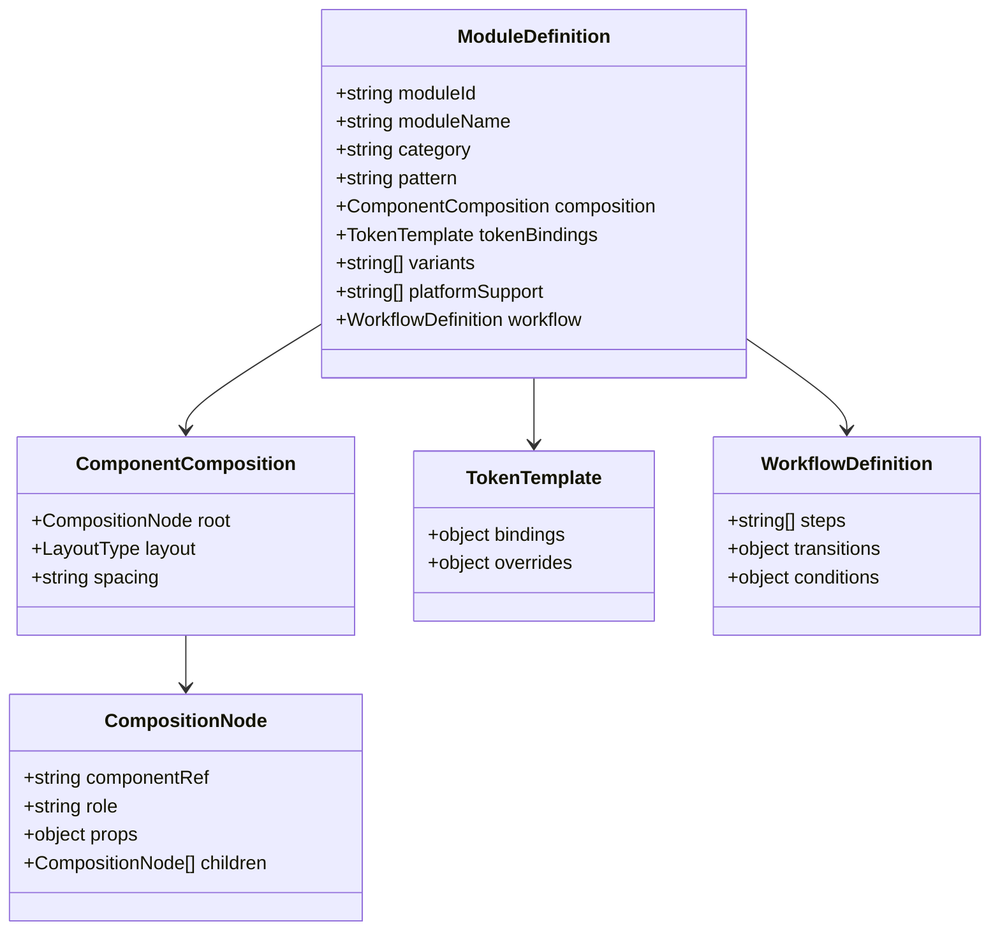

**Example: Login Module**

```json
{
  "moduleId": "auth:login-default",
  "moduleName": "Default Login Form",
  "category": "auth",
  "pattern": "login",
  "composition": {
    "root": {
      "componentRef": "shadcn:card",
      "role": "container",
      "props": { "className": "w-full max-w-md" },
      "children": [
        {
          "componentRef": "shadcn:card-header",
          "role": "header",
          "children": [
            { "componentRef": "shadcn:card-title", "role": "title", "props": { "children": "Sign In" } }
          ]
        },
        {
          "componentRef": "shadcn:card-content",
          "role": "content",
          "children": [
            {
              "componentRef": "shadcn:input",
              "role": "email-field",
              "props": { "type": "email", "placeholder": "Email" }
            },
            {
              "componentRef": "shadcn:input",
              "role": "password-field",
              "props": { "type": "password", "placeholder": "Password" }
            }
          ]
        },
        {
          "componentRef": "shadcn:card-footer",
          "role": "footer",
          "children": [
            {
              "componentRef": "shadcn:button",
              "role": "submit",
              "props": { "variant": "default", "children": "Sign In" }
            }
          ]
        }
      ]
    },
    "layout": "vertical-stack",
    "spacing": "spacing.lg"
  },
  "tokenBindings": {
    "container.background": "semantic.surface.card",
    "container.border": "semantic.border.default",
    "cta.background": "semantic.interactive.primary"
  },
  "variants": ["default", "social-oauth", "magic-link"],
  "platformSupport": ["BAIV", "AIR", "W4M", "DJM"]
}
```

---

### 5.5 Agent System Specifications

#### 5.5.1 Agent Architecture

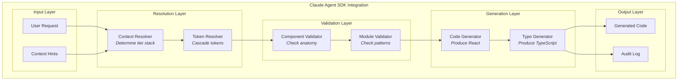

#### 5.5.2 Agent System Prompt Structure

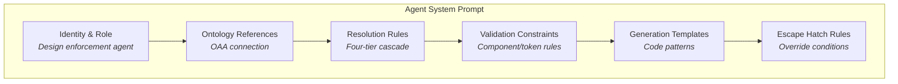

**Agent Constraints:**

| Constraint | Rule | Enforcement |
|------------|------|-------------|
| No hardcoded colors | All colors must reference tokens | Pre-generation check |
| No hardcoded spacing | All spacing must reference tokens | Pre-generation check |
| Valid components only | All components must exist in ontology | Validation layer |
| Valid composition | Parent-child relationships must be valid | Composition checker |
| A11y compliance | All components must meet a11y specs | A11y checker |
| Token resolution | All tokens must resolve through cascade | Token resolver |

---

### 5.6 Pipeline System Specifications

#### 5.6.1 Compliance Pipeline Flow

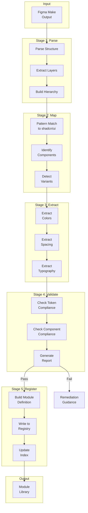

#### 5.6.2 Compliance Validation Rules

```typescript
interface ComplianceRules {
  // Token compliance
  tokenRules: {
    noHardcodedColors: boolean;      // All colors → tokens
    noHardcodedSpacing: boolean;     // All spacing → tokens
    noHardcodedTypography: boolean;  // All typography → tokens
    validTokenReferences: boolean;   // All refs exist in ontology
  };
  
  // Component compliance
  componentRules: {
    allComponentsMapped: boolean;    // All map to shadcn/ui
    validComposition: boolean;       // Parent-child valid
    accessibilityMet: boolean;       // A11y requirements met
  };
  
  // Module compliance
  moduleRules: {
    validCategory: boolean;          // Category exists in taxonomy
    validPattern: boolean;           // Pattern exists in category
    platformSupport: boolean;        // At least one platform
  };
}
```

---

# Part B: Work Breakdown Structure

## 6. WBS Overview

The Work Breakdown Structure organizes all implementation tasks into phases, with clear dependencies and agent-executable instructions.

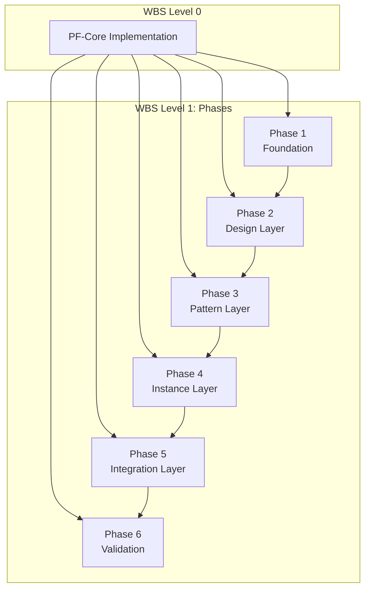

### WBS Numbering Convention

```
WBS X.Y.Z.N

X = Phase (1-6)
Y = Work Package
Z = Task
N = Subtask
```

---

## 7. WBS Phase Details

### Phase 1: Foundation (WBS 1.x)

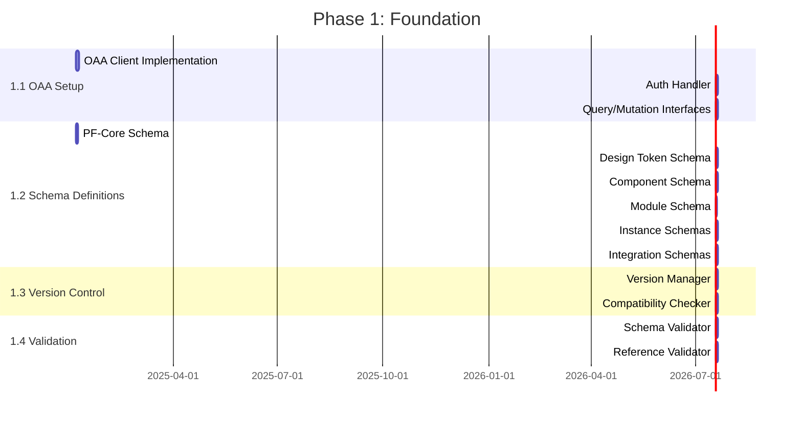

#### WBS 1.1: OAA Integration

| WBS ID | Task | Description | Duration | Dependencies |
|--------|------|-------------|----------|--------------|
| 1.1.1 | OAA Client | Implement OAA v3.0 API client | 3 days | - |
| 1.1.2 | Auth Handler | Implement authentication | 2 days | 1.1.1 |
| 1.1.3 | Query Interface | Implement query/mutation APIs | 2 days | 1.1.2 |
| 1.1.4 | Connection Tests | Test OAA connectivity | 1 day | 1.1.3 |

#### WBS 1.2: Schema Definitions

| WBS ID | Task | Description | Duration | Dependencies |
|--------|------|-------------|----------|--------------|
| 1.2.1 | PF-Core Schema | Define foundation ontology schema | 2 days | - |
| 1.2.2 | Design Token Schema | Define token ontology schema | 2 days | 1.2.1 |
| 1.2.3 | Component Schema | Define component ontology schema | 2 days | 1.2.1 |
| 1.2.4 | Module Schema | Define module ontology schema | 1 day | 1.2.2 |
| 1.2.5 | Instance Schemas | Define platform/client/app schemas | 2 days | 1.2.3 |
| 1.2.6 | Integration Schemas | Define Figma/Claude schemas | 2 days | 1.2.4 |

---

### Phase 2: Design Layer (WBS 2.x)

```mermaid
gantt
    title Phase 2: Design Layer
    dateFormat  YYYY-MM-DD
    
    section 2.1 Primitive Tokens
    Color Primitives                :2.1.1, 2025-01-20, 2d
    Spacing Primitives              :2.1.2, after 2.1.1, 1d
    Typography Primitives           :2.1.3, after 2.1.1, 2d
    Other Primitives                :2.1.4, after 2.1.2, 1d
    
    section 2.2 Semantic Tokens
    Color Semantics                 :2.2.1, after 2.1.4, 2d
    Spacing Semantics               :2.2.2, after 2.2.1, 1d
    Typography Semantics            :2.2.3, after 2.2.1, 2d
    Interactive Semantics           :2.2.4, after 2.2.2, 2d
    
    section 2.3 Component Tokens
    Button Tokens                   :2.3.1, after 2.2.4, 1d
    Input Tokens                    :2.3.2, after 2.3.1, 1d
    Card Tokens                     :2.3.3, after 2.3.1, 1d
    All Component Tokens            :2.3.4, after 2.3.2, 3d
    
    section 2.4 Token Resolver
    Cascade Engine                  :2.4.1, after 2.3.4, 3d
    Tier Merger                     :2.4.2, after 2.4.1, 2d
    Reference Resolver              :2.4.3, after 2.4.2, 2d
    CSS Generator                   :2.4.4, after 2.4.3, 2d
```

#### WBS 2.1: Primitive Tokens

| WBS ID | Task | Description | Duration | Dependencies |
|--------|------|-------------|----------|--------------|
| 2.1.1 | Color Primitives | Define all color primitives | 2 days | 1.2.2 |
| 2.1.2 | Spacing Primitives | Define spacing scale | 1 day | 2.1.1 |
| 2.1.3 | Typography Primitives | Define type primitives | 2 days | 2.1.1 |
| 2.1.4 | Other Primitives | Define radius, shadow, etc. | 1 day | 2.1.2 |

#### WBS 2.4: Token Resolver

| WBS ID | Task | Description | Duration | Dependencies |
|--------|------|-------------|----------|--------------|
| 2.4.1 | Cascade Engine | Implement tier loading | 3 days | 2.3.4 |
| 2.4.2 | Tier Merger | Implement merge logic | 2 days | 2.4.1 |
| 2.4.3 | Reference Resolver | Implement ref resolution | 2 days | 2.4.2 |
| 2.4.4 | CSS Generator | Generate CSS custom props | 2 days | 2.4.3 |

---

### Phase 3: Pattern Layer (WBS 3.x)

```mermaid
gantt
    title Phase 3: Pattern Layer
    dateFormat  YYYY-MM-DD
    
    section 3.1 Component Ontology
    Atom Anatomies                  :3.1.1, 2025-02-10, 3d
    Molecule Anatomies              :3.1.2, after 3.1.1, 3d
    Organism Anatomies              :3.1.3, after 3.1.2, 3d
    Composition Rules               :3.1.4, after 3.1.1, 2d
    A11y Specifications             :3.1.5, after 3.1.3, 2d
    
    section 3.2 Module Patterns
    Pattern Taxonomy                :3.2.1, after 3.1.4, 2d
    Auth Patterns                   :3.2.2, after 3.2.1, 2d
    Data Entry Patterns             :3.2.3, after 3.2.1, 2d
    Data Display Patterns           :3.2.4, after 3.2.2, 2d
    Navigation Patterns             :3.2.5, after 3.2.3, 2d
    All Patterns                    :3.2.6, after 3.2.4, 3d
    
    section 3.3 Module Registry
    Registry Store                  :3.3.1, after 3.2.6, 2d
    Index Manager                   :3.3.2, after 3.3.1, 2d
    Search Engine                   :3.3.3, after 3.3.2, 2d
    
    section 3.4 Workflow Engine
    State Machine                   :3.4.1, after 3.3.3, 3d
    Transition Handler              :3.4.2, after 3.4.1, 2d
```

---

### Phase 4: Instance Layer (WBS 4.x)

```mermaid
gantt
    title Phase 4: Instance Layer
    dateFormat  YYYY-MM-DD
    
    section 4.1 Platform Instances
    BAIV Configuration              :4.1.1, 2025-03-03, 2d
    AIR Configuration               :4.1.2, after 4.1.1, 2d
    W4M Configuration               :4.1.3, after 4.1.2, 2d
    DJM Configuration               :4.1.4, after 4.1.3, 2d
    Platform Registry               :4.1.5, after 4.1.4, 1d
    
    section 4.2 Client Whitelabels
    White-label Mode                :4.2.1, after 4.1.5, 2d
    Co-branded Mode                 :4.2.2, after 4.2.1, 2d
    Own Mode                        :4.2.3, after 4.2.2, 1d
    Client Registry                 :4.2.4, after 4.2.3, 2d
    
    section 4.3 Application Instances
    Functional Enhancements         :4.3.1, after 4.2.4, 3d
    Brand Enhancements              :4.3.2, after 4.3.1, 2d
    Extension Registry              :4.3.3, after 4.3.2, 2d
    Custom Modules                  :4.3.4, after 4.3.3, 2d
    
    section 4.4 Context Manager
    Context Detector                :4.4.1, after 4.3.4, 2d
    Tier Resolver                   :4.4.2, after 4.4.1, 2d
    Config Loader                   :4.4.3, after 4.4.2, 2d
```

---

### Phase 5: Integration Layer (WBS 5.x)

```mermaid
gantt
    title Phase 5: Integration Layer
    dateFormat  YYYY-MM-DD
    
    section 5.1 Figma Pipeline
    Figma Parser                    :5.1.1, 2025-03-24, 3d
    Component Mapper                :5.1.2, after 5.1.1, 3d
    Style Extractor                 :5.1.3, after 5.1.2, 2d
    Compliance Validator            :5.1.4, after 5.1.3, 3d
    Module Registrar                :5.1.5, after 5.1.4, 2d
    
    section 5.2 Agent System
    Context Resolver                :5.2.1, 2025-03-24, 3d
    Token Resolver Integration      :5.2.2, after 5.2.1, 2d
    Component Validator             :5.2.3, after 5.2.2, 3d
    Code Generator                  :5.2.4, after 5.2.3, 4d
    Audit Logger                    :5.2.5, after 5.2.4, 2d
    
    section 5.3 Agent Prompt
    System Prompt Design            :5.3.1, after 5.2.5, 2d
    Constraint Embedding            :5.3.2, after 5.3.1, 2d
    Template Integration            :5.3.3, after 5.3.2, 2d
```

---

### Phase 6: Validation (WBS 6.x)

```mermaid
gantt
    title Phase 6: Validation
    dateFormat  YYYY-MM-DD
    
    section 6.1 Unit Testing
    Ontology Tests                  :6.1.1, 2025-04-14, 3d
    Token Tests                     :6.1.2, after 6.1.1, 2d
    Component Tests                 :6.1.3, after 6.1.2, 2d
    Module Tests                    :6.1.4, after 6.1.3, 2d
    
    section 6.2 Integration Testing
    Four-Tier Cascade Tests         :6.2.1, after 6.1.4, 3d
    Pipeline Integration Tests      :6.2.2, after 6.2.1, 2d
    Agent Integration Tests         :6.2.3, after 6.2.2, 3d
    
    section 6.3 Validation Testing
    Visual Regression Tests         :6.3.1, after 6.2.3, 3d
    Compliance Tests                :6.3.2, after 6.3.1, 2d
    Performance Tests               :6.3.3, after 6.3.2, 2d
    
    section 6.4 Documentation
    API Documentation               :6.4.1, after 6.3.3, 2d
    User Guide                      :6.4.2, after 6.4.1, 2d
    Agent Instructions              :6.4.3, after 6.4.2, 2d
```

---

## 8. Task Dependencies

### 8.1 Critical Path

```mermaid
flowchart LR
    subgraph "Critical Path"
        CP1["1.1.1<br/>OAA Client"]
        CP2["1.2.1<br/>PF-Core Schema"]
        CP3["2.1.1<br/>Color Primitives"]
        CP4["2.4.1<br/>Cascade Engine"]
        CP5["3.1.1<br/>Atom Anatomies"]
        CP6["4.1.1<br/>BAIV Config"]
        CP7["5.2.4<br/>Code Generator"]
        CP8["6.2.3<br/>Agent Tests"]
    end
    
    CP1 --> CP2 --> CP3 --> CP4 --> CP5 --> CP6 --> CP7 --> CP8
    
    style CP1 fill:#dc2626,color:#fff
    style CP2 fill:#dc2626,color:#fff
    style CP3 fill:#dc2626,color:#fff
    style CP4 fill:#dc2626,color:#fff
    style CP5 fill:#dc2626,color:#fff
    style CP6 fill:#dc2626,color:#fff
    style CP7 fill:#dc2626,color:#fff
    style CP8 fill:#dc2626,color:#fff
```

### 8.2 Dependency Matrix

```mermaid
graph TD
    subgraph "Phase Dependencies"
        P1["Phase 1<br/>Foundation"]
        P2["Phase 2<br/>Design"]
        P3["Phase 3<br/>Pattern"]
        P4["Phase 4<br/>Instance"]
        P5["Phase 5<br/>Integration"]
        P6["Phase 6<br/>Validation"]
    end
    
    P1 -->|"Schemas ready"| P2
    P1 -->|"Schemas ready"| P3
    P2 -->|"Tokens ready"| P3
    P2 -->|"Tokens ready"| P4
    P3 -->|"Components ready"| P4
    P3 -->|"Modules ready"| P5
    P4 -->|"Instances ready"| P5
    P5 -->|"System ready"| P6
```

### 8.3 Parallel Work Streams

```mermaid
flowchart TB
    subgraph "Parallel Streams"
        subgraph "Stream A: Ontology"
            SA1["OAA Setup"]
            SA2["Schema Definitions"]
            SA3["Validation Engine"]
        end
        
        subgraph "Stream B: Tokens"
            SB1["Primitive Tokens"]
            SB2["Semantic Tokens"]
            SB3["Token Resolver"]
        end
        
        subgraph "Stream C: Components"
            SC1["Anatomies"]
            SC2["Variants"]
            SC3["Composition Rules"]
        end
        
        subgraph "Stream D: Modules"
            SD1["Pattern Taxonomy"]
            SD2["Module Registry"]
            SD3["Workflow Engine"]
        end
    end
    
    SA1 --> SA2 --> SA3
    SA2 --> SB1
    SB1 --> SB2 --> SB3
    SA2 --> SC1
    SC1 --> SC2 --> SC3
    SB2 --> SD1
    SC2 --> SD1
    SD1 --> SD2 --> SD3
```

---

## 9. Agent Task Specifications

### 9.1 Task Specification Format

Each task is specified in a format suitable for agent execution:

```yaml
task_id: "WBS-X.Y.Z"
task_name: "Task Name"
description: "Detailed description of what to build"

inputs:
  - input_type: "Artifact from previous task"
  - dependencies: ["WBS-X.Y.A", "WBS-X.Y.B"]

outputs:
  - output_type: "Deliverable artifact"
  - location: "File path or registry location"

specifications:
  - spec_item: "Detailed specification"

acceptance_criteria:
  - criterion: "How to verify completion"

agent_instructions: |
  Step-by-step instructions for agent execution
```

### 9.2 Sample Task Specifications

#### Task: WBS 1.1.1 - OAA Client Implementation

```yaml
task_id: "WBS-1.1.1"
task_name: "OAA Client Implementation"
description: "Implement TypeScript client for OAA v3.0 API"

inputs:
  - OAA v3.0 API documentation
  - OAA endpoint URL (environment variable)
  - dependencies: []

outputs:
  - TypeScript OAA client class
  - location: "/src/lib/oaa/client.ts"

specifications:
  - Implement OAAClient class with connect/disconnect methods
  - Implement query method for read operations
  - Implement mutate method for write operations
  - Implement subscribe method for real-time updates
  - Handle connection errors with retry logic
  - Support configurable timeout and retry count

acceptance_criteria:
  - Client connects to OAA successfully
  - Query operations return valid responses
  - Mutation operations persist changes
  - Connection failures trigger retries
  - All methods have TypeScript types

agent_instructions: |
  1. Create file: /src/lib/oaa/client.ts
  2. Define OAAClient class with following structure:
     - Constructor accepts config: { baseUrl, timeout, retries }
     - connect(): Promise<void> - establish connection
     - disconnect(): Promise<void> - close connection
     - query(ontology: string, query: OAAQuery): Promise<OAAResult>
     - mutate(ontology: string, mutation: OAAMutation): Promise<OAAResult>
     - subscribe(ontology: string, callback: Function): Subscription
  3. Implement error handling with exponential backoff
  4. Create types file: /src/lib/oaa/types.ts
  5. Create tests: /src/lib/oaa/__tests__/client.test.ts
  6. Verify all tests pass
```

#### Task: WBS 2.4.1 - Cascade Engine

```yaml
task_id: "WBS-2.4.1"
task_name: "Token Cascade Engine"
description: "Implement four-tier token resolution cascade"

inputs:
  - Token ontology schemas (from WBS 1.2.2)
  - PF-Core tokens (from WBS 2.1.x, 2.2.x, 2.3.x)
  - dependencies: ["WBS-1.1.1", "WBS-2.3.4"]

outputs:
  - CascadeEngine class
  - location: "/src/lib/tokens/cascade-engine.ts"

specifications:
  - Load tokens from all four tiers
  - Maintain tier precedence: PF-Core → Platform → Client → Application
  - PF-Core primitives are locked (never overridden)
  - Semantic tokens can be overridden at Tier 2+
  - Application tier extends (adds to) rather than replaces
  - Support reference resolution (token → token → value)
  - Cache resolved values for performance

acceptance_criteria:
  - Four-tier stack loads correctly
  - Locked tokens cannot be overridden
  - Override precedence is correct
  - Extensions add without replacing
  - References resolve to final values
  - Resolution completes in <100ms

agent_instructions: |
  1. Create file: /src/lib/tokens/cascade-engine.ts
  2. Define CascadeEngine class:
     - constructor(oaaClient: OAAClient)
     - loadTierStack(context: Context): Promise<TierStack>
     - getTokenAtTier(token: string, tier: Tier): TokenValue | null
     - isOverridable(token: string, tier: Tier): boolean
     - getOverrideChain(token: string): OverrideChain
  3. Implement TierStack interface:
     - pfCore: TokenSet (locked)
     - platform: TokenSet (overrides)
     - client: TokenSet (overrides)
     - application: TokenSet (extensions)
  4. Implement resolution algorithm:
     a. Load PF-Core base tokens
     b. Apply Platform overrides (if context includes platform)
     c. Apply Client overrides (if context includes client)
     d. Apply Application extensions (if context includes app)
     e. Resolve any token references
     f. Return final value
  5. Add caching layer for performance
  6. Create tests with mock tier stacks
  7. Verify cascade precedence is correct
```

#### Task: WBS 5.2.4 - Code Generator

```yaml
task_id: "WBS-5.2.4"
task_name: "Agent Code Generator"
description: "Implement React/TypeScript code generation with token binding"

inputs:
  - Resolved token values (from Token Resolver)
  - Validated component structure (from Component Validator)
  - Module patterns (from Module Library)
  - dependencies: ["WBS-5.2.3", "WBS-3.3.3", "WBS-2.4.4"]

outputs:
  - CodeGenerator class
  - React component templates
  - location: "/src/lib/agent/code-generator.ts"

specifications:
  - Generate valid React/TypeScript components
  - Bind all styles to CSS custom properties
  - Never output hardcoded color/spacing values
  - Use shadcn/ui component imports
  - Generate proper TypeScript types
  - Include accessibility attributes
  - Support module pattern assembly

acceptance_criteria:
  - Generated code compiles without errors
  - All styles use CSS variables
  - No hardcoded design values
  - Imports are correct and complete
  - TypeScript types are accurate
  - A11y attributes are included

agent_instructions: |
  1. Create file: /src/lib/agent/code-generator.ts
  2. Define CodeGenerator class:
     - constructor(tokenResolver: TokenResolver)
     - generateComponent(spec: ComponentSpec): GeneratedCode
     - generateModule(module: ModuleDefinition, context: Context): GeneratedCode
     - bindTokens(component: ComponentSpec, tokens: ResolvedTokens): BoundComponent
  3. Create template engine:
     - React component template
     - TypeScript interface template
     - CSS variable binding template
  4. Implement token binding:
     - Map token references to CSS variable syntax
     - Generate CSS custom property declarations
     - Inline CSS variable references in component
  5. Implement module assembly:
     - Load module pattern from library
     - Resolve all tokens for context
     - Generate complete component tree
  6. Add import generation:
     - Detect required shadcn/ui imports
     - Generate import statements
  7. Create comprehensive tests
  8. Verify no hardcoded values in output
```

---

## 10. Implementation Sequence

### 10.1 Complete Implementation Timeline

```mermaid
gantt
    title PF-Core Complete Implementation
    dateFormat  YYYY-MM-DD
    
    section Phase 1: Foundation
    OAA Integration                 :p1a, 2025-01-06, 7d
    Schema Definitions              :p1b, 2025-01-06, 11d
    Version Control                 :p1c, after p1a, 4d
    Validation Engine               :p1d, after p1b, 4d
    
    section Phase 2: Design Layer
    Primitive Tokens                :p2a, after p1b, 6d
    Semantic Tokens                 :p2b, after p2a, 7d
    Component Tokens                :p2c, after p2b, 6d
    Token Resolver                  :p2d, after p2c, 9d
    
    section Phase 3: Pattern Layer
    Component Ontology              :p3a, after p2b, 13d
    Module Patterns                 :p3b, after p3a, 14d
    Module Registry                 :p3c, after p3b, 6d
    Workflow Engine                 :p3d, after p3c, 5d
    
    section Phase 4: Instance Layer
    Platform Instances              :p4a, after p3a, 9d
    Client Whitelabels              :p4b, after p4a, 7d
    Application Instances           :p4c, after p4b, 9d
    Context Manager                 :p4d, after p4c, 6d
    
    section Phase 5: Integration
    Figma Pipeline                  :p5a, after p3c, 13d
    Agent System                    :p5b, after p4d, 14d
    Agent Prompt                    :p5c, after p5b, 6d
    
    section Phase 6: Validation
    Unit Testing                    :p6a, after p5c, 9d
    Integration Testing             :p6b, after p6a, 8d
    Validation Testing              :p6c, after p6b, 7d
    Documentation                   :p6d, after p6c, 6d
```

### 10.2 Milestone Summary

| Milestone | Target Date | Deliverables |
|-----------|-------------|--------------|
| **M1: Foundation Complete** | Week 2 | OAA connected, all schemas defined |
| **M2: Tokens Complete** | Week 5 | All tokens defined, resolver working |
| **M3: Components Complete** | Week 8 | All anatomies, variants, rules defined |
| **M4: Modules Complete** | Week 10 | Pattern library populated, registry working |
| **M5: Instances Complete** | Week 13 | All four tiers configured |
| **M6: Integration Complete** | Week 16 | Pipeline and agent fully integrated |
| **M7: Validation Complete** | Week 18 | All tests passing, documentation complete |

---

# Part C: Appendices

## 11. File Structure

```
/pf-core
├── /src
│   ├── /lib
│   │   ├── /oaa                    # OAA Integration (1.1)
│   │   │   ├── client.ts
│   │   │   ├── auth.ts
│   │   │   ├── query.ts
│   │   │   └── types.ts
│   │   │
│   │   ├── /ontology               # Schema Definitions (1.2)
│   │   │   ├── /schemas
│   │   │   │   ├── pf-core.schema.ts
│   │   │   │   ├── design-token.schema.ts
│   │   │   │   ├── component.schema.ts
│   │   │   │   ├── module.schema.ts
│   │   │   │   ├── workflow.schema.ts
│   │   │   │   ├── platform.schema.ts
│   │   │   │   ├── client.schema.ts
│   │   │   │   ├── application.schema.ts
│   │   │   │   ├── figma-make.schema.ts
│   │   │   │   └── claude-code.schema.ts
│   │   │   ├── version-manager.ts
│   │   │   └── validator.ts
│   │   │
│   │   ├── /tokens                 # Token System (2.x)
│   │   │   ├── /primitives
│   │   │   │   ├── colors.ts
│   │   │   │   ├── spacing.ts
│   │   │   │   ├── typography.ts
│   │   │   │   └── index.ts
│   │   │   ├── /semantics
│   │   │   │   ├── colors.ts
│   │   │   │   ├── spacing.ts
│   │   │   │   ├── typography.ts
│   │   │   │   └── index.ts
│   │   │   ├── /components
│   │   │   │   ├── button.ts
│   │   │   │   ├── input.ts
│   │   │   │   └── index.ts
│   │   │   ├── cascade-engine.ts
│   │   │   ├── tier-merger.ts
│   │   │   ├── reference-resolver.ts
│   │   │   └── css-generator.ts
│   │   │
│   │   ├── /components             # Component System (3.x)
│   │   │   ├── /anatomies
│   │   │   │   ├── atoms.ts
│   │   │   │   ├── molecules.ts
│   │   │   │   ├── organisms.ts
│   │   │   │   └── templates.ts
│   │   │   ├── /variants
│   │   │   ├── /composition
│   │   │   └── /a11y
│   │   │
│   │   ├── /modules                # Module System (4.x)
│   │   │   ├── /patterns
│   │   │   │   ├── auth/
│   │   │   │   ├── data-entry/
│   │   │   │   ├── data-display/
│   │   │   │   ├── navigation/
│   │   │   │   └── feedback/
│   │   │   ├── registry.ts
│   │   │   ├── search.ts
│   │   │   └── workflow-engine.ts
│   │   │
│   │   ├── /instances              # Instance System (5.x)
│   │   │   ├── /platforms
│   │   │   │   ├── baiv.ts
│   │   │   │   ├── air.ts
│   │   │   │   ├── w4m.ts
│   │   │   │   └── djm.ts
│   │   │   ├── /clients
│   │   │   ├── /applications
│   │   │   └── context-manager.ts
│   │   │
│   │   ├── /agent                  # Agent System (6.x)
│   │   │   ├── context-resolver.ts
│   │   │   ├── token-resolver.ts
│   │   │   ├── component-validator.ts
│   │   │   ├── code-generator.ts
│   │   │   ├── audit-logger.ts
│   │   │   └── system-prompt.ts
│   │   │
│   │   └── /pipeline               # Pipeline System (7.x)
│   │       ├── figma-parser.ts
│   │       ├── component-mapper.ts
│   │       ├── style-extractor.ts
│   │       ├── compliance-validator.ts
│   │       └── module-registrar.ts
│   │
│   ├── /module-library             # Compliant Modules
│   │   ├── /auth
│   │   ├── /data-entry
│   │   ├── /data-display
│   │   ├── /navigation
│   │   ├── /feedback
│   │   └── _registry.json
│   │
│   └── /types                      # TypeScript Types
│       ├── ontology.types.ts
│       ├── token.types.ts
│       ├── component.types.ts
│       ├── module.types.ts
│       ├── instance.types.ts
│       └── agent.types.ts
│
├── /tests
│   ├── /unit
│   ├── /integration
│   └── /e2e
│
├── /docs
│   ├── api.md
│   ├── user-guide.md
│   └── agent-instructions.md
│
└── package.json
```

---

## 12. Technology Stack

| Layer | Technology | Purpose |
|-------|------------|---------|
| **Language** | TypeScript 5.x | Type-safe implementation |
| **Runtime** | Node.js 20+ | Server-side execution |
| **Framework** | Next.js 14+ | React framework |
| **UI Library** | shadcn/ui | Component library |
| **Styling** | Tailwind CSS | Utility-first CSS |
| **Validation** | Zod | Schema validation |
| **Database** | Supabase | Token/config storage |
| **Ontology** | OAA v3.0 | Ontology management |
| **Agent** | Claude Code SDK | AI code generation |
| **Testing** | Vitest | Unit/integration tests |
| **Visual Testing** | Chromatic | Visual regression |

---

## 13. Agent Instructions Template

### 13.1 Master Agent Prompt

```markdown
# PF-Core Design System Agent

You are a design system enforcement agent for PF-Core. Your role is to generate
UI code that strictly adheres to the design token and component ontologies.

## Core Constraints

1. **Never use hardcoded values** for colors, spacing, or typography
2. **Always use token references** that resolve through the four-tier cascade
3. **Only use components** defined in the shadcn/ui Component Ontology
4. **Follow composition rules** - validate parent-child relationships
5. **Meet accessibility requirements** - include all required ARIA attributes

## Context Resolution

Before generating any code:
1. Identify the active Platform Instance (BAIV, AIR, W4M, DJM)
2. Identify the active Client Whitelabel (if applicable)
3. Identify the active Application Instance (if applicable)
4. Load the appropriate token stack through the cascade

## Token Resolution

Resolve tokens in order:
1. Load PF-Core primitives (locked, never override)
2. Apply Platform Instance semantic overrides
3. Apply Client Whitelabel brand overrides
4. Apply Application Instance extensions

## Code Generation

When generating React components:
1. Use shadcn/ui component imports
2. Bind all styles to CSS custom properties
3. Include TypeScript types
4. Include accessibility attributes
5. Follow the component anatomy from the ontology

## Module Assembly

When using pre-built modules:
1. Query the Module Library for matching patterns
2. Load the module definition
3. Resolve all tokens for the current context
4. Assemble the component tree
5. Apply any application-specific enhancements

## Escape Hatch

If you must deviate from the design system:
1. Log the deviation with reason
2. Use the minimum necessary override
3. Flag for human review
```

---

*End of Document - PBS & WBS v1.0.0*
