# PBS to WBS Traceability Diagrams
## PF-Core Design Intelligence Platform

**Document:** PBS-WBS-Traceability-Diagrams-v1.0.0
**Date:** November 30, 2025
**Source PBS:** PBS-PF-Core-v1.0.0
**Source WBS:** WBS-PF-Core-v1.0.0

---

## 1. Master PBS → WBS Overview

---

## 2. Tier 1: PBS Roll-Up to WBS Phases

```mermaid
flowchart LR
    subgraph "PBS DELIVERABLES"
        direction TB
        PBS_SUM["📦 PBS Summary<br/>─────────────<br/>PF.1: 18<br/>PF.2: 32<br/>PF.3: 17<br/>PF.4: 10<br/>PF.5: 19<br/>PF.6: 13<br/>PF.7: 16<br/>PF.8: 22<br/>PF.9: 14<br/>PF.10: 12<br/>─────────────<br/>TOTAL: 217"]
    end
    
    subgraph "WBS WORK PACKAGES"
        direction TB
        WBS_SUM["📝 WBS Summary<br/>─────────────<br/>Phase 0: 14 tasks<br/>Phase 1: 17 tasks<br/>Phase 2: 20 tasks<br/>Phase 3: 30 tasks<br/>Phase 4: 18 tasks<br/>Phase 5: 16 tasks<br/>Phase 6: 18 tasks<br/>Phase 7: 7 tasks<br/>Phase 8: 16 tasks<br/>─────────────<br/>TOTAL: 156 tasks"]
    end
    
    subgraph "EFFORT & SCHEDULE"
        direction TB
        EFF["⏱️ Effort Summary<br/>─────────────<br/>Total: 2,406 hours<br/>Duration: 23-24 weeks<br/>FTE: ~3.4<br/>Critical Path: 20 weeks"]
    end
    
    PBS_SUM -->|"schedules into"| WBS_SUM -->|"estimates"| EFF
    
    style PBS_SUM fill:#10b981,color:#fff
    style WBS_SUM fill:#3b82f6,color:#fff
    style EFF fill:#f59e0b,color:#fff
```

---

## 3. Tier 2: Phase 0 - Foundation Trace

---

## 4. Tier 2: Phase 1 - Ontologies Trace

---

## 5. Tier 2: Phase 2 - Adapters Trace

---

## 6. Tier 2: Phase 3 - Agents Trace

---

## 7. Tier 2: Phase 4 - UI Framework Trace

---

## 8. Tier 2: Phase 5 - Figma Integration Trace

---

## 9. Tier 2: Phase 6 - TDDD Trace

---

## 10. Tier 2: Phase 7 - Platform Instances Trace

---

## 11. Tier 2: Phase 8 - Docs & DevOps Trace

---

## 12. Critical Path Trace

---

## 13. Full Traceability Matrix

---

## 14. Hierarchical Roll-Up Summary

```mermaid
flowchart TB
    subgraph "LEVEL 0: PBS ROOT"
        PBS_ROOT["📦 PBS v1.0.0<br/>217 Deliverables<br/>10 Categories<br/>42 Components"]
    end
    
    subgraph "LEVEL 1: WBS PHASES"
        WBS_ROOT["📝 WBS v1.0.0<br/>156 Tasks<br/>9 Phases<br/>27 Work Packages"]
    end
    
    subgraph "LEVEL 2: WORK PACKAGES"
        WP_SUM["27 Work Packages<br/>├── Phase 0: 2 WPs<br/>├── Phase 1: 3 WPs<br/>├── Phase 2: 4 WPs<br/>├── Phase 3: 5 WPs<br/>├── Phase 4: 3 WPs<br/>├── Phase 5: 2 WPs<br/>├── Phase 6: 4 WPs<br/>├── Phase 7: 1 WP<br/>└── Phase 8: 3 WPs"]
    end
    
    subgraph "LEVEL 3: TASKS"
        TASK_SUM["156 Tasks<br/>2,406 Hours<br/>23-24 Weeks"]
    end
    
    subgraph "LEVEL 4: RESOURCES"
        RES_SUM["~3.4 FTE Required<br/>├── TypeScript: 1.5 FTE<br/>├── Ontology: 0.5 FTE<br/>├── Figma: 0.4 FTE<br/>├── QA: 0.5 FTE<br/>├── DevOps: 0.25 FTE<br/>└── Tech Writing: 0.25 FTE"]
    end
    
    PBS_ROOT -->|"schedules"| WBS_ROOT
    WBS_ROOT --> WP_SUM
    WP_SUM --> TASK_SUM
    TASK_SUM --> RES_SUM
    
    style PBS_ROOT fill:#10b981,color:#fff,stroke:#059669,stroke-width:3px
    style WBS_ROOT fill:#3b82f6,color:#fff,stroke:#1d4ed8,stroke-width:3px
    style WP_SUM fill:#8b5cf6,color:#fff
    style TASK_SUM fill:#f59e0b,color:#fff
    style RES_SUM fill:#dc2626,color:#fff
```

---

## Legend

| Color | Meaning |
|-------|---------|
| 🟢 Green | PBS Deliverables |
| 🔵 Blue | WBS Work Packages / Tasks |
| 🟠 Orange | Effort / Hours |
| 🟣 Purple | Intermediate summaries |
| 🔴 Red | Critical Path / Resources |

---

*End of PBS-WBS Traceability Diagrams*
