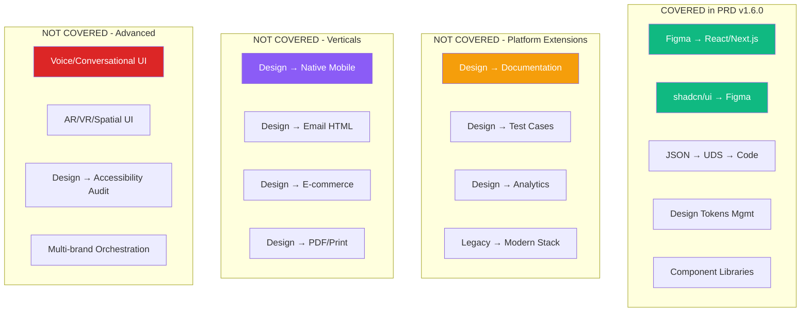
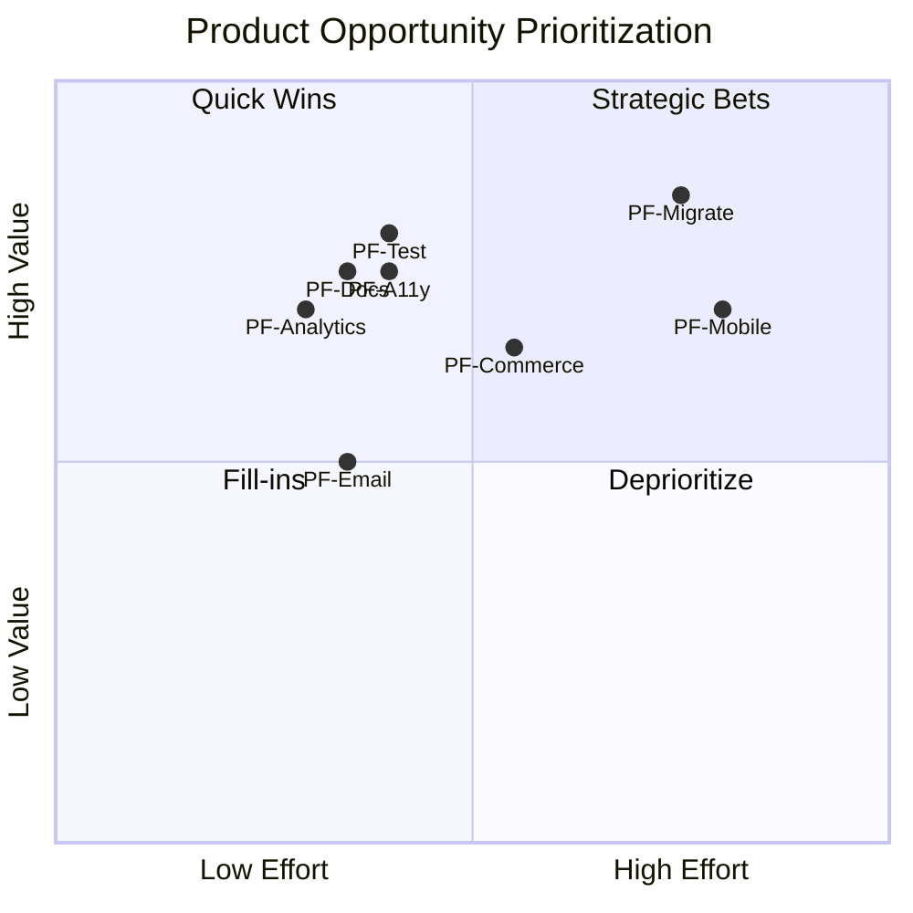
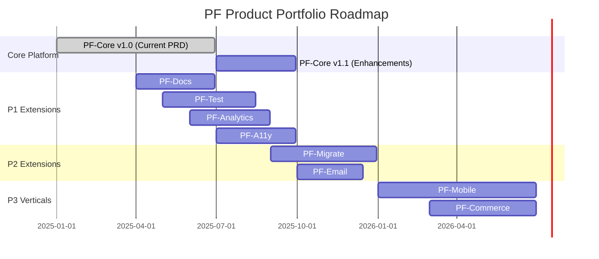
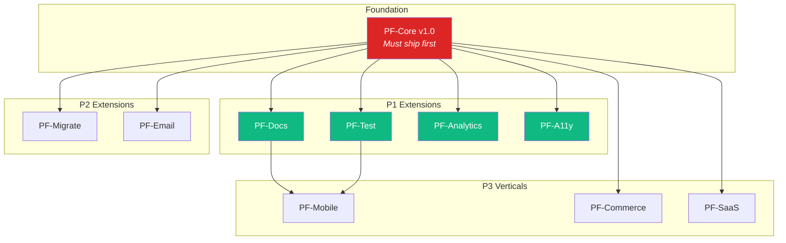
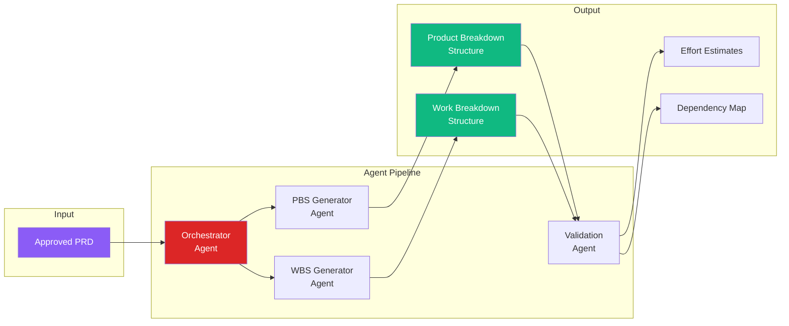
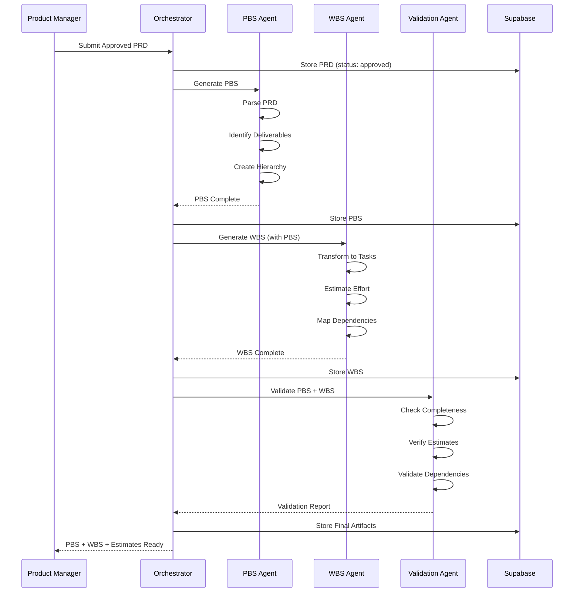
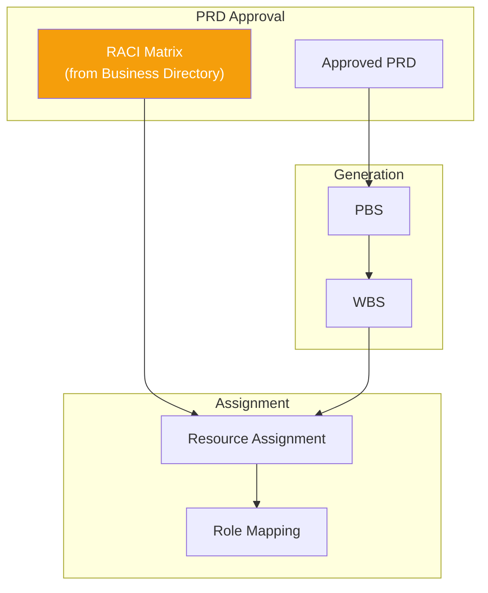

# PF-Core Product Portfolio Analysis
## From Core Platform to Value Propositions & Product Opportunities

**Version:** 1.0.0
**Date:** November 28, 2025
**Purpose:** Identify additional Design↔Code use cases not covered in PF-Core PRD v1.6.0, map value propositions, and define PBS/WBS agent generation workflow

---

## 1. Executive Summary

### Current PRD Coverage (v1.6.0)

The PF-Core PRD v1.6.0 comprehensively covers:

| Covered Area | Status |
|--------------|--------|
| Bidirectional Design↔Code transformation | ✅ Complete |
| Universal Design System abstraction | ✅ Complete |
| shadcn/ui baseline components | ✅ Complete |
| Four-tier inheritance (Platform→Client→App) | ✅ Complete |
| TDDD methodology | ✅ Complete |
| Agent architecture (OAA, CTD, FPA) | ✅ Complete |
| User roles & RBAC | ✅ Complete |
| Figma + JSON + Code adapters | ✅ Complete |

### Identified Gaps & Opportunities

This analysis identifies **12 additional product opportunities** representing uncovered use cases that could extend PF-Core's value proposition into adjacent markets.

---

## 2. PF-Core Value Proposition Hierarchy

```
┌─────────────────────────────────────────────────────────────────────────────────┐
│                                                                                 │
│                        PF-CORE VALUE PROPOSITION MAP                            │
│                                                                                 │
├─────────────────────────────────────────────────────────────────────────────────┤
│                                                                                 │
│  LEVEL 1: CORE PLATFORM (Current PRD v1.6.0)                                    │
│  ───────────────────────────────────────────                                    │
│  • Design Intelligence Platform                                                 │
│  • Bidirectional Design↔Code                                                    │
│  • Universal Design System                                                      │
│  • 13 Ontologies + OAA v3.0.0                                                   │
│                                                                                 │
├─────────────────────────────────────────────────────────────────────────────────┤
│                                                                                 │
│  LEVEL 2: PLATFORM EXTENSIONS (Adjacent Products)                               │
│  ────────────────────────────────────────────────                               │
│  • PF-Docs: Documentation Intelligence                                          │
│  • PF-Test: Visual Testing Platform                                             │
│  • PF-Analytics: Design System Analytics                                        │
│  • PF-Migrate: Legacy Migration Engine                                          │
│                                                                                 │
├─────────────────────────────────────────────────────────────────────────────────┤
│                                                                                 │
│  LEVEL 3: VERTICAL SOLUTIONS (Market-Specific)                                  │
│  ─────────────────────────────────────────────                                  │
│  • PF-Commerce: E-commerce UI Factory                                           │
│  • PF-SaaS: SaaS Dashboard Generator                                            │
│  • PF-Mobile: Mobile Design-to-Code                                             │
│  • PF-Email: Email Template System                                              │
│                                                                                 │
├─────────────────────────────────────────────────────────────────────────────────┤
│                                                                                 │
│  LEVEL 4: ECOSYSTEM SERVICES (Value-Added)                                      │
│  ─────────────────────────────────────────                                      │
│  • PF-Marketplace: Component Marketplace                                        │
│  • PF-Academy: Training & Certification                                         │
│  • PF-Consult: Professional Services                                            │
│  • PF-Partner: Partner Enablement                                               │
│                                                                                 │
└─────────────────────────────────────────────────────────────────────────────────┘
```

---

## 3. Gap Analysis: Uncovered Use Cases

### 3.1 Design↔Code Use Cases NOT in Current PRD



---

### 3.2 Detailed Gap Analysis

#### Category A: Platform Extensions (High Priority)

| # | Use Case | Gap Description | Value Proposition | Effort |
|---|----------|-----------------|-------------------|--------|
| **A1** | **Design → Documentation** | No automated generation of component docs, Storybook stories, or API documentation from design/code | Auto-generate living documentation that stays in sync | Medium |
| **A2** | **Design → Visual Tests** | No automated visual regression test generation from Figma designs | Generate Chromatic/Percy tests from design specs | Medium |
| **A3** | **Design System Analytics** | No usage tracking, adoption metrics, or design debt scoring | Measure design system health and ROI | Medium |
| **A4** | **Legacy Migration** | No pathway for migrating legacy CSS/jQuery/Angular to modern React | Automated legacy-to-modern transformation | High |

#### Category B: Output Format Extensions (Medium Priority)

| # | Use Case | Gap Description | Value Proposition | Effort |
|---|----------|-----------------|-------------------|--------|
| **B1** | **Design → React Native** | Only web (React/Next.js) covered, no native mobile | Generate iOS/Android from same design source | High |
| **B2** | **Design → Flutter** | No cross-platform mobile/desktop support | Single design → multi-platform output | High |
| **B3** | **Design → Email HTML** | No email-specific template generation | Responsive email templates from Figma | Medium |
| **B4** | **Design → PDF/Print** | No print-ready output generation | Marketing collateral from design system | Low |
| **B5** | **Design → Static Sites** | Only Next.js dynamic, no pure static (Astro, 11ty) | JAMstack site generation | Low |

#### Category C: Input Source Extensions (Medium Priority)

| # | Use Case | Gap Description | Value Proposition | Effort |
|---|----------|-----------------|-------------------|--------|
| **C1** | **Wireframe → High-Fidelity** | No low-fidelity to high-fidelity transformation | AI-assisted design refinement | Medium |
| **C2** | **Screenshot → Code** | No image-to-code capability | Reverse engineer existing UIs | High |
| **C3** | **Whiteboard → Design** | No FigJam/Miro to structured design | Ideation to implementation bridge | Medium |
| **C4** | **Voice → UI** | No conversational UI generation | Describe UI verbally, get design | High |

#### Category D: Specialized Domains (Lower Priority)

| # | Use Case | Gap Description | Value Proposition | Effort |
|---|----------|-----------------|-------------------|--------|
| **D1** | **E-commerce Patterns** | No domain-specific e-commerce modules (PDP, PLP, Cart) | Pre-built commerce UI patterns | Medium |
| **D2** | **SaaS Dashboard Patterns** | No pre-built SaaS patterns (settings, billing, admin) | Accelerate SaaS UI development | Medium |
| **D3** | **Data Visualization** | No chart/graph design-to-code pipeline | D3/Recharts generation from design | Medium |
| **D4** | **AR/VR/Spatial UI** | No 3D/spatial interface support | Future-ready spatial computing | High |

#### Category E: Governance & Compliance (High Value)

| # | Use Case | Gap Description | Value Proposition | Effort |
|---|----------|-----------------|-------------------|--------|
| **E1** | **Accessibility Audit** | Basic WCAG mentioned, no deep audit/remediation | Automated WCAG compliance with fixes | Medium |
| **E2** | **Brand Compliance Scoring** | No quantified brand adherence measurement | Brand consistency metrics | Low |
| **E3** | **Legal/Regulatory UI** | No GDPR/CCPA/HIPAA UI pattern enforcement | Compliance-ready UI patterns | Medium |
| **E4** | **Multi-brand Orchestration** | Four-tier exists, but no multi-brand campaign coordination | Coordinate UI across brand portfolio | Medium |

---

## 4. Product Opportunity Matrix

### 4.1 Prioritization Framework



### 4.2 Product Opportunity Cards

---

#### **PF-Docs** - Documentation Intelligence

| Attribute | Value |
|-----------|-------|
| **Category** | Platform Extension |
| **Priority** | P1 - High |
| **Effort** | Medium (8-12 weeks) |
| **Value** | High |
| **Dependencies** | PF-Core v1.0 |

**Problem Statement:**
Design systems lack living documentation. Component docs, Storybook stories, and API references become stale, creating friction for developers.

**Solution:**
Auto-generate and continuously sync documentation from design + code sources.

**Key Features:**
- Storybook story generation from Figma components
- API documentation from TypeScript types
- Usage guidelines from design annotations
- Interactive examples from code
- Changelog generation from version diffs

**Value Proposition:**
"Documentation that writes itself and never goes stale"

---

#### **PF-Test** - Visual Testing Platform

| Attribute | Value |
|-----------|-------|
| **Category** | Platform Extension |
| **Priority** | P1 - High |
| **Effort** | Medium (10-14 weeks) |
| **Value** | Very High |
| **Dependencies** | PF-Core v1.0 |

**Problem Statement:**
Visual regression testing requires manual baseline creation and maintenance. Designs and tests drift apart.

**Solution:**
Generate visual test suites directly from Figma designs, with automatic baseline updates.

**Key Features:**
- Chromatic/Percy test generation from Figma
- Automatic baseline updates on design changes
- Cross-browser test matrix
- Responsive breakpoint testing
- Accessibility test integration (axe-core)

**Value Proposition:**
"Your designs ARE your test baselines"

---

#### **PF-Analytics** - Design System Analytics

| Attribute | Value |
|-----------|-------|
| **Category** | Platform Extension |
| **Priority** | P1 - High |
| **Effort** | Medium (8-10 weeks) |
| **Value** | High |
| **Dependencies** | PF-Core v1.0 |

**Problem Statement:**
Design system teams can't measure adoption, usage patterns, or design debt. ROI is difficult to prove.

**Solution:**
Comprehensive analytics platform tracking design system health and business impact.

**Key Features:**
- Component usage tracking
- Adoption metrics by team/project
- Design debt scoring
- Token usage heatmaps
- ROI calculator
- Drift detection alerts

**Value Proposition:**
"Prove your design system ROI with data"

---

#### **PF-Migrate** - Legacy Migration Engine

| Attribute | Value |
|-----------|-------|
| **Category** | Platform Extension |
| **Priority** | P2 - Medium |
| **Effort** | High (16-20 weeks) |
| **Value** | Very High |
| **Dependencies** | PF-Core v1.0 |

**Problem Statement:**
Organizations have massive legacy codebases (jQuery, Angular 1.x, Bootstrap 3) they need to modernize but can't afford to rewrite.

**Solution:**
AI-powered migration engine that transforms legacy UI code to modern React/shadcn/ui.

**Key Features:**
- jQuery → React transformation
- AngularJS → React transformation
- Bootstrap → Tailwind/shadcn migration
- Legacy CSS → design tokens
- Incremental migration support
- Side-by-side comparison

**Value Proposition:**
"Modernize your legacy UI without the rewrite"

---

#### **PF-Mobile** - Mobile Design-to-Code

| Attribute | Value |
|-----------|-------|
| **Category** | Vertical Solution |
| **Priority** | P2 - Medium |
| **Effort** | High (16-24 weeks) |
| **Value** | High |
| **Dependencies** | PF-Core v1.0, UDS Extensions |

**Problem Statement:**
Current PRD only covers web (React/Next.js). Mobile teams need separate tools and workflows.

**Solution:**
Extend PF-Core to generate React Native and Flutter code from the same design source.

**Key Features:**
- Figma → React Native generation
- Figma → Flutter generation
- Shared design token system
- Platform-specific adaptations
- Native component mapping
- Preview on device

**Value Proposition:**
"One design, every platform"

---

#### **PF-A11y** - Accessibility Intelligence

| Attribute | Value |
|-----------|-------|
| **Category** | Governance & Compliance |
| **Priority** | P1 - High |
| **Effort** | Medium (10-12 weeks) |
| **Value** | Very High |
| **Dependencies** | PF-Core v1.0 |

**Problem Statement:**
Accessibility is often an afterthought, leading to expensive remediation. Current PRD mentions WCAG but lacks deep audit/fix capabilities.

**Solution:**
Proactive accessibility intelligence that audits, scores, and auto-fixes accessibility issues.

**Key Features:**
- WCAG 2.1 AA/AAA audit
- Automated fix suggestions
- Figma accessibility annotations
- Code-level a11y linting
- Screen reader simulation
- Compliance reporting

**Value Proposition:**
"Accessibility built-in, not bolted-on"

---

## 5. Product Portfolio Roadmap

### 5.1 Phased Product Launch



### 5.2 Product Dependencies



---

## 6. PBS/WBS Agent Generation Workflow

### 6.1 Overview

Post-PRD approval, **PBS (Product Breakdown Structure)** and **WBS (Work Breakdown Structure)** generation is automated via PF-Core agents.



### 6.2 PBS Generator Agent

**Purpose:** Decompose approved PRD into hierarchical product components.

**Agent Capabilities:**

| Capability | Description |
|------------|-------------|
| `parsePRD(prd)` | Extract requirements, features, components |
| `identifyDeliverables()` | Map to tangible deliverables |
| `createHierarchy()` | Build parent-child structure |
| `assignCodes()` | Apply PBS numbering scheme |
| `validateCompleteness()` | Ensure all PRD items covered |

**PBS Output Schema:**

```json
{
  "@type": "pbs:ProductBreakdownStructure",
  "prdSource": "PRD-PF-Core-v1.6.0",
  "generatedBy": "PBS-Generator-Agent",
  "timestamp": "2025-01-15T10:00:00Z",
  "root": {
    "code": "PF",
    "name": "PF-Core Platform",
    "children": [
      {
        "code": "PF.1",
        "name": "Universal Design System",
        "children": [
          { "code": "PF.1.1", "name": "UDS Ontology Schema" },
          { "code": "PF.1.2", "name": "Adapter Interface" },
          { "code": "PF.1.3", "name": "Figma Adapter" },
          { "code": "PF.1.4", "name": "JSON Adapter" },
          { "code": "PF.1.5", "name": "Code Adapter" }
        ]
      },
      {
        "code": "PF.2",
        "name": "Agent Architecture",
        "children": [
          { "code": "PF.2.1", "name": "Orchestrator Agent" },
          { "code": "PF.2.2", "name": "OAA v3.0.0" },
          { "code": "PF.2.3", "name": "CTD Agent" },
          { "code": "PF.2.4", "name": "FPA Agent" }
        ]
      }
    ]
  }
}
```

### 6.3 WBS Generator Agent

**Purpose:** Transform PBS into actionable work packages with estimates.

**Agent Capabilities:**

| Capability | Description |
|------------|-------------|
| `transformPBS(pbs)` | Convert deliverables to tasks |
| `decomposeTasks()` | Break into work packages |
| `estimateEffort()` | Apply estimation models |
| `identifyDependencies()` | Map task dependencies |
| `assignResources()` | Suggest resource allocation |
| `generateSchedule()` | Create timeline |

**WBS Output Schema:**

```json
{
  "@type": "wbs:WorkBreakdownStructure",
  "pbsSource": "PBS-PF-Core-v1.0",
  "generatedBy": "WBS-Generator-Agent",
  "timestamp": "2025-01-15T11:00:00Z",
  "workPackages": [
    {
      "code": "WP.1.1.1",
      "pbsRef": "PF.1.1",
      "name": "Design UDS Ontology Schema",
      "tasks": [
        {
          "id": "T001",
          "name": "Define core entities",
          "effort": { "optimistic": 16, "likely": 24, "pessimistic": 40, "unit": "hours" },
          "dependencies": [],
          "skills": ["ontology", "schema-design"],
          "deliverable": "uds-schema-v1.json"
        },
        {
          "id": "T002",
          "name": "Define adapter interface",
          "effort": { "optimistic": 8, "likely": 16, "pessimistic": 24, "unit": "hours" },
          "dependencies": ["T001"],
          "skills": ["typescript", "api-design"],
          "deliverable": "adapter-interface.ts"
        }
      ]
    }
  ],
  "summary": {
    "totalWorkPackages": 45,
    "totalTasks": 180,
    "estimatedEffort": {
      "optimistic": "18 weeks",
      "likely": "23 weeks",
      "pessimistic": "32 weeks"
    },
    "criticalPath": ["WP.1.1.1", "WP.1.2.1", "WP.2.1.1", "WP.2.2.1"]
  }
}
```

### 6.4 Agent Workflow Sequence



### 6.5 Integration with RACI

PBS/WBS generation integrates with the RACI matrix from the Business Directory ontology:



**RACI-Aware WBS Task:**

```json
{
  "id": "T001",
  "name": "Design UDS Ontology Schema",
  "raci": {
    "responsible": ["person_003"],
    "accountable": ["person_001"],
    "consulted": ["person_012"],
    "informed": ["person_002", "person_006"]
  },
  "raciRoles": {
    "responsible": "IT Manager",
    "accountable": "CEO/Owner",
    "consulted": "External Architect",
    "informed": "Marketing Director"
  }
}
```

---

## 7. Summary: Product Opportunities

### 7.1 Not Covered in Current PRD (Opportunities)

| Priority | Product | Use Case | Status |
|----------|---------|----------|--------|
| **P1** | PF-Docs | Design → Documentation | Gap - High Value |
| **P1** | PF-Test | Design → Visual Tests | Gap - High Value |
| **P1** | PF-Analytics | Design System Metrics | Gap - High Value |
| **P1** | PF-A11y | Accessibility Intelligence | Gap - High Value |
| **P2** | PF-Migrate | Legacy → Modern | Gap - Strategic |
| **P2** | PF-Email | Design → Email HTML | Gap - Medium Value |
| **P2** | PF-Mobile | Design → React Native/Flutter | Gap - High Effort |
| **P3** | PF-Commerce | E-commerce Patterns | Gap - Vertical |
| **P3** | PF-SaaS | SaaS Dashboard Patterns | Gap - Vertical |
| **P3** | PF-Data | Design → Data Viz | Gap - Specialized |

### 7.2 PBS/WBS Generation Confirmation

**Yes**, the assumption is correct:

> PBS and WBS will be produced by agents post-approval of the given product's PRD

**Workflow:**
1. PRD submitted and approved
2. Orchestrator triggers PBS Generator Agent
3. PBS Generator decomposes PRD into deliverables
4. WBS Generator transforms to work packages
5. Validation Agent ensures completeness
6. RACI integration for resource assignment
7. Artifacts stored in Supabase

---

## 8. Recommended Next Steps

| Step | Action | Output |
|------|--------|--------|
| 1 | Approve PF-Core PRD v1.6.0 | Approved PRD |
| 2 | Trigger PBS/WBS Generation | PBS + WBS artifacts |
| 3 | Prioritize P1 Extensions | Extension PRD backlog |
| 4 | Create PF-Docs PRD | First extension PRD |
| 5 | Create PF-Test PRD | Second extension PRD |

---

## Appendix A: Full Use Case Inventory

| # | Use Case | Direction | Covered? | Product |
|---|----------|-----------|----------|---------|
| 1 | Figma → React | D→C | ✅ PRD | PF-Core |
| 2 | Figma → Next.js | D→C | ✅ PRD | PF-Core |
| 3 | shadcn/ui → Figma | C→D | ✅ PRD | PF-Core |
| 4 | JSON → UDS | D→C | ✅ PRD | PF-Core |
| 5 | Design Tokens Mgmt | Both | ✅ PRD | PF-Core |
| 6 | Four-tier Inheritance | Both | ✅ PRD | PF-Core |
| 7 | Design → Storybook | D→C | ❌ Gap | PF-Docs |
| 8 | Design → API Docs | D→C | ❌ Gap | PF-Docs |
| 9 | Design → Visual Tests | D→C | ❌ Gap | PF-Test |
| 10 | Design System Analytics | N/A | ❌ Gap | PF-Analytics |
| 11 | Legacy → Modern | C→C | ❌ Gap | PF-Migrate |
| 12 | Design → React Native | D→C | ❌ Gap | PF-Mobile |
| 13 | Design → Flutter | D→C | ❌ Gap | PF-Mobile |
| 14 | Design → Email HTML | D→C | ❌ Gap | PF-Email |
| 15 | Design → PDF/Print | D→C | ❌ Gap | PF-Print |
| 16 | Accessibility Audit | Both | ❌ Gap | PF-A11y |
| 17 | Screenshot → Code | D→C | ❌ Gap | PF-Vision |
| 18 | Voice → UI | D→C | ❌ Gap | PF-Voice |
| 19 | E-commerce Patterns | Both | ❌ Gap | PF-Commerce |
| 20 | SaaS Patterns | Both | ❌ Gap | PF-SaaS |

---

*End of Document*
