# PRD Addendum: Design Ecosystem Integration
## PF-Core Design System Intelligence v1.2.0

**Figma MCP, Code Connect & End-to-End Enhancement**

| | |
|---|---|
| **Addendum Version** | 1.0.0 |
| **Date** | November 28, 2025 |
| **Base PRD** | PRD-PF-Core-Design-System-v1.1.0 |
| **Status** | Proposed |

---

## Document Purpose

This addendum extends the base PRD with:

1. **Figma MCP Integration** - Direct Claude-to-Figma capabilities
2. **Code Connect Integration** - Bidirectional design-code linkage
3. **End-to-End Design Ecosystem** - Idea-to-production integrity
4. **PRD Revision Recommendations** - Changes to base PRD

---

## Table of Contents

1. [Executive Summary](#1-executive-summary)
2. [Figma MCP Integration](#2-figma-mcp-integration)
3. [Code Connect Integration](#3-code-connect-integration)
4. [End-to-End Design Ecosystem](#4-end-to-end-design-ecosystem)
5. [Revised Ontology Inventory](#5-revised-ontology-inventory)
6. [Additional Functional Requirements](#6-additional-functional-requirements)
7. [Revised Implementation Plan](#7-revised-implementation-plan)
8. [PRD Revision Traceability](#8-prd-revision-traceability)

---

## 1. Executive Summary

### 1.1 Addendum Scope

This addendum introduces capabilities that leverage **native Claude-Figma integration** via MCP (Model Context Protocol) and establish **bidirectional design-code traceability** via Code Connect. These additions transform PF-Core from a pipeline-based system to a **real-time, integrated design ecosystem**.

### 1.2 Key Additions

| Addition | Description | Strategic Value |
|----------|-------------|-----------------|
| **Figma MCP** | Direct Claude access to Figma via MCP tools | Real-time design extraction, eliminate pipeline lag |
| **Code Connect** | Figma-to-code component mapping | Bidirectional traceability, drift detection |
| **Design Ecosystem** | End-to-end integrity from idea to production | Continuous compliance, governance automation |

### 1.3 Revised System Architecture


---

## 2. Figma MCP Integration

### 2.1 Overview

Figma MCP provides **direct, real-time access** from Claude to Figma documents. This fundamentally changes how PF-Core interacts with design assets.

### 2.2 Available MCP Tools

```mermaid
flowchart LR
    subgraph "Figma MCP Tools"
        subgraph "Design Extraction"
            T1["get_design_context<br/><i>Component structure + styling</i>"]
            T2["get_variable_defs<br/><i>Design tokens from Variables</i>"]
            T3["get_metadata<br/><i>Node/page structure</i>"]
        end
        
        subgraph "Code Integration"
            T4["get_code_connect_map<br/><i>Figma ↔ code mappings</i>"]
        end
        
        subgraph "Governance"
            T5["create_design_system_rules<br/><i>Auto-generate rules</i>"]
        end
        
        subgraph "Utility"
            T6["whoami<br/><i>Auth validation</i>"]
        end
    end
```



### 2.3 MCP Tool Specifications

#### 2.3.1 get_design_context

**Purpose:** Extract component structure and styling from Figma nodes

**PF-Core Usage:**
- Extract component anatomy for Component Ontology validation
- Pull styling values for token mapping
- Get variant configurations for variant registry

**Integration Pattern:**


**Parameters:**

| Parameter | Type | Description |
|-----------|------|-------------|
| `fileKey` | string | Figma file identifier |
| `nodeId` | string | Component node ID (e.g., "123:456") |
| `clientLanguages` | string | Target languages (e.g., "typescript") |
| `clientFrameworks` | string | Target frameworks (e.g., "react") |

---

#### 2.3.2 get_variable_defs

**Purpose:** Extract design token definitions from Figma Variables

**PF-Core Usage:**
- Real-time token synchronization
- Eliminate manual export pipeline
- Live validation against Token Ontology

**Integration Pattern:**


**Token Mapping:**

| Figma Variable Type | PF-Core Token Category |
|---------------------|------------------------|
| Color | `primitive.color.*` / `semantic.color.*` |
| Number | `primitive.spacing.*` / `primitive.radius.*` |
| String | `primitive.typography.*` |
| Boolean | `semantic.state.*` |

---

#### 2.3.3 get_code_connect_map

**Purpose:** Retrieve mapping between Figma components and codebase locations

**PF-Core Usage:**
- Bidirectional traceability
- Validate generated code against linked implementation
- Detect design-code drift

**Response Structure:**

```json
{
  "1:2": {
    "codeConnectSrc": "https://github.com/org/repo/components/Button.tsx",
    "codeConnectName": "Button"
  },
  "3:4": {
    "codeConnectSrc": "https://github.com/org/repo/components/Card.tsx",
    "codeConnectName": "Card"
  }
}
```

---

#### 2.3.4 create_design_system_rules

**Purpose:** Auto-generate governance rules from Figma structure

**PF-Core Usage:**
- Bootstrap ontology rules from existing Figma design system
- Generate composition rules from component nesting
- Create variant rules from component variants

**Integration with OAA:**


---

### 2.4 MCP Integration Architecture

```mermaid
flowchart TB
    subgraph "MCP Handler Module"
        subgraph "Connection Layer"
            CL1["MCP Client"]
            CL2["Auth Manager"]
            CL3["Rate Limiter"]
        end
        
        subgraph "Tool Wrappers"
            TW1["DesignContextFetcher"]
            TW2["VariableDefsFetcher"]
            TW3["CodeConnectFetcher"]
            TW4["RulesGenerator"]
            TW5["MetadataFetcher"]
        end
        
        subgraph "Cache Layer"
            CA1["Design Cache<br/><i>TTL: 5 min</i>"]
            CA2["Token Cache<br/><i>TTL: 1 min</i>"]
            CA3["Mapping Cache<br/><i>TTL: 10 min</i>"]
        end
        
        subgraph "Transformation Layer"
            TR1["Figma → Ontology<br/>Transformer"]
            TR2["Token → CSS<br/>Transformer"]
        end
    end
    
    CL1 --> TW1
    CL1 --> TW2
    CL1 --> TW3
    CL1 --> TW4
    CL1 --> TW5
    
    CL2 --> CL1
    CL3 --> CL1
    
    TW1 --> CA1
    TW2 --> CA2
    TW3 --> CA3
    
    CA1 --> TR1
    CA2 --> TR1
    TR1 --> TR2
```



### 2.5 MCP vs Pipeline: Hybrid Approach

The original PRD pipeline is **not eliminated** but **repositioned** as secondary:


---

## 3. Code Connect Integration

### 3.1 Overview

Code Connect establishes **bidirectional linkage** between Figma components and their code implementations, enabling traceability and drift detection.

### 3.2 Code Connect Architecture


### 3.3 Code Connect Across Four Tiers

Code Connect mappings exist at **each tier** of the architecture:


### 3.4 Code Connect Mapping Schema

```json
{
  "@type": "CodeConnectMapping",
  "@id": "cc:button-primary",
  "figmaComponent": {
    "fileKey": "abc123",
    "nodeId": "1:234",
    "componentName": "Button/Primary"
  },
  "codeImplementation": {
    "repository": "github.com/org/pf-core",
    "filePath": "/src/components/ui/button.tsx",
    "exportName": "Button",
    "variant": "default"
  },
  "tier": "pf-core",
  "tokenBindings": [
    {
      "figmaVariable": "color/interactive/primary",
      "cssProperty": "--color-interactive-primary",
      "tokenRef": "semantic.interactive.primary"
    }
  ],
  "validationStatus": {
    "lastValidated": "2025-01-15T10:30:00Z",
    "structureMatch": true,
    "tokenMatch": true,
    "driftDetected": false
  }
}
```

### 3.5 Drift Detection System


### 3.6 Code Connect Validation Rules

| Rule | Description | Severity |
|------|-------------|----------|
| **CC-001** | Every Figma component must have a Code Connect mapping | Critical |
| **CC-002** | Code file path must exist and be accessible | Critical |
| **CC-003** | Token bindings must resolve to valid tokens | High |
| **CC-004** | Structure must match component anatomy | High |
| **CC-005** | Variants must exist in both Figma and code | Medium |
| **CC-006** | Last validation must be within 24 hours | Low |

---

## 4. End-to-End Design Ecosystem

### 4.1 Ecosystem Overview

The enhanced PF-Core creates a **seamless flow** from design ideation to production deployment with integrity maintained at every stage.

```mermaid
flowchart LR
    subgraph "Stages"
        S1["💡 Idea"]
        S2["🎨 Design"]
        S3["🔧 Prototype"]
        S4["💻 Development"]
        S5["🧪 Testing"]
        S6["🚀 Production"]
    end
    
    subgraph "Integrity Gates"
        G1["Design<br/>Compliance"]
        G2["Prototype<br/>Validation"]
        G3["Code<br/>Compliance"]
        G4["Visual<br/>Regression"]
        G5["Production<br/>Audit"]
    end
    
    subgraph "Artifacts"
        A1["Concept"]
        A2["Figma<br/>Design"]
        A3["Interactive<br/>Prototype"]
        A4["React<br/>Components"]
        A5["Test<br/>Suite"]
        A6["Deployed<br/>Application"]
    end
    
    S1 --> S2 --> S3 --> S4 --> S5 --> S6
    
    S2 --> G1
    S3 --> G2
    S4 --> G3
    S5 --> G4
    S6 --> G5
    
    S1 --> A1
    S2 --> A2
    S3 --> A3
    S4 --> A4
    S5 --> A5
    S6 --> A6
    
    G1 -->|"Pass"| S3
    G2 -->|"Pass"| S4
    G3 -->|"Pass"| S5
    G4 -->|"Pass"| S6
    
    style G1 fill:#dc2626,color:#fff
    style G2 fill:#dc2626,color:#fff
    style G3 fill:#dc2626,color:#fff
    style G4 fill:#dc2626,color:#fff
    style G5 fill:#dc2626,color:#fff
```



### 4.2 Stage Definitions

#### Stage 1: Idea → Design


**Capabilities:**
- Natural language concept → suggested module patterns
- Automatic Figma component assembly suggestions
- Design system compliance from inception

---

#### Stage 2: Design → Prototype


**Capabilities:**
- Real-time compliance validation via MCP
- Automatic token extraction
- Interactive prototype generation

---

#### Stage 3: Prototype → Development


**Capabilities:**
- Design-compliant code generation
- Automatic Code Connect registration
- Four-tier token resolution

---

#### Stage 4: Development → Testing


**Capabilities:**
- Auto-generated unit tests
- Visual regression against Figma source
- Accessibility compliance testing

---

#### Stage 5: Testing → Production


**Capabilities:**
- Final compliance gate
- Continuous drift monitoring
- Production audit logging

---

### 4.3 Traceability Chain

Every artifact maintains a **traceability link** back to its source:


**Traceability Record:**

```json
{
  "@type": "TraceabilityRecord",
  "@id": "trace:button-prod-001",
  "productionArtifact": {
    "url": "https://app.example.com/components/Button",
    "deployedAt": "2025-01-15T14:00:00Z",
    "version": "2.3.1"
  },
  "sourceCode": {
    "repository": "github.com/org/app",
    "filePath": "/src/components/Button.tsx",
    "commitHash": "abc123"
  },
  "codeConnect": {
    "mappingId": "cc:button-primary"
  },
  "figmaSource": {
    "fileKey": "xyz789",
    "nodeId": "1:234",
    "lastModified": "2025-01-14T10:00:00Z"
  },
  "tokens": {
    "resolved": ["semantic.interactive.primary", "spacing.md"],
    "tier": "client",
    "platform": "BAIV",
    "client": "ClientX"
  },
  "validationHistory": [
    {
      "stage": "design",
      "result": "pass",
      "timestamp": "2025-01-14T10:30:00Z"
    },
    {
      "stage": "development",
      "result": "pass",
      "timestamp": "2025-01-14T16:00:00Z"
    },
    {
      "stage": "production",
      "result": "pass",
      "timestamp": "2025-01-15T14:00:00Z"
    }
  ]
}
```

---

### 4.4 Design Integrity Guardian

A continuous monitoring system ensuring design system compliance across all stages:


**Integrity Metrics:**

| Metric | Description | Target |
|--------|-------------|--------|
| **Design Compliance Score** | % of designs passing all rules | > 98% |
| **Token Adoption Rate** | % of styles using tokens (not hardcoded) | 100% |
| **Code Connect Coverage** | % of components with valid mappings | > 95% |
| **Drift Incidents** | Count of design-code mismatches detected | < 5/week |
| **Mean Time to Remediation** | Average time to fix drift | < 4 hours |

---

## 5. Revised Ontology Inventory

### 5.1 Additional Ontology: Code Connect

The base PRD defines 10 ontologies. This addendum adds an **11th ontology**:


### 5.2 Code Connect Ontology Specification

| Property | Value |
|----------|-------|
| **Ontology ID** | `code-connect-ontology` |
| **Version** | `1.0.0` |
| **Depends On** | PF-Core, shadcn/ui Component, Claude Code |
| **Managed By** | OAA v3.0 |

**Scope:**
- Figma-to-code mapping definitions
- Validation rules and status tracking
- Drift detection configurations
- Tier-specific mapping inheritance
- Traceability chain records

**Key Entities:**

| Entity | Description |
|--------|-------------|
| `cc:Mapping` | Individual Figma-code linkage |
| `cc:MappingRegistry` | Collection of mappings per tier |
| `cc:ValidationRule` | Rule for validating mappings |
| `cc:DriftRecord` | Record of detected drift |
| `cc:TraceabilityChain` | Full trace from production to design |

---

### 5.3 Updated Ontology Dependency Graph


---

## 6. Additional Functional Requirements

### 6.1 Figma MCP Integration Requirements

| ID | Requirement |
|----|-------------|
| FR-MCP01 | System SHALL use Figma MCP as primary method for design data access |
| FR-MCP02 | System SHALL implement `get_design_context` for component extraction |
| FR-MCP03 | System SHALL implement `get_variable_defs` for real-time token access |
| FR-MCP04 | System SHALL implement `get_code_connect_map` for traceability |
| FR-MCP05 | System SHALL implement `create_design_system_rules` for governance generation |
| FR-MCP06 | System SHALL cache MCP responses with configurable TTL |
| FR-MCP07 | System SHALL fall back to pipeline processing if MCP unavailable |
| FR-MCP08 | System SHALL validate MCP responses against ontology schemas |

### 6.2 Code Connect Requirements

| ID | Requirement |
|----|-------------|
| FR-CC01 | System SHALL maintain Code Connect mappings for all four tiers |
| FR-CC02 | System SHALL validate Code Connect mappings at each tier transition |
| FR-CC03 | System SHALL detect drift between Figma and code implementations |
| FR-CC04 | System SHALL alert stakeholders within 1 hour of drift detection |
| FR-CC05 | System SHALL maintain traceability chain from production to design |
| FR-CC06 | System SHALL register new Code Connect mappings during code generation |
| FR-CC07 | System SHALL validate generated code against linked Figma component |
| FR-CC08 | Code Connect mappings SHALL inherit through the four-tier hierarchy |

### 6.3 End-to-End Ecosystem Requirements

| ID | Requirement |
|----|-------------|
| FR-E2E01 | System SHALL support seamless progression through all stages |
| FR-E2E02 | System SHALL enforce integrity gates between stages |
| FR-E2E03 | System SHALL maintain artifact versioning at each stage |
| FR-E2E04 | System SHALL support rollback to previous stages |
| FR-E2E05 | System SHALL generate traceability records for all artifacts |
| FR-E2E06 | System SHALL provide integrity dashboard with real-time metrics |
| FR-E2E07 | System SHALL support configurable auto-remediation |
| FR-E2E08 | System SHALL generate governance reports on demand |

---

## 7. Revised Implementation Plan

### 7.1 Additional Phases

The following phases are **added** to the base PRD implementation plan:

```mermaid
gantt
    title Addendum Implementation Phases
    dateFormat  YYYY-MM-DD
    
    section Phase 0: MCP Integration
    MCP Handler Setup              :p0a, 2025-01-06, 5d
    Tool Wrapper Implementation    :p0b, after p0a, 7d
    Cache Layer                    :p0c, after p0b, 3d
    Transformation Layer           :p0d, after p0c, 5d
    
    section Phase A: Code Connect
    Ontology Definition            :pAa, after p0d, 5d
    Mapping Registry               :pAb, after pAa, 7d
    Drift Detection                :pAc, after pAb, 7d
    Validation Rules               :pAd, after pAc, 5d
    
    section Phase B: Ecosystem
    Stage Registry                 :pBa, after pAd, 5d
    Integrity Gates                :pBb, after pBa, 7d
    Traceability Chain             :pBc, after pBb, 7d
    Integrity Guardian             :pBd, after pBc, 10d
    
    section Phase C: Dashboard
    Metrics Collection             :pCa, after pBd, 5d
    Dashboard UI                   :pCb, after pCa, 10d
    Reporting Engine               :pCc, after pCb, 5d
```

### 7.2 Revised Phase Summary

| Phase | Focus | Duration | Dependency |
|-------|-------|----------|------------|
| **Phase 0** | MCP Integration | 3 weeks | Before Phase 1 |
| **Phase A** | Code Connect | 3.5 weeks | After Phase 0 |
| **Phase B** | Ecosystem | 4 weeks | After Phase A |
| **Phase C** | Dashboard | 3 weeks | After Phase B |

### 7.3 Integration with Base PRD Phases

```mermaid
flowchart LR
    subgraph "Base PRD Phases"
        BP1["Phase 1<br/>Foundation"]
        BP2["Phase 2<br/>Design"]
        BP3["Phase 3<br/>Pattern"]
        BP4["Phase 4<br/>Instance"]
        BP5["Phase 5<br/>Integration"]
        BP6["Phase 6<br/>Validation"]
    end
    
    subgraph "Addendum Phases"
        AP0["Phase 0<br/>MCP"]
        APA["Phase A<br/>Code Connect"]
        APB["Phase B<br/>Ecosystem"]
        APC["Phase C<br/>Dashboard"]
    end
    
    AP0 -->|"Before"| BP1
    BP1 --> BP2
    BP2 --> APA
    APA --> BP3
    BP3 --> BP4
    BP4 --> BP5
    BP5 --> APB
    APB --> BP6
    BP6 --> APC
    
    style AP0 fill:#8b5cf6,color:#fff
    style APA fill:#f59e0b,color:#fff
    style APB fill:#10b981,color:#fff
    style APC fill:#3b82f6,color:#fff
```

---

## 8. PRD Revision Traceability

### 8.1 Required Revisions to Base PRD

Based on this addendum, the following revisions are recommended for the base PRD:

| Section | Revision Type | Description | Traceability |
|---------|---------------|-------------|--------------|
| **1.3 System Overview** | Update | Add MCP integration to architecture diagram | ADD-2.4 |
| **3.0 Ontology Inventory** | Addition | Add Code Connect Ontology (#11) | ADD-5.2 |
| **4.0 Figma Make Compliance** | Restructure | Rename to "Figma Integration Layer", prioritize MCP | ADD-2.5 |
| **5.2 Success Metrics** | Addition | Add MCP and Code Connect metrics | ADD-4.4 |
| **6.1 In Scope** | Addition | Add MCP tools, Code Connect, ecosystem features | ADD-6.1, 6.2, 6.3 |
| **7.0 Functional Requirements** | Addition | Add FR-MCP, FR-CC, FR-E2E sections | ADD-6.1, 6.2, 6.3 |
| **8.1 Performance** | Update | Add MCP latency targets | ADD-2.4 |
| **9.0 Implementation Plan** | Restructure | Add Phase 0 (MCP), integrate Phases A, B, C | ADD-7.0 |

### 8.2 Revision Traceability Matrix

```mermaid
flowchart TD
    subgraph "Addendum Sections"
        A2["ADD-2: Figma MCP"]
        A3["ADD-3: Code Connect"]
        A4["ADD-4: Ecosystem"]
        A5["ADD-5: Ontology"]
        A6["ADD-6: Requirements"]
        A7["ADD-7: Implementation"]
    end
    
    subgraph "PRD Sections Affected"
        P1["PRD-1.3: System Overview"]
        P3["PRD-3.0: Ontology Inventory"]
        P4["PRD-4.0: Figma Make"]
        P5["PRD-5.2: Success Metrics"]
        P6["PRD-6.1: In Scope"]
        P7["PRD-7.0: Requirements"]
        P8["PRD-8.1: Performance"]
        P9["PRD-9.0: Implementation"]
    end
    
    A2 --> P1
    A2 --> P4
    A2 --> P8
    
    A3 --> P3
    A3 --> P7
    
    A4 --> P5
    A4 --> P6
    
    A5 --> P3
    
    A6 --> P6
    A6 --> P7
    
    A7 --> P9
```

### 8.3 Backward Compatibility Assessment

| Aspect | Impact | Mitigation |
|--------|--------|------------|
| **Ontology Structure** | Compatible - adds ontology, doesn't modify existing | None required |
| **Four-Tier Model** | Compatible - Code Connect layers on top | None required |
| **Token System** | Compatible - MCP provides same data | None required |
| **Agent Architecture** | Enhanced - adds MCP handler | Additive only |
| **Pipeline System** | Repositioned - becomes secondary | Document clearly |
| **PBS/WBS** | Extension required | Add new phases |

### 8.4 Integration Checklist

Before implementing this addendum:

- [ ] Review base PRD sections marked for revision
- [ ] Update base PRD with marked changes
- [ ] Add Code Connect Ontology to OAA registry
- [ ] Update PBS with MCP Handler module (new 1.5 subsystem)
- [ ] Update PBS with Code Connect module (new 8.0 system)
- [ ] Update WBS with Phase 0, A, B, C
- [ ] Update dependency matrix for new phases
- [ ] Validate no breaking changes to existing phases

---

## Appendix: Figma MCP Tool Reference

### Quick Reference Card

| Tool | Purpose | Parameters | Returns |
|------|---------|------------|---------|
| `get_design_context` | Extract component data | fileKey, nodeId | Component JSON |
| `get_variable_defs` | Get token definitions | fileKey, nodeId | Token map |
| `get_code_connect_map` | Get Figma-code mappings | fileKey, nodeId | Mapping JSON |
| `create_design_system_rules` | Generate DS rules | nodeId | Rules JSON |
| `get_metadata` | Get node structure | fileKey, nodeId | XML structure |
| `whoami` | Auth validation | - | User info |

### Usage Examples

**Extract tokens for a component:**
```
Figma:get_variable_defs(fileKey="abc123", nodeId="1:234")
```

**Get Code Connect mapping:**
```
Figma:get_code_connect_map(fileKey="abc123", nodeId="1:234")
```

**Generate design system rules:**
```
Figma:create_design_system_rules(nodeId="1:234", clientLanguages="typescript", clientFrameworks="react")
```

---

*End of Addendum - PRD v1.2.0*
