# PRD to PBS Traceability Diagrams
## PF-Core Design Intelligence Platform

**Document:** PRD-PBS-Traceability-Diagrams-v1.0.0
**Date:** November 28, 2025
**Source PRD:** PRD-PF-Core-v1.6.1-APPROVED
**Source PBS:** PBS-PF-Core-v1.0.0

---

## 1. Master Traceability Overview

```mermaid
flowchart TB
    subgraph "PRD v1.6.1 APPROVED"
        PRD["📋 PRD<br/>PF-Core Design Intelligence Platform<br/>v1.6.1 APPROVED"]
    end
    
    subgraph "Requirement Categories"
        REQ_CORE["🎯 Core Requirements<br/>FR-CORE"]
        REQ_UDS["🔷 UDS Requirements<br/>FR-UDS"]
        REQ_AGT["🤖 Agent Requirements<br/>FR-AGT"]
        REQ_ONT["📚 Ontology Requirements<br/>FR-ONT"]
        REQ_FIG["🎨 Figma Requirements<br/>FR-FIG"]
        REQ_TDDD["✅ TDDD Requirements<br/>FR-TDDD"]
        REQ_PLAT["🏢 Platform Requirements<br/>FR-PLAT"]
        REQ_TECH["⚙️ Technical Requirements<br/>FR-TECH"]
    end
    
    subgraph "PBS Categories"
        PBS1["PF.1<br/>Universal Design System"]
        PBS2["PF.2<br/>Agent Architecture"]
        PBS3["PF.3<br/>Ontology Stack"]
        PBS4["PF.4<br/>Data Layer"]
        PBS5["PF.5<br/>UI Framework"]
        PBS6["PF.6<br/>Figma Integration"]
        PBS7["PF.7<br/>TDDD Framework"]
        PBS8["PF.8<br/>Platform Instances"]
        PBS9["PF.9<br/>Documentation"]
        PBS10["PF.10<br/>DevOps"]
    end
    
    PRD --> REQ_CORE & REQ_UDS & REQ_AGT & REQ_ONT
    PRD --> REQ_FIG & REQ_TDDD & REQ_PLAT & REQ_TECH
    
    REQ_UDS --> PBS1
    REQ_AGT --> PBS2
    REQ_ONT --> PBS3
    REQ_TECH --> PBS4
    REQ_CORE --> PBS5
    REQ_FIG --> PBS6
    REQ_TDDD --> PBS7
    REQ_PLAT --> PBS8
    REQ_CORE --> PBS9
    REQ_TECH --> PBS10
    
    style PRD fill:#dc2626,color:#fff,stroke:#991b1b,stroke-width:3px
    style PBS1 fill:#10b981,color:#fff
    style PBS2 fill:#10b981,color:#fff
    style PBS3 fill:#10b981,color:#fff
    style PBS4 fill:#10b981,color:#fff
    style PBS5 fill:#10b981,color:#fff
    style PBS6 fill:#10b981,color:#fff
    style PBS7 fill:#10b981,color:#fff
    style PBS8 fill:#10b981,color:#fff
    style PBS9 fill:#10b981,color:#fff
    style PBS10 fill:#10b981,color:#fff
```

---

## 2. Tier 1: PRD Vision to PBS Categories

```mermaid
flowchart LR
    subgraph "PRD VISION"
        V1["💡 Idea-to-Execution<br/>Acceleration"]
        V2["🔄 Bidirectional<br/>Design ↔ Code"]
        V3["🌊 Blue Ocean<br/>Differentiation"]
        V4["🎯 AI-Augmented<br/>Intelligence"]
    end
    
    subgraph "PBS ROLL-UP"
        direction TB
        PF["PF: PF-Core<br/>217 Deliverables<br/>10 Categories"]
    end
    
    V1 --> PF
    V2 --> PF
    V3 --> PF
    V4 --> PF
    
    style V1 fill:#8b5cf6,color:#fff
    style V2 fill:#8b5cf6,color:#fff
    style V3 fill:#8b5cf6,color:#fff
    style V4 fill:#8b5cf6,color:#fff
    style PF fill:#dc2626,color:#fff,stroke:#991b1b,stroke-width:3px
```

---

## 3. Tier 2: PRD Sections to PBS Categories

```mermaid
flowchart TB
    subgraph "PRD SECTIONS"
        S1["§3 Technology Stack"]
        S2["§4 Universal Design System"]
        S3["§5 Four-Tier Model"]
        S4["§6 Figma Integration"]
        S5["§9 Ontology Inventory"]
        S6["§11 TDDD Methodology"]
        S7["§16 Agent Architecture"]
        S8["§17 User Roles & RBAC"]
    end
    
    subgraph "PBS LEVEL 1"
        PF1["PF.1 UDS<br/>18 items"]
        PF2["PF.2 Agents<br/>32 items"]
        PF3["PF.3 Ontologies<br/>17 items"]
        PF4["PF.4 Data<br/>10 items"]
        PF5["PF.5 UI<br/>19 items"]
        PF6["PF.6 Figma<br/>13 items"]
        PF7["PF.7 TDDD<br/>16 items"]
        PF8["PF.8 Platforms<br/>22 items"]
        PF9["PF.9 Docs<br/>14 items"]
        PF10["PF.10 DevOps<br/>12 items"]
    end
    
    S1 --> PF4 & PF5 & PF10
    S2 --> PF1
    S3 --> PF8
    S4 --> PF6
    S5 --> PF3
    S6 --> PF7
    S7 --> PF2
    S8 --> PF9
    
    style S1 fill:#3b82f6,color:#fff
    style S2 fill:#3b82f6,color:#fff
    style S3 fill:#3b82f6,color:#fff
    style S4 fill:#3b82f6,color:#fff
    style S5 fill:#3b82f6,color:#fff
    style S6 fill:#3b82f6,color:#fff
    style S7 fill:#3b82f6,color:#fff
    style S8 fill:#3b82f6,color:#fff
```

---

## 4. Tier 3: Universal Design System Trace

---

## 5. Tier 3: Agent Architecture Trace

---

## 6. Tier 3: Ontology Stack Trace

---

## 7. Tier 3: Four-Tier Platform Trace

---

## 8. Tier 3: TDDD Framework Trace

---

## 9. Tier 3: Figma Integration Trace

---

## 10. Full Traceability Matrix (Tabular)

```mermaid
flowchart LR
    subgraph "REQUIREMENTS"
        direction TB
        REQ["PRD Requirements<br/>─────────────<br/>FR-UDS: 10<br/>FR-AGT: 10<br/>FR-ONT: 13<br/>FR-FIG: 10<br/>FR-TDDD: 10<br/>FR-TIER: 5<br/>FR-TECH: 10<br/>─────────────<br/>TOTAL: 68"]
    end
    
    subgraph "PBS DELIVERABLES"
        direction TB
        PBS["PBS Structure<br/>─────────────<br/>PF.1: 18<br/>PF.2: 32<br/>PF.3: 17<br/>PF.4: 10<br/>PF.5: 19<br/>PF.6: 13<br/>PF.7: 16<br/>PF.8: 22<br/>PF.9: 14<br/>PF.10: 12<br/>─────────────<br/>TOTAL: 217"]
    end
    
    subgraph "WBS TASKS"
        direction TB
        WBS["WBS Structure<br/>─────────────<br/>Phase 0: 14<br/>Phase 1: 17<br/>Phase 2: 20<br/>Phase 3: 30<br/>Phase 4: 18<br/>Phase 5: 16<br/>Phase 6: 18<br/>Phase 7: 7<br/>Phase 8: 16<br/>─────────────<br/>TOTAL: 156"]
    end
    
    REQ -->|"traces to"| PBS -->|"decomposes to"| WBS
    
    style REQ fill:#dc2626,color:#fff
    style PBS fill:#10b981,color:#fff
    style WBS fill:#3b82f6,color:#fff
```

---

## 11. Hierarchical Roll-Up Summary

---

## 12. Complete End-to-End Trace

```mermaid
flowchart TB
    subgraph "VISION"
        VIS["💡 PF-Core Vision<br/>Idea-to-Execution Platform"]
    end
    
    subgraph "PRD"
        PRD_DOC["📋 PRD v1.6.1<br/>APPROVED<br/>68 Requirements"]
    end
    
    subgraph "PBS"
        PBS_DOC["📦 PBS v1.0.0<br/>217 Deliverables<br/>10 Categories"]
    end
    
    subgraph "WBS"
        WBS_DOC["📝 WBS v1.0.0<br/>156 Tasks<br/>2,406 Hours"]
    end
    
    subgraph "EXECUTION"
        EXE["🚀 Implementation<br/>23-24 Weeks<br/>8 Phases"]
    end
    
    VIS -->|"defines"| PRD_DOC
    PRD_DOC -->|"decomposes"| PBS_DOC
    PBS_DOC -->|"schedules"| WBS_DOC
    WBS_DOC -->|"executes"| EXE
    
    style VIS fill:#8b5cf6,color:#fff
    style PRD_DOC fill:#dc2626,color:#fff,stroke:#991b1b,stroke-width:3px
    style PBS_DOC fill:#10b981,color:#fff
    style WBS_DOC fill:#3b82f6,color:#fff
    style EXE fill:#f59e0b,color:#fff
```

---

## Legend

| Symbol | Meaning |
|--------|---------|
| 🔴 Red | PRD / Requirements |
| 🟢 Green | PBS / Deliverables |
| 🔵 Blue | WBS / Tasks |
| 🟣 Purple | Vision / Strategy |
| 🟠 Orange | Requirements Detail |

---

*End of Traceability Diagrams*
