# Product Requirements Document
## PF-Core Design Intelligence Platform

**Bidirectional Design-to-Code & Code-to-Design System**
*Universal Design System Integration with Optional Figma, Claude Code SDK & Multi-Tool Support*

| | |
|---|---|
| **Version** | 1.6.1 |
| **Date** | November 28, 2025 |
| **Status** | ✅ APPROVED |
| **Product** | PF-Core (Platform Foundation Core) |
| **Subtitle** | Design ↔ Code Intelligence Platform |
| **Core Capability** | Bidirectional Design-to-Code & Code-to-Design |
| **Design Tools** | Figma (Preferred) • Sketch • Penpot • Adobe XD • JSON/YAML (Phased) |
| **Code Generation** | Claude Code SDK • React • Next.js • shadcn/ui |
| **Ontology Management** | OAA v3.0.0 (Ontology Agent Architect) |
| **Utilities** | PF-Tools (PF-Core Support Utilities) |
| **Methodology** | TDDD (Test-Driven Design & Development) |
| **Database** | Supabase (PostgreSQL + JSONB) |
| **Supported Variants** | BAIV • AIR • W4M • DJM • Future Platforms |

---

## Vision Statement

### The PF-Core Mission

**PF-Core is an Idea-to-Execution platform that accelerates value engineering, solution development, and product-market fit optimization through AI-augmented design intelligence.**

```
┌─────────────────────────────────────────────────────────────────────────────┐
│                                                                             │
│                     PF-CORE: IDEA TO EXECUTION                              │
│                                                                             │
│  ┌─────────┐   ┌─────────┐   ┌──────────┐   ┌─────────┐   ┌─────────────┐  │
│  │ CONTEXT │ → │ VISION  │ → │ STRATEGY │ → │  OKRs   │ → │  METRICS    │  │
│  └─────────┘   └─────────┘   └──────────┘   └─────────┘   └─────────────┘  │
│       ↑                                                           ↓        │
│       └───────────────── Continuous Refinement ←──────────────────┘        │
│                                                                             │
└─────────────────────────────────────────────────────────────────────────────┘
```

### Strategic Framework

| Element | Purpose | PF-Core Enablement |
|---------|---------|-------------------|
| **Context** | Understand market, customer, competitive landscape | Ontology-driven domain modeling |
| **Vision** | Define the future state and value proposition | Design system as living specification |
| **Strategy** | Blue ocean differentiation approach | AI-augmented, holistic process integration |
| **OKRs** | Measurable objectives and key results | TDDD metrics, compliance scores |
| **Metrics** | Continuous measurement and optimization | Automated quality gates, drift detection |

### Idea-to-Execution Acceleration

```mermaid
flowchart LR
    subgraph "IDEA PHASE"
        I1["💡 Concept"]
        I2["📋 Requirements"]
        I3["🎯 Value Prop"]
    end
    
    subgraph "DESIGN PHASE"
        D1["🎨 UI/UX Design"]
        D2["🧩 Components"]
        D3["📐 Patterns"]
    end
    
    subgraph "BUILD PHASE"
        B1["⚙️ Code Gen"]
        B2["🔧 Integration"]
        B3["✅ Validation"]
    end
    
    subgraph "EXECUTE PHASE"
        E1["🚀 Deploy"]
        E2["📊 Measure"]
        E3["🔄 Iterate"]
    end
    
    I1 --> I2 --> I3 --> D1 --> D2 --> D3 --> B1 --> B2 --> B3 --> E1 --> E2 --> E3
    E3 -.->|"Feedback Loop"| I1
    
    style I1 fill:#8b5cf6,color:#fff
    style D1 fill:#3b82f6,color:#fff
    style B1 fill:#10b981,color:#fff
    style E1 fill:#f59e0b,color:#fff
```



**Traditional Timeline vs PF-Core Accelerated:**

| Phase | Traditional | PF-Core | Acceleration |
|-------|-------------|---------|--------------|
| Idea → Design | 2-4 weeks | 2-4 days | **5-7x faster** |
| Design → Code | 4-8 weeks | 1-2 weeks | **4x faster** |
| Code → Deploy | 2-4 weeks | 3-5 days | **4-6x faster** |
| **Total** | **8-16 weeks** | **2-4 weeks** | **4-5x faster** |

### Blue Ocean Strategy: Holistic Process Differentiation

PF-Core creates **blue ocean** competitive advantage through:


| Differentiator | Traditional Approach | PF-Core Blue Ocean |
|----------------|---------------------|-------------------|
| **Integration** | Point solutions, manual glue | End-to-end unified platform |
| **Intelligence** | Human-only decisions | AI-augmented with Claude Code SDK |
| **Direction** | Design→Code only | Bidirectional Design↔Code |
| **Quality** | Post-hoc testing | TDDD embedded throughout |
| **Governance** | Ad-hoc standards | Ontology-enforced compliance |
| **Iteration** | Waterfall tendencies | Continuous, measured refinement |

### Value Proposition Evolution

PF-Core enables continuous refinement of value propositions through:


### Design-Code Synergy for Product Success

**PF-Core bridges the essential elements of product and platform success:**

```
┌─────────────────────────────────────────────────────────────────────────────┐
│                                                                             │
│                    PRODUCT & PLATFORM SUCCESS ELEMENTS                      │
│                                                                             │
│  ┌───────────────┐    ┌───────────────┐    ┌───────────────┐               │
│  │   BUSINESS    │    │    DESIGN     │    │  TECHNOLOGY   │               │
│  │               │    │               │    │               │               │
│  │ • Strategy    │    │ • UI/UX       │    │ • Code        │               │
│  │ • OKRs        │    │ • Components  │    │ • APIs        │               │
│  │ • Metrics     │    │ • Patterns    │    │ • Data        │               │
│  │ • Value Prop  │    │ • Tokens      │    │ • Infra       │               │
│  └───────┬───────┘    └───────┬───────┘    └───────┬───────┘               │
│          │                    │                    │                        │
│          └────────────────────┼────────────────────┘                        │
│                               ↓                                             │
│                    ┌─────────────────────┐                                  │
│                    │      PF-CORE        │                                  │
│                    │                     │                                  │
│                    │  Universal Design   │                                  │
│                    │  System + Ontologies│                                  │
│                    │  + Claude Code SDK  │                                  │
│                    └─────────────────────┘                                  │
│                               ↓                                             │
│                    ┌─────────────────────┐                                  │
│                    │  INTEGRATED OUTPUT  │                                  │
│                    │                     │                                  │
│                    │  Quality + Speed +  │                                  │
│                    │  Consistency +      │                                  │
│                    │  Measurability      │                                  │
│                    └─────────────────────┘                                  │
│                                                                             │
└─────────────────────────────────────────────────────────────────────────────┘
```

### Bidirectional Design↔Code Transformation

**PF-Core enables seamless, bidirectional transformation between design and code:**

```
┌─────────────────────────────────────────────────────────────────┐
│                                                                 │
│    DESIGN                    ←→                    CODE         │
│                                                                 │
│    Figma                                          React         │
│    Sketch          Universal Design              Next.js        │
│    Penpot     ←──    System (UDS)    ──→      shadcn/ui        │
│    Adobe XD          Ontologies                TypeScript       │
│    JSON/YAML                                   Claude Code      │
│                                                                 │
└─────────────────────────────────────────────────────────────────┘
```

**No design tool? No problem.** PF-Core operates with or without Figma through its Universal Design System abstraction, enabling:

- **Design-to-Code**: Extract designs → Generate compliant code
- **Code-to-Design**: Parse code → Create design components
- **Tool Migration**: Move between design tools seamlessly
- **Code-First Workflows**: Work entirely in JSON/code without any design tool

### TDDD Across Roles: RACI & RBAC Integration

**Test-Driven Design & Development is not just a technical practice—it's embedded across all roles through RACI and RBAC:**


**TDDD-RACI Matrix:**

| Activity | Product Owner | Designer | Developer | QA Engineer | Platform Admin |
|----------|---------------|----------|-----------|-------------|----------------|
| Design Hypothesis Tests | A | R | C | C | I |
| Design Compliance Tests | I | R | C | R | A |
| Code Unit Tests | I | C | R | R | I |
| Integration Tests | C | C | R | R | A |
| Cross-Validation Tests | A | R | R | R | A |
| Quality Gate Approval | A | I | I | R | A |

**RBAC Permissions for TDDD:**

| Role | Create Tests | Execute Tests | Approve Results | Override Gates | Configure TDDD |
|------|--------------|---------------|-----------------|----------------|----------------|
| **Platform Admin** | ✅ | ✅ | ✅ | ✅ | ✅ |
| **Product Owner** | ✅ | ✅ | ✅ | ❌ | ❌ |
| **Designer** | ✅ (Design) | ✅ | ❌ | ❌ | ❌ |
| **Developer** | ✅ (Code) | ✅ | ❌ | ❌ | ❌ |
| **QA Engineer** | ✅ | ✅ | ✅ | ❌ | ❌ |
| **Viewer** | ❌ | ❌ | ❌ | ❌ | ❌ |

### End-to-End Quality Integration


**Quality Gate Enforcement:**

| Gate | Tests Required | Pass Threshold | Bypass Authority |
|------|----------------|----------------|------------------|
| Idea → Design | Hypothesis tests | 100% | Product Owner |
| Design → Build | Design compliance | 100% | Platform Admin |
| Build → Validate | Unit + Integration | > 95% | None |
| Validate → Deploy | Cross-validation | 100% | Platform Admin |
| Production | Regression | > 98% | None |

---

### User Roles, Contexts & Benefits

PF-Core serves diverse stakeholders across **organizational**, **client**, and **market** contexts. Each role derives specific benefits from the platform's capabilities.

#### Role Ecosystem Overview


---

#### C-Suite & Executive Roles

| Role | Primary Context | Key Needs | PF-Core Benefits |
|------|-----------------|-----------|------------------|
| **CEO** | Strategic, Market | Revenue growth, competitive advantage, speed to market | Blue ocean differentiation, 4-5x faster execution, measurable OKRs |
| **COO** | Operational, Process | Efficiency, quality, scalability, cost optimization | End-to-end automation, reduced manual handoffs, process standardization |
| **CTO** | Technology, Architecture | Technical excellence, innovation, platform scalability | AI-augmented development, ontology governance, Claude Code SDK integration |
| **CMO** | Market, Brand | Brand consistency, campaign velocity, market positioning | Design system ensures brand compliance, rapid asset generation |
| **CFO** | Financial, ROI | Cost reduction, resource optimization, measurable returns | 50-70% reduction in UI development costs, quantified efficiency gains |
| **CPO** | Product, Customer | Product-market fit, user experience, feature velocity | Rapid prototyping, continuous value proposition refinement |

**Executive Dashboard Metrics:**

```
┌─────────────────────────────────────────────────────────────────────────────┐
│                        EXECUTIVE KPI DASHBOARD                              │
├─────────────────────────────────────────────────────────────────────────────┤
│                                                                             │
│  SPEED               QUALITY              COST                CONSISTENCY   │
│  ─────               ───────              ────                ───────────   │
│  4-5x faster         98%+ compliance      50-70% savings      100% brand    │
│  time-to-market      rate                 in UI dev           alignment     │
│                                                                             │
│  ┌─────────┐        ┌─────────┐          ┌─────────┐        ┌─────────┐    │
│  │ ████████│        │ ████████│          │ ████████│        │ █████████│   │
│  │ ████████│        │ ████████│          │ ██████  │        │ █████████│   │
│  │ ████    │        │ ████████│          │ ████    │        │ █████████│   │
│  └─────────┘        └─────────┘          └─────────┘        └─────────┘    │
│   Before/After       TDDD Pass            Cost Trend         Drift Score   │
│                                                                             │
└─────────────────────────────────────────────────────────────────────────────┘
```

---

#### Operational Roles

##### Design Team

| Aspect | Details |
|--------|---------|
| **Role Context** | UI/UX designers, visual designers, design system maintainers |
| **Primary Needs** | Design consistency, efficient handoff, reduced rework, creative freedom within constraints |
| **Pain Points Solved** | Design-code drift, manual documentation, inconsistent implementations |
| **Key Benefits** | Single source of truth, bidirectional sync, automated design QA |
| **RBAC Level** | Create/execute design tests, full component library access |

**Design Team Workflow:**


##### Marketing Team

| Aspect | Details |
|--------|---------|
| **Role Context** | Brand managers, content creators, campaign managers, growth marketers |
| **Primary Needs** | Brand consistency, rapid campaign execution, asset generation, multi-channel delivery |
| **Pain Points Solved** | Off-brand implementations, slow asset production, inconsistent messaging |
| **Key Benefits** | Brand-compliant templates, AI-assisted content, rapid landing page generation |
| **RBAC Level** | View design system, request assets, approve brand compliance |

**Marketing Value Stream:**

```
Campaign Brief → Design System Templates → AI-Generated Variants → Brand QA → Deploy
      │                   │                        │                  │
      └── 2 hrs ──────────┴──── 4 hrs ────────────┴─── 1 hr ─────────┘
                                                                    
      Traditional: 2-3 weeks → PF-Core: < 1 day (10-20x faster)
```

##### AI/ML Team

| Aspect | Details |
|--------|---------|
| **Role Context** | AI engineers, ML ops, prompt engineers, AI architects |
| **Primary Needs** | Model integration, prompt optimization, agent orchestration, AI governance |
| **Pain Points Solved** | Inconsistent AI outputs, hallucination risks, integration complexity |
| **Key Benefits** | Ontology-constrained generation, Claude Code SDK integration, agent architecture |
| **RBAC Level** | Configure AI agents, manage ontologies, tune generation parameters |

**AI Team Capabilities:**

| Capability | Description |
|------------|-------------|
| **Agent Configuration** | Configure OAA v3.0.0, CTD Agent, FPA Agent behaviors |
| **Ontology Tuning** | Refine 13 ontologies for improved generation accuracy |
| **Prompt Engineering** | Optimize Claude Code SDK prompts for code quality |
| **Model Monitoring** | Track generation quality, drift, compliance metrics |
| **Constraint Management** | Define and enforce AI output constraints |

##### IT/Engineering Team

| Aspect | Details |
|--------|---------|
| **Role Context** | Platform engineers, DevOps, infrastructure, security |
| **Primary Needs** | System reliability, security, scalability, integration |
| **Pain Points Solved** | Manual deployments, configuration drift, security gaps |
| **Key Benefits** | Supabase managed infrastructure, JSONB flexibility, automated CI/CD |
| **RBAC Level** | Full platform administration, security configuration, infrastructure management |

**IT Architecture Responsibilities:**


##### Product Team

| Aspect | Details |
|--------|---------|
| **Role Context** | Product managers, product owners, business analysts |
| **Primary Needs** | Feature velocity, user feedback integration, roadmap execution |
| **Pain Points Solved** | Slow iteration cycles, disconnected feedback loops, unclear requirements |
| **Key Benefits** | Rapid prototyping, hypothesis testing, measurable outcomes |
| **RBAC Level** | Define requirements, approve designs, manage OKRs |

##### Quality Assurance Team

| Aspect | Details |
|--------|---------|
| **Role Context** | QA engineers, test automation engineers, quality managers |
| **Primary Needs** | Comprehensive testing, automation, quality metrics |
| **Pain Points Solved** | Manual testing burden, inconsistent coverage, late defect detection |
| **Key Benefits** | TDDD embedded testing, automated regression, cross-validation |
| **RBAC Level** | Create/execute all tests, approve quality gates, configure TDDD |

---

#### Client Roles

##### Client Executive Sponsors

| Aspect | Details |
|--------|---------|
| **Role Context** | Client C-suite, project sponsors, budget owners |
| **Primary Needs** | ROI visibility, project success, business outcomes |
| **Pain Points Solved** | Unclear project status, budget overruns, delayed delivery |
| **Key Benefits** | Transparent metrics, accelerated delivery, measurable value |
| **Platform Access** | Executive dashboards, milestone reports, ROI tracking |

##### Client Product Managers

| Aspect | Details |
|--------|---------|
| **Role Context** | Client-side product owners, project managers |
| **Primary Needs** | Feature prioritization, timeline management, stakeholder alignment |
| **Pain Points Solved** | Scope creep, communication gaps, delivery uncertainty |
| **Key Benefits** | Clear design system constraints, rapid iteration, quality assurance |
| **Platform Access** | Project workspace, design review, approval workflows |

##### Client Administrators

| Aspect | Details |
|--------|---------|
| **Role Context** | Client IT admins, platform administrators |
| **Primary Needs** | User management, configuration, integration |
| **Pain Points Solved** | Complex onboarding, permission management, system maintenance |
| **Key Benefits** | Self-service administration, role-based access, audit trails |
| **Platform Access** | Admin console, user management, configuration settings |

##### Client Developers

| Aspect | Details |
|--------|---------|
| **Role Context** | Client development teams integrating with delivered solutions |
| **Primary Needs** | Clear APIs, documentation, extensibility |
| **Pain Points Solved** | Undocumented code, integration complexity, maintenance burden |
| **Key Benefits** | Ontology-documented components, TypeScript types, consistent patterns |
| **Platform Access** | Developer documentation, API access, code repositories |

##### Client End Users

| Aspect | Details |
|--------|---------|
| **Role Context** | Business users of delivered applications |
| **Primary Needs** | Intuitive UX, consistent experience, task efficiency |
| **Pain Points Solved** | Inconsistent interfaces, confusing workflows, poor accessibility |
| **Key Benefits** | WCAG-compliant UI, consistent patterns, optimized workflows |
| **Platform Access** | Application interfaces only (no platform access) |

---

#### Market Context Roles

##### Partners & Affiliates

| Aspect | Details |
|--------|---------|
| **Role Context** | Implementation partners, resellers, technology partners |
| **Primary Needs** | Partner enablement, revenue sharing, co-selling support |
| **Value Proposition** | White-label capability, partner portal, affiliate program |
| **Benefits** | Recurring revenue, differentiated offering, technical support |

**Affiliate Program Integration:**


##### Industry Analysts

| Aspect | Details |
|--------|---------|
| **Role Context** | Gartner, Forrester, IDC analysts evaluating design system/AI tools |
| **Primary Needs** | Market positioning data, differentiation clarity, customer references |
| **Value Proposition** | Blue ocean positioning, measurable outcomes, innovation story |
| **Engagement** | Briefings, case studies, benchmark data |

##### Prospects

| Aspect | Details |
|--------|---------|
| **Role Context** | Potential customers evaluating solutions |
| **Primary Needs** | Clear value proposition, proof of concept, ROI justification |
| **Value Proposition** | 4-5x faster delivery, 50-70% cost reduction, quality guarantees |
| **Conversion Path** | Demo → POC → Pilot → Enterprise |

---

#### Comprehensive RBAC Matrix


**Detailed Permission Matrix:**

| Permission | Super Admin | Platform Admin | Org Owner | Org Admin | Project Owner | Project Admin | Project Member | Viewer | Client Admin | Client User |
|------------|:-----------:|:--------------:|:---------:|:---------:|:-------------:|:-------------:|:--------------:|:------:|:------------:|:-----------:|
| **Platform Configuration** | ✅ | ✅ | ❌ | ❌ | ❌ | ❌ | ❌ | ❌ | ❌ | ❌ |
| **Ontology Management** | ✅ | ✅ | ✅ | ❌ | ❌ | ❌ | ❌ | ❌ | ❌ | ❌ |
| **Organization CRUD** | ✅ | ✅ | ✅ | ✅ | ❌ | ❌ | ❌ | ❌ | ❌ | ❌ |
| **Project CRUD** | ✅ | ✅ | ✅ | ✅ | ✅ | ✅ | ❌ | ❌ | ❌ | ❌ |
| **Design System Edit** | ✅ | ✅ | ✅ | ✅ | ✅ | ✅ | ✅ | ❌ | ❌ | ❌ |
| **Design System View** | ✅ | ✅ | ✅ | ✅ | ✅ | ✅ | ✅ | ✅ | ✅ | ✅ |
| **TDDD Configuration** | ✅ | ✅ | ✅ | ❌ | ✅ | ❌ | ❌ | ❌ | ❌ | ❌ |
| **TDDD Execution** | ✅ | ✅ | ✅ | ✅ | ✅ | ✅ | ✅ | ❌ | ✅ | ❌ |
| **Quality Gate Override** | ✅ | ✅ | ✅ | ❌ | ✅ | ❌ | ❌ | ❌ | ❌ | ❌ |
| **Code Generation** | ✅ | ✅ | ✅ | ✅ | ✅ | ✅ | ✅ | ❌ | ✅ | ❌ |
| **Audit Log Access** | ✅ | ✅ | ✅ | ✅ | ✅ | ✅ | ❌ | ❌ | ✅ | ❌ |
| **Client User Management** | ✅ | ✅ | ✅ | ✅ | ✅ | ✅ | ❌ | ❌ | ✅ | ❌ |
| **Billing & Subscription** | ✅ | ✅ | ✅ | ❌ | ❌ | ❌ | ❌ | ❌ | ❌ | ❌ |

---

#### Role-Based Value Propositions

| Role Category | Primary Value | Secondary Value | Tertiary Value |
|---------------|---------------|-----------------|----------------|
| **C-Suite** | Strategic differentiation | Cost optimization | Risk reduction |
| **Design** | Creative efficiency | Consistency assurance | Reduced rework |
| **Marketing** | Campaign velocity | Brand compliance | Asset scalability |
| **AI/ML** | Model governance | Integration simplicity | Output quality |
| **IT/Engineering** | Platform reliability | Security compliance | Scalability |
| **Product** | Feature velocity | User satisfaction | Data-driven decisions |
| **QA** | Automated coverage | Early defect detection | Quality metrics |
| **Client Executives** | ROI visibility | Project success | Vendor confidence |
| **Client Teams** | Clear deliverables | Self-service capability | Knowledge transfer |
| **Partners** | Revenue opportunity | Differentiation | Support resources |

---

## Change Control

| Version | Date | Author | Changes | Approved By |
|---------|------|--------|---------|-------------|
| 1.0.0 | 2025-11-28 | System | Initial PRD with three-tier hierarchy | - |
| 1.1.0 | 2025-11-28 | System | Four-tier model, OAA ontology inventory, application instance layer | - |
| 1.2.0 | 2025-11-28 | System | Figma MCP integration, Code Connect ontology, end-to-end ecosystem | - |
| 1.2.1 | 2025-11-28 | System | Code Connect made OPTIONAL with three modes | - |
| 1.3.0 | 2025-11-28 | System | TDDD methodology, Agent Architecture, Code-to-Design pipeline, 12 ontologies | - |
| 1.4.0 | 2025-11-28 | System | Universal Design System Ontology (#0), Architectural HLD, Technology Stack | - |
| 1.4.1 | 2025-11-28 | System | PRD renamed to "PF-Core Design Intelligence Platform", bidirectional emphasis | - |
| 1.5.0 | 2025-11-28 | System | Expanded Vision: Idea-to-Execution, Blue Ocean strategy, TDDD-RACI-RBAC integration | - |
| 1.6.0 | 2025-11-28 | System | Comprehensive User Roles section - C-Suite, Operational, Client, Market roles | - |
| **1.6.1** | **2025-11-28** | **System** | **STATUS: APPROVED** - PRD approved for PBS/WBS generation, Product Portfolio Analysis complete, P1 extensions identified (PF-Docs, PF-Test, PF-Analytics, PF-A11y) | **Approved** |

---

## Document Status

| Status | Value |
|--------|-------|
| **Document State** | ✅ **APPROVED** |
| **Approval Date** | 2025-11-28 |
| **Next Action** | PBS/WBS Generation |
| **Triggered Agents** | PBS Generator, WBS Generator, Validation Agent |
| **Target Artifacts** | PBS-PF-Core-v1.0.0, WBS-PF-Core-v1.0.0 |

---

## Table of Contents

1. [Executive Summary](#1-executive-summary)
2. [Architectural HLD](#2-architectural-hld)
3. [Technology Stack](#3-technology-stack)
4. [Universal Design System](#4-universal-design-system)
5. [Four-Tier Architecture](#5-four-tier-architecture)
6. [Design System Integration Layer](#6-design-system-integration-layer)
7. [Code Connect Integration](#7-code-connect-integration)
8. [Code-to-Design Reverse Pipeline](#8-code-to-design-reverse-pipeline)
9. [Ontology Inventory (OAA v3.0.0 Managed)](#9-ontology-inventory-oaa-v300-managed)
10. [End-to-End Design Ecosystem](#10-end-to-end-design-ecosystem)
11. [TDDD Methodology](#11-tddd-methodology)
12. [Objectives & Success Criteria](#12-objectives--success-criteria)
13. [Scope Definition](#13-scope-definition)
14. [Functional Requirements](#14-functional-requirements)
15. [Non-Functional Requirements](#15-non-functional-requirements)
16. [Agent Architecture](#16-agent-architecture)
17. [Implementation Plan](#17-implementation-plan)
18. [Governance & Change Control](#18-governance--change-control)
19. [Risk Assessment](#19-risk-assessment)
20. [Acceptance Criteria](#20-acceptance-criteria)
21. [Glossary](#21-glossary)
22. [Appendix](#22-appendix)

---

## 1. Executive Summary

### 1.1 Purpose

**PF-Core is a bidirectional Design-to-Code and Code-to-Design intelligence platform** built on a **Universal Design System (UDS) abstraction**. It enables seamless transformation between design artifacts and production code, regardless of the design tool used.

**Core Principle:** Design tools are optional. While **Figma is preferred and recommended**, PF-Core operates fully through JSON definitions or code-first workflows, accommodating organizations at any stage of design system maturity.

**Bidirectional Capabilities:**

| Direction | Flow | Use Case |
|-----------|------|----------|
| **Design → Code** | Figma/Sketch/etc. → UDS → React/Next.js | Traditional design handoff |
| **Code → Design** | shadcn/ui → UDS → Figma/etc. | Retrofit designs from code |
| **Code ↔ Code** | Claude Code SDK generation with ontology constraints | AI-assisted development |
| **Design ↔ Design** | Tool A → UDS → Tool B | Design tool migration |

The platform leverages **Claude Code SDK** for intelligent code generation, constrained by **13 ontologies** managed by **OAA v3.0.0 (Ontology Agent Architect)**, ensuring all generated artifacts comply with design system specifications.

### 1.2 Key Capabilities (v1.4.0)

| Capability | Description |
|------------|-------------|
| **Design-to-Code Pipeline** | Extract from any design tool → Generate compliant code |
| **Code-to-Design Pipeline** | Parse source code → Create design components |
| **Universal Design System** | Tool-agnostic abstraction layer (Ontology #0) |
| **Optional Design Tools** | Figma preferred, but JSON/Code workflows fully supported |
| **Claude Code SDK Integration** | AI-powered code generation with ontology constraints |
| **Multi-Tool Adapters** | Figma (P0), JSON (P0), Code (P0), Sketch (P2), Penpot (P2), XD (P3) |
| **13 Ontologies** | Complete semantic layer managed by OAA v3.0.0 |
| **shadcn/ui Baseline** | 47 components as PF-Core foundation |
| **Supabase + JSONB** | PostgreSQL with JSONB for flexible ontology storage |
| **React/Next.js Output** | Production-ready code generation |
| **TDDD Methodology** | Test-Driven Design & Development with 3+3+3 patterns |
| **Four-Tier Inheritance** | PF-Core → Platform → Client → Application |
| **Phased Integrations** | Additional tools by customer demand and value |

### 1.3 Strategic Principles

| Principle | Description |
|-----------|-------------|
| **Bidirectional First** | Design↔Code transformation is the core capability |
| **Design Tools Optional** | Full operation without any design tool via JSON/Code |
| **Figma Preferred** | Figma is recommended but never required |
| **Claude Code Powered** | AI generation constrained by ontologies |
| **shadcn/ui Baseline** | All PF-Core components derive from shadcn/ui |
| **Ontology Governed** | 13 ontologies ensure consistency and compliance |
| **Customer-Driven Phasing** | Additional integrations based on demand and value |
| **JSONB Simplicity** | Ontology data in JSONB reduces database complexity |
| **Single Source of Truth** | UDS is the canonical design system representation |

### 1.4 System Architecture Overview

```mermaid
flowchart TB
    subgraph "DESIGN SOURCES (Input)"
        FIG["🟢 Figma<br/><i>Preferred</i>"]
        SKT["🟡 Sketch<br/><i>P2</i>"]
        PEN["🟡 Penpot<br/><i>P2</i>"]
        XD["⚪ Adobe XD<br/><i>P3</i>"]
        JSON["🟢 JSON/YAML<br/><i>No Tool</i>"]
    end
    
    subgraph "CODE SOURCES (Input)"
        SHAD["🟢 shadcn/ui<br/><i>Baseline</i>"]
        REACT["🟢 React/TSX<br/><i>Existing Code</i>"]
    end
    
    subgraph "ADAPTER LAYER"
        ADP["Adapter Manager"]
        direction LR
        A1["Figma<br/>Adapter"]
        A2["JSON<br/>Adapter"]
        A3["Code<br/>Adapter"]
    end
    
    subgraph "UNIVERSAL DESIGN SYSTEM"
        UDS["UDS Ontology #0<br/><i>Tool-Agnostic Core</i>"]
    end
    
    subgraph "INTELLIGENCE LAYER"
        subgraph "Agents"
            OAA["OAA v3.0.0"]
            CTD["Code-to-Design"]
            DTC["Design-to-Code"]
        end
        
        subgraph "Claude Code SDK"
            CCS["Constrained<br/>Generation"]
        end
    end
    
    subgraph "ONTOLOGY LAYER"
        ONT["13 Ontologies"]
        DB["Supabase<br/>JSONB"]
    end
    
    subgraph "CODE OUTPUT"
        OUT1["React<br/>Components"]
        OUT2["Next.js<br/>Pages"]
        OUT3["shadcn/ui<br/>Styled"]
        OUT4["TypeScript<br/>Types"]
    end
    
    subgraph "DESIGN OUTPUT"
        OUT5["Figma<br/>Components"]
        OUT6["Design<br/>Tokens"]
        OUT7["JSON<br/>Export"]
    end
    
    FIG --> A1
    SKT --> ADP
    PEN --> ADP
    XD --> ADP
    JSON --> A2
    
    SHAD --> A3
    REACT --> A3
    
    A1 --> ADP
    A2 --> ADP
    A3 --> ADP
    
    ADP <--> UDS
    
    UDS <--> OAA
    UDS <--> CTD
    UDS <--> DTC
    
    OAA --> ONT
    ONT --> DB
    
    DTC --> CCS
    CCS --> OUT1
    CCS --> OUT2
    OUT1 --> OUT3
    OUT1 --> OUT4
    
    CTD --> OUT5
    CTD --> OUT6
    UDS --> OUT7
    
    style UDS fill:#dc2626,color:#fff
    style CCS fill:#10b981,color:#fff
    style DB fill:#3b82f6,color:#fff
    style FIG fill:#10b981,color:#fff
    style SHAD fill:#10b981,color:#fff
```



**Bidirectional Flow Summary:**

```
┌────────────────────────────────────────────────────────────────────┐
│                                                                    │
│  DESIGN-TO-CODE                      CODE-TO-DESIGN                │
│  ──────────────                      ──────────────                │
│                                                                    │
│  Figma/Sketch/etc.                   shadcn/ui Source              │
│        ↓                                   ↓                       │
│  Design Adapter                      Code Adapter                  │
│        ↓                                   ↓                       │
│        └──────────→  UDS  ←────────────────┘                       │
│                       ↓                                            │
│              13 Ontologies (OAA v3.0.0)                            │
│                       ↓                                            │
│              Claude Code SDK                                       │
│                       ↓                                            │
│        ┌─────────────┴─────────────┐                               │
│        ↓                           ↓                               │
│  React/Next.js Code          Figma Components                      │
│                                                                    │
└────────────────────────────────────────────────────────────────────┘
```

---

## 2. Architectural HLD (NEW)

### 2.1 High-Level Design Assumptions

This section documents the architectural assumptions and decisions that guide PF-Core implementation.

#### 2.1.1 Design Tool Strategy

| Assumption | Decision | Rationale |
|------------|----------|-----------|
| **Primary Tool** | Figma | Industry standard, excellent API, MCP support |
| **Abstraction Required** | Yes (UDS) | Future-proofing, customer flexibility |
| **Migration Support** | Phased | By customer demand and business value |
| **No-Tool Operation** | Supported | JSON/Code adapters enable tool-free workflows |

```mermaid
flowchart LR
    subgraph "Tool Priority"
        P0["P0: Launch"]
        P1["P1: Near-term"]
        P2["P2: Future"]
        P3["P3: By Demand"]
    end
    
    subgraph "Tools"
        T1["Figma ✓"]
        T2["JSON/YAML ✓"]
        T3["shadcn/ui Code ✓"]
        T4["Sketch"]
        T5["Penpot"]
        T6["Adobe XD"]
        T7["Custom"]
    end
    
    P0 --> T1
    P0 --> T2
    P0 --> T3
    P2 --> T4
    P2 --> T5
    P3 --> T6
    P3 --> T7
    
    style T1 fill:#10b981,color:#fff
    style T2 fill:#10b981,color:#fff
    style T3 fill:#10b981,color:#fff
    style T4 fill:#f59e0b,color:#fff
    style T5 fill:#f59e0b,color:#fff
    style T6 fill:#6b7280,color:#fff
    style T7 fill:#6b7280,color:#fff
```



#### 2.1.2 Database Architecture

| Assumption | Decision | Rationale |
|------------|----------|-----------|
| **Database Platform** | Supabase | Managed PostgreSQL, real-time, auth, storage |
| **Ontology Storage** | JSONB columns | Reduces schema complexity, flexible structure |
| **Data + Ontology** | Single JSONB fields | Entities stored as complete JSON documents |
| **Indexing** | GIN indexes on JSONB | Efficient querying of nested structures |
| **Versioning** | JSONB with version field | Complete document snapshots |


**JSONB Benefits:**

| Benefit | Description |
|---------|-------------|
| **Schema Flexibility** | Ontology evolution without migrations |
| **Single Field Storage** | Complete entity in one JSONB column |
| **Native JSON Ops** | PostgreSQL JSONB operators for queries |
| **Reduced Joins** | Denormalized structure minimizes joins |
| **Version Snapshots** | Store complete versions as documents |

#### 2.1.3 Framework Architecture

| Assumption | Decision | Rationale |
|------------|----------|-----------|
| **UI Framework** | React | Industry standard, component model |
| **Meta Framework** | Next.js | SSR, API routes, file-based routing |
| **Component Library** | shadcn/ui | Accessible, customizable, Tailwind-based |
| **Styling** | Tailwind CSS | Utility-first, design token friendly |
| **Type Safety** | TypeScript | Required for all code |


#### 2.1.4 shadcn/ui as Baseline

| Assumption | Decision | Rationale |
|------------|----------|-----------|
| **Component Baseline** | shadcn/ui | Complete, accessible, customizable |
| **Token Extraction** | From shadcn/ui source | Establish PF-Core primitives |
| **Variable Mapping** | shadcn/ui → Figma Variables | Design-code alignment |
| **Component Mapping** | shadcn/ui → Figma Components | Via Code-to-Design pipeline |

**PF-Core Baseline from shadcn/ui:**

```
shadcn/ui Source
├── Tokens (extracted)
│   ├── Colors → PF-Core primitive.color.*
│   ├── Spacing → PF-Core primitive.spacing.*
│   ├── Radius → PF-Core primitive.radius.*
│   └── Typography → PF-Core primitive.typography.*
│
├── Variables (CSS)
│   └── --variables → Figma Variables (via CTD)
│
└── Components (40+)
    └── All → PF-Core Component Ontology + Figma Components
```

### 2.2 Integration Phasing Strategy

Integrations are phased based on **customer demand** and **business value**:


| Phase | Scope | Trigger |
|-------|-------|---------|
| **P0: Launch** | Figma, JSON, Code, Supabase | Product launch |
| **P1: Enhancement** | Design Tokens, Style Dictionary, Storybook | Post-launch roadmap |
| **P2: Expansion** | Sketch, Penpot, Tokens Studio | Customer demand (3+ requests) |
| **P3: Future** | Adobe XD, Custom adapters | Business case approval |

### 2.3 Data Model Overview


### 2.4 JSONB Schema Patterns

#### 2.4.1 Ontology Document

```json
{
  "id": "ontology-uuid",
  "type": "uds:DesignSystem",
  "version": "1.0.0",
  "data": {
    "@context": "https://schema.org",
    "@type": "uds:DesignSystem",
    "name": "PF-Core Base",
    "source": "shadcn/ui",
    "tokens": { /* nested token structure */ },
    "components": { /* nested component structure */ },
    "metadata": {
      "created": "2025-01-15T10:00:00Z",
      "lastModified": "2025-01-15T10:00:00Z",
      "author": "system"
    }
  }
}
```

#### 2.4.2 Entity Document

```json
{
  "id": "entity-uuid",
  "ontology_id": "ontology-uuid",
  "entity_type": "uds:Component",
  "data": {
    "@type": "uds:Component",
    "@id": "comp:button",
    "name": "Button",
    "category": "atoms",
    "source": {
      "type": "shadcn/ui",
      "path": "components/ui/button.tsx"
    },
    "anatomy": { /* structure */ },
    "variants": [ /* variants */ ],
    "tokens": { /* token bindings */ },
    "figmaMapping": {
      "fileKey": "abc123",
      "nodeId": "1:234"
    }
  }
}
```

---

## 3. Technology Stack (NEW)

### 3.1 Stack Overview

| Layer | Technology | Version | Purpose |
|-------|------------|---------|---------|
| **Database** | Supabase (PostgreSQL) | Latest | Data persistence, auth, real-time |
| **Data Format** | JSONB | - | Ontology and entity storage |
| **Backend** | Next.js API Routes | 14+ | API endpoints |
| **Frontend** | React | 18+ | UI framework |
| **Meta Framework** | Next.js | 14+ | SSR, routing, optimization |
| **Components** | shadcn/ui | Latest | Baseline component library |
| **Styling** | Tailwind CSS | 3+ | Utility-first CSS |
| **Language** | TypeScript | 5+ | Type safety |
| **Design Tool** | Figma | - | Primary design tool |
| **Design API** | Figma MCP + Plugin API | - | Read + write operations |
| **AI Integration** | Claude Code SDK | - | Code generation |

### 3.2 Supabase Configuration

```typescript
// supabase/schema.sql

-- Ontologies table
CREATE TABLE ontologies (
  id UUID PRIMARY KEY DEFAULT gen_random_uuid(),
  type TEXT NOT NULL,
  version TEXT NOT NULL,
  data JSONB NOT NULL,
  created_at TIMESTAMPTZ DEFAULT NOW(),
  updated_at TIMESTAMPTZ DEFAULT NOW()
);

-- GIN index for JSONB queries
CREATE INDEX idx_ontologies_data ON ontologies USING GIN (data);

-- Entities table
CREATE TABLE entities (
  id UUID PRIMARY KEY DEFAULT gen_random_uuid(),
  ontology_id UUID REFERENCES ontologies(id),
  entity_type TEXT NOT NULL,
  data JSONB NOT NULL,
  created_at TIMESTAMPTZ DEFAULT NOW()
);

-- GIN index for entity data
CREATE INDEX idx_entities_data ON entities USING GIN (data);
CREATE INDEX idx_entities_type ON entities(entity_type);

-- Mappings table (for cross-references)
CREATE TABLE mappings (
  id UUID PRIMARY KEY DEFAULT gen_random_uuid(),
  source_id UUID REFERENCES entities(id),
  target_id UUID REFERENCES entities(id),
  mapping_type TEXT NOT NULL,
  data JSONB,
  created_at TIMESTAMPTZ DEFAULT NOW()
);

-- Audit log
CREATE TABLE audit_log (
  id UUID PRIMARY KEY DEFAULT gen_random_uuid(),
  entity_id UUID REFERENCES entities(id),
  action TEXT NOT NULL,
  before_data JSONB,
  after_data JSONB,
  actor TEXT,
  created_at TIMESTAMPTZ DEFAULT NOW()
);

-- Row Level Security
ALTER TABLE ontologies ENABLE ROW LEVEL SECURITY;
ALTER TABLE entities ENABLE ROW LEVEL SECURITY;
ALTER TABLE mappings ENABLE ROW LEVEL SECURITY;
ALTER TABLE audit_log ENABLE ROW LEVEL SECURITY;
```

### 3.3 shadcn/ui Baseline Components

PF-Core baseline includes all shadcn/ui components, converted to UDS format:

| Category | Components | Count |
|----------|------------|-------|
| **Atoms** | Button, Input, Badge, Avatar, Checkbox, Label, Radio, Select, Slider, Switch, Textarea, Toggle | 12 |
| **Molecules** | Accordion, Alert, AlertDialog, AspectRatio, Calendar, Card, Carousel, Collapsible, Command, ContextMenu, Dialog, Drawer, DropdownMenu, Form, HoverCard, InputOTP, Menubar, NavigationMenu, Pagination, Popover, Progress, ScrollArea, Separator, Sheet, Skeleton, Sonner, Table, Tabs, Toast, Tooltip | 30 |
| **Organisms** | Breadcrumb, Combobox, DataTable, Resizable, Sidebar | 5 |
| **Total** | | **47** |

**Baseline Extraction Process:**


---

## 4. Universal Design System (NEW)

### 4.1 Overview

The **Universal Design System (UDS)** is a tool-agnostic abstraction layer that serves as the canonical intermediate representation for all design system data. It enables PF-Core to operate with or without any specific design tool.


### 4.2 UDS Core Entities

| Entity | Description | Tool Mappings |
|--------|-------------|---------------|
| `uds:DesignSystem` | Root container | Figma File, Sketch Library |
| `uds:Token` | Design token | Figma Variable, CSS Variable |
| `uds:TokenCollection` | Grouped tokens | Figma Variable Collection |
| `uds:Component` | UI component | Figma Component, React Component |
| `uds:Variant` | Component variant | Figma Variant Property |
| `uds:Style` | Named style | Figma Style |
| `uds:Anatomy` | Component structure | Layer hierarchy |
| `uds:Pattern` | Composition pattern | Component nesting |

### 4.3 UDS Schema

```json
{
  "@context": {
    "uds": "https://pf-core.io/uds/",
    "schema": "https://schema.org/"
  },
  "@type": "uds:DesignSystem",
  "@id": "uds:pf-core-base",
  "name": "PF-Core Base Design System",
  "version": "1.0.0",
  "source": {
    "primary": "shadcn/ui",
    "designTool": "figma",
    "designToolOptional": true
  },
  "tokens": {
    "primitives": {
      "color": { /* primitive colors */ },
      "spacing": { /* primitive spacing */ },
      "radius": { /* primitive radius */ },
      "typography": { /* primitive typography */ }
    },
    "semantic": {
      "interactive": { /* semantic mappings */ },
      "surface": { /* semantic mappings */ },
      "content": { /* semantic mappings */ }
    }
  },
  "components": [
    {
      "@type": "uds:Component",
      "@id": "uds:button",
      "name": "Button",
      "shadcnSource": "components/ui/button.tsx",
      "anatomy": { /* structure */ },
      "variants": [ /* variants */ ],
      "tokens": { /* bindings */ }
    }
  ],
  "patterns": [ /* composition patterns */ ]
}
```

### 4.4 Adapter Architecture

Adapters translate between tool-specific formats and UDS:


#### 4.4.1 Adapter Implementations

| Adapter | Status | Import | Export | Notes |
|---------|--------|--------|--------|-------|
| **FigmaAdapter** | P0 ✅ | Via MCP | Via Plugin | Primary, full support |
| **JSONAdapter** | P0 ✅ | Parse JSON/YAML | Generate JSON/YAML | Universal interchange |
| **CodeAdapter** | P0 ✅ | Parse shadcn/ui | Generate React | Via CTD Agent |
| **SketchAdapter** | P2 🟡 | Future | Future | By customer demand |
| **PenpotAdapter** | P2 🟡 | Future | Future | Open source alternative |
| **XDAdapter** | P3 ⚪ | Future | Future | By business case |

#### 4.4.2 Adapter Manager

```typescript
interface IDesignSystemAdapter {
  readonly name: string;
  readonly supportedFormats: string[];
  
  import(source: AdapterSource): Promise<UDSDocument>;
  export(uds: UDSDocument, options?: ExportOptions): Promise<ToolFormat>;
  validate(data: unknown): ValidationResult;
  diff(before: UDSDocument, after: UDSDocument): ChangeSet;
  migrate?(fromTool: string): Promise<UDSDocument>;
}

class AdapterManager {
  private adapters: Map<string, IDesignSystemAdapter>;
  
  register(adapter: IDesignSystemAdapter): void;
  getAdapter(toolType: string): IDesignSystemAdapter;
  importFrom(toolType: string, source: AdapterSource): Promise<UDSDocument>;
  exportTo(toolType: string, uds: UDSDocument): Promise<ToolFormat>;
  migrateFrom(sourceTool: string, uds: UDSDocument): Promise<UDSDocument>;
}
```

### 4.5 Migration Support

For customers migrating from other design tools:


**Supported Migration Paths:**

| From | To | Method | Phase |
|------|-----|--------|-------|
| Sketch | Figma | Export → JSON → UDS → Figma | P2 |
| Adobe XD | Figma | Export → JSON → UDS → Figma | P3 |
| Custom JSON | Figma | JSON → UDS → Figma | P0 |
| Code Only | Figma | CTD → UDS → Figma | P0 |

---

## 5. Four-Tier Architecture

### 5.1 Tier Overview

The architecture supports four inheritance tiers, now built on the Universal Design System foundation:

```mermaid
graph TD
    subgraph "Foundation"
        UDS["UDS Ontology #0<br/><i>Tool-Agnostic</i>"]
    end
    
    subgraph "Four-Tier Model"
        T1["🔒 Tier 1: PF-Core<br/><i>shadcn/ui Baseline</i>"]
        
        subgraph "Tier 2: Platform Instances"
            BAIV["BAIV"]
            AIR["AIR"]
            W4M["W4M"]
            DJM["DJM"]
        end
        
        subgraph "Tier 3: Client Whitelabels"
            C1["Client A"]
            C2["Client B"]
        end
        
        subgraph "Tier 4: Application Instances"
            A1["App 1"]
            A2["App 2"]
        end
    end
    
    UDS --> T1
    T1 --> BAIV
    T1 --> AIR
    T1 --> W4M
    T1 --> DJM
    
    BAIV --> C1
    BAIV --> C2
    
    C1 --> A1
    C1 --> A2
    
    style UDS fill:#dc2626,color:#fff
    style T1 fill:#1a365d,color:#fff
```

### 5.2 Tier Definitions

| Tier | Name | Source | Override Capability |
|------|------|--------|---------------------|
| **#0** | UDS | Tool-agnostic schema | None (abstract) |
| **#1** | PF-Core | shadcn/ui baseline | None (locked) |
| **#2** | Platform Instance | Brand variants | Semantic tokens, variants |
| **#3** | Client Whitelabel | Customer branding | Brand colors, logos |
| **#4** | Application Instance | App-specific | Functional + brand extensions |

### 5.3 shadcn/ui as PF-Core Baseline

PF-Core (Tier 1) is entirely derived from shadcn/ui:

```mermaid
flowchart LR
    subgraph "shadcn/ui Source"
        S1["Tokens<br/>(CSS Variables)"]
        S2["Components<br/>(47 total)"]
        S3["Utilities<br/>(cn, cva)"]
    end
    
    subgraph "PF-Core Baseline"
        P1["primitive.*<br/>tokens"]
        P2["semantic.*<br/>tokens"]
        P3["Component<br/>Ontology"]
    end
    
    subgraph "Figma Representation"
        F1["Figma<br/>Variables"]
        F2["Figma<br/>Components"]
    end
    
    S1 --> P1
    S1 --> P2
    S2 --> P3
    
    P1 --> F1
    P2 --> F1
    P3 --> F2
    
    style S1 fill:#1a365d,color:#fff
    style S2 fill:#1a365d,color:#fff
    style P1 fill:#10b981,color:#fff
    style P3 fill:#10b981,color:#fff
    style F1 fill:#8b5cf6,color:#fff
    style F2 fill:#8b5cf6,color:#fff
```

---

## 6. Design System Integration Layer

### 6.1 Overview

PF-Core uses a **multi-method integration approach** with Figma as the preferred primary tool:

| Method | Direction | Tool | Status |
|--------|-----------|------|--------|
| **Figma MCP** | Read | Figma | P0 Primary |
| **PF Figma Plugin** | Write | Figma | P0 Primary |
| **JSON Adapter** | Read/Write | Any | P0 Universal |
| **Code Adapter** | Read | shadcn/ui | P0 Primary |
| **Pipeline** | Batch | Any | P0 Secondary |

### 6.2 Figma Integration (Preferred)

#### 6.2.1 Figma MCP Tools (Read)

| Tool | Purpose |
|------|---------|
| `get_design_context` | Extract component structure |
| `get_variable_defs` | Get token definitions |
| `get_code_connect_map` | Get Figma-code mappings |
| `create_design_system_rules` | Generate governance rules |
| `get_metadata` | Get node structure |

#### 6.2.2 PF Figma Plugin (Write)

| Operation | Method |
|-----------|--------|
| Create Component | `createComponent(spec)` |
| Create Variables | `createVariables(tokens)` |
| Create Styles | `createStyles(styles)` |
| Update Component | `updateComponent(id, changes)` |
| Link Code Connect | `linkCodeConnect(nodeId, codeRef)` |

### 6.3 Non-Figma Operation

For clients not using Figma, PF-Core operates via JSON and Code adapters:

```mermaid
flowchart TD
    subgraph "Without Figma"
        subgraph "Input Options"
            I1["JSON/YAML<br/>Token Files"]
            I2["shadcn/ui<br/>Source Code"]
            I3["Design Tokens<br/>Community Format"]
        end
        
        subgraph "Processing"
            P1["JSON Adapter"]
            P2["Code Adapter"]
            P3["UDS Conversion"]
        end
        
        subgraph "Output"
            O1["React Components"]
            O2["CSS Variables"]
            O3["TypeScript Types"]
        end
    end
    
    I1 --> P1 --> P3
    I2 --> P2 --> P3
    I3 --> P1
    
    P3 --> O1
    P3 --> O2
    P3 --> O3
    
    style I1 fill:#10b981,color:#fff
    style I2 fill:#10b981,color:#fff
```

---

## 7. Code Connect Integration

### 7.1 Overview

Code Connect is **optional** and operates in three modes:

| Mode | Description | Figma Required |
|------|-------------|----------------|
| **ENABLED** | Full bidirectional sync | Yes |
| **PARTIAL** | Read-only mappings | Yes |
| **DISABLED** | Fallback mechanisms | No |

### 7.2 Fallback Mechanisms

When Code Connect is disabled or Figma is not used:

| Capability | Fallback |
|------------|----------|
| Component mapping | Manual mapping table in JSONB |
| Drift detection | Hash comparison |
| Traceability | Audit log + entity references |

---

## 8. Code-to-Design Reverse Pipeline

### 8.1 Overview

The CTD pipeline enables creation of Figma components from shadcn/ui source:

```mermaid
flowchart LR
    subgraph "Input"
        SRC["shadcn/ui<br/>Component"]
    end
    
    subgraph "CTD Agent"
        A1["Parse AST"]
        A2["Extract Tokens"]
        A3["Generate UDS"]
        A4["Generate Figma Spec"]
    end
    
    subgraph "Output"
        O1["UDS Entity<br/>(Supabase)"]
        O2["Figma Component<br/>(via Plugin)"]
    end
    
    SRC --> A1 --> A2 --> A3 --> A4
    A3 --> O1
    A4 --> O2
    
    style SRC fill:#1a365d,color:#fff
    style O1 fill:#3b82f6,color:#fff
    style O2 fill:#8b5cf6,color:#fff
```

### 8.2 Baseline Conversion

All 47 shadcn/ui components are converted to UDS and optionally to Figma:

| Stage | Output | Storage |
|-------|--------|---------|
| Parse | AST | Memory |
| Extract | Token bindings | Memory |
| Convert | UDS Entity | Supabase JSONB |
| Generate | Figma Spec | Supabase JSONB |
| Create | Figma Component | Figma (optional) |

---

## 9. Ontology Inventory (OAA v3.0.0 Managed)

### 9.1 Overview

All **13 ontologies** are managed by **OAA v3.0.0** and stored in **Supabase JSONB**.

```mermaid
graph TB
    subgraph "OAA v3.0.0 Managed Ontologies (13)"
        subgraph "Universal Layer"
            O0["0. Universal Design System"]
        end
        
        subgraph "Foundation Layer"
            O1["1. PF-Core Ontology"]
        end
        
        subgraph "Design Layer"
            O2["2. Design Token Ontology"]
            O3["3. shadcn/ui Component Ontology"]
        end
        
        subgraph "Pattern Layer"
            O4["4. Module Pattern Ontology"]
            O5["5. Workflow Ontology"]
        end
        
        subgraph "Instance Layer"
            O6["6. Platform Instance Ontology"]
            O7["7. Client Whitelabel Ontology"]
            O8["8. Application Instance Ontology"]
        end
        
        subgraph "Integration Layer"
            O9["9. Figma Integration Ontology"]
            O10["10. Claude Code Ontology"]
            O11["11. Code Connect Ontology"]
            O12["12. Code-to-Design Ontology"]
        end
    end
    
    O0 --> O1
    O1 --> O2
    O1 --> O3
    O2 --> O4
    O3 --> O4
    O4 --> O5
    O2 --> O6
    O6 --> O7
    O7 --> O8
    O4 --> O9
    O3 --> O11
    O3 --> O12
    O9 --> O10
    O11 --> O10
    O12 --> O10
    
    style O0 fill:#dc2626,color:#fff
    style O1 fill:#1a365d,color:#fff
```

### 9.2 Ontology Inventory Table

| # | Ontology | Layer | Purpose | Storage |
|---|----------|-------|---------|---------|
| **0** | **Universal Design System** | Universal | Tool-agnostic abstraction | JSONB |
| 1 | PF-Core Ontology | Foundation | Master schema, shadcn/ui baseline | JSONB |
| 2 | Design Token Ontology | Design | Token categories, resolution | JSONB |
| 3 | shadcn/ui Component Ontology | Design | Component anatomy, variants | JSONB |
| 4 | Module Pattern Ontology | Pattern | Reusable patterns | JSONB |
| 5 | Workflow Ontology | Pattern | Multi-step workflows | JSONB |
| 6 | Platform Instance Ontology | Instance | BAIV, AIR, W4M, DJM | JSONB |
| 7 | Client Whitelabel Ontology | Instance | Client configurations | JSONB |
| 8 | Application Instance Ontology | Instance | App enhancements | JSONB |
| 9 | Figma Integration Ontology | Integration | MCP, Plugin schemas | JSONB |
| 10 | Claude Code Ontology | Integration | Agent constraints | JSONB |
| 11 | Code Connect Ontology | Integration | Figma-code mappings | JSONB |
| 12 | Code-to-Design Ontology | Integration | Reverse pipeline | JSONB |

### 9.3 Ontology #0: Universal Design System

**Purpose:** Define tool-agnostic design system concepts.

**Key Entities:**
- `uds:DesignSystem` - Root container
- `uds:Token` - Design token (tool-agnostic)
- `uds:Component` - UI component (tool-agnostic)
- `uds:Variant` - Component variant
- `uds:Style` - Named style
- `uds:Anatomy` - Component structure
- `uds:Pattern` - Composition pattern
- `uds:Adapter` - Tool adapter registration

**Schema:**
```json
{
  "@type": "uds:DesignSystem",
  "entities": {
    "tokens": "uds:Token[]",
    "components": "uds:Component[]",
    "patterns": "uds:Pattern[]",
    "styles": "uds:Style[]"
  },
  "adapters": {
    "registered": ["figma", "json", "code"],
    "active": "figma"
  },
  "source": {
    "tool": "figma | json | code | sketch | penpot | xd | custom",
    "toolOptional": "boolean"
  }
}
```

---

## 10. End-to-End Design Ecosystem

### 10.1 Bidirectional Flows

```mermaid
flowchart TB
    subgraph "Design-First (Figma Preferred)"
        DF1["Figma Design"]
        DF2["MCP Extract"]
        DF3["UDS Convert"]
        DF4["Generate Code"]
    end
    
    subgraph "Code-First"
        CF1["shadcn/ui Code"]
        CF2["CTD Agent"]
        CF3["UDS Convert"]
        CF4["Create in Figma"]
    end
    
    subgraph "JSON-First (No Tool)"
        JF1["JSON Definition"]
        JF2["JSON Adapter"]
        JF3["UDS Convert"]
        JF4["Generate Code"]
    end
    
    subgraph "Universal Core"
        UDS["UDS"]
        DB["Supabase"]
    end
    
    DF1 --> DF2 --> DF3 --> UDS
    CF1 --> CF2 --> CF3 --> UDS
    JF1 --> JF2 --> JF3 --> UDS
    
    UDS --> DB
    UDS --> DF4
    UDS --> CF4
    UDS --> JF4
    
    style UDS fill:#dc2626,color:#fff
    style DB fill:#3b82f6,color:#fff
```

---

## 11. TDDD Methodology

### 11.1 Overview

**TDDD (Test-Driven Design & Development)** ensures all artifacts pass validation:

```mermaid
flowchart LR
    subgraph "TDDD Flow"
        T1["Write Tests"]
        T2["Create Artifact"]
        T3["Run Tests"]
        T4["Pass?"]
        T5["Store in DB"]
    end
    
    T1 --> T2 --> T3 --> T4
    T4 -->|"Yes"| T5
    T4 -->|"No"| T2
    
    style T1 fill:#dc2626,color:#fff
    style T5 fill:#3b82f6,color:#fff
```

### 11.2 3+3+3 Test Data Pattern

| Set | Purpose | Expected Result |
|-----|---------|-----------------|
| **3 Good** | Valid data | PASS |
| **3 Bad** | Invalid data | Graceful FAIL |
| **3 Anti-Pattern** | Design violations | REJECT |

---

## 12. Objectives & Success Criteria

### 12.1 Primary Objectives

1. **Universal Abstraction**: UDS enables tool-agnostic operation
2. **Figma Preferred**: Full Figma support as primary path
3. **shadcn/ui Baseline**: Complete component library as foundation
4. **JSONB Simplicity**: Ontology data in single JSONB fields
5. **TDDD Quality**: All artifacts validated before storage
6. **Phased Integrations**: Additional tools by customer demand

### 12.2 Success Metrics

| Metric | Target |
|--------|--------|
| UDS entity coverage | 100% of shadcn/ui |
| Figma adapter operations | > 99% success |
| JSON adapter operations | > 99% success |
| JSONB query latency | < 100ms |
| TDDD test pass rate | > 98% |
| Token compliance | 100% |

---

## 13. Scope Definition

### 13.1 In Scope (P0: Launch)

**Universal Design System:**
- UDS Ontology #0 definition
- Adapter interface specification
- Figma Adapter (full support)
- JSON Adapter (import/export)
- Code Adapter (shadcn/ui parsing)

**Technology Stack:**
- Supabase integration
- JSONB schema design
- React/Next.js framework
- shadcn/ui baseline extraction
- TypeScript types

**Existing (from v1.3.0):**
- TDDD methodology
- Agent architecture
- Code-to-Design pipeline
- Four-tier model
- 13 ontologies

### 13.2 Phased Scope

| Phase | Scope | Trigger |
|-------|-------|---------|
| **P0** | Figma, JSON, Code adapters | Launch |
| **P1** | Design Tokens JSON, Style Dictionary | Roadmap |
| **P2** | Sketch, Penpot adapters | 3+ customer requests |
| **P3** | Adobe XD, custom adapters | Business case |

### 13.3 Out of Scope

- Real-time collaborative editing
- Bi-directional live sync (future)
- Non-shadcn/ui component libraries (future)

---

## 14. Functional Requirements

### 14.1 Universal Design System Requirements

| ID | Requirement |
|----|-------------|
| FR-UDS01 | System SHALL implement UDS as tool-agnostic abstraction layer |
| FR-UDS02 | UDS SHALL define entities independent of any design tool |
| FR-UDS03 | System SHALL support operation without Figma via JSON/Code adapters |
| FR-UDS04 | Adapter Manager SHALL coordinate multiple adapter implementations |
| FR-UDS05 | Figma Adapter SHALL be the primary, fully-supported adapter |
| FR-UDS06 | JSON Adapter SHALL support import/export of UDS documents |
| FR-UDS07 | Code Adapter SHALL parse shadcn/ui source files |
| FR-UDS08 | Additional adapters SHALL be phased by customer demand |
| FR-UDS09 | Migration paths SHALL be supported via UDS intermediate format |
| FR-UDS10 | UDS entities SHALL be stored in Supabase JSONB |

### 14.2 Technology Stack Requirements

| ID | Requirement |
|----|-------------|
| FR-TECH01 | Database SHALL be Supabase (PostgreSQL) |
| FR-TECH02 | Ontology data SHALL be stored in JSONB columns |
| FR-TECH03 | Entity data SHALL be stored in single JSONB fields |
| FR-TECH04 | JSONB columns SHALL have GIN indexes for queries |
| FR-TECH05 | Framework SHALL be React with Next.js |
| FR-TECH06 | Component library baseline SHALL be shadcn/ui |
| FR-TECH07 | Styling SHALL use Tailwind CSS |
| FR-TECH08 | All code SHALL be TypeScript |
| FR-TECH09 | Supabase Auth SHALL handle authentication |
| FR-TECH10 | Supabase Real-time SHALL enable live updates |

### 14.3 shadcn/ui Baseline Requirements

| ID | Requirement |
|----|-------------|
| FR-SHAD01 | All 47 shadcn/ui components SHALL be converted to UDS |
| FR-SHAD02 | All shadcn/ui tokens SHALL be extracted to PF-Core primitives |
| FR-SHAD03 | All shadcn/ui CSS variables SHALL map to Figma Variables |
| FR-SHAD04 | Component anatomy SHALL be documented in UDS format |
| FR-SHAD05 | Component variants SHALL be documented in UDS format |
| FR-SHAD06 | TDDD tests SHALL be generated for each component |

### 14.4 Existing Requirements (from v1.3.0)

*TDDD, Agent Architecture, Code-to-Design, Ontology Management, Code Connect requirements remain as specified in v1.3.0*

---

## 15. Non-Functional Requirements

### 15.1 Performance

| ID | Requirement | Target |
|----|-------------|--------|
| NFR-P01 | Supabase JSONB query | < 100ms |
| NFR-P02 | UDS conversion | < 500ms |
| NFR-P03 | Adapter import | < 2 seconds |
| NFR-P04 | Adapter export | < 2 seconds |
| NFR-P05 | Figma MCP response | < 500ms |
| NFR-P06 | Component generation | < 2 seconds |

### 15.2 Scalability

| ID | Requirement | Target |
|----|-------------|--------|
| NFR-S01 | UDS entities | > 10,000 |
| NFR-S02 | Concurrent users | > 100 |
| NFR-S03 | JSONB document size | < 1MB per entity |
| NFR-S04 | Registered adapters | > 10 |

---

## 16. Agent Architecture

### 16.1 Overview

```mermaid
flowchart TB
    subgraph "Agent Hierarchy"
        ORC["Orchestrator Agent"]
        
        subgraph "Sub-Agents"
            OAA["OAA v3.0.0<br/><i>Ontology Agent Architect</i>"]
            CTD["Code-to-Design Agent"]
            FPA["Figma Plugin Agent"]
            ADA["Adapter Agent"]
        end
    end
    
    subgraph "PF-Tools (Utilities)"
        PT1["Token Resolver"]
        PT2["Component Validator"]
        PT3["TDDD Test Runner"]
        PT4["Adapter Manager"]
        PT5["Supabase Client"]
    end
    
    ORC --> OAA
    ORC --> CTD
    ORC --> FPA
    ORC --> ADA
    
    OAA -.-> PT1
    OAA -.-> PT5
    CTD -.-> PT2
    ADA -.-> PT4
    
    style OAA fill:#10b981,color:#fff
    style ADA fill:#f59e0b,color:#fff
    style PT5 fill:#3b82f6,color:#fff
```

### 16.2 Adapter Agent (NEW)

**Role:** Sub-agent for design tool adapter coordination.

| Method | Description |
|--------|-------------|
| `importFrom(tool, source)` | Import via appropriate adapter |
| `exportTo(tool, uds)` | Export via appropriate adapter |
| `detectFormat(source)` | Auto-detect source format |
| `migrate(from, to, uds)` | Migrate between tools |

---

## 17. Implementation Plan

### 17.1 Phase Overview

```mermaid
gantt
    title PF-Core v1.4.0 Implementation Timeline
    dateFormat  YYYY-MM-DD
    
    section Phase 0: Foundation
    Supabase Setup                 :p0a, 2025-01-06, 5d
    JSONB Schema Design            :p0b, after p0a, 5d
    UDS Ontology Definition        :p0c, after p0b, 7d
    
    section Phase A: Adapters
    Adapter Interface              :pAa, after p0c, 5d
    Figma Adapter                  :pAb, after pAa, 10d
    JSON Adapter                   :pAc, after pAa, 7d
    Code Adapter                   :pAd, after pAa, 7d
    Adapter Manager                :pAe, after pAd, 5d
    
    section Phase B: Baseline
    shadcn/ui Extraction           :pBa, after pAe, 10d
    Token Conversion               :pBb, after pBa, 7d
    Component Conversion           :pBc, after pBb, 14d
    Figma Variable Creation        :pBd, after pBc, 7d
    
    section Phase C: Agents
    OAA v3.0.0 Integration         :pCa, after pBd, 7d
    CTD Agent                      :pCb, after pCa, 10d
    FPA Agent                      :pCc, after pCb, 7d
    Adapter Agent                  :pCd, after pCc, 5d
    
    section Phase D: TDDD
    Test Framework                 :pDa, after pCd, 7d
    Baseline Tests                 :pDb, after pDa, 10d
    Integration Tests              :pDc, after pDb, 7d
    
    section Phase E: Validation
    Full System Testing            :pEa, after pDc, 10d
    Documentation                  :pEb, after pEa, 7d
```

### 17.2 Phase Summary

| Phase | Focus | Duration | Key Deliverable |
|-------|-------|----------|-----------------|
| **Phase 0** | Foundation | 2.5 weeks | Supabase + JSONB + UDS Ontology |
| **Phase A** | Adapters | 5 weeks | Figma + JSON + Code adapters |
| **Phase B** | Baseline | 5.5 weeks | shadcn/ui fully converted |
| **Phase C** | Agents | 4 weeks | All agents operational |
| **Phase D** | TDDD | 3.5 weeks | Test coverage complete |
| **Phase E** | Validation | 2.5 weeks | Production ready |

**Total: ~23 weeks**

---

## 18. Governance & Change Control

### 18.1 Change Control Table Format

| Field | Description |
|-------|-------------|
| **Version** | Semantic version |
| **Date** | ISO 8601 date |
| **Author** | Person or system |
| **Changes** | Description |
| **Approved By** | Approver |
| **TDDD Status** | Test pass status |

### 18.2 Integration Request Process

For new adapter/integration requests:

| Step | Action | Criteria |
|------|--------|----------|
| 1 | Customer request | Documented need |
| 2 | Demand assessment | 3+ requests required |
| 3 | Value assessment | Business case |
| 4 | Prioritization | Roadmap placement |
| 5 | Implementation | Standard process |

---

## 19. Risk Assessment

| Risk | Likelihood | Impact | Mitigation |
|------|------------|--------|------------|
| JSONB query performance | Low | Medium | GIN indexes, query optimization |
| Adapter complexity | Medium | Medium | Clear interface, phased rollout |
| shadcn/ui changes | Medium | Low | Version pinning, change detection |
| Figma API changes | Low | High | Abstraction via UDS |
| Multi-tool complexity | Medium | Medium | UDS as single source |

---

## 20. Acceptance Criteria

### 20.1 Universal Design System
- [ ] UDS Ontology #0 defined and stored
- [ ] Adapter interface implemented
- [ ] Figma Adapter operational (read + write)
- [ ] JSON Adapter operational (import + export)
- [ ] Code Adapter operational (shadcn/ui parsing)
- [ ] Adapter Manager coordinating all adapters

### 20.2 Technology Stack
- [ ] Supabase project configured
- [ ] JSONB schema deployed
- [ ] GIN indexes created
- [ ] Next.js application scaffolded
- [ ] shadcn/ui integrated

### 20.3 shadcn/ui Baseline
- [ ] All 47 components converted to UDS
- [ ] All tokens extracted to primitives
- [ ] All CSS variables mapped
- [ ] Figma Variables created (if Figma used)
- [ ] Figma Components created (if Figma used)
- [ ] TDDD tests for all components

### 20.4 Agent Architecture
- [ ] OAA v3.0.0 managing 13 ontologies
- [ ] CTD Agent converting components
- [ ] FPA Agent creating Figma components
- [ ] Adapter Agent coordinating imports/exports

---

## 21. Glossary

| Term | Definition |
|------|------------|
| **UDS** | Universal Design System - tool-agnostic abstraction layer |
| **OAA v3.0.0** | Ontology Agent Architect - autonomous ontology governance |
| **PF-Tools** | Utility suite supporting PF-Core (not an agent) |
| **PF-Core** | Platform Foundation Core - immutable base layer |
| **Adapter** | Plugin that translates between tool format and UDS |
| **JSONB** | PostgreSQL binary JSON type for flexible storage |
| **Supabase** | Open source Firebase alternative (PostgreSQL) |
| **shadcn/ui** | Baseline component library for PF-Core |
| **CTD** | Code-to-Design (reverse pipeline) |
| **TDDD** | Test-Driven Design & Development |
| **3+3+3** | Test pattern: 3 good, 3 bad, 3 anti-pattern |

---

## 22. Appendix

### 22.1 Supabase JSONB Query Examples

```sql
-- Find all Button components
SELECT * FROM entities 
WHERE data->>'@type' = 'uds:Component' 
AND data->>'name' = 'Button';

-- Find components with specific token
SELECT * FROM entities 
WHERE data->'tokens' ? 'primary';

-- Find all entities from shadcn/ui source
SELECT * FROM entities 
WHERE data->'source'->>'type' = 'shadcn/ui';

-- Get token value with path
SELECT data->'tokens'->'primitives'->'color'->'blue'->'600' 
FROM ontologies 
WHERE type = 'uds:DesignSystem';
```

### 22.2 Adapter Interface

```typescript
interface IDesignSystemAdapter {
  readonly name: string;
  readonly version: string;
  readonly supportedFormats: string[];
  
  // Core operations
  import(source: AdapterSource): Promise<UDSDocument>;
  export(uds: UDSDocument, options?: ExportOptions): Promise<unknown>;
  validate(data: unknown): ValidationResult;
  
  // Comparison
  diff(before: UDSDocument, after: UDSDocument): ChangeSet;
  
  // Migration (optional)
  migrate?(fromTool: string, data: unknown): Promise<UDSDocument>;
}

interface AdapterSource {
  type: 'file' | 'url' | 'api' | 'stream';
  data: unknown;
  options?: Record<string, unknown>;
}

interface UDSDocument {
  '@type': 'uds:DesignSystem';
  '@id': string;
  version: string;
  tokens: UDSTokenCollection;
  components: UDSComponent[];
  patterns: UDSPattern[];
  metadata: UDSMetadata;
}
```

### 22.3 File Structure

```
/pf-core
├── /src
│   ├── /adapters                  # Design tool adapters
│   │   ├── adapter-manager.ts
│   │   ├── figma-adapter.ts
│   │   ├── json-adapter.ts
│   │   ├── code-adapter.ts
│   │   └── types.ts
│   │
│   ├── /agents                    # Agent implementations
│   │   ├── orchestrator.ts
│   │   ├── oaa-v3.ts
│   │   ├── ctd-agent.ts
│   │   ├── fpa-agent.ts
│   │   └── adapter-agent.ts
│   │
│   ├── /pf-tools                  # Utilities
│   │   ├── token-resolver.ts
│   │   ├── component-validator.ts
│   │   ├── tddd-test-runner.ts
│   │   └── supabase-client.ts
│   │
│   ├── /ontology                  # 13 Ontologies
│   │   ├── uds.ts                 # #0 Universal Design System
│   │   ├── pf-core.ts             # #1 PF-Core
│   │   └── ...
│   │
│   ├── /baseline                  # shadcn/ui baseline
│   │   ├── extraction/
│   │   ├── conversion/
│   │   └── components/
│   │
│   ├── /lib
│   │   ├── supabase/
│   │   └── figma/
│   │
│   └── /types
│       ├── uds.ts
│       ├── adapters.ts
│       └── ...
│
├── /supabase
│   ├── schema.sql
│   └── migrations/
│
├── /tests
│   ├── /tddd-suites
│   └── /integration
│
└── /docs
```

### 22.4 Integration Priority Matrix

| Tool | Demand | Value | Complexity | Priority |
|------|--------|-------|------------|----------|
| Figma | High | High | Medium | P0 ✅ |
| JSON/YAML | High | High | Low | P0 ✅ |
| shadcn/ui Code | High | High | Medium | P0 ✅ |
| Design Tokens JSON | Medium | High | Low | P1 |
| Style Dictionary | Medium | Medium | Low | P1 |
| Sketch | Low | Medium | High | P2 |
| Penpot | Low | Medium | Medium | P2 |
| Adobe XD | Low | Low | High | P3 |

---

*End of Document - PRD v1.4.0*
