# Product Requirements Document
## PF-Core Design System Intelligence

**Figma-to-Claude Design System Integration**

| | |
|---|---|
| **Version** | 1.0.0 |
| **Date** | November 28, 2025 |
| **Product** | PF-Core (Platform Foundation Core) |
| **Supported Variants** | BAIV • AIR • W4M • DJM • Future Platforms |

---

## Table of Contents

1. [Executive Summary](#1-executive-summary)
2. [Objectives & Success Criteria](#2-objectives--success-criteria)
3. [Scope Definition](#3-scope-definition)
4. [System Architecture](#4-system-architecture)
5. [Functional Requirements](#5-functional-requirements)
6. [Non-Functional Requirements](#6-non-functional-requirements)
7. [Implementation Plan](#7-implementation-plan)
8. [Governance & Change Control](#8-governance--change-control)
9. [Risk Assessment](#9-risk-assessment)
10. [Acceptance Criteria](#10-acceptance-criteria)
11. [Glossary](#11-glossary)
12. [Appendix](#12-appendix)

---

## 1. Executive Summary

This PRD defines requirements for **PF-Core (Platform Foundation Core)**, a design system intelligence layer that enables Claude Code SDK to generate UI/UX strictly adhering to defined design tokens and components. PF-Core serves as the immutable foundation supporting multiple platform instances (brand variants) including BAIV, AIR, W4M, DJM, and future platforms, each of which can support unlimited client whitelabels.

### 1.1 Problem Statement

Current AI code generation produces inconsistent UI requiring manual correction to align with brand standards. With multiple platform variants (BAIV, AIR, W4M, DJM) each serving their own client whitelabels, maintaining design consistency across this hierarchy is exponentially complex. There is no mechanism to enforce design tokens or component composition rules during AI-assisted development, nor a structured way to manage the inheritance chain from core platform to brand variants to client implementations.

### 1.2 Proposed Solution

Implement PF-Core as a dual-ontology design intelligence system that constrains Claude Code SDK to generate only design-compliant UI. The system uses a Design Token Ontology for visual vocabulary and a Component Ontology for structural rules. PF-Core provides the immutable foundation from which all platform instances inherit, with each platform instance (BAIV, AIR, W4M, DJM) defining their brand-specific overrides, and client whitelabels inheriting from their parent platform instance.

### 1.3 System Overview Diagram


### 1.4 Three-Tier Architecture Overview

| Tier | Level | Description |
|------|-------|-------------|
| **Tier 1** | PF-Core | Immutable foundation - primitives, base tokens, component anatomy |
| **Tier 2** | Platform Instances | Brand variants (BAIV, AIR, W4M, DJM) with semantic overrides |
| **Tier 3** | Client Whitelabels | Customer implementations inheriting from their platform instance |


### 1.5 Strategic Value

- Single source of truth serving unlimited platform variants and client whitelabels
- Eliminates design-code drift through automated enforcement at all tiers
- Reduces UI development time by 50-70% through constrained generation
- Enables rapid onboarding of new platform instances without core changes
- Supports multi-tenant client whitelabeling at scale
- Demonstrates enterprise-grade AI/BI consulting capability

---

## 2. Objectives & Success Criteria

### 2.1 Primary Objectives

1. **Zero Token Drift**: Claude never generates hardcoded values—only token references resolved through the inheritance chain
2. **Component Conformance**: Every generated component passes validation against the component ontology
3. **Tier Consistency**: Switching between PF-Core, Platform Instance, or Client Whitelabel context produces predictable output
4. **Automated Sync**: Figma changes propagate through the inheritance chain within defined SLA
5. **Multi-Variant Support**: New platform instances (beyond BAIV, AIR, W4M, DJM) can be added without core changes

### 2.2 Success Metrics

| Metric | Target | Measurement Method |
|--------|--------|-------------------|
| Token compliance rate (all tiers) | 100% | Automated lint scan |
| Component validation pass rate | > 98% | CI/CD validation gate |
| Figma-to-agent sync latency | < 1 hour | Pipeline monitoring |
| New platform instance setup time | < 4 hours | Time tracking |
| Client whitelabel deployment time | < 30 minutes | Deployment logs |
| Design review rework | < 5% | PR review metrics |

---

## 3. Scope Definition

### 3.1 In Scope

- PF-Core token ontology definition (primitives, semantics, components)
- shadcn/ui component ontology with variant mapping
- Three-tier inheritance model implementation
- Platform Instance configurations for BAIV, AIR, W4M, DJM
- Client Whitelabel template system with brand mode support
- Claude Code SDK Design Agent with enforcement mechanisms
- Figma Variables export and transformation pipeline
- Token resolution and cascade logic across all tiers
- Component validation against composition rules
- Context detection (which tier, which variant, which client)
- Visual regression testing integration

### 3.2 Out of Scope (Phase 1)

- Real-time collaborative design editing
- Bi-directional code-to-Figma synchronization
- Multi-language/i18n token variations
- Animation/motion design tokens (deferred to Phase 2)
- Design system documentation auto-generation
- Third-party component library integration beyond shadcn/ui

### 3.3 Platform Instances (Brand Variants)

The following platform instances will be supported at launch:

| Instance | Description | Client Model |
|----------|-------------|--------------|
| **BAIV** | AI Visibility Platform | Multi-client whitelabeling |
| **AIR** | AI Readiness Assessment | Multi-client whitelabeling |
| **W4M** | Workforce for Marketing | Multi-client whitelabeling |
| **DJM** | Digital Journey Mapping | Multi-client whitelabeling |

### 3.4 Constraints & Dependencies

1. Figma Enterprise or Pro plan required for Variables API access
2. Claude Code SDK availability and API stability
3. shadcn/ui component structure compatibility
4. Supabase infrastructure for token storage and versioning
5. Next.js 14+ and TypeScript environment

---

## 4. System Architecture

### 4.1 Three-Tier Inheritance Model

The architecture follows a strict inheritance chain where each tier can only override tokens from its parent, never bypass tiers or modify sibling configurations.


#### Tier 1: PF-Core (Platform Foundation)

The immutable design foundation containing primitive tokens that never change regardless of brand context:

- Primitive tokens (raw hex values, pixel measurements, font families)
- Base type scale and spacing scale
- Component anatomy definitions (structure, not styling)
- Accessibility requirements and constraints
- Composition rules (what can contain what)

#### Tier 2: Platform Instances (Brand Variants)

Each platform instance (BAIV, AIR, W4M, DJM) defines semantic token overrides:

- Brand color palettes mapped to semantic roles
- Typography selections (font families, weights)
- Component variant styling (button colors, input borders)
- Platform-specific layout preferences
- Default component configurations

#### Tier 3: Client Whitelabels

Clients receive whitelabel capabilities appropriate to their brand mode:

| Brand Mode | Override Capability | Use Case |
|------------|---------------------|----------|
| **white-label** | Full semantic token override, custom logos | Client wants complete brand takeover |
| **co-branded** | Partial token merge, dual branding | Partnership visibility required |
| **own** | Inherits platform instance defaults | Client uses platform as-is |

### 4.2 Dual-Ontology Model


#### Design Token Ontology

Defines the visual vocabulary—what values exist and their semantic meanings:

| Token Category | Purpose | Tier Ownership |
|---------------|---------|----------------|
| **Primitives** | Raw values (hex, px, font families) | PF-Core only (locked) |
| **Semantics** | Purpose-driven references | Platform Instance + Whitelabel |
| **Components** | Scoped component properties | Platform Instance + Whitelabel |
| **Layout** | Grids, breakpoints, containers | PF-Core + Platform Instance |

#### Component Ontology

Defines component structures, variants, and composition rules:

- Component anatomy (internal structure)
- Valid variants and their token bindings
- Composition rules (allowedChildren, requiredProps)
- Accessibility requirements per component
- Atomic design categorization (Atom, Molecule, Organism)

### 4.3 Claude Code SDK Agent Architecture


| Module | Responsibility |
|--------|---------------|
| **Context Resolver** | Determines active tier (PF-Core, Platform Instance, Client Whitelabel) and loads appropriate token stack |
| **Token Resolver** | Performs cascade resolution: PF-Core → Platform Instance → Whitelabel, outputs final merged tokens |
| **Component Validator** | Validates generated components against composition rules, variant usage, accessibility requirements |
| **Code Generator** | Produces React/TypeScript using shadcn/ui with correct token bindings—never arbitrary styles |

### 4.4 Token Resolution Flow

```mermaid
flowchart LR
    subgraph "Resolution Steps"
        S1["1️⃣ Identify Context<br/><i>Platform + Client</i>"]
        S2["2️⃣ Load PF-Core<br/><i>Locked base</i>"]
        S3["3️⃣ Apply Platform<br/><i>BAIV/AIR/W4M/DJM</i>"]
        S4["4️⃣ Apply Client<br/><i>Whitelabel overrides</i>"]
        S5["5️⃣ Resolve Refs<br/><i>Semantic → Primitive</i>"]
        S6["6️⃣ Generate Code<br/><i>CSS Variables</i>"]
    end
    
    S1 --> S2 --> S3 --> S4 --> S5 --> S6
    
    style S1 fill:#fef3c7
    style S2 fill:#fee2e2
    style S3 fill:#dbeafe
    style S4 fill:#dcfce7
    style S5 fill:#e0e7ff
    style S6 fill:#cffafe
```



**Example Resolution:**

```
Request: button.primary.background for BAIV Client X (white-label)

Step 1: Context = BAIV + Client X + white-label mode
Step 2: PF-Core → primitive.blue.600 = #2563eb (locked)
Step 3: BAIV → semantic.interactive.primary = primitive.teal.600
Step 4: Client X → semantic.interactive.primary = primitive.purple.600
Step 5: Resolve → #9333ea
Step 6: Output → var(--color-interactive-primary): #9333ea
```

---

## 5. Functional Requirements

### 5.1 PF-Core Token Requirements

| ID | Requirement |
|----|-------------|
| FR-T01 | PF-Core SHALL define primitive tokens for colors, typography, spacing, and radii as locked values |
| FR-T02 | PF-Core SHALL define base semantic token structure that Platform Instances override |
| FR-T03 | System SHALL prevent any tier from modifying PF-Core primitive values |
| FR-T04 | System SHALL implement JSON-LD format with Schema.org alignment for token definitions |
| FR-T05 | System SHALL validate token structures using Zod schemas before runtime use |
| FR-T06 | System SHALL maintain semantic versioning for ontology changes (MAJOR.MINOR.PATCH) |

### 5.2 Platform Instance Requirements

| ID | Requirement |
|----|-------------|
| FR-P01 | System SHALL support registration of new Platform Instances without modifying PF-Core |
| FR-P02 | Each Platform Instance SHALL define complete semantic token override set |
| FR-P03 | Platform Instances SHALL NOT modify component anatomy or composition rules |
| FR-P04 | System SHALL validate Platform Instance tokens against PF-Core schema |
| FR-P05 | System SHALL support independent Figma source files per Platform Instance |

### 5.3 Client Whitelabel Requirements

| ID | Requirement |
|----|-------------|
| FR-W01 | System SHALL support white-label brand mode with full semantic token override capability |
| FR-W02 | System SHALL support co-branded mode with partial token merge from Platform Instance |
| FR-W03 | System SHALL support own brand mode inheriting Platform Instance defaults unchanged |
| FR-W04 | Client Whitelabels SHALL only inherit from their assigned Platform Instance, never cross-inherit |
| FR-W05 | System SHALL generate unique CSS custom property namespaces per Client Whitelabel |

### 5.4 Agent Enforcement Requirements

| ID | Requirement |
|----|-------------|
| FR-A01 | Agent SHALL determine active context (PF-Core, Platform Instance, Client Whitelabel) before generation |
| FR-A02 | Agent SHALL load and merge token stacks according to inheritance rules |
| FR-A03 | Agent SHALL validate each component against PF-Core composition rules |
| FR-A04 | Agent SHALL reject hardcoded values and suggest token alternatives |
| FR-A05 | Agent SHALL perform post-generation audit for compliance violations |
| FR-A06 | Agent SHALL provide escape hatch mechanism with audit logging for edge cases |

### 5.5 Figma Integration Requirements

| ID | Requirement |
|----|-------------|
| FR-F01 | System SHALL support separate Figma files for PF-Core and each Platform Instance |
| FR-F02 | System SHALL extract design tokens from Figma Variables via API or Tokens Studio |
| FR-F03 | System SHALL transform Figma token format to PF-Core ontology schema |
| FR-F04 | System SHALL detect changes and propagate through inheritance chain |
| FR-F05 | System SHALL maintain version history with rollback capability per tier |

---

## 6. Non-Functional Requirements

### 6.1 Performance

| ID | Requirement | Target |
|----|-------------|--------|
| NFR-P01 | Token resolution across all three tiers | < 100ms total |
| NFR-P02 | Component validation time | < 100ms per component |
| NFR-P03 | Figma sync pipeline completion | < 5 minutes |
| NFR-P04 | Ontology load time at agent startup | < 2 seconds |
| NFR-P05 | Context switch between Platform Instances | < 500ms |

### 6.2 Scalability

| ID | Requirement | Target |
|----|-------------|--------|
| NFR-S01 | Supported Platform Instances | > 20 variants |
| NFR-S02 | Client Whitelabels per Platform Instance | > 100 clients |
| NFR-S03 | Concurrent token resolution requests | > 1000/second |

### 6.3 Maintainability

| ID | Requirement |
|----|-------------|
| NFR-M01 | PF-Core changes SHALL NOT require Platform Instance code changes |
| NFR-M02 | New Platform Instances SHALL be addable via configuration only |
| NFR-M03 | Client Whitelabels SHALL be deployable without agent restarts |
| NFR-M04 | Comprehensive logging for debugging across all tiers |

### 6.4 Security

| ID | Requirement |
|----|-------------|
| NFR-S01 | Figma API credentials SHALL be stored securely (environment variables, secrets manager) |
| NFR-S02 | Ontology modifications SHALL require authenticated access |
| NFR-S03 | Audit logs SHALL capture all ontology changes with actor identification |
| NFR-S04 | Client tokens SHALL be isolated—no cross-client data access |

---

## 7. Implementation Plan

### 7.1 Phase Overview


| Phase | Focus | Duration | Dependencies |
|-------|-------|----------|--------------|
| Phase 1 | PF-Core Ontology | 2 weeks | Figma access |
| Phase 2 | Agent Core Development | 3 weeks | Phase 1 |
| Phase 3 | Figma Pipeline | 2 weeks | Phase 1, Figma API |
| Phase 4 | Platform Instances | 2 weeks | Phase 2, 3 |
| Phase 5 | Client Whitelabels | 2 weeks | Phase 4 |
| Phase 6 | Testing & Validation | 2 weeks | All phases |

### 7.2 Phase 1: PF-Core Ontology Definition

**Objective:** Establish the immutable PF-Core foundation that all Platform Instances will inherit from.

**Deliverables:**
- PF-Core primitive token definitions (colors, spacing, typography primitives)
- Base semantic token structure (template for Platform Instance overrides)
- shadcn/ui component ontology with anatomy and composition rules
- Zod validation schemas for all token and component structures
- JSON-LD schema with Schema.org alignment


### 7.3 Phase 2: Agent Core Development

**Objective:** Build the Claude Code SDK agent with multi-tier context resolution.

**Deliverables:**
- Context Resolver module (tier and variant detection)
- Token Resolver with three-tier cascade logic
- Component Validator against PF-Core rules
- Code Generator with token binding enforcement
- Agent system prompt with embedded constraints

### 7.4 Phase 3: Figma Pipeline Integration

**Objective:** Automate token synchronization from Figma to ontology artifacts.

**Deliverables:**
- Figma export automation (PF-Core and Platform Instance files)
- Token transformation pipeline (Figma → JSON-LD)
- Version control with semantic versioning
- Change propagation through inheritance chain


### 7.5 Phase 4: Platform Instance Configuration

**Objective:** Configure initial Platform Instances (BAIV, AIR, W4M, DJM).

**Deliverables:**
- BAIV Platform Instance configuration and tokens
- AIR Platform Instance configuration and tokens
- W4M Platform Instance configuration and tokens
- DJM Platform Instance configuration and tokens
- Platform Instance registration and switching mechanism

### 7.6 Phase 5: Client Whitelabel System

**Objective:** Enable client whitelabeling for each Platform Instance.

**Deliverables:**
- White-label brand mode implementation
- Co-branded mode with token merge logic
- Own brand mode (default inheritance)
- Client onboarding automation
- CSS namespace generation per client

### 7.7 Phase 6: Testing & Validation

**Objective:** Comprehensive validation across all tiers and variants.

**Deliverables:**
- Visual regression test suite per Platform Instance
- Component conformance tests against PF-Core
- Cross-tier inheritance validation
- Storybook integration for all variants
- CI/CD pipeline integration


---

## 8. Governance & Change Control

### 8.1 Change Control by Tier


| Tier | Change Type | Approval | Impact Scope |
|------|-------------|----------|--------------|
| PF-Core | Primitive token | Architecture Review | All variants, all clients |
| PF-Core | Component anatomy | Architecture Review | All variants, all clients |
| Platform Instance | Semantic token | Platform Owner | That variant's clients |
| Platform Instance | Component variant | Platform Owner | That variant's clients |
| Client Whitelabel | Brand override | Client + Platform | Single client only |

### 8.2 Versioning Strategy

Each tier maintains independent version numbers with compatibility tracking:

| Tier | Version Format | Compatibility |
|------|---------------|---------------|
| PF-Core | `pf-core@MAJOR.MINOR.PATCH` | All Platform Instances |
| Platform Instance | `[variant]@MAJOR.MINOR.PATCH` | Requires `pf-core@X.Y` |
| Client Whitelabel | `[client]@MAJOR.MINOR.PATCH` | Requires `[variant]@X.Y` |


---

## 9. Risk Assessment

### 9.1 Risk Matrix

| Risk | Likelihood | Impact | Mitigation |
|------|------------|--------|------------|
| PF-Core change breaks variants | Medium | High | Strict versioning, compatibility matrix |
| Cross-variant token conflict | Medium | Medium | Namespaced tokens per variant |
| Client inherits wrong variant | Low | High | Explicit parent assignment, validation |
| Figma sync cascade failure | Medium | Medium | Per-tier sync with rollback |
| Agent context confusion | Medium | High | Explicit context injection, never implicit |
| Token explosion across tiers | High | Medium | Token audit, naming conventions |

### 9.2 Risk Mitigation Diagram


---

## 10. Acceptance Criteria

### 10.1 PF-Core Acceptance

- [ ] All primitive tokens defined and locked
- [ ] Component ontology covers all shadcn/ui components
- [ ] Zod schemas validate successfully
- [ ] JSON-LD context resolves correctly

### 10.2 Platform Instance Acceptance

- [ ] BAIV, AIR, W4M, DJM configurations complete
- [ ] Each variant produces visually distinct output
- [ ] Context switching produces correct tokens
- [ ] No cross-variant token leakage

### 10.3 Client Whitelabel Acceptance

- [ ] White-label mode produces fully customized output
- [ ] Co-branded mode shows both identities correctly
- [ ] Own mode inherits Platform Instance unchanged
- [ ] Client deployment completes in < 30 minutes

### 10.4 Agent Acceptance

- [ ] Zero hardcoded values in generated code
- [ ] All components pass PF-Core validation
- [ ] Context resolution is deterministic
- [ ] Escape hatch logs all overrides

---

## 11. Glossary

| Term | Definition |
|------|------------|
| **PF-Core** | Platform Foundation Core - the immutable base layer containing primitives and component anatomy |
| **Platform Instance** | A brand variant (BAIV, AIR, W4M, DJM) that inherits from PF-Core and defines semantic overrides |
| **Client Whitelabel** | A customer of a Platform Instance using their own branding within allowed override scope |
| **Brand Mode** | The level of customization a Client Whitelabel receives: white-label, co-branded, or own |
| **Primitive Token** | Raw value (hex color, pixel value) defined at PF-Core level, cannot be overridden |
| **Semantic Token** | Purpose-driven reference (e.g., color.interactive.primary) that Platform Instances override |
| **Component Anatomy** | The internal structure of a component (parts, slots, states) defined at PF-Core |
| **Token Cascade** | Resolution process: PF-Core → Platform Instance → Client Whitelabel |
| **BAIV** | Platform Instance: AI Visibility Platform |
| **AIR** | Platform Instance: AI Readiness Assessment |
| **W4M** | Platform Instance: Workforce for Marketing |
| **DJM** | Platform Instance: Digital Journey Mapping |

---

## 12. Appendix

### 12.1 Complete System Architecture Diagram


### 12.2 Inheritance Chain Example

**Scenario:** Resolving `button.primary.background` for a BAIV client whitelabel in white-label mode

```mermaid
flowchart TD
    subgraph "Resolution Chain"
        PFC["PF-Core (Locked)<br/><code>primitive.blue.600 = #2563eb</code><br/><code>primitive.teal.600 = #0d9488</code><br/><code>primitive.purple.600 = #9333ea</code>"]
        
        BAIV["BAIV Platform Instance<br/><code>semantic.interactive.primary → primitive.teal.600</code>"]
        
        CLIENT["Client X (white-label)<br/><code>semantic.interactive.primary → primitive.purple.600</code>"]
        
        FINAL["Final Resolved Value<br/><code>#9333ea</code>"]
    end
    
    PFC -->|"Base primitives"| BAIV
    BAIV -->|"BAIV would use teal"| CLIENT
    CLIENT -->|"Client overrides to purple"| FINAL
    
    style PFC fill:#f8fafc,stroke:#1a365d
    style BAIV fill:#f0f9ff,stroke:#2c5282
    style CLIENT fill:#f0fdf4,stroke:#166534
    style FINAL fill:#9333ea,color:#fff
```



### 12.3 Figma MCP Tools Reference

| Tool | Purpose |
|------|---------|
| `get_design_context` | Extract component structure and styling from Figma nodes |
| `get_variable_defs` | Pull design token definitions (colors, typography, spacing) |
| `create_design_system_rules` | Generate governance rules from Figma structure |
| `get_code_connect_map` | Map Figma components to codebase locations |
| `get_metadata` | Retrieve node metadata and page structure |

### 12.4 Related Documents

- BAIV Style Guide v3.0.0
- shadcn/ui Component Documentation
- Figma Variables API Documentation
- Claude Code SDK Documentation
- Schema.org Vocabulary Reference

### 12.5 Document History

| Version | Date | Author | Changes |
|---------|------|--------|---------|
| 1.0.0 | Nov 28, 2025 | PF-Core Team | Initial PRD with corrected three-tier hierarchy |

---

*End of Document*
