# Product Requirements Document
## PF-Core Design System Intelligence

**Figma-to-Claude Design System Integration with MCP & Code Connect**

| | |
|---|---|
| **Version** | 1.2.1 |
| **Date** | November 28, 2025 |
| **Product** | PF-Core (Platform Foundation Core) |
| **Ontology Management** | OAA (Ontology Architect Agent) v3.0 |
| **Figma Integration** | Figma MCP (Primary) + Pipeline (Secondary) |
| **Supported Variants** | BAIV • AIR • W4M • DJM • Future Platforms |

---

## Document History

| Version | Date | Changes |
|---------|------|---------|
| 1.0.0 | Nov 28, 2025 | Initial PRD with three-tier hierarchy |
| 1.1.0 | Nov 28, 2025 | Added four-tier model, OAA ontology inventory, application instance layer |
| 1.2.0 | Nov 28, 2025 | **Major update:** Figma MCP integration (primary), Code Connect ontology (#11), end-to-end design ecosystem, integrity gates, drift detection, traceability chain |
| 1.2.1 | Nov 28, 2025 | **Code Connect made OPTIONAL:** Added three modes (ENABLED/PARTIAL/DISABLED), fallback mechanisms for clients not ready for Code Connect, mixed-mode tier support |

---

## Table of Contents

1. [Executive Summary](#1-executive-summary)
2. [Four-Tier Architecture](#2-four-tier-architecture)
3. [Figma Integration Layer](#3-figma-integration-layer)
4. [Code Connect Integration](#4-code-connect-integration)
5. [Ontology Inventory (OAA Managed)](#5-ontology-inventory-oaa-managed)
6. [End-to-End Design Ecosystem](#6-end-to-end-design-ecosystem)
7. [Objectives & Success Criteria](#7-objectives--success-criteria)
8. [Scope Definition](#8-scope-definition)
9. [Functional Requirements](#9-functional-requirements)
10. [Non-Functional Requirements](#10-non-functional-requirements)
11. [Implementation Plan](#11-implementation-plan)
12. [Governance & Change Control](#12-governance--change-control)
13. [Risk Assessment](#13-risk-assessment)
14. [Acceptance Criteria](#14-acceptance-criteria)
15. [Glossary](#15-glossary)
16. [Appendix](#16-appendix)

---

## 1. Executive Summary

### 1.1 Purpose

This PRD defines requirements for **PF-Core (Platform Foundation Core)**, a design system intelligence layer that enables Claude Code SDK to generate UI/UX strictly adhering to defined design tokens, components, and reusable modules. The system leverages **Figma MCP for real-time design access** and **Code Connect for bidirectional traceability**, supporting a **four-tier architecture** from platform to application level while maintaining design consistency throughout the entire development lifecycle.

### 1.2 Key Capabilities (v1.2.0)

| Capability | Description |
|------------|-------------|
| **Figma MCP Integration** | Real-time access to Figma designs via Claude's native MCP tools |
| **Code Connect** | Bidirectional mapping between Figma components and code implementations **(OPTIONAL - 3 modes)** |
| **Fallback Tracking** | Hash-based component tracking when Code Connect disabled |
| **Four-Tier Model** | PF-Core → Platform → Client → Application inheritance |
| **11 Ontologies** | OAA-managed ontology stack including Code Connect |
| **End-to-End Ecosystem** | Idea → Design → Prototype → Development → Production pipeline |
| **Integrity Gates** | Automated validation at each stage transition |
| **Drift Detection** | Continuous monitoring for design-code divergence (mode-appropriate) |
| **Traceability Chain** | Full audit trail from production back to design source |

### 1.3 System Architecture


### 1.4 Strategic Value

| Value Driver | Impact |
|--------------|--------|
| **Real-time Design Access** | Eliminate export/transform pipeline lag via Figma MCP |
| **Bidirectional Traceability** | Production code traceable to Figma source via Code Connect |
| **Single Source of Truth** | OAA-managed 11-ontology stack |
| **Four-tier Customization** | Platform → Client → Application flexibility |
| **Continuous Integrity** | Automated gates prevent non-compliant code reaching production |
| **Drift Detection** | Know immediately when code diverges from design |
| **50-70% Reduction** | UI development time through constrained, validated generation |

---

## 2. Four-Tier Architecture

### 2.1 Tier Overview

The architecture supports four inheritance tiers enabling customization at platform, client, and application levels while maintaining design consistency.


### 2.2 Tier Definitions

| Tier | Name | Scope | Override Capability | Code Connect Level |
|------|------|-------|---------------------|-------------------|
| **Tier 1** | PF-Core | Immutable foundation | None (locked) | Base mappings |
| **Tier 2** | Platform Instance | Brand variants (BAIV, AIR, W4M, DJM) | Semantic tokens, component variants | Platform mappings |
| **Tier 3** | Client Whitelabel | Customer branding | Brand colors, logos, limited styling | Client mappings |
| **Tier 4** | Application Instance | App-specific enhancements | Functional extensions, brand refinements | App mappings |

### 2.3 Tier 4: Application Instance Layer

The Application Instance layer enables app-specific customization without breaking inheritance chain compliance.


#### 2.3.1 Functional Enhancements

| Enhancement Type | Description | Example |
|-----------------|-------------|---------|
| **Custom Workflows** | App-specific user flows not in standard module library | Multi-step approval workflow |
| **App-Specific Modules** | Unique UI patterns for this application only | Custom dashboard widget |
| **Feature Extensions** | Additions to standard components | Extra button variant for this app |
| **Integration Patterns** | App-specific integration UI | Third-party embed wrapper |

#### 2.3.2 Brand Enhancements

| Enhancement Type | Description | Example |
|-----------------|-------------|---------|
| **App-Specific Colors** | Additional semantic colors for this app | Status colors for workflow states |
| **Custom Typography** | App-specific type treatments | Monospace for code-heavy app |
| **Unique Iconography** | App-specific icon set extensions | Domain-specific icons |
| **Micro-Interactions** | App-specific animation/motion | Custom loading states |

### 2.4 Inheritance Resolution Order

```mermaid
flowchart LR
    subgraph "Token Resolution Chain"
        S1["1️⃣ PF-Core<br/><i>Base primitives</i>"]
        S2["2️⃣ Platform<br/><i>Semantic override</i>"]
        S3["3️⃣ Client<br/><i>Brand override</i>"]
        S4["4️⃣ Application<br/><i>App enhancement</i>"]
        S5["5️⃣ Resolved<br/><i>Final value</i>"]
    end
    
    S1 --> S2 --> S3 --> S4 --> S5
    
    style S1 fill:#1a365d,color:#fff
    style S2 fill:#2c5282,color:#fff
    style S3 fill:#166534,color:#fff
    style S4 fill:#9333ea,color:#fff
    style S5 fill:#f59e0b,color:#fff
```



**Resolution Rules:**
1. PF-Core primitives are **locked** - never overridden
2. Each tier can only override its **allowed scope**
3. Application Instance **extends** (adds to), does not **replace** inherited values
4. Functional enhancements **must use** existing token vocabulary or register new tokens via OAA
5. Code Connect mappings **inherit** through the tier chain

---

## 3. Figma Integration Layer

### 3.1 Overview

PF-Core uses a **hybrid integration approach** with Figma MCP as the **primary** method and pipeline processing as **secondary** fallback.


### 3.2 Figma MCP Tools

Claude has native access to Figma via MCP (Model Context Protocol). These tools enable real-time design system integration:


### 3.3 MCP Tool Specifications

#### 3.3.1 get_design_context

**Purpose:** Extract component structure and styling from Figma nodes

**PF-Core Usage:**
- Extract component anatomy for Component Ontology validation
- Pull styling values for token mapping
- Get variant configurations for variant registry

**Integration Flow:**


**Parameters:**

| Parameter | Type | Description |
|-----------|------|-------------|
| `fileKey` | string | Figma file identifier (from URL) |
| `nodeId` | string | Component node ID (e.g., "123:456" or "123-456") |
| `clientLanguages` | string | Target languages (e.g., "typescript") |
| `clientFrameworks` | string | Target frameworks (e.g., "react") |

---

#### 3.3.2 get_variable_defs

**Purpose:** Extract design token definitions from Figma Variables

**PF-Core Usage:**
- Real-time token synchronization
- Eliminate manual export pipeline
- Live validation against Token Ontology

**Token Mapping:**

| Figma Variable Type | PF-Core Token Category |
|---------------------|------------------------|
| Color | `primitive.color.*` / `semantic.color.*` |
| Number | `primitive.spacing.*` / `primitive.radius.*` |
| String | `primitive.typography.*` |
| Boolean | `semantic.state.*` |

**Integration Flow:**


---

#### 3.3.3 get_code_connect_map

**Purpose:** Retrieve mapping between Figma components and codebase locations

**PF-Core Usage:**
- Bidirectional traceability
- Validate generated code against linked implementation
- Detect design-code drift

**Response Structure:**

```json
{
  "1:2": {
    "codeConnectSrc": "https://github.com/org/repo/components/Button.tsx",
    "codeConnectName": "Button"
  },
  "3:4": {
    "codeConnectSrc": "https://github.com/org/repo/components/Card.tsx",
    "codeConnectName": "Card"
  }
}
```

---

#### 3.3.4 create_design_system_rules

**Purpose:** Auto-generate governance rules from Figma structure

**PF-Core Usage:**
- Bootstrap ontology rules from existing Figma design system
- Generate composition rules from component nesting
- Create variant rules from component variants

**Integration with OAA:**


---

#### 3.3.5 get_metadata

**Purpose:** Get node/page structure in XML format for overview

**PF-Core Usage:**
- Explore Figma file structure before detailed extraction
- Identify relevant nodes for deeper queries
- Validate file organization against expected patterns

---

### 3.4 MCP Handler Architecture

```mermaid
flowchart TB
    subgraph "MCP Handler Module"
        subgraph "Connection Layer"
            CL1["MCP Client"]
            CL2["Auth Manager"]
            CL3["Rate Limiter"]
        end
        
        subgraph "Tool Wrappers"
            TW1["DesignContextFetcher"]
            TW2["VariableDefsFetcher"]
            TW3["CodeConnectFetcher"]
            TW4["RulesGenerator"]
            TW5["MetadataFetcher"]
        end
        
        subgraph "Cache Layer"
            CA1["Design Cache<br/><i>TTL: 5 min</i>"]
            CA2["Token Cache<br/><i>TTL: 1 min</i>"]
            CA3["Mapping Cache<br/><i>TTL: 10 min</i>"]
        end
        
        subgraph "Transformation Layer"
            TR1["Figma → Ontology<br/>Transformer"]
            TR2["Token → CSS<br/>Transformer"]
        end
    end
    
    CL1 --> TW1
    CL1 --> TW2
    CL1 --> TW3
    CL1 --> TW4
    CL1 --> TW5
    
    CL2 --> CL1
    CL3 --> CL1
    
    TW1 --> CA1
    TW2 --> CA2
    TW3 --> CA3
    
    CA1 --> TR1
    CA2 --> TR1
    TR1 --> TR2
```



### 3.5 Pipeline Processing (Secondary)

The pipeline remains for batch operations, offline scenarios, and historical snapshots:


**Pipeline Use Cases:**

| Use Case | Description |
|----------|-------------|
| **Bulk Migration** | Migrate large Figma libraries to ontology |
| **Offline Sync** | Update ontology when MCP unavailable |
| **Historical Snapshots** | Capture point-in-time design state |
| **Batch Validation** | Validate entire design system at once |

### 3.6 Figma Make Module Compliance

Figma Make creates UI/UX workflow modules that can be processed for design system compliance:


**Compliance Validation Rules:**

| Rule | Description | Enforcement |
|------|-------------|-------------|
| No hardcoded colors | All colors must reference tokens | MCP extraction + validation |
| No hardcoded spacing | All spacing must reference tokens | MCP extraction + validation |
| Valid components | All components must map to shadcn/ui | Component Ontology check |
| Valid composition | Parent-child relationships valid | Composition rules check |
| Accessibility met | ARIA, keyboard requirements | A11y specification check |

---

## 4. Code Connect Integration

### 4.1 Overview

Code Connect establishes **bidirectional linkage** between Figma components and their code implementations, enabling traceability and drift detection across all four tiers.

> **⚠️ OPTIONAL CAPABILITY**: Code Connect is an **optional enhancement**. The system operates fully without Code Connect enabled, using fallback mechanisms for traceability and validation. Enable Code Connect when the client/use case is ready for advanced design-code synchronization.

### 4.1.1 Code Connect Enablement Modes

```mermaid
flowchart TD
    subgraph "Code Connect Modes"
        MODE["Code Connect<br/>Configuration"]
        
        M1["🟢 ENABLED<br/><i>Full bidirectional sync</i>"]
        M2["🟡 PARTIAL<br/><i>Read-only mappings</i>"]
        M3["🔴 DISABLED<br/><i>Fallback mode</i>"]
    end
    
    MODE --> M1
    MODE --> M2
    MODE --> M3
    
    M1 --> F1["• Full drift detection<br/>• Auto-registration<br/>• Bidirectional traceability"]
    M2 --> F2["• Manual mapping only<br/>• No auto-registration<br/>• One-way traceability"]
    M3 --> F3["• Component hash tracking<br/>• Manual audit trail<br/>• Ontology-based validation"]
    
    style M1 fill:#10b981,color:#fff
    style M2 fill:#f59e0b,color:#fff
    style M3 fill:#6b7280,color:#fff
```



| Mode | Description | Use When |
|------|-------------|----------|
| **ENABLED** | Full Code Connect integration | Client has Figma Enterprise, mature workflow |
| **PARTIAL** | Read-only, manual mappings | Transitioning to Code Connect, limited Figma access |
| **DISABLED** | Fallback mechanisms only | No Code Connect capability, rapid prototyping |

### 4.1.2 Fallback Mechanisms (When Code Connect Disabled)

When Code Connect is not available, the system uses alternative approaches:


**Fallback Capabilities:**

| Capability | Code Connect | Fallback Alternative |
|------------|--------------|---------------------|
| Component-to-code mapping | Automatic via CC | Manual mapping table + Figma URL comments |
| Drift detection | Real-time bidirectional | Scheduled hash comparison + manual review |
| Traceability | Full chain with CC IDs | Audit log + Figma node ID annotations |
| Auto-registration | On generation | Manual registration via OAA |
| Validation | CC structure match | Ontology schema validation |

**Fallback Configuration Schema:**

```json
{
  "@type": "CodeConnectConfiguration",
  "mode": "disabled",
  "fallback": {
    "componentTracking": {
      "method": "hash-registry",
      "hashAlgorithm": "sha256",
      "includeTokenBindings": true
    },
    "traceability": {
      "method": "audit-log",
      "figmaUrlAnnotation": true,
      "manualMappingRequired": true
    },
    "validation": {
      "method": "ontology-based",
      "structureComparison": "schema-match",
      "tokenVerification": true
    },
    "driftDetection": {
      "method": "scheduled-hash-comparison",
      "frequency": "daily",
      "alertOnMismatch": true
    }
  }
}
```

### 4.1.3 Mode Selection by Tier

Different tiers can operate in different Code Connect modes:

| Tier | Recommended Mode | Rationale |
|------|------------------|-----------|
| **PF-Core** | ENABLED | Foundation must have full traceability |
| **Platform Instance** | ENABLED or PARTIAL | Depends on platform maturity |
| **Client Whitelabel** | Any | Client readiness determines mode |
| **Application Instance** | Any | App-specific requirements |


---

### 4.2 Code Connect Architecture (When Enabled)

Code Connect establishes **bidirectional linkage** between Figma components and their code implementations when enabled:


### 4.3 Code Connect Across Four Tiers (When Enabled)

Code Connect mappings exist at **each tier** with inheritance:


### 4.4 Code Connect Mapping Schema

```json
{
  "@type": "CodeConnectMapping",
  "@id": "cc:button-primary",
  "figmaComponent": {
    "fileKey": "abc123",
    "nodeId": "1:234",
    "componentName": "Button/Primary"
  },
  "codeImplementation": {
    "repository": "github.com/org/pf-core",
    "filePath": "/src/components/ui/button.tsx",
    "exportName": "Button",
    "variant": "default"
  },
  "tier": "pf-core",
  "tokenBindings": [
    {
      "figmaVariable": "color/interactive/primary",
      "cssProperty": "--color-interactive-primary",
      "tokenRef": "semantic.interactive.primary"
    }
  ],
  "validationStatus": {
    "lastValidated": "2025-01-15T10:30:00Z",
    "structureMatch": true,
    "tokenMatch": true,
    "driftDetected": false
  }
}
```

### 4.5 Drift Detection System

> **Note:** When Code Connect is DISABLED, drift detection uses scheduled hash comparison instead of real-time bidirectional checks.


### 4.6 Code Connect Validation Rules

> **Note:** When Code Connect is DISABLED, rules CC-001 through CC-003 are replaced by fallback validation using ontology schemas.

| Rule ID | Rule | Description | Severity |
|---------|------|-------------|----------|
| CC-001 | Mapping Required | Every Figma component must have a Code Connect mapping | Critical |
| CC-002 | Path Exists | Code file path must exist and be accessible | Critical |
| CC-003 | Token Binding Valid | Token bindings must resolve to valid tokens | High |
| CC-004 | Structure Match | Structure must match component anatomy | High |
| CC-005 | Variant Parity | Variants must exist in both Figma and code | Medium |
| CC-006 | Fresh Validation | Last validation must be within 24 hours | Low |

---

## 5. Ontology Inventory (OAA Managed)

### 5.1 Overview

All **11 ontologies** are managed by **Ontology Architect Agent (OAA) v3.0**. This section inventories the required ontologies without implementation details.


### 5.2 Ontology Inventory Table

| # | Ontology | Layer | Purpose | Dependencies |
|---|----------|-------|---------|--------------|
| 1 | **PF-Core Ontology** | Foundation | Master schema defining core vocabulary, base types, inheritance rules | Schema.org |
| 2 | **Design Token Ontology** | Design | Token categories, primitives, semantics, component tokens, resolution rules | PF-Core |
| 3 | **shadcn/ui Component Ontology** | Design | Component anatomy, variants, composition rules, accessibility requirements | PF-Core, Design Token |
| 4 | **Module Pattern Ontology** | Pattern | Reusable UI/UX patterns, module categories, composition schemas | Design Token, shadcn/ui |
| 5 | **Workflow Ontology** | Pattern | Multi-step workflows, state machines, transition rules | Module Pattern |
| 6 | **Platform Instance Ontology** | Instance | Platform variant definitions (BAIV, AIR, W4M, DJM), semantic overrides | Design Token |
| 7 | **Client Whitelabel Ontology** | Instance | Client configurations, brand modes, override scopes | Platform Instance |
| 8 | **Application Instance Ontology** | Instance | App-specific functional and brand enhancements, extension rules | Client Whitelabel |
| 9 | **Figma Integration Ontology** | Integration | Figma MCP schemas, pipeline processing, compliance mapping | Module Pattern |
| 10 | **Claude Code Ontology** | Integration | Agent constraints, generation rules, validation schemas | All above |
| 11 | **Code Connect Ontology** | Integration | Figma-code mappings, drift detection, traceability chain | shadcn/ui, Claude Code |

### 5.3 Ontology Specifications

#### 5.3.1 PF-Core Ontology (#1)

**Purpose:** Master foundation defining the vocabulary and rules all other ontologies inherit from.

**Scope:**
- Base entity types (Token, Component, Module, Pattern)
- Inheritance rules and tier definitions
- Schema.org alignment mappings
- Versioning and compatibility schemas
- Cross-ontology relationship definitions

**Key Entities:**
- `pf:DesignEntity` - Base type for all design system entities
- `pf:InheritanceChain` - Tier relationship definitions
- `pf:ComplianceRule` - Validation rule structures
- `pf:VersionedArtifact` - Version control schema

---

#### 5.3.2 Design Token Ontology (#2)

**Purpose:** Define the complete visual vocabulary for the design system.

**Scope:**
- Primitive token definitions (colors, spacing, typography, radii, shadows)
- Semantic token mappings (purpose-driven references)
- Component token bindings (scoped to specific components)
- Token resolution rules (cascade logic)
- Mode support (light/dark, responsive)

**Key Entities:**
- `dt:PrimitiveToken` - Raw values (locked at PF-Core)
- `dt:SemanticToken` - Purpose-driven references (overridable)
- `dt:ComponentToken` - Component-scoped tokens
- `dt:TokenCollection` - Grouped token sets
- `dt:ResolutionRule` - Cascade resolution logic

**Token Categories:**
```
├── color/
│   ├── primitive/     (blue.600, gray.100, etc.)
│   ├── semantic/      (interactive.primary, surface.card, etc.)
│   └── component/     (button.primary.background, etc.)
├── spacing/
│   ├── primitive/     (4, 8, 12, 16, 24, 32, etc.)
│   └── semantic/      (spacing.xs, spacing.sm, etc.)
├── typography/
│   ├── primitive/     (font families, weights, sizes)
│   └── semantic/      (heading.lg, body.md, etc.)
├── radius/
├── shadow/
└── motion/            (Phase 2)
```

---

#### 5.3.3 shadcn/ui Component Ontology (#3)

**Purpose:** Define component structures, variants, and composition rules aligned with shadcn/ui library.

**Scope:**
- Component anatomy (internal structure, slots, parts)
- Variant definitions (visual and behavioral)
- Composition rules (parent-child relationships)
- Prop schemas (required, optional, types)
- Accessibility requirements (ARIA, keyboard, focus)
- Token binding specifications

**Key Entities:**
- `sc:Component` - Base component definition
- `sc:Variant` - Component variant configuration
- `sc:Anatomy` - Internal structure definition
- `sc:CompositionRule` - Valid composition patterns
- `sc:AccessibilitySpec` - A11y requirements

**Atomic Design Categorization:**
```
├── atoms/
│   ├── Button, Input, Badge, Avatar, Icon, etc.
├── molecules/
│   ├── SearchInput, FormField, UserCard, etc.
├── organisms/
│   ├── NavigationHeader, DataTable, FormSection, etc.
├── templates/
│   └── DashboardLayout, AuthLayout, SettingsLayout, etc.
```

---

#### 5.3.4 Module Pattern Ontology (#4)

**Purpose:** Define reusable UI/UX workflow patterns that combine components into functional units.

**Scope:**
- Module category taxonomy
- Pattern definitions (structure, behavior)
- Component composition schemas
- Token binding templates
- Variant support per pattern
- Platform compatibility flags

**Key Entities:**
- `mp:Module` - Reusable UI/UX pattern
- `mp:Category` - Module taxonomy classification
- `mp:Composition` - Component arrangement schema
- `mp:TokenTemplate` - Token binding template
- `mp:PlatformSupport` - Variant compatibility

**Module Categories:**
```
├── auth/              (login, register, forgot-password, mfa)
├── data-entry/        (single-form, wizard, inline-edit)
├── data-display/      (table, card-grid, detail-view, dashboard)
├── navigation/        (sidebar, topbar, breadcrumb, tabs)
├── feedback/          (toast, modal, alert, progress)
├── content/           (article, media-gallery, timeline)
└── commerce/          (cart, checkout, product-card)
```

---

#### 5.3.5 Workflow Ontology (#5)

**Purpose:** Define multi-step workflows, state machines, and transition rules.

**Scope:**
- Workflow state definitions
- Transition rules and conditions
- Step sequencing logic
- Branching and conditional flows
- Completion and error states
- Module-to-workflow mappings

**Key Entities:**
- `wf:Workflow` - Multi-step process definition
- `wf:State` - Workflow state
- `wf:Transition` - State-to-state transition
- `wf:Condition` - Transition condition
- `wf:StepModule` - Module assigned to step

---

#### 5.3.6 Platform Instance Ontology (#6)

**Purpose:** Define platform variant configurations (BAIV, AIR, W4M, DJM).

**Scope:**
- Platform variant registration
- Semantic token override sets
- Component variant preferences
- Default configurations
- Figma source file mappings
- Supported module patterns

**Key Entities:**
- `pi:PlatformInstance` - Platform variant definition
- `pi:SemanticOverride` - Token override set
- `pi:ComponentPreference` - Default component variants
- `pi:FigmaSource` - Figma file reference

**Registered Platforms:**
```
├── BAIV/    (AI Visibility Platform)
├── AIR/     (AI Readiness Assessment)
├── W4M/     (Workforce for Marketing)
├── DJM/     (Digital Journey Mapping)
└── [future]/
```

---

#### 5.3.7 Client Whitelabel Ontology (#7)

**Purpose:** Define client-specific branding configurations within platform constraints.

**Scope:**
- Client registration and assignment
- Brand mode definitions (white-label, co-branded, own)
- Override scope per brand mode
- Logo and asset references
- CSS namespace generation rules
- Parent platform binding

**Key Entities:**
- `cw:ClientWhitelabel` - Client configuration
- `cw:BrandMode` - Customization level
- `cw:OverrideScope` - Allowed override boundaries
- `cw:AssetReference` - Logo/asset definitions
- `cw:CSSNamespace` - Generated namespace

**Brand Modes:**
```
├── white-label/    (full semantic override)
├── co-branded/     (partial merge)
└── own/            (inherit platform defaults)
```

---

#### 5.3.8 Application Instance Ontology (#8)

**Purpose:** Define application-specific functional and brand enhancements.

**Scope:**
- Application registration within client
- Functional enhancement definitions
- Brand enhancement definitions
- Extension token registration
- Custom module definitions
- Integration pattern schemas

**Key Entities:**
- `ai:ApplicationInstance` - Application definition
- `ai:FunctionalEnhancement` - Functional extension
- `ai:BrandEnhancement` - Brand extension
- `ai:ExtensionToken` - App-specific token
- `ai:CustomModule` - App-specific module
- `ai:IntegrationPattern` - Integration UI pattern

**Enhancement Types:**

*Functional:*
```
├── custom-workflow/      (app-specific flows)
├── app-module/           (unique UI patterns)
├── feature-extension/    (component additions)
└── integration-pattern/  (third-party UI)
```

*Brand:*
```
├── app-color/            (additional semantic colors)
├── custom-typography/    (app-specific type)
├── unique-iconography/   (domain icons)
└── micro-interaction/    (app animations)
```

---

#### 5.3.9 Figma Integration Ontology (#9)

**Purpose:** Define schemas for Figma MCP and pipeline processing.

**Scope:**
- Figma MCP response schemas
- Pipeline processing rules
- Component recognition and mapping
- Style extraction rules
- Token mapping logic
- Compliance validation rules
- Module registration process

**Key Entities:**
- `fi:MCPResponse` - Figma MCP response structure
- `fi:PipelineOutput` - Pipeline processing output
- `fi:ComponentMapping` - Figma-to-shadcn mapping
- `fi:StyleExtraction` - Style parsing rules
- `fi:TokenMapping` - Value-to-token mapping
- `fi:ComplianceCheck` - Validation rule

---

#### 5.3.10 Claude Code Ontology (#10)

**Purpose:** Define agent constraints, generation rules, and validation schemas for Claude Code SDK.

**Scope:**
- Agent context resolution rules
- Token resolution logic
- Component generation constraints
- Module assembly rules
- Validation schemas
- Escape hatch definitions
- Audit logging requirements

**Key Entities:**
- `cc:AgentContext` - Active context definition
- `cc:GenerationConstraint` - Code generation rules
- `cc:ValidationSchema` - Output validation
- `cc:ModuleAssembly` - Module composition rules
- `cc:EscapeHatch` - Override mechanism
- `cc:AuditLog` - Logging schema

---

#### 5.3.11 Code Connect Ontology (#11) - OPTIONAL CAPABILITY

**Purpose:** Define Figma-to-code mapping, drift detection, and traceability chain. This ontology supports both full Code Connect integration AND fallback mechanisms.

**Scope:**
- Code Connect mode configuration (ENABLED/PARTIAL/DISABLED)
- Figma-to-code mapping definitions (when enabled)
- Fallback tracking mechanisms (when disabled)
- Validation rules and status tracking
- Drift detection configurations (mode-appropriate)
- Tier-specific mapping inheritance
- Traceability chain records (both modes)

**Key Entities:**
- `ccn:Configuration` - Mode and fallback settings
- `ccn:Mapping` - Individual Figma-code linkage (when enabled)
- `ccn:FallbackMapping` - Hash-based tracking (when disabled)
- `ccn:MappingRegistry` - Collection of mappings per tier
- `ccn:ValidationRule` - Rule for validating mappings
- `ccn:DriftRecord` - Record of detected drift
- `ccn:TraceabilityChain` - Full trace from production to design

**Configuration Schema:**
```json
{
  "@type": "ccn:Configuration",
  "mode": "enabled | partial | disabled",
  "tier": "pf-core | platform | client | application",
  "fallbackSettings": {
    "hashAlgorithm": "sha256",
    "annotationFormat": "figma-node-id",
    "driftCheckFrequency": "daily"
  }
}
```

**Mapping Schema (When Enabled):**
```json
{
  "@type": "ccn:Mapping",
  "figmaRef": { "fileKey": "...", "nodeId": "..." },
  "codeRef": { "repo": "...", "path": "...", "export": "..." },
  "tier": "platform",
  "tokenBindings": [...],
  "validationStatus": { "lastValidated": "...", "driftDetected": false }
}
```

---

### 5.4 Ontology Dependency Graph


---

## 6. End-to-End Design Ecosystem

### 6.1 Overview

PF-Core creates a **seamless flow** from design ideation to production deployment with integrity maintained at every stage.

```mermaid
flowchart LR
    subgraph "Stages"
        S1["💡 Idea"]
        S2["🎨 Design"]
        S3["🔧 Prototype"]
        S4["💻 Development"]
        S5["🧪 Testing"]
        S6["🚀 Production"]
    end
    
    subgraph "Integrity Gates"
        G1["Design<br/>Compliance"]
        G2["Prototype<br/>Validation"]
        G3["Code<br/>Compliance"]
        G4["Visual<br/>Regression"]
        G5["Production<br/>Audit"]
    end
    
    subgraph "Artifacts"
        A1["Concept"]
        A2["Figma<br/>Design"]
        A3["Interactive<br/>Prototype"]
        A4["React<br/>Components"]
        A5["Test<br/>Suite"]
        A6["Deployed<br/>Application"]
    end
    
    S1 --> S2 --> S3 --> S4 --> S5 --> S6
    
    S2 --> G1
    S3 --> G2
    S4 --> G3
    S5 --> G4
    S6 --> G5
    
    S1 --> A1
    S2 --> A2
    S3 --> A3
    S4 --> A4
    S5 --> A5
    S6 --> A6
    
    G1 -->|"Pass"| S3
    G2 -->|"Pass"| S4
    G3 -->|"Pass"| S5
    G4 -->|"Pass"| S6
    
    style G1 fill:#dc2626,color:#fff
    style G2 fill:#dc2626,color:#fff
    style G3 fill:#dc2626,color:#fff
    style G4 fill:#dc2626,color:#fff
    style G5 fill:#dc2626,color:#fff
```

### 6.2 Stage Flows

#### Stage 1: Idea → Design

```mermaid
flowchart LR
    subgraph "Idea to Design"
        I1["Concept<br/>Description"]
        I2["Claude Agent<br/>Analysis"]
        I3["Module<br/>Suggestions"]
        I4["Figma<br/>Assembly"]
    end
    
    I1 --> I2
    I2 --> I3
    I3 --> I4
    
    I2 -->|"MCP: get_metadata"| FM["Figma<br/>Library"]
    FM -->|"Existing patterns"| I3
```

**Capabilities:**
- Natural language concept → suggested module patterns
- Automatic Figma component assembly suggestions
- Design system compliance from inception

---

#### Stage 2: Design → Prototype

```mermaid
flowchart LR
    subgraph "Design to Prototype"
        D1["Figma<br/>Design"]
        D2["Compliance<br/>Check"]
        D3["Token<br/>Extraction"]
        D4["Interactive<br/>Prototype"]
    end
    
    D1 --> D2
    D2 -->|"MCP: get_design_context"| D3
    D3 --> D4
    
    D2 -->|"Fail"| REM["Remediation<br/>Guidance"]
    REM --> D1
```

**Capabilities:**
- Real-time compliance validation via MCP
- Automatic token extraction
- Interactive prototype generation

---

#### Stage 3: Prototype → Development

```mermaid
flowchart LR
    subgraph "Prototype to Development"
        P1["Validated<br/>Prototype"]
        P2["Code<br/>Generation"]
        P3["Code Connect<br/>Registration"]
        P4["Component<br/>Library"]
    end
    
    P1 --> P2
    P2 -->|"MCP: get_code_connect_map"| P3
    P3 --> P4
    
    P2 -->|"Token Resolver"| TR["Four-Tier<br/>Cascade"]
    TR --> P4
```

**Capabilities:**
- Design-compliant code generation
- Automatic Code Connect registration
- Four-tier token resolution

---

#### Stage 4: Development → Testing

```mermaid
flowchart LR
    subgraph "Development to Testing"
        DEV1["Generated<br/>Components"]
        DEV2["Unit<br/>Tests"]
        DEV3["Visual<br/>Regression"]
        DEV4["A11y<br/>Tests"]
    end
    
    DEV1 --> DEV2
    DEV1 --> DEV3
    DEV1 --> DEV4
    
    DEV3 -->|"Compare to Figma"| FIG["Figma<br/>Source"]
```

**Capabilities:**
- Auto-generated unit tests
- Visual regression against Figma source
- Accessibility compliance testing

---

#### Stage 5: Testing → Production

```mermaid
flowchart LR
    subgraph "Testing to Production"
        T1["Tested<br/>Components"]
        T2["Final<br/>Validation"]
        T3["Deployment"]
        T4["Monitoring"]
    end
    
    T1 --> T2
    T2 --> T3
    T3 --> T4
    
    T4 -->|"Drift Detection"| DD["Drift<br/>Alerts"]
```

**Capabilities:**
- Final compliance gate
- Continuous drift monitoring
- Production audit logging

---

### 6.3 Integrity Gates

Each stage transition passes through an **integrity gate** that validates compliance:

| Gate | Stage Transition | Validations |
|------|------------------|-------------|
| **G1: Design Compliance** | Design → Prototype | Token usage, component validity, composition rules |
| **G2: Prototype Validation** | Prototype → Development | Interactive behavior, accessibility, responsiveness |
| **G3: Code Compliance** | Development → Testing | No hardcoded values, valid imports, type safety |
| **G4: Visual Regression** | Testing → Production | Pixel-level comparison to Figma source |
| **G5: Production Audit** | Production (continuous) | Drift detection, performance, accessibility |

### 6.4 Traceability Chain

Every artifact maintains a **traceability link** back to its source:

```mermaid
flowchart TD
    subgraph "Traceability Chain"
        TC1["Production<br/>Component"]
        TC2["React<br/>Source"]
        TC3["Code Connect<br/>Mapping"]
        TC4["Figma<br/>Component"]
        TC5["Design<br/>Tokens"]
        TC6["PF-Core<br/>Ontology"]
    end
    
    TC1 -->|"Compiled from"| TC2
    TC2 -->|"Linked via"| TC3
    TC3 -->|"Maps to"| TC4
    TC4 -->|"Uses"| TC5
    TC5 -->|"Defined in"| TC6
    
    style TC1 fill:#10b981,color:#fff
    style TC6 fill:#1a365d,color:#fff
```

**Traceability Record Schema:**

```json
{
  "@type": "TraceabilityRecord",
  "@id": "trace:button-prod-001",
  "productionArtifact": {
    "url": "https://app.example.com/components/Button",
    "deployedAt": "2025-01-15T14:00:00Z",
    "version": "2.3.1"
  },
  "sourceCode": {
    "repository": "github.com/org/app",
    "filePath": "/src/components/Button.tsx",
    "commitHash": "abc123"
  },
  "codeConnect": {
    "mappingId": "cc:button-primary"
  },
  "figmaSource": {
    "fileKey": "xyz789",
    "nodeId": "1:234",
    "lastModified": "2025-01-14T10:00:00Z"
  },
  "tokens": {
    "resolved": ["semantic.interactive.primary", "spacing.md"],
    "tier": "client",
    "platform": "BAIV",
    "client": "ClientX"
  },
  "validationHistory": [
    { "stage": "design", "result": "pass", "timestamp": "2025-01-14T10:30:00Z" },
    { "stage": "development", "result": "pass", "timestamp": "2025-01-14T16:00:00Z" },
    { "stage": "production", "result": "pass", "timestamp": "2025-01-15T14:00:00Z" }
  ]
}
```

### 6.5 Design Integrity Guardian

A continuous monitoring system ensuring design system compliance:

```mermaid
flowchart TB
    subgraph "Design Integrity Guardian"
        subgraph "Monitors"
            MON1["Figma<br/>Monitor"]
            MON2["Code<br/>Monitor"]
            MON3["Production<br/>Monitor"]
        end
        
        subgraph "Analysis Engine"
            AE1["Compliance<br/>Scorer"]
            AE2["Drift<br/>Detector"]
            AE3["Adoption<br/>Tracker"]
            AE4["Trend<br/>Analyzer"]
        end
        
        subgraph "Actions"
            ACT1["Real-time<br/>Alerts"]
            ACT2["Remediation<br/>Suggestions"]
            ACT3["Governance<br/>Reports"]
            ACT4["Auto-Fix<br/>(configurable)"]
        end
        
        subgraph "Dashboard"
            DASH["Integrity<br/>Dashboard"]
        end
    end
    
    MON1 --> AE1
    MON2 --> AE1
    MON3 --> AE2
    
    AE1 --> AE3
    AE2 --> AE3
    AE3 --> AE4
    
    AE1 --> ACT1
    AE2 --> ACT1
    AE2 --> ACT2
    AE4 --> ACT3
    AE2 --> ACT4
    
    ACT1 --> DASH
    ACT2 --> DASH
    ACT3 --> DASH
    
    style AE2 fill:#dc2626,color:#fff
    style DASH fill:#3b82f6,color:#fff
```

---

## 7. Objectives & Success Criteria

### 7.1 Primary Objectives

1. **Zero Token Drift**: Claude never generates hardcoded values—only token references resolved through four-tier cascade
2. **Component Conformance**: Every generated component passes validation against shadcn/ui Component Ontology
3. **Real-time Integration**: Figma MCP provides live design data for all generation operations
4. **Code Connect Coverage**: All components have valid bidirectional Figma-code mappings
5. **Four-Tier Consistency**: Token resolution correctly cascades through all four tiers
6. **End-to-End Traceability**: Every production artifact traceable to design source
7. **Continuous Integrity**: Drift detection identifies design-code divergence within 4 hours

### 7.2 Success Metrics

| Metric | Target | Measurement |
|--------|--------|-------------|
| Token compliance rate (all tiers) | 100% | Automated lint scan |
| Code Connect coverage (when enabled)† | > 95% | Mapping registry audit |
| Fallback tracking coverage (when disabled) | 100% | Hash registry audit |
| Component validation pass rate | > 98% | CI/CD validation |
| MCP response latency | < 500ms | MCP handler metrics |
| Four-tier resolution latency | < 150ms | Token resolver metrics |
| Drift detection latency (CC enabled)† | < 4 hours | Drift monitor metrics |
| Drift detection latency (fallback) | < 24 hours | Hash comparison metrics |
| Integrity gate pass rate | > 95% | Gate metrics |
| Mean time to remediation | < 4 hours | Alert tracking |
| New platform instance setup | < 4 hours | Time tracking |
| New client whitelabel setup | < 30 minutes | Deployment logs |
| New application instance setup | < 2 hours | Time tracking |
| Design review rework | < 5% | PR review metrics |

> † Metrics marked with † apply only when Code Connect is ENABLED

---

## 8. Scope Definition

### 8.1 In Scope

**Foundation:**
- PF-Core ontology definition via OAA
- Four-tier inheritance model implementation
- Design Token Ontology (primitives, semantics, components)
- shadcn/ui Component Ontology (atoms through templates)

**Figma Integration:**
- Figma MCP integration (all 5 tools)
- MCP Handler with caching and transformation
- Pipeline processing (batch/offline fallback)
- Figma Make module compliance

**Code Connect:**
- Code Connect Ontology (#11)
- Bidirectional mapping registry
- Drift detection system
- Traceability chain records

**Patterns:**
- Module Pattern Ontology (all categories)
- Workflow Ontology (multi-step flows)
- Module library management

**Instances:**
- Platform Instance configurations (BAIV, AIR, W4M, DJM)
- Client Whitelabel system (all brand modes)
- Application Instance layer (functional + brand enhancements)

**Ecosystem:**
- End-to-end stage pipeline
- Integrity gates (5 gates)
- Design Integrity Guardian
- Compliance dashboard

**Agent Integration:**
- Claude Code Ontology (agent constraints)
- Context resolution (four-tier)
- Token resolution with MCP
- Code generation with validation

### 8.2 Out of Scope (Phase 1)

- Motion/animation token ontology (Phase 2)
- Bi-directional Figma sync (write back to Figma)
- Multi-language/i18n variations
- Real-time collaborative editing
- Third-party component libraries beyond shadcn/ui
- Auto-remediation (configurable, not default)

### 8.3 Platform Instances

| Instance | Description | Status |
|----------|-------------|--------|
| **BAIV** | AI Visibility Platform | Launch |
| **AIR** | AI Readiness Assessment | Launch |
| **W4M** | Workforce for Marketing | Launch |
| **DJM** | Digital Journey Mapping | Launch |

---

## 9. Functional Requirements

### 9.1 Ontology Management Requirements

| ID | Requirement |
|----|-------------|
| FR-O01 | All ontologies SHALL be managed through OAA v3.0 |
| FR-O02 | OAA SHALL enforce Schema.org alignment for foundation ontologies |
| FR-O03 | OAA SHALL maintain version history for all ontology changes |
| FR-O04 | OAA SHALL validate cross-ontology references before commits |
| FR-O05 | OAA SHALL support ontology rollback to previous versions |
| FR-O06 | OAA SHALL manage 11 ontologies including Code Connect |

### 9.2 Four-Tier Requirements

| ID | Requirement |
|----|-------------|
| FR-T01 | System SHALL support four-tier inheritance (PF-Core → Platform → Client → Application) |
| FR-T02 | Each tier SHALL only override its defined scope |
| FR-T03 | Application Instance SHALL support both functional and brand enhancements |
| FR-T04 | Token resolution SHALL follow strict cascade order |
| FR-T05 | Cross-tier override violations SHALL be rejected with clear errors |
| FR-T06 | Code Connect mappings SHALL inherit through tier hierarchy |

### 9.3 Figma MCP Requirements

| ID | Requirement |
|----|-------------|
| FR-MCP01 | System SHALL use Figma MCP as primary method for design data access |
| FR-MCP02 | System SHALL implement `get_design_context` for component extraction |
| FR-MCP03 | System SHALL implement `get_variable_defs` for real-time token access |
| FR-MCP04 | System SHALL implement `get_code_connect_map` for traceability |
| FR-MCP05 | System SHALL implement `create_design_system_rules` for governance generation |
| FR-MCP06 | System SHALL implement `get_metadata` for structure exploration |
| FR-MCP07 | System SHALL cache MCP responses with configurable TTL |
| FR-MCP08 | System SHALL fall back to pipeline processing if MCP unavailable |
| FR-MCP09 | System SHALL validate MCP responses against ontology schemas |

### 9.4 Code Connect Requirements

> **Note:** Code Connect is OPTIONAL. Requirements marked with † apply only when Code Connect mode is ENABLED or PARTIAL.

| ID | Requirement |
|----|-------------|
| FR-CC01 | System SHALL support three Code Connect modes: ENABLED, PARTIAL, DISABLED |
| FR-CC02 | System SHALL provide fallback mechanisms when Code Connect is DISABLED |
| FR-CC03† | System SHALL maintain Code Connect mappings for all four tiers when ENABLED |
| FR-CC04† | System SHALL validate Code Connect mappings at each tier transition when ENABLED |
| FR-CC05† | System SHALL detect drift between Figma and code implementations when ENABLED |
| FR-CC06† | System SHALL alert stakeholders within 1 hour of drift detection when ENABLED |
| FR-CC07 | System SHALL maintain traceability chain (via CC or fallback) from production to design |
| FR-CC08† | System SHALL register new Code Connect mappings during code generation when ENABLED |
| FR-CC09† | System SHALL validate generated code against linked Figma component when ENABLED |
| FR-CC10† | Code Connect mappings SHALL be queryable via MCP when ENABLED |
| FR-CC11 | System SHALL support mixed modes across tiers (e.g., Platform ENABLED, Client DISABLED) |
| FR-CC12 | Fallback mode SHALL use component hash registry for tracking |
| FR-CC13 | Fallback mode SHALL annotate generated code with Figma node IDs |
| FR-CC14 | Fallback mode SHALL use scheduled hash comparison for drift detection |
| FR-CC15 | System SHALL allow mode changes without data loss |

### 9.5 Pipeline Requirements (Secondary)

| ID | Requirement |
|----|-------------|
| FR-P01 | Pipeline SHALL process Figma exports for batch operations |
| FR-P02 | Pipeline SHALL validate against Design Token Ontology |
| FR-P03 | Pipeline SHALL validate against shadcn/ui Component Ontology |
| FR-P04 | Non-compliant modules SHALL receive actionable remediation guidance |
| FR-P05 | Compliant modules SHALL be registered in Module Pattern Ontology |
| FR-P06 | Pipeline SHALL support offline synchronization scenarios |

### 9.6 End-to-End Ecosystem Requirements

| ID | Requirement |
|----|-------------|
| FR-E2E01 | System SHALL support seamless progression through all 6 stages |
| FR-E2E02 | System SHALL enforce integrity gates between stages |
| FR-E2E03 | System SHALL maintain artifact versioning at each stage |
| FR-E2E04 | System SHALL support rollback to previous stages |
| FR-E2E05 | System SHALL generate traceability records for all artifacts |
| FR-E2E06 | System SHALL provide integrity dashboard with real-time metrics |
| FR-E2E07 | System SHALL support configurable auto-remediation |
| FR-E2E08 | System SHALL generate governance reports on demand |

### 9.7 Application Instance Requirements

| ID | Requirement |
|----|-------------|
| FR-A01 | Application Instance SHALL inherit from assigned Client Whitelabel |
| FR-A02 | Functional enhancements SHALL be registered as extension patterns |
| FR-A03 | Brand enhancements SHALL extend (not replace) inherited tokens |
| FR-A04 | App-specific tokens SHALL be registered in OAA before use |
| FR-A05 | Application Instance SHALL support custom module definitions |
| FR-A06 | Application Instance SHALL have dedicated Code Connect mappings |

### 9.8 Claude Agent Requirements

| ID | Requirement |
|----|-------------|
| FR-C01 | Agent SHALL determine full context (Platform + Client + Application) before generation |
| FR-C02 | Agent SHALL use MCP tools for real-time design data access |
| FR-C03 | Agent SHALL resolve tokens through complete four-tier cascade |
| FR-C04 | Agent SHALL use registered modules from library when available |
| FR-C05 | Agent SHALL apply application-specific enhancements when context includes Application Instance |
| FR-C06 | Agent SHALL validate all generated components against ontologies |
| FR-C07 | Agent SHALL register Code Connect mappings for generated components |
| FR-C08 | Agent SHALL log all generation operations for audit |

---

## 10. Non-Functional Requirements

### 10.1 Performance

| ID | Requirement | Target |
|----|-------------|--------|
| NFR-P01 | MCP tool response time | < 500ms |
| NFR-P02 | Four-tier token resolution | < 150ms total |
| NFR-P03 | Component validation | < 200ms |
| NFR-P04 | Code generation (single component) | < 2 seconds |
| NFR-P05 | Pipeline batch processing | < 30 seconds per module |
| NFR-P06 | OAA ontology query | < 200ms |
| NFR-P07 | Agent context load | < 3 seconds |
| NFR-P08 | Drift detection cycle | < 5 minutes |

### 10.2 Scalability

| ID | Requirement | Target |
|----|-------------|--------|
| NFR-S01 | Supported Platform Instances | > 20 |
| NFR-S02 | Clients per Platform Instance | > 100 |
| NFR-S03 | Applications per Client | > 50 |
| NFR-S04 | Modules in library | > 500 |
| NFR-S05 | Code Connect mappings | > 10,000 |
| NFR-S06 | Ontology entities (total) | > 15,000 |
| NFR-S07 | Concurrent MCP connections | > 50 |

### 10.3 Availability

| ID | Requirement | Target |
|----|-------------|--------|
| NFR-A01 | MCP Handler availability | 99.9% |
| NFR-A02 | OAA availability | 99.9% |
| NFR-A03 | Pipeline availability | 99% |
| NFR-A04 | Integrity Guardian availability | 99.9% |

### 10.4 Maintainability

| ID | Requirement |
|----|-------------|
| NFR-M01 | New ontology versions SHALL not require agent code changes |
| NFR-M02 | New Application Instance SHALL be configurable via OAA only |
| NFR-M03 | Module library updates SHALL propagate within 15 minutes |
| NFR-M04 | Code Connect mappings SHALL be updateable without deployment |

---

## 11. Implementation Plan

### 11.1 Phase Overview

```mermaid
gantt
    title PF-Core v1.2.0 Implementation Timeline
    dateFormat  YYYY-MM-DD
    
    section Phase 0: MCP Integration
    MCP Handler Setup              :p0a, 2025-01-06, 5d
    Tool Wrapper Implementation    :p0b, after p0a, 7d
    Cache Layer                    :p0c, after p0b, 3d
    Transformation Layer           :p0d, after p0c, 5d
    
    section Phase 1: Foundation
    OAA Ontology Setup             :p1a, after p0d, 10d
    Schema Definitions (11)        :p1b, after p0d, 14d
    Version Control                :p1c, after p1a, 4d
    Validation Engine              :p1d, after p1b, 4d
    
    section Phase 2: Design Layer
    Primitive Tokens               :p2a, after p1b, 6d
    Semantic Tokens                :p2b, after p2a, 7d
    Component Tokens               :p2c, after p2b, 6d
    Token Resolver                 :p2d, after p2c, 9d
    
    section Phase A: Code Connect
    Code Connect Ontology          :pAa, after p2d, 5d
    Mapping Registry               :pAb, after pAa, 7d
    Drift Detection                :pAc, after pAb, 7d
    Validation Rules               :pAd, after pAc, 5d
    
    section Phase 3: Pattern Layer
    Component Ontology             :p3a, after p2b, 13d
    Module Patterns                :p3b, after p3a, 14d
    Module Registry                :p3c, after p3b, 6d
    Workflow Engine                :p3d, after p3c, 5d
    
    section Phase 4: Instance Layer
    Platform Instances             :p4a, after p3a, 9d
    Client Whitelabels             :p4b, after p4a, 7d
    Application Instances          :p4c, after p4b, 9d
    Context Manager                :p4d, after p4c, 6d
    
    section Phase 5: Agent Integration
    Context Resolver               :p5a, after p4d, 5d
    Token Resolver Integration     :p5b, after p5a, 5d
    Component Validator            :p5c, after p5b, 5d
    Code Generator                 :p5d, after p5c, 7d
    Audit Logger                   :p5e, after p5d, 3d
    
    section Phase B: Ecosystem
    Stage Registry                 :pBa, after p5e, 5d
    Integrity Gates                :pBb, after pBa, 7d
    Traceability Chain             :pBc, after pBb, 7d
    Integrity Guardian             :pBd, after pBc, 10d
    
    section Phase 6: Validation
    Unit Testing                   :p6a, after pBd, 9d
    Integration Testing            :p6b, after p6a, 8d
    Visual Regression Testing      :p6c, after p6b, 7d
    Documentation                  :p6d, after p6c, 6d
    
    section Phase C: Dashboard
    Metrics Collection             :pCa, after p6d, 5d
    Dashboard UI                   :pCb, after pCa, 10d
    Reporting Engine               :pCc, after pCb, 5d
```

### 11.2 Phase Summary

| Phase | Focus | Duration | Key Deliverable |
|-------|-------|----------|-----------------|
| **Phase 0** | MCP Integration | 3 weeks | MCP Handler with all 5 tools |
| **Phase 1** | Foundation | 3 weeks | OAA configured, 11 schemas defined |
| **Phase 2** | Design Layer | 4 weeks | Complete token system with resolver |
| **Phase A** | Code Connect | 3.5 weeks | Mapping registry, drift detection |
| **Phase 3** | Pattern Layer | 5 weeks | Component + module ontologies |
| **Phase 4** | Instance Layer | 4 weeks | Four tiers configured |
| **Phase 5** | Agent Integration | 3.5 weeks | Full agent system |
| **Phase B** | Ecosystem | 4 weeks | Integrity gates, traceability |
| **Phase 6** | Validation | 4 weeks | Tests, documentation |
| **Phase C** | Dashboard | 3 weeks | Integrity dashboard |

### 11.3 Milestone Summary

| Milestone | Target | Deliverables |
|-----------|--------|--------------|
| **M0: MCP Ready** | Week 3 | MCP Handler operational |
| **M1: Foundation Complete** | Week 6 | OAA connected, all schemas defined |
| **M2: Tokens Complete** | Week 10 | All tokens defined, resolver working |
| **MA: Code Connect Complete** | Week 13 | Mappings, drift detection operational |
| **M3: Patterns Complete** | Week 15 | Component + module ontologies complete |
| **M4: Instances Complete** | Week 19 | All four tiers configured |
| **M5: Agent Complete** | Week 22 | Full agent system operational |
| **MB: Ecosystem Complete** | Week 26 | Integrity gates, traceability working |
| **M6: Validation Complete** | Week 30 | All tests passing |
| **MC: Dashboard Complete** | Week 33 | Integrity dashboard live |

---

## 12. Governance & Change Control

### 12.1 Change Control by Tier

```mermaid
flowchart TD
    subgraph "Change Impact Scope"
        T1_CHG["PF-Core Change"]
        T2_CHG["Platform Instance Change"]
        T3_CHG["Client Whitelabel Change"]
        T4_CHG["Application Instance Change"]
        
        T1_CHG -->|"Impacts ALL"| ALL["All Platforms<br/>All Clients<br/>All Apps"]
        T2_CHG -->|"Impacts"| PLAT["That Platform's<br/>Clients + Apps"]
        T3_CHG -->|"Impacts"| CLIENT["That Client's<br/>Apps Only"]
        T4_CHG -->|"Impacts"| APP["Single App<br/>Only"]
    end
    
    style T1_CHG fill:#dc2626,color:#fff
    style T2_CHG fill:#f59e0b,color:#fff
    style T3_CHG fill:#10b981,color:#fff
    style T4_CHG fill:#8b5cf6,color:#fff
```

| Tier | Change Type | Approval Required | Impact |
|------|-------------|-------------------|--------|
| PF-Core | Primitive token | Architecture Board | All downstream |
| PF-Core | Component anatomy | Architecture Board | All downstream |
| Platform | Semantic override | Platform Owner | Platform clients + apps |
| Client | Brand override | Client + Platform | Client apps |
| Application | Functional enhancement | App Owner + Client | Single app |
| Application | Brand enhancement | App Owner + Client | Single app |

### 12.2 Versioning Strategy

| Tier | Version Format | Compatibility |
|------|---------------|---------------|
| PF-Core | `pf-core@MAJOR.MINOR.PATCH` | All tiers |
| Platform | `[platform]@MAJOR.MINOR.PATCH` | Requires `pf-core@X.Y` |
| Client | `[client]@MAJOR.MINOR.PATCH` | Requires `[platform]@X.Y` |
| Application | `[app]@MAJOR.MINOR.PATCH` | Requires `[client]@X.Y` |

### 12.3 Code Connect Change Control

| Change | Approval | Validation |
|--------|----------|------------|
| New mapping | Automatic on generation | Structure + token validation |
| Mapping update | Developer + review | Drift check required |
| Mapping deletion | Platform Owner | Impact analysis required |

---

## 13. Risk Assessment

| Risk | Likelihood | Impact | Mitigation |
|------|------------|--------|------------|
| OAA ontology corruption | Low | Critical | Version control, backups, rollback |
| Four-tier cascade complexity | Medium | High | Comprehensive testing, clear documentation |
| MCP rate limiting | Medium | Medium | Caching layer, fallback to pipeline |
| Code Connect drift accumulation | Medium | High | Scheduled drift checks, alerts |
| Application enhancement sprawl | High | Medium | Strict registration process, audits |
| Cross-tier token conflicts | Medium | High | Namespace isolation, validation |
| Figma API changes | Low | High | Abstraction layer, versioned MCP handlers |

---

## 14. Acceptance Criteria

### 14.1 MCP Integration
- [ ] All 5 MCP tools implemented and tested
- [ ] Cache layer operational with configurable TTL
- [ ] Fallback to pipeline working correctly
- [ ] MCP response latency < 500ms

### 14.2 OAA Integration
- [ ] All 11 ontologies registered and managed by OAA v3.0
- [ ] Cross-ontology references validate correctly
- [ ] Version history maintained for all changes

### 14.3 Code Connect (Optional)
- [ ] Three modes supported: ENABLED, PARTIAL, DISABLED
- [ ] Mode configurable per tier independently
- [ ] Mixed mode operation verified (parent enabled, child disabled)

**When ENABLED:**
- [ ] Mapping registry operational
- [ ] Drift detection running on schedule (< 4 hours)
- [ ] Alerts generated within 1 hour of drift
- [ ] Traceability chain complete via Code Connect

**When DISABLED (Fallback):**
- [ ] Component hash registry operational
- [ ] Figma node ID annotations in generated code
- [ ] Scheduled hash comparison running (daily)
- [ ] Audit log traceability complete
- [ ] Manual mapping table functional

### 14.4 Four-Tier Resolution
- [ ] Token resolution correctly cascades through all four tiers
- [ ] Each tier respects its override scope
- [ ] Application enhancements extend without replacing

### 14.5 End-to-End Ecosystem
- [ ] All 6 stages operational
- [ ] All 5 integrity gates enforcing
- [ ] Traceability records generated for all artifacts
- [ ] Integrity Guardian monitoring all layers

### 14.6 Agent System
- [ ] Context resolution identifies all four tiers
- [ ] Token resolution uses MCP for live data
- [ ] Generated code passes all validations
- [ ] Audit logging captures all operations

---

## 15. Glossary

| Term | Definition |
|------|------------|
| **OAA** | Ontology Architect Agent v3.0 - manages all 11 ontologies |
| **PF-Core** | Platform Foundation Core - immutable base layer (Tier 1) |
| **Platform Instance** | Brand variant: BAIV, AIR, W4M, DJM (Tier 2) |
| **Client Whitelabel** | Customer branding configuration (Tier 3) |
| **Application Instance** | App-specific enhancements (Tier 4) |
| **Figma MCP** | Model Context Protocol - Claude's native Figma integration |
| **Code Connect** | Figma's mechanism for linking components to code (OPTIONAL) |
| **Code Connect Mode** | ENABLED (full), PARTIAL (read-only), or DISABLED (fallback) |
| **Fallback Mode** | Alternative tracking when Code Connect unavailable |
| **Component Hash Registry** | Fallback tracking using SHA-256 hashes of component definitions |
| **Drift Detection** | System for identifying design-code divergence |
| **Traceability Chain** | Audit trail from production to design source |
| **Integrity Gate** | Validation checkpoint between stages |
| **Module Pattern** | Reusable UI/UX workflow block |
| **Design Integrity Guardian** | Continuous compliance monitoring system |

---

## 16. Appendix

### 16.1 Figma MCP Tool Quick Reference

| Tool | Purpose | Key Parameters |
|------|---------|----------------|
| `get_design_context` | Extract component data | fileKey, nodeId |
| `get_variable_defs` | Get token definitions | fileKey, nodeId |
| `get_code_connect_map` | Get Figma-code mappings | fileKey, nodeId |
| `create_design_system_rules` | Generate DS rules | nodeId |
| `get_metadata` | Get node structure | fileKey, nodeId |
| `whoami` | Auth validation | - |

### 16.2 Complete Four-Tier Resolution Example

```mermaid
flowchart TD
    subgraph "Token: button.primary.background"
        T1["Tier 1: PF-Core<br/><code>primitive.blue.600 = #2563eb</code><br/><code>semantic.interactive.primary → blue.600</code>"]
        
        T2["Tier 2: BAIV Platform<br/><code>semantic.interactive.primary → teal.600</code>"]
        
        T3["Tier 3: ClientX (white-label)<br/><code>semantic.interactive.primary → purple.600</code>"]
        
        T4["Tier 4: AppY (brand enhancement)<br/><code>+semantic.interactive.primary.gradient</code>"]
        
        FINAL["Final Resolved:<br/><code>#9333ea + gradient</code>"]
    end
    
    T1 -->|"BAIV overrides"| T2
    T2 -->|"ClientX overrides"| T3
    T3 -->|"AppY extends"| T4
    T4 -->|"Resolved"| FINAL
    
    style T1 fill:#1a365d,color:#fff
    style T2 fill:#2c5282,color:#fff
    style T3 fill:#166534,color:#fff
    style T4 fill:#9333ea,color:#fff
    style FINAL fill:#f59e0b,color:#fff
```

### 16.3 Ontology Dependency Summary

```
Schema.org
└── 1. PF-Core
    ├── 2. Design Token
    │   ├── 4. Module Pattern
    │   │   ├── 5. Workflow
    │   │   └── 9. Figma Integration
    │   └── 6. Platform Instance
    │       └── 7. Client Whitelabel
    │           └── 8. Application Instance
    └── 3. shadcn/ui Component
        └── 11. Code Connect
        
All → 10. Claude Code (consumes all)
```

### 16.4 File Structure

```
/pf-core
├── /src
│   ├── /lib
│   │   ├── /mcp                    # MCP Handler (Phase 0)
│   │   │   ├── client.ts
│   │   │   ├── handlers/
│   │   │   │   ├── design-context.ts
│   │   │   │   ├── variable-defs.ts
│   │   │   │   ├── code-connect.ts
│   │   │   │   ├── rules-generator.ts
│   │   │   │   └── metadata.ts
│   │   │   ├── cache.ts
│   │   │   └── transformer.ts
│   │   │
│   │   ├── /oaa                    # OAA Integration
│   │   │   ├── client.ts
│   │   │   ├── auth.ts
│   │   │   └── types.ts
│   │   │
│   │   ├── /ontology               # Schema Definitions (11)
│   │   │   └── /schemas
│   │   │
│   │   ├── /tokens                 # Token System
│   │   │   ├── /primitives
│   │   │   ├── /semantics
│   │   │   ├── /components
│   │   │   └── resolver.ts
│   │   │
│   │   ├── /components             # Component System
│   │   │   ├── /anatomies
│   │   │   ├── /variants
│   │   │   └── /composition
│   │   │
│   │   ├── /code-connect           # Code Connect (Phase A) - OPTIONAL
│   │   │   ├── config.ts            # Mode configuration (enabled/partial/disabled)
│   │   │   ├── registry.ts          # Mapping registry (when enabled)
│   │   │   ├── drift-detector.ts    # Drift detection (mode-appropriate)
│   │   │   ├── validator.ts
│   │   │   ├── traceability.ts
│   │   │   └── /fallback            # Fallback mechanisms
│   │   │       ├── hash-registry.ts
│   │   │       ├── node-annotator.ts
│   │   │       ├── manual-mapping.ts
│   │   │       └── scheduled-comparison.ts
│   │   │
│   │   ├── /modules                # Module System
│   │   │   ├── /patterns
│   │   │   ├── registry.ts
│   │   │   └── workflow-engine.ts
│   │   │
│   │   ├── /instances              # Instance System
│   │   │   ├── /platforms
│   │   │   ├── /clients
│   │   │   ├── /applications
│   │   │   └── context-manager.ts
│   │   │
│   │   ├── /agent                  # Agent System
│   │   │   ├── context-resolver.ts
│   │   │   ├── token-resolver.ts
│   │   │   ├── component-validator.ts
│   │   │   ├── code-generator.ts
│   │   │   └── audit-logger.ts
│   │   │
│   │   ├── /ecosystem              # End-to-End (Phase B)
│   │   │   ├── stage-registry.ts
│   │   │   ├── integrity-gates.ts
│   │   │   ├── traceability-chain.ts
│   │   │   └── integrity-guardian.ts
│   │   │
│   │   ├── /pipeline               # Pipeline (Secondary)
│   │   │   ├── figma-parser.ts
│   │   │   ├── component-mapper.ts
│   │   │   └── compliance-validator.ts
│   │   │
│   │   └── /dashboard              # Dashboard (Phase C)
│   │       ├── metrics-collector.ts
│   │       ├── dashboard-api.ts
│   │       └── report-generator.ts
│   │
│   ├── /module-library
│   └── /types
│
├── /tests
└── /docs
```

---

*End of Document - PRD v1.2.0*
