# Product Requirements Document
## PF-Core Design System Intelligence

**Figma-to-Claude Design System Integration with MCP, Code Connect & TDDD**

| | |
|---|---|
| **Version** | 1.3.0 |
| **Date** | November 28, 2025 |
| **Product** | PF-Core (Platform Foundation Core) |
| **Ontology Management** | OAA v3.0.0 (Ontology Agent Architect) |
| **Utilities** | PF-Tools (PF-Core Support Utilities) |
| **Figma Integration** | Figma MCP (Primary) + Custom Plugin (Write) + Pipeline (Batch) |
| **Methodology** | TDDD (Test-Driven Design & Development) |
| **Supported Variants** | BAIV • AIR • W4M • DJM • Future Platforms |

---

## Change Control

| Version | Date | Author | Changes |
|---------|------|--------|---------|
| 1.0.0 | 2025-11-28 | System | Initial PRD with three-tier hierarchy |
| 1.1.0 | 2025-11-28 | System | Added four-tier model, OAA ontology inventory, application instance layer |
| 1.2.0 | 2025-11-28 | System | Figma MCP integration (primary), Code Connect ontology (#11), end-to-end design ecosystem, integrity gates, drift detection, traceability chain |
| 1.2.1 | 2025-11-28 | System | Code Connect made OPTIONAL with three modes (ENABLED/PARTIAL/DISABLED), fallback mechanisms |
| **1.3.0** | **2025-11-28** | **System** | **MAJOR UPDATE:** TDDD methodology, Agent Architecture (OAA v3.0.0 as sub-agent, PF-Tools as utilities), Code-to-Design reverse pipeline, Ontology #12, Custom Figma Plugin scope, enhanced change control |

---

## Table of Contents

1. [Executive Summary](#1-executive-summary)
2. [Four-Tier Architecture](#2-four-tier-architecture)
3. [Figma Integration Layer](#3-figma-integration-layer)
4. [Code Connect Integration](#4-code-connect-integration)
5. [Ontology Inventory (OAA v3.0.0 Managed)](#5-ontology-inventory-oaa-v300-managed)
6. [End-to-End Design Ecosystem](#6-end-to-end-design-ecosystem)
7. [TDDD Methodology](#7-tddd-methodology)
8. [Objectives & Success Criteria](#8-objectives--success-criteria)
9. [Scope Definition](#9-scope-definition)
10. [Functional Requirements](#10-functional-requirements)
11. [Non-Functional Requirements](#11-non-functional-requirements)
12. [Agent Architecture](#12-agent-architecture)
13. [Implementation Plan](#13-implementation-plan)
14. [Governance & Change Control](#14-governance--change-control)
15. [Risk Assessment](#15-risk-assessment)
16. [Acceptance Criteria](#16-acceptance-criteria)
17. [Glossary](#17-glossary)
18. [Appendix](#18-appendix)

---

## 1. Executive Summary

### 1.1 Purpose

This PRD defines requirements for **PF-Core (Platform Foundation Core)**, a design system intelligence layer that enables Claude Code SDK to generate UI/UX strictly adhering to defined design tokens, components, and reusable modules. The system leverages **Figma MCP for real-time design access**, **Code Connect for bidirectional traceability** (optional), and a **Code-to-Design reverse pipeline** for synthesizing Figma components from shadcn/ui source code.

The system is built on **TDDD (Test-Driven Design & Development)** methodology, ensuring every design and code artifact is validated against predefined test specifications before acceptance.

### 1.2 Key Capabilities (v1.3.0)

| Capability | Description |
|------------|-------------|
| **TDDD Methodology** | Test-Driven Design & Development with 3+3+3 test data patterns |
| **Figma MCP Integration** | Real-time access to Figma designs via Claude's native MCP tools |
| **Code-to-Design Pipeline** | Reverse synthesis of Figma components from shadcn/ui source **(NEW)** |
| **Custom Figma Plugin** | PF-owned plugin for Figma write operations (no paid dependencies) **(NEW)** |
| **Agent Architecture** | OAA v3.0.0 as sub-agent, PF-Tools as utilities **(NEW)** |
| **Code Connect** | Bidirectional mapping (OPTIONAL - 3 modes) |
| **Fallback Tracking** | Hash-based component tracking when Code Connect disabled |
| **Four-Tier Model** | PF-Core → Platform → Client → Application inheritance |
| **12 Ontologies** | OAA-managed ontology stack including Code-to-Design Transformation |
| **End-to-End Ecosystem** | Idea → Design → Prototype → Development → Production pipeline |
| **Integrity Gates** | TDDD-validated checkpoints at each stage transition |
| **Drift Detection** | Continuous monitoring for design-code divergence (mode-appropriate) |
| **Traceability Chain** | Full audit trail from production back to design source |

### 1.3 System Architecture


### 1.4 Strategic Value

| Value Driver | Impact |
|--------------|--------|
| **TDDD Quality Assurance** | Every artifact validated before acceptance |
| **Bidirectional Design-Code Flow** | Code→Design and Design→Code pipelines |
| **No Paid Plugin Dependencies** | Custom PF Figma Plugin for all write operations |
| **Agent-Based Architecture** | OAA v3.0.0 as autonomous ontology governance |
| **Real-time Design Access** | Eliminate export/transform pipeline lag via Figma MCP |
| **Single Source of Truth** | OAA-managed 12-ontology stack |
| **Four-tier Customization** | Platform → Client → Application flexibility |
| **50-70% Reduction** | UI development time through constrained, validated generation |

---

## 2. Four-Tier Architecture

### 2.1 Tier Overview

The architecture supports four inheritance tiers enabling customization at platform, client, and application levels while maintaining design consistency.


### 2.2 Tier Definitions

| Tier | Name | Scope | Override Capability | TDDD Test Level |
|------|------|-------|---------------------|-----------------|
| **Tier 1** | PF-Core | Immutable foundation | None (locked) | Foundation tests |
| **Tier 2** | Platform Instance | Brand variants (BAIV, AIR, W4M, DJM) | Semantic tokens, component variants | Platform tests |
| **Tier 3** | Client Whitelabel | Customer branding | Brand colors, logos, limited styling | Client tests |
| **Tier 4** | Application Instance | App-specific enhancements | Functional extensions, brand refinements | Application tests |

### 2.3 Tier 4: Application Instance Layer

The Application Instance layer enables app-specific customization without breaking inheritance chain compliance.

#### 2.3.1 Functional Enhancements

| Enhancement Type | Description | Example |
|-----------------|-------------|---------|
| **Custom Workflows** | App-specific user flows | Multi-step approval workflow |
| **App-Specific Modules** | Unique UI patterns | Custom dashboard widget |
| **Feature Extensions** | Additions to standard components | Extra button variant |
| **Integration Patterns** | App-specific integration UI | Third-party embed wrapper |

#### 2.3.2 Brand Enhancements

| Enhancement Type | Description | Example |
|-----------------|-------------|---------|
| **App-Specific Colors** | Additional semantic colors | Status colors for workflow states |
| **Custom Typography** | App-specific type treatments | Monospace for code-heavy app |
| **Unique Iconography** | App-specific icon set extensions | Domain-specific icons |
| **Micro-Interactions** | App-specific animation/motion | Custom loading states |

### 2.4 Inheritance Resolution Order

```mermaid
flowchart LR
    subgraph "Token Resolution Chain"
        S1["1️⃣ PF-Core"]
        S2["2️⃣ Platform"]
        S3["3️⃣ Client"]
        S4["4️⃣ Application"]
        S5["5️⃣ Resolved"]
    end
    
    S1 --> S2 --> S3 --> S4 --> S5
    
    style S1 fill:#1a365d,color:#fff
    style S2 fill:#2c5282,color:#fff
    style S3 fill:#166534,color:#fff
    style S4 fill:#9333ea,color:#fff
    style S5 fill:#f59e0b,color:#fff
```



---

## 3. Figma Integration Layer

### 3.1 Overview

PF-Core uses a **three-method integration approach**:

| Method | Direction | Purpose | Status |
|--------|-----------|---------|--------|
| **Figma MCP** | Read | Real-time design data extraction | Primary |
| **PF Figma Plugin** | Write | Create/update Figma components | NEW |
| **Pipeline** | Batch | Bulk operations, offline sync | Secondary |


### 3.2 Figma MCP Tools (Read Operations)

| Tool | Purpose | PF-Core Usage |
|------|---------|---------------|
| `get_design_context` | Extract component structure | Component ontology validation |
| `get_variable_defs` | Get token definitions | Real-time token sync |
| `get_code_connect_map` | Get Figma-code mappings | Traceability (when enabled) |
| `create_design_system_rules` | Generate governance rules | Bootstrap ontology rules |
| `get_metadata` | Get node structure | File exploration |

### 3.3 PF Figma Plugin (Write Operations) - NEW

> **Principle:** No paid plugin dependencies. PF-owned custom plugin for all Figma write operations.


#### 3.3.1 Plugin Capabilities

| Operation | Method | Description |
|-----------|--------|-------------|
| **Create Component** | `createComponent(spec)` | Create Figma component from spec |
| **Create Variables** | `createVariables(tokens)` | Create Figma Variables from token definitions |
| **Create Styles** | `createStyles(styles)` | Create color/text/effect styles |
| **Update Component** | `updateComponent(id, changes)` | Modify existing component |
| **Link Code Connect** | `linkCodeConnect(nodeId, codeRef)` | Establish Code Connect mapping |

#### 3.3.2 Plugin Development Scope

| Aspect | Specification |
|--------|---------------|
| **Platform** | Figma Plugin API (free tier) |
| **Language** | TypeScript |
| **Framework** | React (UI), Figma Plugin API (operations) |
| **Authentication** | OAuth 2.0 via Figma |
| **Dependencies** | Zero paid plugins |
| **Distribution** | Private (organization only) |

### 3.4 Pipeline Processing (Batch)

The pipeline remains for batch operations, offline scenarios, and historical snapshots.

**Pipeline Use Cases:**

| Use Case | Description |
|----------|-------------|
| **Bulk Migration** | Migrate large Figma libraries to ontology |
| **Offline Sync** | Update ontology when MCP unavailable |
| **Historical Snapshots** | Capture point-in-time design state |
| **Batch Validation** | Validate entire design system at once |

---

## 4. Code Connect Integration

### 4.1 Overview

Code Connect establishes **bidirectional linkage** between Figma components and their code implementations, enabling traceability and drift detection across all four tiers.

> **⚠️ OPTIONAL CAPABILITY**: Code Connect is an **optional enhancement**. The system operates fully without Code Connect enabled, using fallback mechanisms for traceability and validation.

### 4.1.1 Code Connect Enablement Modes

| Mode | Icon | Description | Use When |
|------|------|-------------|----------|
| **ENABLED** | 🟢 | Full bidirectional sync | Client has Figma Enterprise, mature workflow |
| **PARTIAL** | 🟡 | Read-only, manual mappings | Transitioning to Code Connect |
| **DISABLED** | 🔴 | Fallback mechanisms only | No Code Connect capability |

### 4.1.2 Fallback Mechanisms (When Disabled)

| Capability | Fallback Alternative |
|------------|---------------------|
| Component-to-code mapping | Manual mapping table + Figma URL comments |
| Drift detection | Scheduled hash comparison (daily) |
| Traceability | Audit log + Figma node ID annotations |
| Auto-registration | Manual registration via OAA v3.0.0 |
| Validation | Ontology schema validation |

### 4.2 Drift Detection System

> **Note:** When Code Connect is DISABLED, drift detection uses scheduled hash comparison.

| Mode | Detection Method | Frequency | Alert Latency |
|------|------------------|-----------|---------------|
| ENABLED | Real-time bidirectional | Continuous | < 1 hour |
| PARTIAL | On-demand comparison | Manual trigger | On request |
| DISABLED | Hash comparison | Daily scheduled | < 24 hours |

### 4.3 Code Connect Validation Rules

| Rule ID | Rule | Severity | Applies When |
|---------|------|----------|--------------|
| CC-001 | Mapping Required | Critical | ENABLED |
| CC-002 | Path Exists | Critical | ENABLED |
| CC-003 | Token Binding Valid | High | ENABLED/PARTIAL |
| CC-004 | Structure Match | High | ENABLED |
| CC-005 | Variant Parity | Medium | ENABLED |
| CC-006 | Fresh Validation | Low | ENABLED |

---

## 4.7 Code-to-Design Reverse Pipeline (NEW)

### 4.7.1 Overview

The Code-to-Design pipeline enables **synthesis of Figma components from shadcn/ui source code**, addressing scenarios where components exist in code but not yet in the design system.

> **Use Case Example:** The shadcn/ui `Field` component exists in code but has not been implemented as a Figma design component. The reverse pipeline extracts structure and tokens from source code and generates a compliant Figma component.


### 4.7.2 Pipeline Stages

| Stage | Input | Process | Output | TDDD Gate |
|-------|-------|---------|--------|-----------|
| **1. Parse** | Component source file | AST extraction, structure analysis | Component AST | Structure tests |
| **2. Extract** | Component AST | Token identification, prop mapping | Token bindings, variants | Token tests |
| **3. Generate** | Token bindings | Figma spec generation | Figma component spec | Spec tests |
| **4. Validate** | Figma spec | Ontology compliance check | Validated spec | Compliance tests |
| **5. Create** | Validated spec | PF Plugin write operation | Figma component | Integration tests |

### 4.7.3 Source Code Analysis

**Supported Source Patterns:**

| Pattern | Detection | Extraction |
|---------|-----------|------------|
| **Tailwind Classes** | Class string parsing | Map to design tokens |
| **CSS Variables** | `var(--token)` detection | Direct token reference |
| **CVA Variants** | `cva()` pattern matching | Variant definitions |
| **Props Interface** | TypeScript interface parsing | Prop schema |
| **Composition** | JSX children analysis | Component anatomy |

**Example: Field Component Analysis**

```typescript
// Source: shadcn/ui Field.tsx
const Field = React.forwardRef<HTMLDivElement, FieldProps>(
  ({ className, children, ...props }, ref) => {
    return (
      <div
        ref={ref}
        className={cn("space-y-2", className)}  // → spacing.sm token
        {...props}
      >
        {children}
      </div>
    )
  }
)
```

**Extracted Specification:**

```json
{
  "@type": "FigmaComponentSpec",
  "name": "Field",
  "anatomy": {
    "root": {
      "type": "Frame",
      "layout": "vertical",
      "spacing": "spacing.sm"
    },
    "slots": ["label", "input", "description", "error"]
  },
  "tokens": {
    "spacing": "semantic.spacing.sm"
  },
  "variants": [],
  "props": {
    "children": { "type": "ReactNode", "slot": true }
  }
}
```

### 4.7.4 Figma Spec Schema

```json
{
  "@type": "ctd:FigmaComponentSpec",
  "@id": "spec:field-001",
  "source": {
    "repository": "github.com/shadcn/ui",
    "file": "components/ui/field.tsx",
    "version": "0.8.0"
  },
  "component": {
    "name": "Field",
    "category": "molecules",
    "description": "Form field wrapper with label, input, and messaging slots"
  },
  "anatomy": {
    "root": {
      "figmaType": "FRAME",
      "layoutMode": "VERTICAL",
      "primaryAxisAlignItems": "MIN",
      "counterAxisAlignItems": "MIN",
      "itemSpacing": "{spacing.sm}"
    },
    "children": [
      { "slot": "label", "optional": true },
      { "slot": "input", "required": true },
      { "slot": "description", "optional": true },
      { "slot": "error", "optional": true }
    ]
  },
  "tokenBindings": [
    {
      "property": "itemSpacing",
      "token": "semantic.spacing.sm",
      "figmaVariable": "spacing/sm"
    }
  ],
  "variants": [],
  "accessibility": {
    "role": "group",
    "labelledBy": "label-slot"
  },
  "tdddTests": {
    "designTests": ["anatomy-complete", "tokens-bound", "slots-defined"],
    "integrationTests": ["figma-creation", "ontology-compliance"]
  }
}
```

### 4.7.5 Code-to-Design Agent

The Code-to-Design Agent is responsible for orchestrating the reverse pipeline:


**Agent Capabilities:**

| Capability | Description |
|------------|-------------|
| `analyzeSource(path)` | Parse source file and extract structure |
| `extractTokens(ast)` | Identify design token usage |
| `generateSpec(analysis)` | Create Figma component specification |
| `runTDDDTests(spec)` | Execute pre-creation tests |
| `createInFigma(spec)` | Invoke PF Plugin to create component |
| `registerOntology(spec)` | Register in Component Ontology via OAA |

---

## 5. Ontology Inventory (OAA v3.0.0 Managed)

### 5.1 Overview

All **12 ontologies** are managed by **OAA v3.0.0 (Ontology Agent Architect)**. OAA operates as an autonomous sub-agent responsible for ontology governance, validation, and versioning.


### 5.2 Ontology Inventory Table

| # | Ontology | Layer | Purpose | TDDD Test Suite |
|---|----------|-------|---------|-----------------|
| 1 | **PF-Core Ontology** | Foundation | Master schema, base types, inheritance rules | Foundation tests |
| 2 | **Design Token Ontology** | Design | Token categories, resolution rules | Token tests |
| 3 | **shadcn/ui Component Ontology** | Design | Component anatomy, variants, accessibility | Component tests |
| 4 | **Module Pattern Ontology** | Pattern | Reusable UI/UX patterns | Module tests |
| 5 | **Workflow Ontology** | Pattern | Multi-step workflows, state machines | Workflow tests |
| 6 | **Platform Instance Ontology** | Instance | Platform variant definitions | Platform tests |
| 7 | **Client Whitelabel Ontology** | Instance | Client configurations, brand modes | Client tests |
| 8 | **Application Instance Ontology** | Instance | App-specific enhancements | Application tests |
| 9 | **Figma Integration Ontology** | Integration | MCP schemas, plugin operations | Integration tests |
| 10 | **Claude Code Ontology** | Integration | Agent constraints, generation rules | Agent tests |
| 11 | **Code Connect Ontology** | Integration | Figma-code mappings (optional) | Mapping tests |
| 12 | **Code-to-Design Ontology** | Integration | Reverse pipeline schemas **(NEW)** | CTD tests |

### 5.3 Ontology Specifications

#### 5.3.1 - 5.3.11 (Unchanged from v1.2.1)

*See previous version for ontologies 1-11*

#### 5.3.12 Code-to-Design Transformation Ontology (#12) - NEW

**Purpose:** Define schemas for reverse-engineering code to design specifications.

**Scope:**
- Source code analysis schemas
- Token extraction patterns
- Figma specification generation
- TDDD test generation for reverse pipeline
- Component registration workflow

**Key Entities:**
- `ctd:SourceComponent` - shadcn/ui source definition
- `ctd:ASTAnalysis` - Parsed abstract syntax tree
- `ctd:TokenExtraction` - Extracted token bindings
- `ctd:FigmaSpec` - Generated Figma component specification
- `ctd:TransformationRule` - Code pattern to design pattern mappings
- `ctd:TDDDTestSuite` - Generated tests for the component

**Source Component Schema:**
```json
{
  "@type": "ctd:SourceComponent",
  "@id": "src:field",
  "repository": "github.com/shadcn/ui",
  "filePath": "components/ui/field.tsx",
  "componentName": "Field",
  "exportType": "named",
  "dependencies": ["react", "class-variance-authority"],
  "analysisStatus": "pending | analyzed | validated | created"
}
```

**Transformation Rule Schema:**
```json
{
  "@type": "ctd:TransformationRule",
  "@id": "rule:tailwind-spacing",
  "sourcePattern": {
    "type": "tailwind-class",
    "regex": "space-[xy]-(\\d+)"
  },
  "targetMapping": {
    "figmaProperty": "itemSpacing",
    "tokenCategory": "semantic.spacing",
    "valueTransform": "tailwindToPixels"
  }
}
```

---

## 6. End-to-End Design Ecosystem

### 6.1 Overview

PF-Core creates a **seamless flow** from design ideation to production deployment with TDDD validation at every stage.


### 6.2 Bidirectional Flows

The ecosystem supports **both** Design→Code and Code→Design flows:


---

## 7. TDDD Methodology (NEW)

### 7.1 Overview

**TDDD (Test-Driven Design & Development)** extends traditional TDD to encompass the entire design-to-code lifecycle, ensuring every artifact is validated against predefined specifications before acceptance.


### 7.2 TDDD Principles

| Principle | Description |
|-----------|-------------|
| **Test Before Artifact** | Tests are written before design or code artifacts |
| **Hypothesis-Driven** | Every design decision starts as a testable hypothesis |
| **Continuous Validation** | Every stage transition requires test passage |
| **Cross-Phase Consistency** | Design tests inform code tests; both must align |
| **Regression Prevention** | Changes trigger full test suite execution |

### 7.3 TDDD Test Categories

| Category | Phase | Description | Examples |
|----------|-------|-------------|----------|
| **Design Hypothesis Tests** | Design | Validate design decisions | Token completeness, anatomy validity |
| **Design Compliance Tests** | Design | Validate Figma structure | Token bindings, component structure |
| **Unit Tests** | Development | Component behavior | Prop validation, state management |
| **Integration Tests** | Development | Component composition | Token cascade, module assembly |
| **Visual Regression Tests** | Integration | Pixel-level comparison | Figma vs rendered code |
| **Cross-Validation Tests** | Integration | Design-code alignment | Drift detection, traceability |

### 7.4 3+3+3 Test Data Pattern

Every test suite follows the **3+3+3 pattern** to ensure comprehensive coverage:


| Set | Purpose | Must Result In |
|-----|---------|----------------|
| **3 Good Records** | Valid, expected data | All tests PASS |
| **3 Bad Records** | Invalid, should fail gracefully | Graceful FAILURE with clear error |
| **3 Anti-Pattern Records** | Edge cases exposing design flaws | REJECTION with remediation guidance |

### 7.5 TDDD Test Specifications

#### 7.5.1 Design Hypothesis Test

```json
{
  "@type": "tddd:DesignHypothesisTest",
  "@id": "test:field-hypothesis",
  "hypothesis": "Field component requires vertical layout with consistent spacing",
  "testCases": {
    "good": [
      { "input": { "layout": "vertical", "spacing": "sm" }, "expected": "pass" },
      { "input": { "layout": "vertical", "spacing": "md" }, "expected": "pass" },
      { "input": { "layout": "vertical", "spacing": "lg" }, "expected": "pass" }
    ],
    "bad": [
      { "input": { "layout": "horizontal", "spacing": "sm" }, "expected": "fail", "reason": "Field must be vertical" },
      { "input": { "layout": "vertical", "spacing": null }, "expected": "fail", "reason": "Spacing required" },
      { "input": { "layout": null, "spacing": "sm" }, "expected": "fail", "reason": "Layout required" }
    ],
    "antiPattern": [
      { "input": { "layout": "vertical", "spacing": "8px" }, "expected": "reject", "reason": "Hardcoded spacing" },
      { "input": { "layout": "vertical", "spacing": "var(--custom)" }, "expected": "reject", "reason": "Non-standard token" },
      { "input": { "layout": "vertical", "spacing": "sm", "labelHidden": true }, "expected": "reject", "reason": "A11y violation" }
    ]
  }
}
```

#### 7.5.2 Design Compliance Test

```json
{
  "@type": "tddd:DesignComplianceTest",
  "@id": "test:field-compliance",
  "component": "Field",
  "validations": [
    {
      "rule": "token-binding",
      "check": "All spacing values reference semantic tokens",
      "severity": "critical"
    },
    {
      "rule": "anatomy-complete",
      "check": "All required slots defined",
      "severity": "critical"
    },
    {
      "rule": "accessibility",
      "check": "ARIA attributes specified",
      "severity": "high"
    }
  ]
}
```

#### 7.5.3 Cross-Validation Test

```json
{
  "@type": "tddd:CrossValidationTest",
  "@id": "test:field-cross-validation",
  "figmaComponent": {
    "fileKey": "abc123",
    "nodeId": "1:234"
  },
  "codeComponent": {
    "repository": "github.com/org/pf-core",
    "path": "/components/ui/field.tsx"
  },
  "validations": [
    {
      "aspect": "structure",
      "check": "DOM structure matches Figma layers",
      "tolerance": "exact"
    },
    {
      "aspect": "tokens",
      "check": "CSS variables match Figma variables",
      "tolerance": "semantic-equivalent"
    },
    {
      "aspect": "variants",
      "check": "All Figma variants have code equivalents",
      "tolerance": "exact"
    }
  ]
}
```

### 7.6 TDDD Integration with PF-Tools

**PF-Tools** includes a dedicated **TDDD Test Runner** utility:


---

## 8. Objectives & Success Criteria

### 8.1 Primary Objectives

1. **TDDD Compliance**: Every artifact passes TDDD validation before acceptance
2. **Zero Token Drift**: Claude never generates hardcoded values
3. **Bidirectional Flow**: Both Design→Code and Code→Design pipelines operational
4. **No Paid Dependencies**: Custom PF Figma Plugin for all write operations
5. **Agent Architecture**: OAA v3.0.0 operates as autonomous sub-agent
6. **Four-Tier Consistency**: Token resolution cascades correctly
7. **Code Connect Optional**: Full functionality with or without Code Connect

### 8.2 Success Metrics

| Metric | Target | Measurement |
|--------|--------|-------------|
| TDDD test pass rate | > 98% | Test runner metrics |
| Token compliance rate | 100% | Automated lint scan |
| Code-to-Design success rate | > 95% | CTD Agent metrics |
| PF Plugin operation success | > 99% | Plugin metrics |
| Code Connect coverage (when enabled)† | > 95% | Mapping registry audit |
| Component validation pass rate | > 98% | CI/CD validation |
| MCP response latency | < 500ms | MCP handler metrics |
| Four-tier resolution latency | < 150ms | Token resolver metrics |
| Design review rework | < 5% | PR review metrics |

> † Metrics marked with † apply only when Code Connect is ENABLED

---

## 9. Scope Definition

### 9.1 In Scope

**Foundation:**
- PF-Core ontology definition via OAA v3.0.0
- Four-tier inheritance model implementation
- Design Token Ontology
- shadcn/ui Component Ontology

**TDDD (NEW):**
- TDDD methodology implementation
- 3+3+3 test data pattern
- Design hypothesis tests
- Cross-validation tests
- PF-Tools TDDD Test Runner

**Figma Integration:**
- Figma MCP integration (read operations)
- **PF Figma Plugin (write operations) - NEW**
- Pipeline processing (batch/offline)
- Figma Make module compliance

**Code-to-Design (NEW):**
- Code-to-Design Agent
- Source code parser (shadcn/ui)
- Token extractor
- Figma spec generator
- Ontology #12 (Code-to-Design Transformation)

**Agent Architecture (NEW):**
- Orchestrator Agent
- OAA v3.0.0 as sub-agent
- Code-to-Design Agent
- Figma Plugin Agent
- PF-Tools as utilities

**Code Connect (Optional):**
- Three modes (ENABLED/PARTIAL/DISABLED)
- Fallback mechanisms
- Drift detection

### 9.2 Out of Scope (Phase 1)

- Motion/animation token ontology (Phase 2)
- Multi-language/i18n variations
- Real-time collaborative editing
- Third-party component libraries beyond shadcn/ui
- Auto-remediation (configurable, not default)

---

## 10. Functional Requirements

### 10.1 TDDD Requirements (NEW)

| ID | Requirement |
|----|-------------|
| FR-TDDD01 | System SHALL implement TDDD methodology for all artifact creation |
| FR-TDDD02 | All design artifacts SHALL pass design hypothesis tests before acceptance |
| FR-TDDD03 | All code artifacts SHALL pass unit and integration tests before acceptance |
| FR-TDDD04 | System SHALL implement 3+3+3 test data pattern for all test suites |
| FR-TDDD05 | PF-Tools SHALL include TDDD Test Runner utility |
| FR-TDDD06 | Test results SHALL be generated in JSON format for CI/CD integration |
| FR-TDDD07 | Failed tests SHALL provide actionable remediation guidance |
| FR-TDDD08 | Cross-validation tests SHALL detect design-code drift |
| FR-TDDD09 | Visual regression tests SHALL compare rendered code to Figma source |
| FR-TDDD10 | Test suites SHALL be versioned alongside ontologies |

### 10.2 Code-to-Design Requirements (NEW)

| ID | Requirement |
|----|-------------|
| FR-CTD01 | System SHALL support Code-to-Design reverse pipeline |
| FR-CTD02 | Code-to-Design Agent SHALL parse shadcn/ui source files |
| FR-CTD03 | Agent SHALL extract design tokens from Tailwind classes |
| FR-CTD04 | Agent SHALL extract design tokens from CSS variables |
| FR-CTD05 | Agent SHALL extract variants from CVA patterns |
| FR-CTD06 | Agent SHALL generate Figma component specifications |
| FR-CTD07 | Generated specs SHALL pass TDDD validation before creation |
| FR-CTD08 | PF Figma Plugin SHALL create components from validated specs |
| FR-CTD09 | Created components SHALL be registered in OAA v3.0.0 |
| FR-CTD10 | System SHALL support batch processing of multiple components |

### 10.3 Agent Architecture Requirements (NEW)

| ID | Requirement |
|----|-------------|
| FR-AGT01 | System SHALL implement agent-based architecture |
| FR-AGT02 | OAA v3.0.0 SHALL operate as autonomous sub-agent for ontology governance |
| FR-AGT03 | Code-to-Design Agent SHALL operate as sub-agent for reverse pipeline |
| FR-AGT04 | Figma Plugin Agent SHALL operate as sub-agent for Figma write operations |
| FR-AGT05 | Orchestrator Agent SHALL coordinate sub-agent tasks |
| FR-AGT06 | PF-Tools SHALL be invocable utilities (not agents) |
| FR-AGT07 | Agents SHALL communicate via defined message protocols |
| FR-AGT08 | Agent operations SHALL be logged for audit |
| FR-AGT09 | Agents SHALL support graceful degradation on failure |
| FR-AGT10 | Agent registry SHALL track capabilities and status |

### 10.4 PF Figma Plugin Requirements (NEW)

| ID | Requirement |
|----|-------------|
| FR-PFP01 | System SHALL include custom PF Figma Plugin (no paid dependencies) |
| FR-PFP02 | Plugin SHALL support component creation from specifications |
| FR-PFP03 | Plugin SHALL support Figma Variable creation from tokens |
| FR-PFP04 | Plugin SHALL support style creation (color, text, effect) |
| FR-PFP05 | Plugin SHALL support component updates |
| FR-PFP06 | Plugin SHALL support Code Connect linking (when enabled) |
| FR-PFP07 | Plugin SHALL validate specs against ontology before creation |
| FR-PFP08 | Plugin SHALL be distributed privately (organization only) |
| FR-PFP09 | Plugin SHALL use OAuth 2.0 for authentication |
| FR-PFP10 | Plugin operations SHALL be idempotent where possible |

### 10.5 Ontology Management Requirements

| ID | Requirement |
|----|-------------|
| FR-O01 | All ontologies SHALL be managed through OAA v3.0.0 |
| FR-O02 | OAA v3.0.0 SHALL enforce Schema.org alignment |
| FR-O03 | OAA v3.0.0 SHALL maintain version history for all changes |
| FR-O04 | OAA v3.0.0 SHALL validate cross-ontology references |
| FR-O05 | OAA v3.0.0 SHALL support ontology rollback |
| FR-O06 | OAA v3.0.0 SHALL manage 12 ontologies including Code-to-Design |

### 10.6 Code Connect Requirements

> **Note:** Code Connect is OPTIONAL. Requirements marked with † apply only when mode is ENABLED or PARTIAL.

| ID | Requirement |
|----|-------------|
| FR-CC01 | System SHALL support three Code Connect modes |
| FR-CC02 | System SHALL provide fallback mechanisms when DISABLED |
| FR-CC03† | System SHALL maintain mappings for all tiers when ENABLED |
| FR-CC04† | System SHALL detect drift when ENABLED |
| FR-CC05 | System SHALL maintain traceability (via CC or fallback) |
| FR-CC06 | System SHALL support mixed modes across tiers |

### 10.7 Four-Tier Requirements

| ID | Requirement |
|----|-------------|
| FR-T01 | System SHALL support four-tier inheritance |
| FR-T02 | Each tier SHALL only override its defined scope |
| FR-T03 | Application Instance SHALL support functional and brand enhancements |
| FR-T04 | Token resolution SHALL follow strict cascade order |
| FR-T05 | Cross-tier violations SHALL be rejected |

---

## 11. Non-Functional Requirements

### 11.1 Performance

| ID | Requirement | Target |
|----|-------------|--------|
| NFR-P01 | MCP tool response time | < 500ms |
| NFR-P02 | Four-tier token resolution | < 150ms |
| NFR-P03 | Component validation | < 200ms |
| NFR-P04 | TDDD test suite execution | < 30 seconds |
| NFR-P05 | Code-to-Design transformation | < 10 seconds per component |
| NFR-P06 | PF Plugin operation | < 2 seconds |
| NFR-P07 | OAA v3.0.0 ontology query | < 200ms |

### 11.2 Scalability

| ID | Requirement | Target |
|----|-------------|--------|
| NFR-S01 | Supported Platform Instances | > 20 |
| NFR-S02 | Clients per Platform | > 100 |
| NFR-S03 | Applications per Client | > 50 |
| NFR-S04 | Modules in library | > 500 |
| NFR-S05 | Ontology entities (total) | > 15,000 |
| NFR-S06 | TDDD test cases | > 10,000 |

---

## 12. Agent Architecture (NEW)

### 12.1 Overview

PF-Core implements an **agent-based architecture** where autonomous agents handle specialized tasks, coordinated by an orchestrator, with PF-Tools providing supporting utilities.


### 12.2 Agent vs Utility Distinction

| Type | Characteristics | Examples |
|------|-----------------|----------|
| **Agent** | Autonomous, decision-making, task ownership | OAA v3.0.0, CTD Agent, FPA |
| **Utility** | Invocable, stateless, supporting function | PF-Tools (Token Resolver, Validator, etc.) |

### 12.3 Agent Registry

```json
{
  "@type": "AgentRegistry",
  "orchestrator": {
    "id": "pf-orchestrator",
    "type": "Orchestrator",
    "capabilities": ["task-delegation", "context-management", "error-handling"],
    "status": "active"
  },
  "subAgents": [
    {
      "id": "oaa-v3.0.0",
      "name": "Ontology Agent Architect",
      "type": "OntologyGovernance",
      "version": "3.0.0",
      "capabilities": [
        "ontology-crud",
        "validation",
        "versioning",
        "cross-reference-check",
        "rollback"
      ],
      "status": "active"
    },
    {
      "id": "ctd-agent",
      "name": "Code-to-Design Agent",
      "type": "ReverseTransformation",
      "version": "1.0.0",
      "capabilities": [
        "source-parsing",
        "token-extraction",
        "variant-analysis",
        "figma-spec-generation",
        "tddd-test-generation"
      ],
      "status": "active"
    },
    {
      "id": "fpa-agent",
      "name": "Figma Plugin Agent",
      "type": "FigmaOperations",
      "version": "1.0.0",
      "capabilities": [
        "component-creation",
        "variable-creation",
        "style-creation",
        "component-update",
        "code-connect-linking"
      ],
      "status": "active"
    }
  ],
  "utilities": {
    "id": "pf-tools",
    "name": "PF-Tools",
    "type": "UtilitySuite",
    "components": [
      { "id": "token-resolver", "function": "resolveTokenCascade" },
      { "id": "component-validator", "function": "validateComponent" },
      { "id": "module-assembler", "function": "assembleModule" },
      { "id": "tddd-test-runner", "function": "runTestSuite" },
      { "id": "audit-logger", "function": "logOperation" }
    ]
  }
}
```

### 12.4 OAA v3.0.0 (Ontology Agent Architect)

**Role:** Autonomous sub-agent responsible for all ontology governance.


**OAA v3.0.0 Interface:**

| Method | Description |
|--------|-------------|
| `createOntology(schema)` | Create new ontology with validation |
| `updateOntology(id, changes)` | Update ontology with version increment |
| `validateEntity(entity)` | Validate entity against ontology schema |
| `checkCrossReferences(entity)` | Verify all references resolve |
| `rollback(ontologyId, version)` | Restore ontology to previous version |
| `queryEntities(ontologyId, filter)` | Query entities with filtering |

### 12.5 Code-to-Design Agent

**Role:** Sub-agent responsible for reverse pipeline (code→design).

**CTD Agent Interface:**

| Method | Description |
|--------|-------------|
| `analyzeSource(path)` | Parse source file, extract AST |
| `extractTokens(ast)` | Identify design token usage |
| `extractVariants(ast)` | Identify component variants |
| `generateSpec(analysis)` | Create Figma component spec |
| `generateTests(spec)` | Create TDDD test suite |
| `createInFigma(spec)` | Invoke FPA to create component |

### 12.6 Figma Plugin Agent

**Role:** Sub-agent responsible for Figma write operations via PF Plugin.

**FPA Interface:**

| Method | Description |
|--------|-------------|
| `createComponent(spec)` | Create Figma component |
| `createVariables(tokens)` | Create Figma Variables |
| `createStyles(styles)` | Create color/text/effect styles |
| `updateComponent(id, changes)` | Update existing component |
| `linkCodeConnect(nodeId, codeRef)` | Establish Code Connect mapping |

### 12.7 PF-Tools (Utilities)

**Role:** Supporting utilities invoked by agents (not autonomous).

| Utility | Function | Invoked By |
|---------|----------|------------|
| **Token Resolver** | Resolve token through four-tier cascade | OAA, CTD, Claude Code |
| **Component Validator** | Validate component against ontology | OAA, CTD, FPA |
| **Module Assembler** | Assemble modules from components | OAA, Claude Code |
| **TDDD Test Runner** | Execute test suites | All agents |
| **Audit Logger** | Log operations for audit trail | All agents |

### 12.8 Inter-Agent Communication


---

## 13. Implementation Plan

### 13.1 Phase Overview


### 13.2 Phase Summary

| Phase | Focus | Duration | Key Deliverable |
|-------|-------|----------|-----------------|
| **Phase 0** | Foundation | 2 weeks | MCP Handler operational |
| **Phase A** | TDDD Framework | 2.5 weeks | TDDD Test Runner, 3+3+3 pattern |
| **Phase B** | Agent Architecture | 2.5 weeks | OAA v3.0.0 as sub-agent, Orchestrator |
| **Phase C** | Code-to-Design | 3.5 weeks | CTD Agent, reverse pipeline |
| **Phase D** | PF Figma Plugin | 3 weeks | Custom plugin, FPA Agent |
| **Phase 1** | Ontologies | 3 weeks | 12 ontologies registered |
| **Phase 2** | Four-Tier | 3.5 weeks | Token cascade, instances |
| **Phase 3** | Validation | 4 weeks | Full test coverage, docs |

**Total: ~24 weeks**

---

## 14. Governance & Change Control

### 14.1 Change Control Table

All changes to PF-Core artifacts require documented change control:

| Field | Description |
|-------|-------------|
| **Version** | Semantic version (MAJOR.MINOR.PATCH) |
| **Date** | ISO 8601 date of change |
| **Author** | Person or system making change |
| **Changes** | Description of changes |
| **Approved By** | Approver (for major changes) |
| **TDDD Status** | Test pass status |

### 14.2 Change Control by Tier

| Tier | Change Type | Approval Required | TDDD Gate |
|------|-------------|-------------------|-----------|
| PF-Core | Any change | Architecture Board | Foundation tests |
| Platform | Semantic override | Platform Owner | Platform tests |
| Client | Brand override | Client + Platform | Client tests |
| Application | Enhancement | App Owner + Client | Application tests |

### 14.3 Versioning Strategy

| Artifact | Version Format | TDDD Requirement |
|----------|---------------|------------------|
| PF-Core | `pf-core@MAJOR.MINOR.PATCH` | Foundation tests pass |
| Ontology | `ontology-name@MAJOR.MINOR.PATCH` | Ontology tests pass |
| Platform | `[platform]@MAJOR.MINOR.PATCH` | Platform tests pass |
| Agent | `[agent]@MAJOR.MINOR.PATCH` | Agent tests pass |

---

## 15. Risk Assessment

| Risk | Likelihood | Impact | Mitigation |
|------|------------|--------|------------|
| OAA v3.0.0 ontology corruption | Low | Critical | Version control, backups, rollback |
| TDDD test suite maintenance burden | Medium | Medium | Auto-generation where possible |
| Code-to-Design parsing failures | Medium | Medium | Fallback to manual spec creation |
| PF Plugin API limitations | Medium | High | Feature prioritization, workarounds |
| Agent communication failures | Low | High | Graceful degradation, retry logic |
| Four-tier cascade complexity | Medium | High | Comprehensive testing |

---

## 16. Acceptance Criteria

### 16.1 TDDD Framework
- [ ] TDDD Test Runner operational
- [ ] 3+3+3 pattern implemented
- [ ] Design hypothesis tests executing
- [ ] Cross-validation tests detecting drift
- [ ] Test results in JSON format

### 16.2 Agent Architecture
- [ ] Orchestrator Agent routing tasks
- [ ] OAA v3.0.0 managing 12 ontologies
- [ ] Code-to-Design Agent parsing sources
- [ ] Figma Plugin Agent creating components
- [ ] Inter-agent communication working
- [ ] PF-Tools utilities invocable by all agents

### 16.3 Code-to-Design Pipeline
- [ ] Source parser extracting AST
- [ ] Token extractor identifying tokens
- [ ] Variant extractor identifying variants
- [ ] Spec generator creating valid specs
- [ ] TDDD tests generated for each component
- [ ] Components created in Figma via plugin

### 16.4 PF Figma Plugin
- [ ] Plugin authenticated via OAuth
- [ ] Component creation working
- [ ] Variable creation working
- [ ] Style creation working
- [ ] Code Connect linking (when enabled)
- [ ] No paid plugin dependencies

### 16.5 Code Connect (Optional)
- [ ] Three modes supported
- [ ] Mixed mode operation verified
- [ ] Fallback mechanisms operational

---

## 17. Glossary

| Term | Definition |
|------|------------|
| **OAA v3.0.0** | Ontology Agent Architect v3.0.0 - autonomous sub-agent for ontology governance |
| **PF-Tools** | Utility suite supporting PF-Core operations (not an agent) |
| **PF-Core** | Platform Foundation Core - immutable base layer (Tier 1) |
| **TDDD** | Test-Driven Design & Development methodology |
| **3+3+3 Pattern** | Test data pattern: 3 good, 3 bad, 3 anti-pattern records |
| **Code-to-Design Agent** | Sub-agent for reverse pipeline (code→design) |
| **Figma Plugin Agent** | Sub-agent for Figma write operations |
| **PF Figma Plugin** | Custom Figma plugin (no paid dependencies) |
| **CTD** | Code-to-Design (reverse pipeline) |
| **Code Connect** | Figma's mechanism for linking components to code (OPTIONAL) |
| **Figma MCP** | Model Context Protocol - Claude's native Figma integration |

---

## 18. Appendix

### 18.1 TDDD Test Template

```json
{
  "@type": "tddd:TestSuite",
  "@id": "suite:[component-name]",
  "component": "[ComponentName]",
  "version": "1.0.0",
  "tests": {
    "designHypothesis": {
      "good": [],
      "bad": [],
      "antiPattern": []
    },
    "designCompliance": [],
    "unitTests": [],
    "integrationTests": [],
    "crossValidation": []
  }
}
```

### 18.2 Agent Message Protocol

```json
{
  "@type": "AgentMessage",
  "id": "msg-uuid",
  "from": "orchestrator",
  "to": "oaa-v3.0.0",
  "action": "validateEntity",
  "payload": {},
  "timestamp": "2025-01-15T10:30:00Z",
  "correlationId": "task-uuid"
}
```

### 18.3 File Structure

```
/pf-core
├── /src
│   ├── /agents
│   │   ├── orchestrator.ts
│   │   ├── oaa-v3.ts              # OAA v3.0.0
│   │   ├── ctd-agent.ts           # Code-to-Design Agent
│   │   └── fpa-agent.ts           # Figma Plugin Agent
│   │
│   ├── /pf-tools                  # PF-Tools Utilities
│   │   ├── token-resolver.ts
│   │   ├── component-validator.ts
│   │   ├── module-assembler.ts
│   │   ├── tddd-test-runner.ts
│   │   └── audit-logger.ts
│   │
│   ├── /tddd                      # TDDD Framework
│   │   ├── /runners
│   │   ├── /reporters
│   │   └── /patterns
│   │
│   ├── /code-to-design            # CTD Pipeline
│   │   ├── source-parser.ts
│   │   ├── token-extractor.ts
│   │   ├── variant-extractor.ts
│   │   └── spec-generator.ts
│   │
│   ├── /figma-plugin              # PF Figma Plugin
│   │   ├── manifest.json
│   │   ├── /src
│   │   │   ├── main.ts
│   │   │   ├── /operations
│   │   │   └── /ui
│   │   └── package.json
│   │
│   ├── /mcp                       # MCP Handler
│   ├── /ontology                  # 12 Ontologies
│   ├── /tokens
│   ├── /components
│   ├── /instances
│   └── /types
│
├── /tests
│   ├── /tddd-suites
│   └── /integration
│
└── /docs
```

---

*End of Document - PRD v1.3.0*
