# PF-Core Design Intelligence Platform
## VSOM: Vision, Strategy, Objectives & Metrics

**Document:** VSOM-PF-Core-Strategic-Framework-v1.1.0
**Date:** November 30, 2025
**Status:** STRATEGIC DIRECTIVE
**Classification:** Executive Strategy Document
**Governs:** PRD v1.6.1, PBS v1.0.0, WBS v1.0.0

---

## Executive Summary

This document establishes the strategic framework governing PF-Core's development as a Design Intelligence Platform. It integrates Value Engineering principles with Test-Driven Design & Development (TDDD) methodology to ensure maximum business value delivery while maintaining architectural integrity and competitive differentiation.

**Strategic Premise:** Transform design-to-code workflows from weeks-long manual processes ($5,000-$9,000 per client) into automated 10-minute workflows, achieving 50x speed improvement and 95% cost reduction.

---

## Table of Contents

1. [Vision Framework](#1-vision-framework)
2. [Strategic Pillars](#2-strategic-pillars)
3. [Objectives Hierarchy](#3-objectives-hierarchy)
4. [Metrics Framework](#4-metrics-framework)
5. [Value Engineering Strategy](#5-value-engineering-strategy)
6. [TDDD Strategic Integration](#6-tddd-strategic-integration)
7. [Competitive Positioning](#7-competitive-positioning)
8. [Risk-Adjusted Strategy](#8-risk-adjusted-strategy)
9. [Strategic Roadmap](#9-strategic-roadmap)
10. [Governance & Alignment](#10-governance--alignment)

---

## 1. Vision Framework

### 1.1 Vision Statement

> **"To establish PF-Core as the definitive design intelligence platform that eliminates the gap between design intent and code reality, enabling enterprises to achieve same-day design-to-production deployment through AI-augmented, ontology-driven workflows."**

### 1.2 Vision Components

```mermaid
flowchart TB
    subgraph PYRAMID["PF-CORE VISION PYRAMID"]
        direction TB
        
        L4["🎯 IMPACT<br/>Same-Day Delivery"]
        L3["⚡ TRANSFORMATION<br/>50x Speed / 95% Cost Reduction"]
        L2["💎 DIFFERENTIATION<br/>Bidirectional Design↔Code<br/>Ontology Intelligence"]
        L1["🏛️ FOUNDATION<br/>Universal Design System Abstraction<br/>Tool-Agnostic / Vendor-Independent"]
        
        L4 --> L3
        L3 --> L2
        L2 --> L1
    end
    
    style L4 fill:#dc2626,color:#fff,stroke:#991b1b
    style L3 fill:#ea580c,color:#fff,stroke:#c2410c
    style L2 fill:#2563eb,color:#fff,stroke:#1d4ed8
    style L1 fill:#10b981,color:#fff,stroke:#059669
```

### 1.3 Vision Horizons

| Horizon | Timeframe | Focus | Success Indicator |
|---------|-----------|-------|-------------------|
| **H1: Foundation** | Weeks 1-12 | Core platform, ontologies, adapters | MVP operational |
| **H2: Intelligence** | Weeks 13-20 | Agents, UI, Figma integration | AI-augmented workflows |
| **H3: Scale** | Weeks 21-24 | Platform instances, documentation | Production deployment |
| **H4: Expansion** | Post-launch | Multi-platform, marketplace | Revenue generation |

### 1.4 Vision Validation Criteria

| Criterion | Current State | Target State | Gap |
|-----------|--------------|--------------|-----|
| Design-to-code time | 40-80 hours | 10 minutes | 99.6% reduction |
| Manual intervention | 100% | <5% | 95% automation |
| Tool dependency | Single-vendor lock-in | Tool-agnostic | Vendor freedom |
| Design consistency | 60-70% compliance | 99%+ compliance | Ontology-enforced |
| Code accuracy | Variable | Deterministic | AI-constrained |

---

## 2. Strategic Pillars

### 2.1 Pillar Overview

### 2.2 Pillar 1: Semantic Foundation

**Strategic Intent:** Establish an ontology-driven architecture that enables deterministic AI decision-making and ensures design consistency across all platform instances.

| Component | Strategic Role | Value Contribution |
|-----------|---------------|-------------------|
| **UDS Ontology (#0)** | Universal abstraction layer | Tool independence |
| **PF-Core Ontology (#1)** | Master governance rules | Consistency enforcement |
| **Design Tokens (#2)** | Primitive value system | Precision control |
| **shadcn/ui Ontology (#3)** | Component intelligence | Rapid development |
| **Integration Ontologies (#9-12)** | External system bridges | Ecosystem connectivity |

**Key Decisions:**
- Ontology-first architecture (all AI decisions constrained by ontological rules)
- JSONB storage with GIN indexing for sub-100ms query performance
- Four-tier inheritance model (PF-Core → Platform → Client → Application)
- Schema.org alignment for semantic interoperability

### 2.3 Pillar 2: Intelligent Automation

**Strategic Intent:** Deploy AI agents that transform manual design-to-code workflows into automated, intelligent processes while maintaining human oversight and control.

| Agent | Strategic Role | Automation Target |
|-------|---------------|-------------------|
| **Orchestrator** | Workflow coordination | Task routing, error handling |
| **OAA v3.0.0** | Ontology management | CRUD, validation, versioning |
| **PF-Tools** | Design operations | Token resolution, assembly |
| **CTD Agent** | Code-to-Design reverse engineering | Legacy system integration |
| **FPA Agent** | Figma production automation | Design file generation |

**Key Decisions:**
- Claude Code SDK as primary AI generation engine
- Deterministic outputs through ontological constraints
- Human-in-the-loop for critical decisions
- Audit logging for all AI operations

### 2.4 Pillar 3: Quality Assurance

**Strategic Intent:** Implement Test-Driven Design & Development (TDDD) methodology that validates both design intent and code implementation through automated testing frameworks.

| TDDD Layer | Strategic Role | Quality Gate |
|------------|---------------|--------------|
| **Design Hypothesis** | Intent validation | Design-before-code |
| **Design Tests** | Compliance verification | Ontology conformance |
| **Code Tests** | Implementation verification | Functional correctness |
| **Cross-Validation** | Bidirectional consistency | Design↔Code alignment |
| **3+3+3 Pattern** | Comprehensive coverage | Good/Bad/Anti-pattern |

**Key Decisions:**
- Hypothesis-first development (testable assumptions before implementation)
- Visual regression testing with Chromatic
- Automated browser testing with Playwright
- Continuous compliance monitoring

### 2.5 Pillar 4: Business Value

**Strategic Intent:** Ensure every technical decision and deliverable directly contributes to measurable business outcomes and sustainable competitive advantage.

| Value Driver | Strategic Role | Business Impact |
|--------------|---------------|-----------------|
| **Speed** | Time-to-market reduction | Same-day delivery capability |
| **Cost** | Resource optimization | 95% cost reduction |
| **Quality** | Consistency assurance | 99%+ compliance |
| **Scale** | Multi-tenant efficiency | Platform economics |
| **Differentiation** | Competitive moat | Blue ocean positioning |

**Key Decisions:**
- Value Engineering integration in all phases
- ROI-driven prioritization
- Customer-demand-driven feature sequencing
- Sustainable differentiation focus

---

## 3. Objectives Hierarchy

### 3.1 Objectives Cascade

### 3.2 Objective Details

#### O1: Strategic Objective
**"Establish PF-Core as the leading design intelligence platform for enterprise multi-brand design system management"**

#### O1.1: Technical Excellence
| ID | Objective | Key Results | Timeline |
|----|-----------|-------------|----------|
| O1.1.1 | Complete ontology architecture | 13 ontologies validated, 100% cross-reference integrity | Week 8 |
| O1.1.2 | Deploy intelligent agents | 5 agents operational, <2s response time | Week 14 |
| O1.1.3 | Achieve UI framework maturity | 47 components extracted, shadcn parity | Week 20 |
| O1.1.4 | Establish TDDD coverage | 90%+ test coverage, 100% hypothesis validation | Week 18 |

#### O1.2: Business Impact
| ID | Objective | Key Results | Timeline |
|----|-----------|-------------|----------|
| O1.2.1 | Deliver 50x speed improvement | Design-to-code in <10 minutes (from 40-80 hours) | Week 20 |
| O1.2.2 | Achieve 95% cost reduction | Per-client cost from $5,000-$9,000 to <$500 | Week 20 |
| O1.2.3 | Enable same-day deployment | Client onboarding in <8 hours | Week 24 |
| O1.2.4 | Demonstrate ROI | 300%+ return within 6 months post-launch | Week 36 |

#### O1.3: Market Position
| ID | Objective | Key Results | Timeline |
|----|-----------|-------------|----------|
| O1.3.1 | Establish blue ocean differentiation | 5+ unique capabilities vs. competition | Week 20 |
| O1.3.2 | Achieve platform readiness | 4 platform instances configured | Week 23 |
| O1.3.3 | Validate market fit | 3+ pilot customers confirmed | Week 24 |
| O1.3.4 | Build ecosystem foundation | Figma + Claude integration operational | Week 16 |

### 3.3 Objectives-to-PBS Mapping

| Objective | Primary PBS Categories | WBS Phases | Hours |
|-----------|----------------------|------------|-------|
| O1.1.1 Ontology | PF.3 Ontology Stack | Phase 1 | 316 |
| O1.1.2 Agents | PF.2 Agent Architecture | Phase 3 | 457 |
| O1.1.3 UI Framework | PF.5 UI Framework | Phase 4 | 404 |
| O1.1.4 TDDD | PF.7 TDDD Framework | Phase 6 | 240 |
| O1.2.x Business | Cross-cutting | All | - |
| O1.3.x Market | PF.8 Platform Instances | Phase 7 | 144 |

---

## 4. Metrics Framework

### 4.1 Metrics Hierarchy

```mermaid
flowchart TB
    subgraph PYRAMID["METRICS PYRAMID"]
        direction TB
        
        L1["📊 LAGGING INDICATORS<br/>Revenue, Market Share"]
        L2["🎯 OUTCOME METRICS<br/>Customer Adoption, Time Savings, Cost Reduction"]
        L3["⚡ PERFORMANCE METRICS<br/>Response Time, Throughput, Availability"]
        L4["📈 LEADING INDICATORS<br/>Test Coverage, Code Quality, Sprint Velocity,<br/>Defect Rate, Ontology Coverage, API Completion"]
        
        L1 --> L2
        L2 --> L3
        L3 --> L4
    end
    
    style L1 fill:#dc2626,color:#fff
    style L2 fill:#ea580c,color:#fff
    style L3 fill:#3b82f6,color:#fff
    style L4 fill:#10b981,color:#fff
```

### 4.2 Key Performance Indicators (KPIs)

#### 4.2.1 Technical KPIs

| KPI | Definition | Target | Measurement Frequency |
|-----|------------|--------|----------------------|
| **Ontology Coverage** | % of design concepts with ontology definitions | 100% | Weekly |
| **Test Coverage** | % of code covered by automated tests | ≥90% | Per commit |
| **API Response Time** | P95 latency for API endpoints | <200ms | Real-time |
| **System Availability** | Uptime percentage | ≥99.9% | Real-time |
| **Defect Escape Rate** | Bugs found in production vs. development | <5% | Weekly |
| **Code Quality Score** | SonarQube/ESLint compliance | ≥85% | Per commit |
| **Agent Success Rate** | % of agent tasks completed successfully | ≥95% | Daily |
| **Design Compliance** | % of generated code matching design specs | ≥99% | Per generation |

#### 4.2.2 Business KPIs

| KPI | Definition | Target | Measurement Frequency |
|-----|------------|--------|----------------------|
| **Time-to-Value** | Hours from client onboarding to first deliverable | <8 hours | Per client |
| **Cost per Client** | Total cost to deliver client design system | <$500 | Per client |
| **Automation Rate** | % of workflow steps automated | ≥95% | Monthly |
| **Customer Satisfaction** | NPS score from platform users | ≥50 | Quarterly |
| **Revenue per Platform** | Monthly revenue from each platform instance | Varies | Monthly |
| **Client Retention** | % of clients renewing annually | ≥90% | Annually |

#### 4.2.3 Project KPIs

| KPI | Definition | Target | Measurement Frequency |
|-----|------------|--------|----------------------|
| **Schedule Performance Index (SPI)** | Earned Value / Planned Value | ≥0.95 | Weekly |
| **Cost Performance Index (CPI)** | Earned Value / Actual Cost | ≥0.95 | Weekly |
| **Sprint Velocity** | Story points completed per sprint | Stable ±10% | Per sprint |
| **Scope Creep** | % change from baseline scope | <10% | Monthly |
| **Risk Burn-down** | Open risk items resolved | -20%/month | Monthly |

### 4.3 Metrics Dashboard Structure

```mermaid
flowchart LR
    subgraph DASHBOARD["PF-CORE METRICS DASHBOARD"]
        direction TB
        
        subgraph ROW1["HEALTH INDICATORS"]
            direction LR
            PH["PROJECT HEALTH<br/>━━━━━━━━━━<br/>SPI: 0.92<br/>CPI: 0.97<br/>Scope: +8%"]
            TH["TECHNICAL HEALTH<br/>━━━━━━━━━━<br/>Test: 92%<br/>API: <150ms<br/>Avail: 99.95%"]
            BV["BUSINESS VALUE<br/>━━━━━━━━━━<br/>Speed: 48x<br/>Cost: -94%<br/>Auto: 96%"]
        end
        
        subgraph ROW2["PHASE PROGRESS"]
            direction LR
            PP["P0 ████████████ 100%  |  P5 ████████░░░░ 40%<br/>P1 ████████████ 100%  |  P6 ██████░░░░░░ 30%<br/>P2 ██████████░░ 85%   |  P7 ░░░░░░░░░░░░ 0%<br/>P3 ████████░░░░ 60%   |  P8 ░░░░░░░░░░░░ 0%<br/>P4 ██████░░░░░░ 50%"]
        end
    end
    
    style PH fill:#10b981,color:#fff
    style TH fill:#3b82f6,color:#fff
    style BV fill:#f59e0b,color:#fff
    style PP fill:#6b7280,color:#fff
```

### 4.4 Metrics-to-Objectives Traceability

| Metric | Objective | Target | Weight |
|--------|-----------|--------|--------|
| Ontology Coverage | O1.1.1 | 100% | High |
| Agent Success Rate | O1.1.2 | ≥95% | High |
| Design Compliance | O1.1.3 | ≥99% | Critical |
| Test Coverage | O1.1.4 | ≥90% | High |
| Time-to-Value | O1.2.1 | <8 hrs | Critical |
| Cost per Client | O1.2.2 | <$500 | Critical |
| Customer Satisfaction | O1.3.1 | NPS ≥50 | High |
| Platform Instances | O1.3.2 | 4 | Medium |

---

## 5. Value Engineering Strategy

### 5.1 Value Engineering Framework

### 5.2 Value Analysis by PBS Category

| PBS Category | Function | Worth | Cost | Value Index | Action |
|--------------|----------|-------|------|-------------|--------|
| **PF.2 Agents** | Automation | $500K/yr | 457 hrs | 2.8 | MAXIMIZE |
| **PF.3 Ontologies** | Intelligence | $300K/yr | 316 hrs | 2.4 | MAXIMIZE |
| **PF.5 UI Framework** | Productivity | $200K/yr | 404 hrs | 1.3 | OPTIMIZE |
| **PF.1 UDS** | Flexibility | $150K/yr | 284 hrs | 1.4 | OPTIMIZE |
| **PF.6 Figma** | Integration | $100K/yr | 219 hrs | 1.2 | MAINTAIN |
| **PF.7 TDDD** | Quality | $250K/yr | 240 hrs | 2.7 | MAXIMIZE |
| **PF.8 Platforms** | Scale | $400K/yr | 144 hrs | 7.1 | MAXIMIZE |
| **PF.4 Data** | Foundation | Required | 103 hrs | N/A | REQUIRED |
| **PF.9 Docs** | Support | $50K/yr | 94 hrs | 1.4 | OPTIMIZE |
| **PF.10 DevOps** | Reliability | $75K/yr | 79 hrs | 2.4 | MAINTAIN |

**Value Index = (Annual Value / Implementation Hours) × 100**

### 5.3 Value Engineering Investment Categories

#### 5.3.1 MAXIMIZE Investment (Value Index >2.0)

| Area | Decision | Rationale | Hours |
|------|----------|-----------|-------|
| **AI Agents** | Full implementation of all 5 agents | Core differentiator, highest automation ROI | 457 |
| **Ontologies** | Complete 13-ontology architecture | Foundation for all AI decisions | 316 |
| **TDDD** | Comprehensive testing framework | Quality assurance, reduced defects | 240 |
| **Platforms** | All 4 platform instances | Revenue multiplication | 144 |

#### 5.3.2 OPTIMIZE Investment (Value Index 1.0-2.0)

| Area | Decision | Optimization | Hours Saved |
|------|----------|--------------|-------------|
| **UI Framework** | Focus on shadcn extraction first | Defer custom components to H2 | 80 |
| **UDS Adapters** | Figma adapter priority, defer others | JSON/Code adapters Phase 2 | 50 |
| **Documentation** | Auto-generate where possible | Reduce manual documentation | 30 |

#### 5.3.3 ELIMINATE (Zero Value)

| Area | Decision | Rationale |
|------|----------|-----------|
| **Manual Processes** | Automate all repetitive tasks | Zero value in manual repetition |
| **Duplicate Validation** | Single source of truth | Ontology-enforced consistency |
| **Legacy Compatibility** | Clean architecture only | No technical debt |

### 5.4 Value Engineering Metrics

| Metric | Baseline | Target | Improvement |
|--------|----------|--------|-------------|
| **Function/Cost Ratio** | 1.0 | 2.5 | 150% increase |
| **Value Density** | $50/hr | $150/hr | 200% increase |
| **Waste Elimination** | 40% waste | <10% waste | 75% reduction |
| **Reuse Factor** | 20% | 80% | 300% increase |

---

## 6. TDDD Strategic Integration

### 6.1 TDDD Philosophy

> *"Every design decision begins with a testable hypothesis. Every implementation proves or disproves that hypothesis. Quality is designed in, not tested in."*

```mermaid
flowchart LR
    subgraph LIFECYCLE["TDDD LIFECYCLE"]
        direction LR
        
        H["🔬 HYPOTHESIS<br/>━━━━━━━━━━<br/>Button must use<br/>primary color token"]
        D["📐 DESIGN TEST<br/>━━━━━━━━━━<br/>Complies with<br/>token ontology"]
        C["💻 CODE TEST<br/>━━━━━━━━━━<br/>Functions<br/>correctly"]
        V["✅ CROSS-VALIDATE<br/>━━━━━━━━━━<br/>Design = Code"]
        
        H --> D --> C --> V
        V -.->|"Feedback Loop"| H
    end
    
    style H fill:#8b5cf6,color:#fff
    style D fill:#3b82f6,color:#fff
    style C fill:#10b981,color:#fff
    style V fill:#f59e0b,color:#fff
```

### 6.2 TDDD Application Matrix

| Phase | TDDD Application | Test Types | Coverage Target |
|-------|-----------------|------------|-----------------|
| **Phase 0** | Schema validation | Unit, Integration | 100% |
| **Phase 1** | Ontology hypothesis testing | Hypothesis, Compliance | 100% |
| **Phase 2** | Adapter conformance | Unit, Integration | 95% |
| **Phase 3** | Agent behavior verification | Unit, Integration, E2E | 90% |
| **Phase 4** | Component compliance | Visual, Accessibility | 95% |
| **Phase 5** | Figma round-trip validation | Integration, E2E | 90% |
| **Phase 6** | Framework self-testing | Meta-testing | 100% |
| **Phase 7** | Platform inheritance validation | Integration | 95% |
| **Phase 8** | Documentation accuracy | Automated verification | 85% |

### 6.3 3+3+3 Test Data Pattern

```mermaid
flowchart TB
    subgraph PATTERN["3+3+3 TEST DATA PATTERN"]
        direction TB
        
        subgraph GOOD["✅ 3 GOOD RECORDS (Expected Valid)"]
            G1["Minimal valid: Smallest complete valid entity"]
            G2["Typical valid: Common real-world example"]
            G3["Maximum valid: All optional fields populated"]
        end
        
        subgraph BAD["❌ 3 BAD RECORDS (Expected Invalid)"]
            B1["Missing required: Omits mandatory fields"]
            B2["Invalid type: Wrong data types"]
            B3["Out of range: Values outside valid boundaries"]
        end
        
        subgraph ANTI["⚠️ 3 ANTI-PATTERNS (Common Mistakes)"]
            A1["Inheritance violation: Incorrect tier override"]
            A2["Reference error: Invalid cross-ontology reference"]
            A3["Semantic mismatch: Technically valid but semantically wrong"]
        end
    end
    
    style GOOD fill:#10b981,color:#fff
    style BAD fill:#dc2626,color:#fff
    style ANTI fill:#f59e0b,color:#fff
```

### 6.4 TDDD Quality Gates

| Gate | Entry Criteria | Exit Criteria | Automated |
|------|---------------|---------------|-----------|
| **G1: Hypothesis** | User story defined | Testable hypothesis documented | Partial |
| **G2: Design** | Hypothesis approved | Design tests pass | Yes |
| **G3: Code** | Design tests pass | Code tests pass | Yes |
| **G4: Integration** | Code tests pass | Cross-validation pass | Yes |
| **G5: Release** | All tests pass | Compliance ≥99% | Yes |

### 6.5 TDDD Metrics

| Metric | Definition | Target | Alert Threshold |
|--------|------------|--------|-----------------|
| **Hypothesis Coverage** | % of features with hypotheses | 100% | <95% |
| **Design Test Coverage** | % of ontology entities tested | 100% | <90% |
| **Code Test Coverage** | % of code covered by tests | ≥90% | <80% |
| **Cross-Validation Rate** | % of features with bidirectional tests | ≥95% | <85% |
| **Test Execution Time** | Total CI/CD test duration | <15 min | >20 min |
| **Flaky Test Rate** | % of tests with inconsistent results | <1% | >3% |

---

## 7. Competitive Positioning

### 7.1 Blue Ocean Strategy

**Strategic Actions:**

| ELIMINATE | REDUCE | RAISE | CREATE |
|-----------|--------|-------|--------|
| Tool lock-in | Manual work | Automation | Bidirectional sync |
| Design drift | Integration complexity | Intelligence | Ontology AI |
| Code variance | | Consistency | TDDD Quality |

### 7.2 Competitive Differentiation Matrix

| Capability | PF-Core | Storybook | Figma Tokens | Style Dictionary | Supernova |
|------------|---------|-----------|--------------|------------------|-----------|
| **Tool-Agnostic** | ✅ Full | ❌ React focus | ❌ Figma only | ⚠️ Limited | ⚠️ Limited |
| **Bidirectional Sync** | ✅ Full | ❌ None | ⚠️ One-way | ❌ None | ⚠️ Partial |
| **AI Intelligence** | ✅ Claude SDK | ❌ None | ❌ None | ❌ None | ⚠️ Basic |
| **Ontology-Driven** | ✅ 13 ontologies | ❌ None | ❌ None | ❌ None | ❌ None |
| **Multi-Brand Support** | ✅ Four-tier | ⚠️ Manual | ⚠️ Limited | ⚠️ Limited | ✅ Good |
| **TDDD Integration** | ✅ Native | ⚠️ Separate | ❌ None | ❌ None | ❌ None |
| **Code-to-Design** | ✅ CTD Agent | ❌ None | ❌ None | ❌ None | ❌ None |
| **Design-to-Code** | ✅ FPA Agent | ⚠️ Manual | ⚠️ Partial | ✅ Good | ✅ Good |

### 7.3 Sustainable Competitive Advantages

| Advantage | Description | Defensibility | Time to Copy |
|-----------|-------------|---------------|--------------|
| **Ontology Architecture** | 13-ontology semantic intelligence | High - deep domain expertise | 18-24 months |
| **Bidirectional Sync** | True design↔code equivalence | High - architectural | 12-18 months |
| **AI Constraint System** | Ontology-constrained AI generation | High - novel approach | 12-18 months |
| **TDDD Methodology** | Integrated hypothesis-driven QA | Medium - process | 6-12 months |
| **Four-Tier Inheritance** | Multi-brand platform economics | Medium - architectural | 6-12 months |

---

## 8. Risk-Adjusted Strategy

### 8.1 Strategic Risk Framework

### 8.2 Risk Mitigation Strategies

| Risk ID | Risk | Probability | Impact | Mitigation Strategy | Contingency |
|---------|------|-------------|--------|--------------------|--------------| 
| **R1** | Schedule overrun | High | High | Parallel development, buffer allocation | Scope reduction to MVP |
| **R2** | Resource constraints | Medium | High | Cross-training, contractor pool | Prioritize critical path |
| **R3** | AI API changes | High | Medium | Abstraction layer, version pinning | Alternative model support |
| **R4** | Technology obsolescence | Low | High | Modular architecture, standards compliance | Adapter replacement |
| **R5** | Figma API changes | Medium | Medium | MCP abstraction, version monitoring | Fallback to REST API |
| **R6** | Market rejection | Low | Medium | Pilot validation, feedback loops | Pivot to adjacent markets |

### 8.3 Risk-Adjusted Timeline

| Phase | Baseline Duration | Risk Buffer | Adjusted Duration | Confidence |
|-------|------------------|-------------|-------------------|------------|
| Phase 0 | 3 weeks | +0.5 weeks | 3.5 weeks | 95% |
| Phase 1 | 5 weeks | +1 week | 6 weeks | 90% |
| Phase 2 | 4 weeks | +0.5 weeks | 4.5 weeks | 90% |
| Phase 3 | 6 weeks | +1.5 weeks | 7.5 weeks | 85% |
| Phase 4 | 5 weeks | +1 week | 6 weeks | 85% |
| Phase 5 | 3 weeks | +0.5 weeks | 3.5 weeks | 90% |
| Phase 6 | 3 weeks | +0.5 weeks | 3.5 weeks | 90% |
| Phase 7 | 2 weeks | +0.5 weeks | 2.5 weeks | 95% |
| Phase 8 | 2 weeks | +0.5 weeks | 2.5 weeks | 95% |
| **Total** | **23 weeks** | **+6.5 weeks** | **29.5 weeks** | **85%** |

---

## 9. Strategic Roadmap

### 9.1 Phased Roadmap

### 9.2 Milestone Definitions

| Milestone | Week | Deliverables | Success Criteria |
|-----------|------|--------------|------------------|
| **M1: Schema Complete** | 3 | Supabase configured, JSONB schema deployed | All tables operational, RLS active |
| **M2: Ontologies Complete** | 8 | 13 ontologies validated | 100% cross-reference integrity |
| **M3: Adapters Complete** | 11 | 4 adapters operational | Bidirectional sync functional |
| **M4: Agents Complete** | 17 | 5 agents deployed | <2s response time, 95% success rate |
| **M5: UI Complete** | 20 | Component library ready | 47 components, 99% compliance |
| **M6: Launch** | 24 | Production deployment | 4 platforms configured |

### 9.3 Decision Points

| Decision Point | Week | Decision Required | Options |
|----------------|------|-------------------|---------|
| **DP1** | 4 | Ontology complexity assessment | Simplify / Proceed / Extend |
| **DP2** | 8 | Adapter architecture validation | Refactor / Proceed |
| **DP3** | 12 | AI performance assessment | Optimize / Scale / Alternative |
| **DP4** | 16 | Market validation checkpoint | Pivot / Proceed / Accelerate |
| **DP5** | 20 | Launch readiness assessment | Delay / Soft launch / Full launch |

---

## 10. Governance & Alignment

### 10.1 Document Hierarchy

```mermaid
flowchart TB
    subgraph GOV["DOCUMENT GOVERNANCE HIERARCHY"]
        direction TB
        
        VSOM["📋 VSOM<br/>Strategic Framework<br/>v1.1.0"]
        
        VSOM --> PRD & PBS & WBS
        
        PRD["📄 PRD<br/>v1.6.1<br/>APPROVED"]
        PBS["📦 PBS<br/>v1.0.0<br/>217 items"]
        WBS["📅 WBS<br/>v1.0.0<br/>156 tasks"]
        
        PRD --> TRACE1
        PBS --> TRACE1 & TRACE2
        WBS --> TRACE2
        
        TRACE1["🔗 PRD→PBS<br/>Traceability"]
        TRACE2["🔗 PBS→WBS<br/>Traceability"]
        
        TRACE1 --> SUPPORT
        TRACE2 --> SUPPORT
        
        subgraph SUPPORT["Supporting Documents"]
            PORT["Portfolio<br/>Analysis"]
            ONT["Ontology<br/>Schemas"]
        end
    end
    
    style VSOM fill:#dc2626,color:#fff
    style PRD fill:#3b82f6,color:#fff
    style PBS fill:#10b981,color:#fff
    style WBS fill:#8b5cf6,color:#fff
    style TRACE1 fill:#6b7280,color:#fff
    style TRACE2 fill:#6b7280,color:#fff
```

### 10.2 Alignment Rules

| Rule | Description | Enforcement |
|------|-------------|-------------|
| **AR1** | All objectives must trace to VSOM | PRD review checklist |
| **AR2** | All PBS items must trace to PRD requirements | PBS validation script |
| **AR3** | All WBS tasks must trace to PBS deliverables | WBS validation script |
| **AR4** | All metrics must trace to objectives | Dashboard configuration |
| **AR5** | All decisions must reference strategic pillars | Decision log template |

### 10.3 Change Management

| Change Type | Approval Authority | Process |
|-------------|-------------------|---------|
| **Vision Change** | Executive Sponsor | Full VSOM revision |
| **Strategy Change** | Project Sponsor | VSOM amendment + impact analysis |
| **Objective Change** | Project Manager | OKR update + cascade analysis |
| **Metric Change** | Technical Lead | Dashboard update + notification |
| **Scope Change** | Change Control Board | PRD/PBS/WBS revision |

### 10.4 Review Cadence

| Review | Frequency | Participants | Focus |
|--------|-----------|--------------|-------|
| **Strategic Review** | Monthly | Executive + Project Sponsor | Vision alignment, market position |
| **Objective Review** | Bi-weekly | Project Manager + Tech Lead | OKR progress, blockers |
| **Metrics Review** | Weekly | Tech Lead + Team Leads | KPI trends, alerts |
| **Tactical Review** | Daily | Development Team | Task progress, issues |

---

## Appendices

### Appendix A: Document Cross-References

| Document | Version | Purpose | Location |
|----------|---------|---------|----------|
| VSOM | v1.1.0 | Strategic framework | This document |
| PRD | v1.6.1 | Product requirements | PRD-PF-Core-v1.6.1-APPROVED.md |
| PBS | v1.0.0 | Product breakdown | PBS-PF-Core-v1.0.0.md |
| WBS | v1.0.0 | Work breakdown | WBS-PF-Core-v1.0.0.md |
| PRD→PBS Trace | v1.0.0 | Requirement traceability | PRD-PBS-Traceability-v1.0.0.md |
| PBS→WBS Trace | v1.0.0 | Deliverable traceability | PBS-WBS-Traceability-v1.0.0.md |
| Portfolio Analysis | v1.0.0 | Market analysis | Portfolio-Analysis-v1.0.0.md |

### Appendix B: Glossary

| Term | Definition |
|------|------------|
| **VSOM** | Vision, Strategy, Objectives, Metrics framework |
| **TDDD** | Test-Driven Design & Development methodology |
| **UDS** | Universal Design System abstraction layer |
| **OAA** | Ontology Agent Architect (v3.0.0) |
| **CTD** | Code-to-Design reverse engineering agent |
| **FPA** | Figma Production Automation agent |
| **PBS** | Product Breakdown Structure |
| **WBS** | Work Breakdown Structure |
| **MCP** | Model Context Protocol (Figma integration) |

### Appendix C: Version History

| Version | Date | Author | Changes |
|---------|------|--------|---------|
| 1.0.0 | 2025-11-30 | PF-Core Team | Initial strategic framework |
| 1.1.0 | 2025-11-30 | PF-Core Team | Replaced ASCII diagrams with Mermaid |

---

## Certification

This VSOM Strategic Framework document has been reviewed and approved as the governing strategic directive for the PF-Core Design Intelligence Platform project.

| Role | Name | Date | Signature |
|------|------|------|-----------|
| Executive Sponsor | | | |
| Project Sponsor | | | |
| Project Manager | | | |
| Technical Lead | | | |

---

*End of VSOM Strategic Framework Document*
