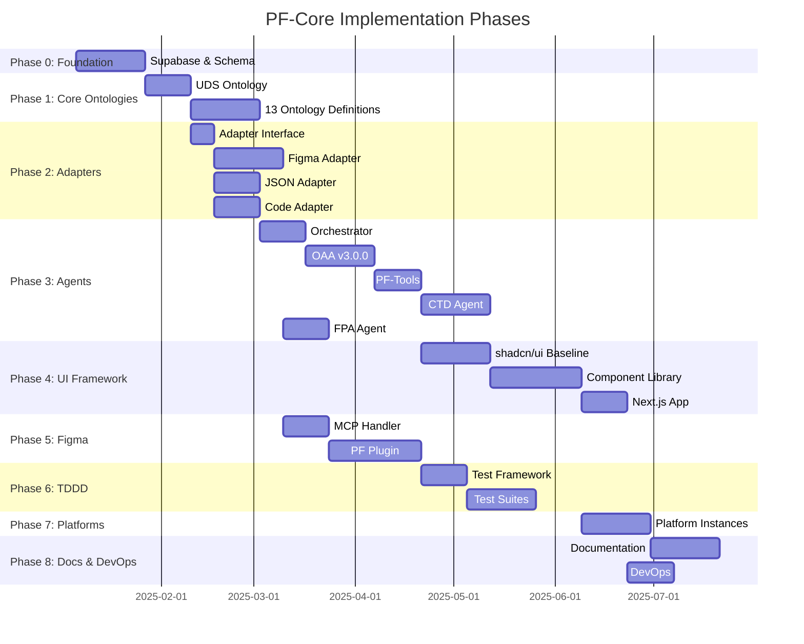

# Work Breakdown Structure (WBS)
## PF-Core Design Intelligence Platform

| | |
|---|---|
| **Document** | WBS-PF-Core-v1.0.0 |
| **Source PRD** | PRD-PF-Core-v1.6.1-APPROVED |
| **Source PBS** | PBS-PF-Core-v1.0.0 |
| **Generated By** | WBS Generator Agent |
| **Date** | November 28, 2025 |
| **Status** | Generated |

---

## 1. WBS Overview

### 1.1 Purpose

This Work Breakdown Structure transforms the PBS deliverables into actionable work packages with effort estimates, dependencies, resource requirements, and scheduling information.

### 1.2 Estimation Methodology

**Three-Point Estimation (PERT):**
- **O** = Optimistic estimate
- **M** = Most likely estimate  
- **P** = Pessimistic estimate
- **E** = Expected = (O + 4M + P) / 6

### 1.3 Effort Units

All effort estimates are in **person-hours** unless otherwise specified.

---

## 2. WBS Summary

### 2.1 Phase Overview



### 2.2 Effort Summary

| Phase | Description | Effort (Hours) | Duration (Weeks) |
|-------|-------------|----------------|------------------|
| Phase 0 | Foundation | 240 | 3 |
| Phase 1 | Core Ontologies | 400 | 5 |
| Phase 2 | Adapters | 480 | 4 |
| Phase 3 | Agents | 640 | 7 |
| Phase 4 | UI Framework | 560 | 6 |
| Phase 5 | Figma Integration | 400 | 5 |
| Phase 6 | TDDD Framework | 320 | 4 |
| Phase 7 | Platform Instances | 240 | 3 |
| Phase 8 | Docs & DevOps | 320 | 4 |
| **Total** | | **3,600** | **23** |

---

## 3. Detailed Work Packages

### Phase 0: Foundation (PF.4)

#### WP-0.1: Supabase Setup (PF.4.1)

| Task ID | Task | O | M | P | E | Dependencies | Skills |
|---------|------|---|---|---|---|--------------|--------|
| T-0.1.1 | Create Supabase project | 2 | 4 | 8 | 4 | - | DevOps |
| T-0.1.2 | Configure authentication | 4 | 8 | 16 | 9 | T-0.1.1 | DevOps, Security |
| T-0.1.3 | Set up Row Level Security | 8 | 16 | 24 | 16 | T-0.1.2 | Security |
| T-0.1.4 | Configure Edge Functions | 4 | 8 | 16 | 9 | T-0.1.1 | DevOps |
| **Subtotal** | | | | | **38** | | |

#### WP-0.2: JSONB Schema (PF.4.2)

| Task ID | Task | O | M | P | E | Dependencies | Skills |
|---------|------|---|---|---|---|--------------|--------|
| T-0.2.1 | Design ontologies table | 4 | 8 | 12 | 8 | T-0.1.1 | Database |
| T-0.2.2 | Design entities table | 4 | 8 | 12 | 8 | T-0.2.1 | Database |
| T-0.2.3 | Design mappings table | 2 | 4 | 8 | 4 | T-0.2.1 | Database |
| T-0.2.4 | Design audit_log table | 2 | 4 | 8 | 4 | T-0.2.1 | Database |
| T-0.2.5 | Create GIN indexes | 4 | 8 | 12 | 8 | T-0.2.2 | Database |
| T-0.2.6 | Write migrations | 8 | 16 | 24 | 16 | T-0.2.5 | Database |
| T-0.2.7 | Test schema performance | 8 | 16 | 32 | 17 | T-0.2.6 | Database, QA |
| **Subtotal** | | | | | **65** | | |

**Phase 0 Total: 103 hours (~2.5 weeks)**

---

### Phase 1: Core Ontologies (PF.3)

#### WP-1.1: UDS Ontology #0 (PF.3.1.0)

| Task ID | Task | O | M | P | E | Dependencies | Skills |
|---------|------|---|---|---|---|--------------|--------|
| T-1.1.1 | Define core entities schema | 16 | 24 | 40 | 25 | WP-0.2 | Ontology |
| T-1.1.2 | Define relationships | 8 | 16 | 24 | 16 | T-1.1.1 | Ontology |
| T-1.1.3 | Define validation rules | 8 | 16 | 24 | 16 | T-1.1.1 | Ontology |
| T-1.1.4 | Implement version management | 8 | 12 | 20 | 13 | T-1.1.1 | Ontology |
| T-1.1.5 | Write TDDD tests | 8 | 16 | 24 | 16 | T-1.1.3 | QA |
| **Subtotal** | | | | | **86** | | |

#### WP-1.2: PF-Core Ontology #1 (PF.3.1.1)

| Task ID | Task | O | M | P | E | Dependencies | Skills |
|---------|------|---|---|---|---|--------------|--------|
| T-1.2.1 | Define master schema | 8 | 16 | 24 | 16 | T-1.1.1 | Ontology |
| T-1.2.2 | Define inheritance rules | 8 | 12 | 20 | 13 | T-1.2.1 | Ontology |
| T-1.2.3 | Link to shadcn/ui baseline | 4 | 8 | 16 | 9 | T-1.2.1 | Ontology |
| T-1.2.4 | Write TDDD tests | 4 | 8 | 12 | 8 | T-1.2.2 | QA |
| **Subtotal** | | | | | **46** | | |

#### WP-1.3: Remaining Ontologies #2-12 (PF.3.2 - PF.3.5)

| Task ID | Task | O | M | P | E | Dependencies | Skills |
|---------|------|---|---|---|---|--------------|--------|
| T-1.3.1 | Design Token Ontology (#2) | 8 | 16 | 24 | 16 | T-1.2.1 | Ontology |
| T-1.3.2 | shadcn/ui Component Ontology (#3) | 16 | 24 | 40 | 25 | T-1.3.1 | Ontology |
| T-1.3.3 | Module Pattern Ontology (#4) | 8 | 12 | 20 | 13 | T-1.3.2 | Ontology |
| T-1.3.4 | Workflow Ontology (#5) | 8 | 12 | 20 | 13 | T-1.3.3 | Ontology |
| T-1.3.5 | Platform Instance Ontology (#6) | 8 | 12 | 16 | 12 | T-1.2.2 | Ontology |
| T-1.3.6 | Client Whitelabel Ontology (#7) | 8 | 12 | 16 | 12 | T-1.3.5 | Ontology |
| T-1.3.7 | Application Instance Ontology (#8) | 8 | 12 | 16 | 12 | T-1.3.6 | Ontology |
| T-1.3.8 | Figma Integration Ontology (#9) | 8 | 16 | 24 | 16 | T-1.3.2 | Ontology |
| T-1.3.9 | Claude Code Ontology (#10) | 8 | 16 | 24 | 16 | T-1.3.2 | Ontology |
| T-1.3.10 | Code Connect Ontology (#11) | 4 | 8 | 12 | 8 | T-1.3.8 | Ontology |
| T-1.3.11 | Code-to-Design Ontology (#12) | 8 | 16 | 24 | 16 | T-1.3.9 | Ontology |
| T-1.3.12 | Cross-ontology validation | 16 | 24 | 40 | 25 | T-1.3.11 | Ontology, QA |
| **Subtotal** | | | | | **184** | | |

**Phase 1 Total: 316 hours (~8 weeks)**

---

### Phase 2: Adapters (PF.1.2)

#### WP-2.1: Adapter Interface (PF.1.2.1)

| Task ID | Task | O | M | P | E | Dependencies | Skills |
|---------|------|---|---|---|---|--------------|--------|
| T-2.1.1 | Design IDesignSystemAdapter | 8 | 12 | 20 | 13 | WP-1.1 | TypeScript |
| T-2.1.2 | Define import/export methods | 4 | 8 | 12 | 8 | T-2.1.1 | TypeScript |
| T-2.1.3 | Define validation methods | 4 | 8 | 12 | 8 | T-2.1.1 | TypeScript |
| T-2.1.4 | Implement Adapter Manager | 8 | 16 | 24 | 16 | T-2.1.2 | TypeScript |
| T-2.1.5 | Write unit tests | 4 | 8 | 12 | 8 | T-2.1.4 | QA |
| **Subtotal** | | | | | **53** | | |

#### WP-2.2: Figma Adapter (PF.1.2.2)

| Task ID | Task | O | M | P | E | Dependencies | Skills |
|---------|------|---|---|---|---|--------------|--------|
| T-2.2.1 | Implement import operations | 16 | 24 | 40 | 25 | T-2.1.4 | TypeScript, Figma |
| T-2.2.2 | Implement export operations | 16 | 24 | 40 | 25 | T-2.2.1 | TypeScript, Figma |
| T-2.2.3 | Implement validation | 8 | 16 | 24 | 16 | T-2.2.2 | TypeScript |
| T-2.2.4 | Implement diff/merge | 8 | 16 | 24 | 16 | T-2.2.2 | TypeScript |
| T-2.2.5 | Integration tests | 8 | 16 | 24 | 16 | T-2.2.4 | QA |
| **Subtotal** | | | | | **98** | | |

#### WP-2.3: JSON Adapter (PF.1.2.3)

| Task ID | Task | O | M | P | E | Dependencies | Skills |
|---------|------|---|---|---|---|--------------|--------|
| T-2.3.1 | Implement JSON import | 8 | 12 | 20 | 13 | T-2.1.4 | TypeScript |
| T-2.3.2 | Implement YAML import | 4 | 8 | 12 | 8 | T-2.3.1 | TypeScript |
| T-2.3.3 | Implement export formats | 8 | 12 | 20 | 13 | T-2.3.1 | TypeScript |
| T-2.3.4 | Implement validation | 4 | 8 | 12 | 8 | T-2.3.3 | TypeScript |
| T-2.3.5 | Unit tests | 4 | 8 | 12 | 8 | T-2.3.4 | QA |
| **Subtotal** | | | | | **50** | | |

#### WP-2.4: Code Adapter (PF.1.2.4)

| Task ID | Task | O | M | P | E | Dependencies | Skills |
|---------|------|---|---|---|---|--------------|--------|
| T-2.4.1 | Implement AST parser | 16 | 24 | 40 | 25 | T-2.1.4 | TypeScript, AST |
| T-2.4.2 | Implement token extractor | 8 | 16 | 24 | 16 | T-2.4.1 | TypeScript |
| T-2.4.3 | Implement component mapper | 8 | 16 | 24 | 16 | T-2.4.2 | TypeScript |
| T-2.4.4 | shadcn/ui specific parsing | 8 | 12 | 20 | 13 | T-2.4.3 | TypeScript |
| T-2.4.5 | Unit tests | 8 | 12 | 20 | 13 | T-2.4.4 | QA |
| **Subtotal** | | | | | **83** | | |

**Phase 2 Total: 284 hours (~7 weeks)**

---

### Phase 3: Agents (PF.2)

#### WP-3.1: Orchestrator Agent (PF.2.1)

| Task ID | Task | O | M | P | E | Dependencies | Skills |
|---------|------|---|---|---|---|--------------|--------|
| T-3.1.1 | Design task router | 8 | 16 | 24 | 16 | WP-1.3 | Agent Design |
| T-3.1.2 | Implement context manager | 8 | 16 | 24 | 16 | T-3.1.1 | TypeScript |
| T-3.1.3 | Implement error handler | 8 | 12 | 20 | 13 | T-3.1.2 | TypeScript |
| T-3.1.4 | Implement message protocol | 8 | 16 | 24 | 16 | T-3.1.1 | TypeScript |
| T-3.1.5 | Unit tests | 8 | 12 | 20 | 13 | T-3.1.4 | QA |
| **Subtotal** | | | | | **74** | | |

#### WP-3.2: OAA v3.0.0 (PF.2.2)

| Task ID | Task | O | M | P | E | Dependencies | Skills |
|---------|------|---|---|---|---|--------------|--------|
| T-3.2.1 | Implement CRUD operations | 16 | 24 | 40 | 25 | T-3.1.4 | TypeScript, Ontology |
| T-3.2.2 | Implement schema validation | 8 | 16 | 24 | 16 | T-3.2.1 | TypeScript |
| T-3.2.3 | Implement cross-reference checker | 8 | 16 | 24 | 16 | T-3.2.1 | TypeScript |
| T-3.2.4 | Implement version controller | 8 | 12 | 20 | 13 | T-3.2.1 | TypeScript |
| T-3.2.5 | Implement rollback manager | 8 | 16 | 24 | 16 | T-3.2.4 | TypeScript |
| T-3.2.6 | Integration tests | 8 | 16 | 24 | 16 | T-3.2.5 | QA |
| **Subtotal** | | | | | **102** | | |

#### WP-3.3: PF-Tools Utilities (PF.2.3)

| Task ID | Task | O | M | P | E | Dependencies | Skills |
|---------|------|---|---|---|---|--------------|--------|
| T-3.3.1 | Implement Token Resolver | 16 | 24 | 32 | 24 | T-3.2.1 | TypeScript |
| T-3.3.2 | Implement Component Validator | 8 | 16 | 24 | 16 | T-3.3.1 | TypeScript |
| T-3.3.3 | Implement Module Assembler | 8 | 12 | 20 | 13 | T-3.3.2 | TypeScript |
| T-3.3.4 | Implement Audit Logger | 4 | 8 | 12 | 8 | T-3.2.1 | TypeScript |
| T-3.3.5 | Implement Supabase Client wrapper | 8 | 12 | 20 | 13 | WP-0.1 | TypeScript |
| T-3.3.6 | Unit tests | 8 | 16 | 24 | 16 | T-3.3.4 | QA |
| **Subtotal** | | | | | **90** | | |

#### WP-3.4: CTD Agent (PF.2.4)

| Task ID | Task | O | M | P | E | Dependencies | Skills |
|---------|------|---|---|---|---|--------------|--------|
| T-3.4.1 | Implement source parser | 16 | 24 | 40 | 25 | WP-2.4 | TypeScript, AST |
| T-3.4.2 | Implement token extractor | 8 | 16 | 24 | 16 | T-3.4.1 | TypeScript |
| T-3.4.3 | Implement variant analyzer | 8 | 12 | 20 | 13 | T-3.4.2 | TypeScript |
| T-3.4.4 | Implement Figma spec generator | 16 | 24 | 40 | 25 | T-3.4.3 | TypeScript |
| T-3.4.5 | Implement test generator | 8 | 12 | 20 | 13 | T-3.4.4 | TypeScript |
| T-3.4.6 | Integration tests | 8 | 16 | 24 | 16 | T-3.4.5 | QA |
| **Subtotal** | | | | | **108** | | |

#### WP-3.5: FPA Agent (PF.2.5)

| Task ID | Task | O | M | P | E | Dependencies | Skills |
|---------|------|---|---|---|---|--------------|--------|
| T-3.5.1 | Implement component creator | 16 | 24 | 32 | 24 | WP-5.2 | TypeScript, Figma |
| T-3.5.2 | Implement variable creator | 8 | 12 | 20 | 13 | T-3.5.1 | TypeScript |
| T-3.5.3 | Implement style creator | 8 | 12 | 20 | 13 | T-3.5.1 | TypeScript |
| T-3.5.4 | Implement component updater | 8 | 12 | 16 | 12 | T-3.5.1 | TypeScript |
| T-3.5.5 | Implement Code Connect linker | 4 | 8 | 12 | 8 | T-3.5.1 | TypeScript |
| T-3.5.6 | Integration tests | 8 | 12 | 20 | 13 | T-3.5.5 | QA |
| **Subtotal** | | | | | **83** | | |

**Phase 3 Total: 457 hours (~11 weeks)**

---

### Phase 4: UI Framework (PF.5)

#### WP-4.1: shadcn/ui Baseline (PF.5.1)

| Task ID | Task | O | M | P | E | Dependencies | Skills |
|---------|------|---|---|---|---|--------------|--------|
| T-4.1.1 | Extract color tokens | 8 | 12 | 20 | 13 | WP-2.4 | TypeScript |
| T-4.1.2 | Extract spacing tokens | 4 | 8 | 12 | 8 | T-4.1.1 | TypeScript |
| T-4.1.3 | Extract typography tokens | 4 | 8 | 12 | 8 | T-4.1.1 | TypeScript |
| T-4.1.4 | Extract radius tokens | 2 | 4 | 8 | 4 | T-4.1.1 | TypeScript |
| T-4.1.5 | Extract atoms (12 components) | 24 | 36 | 48 | 36 | T-4.1.4 | TypeScript |
| T-4.1.6 | Extract molecules (30 components) | 48 | 72 | 96 | 72 | T-4.1.5 | TypeScript |
| T-4.1.7 | Extract organisms (5 components) | 8 | 16 | 24 | 16 | T-4.1.6 | TypeScript |
| T-4.1.8 | Convert to UDS format | 16 | 24 | 40 | 25 | T-4.1.7 | TypeScript |
| T-4.1.9 | Validation tests | 8 | 16 | 24 | 16 | T-4.1.8 | QA |
| **Subtotal** | | | | | **198** | | |

#### WP-4.2: Component Library (PF.5.2)

| Task ID | Task | O | M | P | E | Dependencies | Skills |
|---------|------|---|---|---|---|--------------|--------|
| T-4.2.1 | Build base components | 24 | 40 | 56 | 40 | T-4.1.8 | React |
| T-4.2.2 | Build composite components | 16 | 24 | 40 | 25 | T-4.2.1 | React |
| T-4.2.3 | Build pattern components | 16 | 24 | 40 | 25 | T-4.2.2 | React |
| T-4.2.4 | Build module components | 16 | 24 | 32 | 24 | T-4.2.3 | React |
| T-4.2.5 | Component tests | 16 | 24 | 40 | 25 | T-4.2.4 | QA |
| **Subtotal** | | | | | **139** | | |

#### WP-4.3: Next.js Application (PF.5.3)

| Task ID | Task | O | M | P | E | Dependencies | Skills |
|---------|------|---|---|---|---|--------------|--------|
| T-4.3.1 | Set up App Router | 4 | 8 | 12 | 8 | T-4.2.4 | Next.js |
| T-4.3.2 | Build API routes | 16 | 24 | 40 | 25 | T-4.3.1 | Next.js |
| T-4.3.3 | Implement middleware | 8 | 12 | 20 | 13 | T-4.3.2 | Next.js |
| T-4.3.4 | Configuration | 4 | 8 | 12 | 8 | T-4.3.3 | Next.js |
| T-4.3.5 | Integration tests | 8 | 12 | 20 | 13 | T-4.3.4 | QA |
| **Subtotal** | | | | | **67** | | |

**Phase 4 Total: 404 hours (~10 weeks)**

---

### Phase 5: Figma Integration (PF.6)

#### WP-5.1: MCP Handler (PF.6.1)

| Task ID | Task | O | M | P | E | Dependencies | Skills |
|---------|------|---|---|---|---|--------------|--------|
| T-5.1.1 | get_design_context handler | 8 | 16 | 24 | 16 | WP-2.2 | TypeScript |
| T-5.1.2 | get_variable_defs handler | 8 | 12 | 20 | 13 | T-5.1.1 | TypeScript |
| T-5.1.3 | get_code_connect_map handler | 4 | 8 | 12 | 8 | T-5.1.1 | TypeScript |
| T-5.1.4 | create_design_system_rules handler | 8 | 12 | 20 | 13 | T-5.1.1 | TypeScript |
| T-5.1.5 | get_metadata handler | 4 | 8 | 12 | 8 | T-5.1.1 | TypeScript |
| T-5.1.6 | Integration tests | 8 | 16 | 24 | 16 | T-5.1.5 | QA |
| **Subtotal** | | | | | **74** | | |

#### WP-5.2: PF Figma Plugin (PF.6.2)

| Task ID | Task | O | M | P | E | Dependencies | Skills |
|---------|------|---|---|---|---|--------------|--------|
| T-5.2.1 | Create plugin manifest | 2 | 4 | 8 | 4 | - | Figma Plugin |
| T-5.2.2 | Build plugin UI | 16 | 24 | 40 | 25 | T-5.2.1 | React, Figma |
| T-5.2.3 | Implement API client | 8 | 16 | 24 | 16 | T-5.2.1 | TypeScript |
| T-5.2.4 | Implement createComponent | 16 | 24 | 40 | 25 | T-5.2.3 | Figma Plugin |
| T-5.2.5 | Implement createVariables | 8 | 12 | 20 | 13 | T-5.2.4 | Figma Plugin |
| T-5.2.6 | Implement createStyles | 8 | 12 | 20 | 13 | T-5.2.4 | Figma Plugin |
| T-5.2.7 | Implement updateComponent | 8 | 12 | 16 | 12 | T-5.2.4 | Figma Plugin |
| T-5.2.8 | Implement linkCodeConnect | 4 | 8 | 12 | 8 | T-5.2.4 | Figma Plugin |
| T-5.2.9 | Implement authentication | 8 | 12 | 20 | 13 | T-5.2.3 | OAuth |
| T-5.2.10 | Plugin tests | 8 | 16 | 24 | 16 | T-5.2.9 | QA |
| **Subtotal** | | | | | **145** | | |

**Phase 5 Total: 219 hours (~5.5 weeks)**

---

### Phase 6: TDDD Framework (PF.7)

#### WP-6.1: Test Runner (PF.7.1)

| Task ID | Task | O | M | P | E | Dependencies | Skills |
|---------|------|---|---|---|---|--------------|--------|
| T-6.1.1 | Design test runner | 8 | 12 | 20 | 13 | WP-3.3 | TypeScript |
| T-6.1.2 | Design test runner | 8 | 16 | 24 | 16 | T-6.1.1 | TypeScript |
| T-6.1.3 | Code test runner | 8 | 12 | 20 | 13 | T-6.1.1 | TypeScript |
| T-6.1.4 | Integration test runner | 8 | 12 | 20 | 13 | T-6.1.2 | TypeScript |
| T-6.1.5 | Visual regression runner | 8 | 16 | 24 | 16 | T-6.1.4 | TypeScript |
| T-6.1.6 | Unit tests | 4 | 8 | 12 | 8 | T-6.1.5 | QA |
| **Subtotal** | | | | | **79** | | |

#### WP-6.2: Test Suites (PF.7.2)

| Task ID | Task | O | M | P | E | Dependencies | Skills |
|---------|------|---|---|---|---|--------------|--------|
| T-6.2.1 | Design hypothesis tests | 16 | 24 | 40 | 25 | T-6.1.2 | QA |
| T-6.2.2 | Design compliance tests | 16 | 24 | 40 | 25 | T-6.2.1 | QA |
| T-6.2.3 | Unit test templates | 8 | 12 | 20 | 13 | T-6.1.3 | QA |
| T-6.2.4 | Integration test templates | 8 | 12 | 20 | 13 | T-6.1.4 | QA |
| T-6.2.5 | Cross-validation tests | 8 | 16 | 24 | 16 | T-6.2.4 | QA |
| **Subtotal** | | | | | **92** | | |

#### WP-6.3: 3+3+3 Pattern (PF.7.3)

| Task ID | Task | O | M | P | E | Dependencies | Skills |
|---------|------|---|---|---|---|--------------|--------|
| T-6.3.1 | Good record templates | 4 | 8 | 12 | 8 | T-6.2.1 | QA |
| T-6.3.2 | Bad record templates | 4 | 8 | 12 | 8 | T-6.3.1 | QA |
| T-6.3.3 | Anti-pattern templates | 4 | 8 | 12 | 8 | T-6.3.2 | QA |
| T-6.3.4 | Documentation | 4 | 8 | 12 | 8 | T-6.3.3 | Technical Writing |
| **Subtotal** | | | | | **32** | | |

#### WP-6.4: Reporters (PF.7.4)

| Task ID | Task | O | M | P | E | Dependencies | Skills |
|---------|------|---|---|---|---|--------------|--------|
| T-6.4.1 | Console reporter | 4 | 8 | 12 | 8 | T-6.1.5 | TypeScript |
| T-6.4.2 | JSON reporter | 4 | 8 | 12 | 8 | T-6.4.1 | TypeScript |
| T-6.4.3 | CI/CD reporter | 8 | 12 | 20 | 13 | T-6.4.2 | TypeScript |
| T-6.4.4 | Tests | 4 | 8 | 12 | 8 | T-6.4.3 | QA |
| **Subtotal** | | | | | **37** | | |

**Phase 6 Total: 240 hours (~6 weeks)**

---

### Phase 7: Platform Instances (PF.8)

#### WP-7.1: Platform Instance Templates

| Task ID | Task | O | M | P | E | Dependencies | Skills |
|---------|------|---|---|---|---|--------------|--------|
| T-7.1.1 | BAIV configuration | 16 | 24 | 32 | 24 | WP-4.2 | Config |
| T-7.1.2 | AIR configuration | 16 | 24 | 32 | 24 | T-7.1.1 | Config |
| T-7.1.3 | W4M configuration | 16 | 24 | 32 | 24 | T-7.1.1 | Config |
| T-7.1.4 | DJM configuration | 16 | 24 | 32 | 24 | T-7.1.1 | Config |
| T-7.1.5 | Client whitelabel template | 8 | 16 | 24 | 16 | T-7.1.4 | Config |
| T-7.1.6 | Application instance template | 8 | 16 | 24 | 16 | T-7.1.5 | Config |
| T-7.1.7 | Validation tests | 8 | 16 | 24 | 16 | T-7.1.6 | QA |
| **Subtotal** | | | | | **144** | | |

**Phase 7 Total: 144 hours (~3.5 weeks)**

---

### Phase 8: Documentation & DevOps (PF.9, PF.10)

#### WP-8.1: Technical Documentation (PF.9.1)

| Task ID | Task | O | M | P | E | Dependencies | Skills |
|---------|------|---|---|---|---|--------------|--------|
| T-8.1.1 | Architecture guide | 16 | 24 | 40 | 25 | Phase 7 | Tech Writing |
| T-8.1.2 | API reference | 16 | 24 | 32 | 24 | T-8.1.1 | Tech Writing |
| T-8.1.3 | Ontology reference | 8 | 16 | 24 | 16 | T-8.1.1 | Tech Writing |
| T-8.1.4 | Integration guide | 8 | 16 | 24 | 16 | T-8.1.2 | Tech Writing |
| T-8.1.5 | Deployment guide | 8 | 12 | 20 | 13 | T-8.1.4 | Tech Writing |
| **Subtotal** | | | | | **94** | | |

#### WP-8.2: User Documentation (PF.9.2)

| Task ID | Task | O | M | P | E | Dependencies | Skills |
|---------|------|---|---|---|---|--------------|--------|
| T-8.2.1 | Getting started guide | 8 | 12 | 20 | 13 | T-8.1.1 | Tech Writing |
| T-8.2.2 | Designer guide | 8 | 16 | 24 | 16 | T-8.2.1 | Tech Writing |
| T-8.2.3 | Developer guide | 8 | 16 | 24 | 16 | T-8.2.1 | Tech Writing |
| T-8.2.4 | Admin guide | 8 | 12 | 20 | 13 | T-8.2.3 | Tech Writing |
| T-8.2.5 | Troubleshooting guide | 4 | 8 | 12 | 8 | T-8.2.4 | Tech Writing |
| **Subtotal** | | | | | **66** | | |

#### WP-8.3: DevOps (PF.10)

| Task ID | Task | O | M | P | E | Dependencies | Skills |
|---------|------|---|---|---|---|--------------|--------|
| T-8.3.1 | GitHub Actions workflows | 8 | 16 | 24 | 16 | WP-4.3 | DevOps |
| T-8.3.2 | Build configuration | 4 | 8 | 12 | 8 | T-8.3.1 | DevOps |
| T-8.3.3 | Test automation | 8 | 12 | 20 | 13 | T-8.3.2 | DevOps |
| T-8.3.4 | Deployment scripts | 8 | 12 | 20 | 13 | T-8.3.3 | DevOps |
| T-8.3.5 | Monitoring setup | 8 | 16 | 24 | 16 | T-8.3.4 | DevOps |
| T-8.3.6 | Security configuration | 8 | 12 | 20 | 13 | T-8.3.5 | Security |
| **Subtotal** | | | | | **79** | | |

**Phase 8 Total: 239 hours (~6 weeks)**

---

## 4. WBS Summary

### 4.1 Total Effort by Phase

| Phase | Work Packages | Tasks | Hours | Weeks |
|-------|---------------|-------|-------|-------|
| Phase 0: Foundation | 2 | 14 | 103 | 2.5 |
| Phase 1: Core Ontologies | 3 | 17 | 316 | 8 |
| Phase 2: Adapters | 4 | 20 | 284 | 7 |
| Phase 3: Agents | 5 | 30 | 457 | 11 |
| Phase 4: UI Framework | 3 | 18 | 404 | 10 |
| Phase 5: Figma Integration | 2 | 16 | 219 | 5.5 |
| Phase 6: TDDD Framework | 4 | 18 | 240 | 6 |
| Phase 7: Platform Instances | 1 | 7 | 144 | 3.5 |
| Phase 8: Docs & DevOps | 3 | 16 | 239 | 6 |
| **Total** | **27** | **156** | **2,406** | **~23** |

### 4.2 Resource Requirements

| Skill | Hours Required | FTE Equivalent |
|-------|----------------|----------------|
| TypeScript/React | 1,200 | 1.5 |
| Ontology Design | 400 | 0.5 |
| Figma/Plugin | 350 | 0.4 |
| DevOps | 200 | 0.25 |
| QA/Testing | 400 | 0.5 |
| Technical Writing | 200 | 0.25 |
| **Total** | **2,750** | **~3.4** |

### 4.3 Critical Path

```
WP-0.2 → WP-1.1 → WP-1.2 → WP-2.1 → WP-3.1 → WP-3.2 → WP-3.3 → WP-4.1 → WP-4.2 → WP-7.1
```

**Critical Path Duration: ~20 weeks**

---

## 5. Risk-Adjusted Timeline

| Scenario | Duration | Confidence |
|----------|----------|------------|
| Optimistic | 18 weeks | 10% |
| Most Likely | 23 weeks | 60% |
| Pessimistic | 30 weeks | 30% |
| **Expected** | **24 weeks** | - |

---

## 6. Next Steps

1. ✅ PRD Approved (v1.6.1)
2. ✅ PBS Generated (v1.0.0)
3. ✅ WBS Generated (v1.0.0)
4. ⏳ **Resource Allocation** - Assign team members to work packages
5. ⏳ **Sprint Planning** - Break WBS into 2-week sprints
6. ⏳ **Kickoff** - Begin Phase 0: Foundation

---

*End of WBS Document*
*Generated by WBS Generator Agent*
