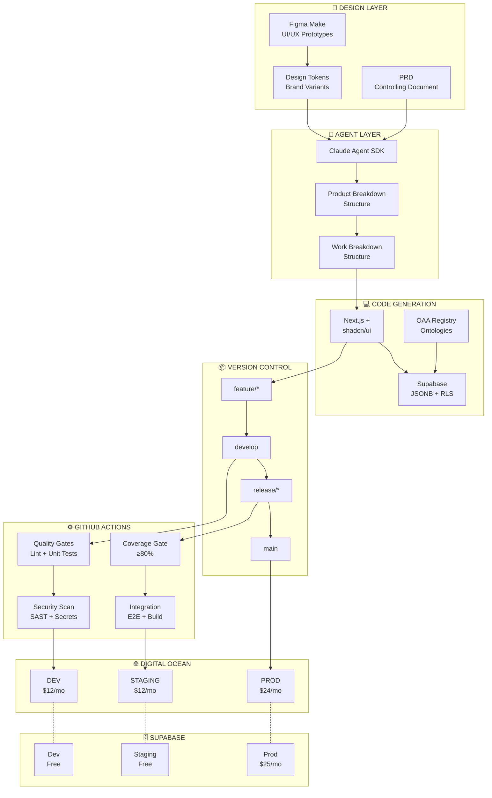

# PF-CORE MVP CI/CD Architecture & Deployment Strategy

**Low-Cost Staged Environment for Agentic Platform Development**

---

| Field | Value |
|-------|-------|
| **Document Version** | 1.0.0 |
| **Date** | November 2025 |
| **Platform** | BAIV Agentic Platform - Platform Foundation Core |
| **Target Stack** | Next.js + shadcn/ui \| Supabase \| Claude Agent SDK \| Figma Make |
| **Monthly Budget** | **$73/month (all environments)** |

---

## Table of Contents

1. [Executive Summary](#1-executive-summary)
2. [Cost Analysis & Budget](#2-cost-analysis--budget)
3. [Environment Architecture](#3-environment-architecture)
4. [Agentic Workflow Integration](#4-agentic-workflow-integration)
5. [GitHub Actions Pipeline Specification](#5-github-actions-pipeline-specification)
6. [Digital Ocean Droplet Configuration](#6-digital-ocean-droplet-configuration)
7. [Secrets & Security Configuration](#7-secrets--security-configuration)
8. [Implementation Checklist](#8-implementation-checklist)
9. [Success Metrics & KPIs](#9-success-metrics--kpis)

---

## 1. Executive Summary

This document defines a **low-cost, repeatable CI/CD architecture** for PF-CORE MVP development. The architecture enables staged deployments across Development, Staging, and Production environments using GitHub Actions with Digital Ocean Droplets, optimized for cost-efficiency while proving agentic development benefits.

### 1.1 Strategic Objectives

- **Prove Agentic Value:** Validate Claude Agent SDK-driven development workflow from PRD → PBS/WBS → Code
- **Multi-Tenant Readiness:** Support multiple PF-CORE variants with brand-specific design tokens
- **TDD Enforcement:** Mandatory 80%+ test coverage gates before promotion
- **Cost Optimization:** Total infrastructure cost under $75/month for all environments

### 1.2 Architecture Assumptions

The following components are external to this deliverable scope but integrated:

1. **Design System:** Figma Make with platform brand variants and design tokens pre-configured
2. **OAA Registry:** Ontology Architect Agent managing all schema.org-grounded ontologies
3. **PF Tools:** Reusable platform tooling for agent orchestration
4. **PRD as Control:** Product Requirements Documents serve as controlling specifications for agent execution

---

## 2. Cost Analysis & Budget

Following GitHub's MVP optimization strategies, this architecture maximizes free tier usage while maintaining professional staging capabilities.

### 2.1 Monthly Cost Breakdown

| Component | Tier | Spec | Cost/mo |
|-----------|------|------|---------|
| Digital Ocean DEV Droplet | Basic | 1 vCPU, 2GB | $12 |
| Digital Ocean STAGING Droplet | Basic | 1 vCPU, 2GB | $12 |
| Digital Ocean PROD Droplet | Regular | 2 vCPU, 4GB | $24 |
| Supabase DEV Project | Free | 500MB DB | $0 |
| Supabase STAGING Project | Free | 500MB DB | $0 |
| Supabase PROD Project | Pro | 8GB DB | $25 |
| GitHub Actions | Free | 2000 min/mo | $0 |
| GitHub Container Registry | Free | 500MB | $0 |
| **TOTAL MONTHLY COST** | | | **$73** |

### 2.2 Free Tier Optimization Strategies

Per GitHub's MVP CI/CD Guide, implement the following optimizations:

1. **Path-Based Triggers:** Only run CI on `src/**`, `tests/**` changes; ignore `docs/**`, `*.md`
2. **Aggressive Caching:** Cache npm, node_modules, .next/cache, Docker layers
3. **Conditional Execution:** Full test suite only on main branch or `[full-ci]` commits
4. **Concurrency Control:** Cancel redundant workflows when new commits pushed

---

## 3. Environment Architecture

### 3.1 Three-Stage Environment Model

Each environment maintains isolated infrastructure while sharing the same codebase and deployment pipeline.

| Aspect | DEV | STAGING | PRODUCTION |
|--------|-----|---------|------------|
| **Branch** | develop | release/* | main + tags |
| **Deploy** | Auto on merge | Auto on merge | **Manual gate** |
| **URL** | dev.pf-core.app | staging.pf-core.app | app.pf-core.app |
| **Tests** | Unit + Lint | Full Suite + E2E | Smoke Tests |
| **Coverage** | Report only | **≥80% gate** | Verified |

### 3.2 Git Branching Strategy

Follows GitHub Flow with release branches for staging validation:

- **feature/* → develop:** Feature development with PR review and unit tests
- **develop → release/*:** Release candidate preparation with full test suite
- **release/* → main:** Production deployment with manual approval gate
- **hotfix/* → main:** Emergency fixes with expedited pipeline

### 3.3 Architecture Diagram



---

## 4. Agentic Workflow Integration

The CI/CD pipeline integrates with the Claude Agent SDK-driven development workflow where PRDs serve as controlling documents for agent execution.

### 4.1 Agent-Driven Development Flow

The platform implements a cascading translation pattern:

1. **Figma Make → Design Tokens:** UI/UX prototypes export design tokens and component specifications
2. **PRD + Design → PBS:** Product Breakdown Structure generated from PRD requirements
3. **PBS → WBS:** Work Breakdown Structure with task assignments and dependencies
4. **WBS → Code:** Claude Agent SDK translates tasks into Next.js + shadcn/ui components
5. **Code → Supabase:** Database schema generation with JSONB storage and RLS policies

### 4.2 Design Token Integration

The design system supports multiple PF-CORE variants through brand-specific tokens:

- **Token Location:** `/tokens/{brand}/design-tokens.json`
- **Build Integration:** Tokens compiled to CSS variables at build time
- **Runtime Theming:** CSS custom properties enable tenant-specific branding
- **shadcn/ui Override:** Components consume tokens via Tailwind CSS configuration

### 4.3 Ontology Validation in Pipeline

All schema changes are validated against OAA Registry v3.0 standards:

- **Pre-commit:** JSON-LD syntax validation
- **CI Stage:** Schema.org grounding verification
- **Staging Gate:** OAA Registry compliance check

---

## 5. GitHub Actions Pipeline Specification

### 5.1 Workflow Philosophy

Following GitHub's MVP principle of **"Fast Feedback > Complete Coverage"**, the pipeline is structured in progressive stages:

| Stage | Trigger | Actions | Duration |
|-------|---------|---------|----------|
| **Quality Gates** | Every commit | Lint, Format, Unit Tests | < 3 min |
| **Security** | Every commit | SAST, Secrets, Deps | < 2 min |
| **Integration** | Pull Requests | Full tests, Build, Docker | < 8 min |
| **Deploy DEV** | develop merge | Build, Push, Deploy | < 5 min |
| **Deploy STAGING** | release/* merge | E2E + Deploy | < 10 min |
| **Deploy PROD** | Tag + Approval | Smoke Tests + Deploy | < 5 min |

### 5.2 Essential GitHub Actions

Free tier actions selected per GitHub's MVP recommendations:

- **actions/checkout@v4** — Repository checkout (essential)
- **actions/setup-node@v4** — Node.js runtime with npm caching
- **actions/cache@v3** — Dependencies, build artifacts, Docker layers
- **docker/build-push-action@v5** — Container builds with GHA cache
- **appleboy/ssh-action@v1** — SSH deployment to Droplets
- **github/codeql-action@v2** — SAST security scanning
- **codecov/codecov-action@v3** — Test coverage reporting

### 5.3 Complete Workflow File

```yaml
# =============================================================================
# PF-CORE MVP CI/CD Pipeline
# =============================================================================
name: PF-CORE MVP Pipeline

on:
  push:
    branches: [main, develop, 'release/*']
    paths:
      - 'src/**'
      - 'app/**'
      - 'components/**'
      - 'lib/**'
      - 'tests/**'
      - 'package*.json'
      - 'Dockerfile'
    paths-ignore:
      - 'docs/**'
      - '*.md'
  pull_request:
    branches: [main, develop]
  release:
    types: [published]

env:
  NODE_VERSION: '20'
  REGISTRY: ghcr.io
  IMAGE_NAME: ${{ github.repository }}

concurrency:
  group: ${{ github.workflow }}-${{ github.ref }}
  cancel-in-progress: true

jobs:
  # Stage 1: Quality Gates (< 3 minutes)
  quality-gates:
    name: Quality Gates
    runs-on: ubuntu-latest
    outputs:
      coverage: ${{ steps.coverage.outputs.percentage }}
    steps:
      - uses: actions/checkout@v4
      
      - name: Setup Node.js
        uses: actions/setup-node@v4
        with:
          node-version: ${{ env.NODE_VERSION }}
          cache: 'npm'
      
      - name: Cache node_modules
        uses: actions/cache@v3
        id: node-cache
        with:
          path: node_modules
          key: ${{ runner.os }}-node-${{ hashFiles('**/package-lock.json') }}
      
      - name: Install Dependencies
        if: steps.node-cache.outputs.cache-hit != 'true'
        run: npm ci
      
      - name: Lint & Format Check
        run: |
          npm run lint
          npm run format:check
      
      - name: Type Check
        run: npm run type-check
      
      - name: Unit Tests with Coverage
        run: npm run test:unit -- --coverage
      
      - name: Extract Coverage
        id: coverage
        run: |
          COVERAGE=$(cat coverage/coverage-summary.json | jq '.total.lines.pct')
          echo "percentage=$COVERAGE" >> $GITHUB_OUTPUT

  # Stage 2: Security Scan
  security:
    name: Security Scan
    runs-on: ubuntu-latest
    steps:
      - uses: actions/checkout@v4
      
      - name: Dependency Audit
        run: npm audit --audit-level=high
        continue-on-error: true
      
      - name: CodeQL Analysis
        uses: github/codeql-action/analyze@v2
        with:
          languages: javascript
      
      - name: Secret Scanning
        uses: trufflesecurity/trufflehog@main
        with:
          path: ./
          extra_args: --only-verified

  # Stage 3: Deploy DEV
  deploy-dev:
    name: Deploy DEV
    if: github.ref == 'refs/heads/develop'
    needs: [quality-gates, security]
    runs-on: ubuntu-latest
    environment:
      name: development
      url: https://dev.pf-core.app
    steps:
      - uses: actions/checkout@v4
      
      - name: Build and Push Image
        uses: docker/build-push-action@v5
        with:
          push: true
          tags: ${{ env.REGISTRY }}/${{ env.IMAGE_NAME }}:dev
          cache-from: type=gha
          cache-to: type=gha,mode=max
      
      - name: Deploy to Droplet
        uses: appleboy/ssh-action@v1.0.0
        with:
          host: ${{ secrets.DEV_HOST }}
          username: ${{ secrets.DEV_USER }}
          key: ${{ secrets.DEV_SSH_KEY }}
          script: |
            cd /app
            docker compose pull
            docker compose up -d

  # Stage 4: Deploy STAGING (with coverage gate)
  deploy-staging:
    name: Deploy STAGING
    if: startsWith(github.ref, 'refs/heads/release/')
    needs: [quality-gates, security]
    runs-on: ubuntu-latest
    environment:
      name: staging
      url: https://staging.pf-core.app
    steps:
      - name: Check Coverage Gate
        if: needs.quality-gates.outputs.coverage < 80
        run: |
          echo "❌ Coverage (${{ needs.quality-gates.outputs.coverage }}%) below 80%"
          exit 1
      
      - uses: actions/checkout@v4
      
      - name: Build and Push Image
        uses: docker/build-push-action@v5
        with:
          push: true
          tags: ${{ env.REGISTRY }}/${{ env.IMAGE_NAME }}:staging
          cache-from: type=gha
          cache-to: type=gha,mode=max
      
      - name: Deploy to Droplet
        uses: appleboy/ssh-action@v1.0.0
        with:
          host: ${{ secrets.STAGING_HOST }}
          username: ${{ secrets.STAGING_USER }}
          key: ${{ secrets.STAGING_SSH_KEY }}
          script: |
            cd /app
            docker compose pull
            docker compose up -d
      
      - name: E2E Tests
        run: npm run test:e2e:critical
        env:
          BASE_URL: https://staging.pf-core.app

  # Stage 5: Deploy PRODUCTION (manual gate)
  deploy-production:
    name: Deploy PRODUCTION
    if: github.event_name == 'release'
    needs: [quality-gates, security]
    runs-on: ubuntu-latest
    environment:
      name: production
      url: https://app.pf-core.app
    steps:
      - uses: actions/checkout@v4
      
      - name: Build and Push Image
        uses: docker/build-push-action@v5
        with:
          push: true
          tags: |
            ${{ env.REGISTRY }}/${{ env.IMAGE_NAME }}:latest
            ${{ env.REGISTRY }}/${{ env.IMAGE_NAME }}:${{ github.event.release.tag_name }}
      
      - name: Deploy to Droplet
        uses: appleboy/ssh-action@v1.0.0
        with:
          host: ${{ secrets.PROD_HOST }}
          username: ${{ secrets.PROD_USER }}
          key: ${{ secrets.PROD_SSH_KEY }}
          script: |
            cd /app
            docker compose pull
            docker compose up -d
      
      - name: Smoke Tests
        run: curl --retry 5 --fail https://app.pf-core.app/api/health
```

---

## 6. Digital Ocean Droplet Configuration

### 6.1 Droplet Specifications

| Specification | DEV | STAGING | PROD |
|--------------|-----|---------|------|
| **Droplet Type** | Basic | Basic | Regular |
| **vCPU** | 1 | 1 | 2 |
| **Memory** | 2 GB | 2 GB | 4 GB |
| **SSD** | 50 GB | 50 GB | 80 GB |
| **Transfer** | 2 TB | 2 TB | 4 TB |
| **Region** | LON1 | LON1 | LON1 |
| **OS** | Ubuntu 22.04 | Ubuntu 22.04 | Ubuntu 22.04 |

### 6.2 Base Droplet Configuration

Each droplet is configured with the following components:

- **Docker Engine:** Container runtime for application deployment
- **Docker Compose:** Multi-container orchestration
- **Nginx:** Reverse proxy with SSL termination
- **Certbot:** Let's Encrypt SSL certificate automation
- **UFW:** Firewall configured for ports 22, 80, 443
- **Fail2ban:** Intrusion prevention

### 6.3 Dockerfile (Multi-stage Next.js Build)

```dockerfile
# Stage 1: Dependencies
FROM node:20-alpine AS deps
RUN apk add --no-cache libc6-compat
WORKDIR /app
COPY package.json package-lock.json ./
RUN npm ci --only=production

# Stage 2: Builder
FROM node:20-alpine AS builder
WORKDIR /app
COPY --from=deps /app/node_modules ./node_modules
COPY . .

ARG NODE_ENV=production
ARG NEXT_PUBLIC_SUPABASE_URL
ARG NEXT_PUBLIC_SUPABASE_ANON_KEY

ENV NODE_ENV=${NODE_ENV}
ENV NEXT_TELEMETRY_DISABLED=1

RUN npm run build

# Stage 3: Runner
FROM node:20-alpine AS runner
WORKDIR /app
ENV NODE_ENV=production

RUN addgroup --system --gid 1001 nodejs
RUN adduser --system --uid 1001 nextjs

COPY --from=builder /app/public ./public
COPY --from=builder /app/.next/standalone ./
COPY --from=builder /app/.next/static ./.next/static

USER nextjs
EXPOSE 3000

HEALTHCHECK --interval=30s --timeout=10s --retries=3 \
  CMD node -e "require('http').get('http://localhost:3000/api/health', (r) => process.exit(r.statusCode === 200 ? 0 : 1))"

CMD ["node", "server.js"]
```

### 6.4 Docker Compose

```yaml
version: '3.8'

services:
  app:
    image: ghcr.io/${GITHUB_REPOSITORY}:${IMAGE_TAG:-latest}
    container_name: pf-core-app
    restart: unless-stopped
    ports:
      - "127.0.0.1:3000:3000"
    env_file:
      - .env
    healthcheck:
      test: ["CMD", "curl", "-f", "http://localhost:3000/api/health"]
      interval: 30s
      timeout: 10s
      retries: 3
    logging:
      driver: "json-file"
      options:
        max-size: "10m"
        max-file: "3"

networks:
  default:
    name: pf-core-network
```

---

## 7. Secrets & Security Configuration

### 7.1 GitHub Environment Secrets

Per GitHub's security best practices, secrets are scoped to environments rather than repository-level:

| Secret Name | Purpose | Environments |
|-------------|---------|--------------|
| `DROPLET_HOST` | Droplet IP address | Each |
| `DROPLET_USER` | SSH username | Each |
| `DROPLET_SSH_KEY` | Private SSH key | Each |
| `SUPABASE_URL` | Supabase project URL | Each |
| `SUPABASE_ANON_KEY` | Supabase public key | Each |
| `SUPABASE_SERVICE_KEY` | Supabase service role key | Each |
| `GHCR_TOKEN` | Container registry auth | All |

### 7.2 Security Best Practices

1. **Least Privilege:** Workflow permissions explicitly scoped to required actions
2. **Secret Rotation:** Monthly rotation alerts via scheduled workflow
3. **Pre-commit Scanning:** TruffleHog secret detection on all pushes
4. **Dependency Audit:** npm audit with high severity blocking

### 7.3 Workflow Permissions

```yaml
permissions:
  contents: read
  packages: write
  security-events: write
```

---

## 8. Implementation Checklist

### 8.1 Phase 1: Infrastructure Setup (Day 1-2)

- [ ] Create Digital Ocean account and team
- [ ] Provision 3 Droplets (DEV, STAGING, PROD)
- [ ] Configure SSH keys and firewall rules
- [ ] Install Docker, Nginx, Certbot on each Droplet
- [ ] Configure DNS records for all environments
- [ ] Create Supabase projects (DEV free, STAGING free, PROD pro)

### 8.2 Phase 2: GitHub Configuration (Day 2-3)

- [ ] Create GitHub repository with branch protection rules
- [ ] Configure GitHub Environments (development, staging, production)
- [ ] Add environment-scoped secrets
- [ ] Set up production environment approval requirement
- [ ] Create workflow files per Section 5 specifications

### 8.3 Phase 3: Pipeline Validation (Day 3-4)

- [ ] Execute test deployment to DEV environment
- [ ] Validate TDD coverage gates function correctly
- [ ] Test rollback procedure on STAGING
- [ ] Verify production approval gate blocks unauthorized deploys
- [ ] Document runbook for common operations

---

## 9. Success Metrics & KPIs

### 9.1 CI/CD Performance Metrics

| Metric | Target |
|--------|--------|
| **Build Duration** | < 5 minutes for quality gates |
| **Deploy Frequency** | 4+ deployments to DEV per day |
| **Lead Time** | < 30 minutes from commit to DEV |
| **MTTR** | < 15 minutes mean time to recovery |
| **Cache Hit Rate** | > 85% for dependency and build caches |

### 9.2 Quality Metrics

| Metric | Target |
|--------|--------|
| **Test Coverage** | ≥ 80% enforced at STAGING gate |
| **Build Success Rate** | > 95% on main branch |
| **Security Scan Pass Rate** | 100% (no high/critical vulnerabilities) |
| **Ontology Compliance** | 100% schema.org validation passing |

### 9.3 Cost Efficiency Metrics

| Metric | Target |
|--------|--------|
| **GitHub Minutes Used** | < 1500 of 2000 free minutes/month |
| **Total Monthly Spend** | < $75/month target maintained |
| **Cost per Deploy** | < $0.10 amortized across all environments |

---

## Appendix A: Droplet Bootstrap Script

```bash
#!/bin/bash
# Run on fresh Ubuntu 22.04 Droplet
set -e

# Install Docker
apt-get update && apt-get upgrade -y
apt-get install -y ca-certificates curl gnupg
curl -fsSL https://download.docker.com/linux/ubuntu/gpg | gpg --dearmor -o /etc/apt/keyrings/docker.gpg
echo "deb [arch=$(dpkg --print-architecture) signed-by=/etc/apt/keyrings/docker.gpg] https://download.docker.com/linux/ubuntu $(lsb_release -cs) stable" | tee /etc/apt/sources.list.d/docker.list > /dev/null
apt-get update
apt-get install -y docker-ce docker-ce-cli containerd.io docker-buildx-plugin docker-compose-plugin

# Install Nginx & Certbot
apt-get install -y nginx certbot python3-certbot-nginx

# Configure Firewall
apt-get install -y ufw fail2ban
ufw default deny incoming
ufw default allow outgoing
ufw allow ssh
ufw allow http
ufw allow https
ufw --force enable

# Create app directory
mkdir -p /app
echo "Bootstrap complete!"
```

---

## Appendix B: Environment Variables Template

```bash
# /app/.env
NODE_ENV=production

# Supabase
NEXT_PUBLIC_SUPABASE_URL=https://your-project.supabase.co
NEXT_PUBLIC_SUPABASE_ANON_KEY=your-anon-key
SUPABASE_SERVICE_ROLE_KEY=your-service-role-key

# GitHub Container Registry
GITHUB_REPOSITORY=your-org/pf-core
IMAGE_TAG=latest

# Application
NEXT_PUBLIC_APP_URL=https://your-domain.com
```

---

**Document Classification:** CONFIDENTIAL - Platform Foundation Core Holdings

**— END OF DOCUMENT —**
