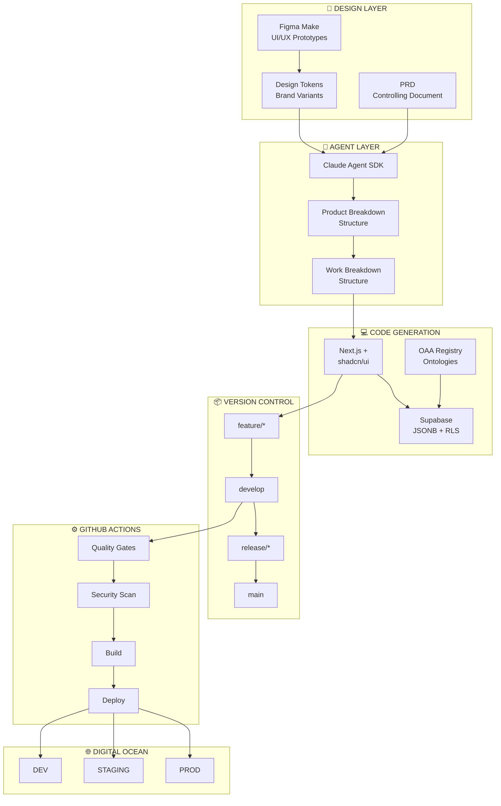

# PF-CORE MVP CI/CD Architecture & Deployment Strategy

**Low-Cost Staged Environment for Agentic Platform Development**

---

| Field | Value |
|-------|-------|
| **Document Version** | 1.1.0 |
| **Date** | November 2025 |
| **Platform** | BAIV Agentic Platform - Platform Foundation Core |
| **Target Stack** | Next.js + shadcn/ui \| Supabase \| Claude Agent SDK \| Figma Make |
| **Deployment Options** | **Option A: Direct Node.js** ($43-55/mo) \| **Option B: Docker** ($73/mo) |

---

## Table of Contents

1. [Executive Summary](#1-executive-summary)
2. [Deployment Options Comparison](#2-deployment-options-comparison)
3. [Cost Analysis](#3-cost-analysis)
4. [Environment Architecture](#4-environment-architecture)
5. [Agentic Workflow Integration](#5-agentic-workflow-integration)
6. [Option A: Direct Node.js Deployment](#6-option-a-direct-nodejs-deployment)
7. [Option B: Docker Deployment](#7-option-b-docker-deployment)
8. [Shared Configuration](#8-shared-configuration)
9. [Implementation Checklist](#9-implementation-checklist)
10. [Success Metrics & KPIs](#10-success-metrics--kpis)

---

## 1. Executive Summary

This document defines a **low-cost, repeatable CI/CD architecture** for PF-CORE MVP development. Two deployment strategies are provided:

- **Option A (Recommended for MVP):** Direct Node.js deployment with PM2 — simpler, faster, cheaper
- **Option B (Future-Ready):** Docker containerized deployment — more portable, better for scaling

Both options enable staged deployments across Development, Staging, and Production environments using GitHub Actions with Digital Ocean Droplets.

### 1.1 Strategic Objectives

- **Prove Agentic Value:** Validate Claude Agent SDK-driven development workflow from PRD → PBS/WBS → Code
- **Multi-Tenant Readiness:** Support multiple PF-CORE variants with brand-specific design tokens
- **TDD Enforcement:** Mandatory 80%+ test coverage gates before staging promotion
- **Cost Optimization:** Total infrastructure cost under $75/month (Option B) or under $55/month (Option A)

### 1.2 Architecture Assumptions

The following components are external to this deliverable scope but integrated:

1. **Design System:** Figma Make with platform brand variants and design tokens pre-configured
2. **OAA Registry:** Ontology Architect Agent managing all schema.org-grounded ontologies
3. **PF Tools:** Reusable platform tooling for agent orchestration
4. **PRD as Control:** Product Requirements Documents serve as controlling specifications for agent execution

---

## 2. Deployment Options Comparison

### Decision Matrix

| Factor | Option A: Direct Node.js | Option B: Docker |
|--------|--------------------------|------------------|
| **Complexity** | ⭐ Simple | ⭐⭐⭐ More complex |
| **Deploy Speed** | ⭐ ~1-2 min | ⭐⭐ ~3-5 min |
| **Monthly Cost** | ⭐ $43-55 | ⭐⭐ $73 |
| **Rollback** | Manual (keep previous build) | Easy (previous image tag) |
| **Environment Parity** | Good (same Node version) | Excellent (identical containers) |
| **Debugging** | Direct access to files/logs | Container logs, exec into container |
| **Multi-Service** | Harder to manage | Native support |
| **Learning Curve** | Low | Medium |
| **Future Scaling** | Add Docker later | Ready for K8s/Swarm |

### Recommendation

| Stage | Recommended Option | Reasoning |
|-------|-------------------|-----------|
| **MVP (Now)** | Option A | Focus on proving agent value, not infrastructure |
| **PMF (100 customers)** | Option A or B | Evaluate based on operational needs |
| **Scale (Post-PMF)** | Option B | Container orchestration benefits kick in |

---

## 3. Cost Analysis

### Option A: Direct Node.js Deployment

| Component | Tier | Spec | Cost/mo |
|-----------|------|------|---------|
| Digital Ocean DEV Droplet | Basic | 1 vCPU, 1GB | $6 |
| Digital Ocean STAGING Droplet | Basic | 1 vCPU, 1GB | $6 |
| Digital Ocean PROD Droplet | Basic | 1 vCPU, 2GB | $12 |
| Supabase DEV Project | Free | 500MB DB | $0 |
| Supabase STAGING Project | Free | 500MB DB | $0 |
| Supabase PROD Project | Pro | 8GB DB | $25 |
| GitHub Actions | Free | 2000 min/mo | $0 |
| **TOTAL** | | | **$49** |

*Note: Can reduce to $43/mo by using Supabase free tier for PROD initially*

### Option B: Docker Deployment

| Component | Tier | Spec | Cost/mo |
|-----------|------|------|---------|
| Digital Ocean DEV Droplet | Basic | 1 vCPU, 2GB | $12 |
| Digital Ocean STAGING Droplet | Basic | 1 vCPU, 2GB | $12 |
| Digital Ocean PROD Droplet | Regular | 2 vCPU, 4GB | $24 |
| Supabase DEV Project | Free | 500MB DB | $0 |
| Supabase STAGING Project | Free | 500MB DB | $0 |
| Supabase PROD Project | Pro | 8GB DB | $25 |
| GitHub Actions | Free | 2000 min/mo | $0 |
| GitHub Container Registry | Free | 500MB | $0 |
| **TOTAL** | | | **$73** |

### Cost Savings Summary

| Comparison | Monthly | Annual |
|------------|---------|--------|
| Option A vs Option B | **$24 less** | **$288 less** |

---

## 4. Environment Architecture

### 4.1 Three-Stage Environment Model

*Applies to both deployment options*

| Aspect | DEV | STAGING | PRODUCTION |
|--------|-----|---------|------------|
| **Branch** | develop | release/* | main + tags |
| **Deploy** | Auto on merge | Auto on merge | **Manual gate** |
| **URL** | dev.pf-core.app | staging.pf-core.app | app.pf-core.app |
| **Tests** | Unit + Lint | Full Suite + E2E | Smoke Tests |
| **Coverage** | Report only | **≥80% gate** | Verified |

### 4.2 Git Branching Strategy

```
feature/* ──► develop ──► release/* ──► main
                │              │           │
                ▼              ▼           ▼
              [DEV]       [STAGING]     [PROD]
              Auto         Auto        Manual Gate
```

- **feature/* → develop:** Feature development with PR review and unit tests
- **develop → release/*:** Release candidate preparation with full test suite
- **release/* → main:** Production deployment with manual approval gate
- **hotfix/* → main:** Emergency fixes with expedited pipeline

### 4.3 Architecture Diagram



---

## 5. Agentic Workflow Integration

*Applies to both deployment options*

### 5.1 Agent-Driven Development Flow

```
┌─────────────┐     ┌─────────────┐     ┌─────────────┐
│ Figma Make  │────►│ Design      │────►│ Claude      │
│ Prototypes  │     │ Tokens      │     │ Agent SDK   │
└─────────────┘     └─────────────┘     └──────┬──────┘
                                               │
                    ┌──────────────────────────┘
                    ▼
┌─────────────┐     ┌─────────────┐     ┌─────────────┐
│ PRD         │────►│ PBS         │────►│ WBS         │
│ (Control)   │     │ Product     │     │ Work        │
└─────────────┘     │ Breakdown   │     │ Breakdown   │
                    └─────────────┘     └──────┬──────┘
                                               │
                    ┌──────────────────────────┘
                    ▼
┌─────────────┐     ┌─────────────┐     ┌─────────────┐
│ Next.js +   │────►│ Supabase    │────►│ CI/CD       │
│ shadcn/ui   │     │ JSONB + RLS │     │ Pipeline    │
└─────────────┘     └─────────────┘     └─────────────┘
```

### 5.2 Design Token Integration

- **Token Location:** `/tokens/{brand}/design-tokens.json`
- **Build Integration:** Tokens compiled to CSS variables at build time
- **Runtime Theming:** CSS custom properties enable tenant-specific branding
- **shadcn/ui Override:** Components consume tokens via Tailwind CSS configuration

### 5.3 Ontology Validation in Pipeline

- **Pre-commit:** JSON-LD syntax validation
- **CI Stage:** Schema.org grounding verification
- **Staging Gate:** OAA Registry compliance check

---

## 6. Option A: Direct Node.js Deployment

### 6.1 Overview

This option deploys the built Next.js application directly to the Droplet using rsync/scp, with PM2 managing the Node.js process.

```
┌──────────────┐     ┌──────────────┐     ┌──────────────┐
│ GitHub       │     │ Build        │     │ Droplet      │
│ Actions      │────►│ Next.js      │────►│ PM2 + Nginx  │
│              │     │ Standalone   │     │              │
└──────────────┘     └──────────────┘     └──────────────┘
        │                   │                    │
        │                   │                    │
   npm ci              npm run build         rsync deploy
   npm test            .next/standalone      pm2 reload
```

### 6.2 Droplet Setup (Option A)

```bash
#!/bin/bash
# bootstrap-node.sh - Run on fresh Ubuntu 22.04 Droplet
set -e

echo "=========================================="
echo "  PF-CORE Droplet Setup (Node.js Direct)"
echo "=========================================="

# System updates
apt-get update && apt-get upgrade -y

# Install Node.js 20 LTS
curl -fsSL https://deb.nodesource.com/setup_20.x | bash -
apt-get install -y nodejs

# Install PM2 globally
npm install -g pm2

# Install Nginx
apt-get install -y nginx

# Install Certbot for SSL
apt-get install -y certbot python3-certbot-nginx

# Configure Firewall
apt-get install -y ufw fail2ban
ufw default deny incoming
ufw default allow outgoing
ufw allow ssh
ufw allow http
ufw allow https
ufw --force enable

# Create app directory structure
mkdir -p /app/{current,releases,shared}
mkdir -p /app/shared/logs

# Create deploy user
useradd -m -s /bin/bash deploy
usermod -aG sudo deploy
chown -R deploy:deploy /app

# Setup PM2 to run on startup
pm2 startup systemd -u deploy --hp /home/deploy
env PATH=$PATH:/usr/bin pm2 startup systemd -u deploy --hp /home/deploy

echo "=========================================="
echo "  Setup Complete!"
echo "=========================================="
echo ""
echo "Next steps:"
echo "1. Configure SSH key for 'deploy' user"
echo "2. Setup Nginx with SSL: certbot --nginx -d your-domain.com"
echo "3. Create /app/shared/.env with environment variables"
```

### 6.3 PM2 Ecosystem File

```javascript
// /app/shared/ecosystem.config.js
module.exports = {
  apps: [{
    name: 'pf-core',
    script: 'server.js',
    cwd: '/app/current',
    instances: 'max',  // Use all available CPUs
    exec_mode: 'cluster',
    env: {
      NODE_ENV: 'production',
      PORT: 3000
    },
    env_file: '/app/shared/.env',
    
    // Logging
    log_file: '/app/shared/logs/combined.log',
    error_file: '/app/shared/logs/error.log',
    out_file: '/app/shared/logs/out.log',
    log_date_format: 'YYYY-MM-DD HH:mm:ss Z',
    
    // Restart policy
    max_restarts: 10,
    min_uptime: '10s',
    max_memory_restart: '500M',
    
    // Graceful reload
    kill_timeout: 5000,
    wait_ready: true,
    listen_timeout: 10000
  }]
};
```

### 6.4 Nginx Configuration (Option A)

```nginx
# /etc/nginx/sites-available/pf-core
upstream nextjs {
    server 127.0.0.1:3000;
    keepalive 64;
}

server {
    listen 80;
    server_name your-domain.com;
    return 301 https://$server_name$request_uri;
}

server {
    listen 443 ssl http2;
    server_name your-domain.com;

    # SSL configuration (managed by Certbot)
    ssl_certificate /etc/letsencrypt/live/your-domain.com/fullchain.pem;
    ssl_certificate_key /etc/letsencrypt/live/your-domain.com/privkey.pem;
    include /etc/letsencrypt/options-ssl-nginx.conf;
    ssl_dhparam /etc/letsencrypt/ssl-dhparams.pem;

    # Security headers
    add_header X-Frame-Options "SAMEORIGIN" always;
    add_header X-Content-Type-Options "nosniff" always;
    add_header X-XSS-Protection "1; mode=block" always;
    add_header Referrer-Policy "strict-origin-when-cross-origin" always;

    # Gzip compression
    gzip on;
    gzip_vary on;
    gzip_proxied any;
    gzip_comp_level 6;
    gzip_types text/plain text/css text/xml application/json application/javascript application/rss+xml application/atom+xml image/svg+xml;

    location / {
        proxy_pass http://nextjs;
        proxy_http_version 1.1;
        proxy_set_header Upgrade $http_upgrade;
        proxy_set_header Connection 'upgrade';
        proxy_set_header Host $host;
        proxy_set_header X-Real-IP $remote_addr;
        proxy_set_header X-Forwarded-For $proxy_add_x_forwarded_for;
        proxy_set_header X-Forwarded-Proto $scheme;
        proxy_cache_bypass $http_upgrade;
        proxy_read_timeout 86400;
    }

    # Static files with aggressive caching
    location /_next/static/ {
        proxy_pass http://nextjs;
        add_header Cache-Control "public, immutable, max-age=31536000";
    }

    # Health check
    location /api/health {
        proxy_pass http://nextjs;
        access_log off;
    }
}
```

### 6.5 GitHub Actions Workflow (Option A)

```yaml
# .github/workflows/deploy-nodejs.yml
# =============================================================================
# PF-CORE CI/CD Pipeline - Direct Node.js Deployment
# =============================================================================
# Simpler deployment without Docker
# Estimated deploy time: 1-2 minutes
# =============================================================================

name: PF-CORE Pipeline (Node.js)

on:
  push:
    branches: [main, develop, 'release/*']
    paths:
      - 'src/**'
      - 'app/**'
      - 'components/**'
      - 'lib/**'
      - 'tests/**'
      - 'package*.json'
    paths-ignore:
      - 'docs/**'
      - '*.md'
  pull_request:
    branches: [main, develop]
  release:
    types: [published]

env:
  NODE_VERSION: '20'

concurrency:
  group: ${{ github.workflow }}-${{ github.ref }}
  cancel-in-progress: true

jobs:
  # ===========================================================================
  # Stage 1: Quality Gates
  # ===========================================================================
  quality-gates:
    name: Quality Gates
    runs-on: ubuntu-latest
    outputs:
      coverage: ${{ steps.coverage.outputs.percentage }}
    steps:
      - uses: actions/checkout@v4
      
      - name: Setup Node.js
        uses: actions/setup-node@v4
        with:
          node-version: ${{ env.NODE_VERSION }}
          cache: 'npm'
      
      - name: Cache node_modules
        uses: actions/cache@v3
        id: node-cache
        with:
          path: node_modules
          key: ${{ runner.os }}-node-${{ hashFiles('**/package-lock.json') }}
      
      - name: Install Dependencies
        if: steps.node-cache.outputs.cache-hit != 'true'
        run: npm ci
      
      - name: Lint & Format
        run: |
          npm run lint
          npm run format:check
      
      - name: Type Check
        run: npm run type-check
      
      - name: Unit Tests
        run: npm run test:unit -- --coverage
      
      - name: Extract Coverage
        id: coverage
        run: |
          COVERAGE=$(cat coverage/coverage-summary.json | jq '.total.lines.pct' 2>/dev/null || echo "0")
          echo "percentage=$COVERAGE" >> $GITHUB_OUTPUT

  # ===========================================================================
  # Stage 2: Security
  # ===========================================================================
  security:
    name: Security Scan
    runs-on: ubuntu-latest
    steps:
      - uses: actions/checkout@v4
      
      - name: Dependency Audit
        run: npm audit --audit-level=high
        continue-on-error: true
      
      - name: Secret Scanning
        uses: trufflesecurity/trufflehog@main
        with:
          path: ./
          extra_args: --only-verified

  # ===========================================================================
  # Stage 3: Build
  # ===========================================================================
  build:
    name: Build Application
    needs: [quality-gates]
    runs-on: ubuntu-latest
    steps:
      - uses: actions/checkout@v4
      
      - name: Setup Node.js
        uses: actions/setup-node@v4
        with:
          node-version: ${{ env.NODE_VERSION }}
          cache: 'npm'
      
      - name: Install Dependencies
        run: npm ci
      
      - name: Build Next.js (Standalone)
        run: npm run build
        env:
          NEXT_TELEMETRY_DISABLED: 1
      
      - name: Prepare Deployment Package
        run: |
          mkdir -p deploy-package
          cp -r .next/standalone/* deploy-package/
          cp -r .next/static deploy-package/.next/
          cp -r public deploy-package/ 2>/dev/null || true
          cp package.json deploy-package/
      
      - name: Upload Build Artifact
        uses: actions/upload-artifact@v4
        with:
          name: build-${{ github.sha }}
          path: deploy-package/
          retention-days: 7

  # ===========================================================================
  # Stage 4: Deploy DEV
  # ===========================================================================
  deploy-dev:
    name: Deploy DEV
    if: github.ref == 'refs/heads/develop'
    needs: [quality-gates, security, build]
    runs-on: ubuntu-latest
    environment:
      name: development
      url: https://dev.pf-core.app
    steps:
      - name: Download Build Artifact
        uses: actions/download-artifact@v4
        with:
          name: build-${{ github.sha }}
          path: deploy-package/
      
      - name: Deploy to DEV Server
        uses: appleboy/scp-action@v0.1.7
        with:
          host: ${{ secrets.DEV_HOST }}
          username: ${{ secrets.DEV_USER }}
          key: ${{ secrets.DEV_SSH_KEY }}
          source: "deploy-package/*"
          target: "/app/releases/${{ github.sha }}"
          strip_components: 1
      
      - name: Activate Release & Reload PM2
        uses: appleboy/ssh-action@v1.0.0
        with:
          host: ${{ secrets.DEV_HOST }}
          username: ${{ secrets.DEV_USER }}
          key: ${{ secrets.DEV_SSH_KEY }}
          script: |
            # Symlink new release
            ln -sfn /app/releases/${{ github.sha }} /app/current
            
            # Copy shared env file
            cp /app/shared/.env /app/current/.env
            
            # Reload PM2 (zero-downtime)
            cd /app/current
            pm2 reload ecosystem.config.js --env production || pm2 start ecosystem.config.js --env production
            
            # Cleanup old releases (keep last 5)
            cd /app/releases && ls -t | tail -n +6 | xargs -r rm -rf
            
            echo "✅ DEV deployment complete!"

  # ===========================================================================
  # Stage 5: Deploy STAGING
  # ===========================================================================
  deploy-staging:
    name: Deploy STAGING
    if: startsWith(github.ref, 'refs/heads/release/')
    needs: [quality-gates, security, build]
    runs-on: ubuntu-latest
    environment:
      name: staging
      url: https://staging.pf-core.app
    steps:
      - name: Check Coverage Gate
        run: |
          COVERAGE="${{ needs.quality-gates.outputs.coverage }}"
          if (( $(echo "$COVERAGE < 80" | bc -l) )); then
            echo "❌ Coverage ($COVERAGE%) is below 80% threshold"
            exit 1
          fi
          echo "✅ Coverage ($COVERAGE%) meets threshold"
      
      - name: Download Build Artifact
        uses: actions/download-artifact@v4
        with:
          name: build-${{ github.sha }}
          path: deploy-package/
      
      - name: Deploy to STAGING Server
        uses: appleboy/scp-action@v0.1.7
        with:
          host: ${{ secrets.STAGING_HOST }}
          username: ${{ secrets.STAGING_USER }}
          key: ${{ secrets.STAGING_SSH_KEY }}
          source: "deploy-package/*"
          target: "/app/releases/${{ github.sha }}"
          strip_components: 1
      
      - name: Activate Release & Reload PM2
        uses: appleboy/ssh-action@v1.0.0
        with:
          host: ${{ secrets.STAGING_HOST }}
          username: ${{ secrets.STAGING_USER }}
          key: ${{ secrets.STAGING_SSH_KEY }}
          script: |
            ln -sfn /app/releases/${{ github.sha }} /app/current
            cp /app/shared/.env /app/current/.env
            cd /app/current
            pm2 reload ecosystem.config.js --env production || pm2 start ecosystem.config.js --env production
            cd /app/releases && ls -t | tail -n +6 | xargs -r rm -rf
            echo "✅ STAGING deployment complete!"
      
      - uses: actions/checkout@v4
      
      - name: Setup Node.js for E2E
        uses: actions/setup-node@v4
        with:
          node-version: ${{ env.NODE_VERSION }}
          cache: 'npm'
      
      - name: Install & Run E2E Tests
        run: |
          npm ci
          npm run test:e2e:critical
        env:
          BASE_URL: https://staging.pf-core.app

  # ===========================================================================
  # Stage 6: Deploy PRODUCTION
  # ===========================================================================
  deploy-production:
    name: Deploy PRODUCTION
    if: github.event_name == 'release'
    needs: [quality-gates, security, build]
    runs-on: ubuntu-latest
    environment:
      name: production
      url: https://app.pf-core.app
    steps:
      - name: Download Build Artifact
        uses: actions/download-artifact@v4
        with:
          name: build-${{ github.sha }}
          path: deploy-package/
      
      - name: Deploy to PRODUCTION Server
        uses: appleboy/scp-action@v0.1.7
        with:
          host: ${{ secrets.PROD_HOST }}
          username: ${{ secrets.PROD_USER }}
          key: ${{ secrets.PROD_SSH_KEY }}
          source: "deploy-package/*"
          target: "/app/releases/${{ github.sha }}"
          strip_components: 1
      
      - name: Activate Release & Reload PM2
        uses: appleboy/ssh-action@v1.0.0
        with:
          host: ${{ secrets.PROD_HOST }}
          username: ${{ secrets.PROD_USER }}
          key: ${{ secrets.PROD_SSH_KEY }}
          script: |
            ln -sfn /app/releases/${{ github.sha }} /app/current
            cp /app/shared/.env /app/current/.env
            cd /app/current
            pm2 reload ecosystem.config.js --env production || pm2 start ecosystem.config.js --env production
            cd /app/releases && ls -t | tail -n +6 | xargs -r rm -rf
            echo "✅ PRODUCTION deployment complete!"
      
      - name: Smoke Test
        run: |
          sleep 10
          curl --retry 5 --retry-delay 5 --fail https://app.pf-core.app/api/health
          echo "✅ Smoke test passed!"
```

### 6.6 Rollback Procedure (Option A)

```bash
#!/bin/bash
# rollback.sh - Quick rollback to previous release
# Usage: ./rollback.sh [release-sha]

RELEASES_DIR="/app/releases"
CURRENT_LINK="/app/current"

if [ -n "$1" ]; then
  # Rollback to specific release
  TARGET="$RELEASES_DIR/$1"
else
  # Rollback to previous release
  CURRENT=$(readlink -f $CURRENT_LINK)
  TARGET=$(ls -t $RELEASES_DIR | grep -v $(basename $CURRENT) | head -1)
  TARGET="$RELEASES_DIR/$TARGET"
fi

if [ -d "$TARGET" ]; then
  echo "Rolling back to: $TARGET"
  ln -sfn "$TARGET" "$CURRENT_LINK"
  cp /app/shared/.env /app/current/.env
  cd /app/current && pm2 reload ecosystem.config.js
  echo "✅ Rollback complete!"
else
  echo "❌ Release not found: $TARGET"
  exit 1
fi
```

---

## 7. Option B: Docker Deployment

### 7.1 Overview

This option builds a Docker image, pushes to GitHub Container Registry, and deploys via docker compose on the Droplet.

```
┌──────────────┐     ┌──────────────┐     ┌──────────────┐
│ GitHub       │     │ Build &      │     │ Droplet      │
│ Actions      │────►│ Push Image   │────►│ Docker +     │
│              │     │ to GHCR      │     │ Nginx        │
└──────────────┘     └──────────────┘     └──────────────┘
        │                   │                    │
        │                   │                    │
   npm ci              docker build         docker compose
   npm test            docker push          pull & up
```

### 7.2 Droplet Setup (Option B)

```bash
#!/bin/bash
# bootstrap-docker.sh - Run on fresh Ubuntu 22.04 Droplet
set -e

echo "=========================================="
echo "  PF-CORE Droplet Setup (Docker)"
echo "=========================================="

# System updates
apt-get update && apt-get upgrade -y

# Install Docker
apt-get install -y ca-certificates curl gnupg lsb-release
mkdir -p /etc/apt/keyrings
curl -fsSL https://download.docker.com/linux/ubuntu/gpg | gpg --dearmor -o /etc/apt/keyrings/docker.gpg
echo "deb [arch=$(dpkg --print-architecture) signed-by=/etc/apt/keyrings/docker.gpg] https://download.docker.com/linux/ubuntu $(lsb_release -cs) stable" | tee /etc/apt/sources.list.d/docker.list > /dev/null
apt-get update
apt-get install -y docker-ce docker-ce-cli containerd.io docker-buildx-plugin docker-compose-plugin

# Enable Docker service
systemctl enable docker
systemctl start docker

# Install Nginx
apt-get install -y nginx

# Install Certbot for SSL
apt-get install -y certbot python3-certbot-nginx

# Configure Firewall
apt-get install -y ufw fail2ban
ufw default deny incoming
ufw default allow outgoing
ufw allow ssh
ufw allow http
ufw allow https
ufw --force enable

# Create app directory
mkdir -p /app
cd /app

# Create docker-compose.yml
cat > docker-compose.yml << 'EOF'
version: '3.8'

services:
  app:
    image: ghcr.io/${GITHUB_REPOSITORY}:${IMAGE_TAG:-latest}
    container_name: pf-core-app
    restart: unless-stopped
    ports:
      - "127.0.0.1:3000:3000"
    env_file:
      - .env
    healthcheck:
      test: ["CMD", "curl", "-f", "http://localhost:3000/api/health"]
      interval: 30s
      timeout: 10s
      retries: 3
      start_period: 40s
    logging:
      driver: "json-file"
      options:
        max-size: "10m"
        max-file: "3"

networks:
  default:
    name: pf-core-network
EOF

echo "=========================================="
echo "  Setup Complete!"
echo "=========================================="
echo ""
echo "Next steps:"
echo "1. Create /app/.env with environment variables"
echo "2. Login to GHCR: echo \$TOKEN | docker login ghcr.io -u USERNAME --password-stdin"
echo "3. Setup Nginx with SSL: certbot --nginx -d your-domain.com"
```

### 7.3 Dockerfile

```dockerfile
# =============================================================================
# PF-CORE Production Dockerfile
# Multi-stage build for Next.js + shadcn/ui
# =============================================================================

# Stage 1: Dependencies
FROM node:20-alpine AS deps
RUN apk add --no-cache libc6-compat
WORKDIR /app
COPY package.json package-lock.json ./
RUN npm ci --only=production && npm cache clean --force

# Stage 2: Builder
FROM node:20-alpine AS builder
WORKDIR /app
COPY --from=deps /app/node_modules ./node_modules
COPY . .

ARG NODE_ENV=production
ARG NEXT_PUBLIC_SUPABASE_URL
ARG NEXT_PUBLIC_SUPABASE_ANON_KEY

ENV NODE_ENV=${NODE_ENV}
ENV NEXT_PUBLIC_SUPABASE_URL=${NEXT_PUBLIC_SUPABASE_URL}
ENV NEXT_PUBLIC_SUPABASE_ANON_KEY=${NEXT_PUBLIC_SUPABASE_ANON_KEY}
ENV NEXT_TELEMETRY_DISABLED=1

RUN npm run build

# Stage 3: Runner
FROM node:20-alpine AS runner
WORKDIR /app
ENV NODE_ENV=production
ENV NEXT_TELEMETRY_DISABLED=1

RUN addgroup --system --gid 1001 nodejs
RUN adduser --system --uid 1001 nextjs

COPY --from=builder /app/public ./public
COPY --from=builder /app/.next/standalone ./
COPY --from=builder /app/.next/static ./.next/static

USER nextjs
EXPOSE 3000
ENV PORT=3000
ENV HOSTNAME="0.0.0.0"

HEALTHCHECK --interval=30s --timeout=10s --retries=3 \
  CMD node -e "require('http').get('http://localhost:3000/api/health', (r) => process.exit(r.statusCode === 200 ? 0 : 1))"

CMD ["node", "server.js"]
```

### 7.4 GitHub Actions Workflow (Option B)

```yaml
# .github/workflows/deploy-docker.yml
# =============================================================================
# PF-CORE CI/CD Pipeline - Docker Deployment
# =============================================================================
# Containerized deployment with GHCR
# Estimated deploy time: 3-5 minutes
# =============================================================================

name: PF-CORE Pipeline (Docker)

on:
  push:
    branches: [main, develop, 'release/*']
    paths:
      - 'src/**'
      - 'app/**'
      - 'components/**'
      - 'lib/**'
      - 'tests/**'
      - 'package*.json'
      - 'Dockerfile'
    paths-ignore:
      - 'docs/**'
      - '*.md'
  pull_request:
    branches: [main, develop]
  release:
    types: [published]

env:
  NODE_VERSION: '20'
  REGISTRY: ghcr.io
  IMAGE_NAME: ${{ github.repository }}

concurrency:
  group: ${{ github.workflow }}-${{ github.ref }}
  cancel-in-progress: true

jobs:
  # ===========================================================================
  # Stage 1: Quality Gates
  # ===========================================================================
  quality-gates:
    name: Quality Gates
    runs-on: ubuntu-latest
    outputs:
      coverage: ${{ steps.coverage.outputs.percentage }}
    steps:
      - uses: actions/checkout@v4
      
      - name: Setup Node.js
        uses: actions/setup-node@v4
        with:
          node-version: ${{ env.NODE_VERSION }}
          cache: 'npm'
      
      - name: Cache node_modules
        uses: actions/cache@v3
        id: node-cache
        with:
          path: node_modules
          key: ${{ runner.os }}-node-${{ hashFiles('**/package-lock.json') }}
      
      - name: Install Dependencies
        if: steps.node-cache.outputs.cache-hit != 'true'
        run: npm ci
      
      - name: Lint & Format
        run: |
          npm run lint
          npm run format:check
      
      - name: Type Check
        run: npm run type-check
      
      - name: Unit Tests
        run: npm run test:unit -- --coverage
      
      - name: Extract Coverage
        id: coverage
        run: |
          COVERAGE=$(cat coverage/coverage-summary.json | jq '.total.lines.pct' 2>/dev/null || echo "0")
          echo "percentage=$COVERAGE" >> $GITHUB_OUTPUT

  # ===========================================================================
  # Stage 2: Security
  # ===========================================================================
  security:
    name: Security Scan
    runs-on: ubuntu-latest
    steps:
      - uses: actions/checkout@v4
      
      - name: Dependency Audit
        run: npm audit --audit-level=high
        continue-on-error: true
      
      - name: Secret Scanning
        uses: trufflesecurity/trufflehog@main
        with:
          path: ./
          extra_args: --only-verified

  # ===========================================================================
  # Stage 3: Deploy DEV
  # ===========================================================================
  deploy-dev:
    name: Deploy DEV
    if: github.ref == 'refs/heads/develop'
    needs: [quality-gates, security]
    runs-on: ubuntu-latest
    environment:
      name: development
      url: https://dev.pf-core.app
    permissions:
      contents: read
      packages: write
    steps:
      - uses: actions/checkout@v4
      
      - name: Set up Docker Buildx
        uses: docker/setup-buildx-action@v3
      
      - name: Login to GHCR
        uses: docker/login-action@v3
        with:
          registry: ${{ env.REGISTRY }}
          username: ${{ github.actor }}
          password: ${{ secrets.GITHUB_TOKEN }}
      
      - name: Build and Push
        uses: docker/build-push-action@v5
        with:
          context: .
          push: true
          tags: |
            ${{ env.REGISTRY }}/${{ env.IMAGE_NAME }}:dev
            ${{ env.REGISTRY }}/${{ env.IMAGE_NAME }}:dev-${{ github.sha }}
          cache-from: type=gha
          cache-to: type=gha,mode=max
          build-args: |
            NEXT_PUBLIC_SUPABASE_URL=${{ secrets.SUPABASE_URL }}
            NEXT_PUBLIC_SUPABASE_ANON_KEY=${{ secrets.SUPABASE_ANON_KEY }}
      
      - name: Deploy to DEV
        uses: appleboy/ssh-action@v1.0.0
        with:
          host: ${{ secrets.DEV_HOST }}
          username: ${{ secrets.DEV_USER }}
          key: ${{ secrets.DEV_SSH_KEY }}
          script: |
            cd /app
            export IMAGE_TAG=dev
            docker compose pull
            docker compose up -d
            docker image prune -f
            echo "✅ DEV deployment complete!"

  # ===========================================================================
  # Stage 4: Deploy STAGING
  # ===========================================================================
  deploy-staging:
    name: Deploy STAGING
    if: startsWith(github.ref, 'refs/heads/release/')
    needs: [quality-gates, security]
    runs-on: ubuntu-latest
    environment:
      name: staging
      url: https://staging.pf-core.app
    permissions:
      contents: read
      packages: write
    steps:
      - name: Check Coverage Gate
        run: |
          COVERAGE="${{ needs.quality-gates.outputs.coverage }}"
          if (( $(echo "$COVERAGE < 80" | bc -l) )); then
            echo "❌ Coverage ($COVERAGE%) is below 80% threshold"
            exit 1
          fi
      
      - uses: actions/checkout@v4
      
      - name: Set up Docker Buildx
        uses: docker/setup-buildx-action@v3
      
      - name: Login to GHCR
        uses: docker/login-action@v3
        with:
          registry: ${{ env.REGISTRY }}
          username: ${{ github.actor }}
          password: ${{ secrets.GITHUB_TOKEN }}
      
      - name: Build and Push
        uses: docker/build-push-action@v5
        with:
          context: .
          push: true
          tags: |
            ${{ env.REGISTRY }}/${{ env.IMAGE_NAME }}:staging
            ${{ env.REGISTRY }}/${{ env.IMAGE_NAME }}:staging-${{ github.sha }}
          cache-from: type=gha
          cache-to: type=gha,mode=max
          build-args: |
            NEXT_PUBLIC_SUPABASE_URL=${{ secrets.SUPABASE_URL }}
            NEXT_PUBLIC_SUPABASE_ANON_KEY=${{ secrets.SUPABASE_ANON_KEY }}
      
      - name: Deploy to STAGING
        uses: appleboy/ssh-action@v1.0.0
        with:
          host: ${{ secrets.STAGING_HOST }}
          username: ${{ secrets.STAGING_USER }}
          key: ${{ secrets.STAGING_SSH_KEY }}
          script: |
            cd /app
            export IMAGE_TAG=staging
            docker compose pull
            docker compose up -d
            docker image prune -f
            echo "✅ STAGING deployment complete!"
      
      - name: E2E Tests
        run: |
          sleep 30
          curl --retry 10 --retry-delay 5 --fail https://staging.pf-core.app/api/health

  # ===========================================================================
  # Stage 5: Deploy PRODUCTION
  # ===========================================================================
  deploy-production:
    name: Deploy PRODUCTION
    if: github.event_name == 'release'
    needs: [quality-gates, security]
    runs-on: ubuntu-latest
    environment:
      name: production
      url: https://app.pf-core.app
    permissions:
      contents: read
      packages: write
    steps:
      - uses: actions/checkout@v4
      
      - name: Set up Docker Buildx
        uses: docker/setup-buildx-action@v3
      
      - name: Login to GHCR
        uses: docker/login-action@v3
        with:
          registry: ${{ env.REGISTRY }}
          username: ${{ github.actor }}
          password: ${{ secrets.GITHUB_TOKEN }}
      
      - name: Build and Push
        uses: docker/build-push-action@v5
        with:
          context: .
          push: true
          tags: |
            ${{ env.REGISTRY }}/${{ env.IMAGE_NAME }}:latest
            ${{ env.REGISTRY }}/${{ env.IMAGE_NAME }}:${{ github.event.release.tag_name }}
          cache-from: type=gha
          cache-to: type=gha,mode=max
          build-args: |
            NEXT_PUBLIC_SUPABASE_URL=${{ secrets.SUPABASE_URL }}
            NEXT_PUBLIC_SUPABASE_ANON_KEY=${{ secrets.SUPABASE_ANON_KEY }}
      
      - name: Deploy to PRODUCTION
        uses: appleboy/ssh-action@v1.0.0
        with:
          host: ${{ secrets.PROD_HOST }}
          username: ${{ secrets.PROD_USER }}
          key: ${{ secrets.PROD_SSH_KEY }}
          script: |
            cd /app
            export IMAGE_TAG=latest
            docker compose pull
            docker compose up -d
            docker image prune -f
            echo "✅ PRODUCTION deployment complete!"
      
      - name: Smoke Test
        run: |
          sleep 15
          curl --retry 5 --retry-delay 5 --fail https://app.pf-core.app/api/health
```

### 7.5 Rollback Procedure (Option B)

```bash
#!/bin/bash
# rollback-docker.sh - Quick rollback to previous image
# Usage: ./rollback-docker.sh [image-tag]

IMAGE_TAG=${1:-$(docker images --format "{{.Tag}}" ghcr.io/your-org/pf-core | grep -v latest | head -2 | tail -1)}

if [ -n "$IMAGE_TAG" ]; then
  echo "Rolling back to: ghcr.io/your-org/pf-core:$IMAGE_TAG"
  cd /app
  export IMAGE_TAG=$IMAGE_TAG
  docker compose pull
  docker compose up -d
  echo "✅ Rollback complete!"
else
  echo "❌ No previous image found"
  exit 1
fi
```

---

## 8. Shared Configuration

*These configurations apply to both deployment options*

### 8.1 GitHub Environment Secrets

| Secret Name | Purpose | Environments |
|-------------|---------|--------------|
| `DEV_HOST` / `STAGING_HOST` / `PROD_HOST` | Droplet IP address | Per environment |
| `DEV_USER` / `STAGING_USER` / `PROD_USER` | SSH username | Per environment |
| `DEV_SSH_KEY` / `STAGING_SSH_KEY` / `PROD_SSH_KEY` | Private SSH key | Per environment |
| `SUPABASE_URL` | Supabase project URL | Per environment |
| `SUPABASE_ANON_KEY` | Supabase public key | Per environment |
| `SUPABASE_SERVICE_KEY` | Supabase service role key | Per environment |

### 8.2 Environment Variables Template

```bash
# /app/shared/.env (Option A) or /app/.env (Option B)

NODE_ENV=production

# Supabase
NEXT_PUBLIC_SUPABASE_URL=https://your-project.supabase.co
NEXT_PUBLIC_SUPABASE_ANON_KEY=your-anon-key
SUPABASE_SERVICE_ROLE_KEY=your-service-role-key

# Application
NEXT_PUBLIC_APP_URL=https://your-domain.com

# Optional: GitHub (for Option B)
GITHUB_REPOSITORY=your-org/pf-core
IMAGE_TAG=latest
```

### 8.3 Required npm Scripts

Add these to your `package.json`:

```json
{
  "scripts": {
    "dev": "next dev",
    "build": "next build",
    "start": "next start",
    "lint": "next lint",
    "format:check": "prettier --check .",
    "type-check": "tsc --noEmit",
    "test:unit": "vitest run",
    "test:e2e": "playwright test",
    "test:e2e:critical": "playwright test --grep @critical"
  }
}
```

### 8.4 Next.js Configuration for Standalone Output

```javascript
// next.config.js
/** @type {import('next').NextConfig} */
const nextConfig = {
  output: 'standalone',  // Required for both options
  
  // Optimize for production
  poweredByHeader: false,
  compress: true,
  
  // Image optimization
  images: {
    domains: ['your-domain.com'],
    unoptimized: process.env.NODE_ENV === 'development',
  },
};

module.exports = nextConfig;
```

---

## 9. Implementation Checklist

### 9.1 Phase 1: Infrastructure Setup (Day 1-2)

#### Both Options
- [ ] Create Digital Ocean account and team
- [ ] Configure DNS records for all environments
- [ ] Create Supabase projects (DEV free, STAGING free, PROD pro)
- [ ] Create GitHub repository with branch protection rules
- [ ] Configure GitHub Environments (development, staging, production)
- [ ] Set up production environment approval requirement

#### Option A Only
- [ ] Provision 3 Droplets ($6, $6, $12 tiers)
- [ ] Run `bootstrap-node.sh` on each Droplet
- [ ] Configure SSH keys for 'deploy' user
- [ ] Create `/app/shared/.env` on each Droplet
- [ ] Create `/app/shared/ecosystem.config.js`

#### Option B Only
- [ ] Provision 3 Droplets ($12, $12, $24 tiers)
- [ ] Run `bootstrap-docker.sh` on each Droplet
- [ ] Login to GHCR on each Droplet
- [ ] Create `/app/.env` on each Droplet

### 9.2 Phase 2: Pipeline Setup (Day 2-3)

- [ ] Add environment-scoped secrets to GitHub
- [ ] Create workflow file (choose Option A or B)
- [ ] Configure Nginx with SSL on each Droplet
- [ ] Test deployment to DEV environment
- [ ] Validate coverage gate on STAGING
- [ ] Test production approval gate

### 9.3 Phase 3: Validation (Day 3-4)

- [ ] Execute full pipeline: feature → develop → release → main
- [ ] Test rollback procedure
- [ ] Document runbook for common operations
- [ ] Verify monitoring and logs access

---

## 10. Success Metrics & KPIs

### 10.1 CI/CD Performance

| Metric | Option A Target | Option B Target |
|--------|-----------------|-----------------|
| **Quality Gates Duration** | < 2 min | < 2 min |
| **Build Duration** | < 1 min | < 3 min |
| **Deploy Duration** | < 1 min | < 2 min |
| **Total Pipeline** | < 5 min | < 8 min |
| **Deploy Frequency** | 4+/day to DEV | 4+/day to DEV |

### 10.2 Quality Metrics

| Metric | Target |
|--------|--------|
| **Test Coverage** | ≥ 80% enforced at STAGING |
| **Build Success Rate** | > 95% on main branch |
| **Security Scan Pass Rate** | 100% |
| **Ontology Compliance** | 100% schema.org validation |

### 10.3 Cost Efficiency

| Metric | Option A | Option B |
|--------|----------|----------|
| **Monthly Infrastructure** | $49 | $73 |
| **Annual Savings** | $288 vs Option B | Baseline |
| **GitHub Minutes Used** | < 1000/month | < 1500/month |
| **Cost per Deploy** | ~$0.05 | ~$0.08 |

---

## Summary: Which Option to Choose?

```
┌─────────────────────────────────────────────────────────────────┐
│                    DECISION TREE                                │
├─────────────────────────────────────────────────────────────────┤
│                                                                 │
│  Are you in MVP/proof-of-concept phase?                        │
│     │                                                           │
│     ├── YES ──► Use Option A (Direct Node.js)                  │
│     │           • Simpler, faster, cheaper                     │
│     │           • Focus on proving agent value                 │
│     │           • Can migrate to Docker later                  │
│     │                                                           │
│     └── NO ───► Do you need multi-service orchestration?       │
│                    │                                            │
│                    ├── YES ──► Use Option B (Docker)           │
│                    │           • Container isolation            │
│                    │           • Easy multi-service             │
│                    │           • K8s-ready future              │
│                    │                                            │
│                    └── NO ───► Use Option A (Direct Node.js)   │
│                                • Lower operational overhead    │
│                                • Evaluate Docker at scale      │
│                                                                 │
└─────────────────────────────────────────────────────────────────┘
```

**Recommendation for PF-CORE MVP:** Start with **Option A** to prove agentic development benefits with minimal infrastructure complexity. The workflow files are designed to make migration to Option B straightforward when scaling needs arise.

---

**Document Classification:** CONFIDENTIAL - Platform Foundation Core Holdings

**— END OF DOCUMENT —**
