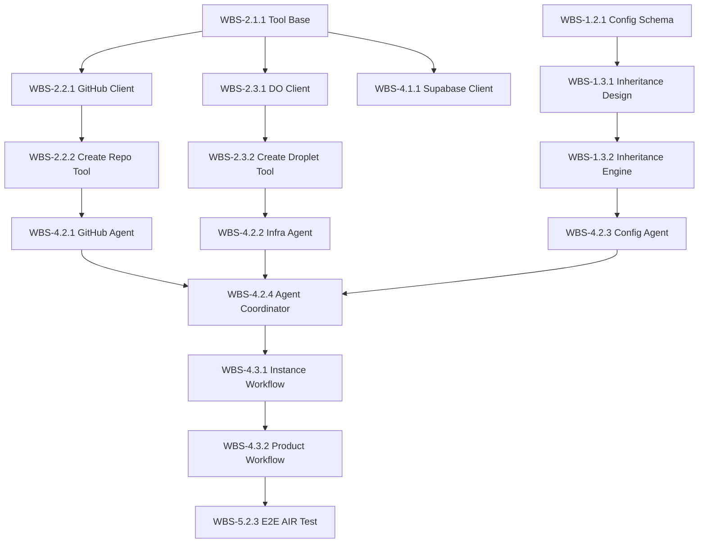

# Work Breakdown Structure (WBS)

## PF-CORE CI/CD Automation Agent

**Task-Level Decomposition with Estimates, Dependencies & Assignments**

---

| Field | Value |
|-------|-------|
| **Document ID** | WBS-PF-CICD-AGENT-001 |
| **Version** | 1.0.0 |
| **Date** | November 2025 |
| **Source PRD** | PRD-PF-CICD-AGENT-001 |
| **Source PBS** | PBS-PF-CICD-AGENT-001 |
| **Classification** | CONFIDENTIAL |

---

## 1. WBS Summary

| Phase | Tasks | Estimated Effort | Duration |
|-------|-------|------------------|----------|
| **Phase 1: Foundation** | 28 | 15 days | Weeks 1-3 |
| **Phase 2: Core Agents** | 24 | 12 days | Weeks 3-5 |
| **Phase 3: Templates** | 32 | 14 days | Weeks 5-7 |
| **Phase 4: Integration** | 16 | 8 days | Weeks 7-9 |
| **Phase 5: Documentation & Testing** | 20 | 10 days | Weeks 9-11 |
| **TOTAL** | **120** | **59 days** | **~12 weeks** |

---

## 2. Phase 1: Foundation (Weeks 1-3)

### WBS-1.1 Project Setup

| WBS ID | Task | PBS Ref | Effort | Dependencies | Deliverable |
|--------|------|---------|--------|--------------|-------------|
| WBS-1.1.1 | Create agent project repository | PBS-1.1 | 0.5d | None | GitHub repo created |
| WBS-1.1.2 | Setup Python project structure | PBS-1.1 | 0.5d | WBS-1.1.1 | pyproject.toml, src/ structure |
| WBS-1.1.3 | Configure development environment | PBS-1.1 | 0.5d | WBS-1.1.2 | .env.example, dev setup docs |
| WBS-1.1.4 | Setup CI pipeline for agent code | PBS-1.6.1 | 1d | WBS-1.1.2 | .github/workflows/ci.yml |
| WBS-1.1.5 | Configure linting and formatting | PBS-1.10.1 | 0.5d | WBS-1.1.2 | ruff, black, mypy config |
| WBS-1.1.6 | Setup test framework | PBS-1.10.1 | 0.5d | WBS-1.1.2 | pytest config, test structure |

**Subtotal: 3.5 days**

---

### WBS-1.2 Configuration Schema Design

| WBS ID | Task | PBS Ref | Effort | Dependencies | Deliverable |
|--------|------|---------|--------|--------------|-------------|
| WBS-1.2.1 | Design PF-CORE config schema | PBS-1.4.1 | 1d | None | pf-core.schema.json |
| WBS-1.2.2 | Design instance config schema | PBS-1.4.1 | 0.5d | WBS-1.2.1 | instance.schema.json |
| WBS-1.2.3 | Design product config schema | PBS-1.4.1 | 0.5d | WBS-1.2.2 | product.schema.json |
| WBS-1.2.4 | Design white-label config schema | PBS-1.4.1 | 0.5d | WBS-1.2.3 | white-label.schema.json |
| WBS-1.2.5 | Implement JSON Schema validation | PBS-1.4.3 | 1d | WBS-1.2.1-4 | config_validator.py |
| WBS-1.2.6 | Create schema documentation | PBS-1.9.2 | 0.5d | WBS-1.2.1-4 | schema-reference.md |

**Subtotal: 4 days**

---

### WBS-1.3 Inheritance Engine

| WBS ID | Task | PBS Ref | Effort | Dependencies | Deliverable |
|--------|------|---------|--------|--------------|-------------|
| WBS-1.3.1 | Design inheritance algorithm | PBS-1.4.2 | 0.5d | WBS-1.2.1-4 | Design document |
| WBS-1.3.2 | Implement base config merger | PBS-1.4.2 | 1d | WBS-1.3.1 | inheritance_engine.py |
| WBS-1.3.3 | Implement override detection | PBS-1.4.2 | 0.5d | WBS-1.3.2 | Override marking logic |
| WBS-1.3.4 | Implement multi-level inheritance | PBS-1.4.2 | 1d | WBS-1.3.3 | 3-tier inheritance support |
| WBS-1.3.5 | Unit tests for inheritance | PBS-1.10.1 | 1d | WBS-1.3.2-4 | test_inheritance.py |

**Subtotal: 4 days**

---

### WBS-1.4 Audit System

| WBS ID | Task | PBS Ref | Effort | Dependencies | Deliverable |
|--------|------|---------|--------|--------------|-------------|
| WBS-1.4.1 | Design audit event schema | PBS-1.1.4 | 0.5d | None | audit_event.schema.json |
| WBS-1.4.2 | Implement audit service | PBS-1.1.4 | 1d | WBS-1.4.1 | audit_service.py |
| WBS-1.4.3 | Implement audit storage (Supabase) | PBS-1.1.4 | 0.5d | WBS-1.4.2 | Supabase integration |
| WBS-1.4.4 | Implement audit decorators | PBS-1.1.4 | 0.5d | WBS-1.4.2 | @audit_action decorator |
| WBS-1.4.5 | Unit tests for audit system | PBS-1.10.1 | 0.5d | WBS-1.4.2-4 | test_audit.py |

**Subtotal: 3 days**

---

## 3. Phase 2: Core Agents & Tools (Weeks 3-5)

### WBS-2.1 Tool Framework

| WBS ID | Task | PBS Ref | Effort | Dependencies | Deliverable |
|--------|------|---------|--------|--------------|-------------|
| WBS-2.1.1 | Design tool base class | PBS-1.3 | 0.5d | WBS-1.1 | base_tool.py |
| WBS-2.1.2 | Implement tool registry | PBS-1.3 | 0.5d | WBS-2.1.1 | tool_registry.py |
| WBS-2.1.3 | Implement tool result handling | PBS-1.3 | 0.5d | WBS-2.1.1 | Result types, error handling |
| WBS-2.1.4 | Implement tool logging | PBS-1.3 | 0.5d | WBS-2.1.1 | Tool execution logging |

**Subtotal: 2 days**

---

### WBS-2.2 GitHub Tools

| WBS ID | Task | PBS Ref | Effort | Dependencies | Deliverable |
|--------|------|---------|--------|--------------|-------------|
| WBS-2.2.1 | Setup GitHub API client | PBS-1.3.1 | 0.5d | WBS-2.1.1 | github_client.py |
| WBS-2.2.2 | Implement create_repo tool | PBS-1.3.1 | 1d | WBS-2.2.1 | create_repo.py |
| WBS-2.2.3 | Implement configure_branch_protection | PBS-1.3.1 | 0.5d | WBS-2.2.1 | branch_protection.py |
| WBS-2.2.4 | Implement create_environment | PBS-1.3.1 | 0.5d | WBS-2.2.1 | create_environment.py |
| WBS-2.2.5 | Implement set_secret | PBS-1.3.1 | 0.5d | WBS-2.2.1 | set_secret.py |
| WBS-2.2.6 | Implement create_workflow | PBS-1.3.1 | 0.5d | WBS-2.2.1 | create_workflow.py |
| WBS-2.2.7 | Unit tests for GitHub tools | PBS-1.10.1 | 1d | WBS-2.2.2-6 | test_github_tools.py |

**Subtotal: 4.5 days**

---

### WBS-2.3 Digital Ocean Tools

| WBS ID | Task | PBS Ref | Effort | Dependencies | Deliverable |
|--------|------|---------|--------|--------------|-------------|
| WBS-2.3.1 | Setup DO API client | PBS-1.3.2 | 0.5d | WBS-2.1.1 | do_client.py |
| WBS-2.3.2 | Implement create_droplet tool | PBS-1.3.2 | 1d | WBS-2.3.1 | create_droplet.py |
| WBS-2.3.3 | Implement configure_firewall | PBS-1.3.2 | 0.5d | WBS-2.3.1 | configure_firewall.py |
| WBS-2.3.4 | Implement bootstrap_droplet | PBS-1.3.2 | 1d | WBS-2.3.2 | bootstrap_droplet.py (SSH exec) |
| WBS-2.3.5 | Implement create_dns_record | PBS-1.3.2 | 0.5d | WBS-2.3.1 | create_dns_record.py |
| WBS-2.3.6 | Unit tests for DO tools | PBS-1.10.1 | 1d | WBS-2.3.2-5 | test_do_tools.py |

**Subtotal: 4.5 days**

---

### WBS-2.4 Primary Orchestrator Agent

| WBS ID | Task | PBS Ref | Effort | Dependencies | Deliverable |
|--------|------|---------|--------|--------------|-------------|
| WBS-2.4.1 | Design agent system prompt | PBS-1.1.1 | 0.5d | None | system_prompt.md |
| WBS-2.4.2 | Implement agent definition | PBS-1.1.1 | 1d | WBS-2.4.1 | cicd_orchestrator.py |
| WBS-2.4.3 | Implement conversation handler | PBS-1.1.3 | 1d | WBS-2.4.2 | conversation.py |
| WBS-2.4.4 | Integrate tools with agent | PBS-1.1.1 | 0.5d | WBS-2.2, WBS-2.3 | Tool bindings |
| WBS-2.4.5 | Implement progress reporting | PBS-1.1.3 | 0.5d | WBS-2.4.3 | Progress callbacks |

**Subtotal: 3.5 days**

---

## 4. Phase 3: Templates (Weeks 5-7)

### WBS-3.1 PF-CORE Base Templates

| WBS ID | Task | PBS Ref | Effort | Dependencies | Deliverable |
|--------|------|---------|--------|--------------|-------------|
| WBS-3.1.1 | Create base config template | PBS-1.5.1 | 0.5d | WBS-1.2 | pf-core.config.yaml |
| WBS-3.1.2 | Create base Dockerfile template | PBS-1.6.2 | 0.5d | None | Dockerfile.template |
| WBS-3.1.3 | Create base docker-compose template | PBS-1.6.2 | 0.5d | None | docker-compose.yml.template |
| WBS-3.1.4 | Create base README template | PBS-1.5.1 | 0.5d | None | README.md.template |
| WBS-3.1.5 | Create base .gitignore template | PBS-1.5.1 | 0.25d | None | .gitignore.template |
| WBS-3.1.6 | Create base package.json template | PBS-1.5.1 | 0.25d | None | package.json.template |

**Subtotal: 2.5 days**

---

### WBS-3.2 GitHub Actions Workflow Templates

| WBS ID | Task | PBS Ref | Effort | Dependencies | Deliverable |
|--------|------|---------|--------|--------------|-------------|
| WBS-3.2.1 | Create CI workflow template | PBS-1.6.1 | 1d | None | ci.yml.template |
| WBS-3.2.2 | Create deploy-dev workflow template | PBS-1.6.1 | 0.5d | WBS-3.2.1 | deploy-dev.yml.template |
| WBS-3.2.3 | Create deploy-staging workflow template | PBS-1.6.1 | 0.5d | WBS-3.2.1 | deploy-staging.yml.template |
| WBS-3.2.4 | Create deploy-prod workflow template | PBS-1.6.1 | 0.5d | WBS-3.2.1 | deploy-prod.yml.template |
| WBS-3.2.5 | Implement workflow variable substitution | PBS-1.6.1 | 1d | WBS-3.2.1-4 | template_engine.py |
| WBS-3.2.6 | Create quality gate configuration | PBS-1.6.4 | 0.5d | None | quality-gates.yaml |

**Subtotal: 4 days**

---

### WBS-3.3 Infrastructure Templates

| WBS ID | Task | PBS Ref | Effort | Dependencies | Deliverable |
|--------|------|---------|--------|--------------|-------------|
| WBS-3.3.1 | Create bootstrap-docker.sh template | PBS-1.7.1 | 1d | None | bootstrap-docker.sh.template |
| WBS-3.3.2 | Create Nginx site config template | PBS-1.7.2 | 0.5d | None | nginx-site.conf.template |
| WBS-3.3.3 | Create Nginx SSL config template | PBS-1.7.2 | 0.5d | None | nginx-ssl.conf.template |
| WBS-3.3.4 | Create UFW rules template | PBS-1.7.4 | 0.5d | None | ufw-rules.sh.template |
| WBS-3.3.5 | Create fail2ban config template | PBS-1.7.4 | 0.5d | None | fail2ban.conf.template |
| WBS-3.3.6 | Create deployment scripts | PBS-1.6.3 | 1d | None | deploy.sh, rollback.sh templates |

**Subtotal: 4 days**

---

### WBS-3.4 Instance Templates (AIR, BAIV, W4M)

| WBS ID | Task | PBS Ref | Effort | Dependencies | Deliverable |
|--------|------|---------|--------|--------------|-------------|
| WBS-3.4.1 | Create AIR instance config | PBS-1.5.2 | 0.5d | WBS-3.1.1 | air.instance.yaml |
| WBS-3.4.2 | Create AIR brand tokens | PBS-1.5.2 | 0.5d | None | air/design-tokens.json |
| WBS-3.4.3 | Create BAIV instance config | PBS-1.5.2 | 0.5d | WBS-3.1.1 | baiv.instance.yaml |
| WBS-3.4.4 | Create BAIV brand tokens | PBS-1.5.2 | 0.5d | None | baiv/design-tokens.json |
| WBS-3.4.5 | Create W4M instance config | PBS-1.5.2 | 0.5d | WBS-3.1.1 | w4m.instance.yaml |
| WBS-3.4.6 | Create W4M brand tokens | PBS-1.5.2 | 0.5d | None | w4m/design-tokens.json |

**Subtotal: 3 days**

---

### WBS-3.5 Product Templates

| WBS ID | Task | PBS Ref | Effort | Dependencies | Deliverable |
|--------|------|---------|--------|--------------|-------------|
| WBS-3.5.1 | Create EP product config | PBS-1.5.3 | 0.5d | WBS-3.4.1 | air-ep.product.yaml |
| WBS-3.5.2 | Create VHF product config | PBS-1.5.3 | 0.5d | WBS-3.4.3 | baiv-vhf.product.yaml |
| WBS-3.5.3 | Create WWG product config | PBS-1.5.3 | 0.5d | WBS-3.4.3 | baiv-wwg.product.yaml |
| WBS-3.5.4 | Create ENDV product config | PBS-1.5.3 | 0.5d | WBS-3.4.5 | w4m-endv.product.yaml |
| WBS-3.5.5 | Create RNOR product config | PBS-1.5.3 | 0.5d | WBS-3.4.5 | w4m-rnor.product.yaml |
| WBS-3.5.6 | Create white-label base template | PBS-1.5.4 | 0.5d | None | white-label.template.yaml |

**Subtotal: 3 days**

---

### WBS-3.6 Database Templates

| WBS ID | Task | PBS Ref | Effort | Dependencies | Deliverable |
|--------|------|---------|--------|--------------|-------------|
| WBS-3.6.1 | Create PF-CORE base migration | PBS-1.8.1 | 1d | None | 001_pf_core_base.sql |
| WBS-3.6.2 | Create instance extension template | PBS-1.8.2 | 0.5d | WBS-3.6.1 | 002_instance_ext.sql.template |
| WBS-3.6.3 | Create product extension template | PBS-1.8.3 | 0.5d | WBS-3.6.2 | 003_product_ext.sql.template |
| WBS-3.6.4 | Create RLS policy templates | PBS-1.8.4 | 1d | WBS-3.6.1 | rls_policies.sql.template |
| WBS-3.6.5 | Create database function templates | PBS-1.8.1 | 0.5d | None | functions/*.sql.template |

**Subtotal: 3.5 days**

---

## 5. Phase 4: Integration (Weeks 7-9)

### WBS-4.1 Supabase Tools & Agent

| WBS ID | Task | PBS Ref | Effort | Dependencies | Deliverable |
|--------|------|---------|--------|--------------|-------------|
| WBS-4.1.1 | Setup Supabase Management API client | PBS-1.3.3 | 0.5d | WBS-2.1 | supabase_client.py |
| WBS-4.1.2 | Implement create_project tool | PBS-1.3.3 | 1d | WBS-4.1.1 | create_project.py |
| WBS-4.1.3 | Implement run_migration tool | PBS-1.3.3 | 1d | WBS-4.1.1 | run_migration.py |
| WBS-4.1.4 | Implement configure_rls tool | PBS-1.3.3 | 0.5d | WBS-4.1.1 | configure_rls.py |
| WBS-4.1.5 | Create Database sub-agent | PBS-1.2.3 | 1d | WBS-4.1.2-4 | database_agent.py |
| WBS-4.1.6 | Unit tests for Supabase tools | PBS-1.10.1 | 1d | WBS-4.1.2-4 | test_supabase_tools.py |

**Subtotal: 5 days**

---

### WBS-4.2 Sub-Agent Implementation

| WBS ID | Task | PBS Ref | Effort | Dependencies | Deliverable |
|--------|------|---------|--------|--------------|-------------|
| WBS-4.2.1 | Create GitHub sub-agent | PBS-1.2.1 | 1d | WBS-2.2 | github_agent.py |
| WBS-4.2.2 | Create Infrastructure sub-agent | PBS-1.2.2 | 1d | WBS-2.3 | infra_agent.py |
| WBS-4.2.3 | Create Configuration sub-agent | PBS-1.2.4 | 1d | WBS-1.3 | config_agent.py |
| WBS-4.2.4 | Implement sub-agent coordination | PBS-1.1.1 | 1d | WBS-4.2.1-3 | agent_coordinator.py |
| WBS-4.2.5 | Integration tests for sub-agents | PBS-1.10.2 | 1d | WBS-4.2.1-4 | test_subagents_integration.py |

**Subtotal: 5 days**

---

### WBS-4.3 End-to-End Workflows

| WBS ID | Task | PBS Ref | Effort | Dependencies | Deliverable |
|--------|------|---------|--------|--------------|-------------|
| WBS-4.3.1 | Implement instance provisioning workflow | PBS-1.1.1 | 1d | WBS-4.2 | workflows/provision_instance.py |
| WBS-4.3.2 | Implement product provisioning workflow | PBS-1.1.1 | 1d | WBS-4.3.1 | workflows/provision_product.py |
| WBS-4.3.3 | Implement white-label provisioning | PBS-1.1.1 | 0.5d | WBS-4.3.2 | workflows/provision_whitelabel.py |
| WBS-4.3.4 | Implement deployment promotion workflow | PBS-1.1.1 | 0.5d | WBS-4.2 | workflows/promote_deployment.py |
| WBS-4.3.5 | Implement rollback workflow | PBS-1.1.1 | 0.5d | WBS-4.2 | workflows/rollback.py |
| WBS-4.3.6 | Integration tests for workflows | PBS-1.10.2 | 1.5d | WBS-4.3.1-5 | test_workflows.py |

**Subtotal: 5 days**

---

## 6. Phase 5: Documentation & Testing (Weeks 9-11)

### WBS-5.1 Documentation

| WBS ID | Task | PBS Ref | Effort | Dependencies | Deliverable |
|--------|------|---------|--------|--------------|-------------|
| WBS-5.1.1 | Write Agent User Guide | PBS-1.9.1 | 2d | WBS-4.3 | docs/user-guide.md |
| WBS-5.1.2 | Write Configuration Reference | PBS-1.9.2 | 1d | WBS-1.2 | docs/configuration-reference.md |
| WBS-5.1.3 | Write Operations Runbook | PBS-1.9.3 | 1.5d | WBS-4.3 | docs/runbook.md |
| WBS-5.1.4 | Write API Documentation | PBS-1.9.4 | 1d | WBS-2.2, WBS-2.3, WBS-4.1 | docs/api-reference.md |
| WBS-5.1.5 | Write Architecture Documentation | PBS-1.9.4 | 1d | All | docs/architecture.md |
| WBS-5.1.6 | Create command quick reference | PBS-1.9.1 | 0.5d | WBS-5.1.1 | docs/quick-reference.md |

**Subtotal: 7 days**

---

### WBS-5.2 Testing & Validation

| WBS ID | Task | PBS Ref | Effort | Dependencies | Deliverable |
|--------|------|---------|--------|--------------|-------------|
| WBS-5.2.1 | Create test fixtures for all instances | PBS-1.10.3 | 1d | WBS-3.4 | tests/fixtures/ |
| WBS-5.2.2 | Implement provisioning tests | PBS-1.10.3 | 1.5d | WBS-5.2.1 | tests/provisioning/ |
| WBS-5.2.3 | Implement E2E scenario: Create AIR instance | PBS-1.10.4 | 1d | WBS-4.3.1 | tests/e2e/test_create_air.py |
| WBS-5.2.4 | Implement E2E scenario: Create EP product | PBS-1.10.4 | 1d | WBS-4.3.2 | tests/e2e/test_create_ep.py |
| WBS-5.2.5 | Implement E2E scenario: White-label WWG | PBS-1.10.4 | 1d | WBS-4.3.3 | tests/e2e/test_whitelabel_wwg.py |
| WBS-5.2.6 | Performance testing | PBS-1.10.3 | 0.5d | WBS-5.2.2-5 | tests/performance/ |
| WBS-5.2.7 | Final validation and bug fixes | PBS-1.10 | 2d | All | Bug fixes, refinements |

**Subtotal: 8 days**

---

## 7. WBS Gantt Chart (Simplified)

```
Week:        1    2    3    4    5    6    7    8    9    10   11   12
             |----|----|----|----|----|----|----|----|----|----|----|----|

Phase 1: Foundation
├─ WBS-1.1   ████
├─ WBS-1.2   ████████
├─ WBS-1.3        ████████
└─ WBS-1.4             ████

Phase 2: Core Agents & Tools
├─ WBS-2.1             ████
├─ WBS-2.2                  ████████
├─ WBS-2.3                  ████████
└─ WBS-2.4                       ████████

Phase 3: Templates
├─ WBS-3.1                            ████
├─ WBS-3.2                            ████████
├─ WBS-3.3                                 ████████
├─ WBS-3.4                                      ████
├─ WBS-3.5                                      ████
└─ WBS-3.6                                      ████████

Phase 4: Integration
├─ WBS-4.1                                           ████████
├─ WBS-4.2                                           ████████
└─ WBS-4.3                                                ████████

Phase 5: Docs & Testing
├─ WBS-5.1                                                     ██████████
└─ WBS-5.2                                                     ██████████

MILESTONES:
    M1: Foundation Complete (Week 3)         ▲
    M2: Tools & Agent Ready (Week 5)              ▲
    M3: Templates Complete (Week 7)                    ▲
    M4: Integration Complete (Week 9)                       ▲
    M5: MVP Release (Week 11)                                    ▲
```

---

## 8. Resource Allocation

### 8.1 Role Definitions

| Role | Responsibilities | Allocation |
|------|------------------|------------|
| **Agent Developer** | Claude SDK integration, agent logic, conversation handling | 100% |
| **Backend Developer** | API integrations, tools, services | 100% |
| **DevOps Engineer** | Infrastructure templates, CI/CD, Supabase | 50% |
| **Technical Writer** | Documentation, user guides | 25% |

### 8.2 Task Assignment Matrix

| Phase | Agent Dev | Backend Dev | DevOps | Tech Writer |
|-------|-----------|-------------|--------|-------------|
| **Phase 1** | WBS-1.3, WBS-1.4 | WBS-1.1, WBS-1.2 | - | - |
| **Phase 2** | WBS-2.4 | WBS-2.1, WBS-2.2, WBS-2.3 | - | - |
| **Phase 3** | - | WBS-3.2.5 | WBS-3.1 to WBS-3.6 | - |
| **Phase 4** | WBS-4.2, WBS-4.3 | WBS-4.1 | - | - |
| **Phase 5** | WBS-5.2.3-5 | WBS-5.2.1-2 | WBS-5.2.6 | WBS-5.1 |

---

## 9. Dependencies & Critical Path

### 9.1 Critical Path

The critical path runs through:

```
WBS-1.2.1 → WBS-1.3.2 → WBS-2.4.2 → WBS-4.2.4 → WBS-4.3.1 → WBS-5.2.3
(Schema)    (Inherit)   (Agent)     (Coord)     (Workflow)  (E2E Test)
```

**Critical Path Duration:** ~45 days

### 9.2 Key Dependencies



---

## 10. Risk Register

| Risk ID | Risk | Probability | Impact | Mitigation | Owner |
|---------|------|-------------|--------|------------|-------|
| R1 | GitHub API rate limits | Medium | Medium | Implement caching, backoff | Backend Dev |
| R2 | DO API changes | Low | High | Pin API versions, monitor | DevOps |
| R3 | Supabase Management API limitations | Medium | Medium | Document workarounds | DevOps |
| R4 | Claude SDK version incompatibility | Low | High | Lock versions, test upgrades | Agent Dev |
| R5 | Template complexity growth | High | Medium | Modular design, review gates | All |

---

## 11. Milestones & Deliverables

| Milestone | Date (Week) | Deliverables | Exit Criteria |
|-----------|-------------|--------------|---------------|
| **M1: Foundation Complete** | Week 3 | Config schemas, inheritance engine, audit system | All Phase 1 tests pass |
| **M2: Tools & Agent Ready** | Week 5 | GitHub tools, DO tools, primary agent | Agent can create repository |
| **M3: Templates Complete** | Week 7 | All workflow, infra, database templates | Templates generate valid output |
| **M4: Integration Complete** | Week 9 | Sub-agents, workflows, Supabase integration | Full instance provisioning works |
| **M5: MVP Release** | Week 11 | Documentation, E2E tests, release package | All E2E scenarios pass |

---

## 12. WBS Dictionary (Key Elements)

### WBS-2.4.2: Implement Agent Definition

**Description:** Create the primary CI/CD Orchestrator Agent using Claude Agent SDK

**Inputs:**
- System prompt (WBS-2.4.1)
- Tool definitions (WBS-2.2, WBS-2.3)
- Agent configuration framework (WBS-1.1.2)

**Outputs:**
- `agents/cicd_orchestrator.py`
- Agent configuration in YAML
- Tool bindings

**Acceptance Criteria:**
- Agent initialises without errors
- Agent responds to natural language commands
- Agent can invoke registered tools
- Agent maintains conversation context

**Effort:** 1 day

---

### WBS-4.3.1: Implement Instance Provisioning Workflow

**Description:** End-to-end workflow for creating a complete platform instance

**Inputs:**
- Instance configuration (from user/config)
- All sub-agents (GitHub, Infra, Database, Config)
- All templates (repo, workflows, infra, DB)

**Outputs:**
- `workflows/provision_instance.py`
- Workflow state management
- Progress reporting hooks

**Steps Orchestrated:**
1. Validate instance configuration
2. Create GitHub repository from template
3. Configure branch protection
4. Create GitHub environments (dev, staging, prod)
5. Set environment secrets
6. Provision DO droplets (3 environments)
7. Bootstrap droplets
8. Create Supabase project
9. Apply base schema + instance schema
10. Trigger initial deployment
11. Log audit record

**Acceptance Criteria:**
- [ ] Complete instance created in < 15 minutes
- [ ] All infrastructure components provisioned
- [ ] First deployment succeeds
- [ ] Audit trail complete

**Effort:** 1 day

---

## 13. Appendix: Full WBS Numbering

```
WBS-1.0 PF-CORE CI/CD Automation Agent
│
├── WBS-1.1 Project Setup
│   ├── WBS-1.1.1 Create agent project repository
│   ├── WBS-1.1.2 Setup Python project structure
│   ├── WBS-1.1.3 Configure development environment
│   ├── WBS-1.1.4 Setup CI pipeline for agent code
│   ├── WBS-1.1.5 Configure linting and formatting
│   └── WBS-1.1.6 Setup test framework
│
├── WBS-1.2 Configuration Schema Design
│   ├── WBS-1.2.1 Design PF-CORE config schema
│   ├── WBS-1.2.2 Design instance config schema
│   ├── WBS-1.2.3 Design product config schema
│   ├── WBS-1.2.4 Design white-label config schema
│   ├── WBS-1.2.5 Implement JSON Schema validation
│   └── WBS-1.2.6 Create schema documentation
│
├── WBS-1.3 Inheritance Engine
│   ├── WBS-1.3.1 Design inheritance algorithm
│   ├── WBS-1.3.2 Implement base config merger
│   ├── WBS-1.3.3 Implement override detection
│   ├── WBS-1.3.4 Implement multi-level inheritance
│   └── WBS-1.3.5 Unit tests for inheritance
│
├── WBS-1.4 Audit System
│   ├── WBS-1.4.1 Design audit event schema
│   ├── WBS-1.4.2 Implement audit service
│   ├── WBS-1.4.3 Implement audit storage
│   ├── WBS-1.4.4 Implement audit decorators
│   └── WBS-1.4.5 Unit tests for audit system
│
├── WBS-2.1 Tool Framework
│   ├── WBS-2.1.1 Design tool base class
│   ├── WBS-2.1.2 Implement tool registry
│   ├── WBS-2.1.3 Implement tool result handling
│   └── WBS-2.1.4 Implement tool logging
│
├── WBS-2.2 GitHub Tools
│   ├── WBS-2.2.1 Setup GitHub API client
│   ├── WBS-2.2.2 Implement create_repo tool
│   ├── WBS-2.2.3 Implement configure_branch_protection
│   ├── WBS-2.2.4 Implement create_environment
│   ├── WBS-2.2.5 Implement set_secret
│   ├── WBS-2.2.6 Implement create_workflow
│   └── WBS-2.2.7 Unit tests for GitHub tools
│
├── WBS-2.3 Digital Ocean Tools
│   ├── WBS-2.3.1 Setup DO API client
│   ├── WBS-2.3.2 Implement create_droplet tool
│   ├── WBS-2.3.3 Implement configure_firewall
│   ├── WBS-2.3.4 Implement bootstrap_droplet
│   ├── WBS-2.3.5 Implement create_dns_record
│   └── WBS-2.3.6 Unit tests for DO tools
│
├── WBS-2.4 Primary Orchestrator Agent
│   ├── WBS-2.4.1 Design agent system prompt
│   ├── WBS-2.4.2 Implement agent definition
│   ├── WBS-2.4.3 Implement conversation handler
│   ├── WBS-2.4.4 Integrate tools with agent
│   └── WBS-2.4.5 Implement progress reporting
│
├── WBS-3.1 PF-CORE Base Templates
│   ├── WBS-3.1.1 Create base config template
│   ├── WBS-3.1.2 Create base Dockerfile template
│   ├── WBS-3.1.3 Create base docker-compose template
│   ├── WBS-3.1.4 Create base README template
│   ├── WBS-3.1.5 Create base .gitignore template
│   └── WBS-3.1.6 Create base package.json template
│
├── WBS-3.2 GitHub Actions Workflow Templates
│   ├── WBS-3.2.1 Create CI workflow template
│   ├── WBS-3.2.2 Create deploy-dev workflow template
│   ├── WBS-3.2.3 Create deploy-staging workflow template
│   ├── WBS-3.2.4 Create deploy-prod workflow template
│   ├── WBS-3.2.5 Implement workflow variable substitution
│   └── WBS-3.2.6 Create quality gate configuration
│
├── WBS-3.3 Infrastructure Templates
│   ├── WBS-3.3.1 Create bootstrap-docker.sh template
│   ├── WBS-3.3.2 Create Nginx site config template
│   ├── WBS-3.3.3 Create Nginx SSL config template
│   ├── WBS-3.3.4 Create UFW rules template
│   ├── WBS-3.3.5 Create fail2ban config template
│   └── WBS-3.3.6 Create deployment scripts
│
├── WBS-3.4 Instance Templates
│   ├── WBS-3.4.1 Create AIR instance config
│   ├── WBS-3.4.2 Create AIR brand tokens
│   ├── WBS-3.4.3 Create BAIV instance config
│   ├── WBS-3.4.4 Create BAIV brand tokens
│   ├── WBS-3.4.5 Create W4M instance config
│   └── WBS-3.4.6 Create W4M brand tokens
│
├── WBS-3.5 Product Templates
│   ├── WBS-3.5.1 Create EP product config
│   ├── WBS-3.5.2 Create VHF product config
│   ├── WBS-3.5.3 Create WWG product config
│   ├── WBS-3.5.4 Create ENDV product config
│   ├── WBS-3.5.5 Create RNOR product config
│   └── WBS-3.5.6 Create white-label base template
│
├── WBS-3.6 Database Templates
│   ├── WBS-3.6.1 Create PF-CORE base migration
│   ├── WBS-3.6.2 Create instance extension template
│   ├── WBS-3.6.3 Create product extension template
│   ├── WBS-3.6.4 Create RLS policy templates
│   └── WBS-3.6.5 Create database function templates
│
├── WBS-4.1 Supabase Tools & Agent
│   ├── WBS-4.1.1 Setup Supabase Management API client
│   ├── WBS-4.1.2 Implement create_project tool
│   ├── WBS-4.1.3 Implement run_migration tool
│   ├── WBS-4.1.4 Implement configure_rls tool
│   ├── WBS-4.1.5 Create Database sub-agent
│   └── WBS-4.1.6 Unit tests for Supabase tools
│
├── WBS-4.2 Sub-Agent Implementation
│   ├── WBS-4.2.1 Create GitHub sub-agent
│   ├── WBS-4.2.2 Create Infrastructure sub-agent
│   ├── WBS-4.2.3 Create Configuration sub-agent
│   ├── WBS-4.2.4 Implement sub-agent coordination
│   └── WBS-4.2.5 Integration tests for sub-agents
│
├── WBS-4.3 End-to-End Workflows
│   ├── WBS-4.3.1 Implement instance provisioning workflow
│   ├── WBS-4.3.2 Implement product provisioning workflow
│   ├── WBS-4.3.3 Implement white-label provisioning
│   ├── WBS-4.3.4 Implement deployment promotion workflow
│   ├── WBS-4.3.5 Implement rollback workflow
│   └── WBS-4.3.6 Integration tests for workflows
│
├── WBS-5.1 Documentation
│   ├── WBS-5.1.1 Write Agent User Guide
│   ├── WBS-5.1.2 Write Configuration Reference
│   ├── WBS-5.1.3 Write Operations Runbook
│   ├── WBS-5.1.4 Write API Documentation
│   ├── WBS-5.1.5 Write Architecture Documentation
│   └── WBS-5.1.6 Create command quick reference
│
└── WBS-5.2 Testing & Validation
    ├── WBS-5.2.1 Create test fixtures for all instances
    ├── WBS-5.2.2 Implement provisioning tests
    ├── WBS-5.2.3 E2E scenario: Create AIR instance
    ├── WBS-5.2.4 E2E scenario: Create EP product
    ├── WBS-5.2.5 E2E scenario: White-label WWG
    ├── WBS-5.2.6 Performance testing
    └── WBS-5.2.7 Final validation and bug fixes
```

---

**Document Classification:** CONFIDENTIAL - Platform Foundation Core Holdings

**— END OF WBS —**
