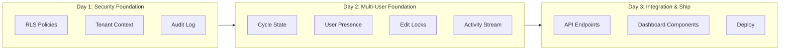
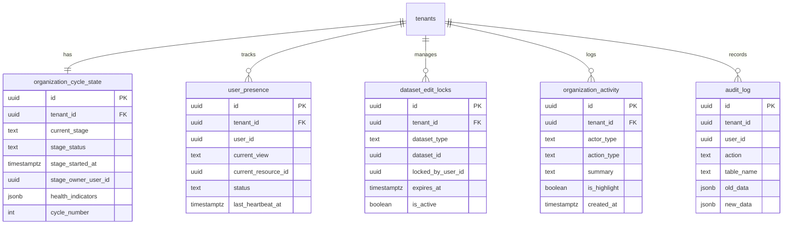
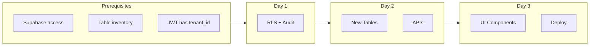
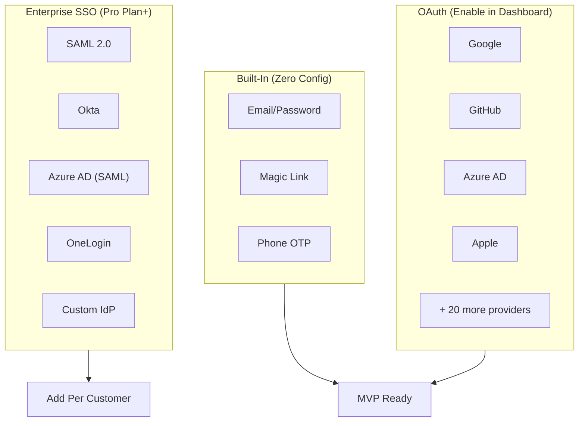
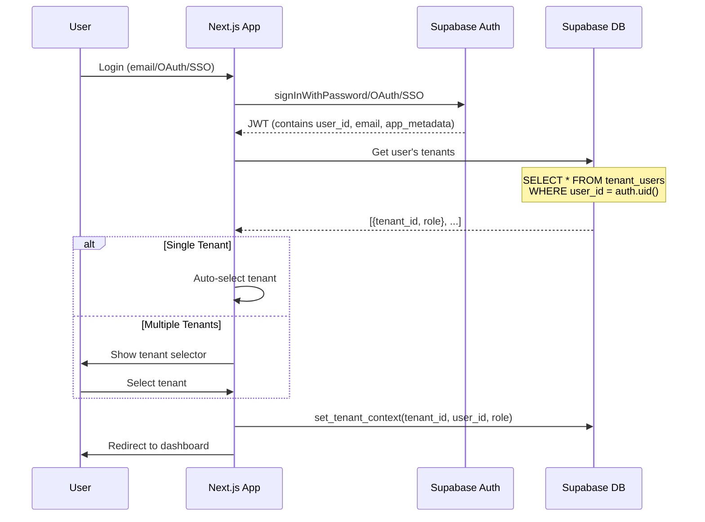
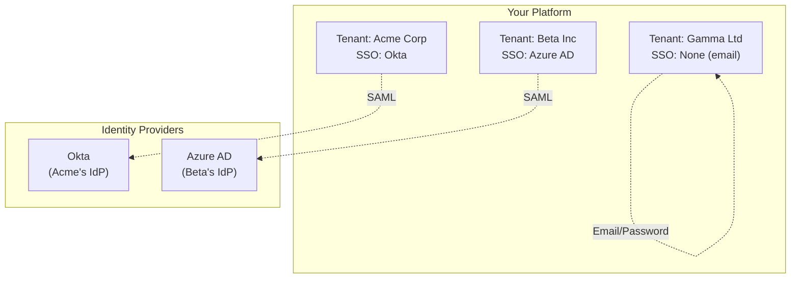
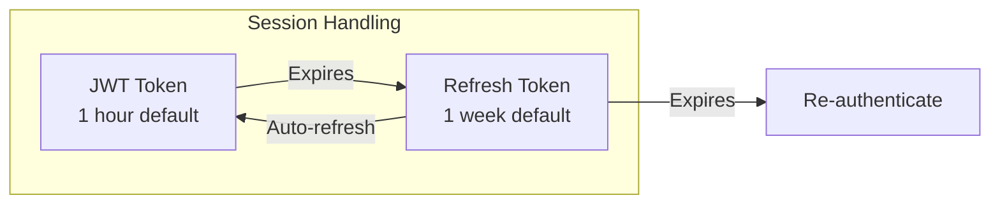

# Security + Multi-User MVP: PRD, PBS & WBS

## Platform Foundation - Combined Security & Collaboration Module

**Version:** 2.0.0  
**Date:** December 2025  
**Module:** PF-SEC-COLLAB-MVP  
**Total Effort:** 12-16 hours (3 days)  
**Prerequisites:** All templates and patterns pre-defined

---

# Part 1: Product Requirements Document (PRD)

## 1. Executive Summary

### 1.1 Purpose

Deliver foundational security (tenant isolation, audit) AND multi-user collaboration (cycle tracking, presence, edit coordination) in a single combined sprint. These capabilities are interdependent and share identical patterns.

### 1.2 Business Value

| Capability | Value |
|------------|-------|
| Tenant Isolation | Customer data protected at database level |
| Audit Trail | Incident investigation, compliance readiness |
| Cycle State | Organization knows where they are in AI Visibility journey |
| User Presence | Team awareness, reduced conflicts |
| Edit Locking | Prevent data loss from concurrent edits |
| Activity Feed | Transparency, collaboration context |

### 1.3 Success Criteria

| Metric | Target |
|--------|--------|
| RLS Coverage | 100% of tenant-scoped tables |
| Cross-Tenant Isolation | Zero data leakage in tests |
| Cycle State Tracking | All tenants have current stage visible |
| Edit Conflicts | Zero data loss from concurrent edits |
| Implementation Time | ≤3 days |

---

## 2. Scope

### 2.1 In Scope



### 2.2 Out of Scope (Post-MVP)

- Real-time WebSocket presence (polling sufficient)
- Field-level locking (document-level sufficient)
- Automated stage advancement (manual triggers)
- Email/push notifications (in-app only)
- Consultant cross-tenant access

---

## 3. Functional Requirements

### 3.1 Authentication Layer

| ID | Requirement |
|----|-------------|
| FR-AUTH-01 | System SHALL support email/password authentication via Supabase Auth |
| FR-AUTH-02 | System SHALL support Magic Link (passwordless) authentication |
| FR-AUTH-03 | System SHALL support Google OAuth for simplified signup/login |
| FR-AUTH-04 | System SHALL issue JWT tokens containing user_id and email |
| FR-AUTH-05 | System SHALL map authenticated users to tenants via `tenant_users` table |
| FR-AUTH-06 | System SHALL support users belonging to multiple tenants with different roles |
| FR-AUTH-07 | System SHALL provide tenant selector when user has multiple tenant memberships |
| FR-AUTH-08 | System architecture SHALL support future SAML SSO without modification |

### 3.2 Security Layer

| ID | Requirement |
|----|-------------|
| FR-SEC-01 | RLS enabled on ALL tables with tenant_id |
| FR-SEC-02 | `set_tenant_context(tenant_id, user_id, role)` function available |
| FR-SEC-03 | Context propagates via PostgreSQL session settings |
| FR-SEC-04 | `audit_log` captures INSERT/UPDATE/DELETE on core tables |
| FR-SEC-05 | Audit log is append-only (no UPDATE/DELETE allowed) |
| FR-SEC-06 | Tenants can only read their own audit records |

### 3.2 Cycle State Management

| ID | Requirement |
|----|-------------|
| FR-CYC-01 | Each tenant has exactly one `organization_cycle_state` record |
| FR-CYC-02 | Tracks current stage: discovery → audit → gap_analysis → ideation → planning → execution |
| FR-CYC-03 | Tracks stage status: not_started, in_progress, blocked, completed |
| FR-CYC-04 | `advance_cycle_stage()` function moves to next stage |
| FR-CYC-05 | Only owner/admin roles can advance stage |
| FR-CYC-06 | Stage changes logged to activity stream |

### 3.3 User Presence

| ID | Requirement |
|----|-------------|
| FR-PRE-01 | Track which users are currently online per tenant |
| FR-PRE-02 | Track current view/resource each user is on |
| FR-PRE-03 | Heartbeat updates presence (30-second interval) |
| FR-PRE-04 | Users offline after 2 minutes without heartbeat |
| FR-PRE-05 | API returns list of active users for tenant |

### 3.4 Edit Coordination

| ID | Requirement |
|----|-------------|
| FR-LOCK-01 | Users can acquire lock on dataset (type + id) |
| FR-LOCK-02 | Locks expire after 30 minutes |
| FR-LOCK-03 | Lock acquisition fails if already locked by another user |
| FR-LOCK-04 | Lock holder name returned when acquisition fails |
| FR-LOCK-05 | User can release lock explicitly |
| FR-LOCK-06 | Expired locks auto-released on next acquisition attempt |

### 3.5 Activity Stream

| ID | Requirement |
|----|-------------|
| FR-ACT-01 | Log actor (user/agent/system), action, target for key events |
| FR-ACT-02 | Human-readable summary for each activity |
| FR-ACT-03 | Highlight flag for dashboard-worthy events |
| FR-ACT-04 | Activity feed API returns recent items (paginated) |
| FR-ACT-05 | Tenants can only see their own activity |

---

## 4. Technical Requirements

### 4.1 Database

| ID | Requirement |
|----|-------------|
| TR-DB-01 | All new tables follow RLS pattern: `{table}_tenant` + `{table}_service` policies |
| TR-DB-02 | All tables use `tenant_id = current_setting('app.current_tenant_id', true)::UUID` |
| TR-DB-03 | Indexes on tenant_id + time for all queryable tables |
| TR-DB-04 | JSONB for flexible fields (health_indicators, details) |

### 4.2 API

| ID | Requirement |
|----|-------------|
| TR-API-01 | All endpoints call `set_tenant_context()` first |
| TR-API-02 | Presence heartbeat: `POST /api/presence` |
| TR-API-03 | Lock management: `POST/DELETE /api/locks` |
| TR-API-04 | Cycle state: `GET /api/cycle`, `POST /api/cycle/advance` |
| TR-API-05 | Activity feed: `GET /api/activity` |

---

## 5. User Stories

### 5.1 Authentication

| ID | Story |
|----|-------|
| US-A01 | As a new user, I want to sign up with email/password so I can access the platform |
| US-A02 | As a user, I want to sign in with Google so I don't need another password |
| US-A03 | As a user, I want to use Magic Link so I can sign in without remembering a password |
| US-A04 | As a user with multiple organizations, I want to switch between them easily |
| US-A05 | As an enterprise admin, I want my team to use our company SSO (future capability) |

### 5.2 Security

| ID | Story |
|----|-------|
| US-S01 | As Platform Owner, I want tenant data isolated at DB level so app bugs can't leak data |
| US-S02 | As Tenant Admin, I want audit logs so I can track who changed what |

### 5.2 Cycle Management

| ID | Story |
|----|-------|
| US-C01 | As Tenant Admin, I want to see current cycle stage so team knows what phase we're in |
| US-C02 | As Tenant Admin, I want to advance stages so we progress through the AI Visibility journey |
| US-C03 | As Team Member, I want to see health indicators so I know if we're on track |

### 5.3 Collaboration

| ID | Story |
|----|-------|
| US-L01 | As Analyst, I want to see who's online so I know who's available |
| US-L02 | As Analyst, I want to lock a gap analysis while editing so others don't overwrite my work |
| US-L03 | As Team Member, I want to see recent activity so I know what's happened |

---

## 6. Acceptance Criteria

### 6.1 Authentication

```gherkin
Scenario: Email/password signup
  Given a new user with valid email
  When user submits signup form
  Then account is created
  And confirmation email is sent

Scenario: Google OAuth login
  Given Google OAuth is enabled
  When user clicks "Sign in with Google"
  Then user is redirected to Google
  And upon success, JWT is issued

Scenario: Multi-tenant user login
  Given user belongs to Tenant A and Tenant B
  When user logs in
  Then tenant selector is displayed
  And selecting Tenant A sets context to Tenant A

Scenario: Single-tenant user login
  Given user belongs to only Tenant A
  When user logs in
  Then user is automatically directed to Tenant A dashboard
```

### 6.2 Security

```gherkin
Scenario: Cross-tenant isolation
  Given User A is in Tenant A
  When User A queries any table with Tenant B's ID
  Then zero rows are returned

Scenario: Audit log immutability
  Given an audit_log record exists
  When any user attempts UPDATE or DELETE
  Then the operation is blocked
```

### 6.2 Cycle State

```gherkin
Scenario: Stage advancement
  Given tenant is in "audit" stage
  And user has "admin" role
  When user calls advance_cycle_stage()
  Then stage becomes "gap_analysis"
  And activity is logged with is_highlight=true

Scenario: Non-admin cannot advance
  Given user has "member" role
  When user calls advance_cycle_stage()
  Then operation fails with "Permission denied"
```

### 6.3 Presence & Locking

```gherkin
Scenario: Lock acquisition
  Given no lock exists on gap_analysis:123
  When User A requests lock
  Then lock is granted to User A

Scenario: Lock conflict
  Given User A holds lock on gap_analysis:123
  When User B requests same lock
  Then User B receives "Locked by User A"
```

---

## 7. Data Model

### 7.1 Entity Relationship



---

# Part 2: Product Breakdown Structure (PBS)

## PBS Hierarchy

```mermaid
flowchart TB
    ROOT["PF-SEC-COLLAB-MVP<br/>Security + Multi-User MVP"]
    
    ROOT --> AUTH["PBS-1.0<br/>Auth Package"]
    ROOT --> SEC["PBS-2.0<br/>Security Package"]
    ROOT --> COLLAB["PBS-3.0<br/>Collaboration Package"]
    ROOT --> API["PBS-4.0<br/>API Package"]
    ROOT --> UI["PBS-5.0<br/>UI Package"]
    ROOT --> TEST["PBS-6.0<br/>Test Package"]
    
    AUTH --> AUTH1["PBS-1.1 Supabase Auth Config"]
    AUTH --> AUTH2["PBS-1.2 OAuth Setup"]
    AUTH --> AUTH3["PBS-1.3 Auth Middleware"]
    AUTH --> AUTH4["PBS-1.4 Tenant Assignment"]
    
    SEC --> SEC1["PBS-2.1 RLS Migration"]
    SEC --> SEC2["PBS-2.2 Context Function"]
    SEC --> SEC3["PBS-2.3 Audit Infrastructure"]
    
    COLLAB --> COL1["PBS-3.1 Cycle State Table"]
    COLLAB --> COL2["PBS-3.2 Presence Table"]
    COLLAB --> COL3["PBS-3.3 Locks Table"]
    COLLAB --> COL4["PBS-3.4 Activity Table"]
    COLLAB --> COL5["PBS-3.5 Stage Advance Function"]
    
    API --> API1["PBS-4.1 Context Middleware"]
    API --> API2["PBS-4.2 Presence Endpoints"]
    API --> API3["PBS-4.3 Lock Endpoints"]
    API --> API4["PBS-4.4 Cycle Endpoints"]
    API --> API5["PBS-4.5 Activity Endpoints"]
    
    UI --> UI1["PBS-5.1 Login/Signup Pages"]
    UI --> UI2["PBS-5.2 Tenant Selector"]
    UI --> UI3["PBS-5.3 Org Status Card"]
    UI --> UI4["PBS-5.4 Online Users Badge"]
    UI --> UI5["PBS-5.5 Activity Feed"]
    
    TEST --> TEST1["PBS-6.1 Auth Tests"]
    TEST --> TEST2["PBS-6.2 RLS Tests"]
    TEST --> TEST3["PBS-6.3 Integration Tests"]
```



## PBS Deliverables Table

| ID | Component | Deliverable | Format |
|----|-----------|-------------|--------|
| **PBS-1.0** | **Auth Package** | | |
| PBS-1.1 | Supabase Auth Config | Enable providers in dashboard | Config |
| PBS-1.2 | OAuth Setup | Google OAuth client credentials | Config |
| PBS-1.3 | Auth Middleware | `middleware/auth.ts` | TypeScript |
| PBS-1.4 | Tenant Assignment | User-tenant mapping logic | TypeScript |
| **PBS-2.0** | **Security Package** | | |
| PBS-2.1 | RLS Migration | Enable RLS + policies on all tables | SQL |
| PBS-2.2 | Context Function | `set_tenant_context()` | SQL |
| PBS-2.3 | Audit Infrastructure | Table + trigger + policies | SQL |
| **PBS-3.0** | **Collaboration Package** | | |
| PBS-3.1 | Cycle State Table | `organization_cycle_state` + RLS | SQL |
| PBS-3.2 | Presence Table | `user_presence` + RLS | SQL |
| PBS-3.3 | Locks Table | `dataset_edit_locks` + RLS | SQL |
| PBS-3.4 | Activity Table | `organization_activity` + RLS | SQL |
| PBS-3.5 | Stage Advance | `advance_cycle_stage()` | SQL |
| **PBS-4.0** | **API Package** | | |
| PBS-4.1 | Context Middleware | `setTenantContext.ts` | TypeScript |
| PBS-4.2 | Presence API | `/api/presence/*` | TypeScript |
| PBS-4.3 | Lock API | `/api/locks/*` | TypeScript |
| PBS-4.4 | Cycle API | `/api/cycle/*` | TypeScript |
| PBS-4.5 | Activity API | `/api/activity` | TypeScript |
| **PBS-5.0** | **UI Package** | | |
| PBS-5.1 | Login/Signup | `app/auth/*` pages | React |
| PBS-5.2 | Tenant Selector | `TenantSelector.tsx` | React |
| PBS-5.3 | Status Card | `OrgStatusCard.tsx` | React |
| PBS-5.4 | Online Badge | `OnlineUsers.tsx` | React |
| PBS-5.5 | Activity Feed | `ActivityFeed.tsx` | React |
| **PBS-6.0** | **Test Package** | | |
| PBS-6.1 | Auth Tests | Login/logout/OAuth flows | TypeScript |
| PBS-6.2 | RLS Tests | Cross-tenant isolation | SQL |
| PBS-6.3 | Integration | End-to-end flows | TypeScript |

---

# Part 3: Work Breakdown Structure (WBS)

## WBS Overview

```mermaid
gantt
    title Security + Multi-User MVP (3 Days)
    dateFormat HH:mm
    axisFormat %H:%M
    
    section Day 1 (6-7 hrs)
    Supabase Auth Config        :d1a, 09:00, 30m
    Google OAuth Setup          :d1b, after d1a, 15m
    RLS Migration               :d1c, after d1b, 1h
    Context Function            :d1d, after d1c, 30m
    Audit Infrastructure        :d1e, after d1d, 1h
    Apply to Supabase           :d1f, after d1e, 15m
    Auth + Context Middleware   :d1g, after d1f, 1h30m
    Integrate Routes            :d1h, after d1g, 1h
    
    section Day 2 (5-6 hrs)
    Cycle State Table           :d2a, 09:00, 30m
    Presence Table              :d2b, after d2a, 30m
    Locks Table                 :d2c, after d2b, 30m
    Activity Table              :d2d, after d2c, 30m
    Apply Migration             :d2e, after d2d, 15m
    Presence API                :d2f, after d2e, 1h
    Lock API                    :d2g, after d2f, 1h
    Cycle + Activity API        :d2h, after d2g, 1h
    
    section Day 3 (5-6 hrs)
    Login/Signup Pages          :d3a, 09:00, 1h30m
    Tenant Selector             :d3b, after d3a, 45m
    Org Status Card             :d3c, after d3b, 45m
    Online Users + Activity     :d3d, after d3c, 1h
    Integration Tests           :d3e, after d3d, 45m
    Deploy                      :d3f, after d3e, 30m
```



## WBS Detailed Tasks

### Day 1: Auth + Security Foundation

| WBS | Task | Effort | Output |
|-----|------|--------|--------|
| 1.1 | Configure Supabase Auth (email, magic link) | 15 min | Dashboard config |
| 1.2 | Enable Google OAuth, add credentials | 15 min | Dashboard config |
| 1.3 | Generate RLS statements for all tables | 45 min | SQL migration |
| 1.4 | Add `set_tenant_context()` function | 15 min | SQL migration |
| 1.5 | Add `audit_log` table + trigger | 45 min | SQL migration |
| 1.6 | Apply migration to Supabase | 15 min | Executed |
| 1.7 | Create auth middleware (JWT verify) | 45 min | `middleware/auth.ts` |
| 1.8 | Create tenant context middleware | 45 min | `middleware/tenantContext.ts` |
| 1.9 | Integrate middleware into all routes | 45 min | Updated route files |
| 1.10 | Run RLS isolation tests | 30 min | Test results |
| | **Day 1 Total** | **5-6 hrs** | |

### Day 2: Collaboration Foundation

| WBS | Task | Effort | Output |
|-----|------|--------|--------|
| 2.1 | Create `organization_cycle_state` + RLS | 30 min | SQL migration |
| 2.2 | Create `user_presence` + RLS | 20 min | SQL migration |
| 2.3 | Create `dataset_edit_locks` + RLS | 20 min | SQL migration |
| 2.4 | Create `organization_activity` + RLS | 20 min | SQL migration |
| 2.5 | Create `advance_cycle_stage()` function | 20 min | SQL migration |
| 2.6 | Apply migration to Supabase | 15 min | Executed |
| 2.7 | Build presence API (`/api/presence`) | 45 min | API routes |
| 2.8 | Build lock API (`/api/locks`) | 45 min | API routes |
| 2.9 | Build cycle API (`/api/cycle`) | 30 min | API routes |
| 2.10 | Build activity API (`/api/activity`) | 30 min | API routes |
| | **Day 2 Total** | **5-6 hrs** | |

### Day 3: UI & Ship

| WBS | Task | Effort | Output |
|-----|------|--------|--------|
| 3.1 | Build login page (email + Google) | 45 min | `app/auth/login/page.tsx` |
| 3.2 | Build signup page | 30 min | `app/auth/signup/page.tsx` |
| 3.3 | Build magic link request | 15 min | Component |
| 3.4 | Build tenant selector | 45 min | `TenantSelector.tsx` |
| 3.5 | Build `OrgStatusCard` component | 45 min | React component |
| 3.6 | Build `OnlineUsers` badge | 30 min | React component |
| 3.7 | Build `ActivityFeed` component | 45 min | React component |
| 3.8 | Add heartbeat hook | 20 min | `usePresence.ts` |
| 3.9 | Integration tests (auth + RLS) | 45 min | Test results |
| 3.10 | Deploy to production | 30 min | Live |
| | **Day 3 Total** | **5-6 hrs** | |

---

## WBS Checklist

### Day 1 Exit Criteria

```markdown
## Day 1 Checklist - Auth + Security

### Auth Configuration
- [ ] Supabase Auth enabled (email provider)
- [ ] Magic Link enabled
- [ ] Google OAuth configured (client ID + secret)
- [ ] Redirect URLs configured
- [ ] Email templates reviewed

### Security Database
- [ ] RLS enabled on ALL tenant-scoped tables
- [ ] RLS forced on ALL tenant-scoped tables  
- [ ] `set_tenant_context()` deployed and callable
- [ ] `audit_log` table created with RLS
- [ ] Audit trigger on `ontologies` table

### Middleware
- [ ] Auth middleware verifies JWT
- [ ] Auth middleware extracts user from session
- [ ] Context middleware fetches tenant membership
- [ ] Context middleware calls `set_tenant_context()`
- [ ] All API routes use both middlewares

### Tests
- [ ] Cross-tenant isolation test: PASS
- [ ] Audit immutability test: PASS
- [ ] Unauthenticated request blocked: PASS
```

### Day 2 Exit Criteria

```markdown
## Day 2 Checklist - Collaboration

### Database
- [ ] `organization_cycle_state` table + RLS
- [ ] `user_presence` table + RLS
- [ ] `dataset_edit_locks` table + RLS
- [ ] `organization_activity` table + RLS
- [ ] `advance_cycle_stage()` function works
- [ ] `acquire_edit_lock()` function works

### APIs
- [ ] `POST /api/presence` updates presence
- [ ] `GET /api/presence` returns active users
- [ ] `POST /api/locks` acquires lock
- [ ] `DELETE /api/locks/:id` releases lock
- [ ] `GET /api/cycle` returns current state
- [ ] `POST /api/cycle/advance` advances stage
- [ ] `GET /api/activity` returns feed
```

### Day 3 Exit Criteria

```markdown
## Day 3 Checklist - UI + Ship

### Auth UI
- [ ] Login page renders
- [ ] Email/password login works
- [ ] Google OAuth login works
- [ ] Magic link request works
- [ ] Logout works
- [ ] Signup creates account

### Tenant UI
- [ ] Multi-tenant user sees selector
- [ ] Single-tenant user auto-redirects
- [ ] Tenant switch updates context

### Dashboard UI
- [ ] Current cycle stage displayed
- [ ] Health indicators displayed
- [ ] "X users online" badge works
- [ ] Activity feed shows recent items
- [ ] Heartbeat running every 30s
- [ ] Lock conflict shows "Editing by X"

### Deployment
- [ ] All tests passing
- [ ] Environment variables set
- [ ] Deployed to production
- [ ] Smoke test in production: PASS
```

---

## Effort Summary

| Day | Focus | Hours |
|-----|-------|-------|
| Day 1 | Auth + Security (RLS, Context, Audit) | 5-6 |
| Day 2 | Collaboration (Tables, APIs) | 5-6 |
| Day 3 | UI (Auth + Dashboard) + Ship | 5-6 |
| **Total** | | **15-18 hrs** |

---

## Risk Register

| Risk | Probability | Impact | Mitigation |
|------|-------------|--------|------------|
| Missing table in RLS | Low | High | Automated audit query |
| Context not set on route | Medium | High | Middleware at top level |
| Lock not released | Low | Medium | 30-min auto-expiry |
| Heartbeat overloads DB | Low | Low | Upsert, not insert |

---

## Dependencies



---

## Appendix: Combined SQL Migration

```sql
-- ============================================================
-- SECURITY + MULTI-USER MVP - COMBINED MIGRATION
-- Run in Supabase SQL Editor
-- ============================================================

-- PART 1: SECURITY ============================================

-- 1.1 Context Function
CREATE OR REPLACE FUNCTION set_tenant_context(
    p_tenant_id UUID,
    p_user_id UUID DEFAULT NULL,
    p_user_role TEXT DEFAULT 'member'
) RETURNS VOID AS $$
BEGIN
    PERFORM set_config('app.current_tenant_id', p_tenant_id::TEXT, false);
    PERFORM set_config('app.user_id', COALESCE(p_user_id::TEXT, ''), false);
    PERFORM set_config('app.user_role', p_user_role, false);
END;
$$ LANGUAGE plpgsql SECURITY DEFINER;

GRANT EXECUTE ON FUNCTION set_tenant_context TO authenticated;

-- 1.2 Audit Log
CREATE TABLE IF NOT EXISTS audit_log (
    id UUID PRIMARY KEY DEFAULT gen_random_uuid(),
    tenant_id UUID,
    user_id UUID,
    action TEXT NOT NULL,
    table_name TEXT,
    record_id UUID,
    old_data JSONB,
    new_data JSONB,
    created_at TIMESTAMPTZ DEFAULT NOW()
);

CREATE INDEX IF NOT EXISTS idx_audit_tenant_time 
ON audit_log(tenant_id, created_at DESC);

ALTER TABLE audit_log ENABLE ROW LEVEL SECURITY;

DROP POLICY IF EXISTS audit_log_insert ON audit_log;
DROP POLICY IF EXISTS audit_log_read ON audit_log;

CREATE POLICY audit_log_insert ON audit_log 
FOR INSERT WITH CHECK (true);

CREATE POLICY audit_log_read ON audit_log 
FOR SELECT USING (
    tenant_id = current_setting('app.current_tenant_id', true)::UUID
    OR current_setting('app.user_role', true) = 'platform_owner'
);

-- 1.3 Audit Trigger
CREATE OR REPLACE FUNCTION audit_trigger_func() 
RETURNS TRIGGER AS $$
BEGIN
    IF TG_OP = 'INSERT' THEN
        INSERT INTO audit_log (tenant_id, user_id, action, table_name, record_id, new_data)
        VALUES (NEW.tenant_id, current_setting('app.user_id', true)::UUID, 
                'create', TG_TABLE_NAME, NEW.id, to_jsonb(NEW));
        RETURN NEW;
    ELSIF TG_OP = 'UPDATE' THEN
        INSERT INTO audit_log (tenant_id, user_id, action, table_name, record_id, old_data, new_data)
        VALUES (NEW.tenant_id, current_setting('app.user_id', true)::UUID,
                'update', TG_TABLE_NAME, NEW.id, to_jsonb(OLD), to_jsonb(NEW));
        RETURN NEW;
    ELSIF TG_OP = 'DELETE' THEN
        INSERT INTO audit_log (tenant_id, user_id, action, table_name, record_id, old_data)
        VALUES (OLD.tenant_id, current_setting('app.user_id', true)::UUID,
                'delete', TG_TABLE_NAME, OLD.id, to_jsonb(OLD));
        RETURN OLD;
    END IF;
END;
$$ LANGUAGE plpgsql;

-- PART 2: MULTI-USER ==========================================

-- 2.1 Organization Cycle State
CREATE TABLE IF NOT EXISTS organization_cycle_state (
    id UUID PRIMARY KEY DEFAULT gen_random_uuid(),
    tenant_id UUID NOT NULL REFERENCES tenants(id) ON DELETE CASCADE,
    current_stage TEXT NOT NULL DEFAULT 'discovery',
    stage_status TEXT NOT NULL DEFAULT 'not_started',
    stage_started_at TIMESTAMPTZ DEFAULT NOW(),
    stage_owner_user_id UUID,
    health_indicators JSONB DEFAULT '{
        "visibility_score": 0,
        "open_gaps": 0,
        "tasks_in_progress": 0,
        "tasks_overdue": 0
    }',
    cycle_number INTEGER DEFAULT 1,
    created_at TIMESTAMPTZ DEFAULT NOW(),
    updated_at TIMESTAMPTZ DEFAULT NOW(),
    CONSTRAINT valid_stage CHECK (current_stage IN 
        ('discovery','audit','gap_analysis','ideation','planning','execution')),
    CONSTRAINT valid_status CHECK (stage_status IN 
        ('not_started','in_progress','blocked','completed')),
    CONSTRAINT one_per_tenant UNIQUE (tenant_id)
);

ALTER TABLE organization_cycle_state ENABLE ROW LEVEL SECURITY;

CREATE POLICY org_cycle_tenant ON organization_cycle_state FOR ALL 
USING (tenant_id = current_setting('app.current_tenant_id', true)::UUID);

CREATE POLICY org_cycle_service ON organization_cycle_state FOR ALL 
TO service_role USING (true);

-- 2.2 User Presence
CREATE TABLE IF NOT EXISTS user_presence (
    id UUID PRIMARY KEY DEFAULT gen_random_uuid(),
    tenant_id UUID NOT NULL REFERENCES tenants(id) ON DELETE CASCADE,
    user_id UUID NOT NULL,
    user_name TEXT,
    current_view TEXT,
    current_resource_type TEXT,
    current_resource_id UUID,
    status TEXT DEFAULT 'online',
    last_heartbeat_at TIMESTAMPTZ DEFAULT NOW(),
    created_at TIMESTAMPTZ DEFAULT NOW(),
    CONSTRAINT one_presence_per_user UNIQUE (tenant_id, user_id)
);

CREATE INDEX idx_presence_tenant ON user_presence(tenant_id, status);
CREATE INDEX idx_presence_heartbeat ON user_presence(last_heartbeat_at);

ALTER TABLE user_presence ENABLE ROW LEVEL SECURITY;

CREATE POLICY presence_tenant ON user_presence FOR ALL 
USING (tenant_id = current_setting('app.current_tenant_id', true)::UUID);

CREATE POLICY presence_service ON user_presence FOR ALL 
TO service_role USING (true);

-- 2.3 Dataset Edit Locks
CREATE TABLE IF NOT EXISTS dataset_edit_locks (
    id UUID PRIMARY KEY DEFAULT gen_random_uuid(),
    tenant_id UUID NOT NULL REFERENCES tenants(id) ON DELETE CASCADE,
    dataset_type TEXT NOT NULL,
    dataset_id UUID NOT NULL,
    locked_by_user_id UUID NOT NULL,
    locked_by_user_name TEXT,
    locked_at TIMESTAMPTZ DEFAULT NOW(),
    expires_at TIMESTAMPTZ DEFAULT NOW() + INTERVAL '30 minutes',
    is_active BOOLEAN DEFAULT TRUE,
    CONSTRAINT unique_active_lock UNIQUE (tenant_id, dataset_type, dataset_id)
);

CREATE INDEX idx_locks_lookup ON dataset_edit_locks(tenant_id, dataset_type, dataset_id) 
WHERE is_active = true;

ALTER TABLE dataset_edit_locks ENABLE ROW LEVEL SECURITY;

CREATE POLICY locks_tenant ON dataset_edit_locks FOR ALL 
USING (tenant_id = current_setting('app.current_tenant_id', true)::UUID);

CREATE POLICY locks_service ON dataset_edit_locks FOR ALL 
TO service_role USING (true);

-- 2.4 Organization Activity
CREATE TABLE IF NOT EXISTS organization_activity (
    id UUID PRIMARY KEY DEFAULT gen_random_uuid(),
    tenant_id UUID NOT NULL REFERENCES tenants(id) ON DELETE CASCADE,
    actor_type TEXT NOT NULL,
    actor_id TEXT,
    actor_name TEXT,
    action_type TEXT NOT NULL,
    action_category TEXT NOT NULL,
    target_type TEXT,
    target_id UUID,
    target_name TEXT,
    summary TEXT NOT NULL,
    details JSONB,
    is_highlight BOOLEAN DEFAULT FALSE,
    created_at TIMESTAMPTZ DEFAULT NOW()
);

CREATE INDEX idx_activity_feed ON organization_activity(tenant_id, created_at DESC);
CREATE INDEX idx_activity_highlights ON organization_activity(tenant_id, is_highlight, created_at DESC) 
WHERE is_highlight = true;

ALTER TABLE organization_activity ENABLE ROW LEVEL SECURITY;

CREATE POLICY activity_tenant ON organization_activity FOR ALL 
USING (tenant_id = current_setting('app.current_tenant_id', true)::UUID);

CREATE POLICY activity_service ON organization_activity FOR ALL 
TO service_role USING (true);

-- 2.5 Advance Cycle Stage Function
CREATE OR REPLACE FUNCTION advance_cycle_stage(
    p_tenant_id UUID, 
    p_user_id UUID
) RETURNS TABLE (success BOOLEAN, new_stage TEXT, message TEXT) AS $$
DECLARE
    v_current TEXT;
    v_next TEXT;
    v_role TEXT;
    v_user_name TEXT;
BEGIN
    -- Get current stage
    SELECT current_stage INTO v_current 
    FROM organization_cycle_state 
    WHERE tenant_id = p_tenant_id;
    
    -- Get user role and name
    SELECT tu.role, COALESCE(u.raw_user_meta_data->>'name', u.email)
    INTO v_role, v_user_name
    FROM tenant_users tu
    JOIN auth.users u ON u.id = tu.user_id
    WHERE tu.tenant_id = p_tenant_id AND tu.user_id = p_user_id;
    
    -- Check permission
    IF v_role NOT IN ('owner', 'admin') THEN
        RETURN QUERY SELECT FALSE, v_current, 'Only owners and admins can advance stage'::TEXT;
        RETURN;
    END IF;
    
    -- Determine next stage
    v_next := CASE v_current
        WHEN 'discovery' THEN 'audit'
        WHEN 'audit' THEN 'gap_analysis'
        WHEN 'gap_analysis' THEN 'ideation'
        WHEN 'ideation' THEN 'planning'
        WHEN 'planning' THEN 'execution'
        WHEN 'execution' THEN 'audit'
        ELSE 'discovery'
    END;
    
    -- Update stage
    UPDATE organization_cycle_state 
    SET current_stage = v_next,
        stage_status = 'not_started',
        stage_started_at = NOW(),
        stage_owner_user_id = p_user_id,
        updated_at = NOW(),
        cycle_number = CASE WHEN v_current = 'execution' THEN cycle_number + 1 ELSE cycle_number END
    WHERE tenant_id = p_tenant_id;
    
    -- Log activity
    INSERT INTO organization_activity (
        tenant_id, actor_type, actor_id, actor_name,
        action_type, action_category, summary, is_highlight
    ) VALUES (
        p_tenant_id, 'user', p_user_id::TEXT, v_user_name,
        'stage_advanced', 'cycle', 
        'Advanced to ' || v_next || ' stage',
        TRUE
    );
    
    RETURN QUERY SELECT TRUE, v_next, ('Advanced to ' || v_next)::TEXT;
END;
$$ LANGUAGE plpgsql SECURITY DEFINER;

-- 2.6 Lock Acquisition Function
CREATE OR REPLACE FUNCTION acquire_edit_lock(
    p_tenant_id UUID,
    p_user_id UUID,
    p_user_name TEXT,
    p_dataset_type TEXT,
    p_dataset_id UUID
) RETURNS TABLE (success BOOLEAN, lock_id UUID, message TEXT, locked_by TEXT) AS $$
DECLARE
    v_existing RECORD;
    v_new_id UUID;
BEGIN
    -- Clean expired locks
    DELETE FROM dataset_edit_locks 
    WHERE tenant_id = p_tenant_id 
      AND expires_at < NOW();
    
    -- Check for existing lock
    SELECT id, locked_by_user_id, locked_by_user_name, expires_at
    INTO v_existing
    FROM dataset_edit_locks
    WHERE tenant_id = p_tenant_id
      AND dataset_type = p_dataset_type
      AND dataset_id = p_dataset_id
      AND is_active = true;
    
    IF FOUND THEN
        IF v_existing.locked_by_user_id = p_user_id THEN
            -- Extend own lock
            UPDATE dataset_edit_locks 
            SET expires_at = NOW() + INTERVAL '30 minutes'
            WHERE id = v_existing.id;
            RETURN QUERY SELECT TRUE, v_existing.id, 'Lock extended'::TEXT, p_user_name;
        ELSE
            -- Conflict
            RETURN QUERY SELECT FALSE, NULL::UUID, 
                ('Locked by ' || v_existing.locked_by_user_name)::TEXT,
                v_existing.locked_by_user_name;
        END IF;
    ELSE
        -- Create new lock
        INSERT INTO dataset_edit_locks (
            tenant_id, dataset_type, dataset_id, 
            locked_by_user_id, locked_by_user_name
        ) VALUES (
            p_tenant_id, p_dataset_type, p_dataset_id,
            p_user_id, p_user_name
        ) RETURNING id INTO v_new_id;
        
        RETURN QUERY SELECT TRUE, v_new_id, 'Lock acquired'::TEXT, p_user_name;
    END IF;
END;
$$ LANGUAGE plpgsql SECURITY DEFINER;

-- PART 3: VERIFICATION ========================================

-- Check RLS enabled
SELECT tablename, rowsecurity 
FROM pg_tables 
WHERE schemaname = 'public' 
  AND tablename IN (
    'audit_log', 'organization_cycle_state', 
    'user_presence', 'dataset_edit_locks', 
    'organization_activity'
);

-- Check functions
SELECT proname FROM pg_proc 
WHERE proname IN (
    'set_tenant_context', 'advance_cycle_stage', 
    'acquire_edit_lock', 'audit_trigger_func'
);
```

---

## Appendix B: Authentication Strategy

### B.1 Supabase Auth Capabilities

Supabase provides authentication out-of-the-box. Understanding what's available prevents over-engineering.



### B.2 MVP Authentication Scope

| Method | MVP Status | Effort | Notes |
|--------|------------|--------|-------|
| Email/Password | ✅ Include | 0 hrs | Built-in, just enable |
| Magic Link | ✅ Include | 0 hrs | Built-in, good UX |
| Google OAuth | ✅ Include | 15 min | Enable in dashboard, add client ID |
| GitHub OAuth | ⚪ Optional | 15 min | Enable if developer audience |
| Microsoft OAuth | ⚪ Optional | 15 min | Enable if enterprise audience |
| SAML SSO | ❌ Post-MVP | 1-2 hrs/customer | Add when customer requires |
| Phone OTP | ❌ Post-MVP | 30 min | Requires SMS provider setup |

### B.3 Authentication Flow with Tenant Context



### B.4 JWT Structure

Supabase JWTs contain user information automatically:

```json
{
  "aud": "authenticated",
  "exp": 1703289600,
  "sub": "user-uuid-here",
  "email": "user@company.com",
  "app_metadata": {
    "provider": "google",
    "providers": ["google"]
  },
  "user_metadata": {
    "name": "John Smith",
    "avatar_url": "https://..."
  },
  "role": "authenticated"
}
```

For SSO users, additional fields:
```json
{
  "amr": [{"method": "sso/saml", "timestamp": 1703289000}],
  "app_metadata": {
    "provider": "sso:provider-uuid",
    "sso_provider_id": "provider-uuid"
  }
}
```

### B.5 Multi-Tenant SSO Architecture

When enterprise customers require SSO, each gets their own SAML configuration:



**Key Point:** `sso_provider_id` in JWT maps to tenant, enabling RLS to work automatically.

### B.6 SSO Setup Process (When Needed)

```bash
# 1. Enable SAML in Supabase Dashboard (Auth > Providers > SAML 2.0)

# 2. Add customer's IdP via CLI
supabase sso add \
  --project-ref your-project \
  --type saml \
  --metadata-url "https://customer.okta.com/app/.../sso/saml/metadata" \
  --domains "customer.com"

# 3. Share ACS URL with customer
supabase sso info --project-ref your-project
# Returns: ACS URL, Metadata URL for customer to configure
```

**Effort:** 1-2 hours per enterprise customer (mostly waiting for their IT team).

### B.7 Authentication Caveats & Considerations

#### Caveat 1: Plan Requirements

| Feature | Free | Pro ($25/mo) | Team | Enterprise |
|---------|------|--------------|------|------------|
| Email/Password | ✅ | ✅ | ✅ | ✅ |
| OAuth Providers | ✅ | ✅ | ✅ | ✅ |
| Magic Link | ✅ | ✅ | ✅ | ✅ |
| SAML SSO | ❌ | ✅ | ✅ | ✅ |
| Custom SMTP | ❌ | ✅ | ✅ | ✅ |

**MVP Implication:** Need Pro plan ($25/mo) for custom SMTP and future SSO.

#### Caveat 2: SSO User Limitations

SSO users behave differently:

| Behavior | Regular User | SSO User |
|----------|--------------|----------|
| Password reset | ✅ Available | ❌ Managed by IdP |
| Email change | ✅ Available | ❌ Managed by IdP |
| Account linking | ✅ Automatic | ❌ No auto-linking |
| MFA | ✅ Supabase MFA | ❌ IdP handles MFA |

**Implication:** Don't build password reset UI for SSO users.

#### Caveat 3: Session Management



**Configurable in Dashboard:** Auth > Settings > JWT expiry

#### Caveat 4: Tenant Assignment for New Users

New users need tenant assignment. Options:

| Approach | Use Case | Implementation |
|----------|----------|----------------|
| Invite-only | B2B SaaS | Admin sends invite with tenant_id |
| Self-signup + new tenant | Freemium | Auto-create tenant on signup |
| Domain matching | Enterprise SSO | Match email domain to tenant |
| Manual assignment | Hybrid | Admin assigns after signup |

**MVP Recommendation:** Invite-only for controlled onboarding.

#### Caveat 5: RLS and Auth Integration

The `set_tenant_context()` function must be called AFTER authentication:

```typescript
// middleware/auth.ts
export async function withTenantContext(req: Request) {
  // 1. Verify JWT
  const { data: { user }, error } = await supabase.auth.getUser();
  if (error || !user) throw new AuthError('Not authenticated');
  
  // 2. Get user's tenant and role
  const { data: membership } = await supabase
    .from('tenant_users')
    .select('tenant_id, role')
    .eq('user_id', user.id)
    .single();
  
  if (!membership) throw new AuthError('No tenant access');
  
  // 3. Set context for RLS
  await supabase.rpc('set_tenant_context', {
    p_tenant_id: membership.tenant_id,
    p_user_id: user.id,
    p_user_role: membership.role
  });
  
  return { user, tenant: membership };
}
```

### B.8 Authentication Implementation Checklist

```markdown
## MVP Auth Checklist

### Dashboard Configuration (15 min)
- [ ] Enable Email provider
- [ ] Enable Google OAuth (add client ID/secret)
- [ ] Configure Site URL and Redirect URLs
- [ ] Set JWT expiry (recommend: 1 hour)
- [ ] Configure email templates (optional)

### Database (Already in Migration)
- [ ] tenant_users table exists with user_id, tenant_id, role
- [ ] RLS policies reference auth.uid()

### Frontend (2-3 hours)
- [ ] Login page with email/password
- [ ] Google OAuth button
- [ ] Magic link option
- [ ] Tenant selector (if multi-tenant user)
- [ ] Logout functionality

### Backend (Already in Migration)
- [ ] set_tenant_context() function
- [ ] Context middleware calls function on every request
```

### B.9 Future SSO Roadmap

| Trigger | Action | Effort |
|---------|--------|--------|
| First enterprise customer requests SSO | Enable SAML in dashboard | 5 min |
| Customer provides IdP metadata | Configure via CLI | 30 min |
| Customer tests SSO login | Debug with customer IT | 1-2 hrs |
| Second enterprise customer | Repeat CLI setup | 30 min |
| 10+ SSO customers | Consider admin UI for self-service | 8-16 hrs |

---

## Appendix C: Security & Auth Quick Reference

### C.1 Environment Variables

```bash
# .env.local
NEXT_PUBLIC_SUPABASE_URL=https://xxx.supabase.co
NEXT_PUBLIC_SUPABASE_ANON_KEY=eyJ...
SUPABASE_SERVICE_ROLE_KEY=eyJ...  # Server-side only, never expose

# OAuth (configured in Supabase Dashboard, not env vars)
# Google Client ID/Secret → Dashboard > Auth > Providers > Google
```

### C.2 Auth Helper Functions

```typescript
// lib/auth.ts
import { createClient } from '@supabase/supabase-js';

// Client-side (uses anon key, respects RLS)
export const supabase = createClient(
  process.env.NEXT_PUBLIC_SUPABASE_URL!,
  process.env.NEXT_PUBLIC_SUPABASE_ANON_KEY!
);

// Server-side (uses service role, bypasses RLS)
export const supabaseAdmin = createClient(
  process.env.NEXT_PUBLIC_SUPABASE_URL!,
  process.env.SUPABASE_SERVICE_ROLE_KEY!
);

// Sign in
await supabase.auth.signInWithPassword({ email, password });
await supabase.auth.signInWithOAuth({ provider: 'google' });
await supabase.auth.signInWithOtp({ email }); // Magic link

// Sign out
await supabase.auth.signOut();

// Get current user
const { data: { user } } = await supabase.auth.getUser();

// Listen for auth changes
supabase.auth.onAuthStateChange((event, session) => {
  if (event === 'SIGNED_IN') { /* handle */ }
  if (event === 'SIGNED_OUT') { /* handle */ }
});
```

### C.3 RLS + Auth Integration

```sql
-- RLS policy using Supabase auth
CREATE POLICY "Users can view own data" ON some_table
FOR SELECT USING (
  user_id = auth.uid()  -- Built-in function, returns current user's UUID
);

-- RLS policy using our context (for tenant isolation)
CREATE POLICY "Tenant isolation" ON some_table
FOR ALL USING (
  tenant_id = current_setting('app.current_tenant_id', true)::UUID
);
```

---

*End of PRD, PBS, WBS*
