# PASO: TDD-Driven Agent Security Orchestration
## Visual Explanations with Mermaid Diagrams

---

## 1. The Core Concept: TDD for Agents

```mermaid
graph LR
    A[Traditional Approach] --> B[Build Agent]
    B --> C[Deploy]
    C --> D[Hope It Works]
    D --> E[❌ Problems in Production]
    
    F[TDD Approach] --> G[Write Tests First]
    G --> H[Define Competency Requirements]
    H --> I[Build Agent to Pass Tests]
    I --> J[Validate Continuously]
    J --> K[✅ Proven Competent]
    
    style E fill:#e74c3c,color:#fff
    style K fill:#2ecc71,color:#fff
```

---

## 2. TDD Agent Lifecycle

---

## 3. Agent Security Orchestration Architecture

---

## 4. TDD Test Hierarchy

---

## 5. Agent Registration Flow (TDD)

```mermaid
sequenceDiagram
    participant Dev as Developer
    participant Agent as New Agent
    participant PASO as PASO Registry
    participant TDD as TDD Engine
    participant Policy as Policy Engine
    
    Dev->>Agent: Define Agent (JSON-LD)
    Agent->>PASO: Register Agent
    
    PASO->>PASO: Validate JSON Schema
    
    alt Schema Invalid
        PASO-->>Agent: ❌ Reject (Schema Error)
        Agent-->>Dev: Fix Schema
    else Schema Valid
        PASO->>TDD: Run Test Suite
        
        TDD->>TDD: Functional Tests
        TDD->>TDD: Security Tests
        TDD->>TDD: Compliance Tests
        
        alt Tests Fail
            TDD-->>PASO: ❌ Test Failures
            PASO-->>Agent: Reject with Report
            Agent-->>Dev: Fix Issues
        else Tests Pass
            TDD->>Policy: Validate Policies
            
            alt Policy Violation
                Policy-->>TDD: ❌ Policy Issues
                TDD-->>PASO: Conditional Approval
                PASO-->>Agent: Requires Review
            else Policy OK
                Policy->>PASO: ✅ Approved
                PASO->>PASO: Calculate Risk Score
                PASO->>PASO: Assign Security Profile
                PASO-->>Agent: ✅ Registered
                Agent-->>Dev: Deployment Ready
            end
        end
    end
```

---

## 6. Agent Risk Assessment

---

## 7. Security Policy Enforcement

```mermaid
flowchart TD
    Request[Agent Action Request] --> Auth{Authenticated?}
    
    Auth -->|No| Reject1[❌ Reject: Auth Required]
    Auth -->|Yes| CheckPolicy[Check Security Policy]
    
    CheckPolicy --> DataPolicy{Data Access<br/>Allowed?}
    
    DataPolicy -->|No| Reject2[❌ Reject: No Permission]
    DataPolicy -->|Yes| CheckControls[Check Security Controls]
    
    CheckControls --> Input{Input<br/>Validated?}
    Input -->|No| Reject3[❌ Reject: Invalid Input]
    Input -->|Yes| RateLimit{Rate Limit<br/>OK?}
    
    RateLimit -->|No| Reject4[❌ Reject: Rate Limited]
    RateLimit -->|Yes| Context{Contextual<br/>Rules Met?}
    
    Context -->|No| Escalate[⚠️ Human Review Required]
    Context -->|Yes| Compliance{Compliance<br/>Validated?}
    
    Compliance -->|No| Reject5[❌ Reject: Compliance Issue]
    Compliance -->|Yes| Execute[✅ Execute Action]
    
    Execute --> Audit[Log to Audit Trail]
    Audit --> Monitor[Real-time Monitoring]
    
    Escalate --> HumanDecision{Human<br/>Approves?}
    HumanDecision -->|Yes| Execute
    HumanDecision -->|No| Reject6[❌ Rejected by Human]
    
    style Reject1 fill:#e74c3c,color:#fff
    style Reject2 fill:#e74c3c,color:#fff
    style Reject3 fill:#e74c3c,color:#fff
    style Reject4 fill:#e74c3c,color:#fff
    style Reject5 fill:#e74c3c,color:#fff
    style Reject6 fill:#e74c3c,color:#fff
    style Execute fill:#2ecc71,color:#fff
    style Escalate fill:#f39c12,color:#fff
```

---

## 8. Compliance Validation Flow

---

## 9. Knowledge Graph Relationships

---

## 10. Privilege Escalation Detection

```mermaid
graph TD
    Start[Low Risk Agent<br/>Risk: 25] --> Check[Analyze Call Graph]
    
    Check --> Path1[Direct Path]
    Check --> Path2[2-Hop Path]
    Check --> Path3[3-Hop Path]
    
    Path1 --> A1[Calls: Email Agent<br/>Risk: 15]
    Path1 --> Result1[No Escalation ✅]
    
    Path2 --> A2[Calls: CRM Agent<br/>Risk: 35]
    A2 --> A3[Calls: Admin Agent<br/>Risk: 85]
    Path2 --> Result2[⚠️ Escalation Found<br/>Delta: +60]
    
    Path3 --> A4[Calls: Calendar Agent<br/>Risk: 20]
    A4 --> A5[Calls: Data Agent<br/>Risk: 40]
    A5 --> A6[Calls: Financial Agent<br/>Risk: 90]
    Path3 --> Result3[🔴 Critical Path<br/>Delta: +65]
    
    Result2 --> Alert1[Generate Alert]
    Result3 --> Alert2[Block & Escalate]
    
    Alert1 --> Remediate[Add Security Control]
    Alert2 --> Review[Human Review Required]
    
    style Start fill:#2ecc71,color:#fff
    style A3 fill:#e74c3c,color:#fff
    style A6 fill:#e74c3c,color:#fff
    style Result2 fill:#f39c12,color:#fff
    style Result3 fill:#e74c3c,color:#fff
    style Alert2 fill:#e74c3c,color:#fff
```

---

## 11. Continuous Monitoring & Testing

```mermaid
sequenceDiagram
    participant Agent
    participant Monitor as Monitoring System
    participant TDD as TDD Engine
    participant Alert as Alert System
    participant Human
    
    loop Every 15 Minutes
        Monitor->>Agent: Health Check
        Agent-->>Monitor: Status OK
    end
    
    loop Every Hour
        Monitor->>TDD: Run Security Tests
        TDD->>Agent: Execute Test Suite
        Agent-->>TDD: Test Results
        
        alt Tests Pass
            TDD-->>Monitor: ✅ All Tests Pass
        else Tests Fail
            TDD-->>Monitor: ❌ Test Failures
            Monitor->>Alert: Trigger Alert
            Alert->>Human: Notify: Agent Failing Tests
            Human->>Agent: Investigate & Fix
        end
    end
    
    loop Every 6 Hours
        Monitor->>TDD: Compliance Validation
        TDD->>Agent: Check Standards
        
        alt Still Compliant
            TDD-->>Monitor: ✅ Compliant
        else Violation Detected
            TDD-->>Monitor: ❌ Violation Found
            Monitor->>Alert: Critical Alert
            Alert->>Human: Compliance Issue
            Human->>Agent: Immediate Review
        end
    end
    
    Agent->>Monitor: Action Executed
    Monitor->>Monitor: Log to Audit Trail
    Monitor->>Monitor: Real-time Analysis
    
    alt Anomaly Detected
        Monitor->>Alert: Behavioral Anomaly
        Alert->>Human: Review Required
    end
```

---

## 12. TDD Value Proposition

---

## 13. Complete System Overview

```mermaid
graph TB
    subgraph Input["Input Layer"]
        Dev[Developer]
        AgentDef[Agent Definition<br/>JSON-LD]
    end
    
    subgraph PASO["PASO Security Orchestrator"]
        direction TB
        
        Registry[(Agent Registry<br/>Supabase)]
        
        subgraph TDD["TDD Engine"]
            T1[Test Suite Generator]
            T2[Automated Testing]
            T3[Standards Validator]
        end
        
        subgraph Policy["Policy Engine"]
            P1[Policy Rules]
            P2[Access Control]
            P3[Behavioral Limits]
        end
        
        subgraph Analysis["Analysis Engine"]
            An1[Risk Calculator]
            An2[Graph Analyzer]
            An3[Compliance Checker]
        end
        
        Registry --> TDD
        TDD --> Policy
        Policy --> Analysis
    end
    
    subgraph Visualization["Visualization Layer"]
        V1[Interactive Graphs<br/>D3.js/Vis.js]
        V2[Risk Dashboard]
        V3[Compliance Reports]
    end
    
    subgraph Output["Outputs"]
        O1[✅ Approved Agents]
        O2[📊 Security Reports]
        O3[⚠️ Alerts & Escalations]
        O4[📝 Audit Trails]
    end
    
    subgraph Standards["Reference Standards"]
        S1[OWASP Top 10]
        S2[GDPR Articles]
        S3[SOC2 Controls]
        S4[MCSB Benchmarks]
        S5[OAA Ontology]
    end
    
    Dev --> AgentDef
    AgentDef --> Registry
    
    Analysis --> Visualization
    Visualization --> Output
    
    TDD -.validates against.-> Standards
    Analysis -.references.-> Standards
    
    style PASO fill:#3498db,color:#fff
    style TDD fill:#e67e22,color:#fff
    style Analysis fill:#9b59b6,color:#fff
    style Standards fill:#1abc9c,color:#fff
    style Output fill:#2ecc71,color:#fff
```

---

## 14. ROI Comparison

---

## Usage Instructions

### In Markdown Files
Simply paste the Mermaid code blocks directly into your markdown:

\`\`\`mermaid
graph TD
    A[Start] --> B[End]
\`\`\`

### In GitHub
GitHub renders Mermaid natively in README files and issues.

### In Notion
Use the `/code` block and select "Mermaid" as the language.

### Online Editor
Paste into https://mermaid.live for interactive editing and export to PNG/SVG.

### In Documentation
Most modern documentation platforms (GitBook, Docusaurus, MkDocs) support Mermaid.

---

## Key Concepts Visualized

1. **TDD Lifecycle** - How test-driven development works for agents
2. **Security Orchestration** - Complete architecture overview
3. **Risk Assessment** - How risk scores are calculated
4. **Policy Enforcement** - Runtime security checks
5. **Compliance Validation** - Standards verification
6. **Knowledge Graphs** - Agent relationships
7. **Privilege Escalation** - Threat detection
8. **Continuous Monitoring** - Ongoing validation
9. **Value Proposition** - Business benefits
10. **Complete System** - End-to-end view
11. **ROI Comparison** - Before/after metrics

These diagrams explain the entire TDD-driven agent security orchestration concept in visual, easy-to-understand formats.
