# PF Figma: CI/CD & Hosting Strategy
## MVP Deployment Infrastructure for Agentic Front-End Development

**Document:** PF-Figma-CICD-Hosting-Strategy  
**Version:** 1.0  
**Date:** November 2025  
**Purpose:** Define hosting platforms and CI/CD pipelines for MVP deployment  

---

## Table of Contents

1. [Executive Summary](#1-executive-summary)
2. [Top 3 MVP Hosting Platforms](#2-top-3-mvp-hosting-platforms)
3. [GitHub-Centric CI/CD Architecture](#3-github-centric-cicd-architecture)
4. [DigitalOcean App Platform Strategy](#4-digitalocean-app-platform-strategy)
5. [Vercel Deployment Strategy](#5-vercel-deployment-strategy)
6. [Railway Deployment Strategy](#6-railway-deployment-strategy)
7. [Claude Agent Integration](#7-claude-agent-integration)
8. [Environment Management](#8-environment-management)
9. [Comparative Analysis & Recommendation](#9-comparative-analysis--recommendation)
10. [Implementation Roadmap](#10-implementation-roadmap)
11. [Appendices](#appendices)

---

## 1. Executive Summary

This document establishes the CI/CD and hosting strategy for PF Figma MVP deployments, with GitHub as the central code repository and CI/CD orchestrator. Claude Code agents will manage the entire development-to-deployment pipeline, integrating seamlessly with chosen hosting platforms.

**Strategic Objectives:**
- GitHub as single source of truth for all code
- Automated deployment pipelines for Dev → Test → Prod
- Claude agents orchestrate development and deployment
- Test-Driven Development (TDD) enforced at all stages
- Minimal infrastructure management overhead for MVP phase

**Recommended MVP Host:** DigitalOcean App Platform (primary) or Vercel (alternative)

---

## 2. Top 3 MVP Hosting Platforms

### 2.1 Platform Comparison Matrix

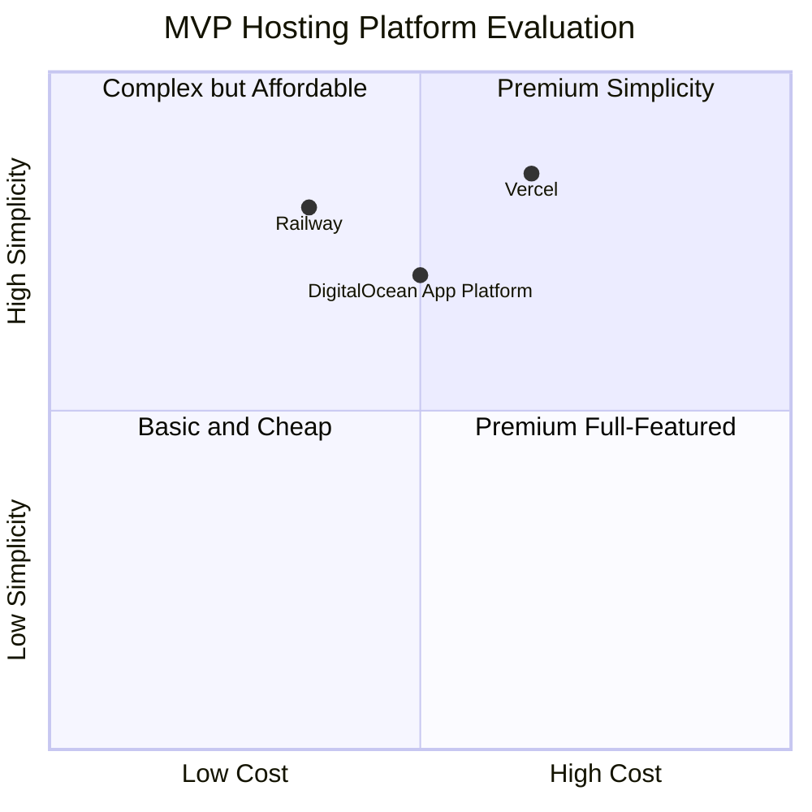

### 2.2 Platform 1: DigitalOcean App Platform

**Overview:**
Platform-as-a-Service built on DigitalOcean infrastructure with GitHub-native deployments, App Spec configuration, and managed resources.

**Key Strengths:**
- Native GitHub Actions integration via `digitalocean/app_action`
- App Spec YAML for Infrastructure-as-Code
- Managed databases (PostgreSQL)
- Straightforward pricing model
- Container and buildpack support
- Static IP available for integrations
- Familiar developer experience

**Pricing (2025):**
- Basic: $5/month (512MB RAM, 1 vCPU)
- Professional: $12/month (1GB RAM, 1 vCPU)
- Managed PostgreSQL: From $15/month
- Bandwidth: $0.01/GB after 1TB

**Best For:**
- Teams wanting production-ready infrastructure
- Projects requiring managed databases
- Organizations already in DigitalOcean ecosystem
- Applications needing static IPs for third-party integrations

### 2.3 Platform 2: Vercel

**Overview:**
Frontend-optimized platform with edge network, built specifically for Next.js with global CDN and serverless functions.

**Key Strengths:**
- Native Next.js support (Vercel created Next.js)
- Global edge network for fast deployments
- Preview deployments for every PR
- Automatic HTTPS and CDN
- Zero-config deployments
- Excellent developer experience
- Edge functions for dynamic content

**Pricing (2025):**
- Hobby: Free (100GB bandwidth, personal use)
- Pro: $20/user/month
- Enterprise: Custom pricing
- Serverless functions: Pay-per-invocation

**Best For:**
- Next.js/React applications
- Frontend-heavy projects
- Teams prioritizing deployment speed
- Projects requiring global edge distribution

### 2.4 Platform 3: Railway

**Overview:**
Developer-centric PaaS with magical setup process, usage-based pricing, and built-in database support.

**Key Strengths:**
- Instant GitHub repository deployment
- Automatic framework detection
- Built-in PostgreSQL, MySQL, Redis
- Usage-based pricing (pay for what you use)
- Preview environments per branch
- Minimal configuration required
- Real-time deployment logs

**Pricing (2025):**
- Hobby: $5/month (includes $5 usage credit)
- Pro: $20/month per seat
- Usage: CPU at $0.000463/min, RAM at $0.000231/GB/min
- Storage: $0.25/GB/month

**Best For:**
- Rapid MVP prototyping
- Small teams and solo developers
- Projects needing quick database setup
- Usage-based cost optimization

---

## 3. GitHub-Centric CI/CD Architecture

### 3.1 Repository Structure

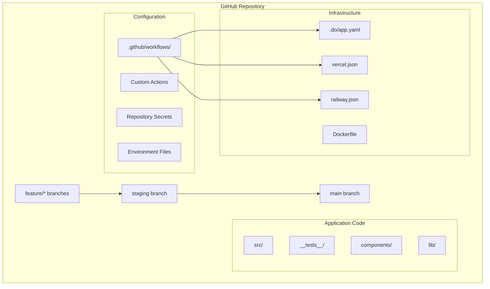

### 3.2 Branch Strategy

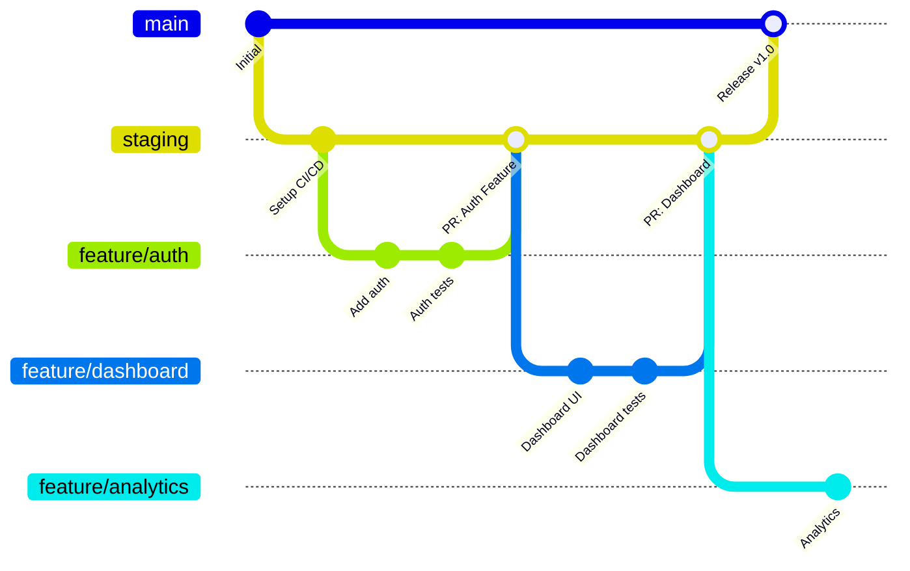

**Branch Mapping:**
- `feature/*` → Development Environment
- `staging` → Test Environment
- `main` → Production Environment

### 3.3 Core CI/CD Pipeline

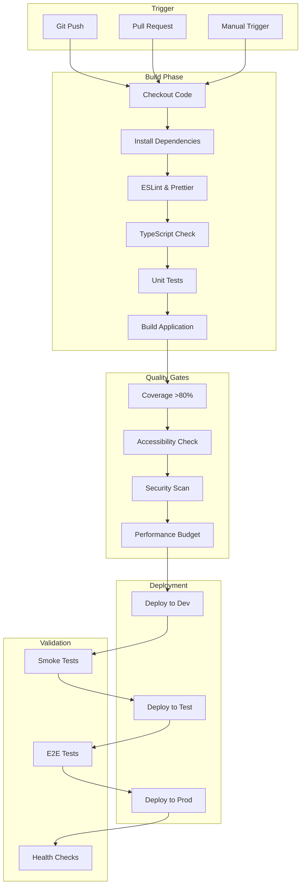

### 3.4 GitHub Actions Workflow (Base Template)

```yaml
# .github/workflows/ci-cd.yml

name: PF Figma CI/CD Pipeline

on:
  push:
    branches: [main, staging, 'feature/**']
  pull_request:
    branches: [main, staging]
  workflow_dispatch:
    inputs:
      environment:
        description: 'Target environment'
        required: true
        default: 'dev'
        type: choice
        options:
          - dev
          - test
          - prod

env:
  NODE_VERSION: '20'
  PNPM_VERSION: '8'

jobs:
  # ======================
  # BUILD & TEST
  # ======================
  build-and-test:
    name: Build & Test
    runs-on: ubuntu-latest
    
    steps:
      - name: Checkout code
        uses: actions/checkout@v4
        
      - name: Setup Node.js
        uses: actions/setup-node@v4
        with:
          node-version: ${{ env.NODE_VERSION }}
          cache: 'pnpm'
          
      - name: Install pnpm
        uses: pnpm/action-setup@v2
        with:
          version: ${{ env.PNPM_VERSION }}
          
      - name: Install dependencies
        run: pnpm install --frozen-lockfile
        
      - name: Lint code
        run: pnpm lint
        
      - name: Type check
        run: pnpm type-check
        
      - name: Run unit tests
        run: pnpm test:unit --coverage
        
      - name: Check coverage threshold
        run: |
          COVERAGE=$(jq -r '.total.lines.pct' coverage/coverage-summary.json)
          if (( $(echo "$COVERAGE < 80" | bc -l) )); then
            echo "Coverage $COVERAGE% is below 80% threshold"
            exit 1
          fi
          
      - name: Build application
        run: pnpm build
        env:
          NEXT_PUBLIC_SUPABASE_URL: ${{ secrets.SUPABASE_URL }}
          NEXT_PUBLIC_SUPABASE_ANON_KEY: ${{ secrets.SUPABASE_ANON_KEY }}
          
      - name: Upload build artifacts
        uses: actions/upload-artifact@v4
        with:
          name: build-output
          path: .next/
          retention-days: 1
          
      - name: Upload coverage report
        uses: actions/upload-artifact@v4
        with:
          name: coverage-report
          path: coverage/
          retention-days: 7

  # ======================
  # SECURITY SCAN
  # ======================
  security-scan:
    name: Security Scan
    runs-on: ubuntu-latest
    needs: build-and-test
    
    steps:
      - name: Checkout code
        uses: actions/checkout@v4
        
      - name: Run Snyk security scan
        uses: snyk/actions/node@master
        env:
          SNYK_TOKEN: ${{ secrets.SNYK_TOKEN }}
        with:
          args: --severity-threshold=high
          
      - name: Run CodeQL analysis
        uses: github/codeql-action/analyze@v2

  # ======================
  # DEPLOY TO DEV
  # ======================
  deploy-dev:
    name: Deploy to Development
    runs-on: ubuntu-latest
    needs: [build-and-test, security-scan]
    if: github.event_name == 'pull_request' || startsWith(github.ref, 'refs/heads/feature/')
    environment: development
    
    steps:
      - name: Checkout code
        uses: actions/checkout@v4
        
      - name: Download build artifacts
        uses: actions/download-artifact@v4
        with:
          name: build-output
          path: .next/
          
      # Platform-specific deployment step (see sections 4-6)
      - name: Deploy to platform
        uses: ./.github/actions/deploy
        with:
          environment: dev
          platform: ${{ vars.DEPLOYMENT_PLATFORM }}
          token: ${{ secrets.PLATFORM_TOKEN }}

  # ======================
  # DEPLOY TO TEST
  # ======================
  deploy-test:
    name: Deploy to Test
    runs-on: ubuntu-latest
    needs: [build-and-test, security-scan]
    if: github.ref == 'refs/heads/staging'
    environment: test
    
    steps:
      - name: Checkout code
        uses: actions/checkout@v4
        
      - name: Download build artifacts
        uses: actions/download-artifact@v4
        with:
          name: build-output
          path: .next/
          
      - name: Deploy to platform
        uses: ./.github/actions/deploy
        with:
          environment: test
          platform: ${{ vars.DEPLOYMENT_PLATFORM }}
          token: ${{ secrets.PLATFORM_TOKEN }}
          
      - name: Run E2E tests
        run: pnpm test:e2e
        env:
          TEST_URL: ${{ steps.deploy.outputs.url }}

  # ======================
  # DEPLOY TO PRODUCTION
  # ======================
  deploy-prod:
    name: Deploy to Production
    runs-on: ubuntu-latest
    needs: [build-and-test, security-scan]
    if: github.ref == 'refs/heads/main'
    environment: production
    
    steps:
      - name: Checkout code
        uses: actions/checkout@v4
        
      - name: Download build artifacts
        uses: actions/download-artifact@v4
        with:
          name: build-output
          path: .next/
          
      - name: Deploy to platform
        uses: ./.github/actions/deploy
        with:
          environment: prod
          platform: ${{ vars.DEPLOYMENT_PLATFORM }}
          token: ${{ secrets.PLATFORM_TOKEN }}
          
      - name: Run smoke tests
        run: pnpm test:smoke
        env:
          PROD_URL: ${{ steps.deploy.outputs.url }}
          
      - name: Notify deployment
        uses: 8398a7/action-slack@v3
        with:
          status: ${{ job.status }}
          text: 'Production deployment completed for ${{ github.repository }}'
          webhook_url: ${{ secrets.SLACK_WEBHOOK }}
```

---

## 4. DigitalOcean App Platform Strategy

### 4.1 Architecture Overview

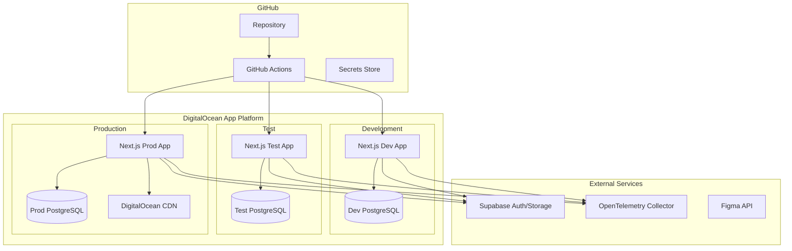

### 4.2 App Spec Configuration

```yaml
# .do/app.yaml

name: pf-figma-mvp
region: nyc
features:
  - buildpack-stack=ubuntu-22

services:
  - name: web
    github:
      repo: your-org/pf-figma-frontend
      branch: main
      deploy_on_push: false  # Controlled by GitHub Actions
    
    build_command: npm run build
    run_command: npm run start
    
    environment_slug: node-js
    instance_count: 2
    instance_size_slug: professional-xs
    
    http_port: 3000
    
    routes:
      - path: /
        preserve_path_prefix: true
    
    envs:
      - key: NODE_ENV
        value: production
      - key: NEXT_PUBLIC_SUPABASE_URL
        value: ${SUPABASE_URL}
      - key: NEXT_PUBLIC_SUPABASE_ANON_KEY
        value: ${SUPABASE_ANON_KEY}
      - key: SUPABASE_SERVICE_ROLE_KEY
        type: SECRET
        value: ${SUPABASE_SERVICE_KEY}
      - key: ANTHROPIC_API_KEY
        type: SECRET
        value: ${ANTHROPIC_KEY}
      - key: OTEL_EXPORTER_OTLP_ENDPOINT
        value: ${OTEL_ENDPOINT}
    
    health_check:
      http_path: /api/health
      initial_delay_seconds: 10
      period_seconds: 30
      timeout_seconds: 5
      success_threshold: 1
      failure_threshold: 3
    
    log_destinations:
      - name: otel-logs
        papertrail:
          endpoint: ${LOG_ENDPOINT}

databases:
  - name: db
    engine: PG
    num_nodes: 1
    size: db-s-1vcpu-1gb
    version: "16"
```

### 4.3 GitHub Actions for DigitalOcean

```yaml
# .github/workflows/deploy-digitalocean.yml

name: Deploy to DigitalOcean App Platform

on:
  workflow_call:
    inputs:
      environment:
        required: true
        type: string
    secrets:
      DIGITALOCEAN_ACCESS_TOKEN:
        required: true

jobs:
  deploy:
    name: Deploy to ${{ inputs.environment }}
    runs-on: ubuntu-latest
    
    steps:
      - name: Checkout repository
        uses: actions/checkout@v4
        
      - name: Set environment-specific app spec
        run: |
          if [ "${{ inputs.environment }}" == "dev" ]; then
            cp .do/app-dev.yaml .do/app.yaml
          elif [ "${{ inputs.environment }}" == "test" ]; then
            cp .do/app-test.yaml .do/app.yaml
          else
            cp .do/app-prod.yaml .do/app.yaml
          fi
          
      - name: Deploy to DigitalOcean App Platform
        uses: digitalocean/app_action/deploy@v2
        id: deploy
        with:
          token: ${{ secrets.DIGITALOCEAN_ACCESS_TOKEN }}
          
      - name: Get deployment URL
        run: |
          echo "Deployed to: ${{ steps.deploy.outputs.url }}"
          echo "App ID: ${{ steps.deploy.outputs.app_id }}"
          
      - name: Wait for deployment
        run: |
          # Poll deployment status
          for i in {1..30}; do
            STATUS=$(doctl apps get ${{ steps.deploy.outputs.app_id }} --format Status --no-header)
            if [ "$STATUS" == "ACTIVE" ]; then
              echo "Deployment successful!"
              exit 0
            fi
            echo "Waiting for deployment... ($i/30)"
            sleep 10
          done
          echo "Deployment timeout"
          exit 1
        env:
          DIGITALOCEAN_ACCESS_TOKEN: ${{ secrets.DIGITALOCEAN_ACCESS_TOKEN }}
          
      - name: Output deployment info
        run: |
          echo "::set-output name=url::${{ steps.deploy.outputs.url }}"
          echo "::set-output name=app_id::${{ steps.deploy.outputs.app_id }}"
```

### 4.4 Environment-Specific App Specs

```yaml
# .do/app-dev.yaml
name: pf-figma-dev
region: nyc
services:
  - name: web
    github:
      branch: feature/*
    instance_count: 1
    instance_size_slug: basic-xxs
    envs:
      - key: NODE_ENV
        value: development
      - key: NEXT_PUBLIC_ENV
        value: development

---
# .do/app-test.yaml
name: pf-figma-test
region: nyc
services:
  - name: web
    github:
      branch: staging
    instance_count: 2
    instance_size_slug: basic-xs
    envs:
      - key: NODE_ENV
        value: test
      - key: NEXT_PUBLIC_ENV
        value: test

---
# .do/app-prod.yaml
name: pf-figma-prod
region: nyc
services:
  - name: web
    github:
      branch: main
    instance_count: 3
    instance_size_slug: professional-xs
    envs:
      - key: NODE_ENV
        value: production
      - key: NEXT_PUBLIC_ENV
        value: production
```

---

## 5. Vercel Deployment Strategy

### 5.1 Architecture Overview

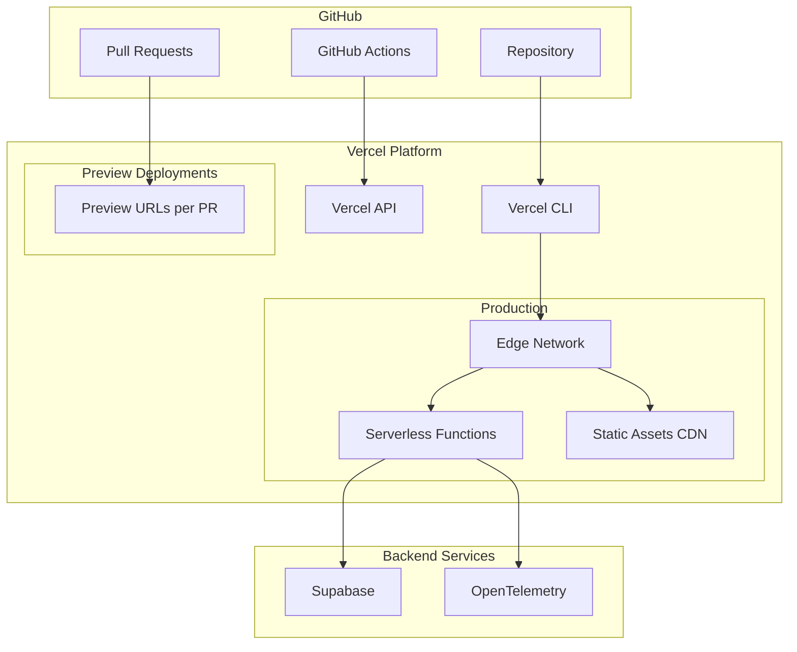

### 5.2 Vercel Configuration

```json
// vercel.json
{
  "framework": "nextjs",
  "buildCommand": "pnpm build",
  "installCommand": "pnpm install",
  "outputDirectory": ".next",
  
  "regions": ["iad1", "lhr1", "sfo1"],
  
  "env": {
    "NEXT_PUBLIC_SUPABASE_URL": "@supabase-url",
    "NEXT_PUBLIC_SUPABASE_ANON_KEY": "@supabase-anon-key"
  },
  
  "build": {
    "env": {
      "NODE_ENV": "production",
      "NEXT_TELEMETRY_DISABLED": "1"
    }
  },
  
  "headers": [
    {
      "source": "/(.*)",
      "headers": [
        {
          "key": "X-Content-Type-Options",
          "value": "nosniff"
        },
        {
          "key": "X-Frame-Options",
          "value": "DENY"
        },
        {
          "key": "X-XSS-Protection",
          "value": "1; mode=block"
        }
      ]
    }
  ],
  
  "redirects": [],
  
  "rewrites": [
    {
      "source": "/api/:path*",
      "destination": "/api/:path*"
    }
  ],
  
  "functions": {
    "api/**/*.ts": {
      "maxDuration": 30,
      "memory": 1024
    }
  }
}
```

### 5.3 GitHub Actions for Vercel

```yaml
# .github/workflows/deploy-vercel.yml

name: Deploy to Vercel

on:
  workflow_call:
    inputs:
      environment:
        required: true
        type: string
    secrets:
      VERCEL_TOKEN:
        required: true
      VERCEL_ORG_ID:
        required: true
      VERCEL_PROJECT_ID:
        required: true

jobs:
  deploy:
    name: Deploy to Vercel (${{ inputs.environment }})
    runs-on: ubuntu-latest
    
    steps:
      - name: Checkout repository
        uses: actions/checkout@v4
        
      - name: Install Vercel CLI
        run: npm install -g vercel@latest
        
      - name: Pull Vercel environment
        run: vercel pull --yes --environment=${{ inputs.environment }} --token=${{ secrets.VERCEL_TOKEN }}
        env:
          VERCEL_ORG_ID: ${{ secrets.VERCEL_ORG_ID }}
          VERCEL_PROJECT_ID: ${{ secrets.VERCEL_PROJECT_ID }}
          
      - name: Build project
        run: |
          if [ "${{ inputs.environment }}" == "production" ]; then
            vercel build --prod --token=${{ secrets.VERCEL_TOKEN }}
          else
            vercel build --token=${{ secrets.VERCEL_TOKEN }}
          fi
        env:
          VERCEL_ORG_ID: ${{ secrets.VERCEL_ORG_ID }}
          VERCEL_PROJECT_ID: ${{ secrets.VERCEL_PROJECT_ID }}
          
      - name: Deploy to Vercel
        id: deploy
        run: |
          if [ "${{ inputs.environment }}" == "production" ]; then
            URL=$(vercel deploy --prebuilt --prod --token=${{ secrets.VERCEL_TOKEN }})
          else
            URL=$(vercel deploy --prebuilt --token=${{ secrets.VERCEL_TOKEN }})
          fi
          echo "url=$URL" >> $GITHUB_OUTPUT
          echo "Deployed to: $URL"
        env:
          VERCEL_ORG_ID: ${{ secrets.VERCEL_ORG_ID }}
          VERCEL_PROJECT_ID: ${{ secrets.VERCEL_PROJECT_ID }}
          
      - name: Set environment alias
        if: inputs.environment == 'test'
        run: |
          vercel alias ${{ steps.deploy.outputs.url }} test.pf-figma.app --token=${{ secrets.VERCEL_TOKEN }}
        env:
          VERCEL_ORG_ID: ${{ secrets.VERCEL_ORG_ID }}
          VERCEL_PROJECT_ID: ${{ secrets.VERCEL_PROJECT_ID }}
          
      - name: Comment PR with preview URL
        if: github.event_name == 'pull_request'
        uses: actions/github-script@v7
        with:
          script: |
            github.rest.issues.createComment({
              issue_number: context.issue.number,
              owner: context.repo.owner,
              repo: context.repo.repo,
              body: `🚀 Preview deployed to: ${{ steps.deploy.outputs.url }}`
            })
```

### 5.4 Vercel Environment Variables Setup

```bash
# Set environment variables via Vercel CLI
vercel env add NEXT_PUBLIC_SUPABASE_URL production
vercel env add NEXT_PUBLIC_SUPABASE_ANON_KEY production
vercel env add SUPABASE_SERVICE_ROLE_KEY production --sensitive
vercel env add ANTHROPIC_API_KEY production --sensitive
vercel env add FIGMA_API_TOKEN production --sensitive

# Pull all environments
vercel env pull .env.local
```

---

## 6. Railway Deployment Strategy

### 6.1 Architecture Overview

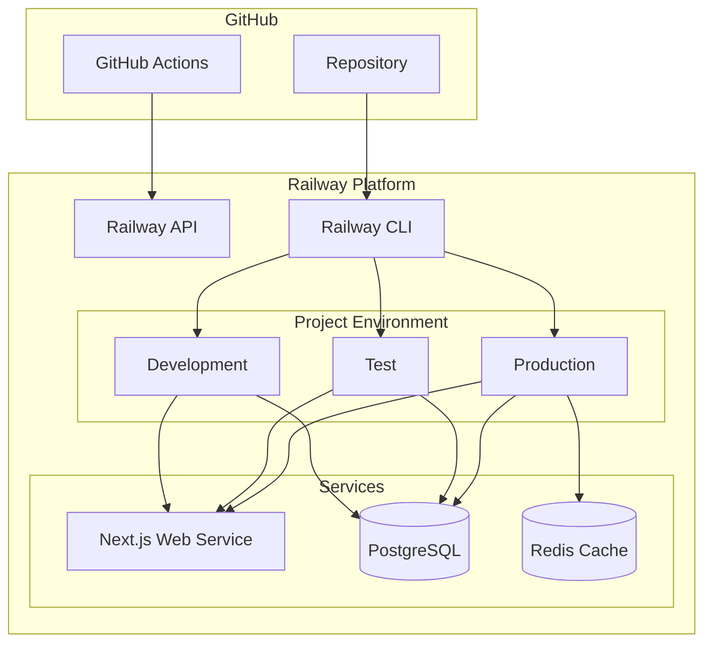

### 6.2 Railway Configuration

```json
// railway.json
{
  "$schema": "https://railway.app/railway.schema.json",
  "build": {
    "builder": "NIXPACKS",
    "buildCommand": "pnpm build",
    "watchPatterns": [
      "src/**",
      "package.json",
      "next.config.js"
    ]
  },
  "deploy": {
    "numReplicas": 1,
    "startCommand": "pnpm start",
    "healthcheckPath": "/api/health",
    "healthcheckTimeout": 300,
    "restartPolicyType": "ON_FAILURE",
    "restartPolicyMaxRetries": 3
  }
}
```

### 6.3 GitHub Actions for Railway

```yaml
# .github/workflows/deploy-railway.yml

name: Deploy to Railway

on:
  workflow_call:
    inputs:
      environment:
        required: true
        type: string
    secrets:
      RAILWAY_TOKEN:
        required: true

jobs:
  deploy:
    name: Deploy to Railway (${{ inputs.environment }})
    runs-on: ubuntu-latest
    
    steps:
      - name: Checkout repository
        uses: actions/checkout@v4
        
      - name: Install Railway CLI
        run: npm install -g @railway/cli
        
      - name: Link to Railway project
        run: |
          railway link --environment=${{ inputs.environment }}
        env:
          RAILWAY_TOKEN: ${{ secrets.RAILWAY_TOKEN }}
          
      - name: Set environment variables
        run: |
          railway variables set \
            NODE_ENV=${{ inputs.environment == 'prod' && 'production' || inputs.environment }} \
            NEXT_PUBLIC_ENV=${{ inputs.environment }}
        env:
          RAILWAY_TOKEN: ${{ secrets.RAILWAY_TOKEN }}
          
      - name: Deploy to Railway
        id: deploy
        run: |
          OUTPUT=$(railway up --detach 2>&1)
          echo "$OUTPUT"
          URL=$(echo "$OUTPUT" | grep -oP 'https://[^ ]+')
          echo "url=$URL" >> $GITHUB_OUTPUT
        env:
          RAILWAY_TOKEN: ${{ secrets.RAILWAY_TOKEN }}
          
      - name: Wait for deployment health
        run: |
          for i in {1..20}; do
            STATUS=$(curl -s -o /dev/null -w "%{http_code}" "${{ steps.deploy.outputs.url }}/api/health" || echo "000")
            if [ "$STATUS" == "200" ]; then
              echo "Deployment healthy!"
              exit 0
            fi
            echo "Waiting for health check... ($i/20)"
            sleep 15
          done
          echo "Health check timeout"
          exit 1
          
      - name: Output deployment URL
        run: echo "Deployed to ${{ steps.deploy.outputs.url }}"
```

### 6.4 Railway Database Setup

```yaml
# .github/workflows/railway-db-setup.yml

name: Setup Railway Database

on:
  workflow_dispatch:
    inputs:
      environment:
        description: 'Environment to setup'
        required: true
        type: choice
        options:
          - dev
          - test
          - prod

jobs:
  setup-db:
    runs-on: ubuntu-latest
    
    steps:
      - name: Install Railway CLI
        run: npm install -g @railway/cli
        
      - name: Add PostgreSQL service
        run: |
          railway add --plugin postgresql
          railway variables get DATABASE_URL
        env:
          RAILWAY_TOKEN: ${{ secrets.RAILWAY_TOKEN }}
          
      - name: Run migrations
        run: |
          railway run pnpm db:migrate
        env:
          RAILWAY_TOKEN: ${{ secrets.RAILWAY_TOKEN }}
```

---

## 7. Claude Agent Integration

### 7.1 Agent-Orchestrated Deployment

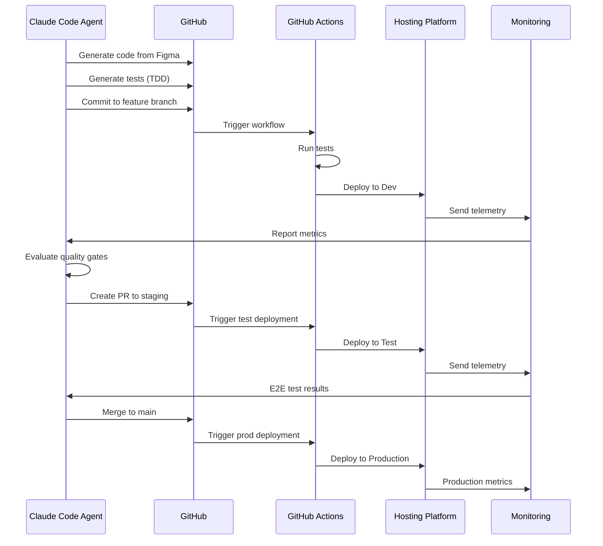

### 7.2 Claude Code Deployment Commands

```bash
# Claude Code agent commands for deployment management

# Generate deployment configuration
claude "Generate DigitalOcean App Spec for Next.js application with PostgreSQL"

# Create GitHub Actions workflow
claude "Create GitHub Actions CI/CD pipeline for multi-environment deployment"

# Execute deployment
claude "Deploy current branch to development environment using GitHub Actions"

# Monitor deployment
claude "Check deployment status and verify health checks passed"

# Rollback if needed
claude "Rollback production deployment to previous version"
```

### 7.3 Agent Deployment Orchestration Script

```typescript
// lib/agents/deployment-agent.ts

import { ClaudeClient } from '@anthropic-ai/sdk';
import { Octokit } from '@octokit/rest';

interface DeploymentConfig {
  platform: 'digitalocean' | 'vercel' | 'railway';
  environment: 'dev' | 'test' | 'prod';
  branch: string;
}

export class DeploymentAgent {
  private claude: ClaudeClient;
  private github: Octokit;
  
  async orchestrateDeployment(config: DeploymentConfig): Promise<DeploymentResult> {
    // 1. Validate code quality
    const qualityReport = await this.validateCodeQuality(config.branch);
    if (!qualityReport.passed) {
      throw new Error(`Quality gates failed: ${qualityReport.failures.join(', ')}`);
    }
    
    // 2. Run TDD tests
    const testResults = await this.runTests(config.branch);
    if (!testResults.passed) {
      throw new Error(`Tests failed: ${testResults.failures.length} failures`);
    }
    
    // 3. Generate deployment configuration
    const deployConfig = await this.generateDeploymentConfig(config);
    
    // 4. Trigger GitHub Actions workflow
    const workflowRun = await this.triggerDeployment(config, deployConfig);
    
    // 5. Monitor deployment
    const deploymentStatus = await this.monitorDeployment(workflowRun.id);
    
    // 6. Validate deployment
    const validationResult = await this.validateDeployment(deploymentStatus.url);
    
    // 7. Report to context store
    await this.reportDeployment({
      ...config,
      status: validationResult.healthy ? 'success' : 'failed',
      url: deploymentStatus.url,
      metrics: validationResult.metrics
    });
    
    return {
      success: validationResult.healthy,
      url: deploymentStatus.url,
      metrics: validationResult.metrics
    };
  }
  
  private async generateDeploymentConfig(config: DeploymentConfig): Promise<string> {
    const prompt = `
      Generate deployment configuration for:
      - Platform: ${config.platform}
      - Environment: ${config.environment}
      - Application: Next.js with Supabase backend
      
      Include all necessary environment variables and health checks.
    `;
    
    const response = await this.claude.messages.create({
      model: 'claude-sonnet-4-20250514',
      max_tokens: 4000,
      messages: [{ role: 'user', content: prompt }]
    });
    
    return response.content[0].text;
  }
  
  private async triggerDeployment(
    config: DeploymentConfig,
    deployConfig: string
  ): Promise<WorkflowRun> {
    const { data } = await this.github.actions.createWorkflowDispatch({
      owner: 'your-org',
      repo: 'pf-figma-frontend',
      workflow_id: 'deploy.yml',
      ref: config.branch,
      inputs: {
        environment: config.environment,
        platform: config.platform,
        config: deployConfig
      }
    });
    
    return data;
  }
}
```

### 7.4 OpenTelemetry Integration with Claude Code

```bash
# Enable Claude Code telemetry for deployment monitoring
export CLAUDE_CODE_ENABLE_TELEMETRY=1
export OTEL_METRICS_EXPORTER=otlp
export OTEL_LOGS_EXPORTER=otlp
export OTEL_EXPORTER_OTLP_ENDPOINT=http://otel-collector:4317

# Track deployment agent performance
export OTEL_RESOURCE_ATTRIBUTES="service.name=pf-figma-deployment-agent,environment=production"
```

---

## 8. Environment Management

### 8.1 Environment Architecture

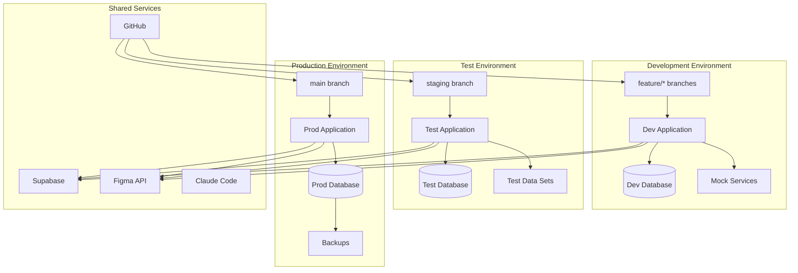

### 8.2 Environment-Specific Configuration

```typescript
// lib/config/environments.ts

export const environments = {
  development: {
    name: 'development',
    url: 'https://dev.pf-figma.app',
    supabase: {
      url: process.env.DEV_SUPABASE_URL,
      anonKey: process.env.DEV_SUPABASE_ANON_KEY
    },
    features: {
      debug: true,
      mockServices: true,
      hotReload: true
    },
    deployment: {
      autoPromote: true,
      approvalRequired: false
    }
  },
  
  test: {
    name: 'test',
    url: 'https://test.pf-figma.app',
    supabase: {
      url: process.env.TEST_SUPABASE_URL,
      anonKey: process.env.TEST_SUPABASE_ANON_KEY
    },
    features: {
      debug: false,
      mockServices: false,
      hotReload: false
    },
    deployment: {
      autoPromote: false,
      approvalRequired: true
    }
  },
  
  production: {
    name: 'production',
    url: 'https://pf-figma.app',
    supabase: {
      url: process.env.PROD_SUPABASE_URL,
      anonKey: process.env.PROD_SUPABASE_ANON_KEY
    },
    features: {
      debug: false,
      mockServices: false,
      hotReload: false
    },
    deployment: {
      autoPromote: false,
      approvalRequired: true,
      rollbackEnabled: true
    }
  }
};
```

### 8.3 GitHub Environments Configuration

```yaml
# Repository Settings > Environments

environments:
  - name: development
    protection_rules: []
    deployment_branch_policy:
      protected_branches: false
      custom_branch_policies: true
      branches:
        - feature/*
        - hotfix/*
    secrets:
      - DEV_SUPABASE_URL
      - DEV_SUPABASE_ANON_KEY
      - DEV_PLATFORM_TOKEN
    variables:
      - DEPLOYMENT_PLATFORM=digitalocean
      - NODE_ENV=development

  - name: test
    protection_rules:
      - required_reviewers: 1
        wait_timer: 0
    deployment_branch_policy:
      protected_branches: true
      branches:
        - staging
    secrets:
      - TEST_SUPABASE_URL
      - TEST_SUPABASE_ANON_KEY
      - TEST_PLATFORM_TOKEN
    variables:
      - DEPLOYMENT_PLATFORM=digitalocean
      - NODE_ENV=test

  - name: production
    protection_rules:
      - required_reviewers: 2
        wait_timer: 30
    deployment_branch_policy:
      protected_branches: true
      branches:
        - main
    secrets:
      - PROD_SUPABASE_URL
      - PROD_SUPABASE_ANON_KEY
      - PROD_PLATFORM_TOKEN
    variables:
      - DEPLOYMENT_PLATFORM=digitalocean
      - NODE_ENV=production
```

---

## 9. Comparative Analysis & Recommendation

### 9.1 Feature Comparison

| Feature | DigitalOcean App Platform | Vercel | Railway |
|---------|---------------------------|--------|---------|
| **Next.js Support** | Good (Buildpacks) | Excellent (Native) | Good (Nixpacks) |
| **GitHub Actions** | Native (`app_action`) | Excellent (CLI + API) | Good (CLI) |
| **Managed Database** | ✅ PostgreSQL | ❌ (Need external) | ✅ PostgreSQL, MySQL |
| **Preview Deployments** | ✅ Per branch | ✅ Per PR | ✅ Per branch |
| **Static IP** | ✅ Available | ❌ Not available | ❌ Not available |
| **Global Edge CDN** | ✅ DO CDN | ✅ Edge Network | ❌ Limited |
| **Serverless Functions** | ❌ Containers only | ✅ Excellent | ❌ Containers |
| **Environment Management** | ✅ App Spec YAML | ✅ vercel.json | ✅ railway.json |
| **Cost Predictability** | ✅ Fixed pricing | ⚠️ Usage-based | ⚠️ Usage-based |
| **Free Tier** | ❌ $5/mo minimum | ✅ Hobby (personal) | ✅ $5/mo credits |
| **Complexity** | Medium | Low | Low |
| **Enterprise Ready** | ✅ Yes | ✅ Yes | ⚠️ Growing |

### 9.2 Cost Projection (6-Month MVP)

```mermaid
xychart-beta
    title "6-Month MVP Cost Comparison (USD)"
    x-axis ["Month 1", "Month 2", "Month 3", "Month 4", "Month 5", "Month 6"]
    y-axis "Cost (USD)" 0 --> 200
    bar [35, 35, 50, 65, 80, 95] "DigitalOcean"
    bar [20, 25, 40, 55, 75, 90] "Vercel"
    bar [15, 20, 35, 50, 70, 85] "Railway"
```

**DigitalOcean Estimated Costs:**
- Basic App: $12/month
- Database: $15/month
- Storage/Bandwidth: ~$8/month (growing)
- **Total: $35-95/month**

**Vercel Estimated Costs:**
- Pro Plan: $20/month
- Serverless Usage: $0-20/month
- Bandwidth: ~$0-15/month
- **Total: $20-90/month** (+ Supabase for DB)

**Railway Estimated Costs:**
- Hobby Plan: $5/month
- Usage: $10-50/month
- Database: ~$0-30/month
- **Total: $15-85/month**

### 9.3 Decision Matrix

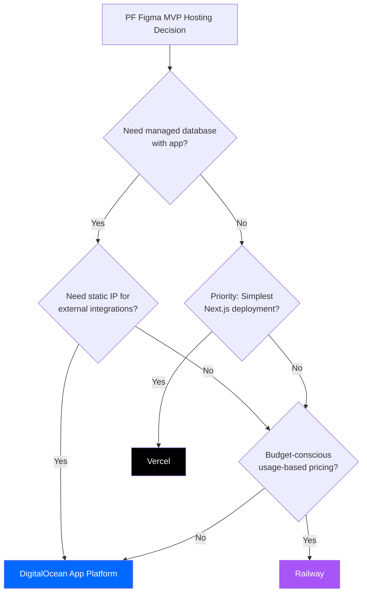

### 9.4 Recommendation

**Primary Recommendation: DigitalOcean App Platform**

**Rationale:**
1. **Complete Stack**: Native managed PostgreSQL alongside application hosting
2. **GitOps Native**: App Spec YAML enables Infrastructure-as-Code
3. **Static IP**: Important for Figma webhook integrations and third-party services
4. **Predictable Costs**: Fixed pricing model suitable for budget planning
5. **Production Ready**: Battle-tested infrastructure suitable for growth
6. **GitHub Actions**: First-class support with `digitalocean/app_action`
7. **Claude Agent Compatible**: Straightforward CLI and API for automation

**Alternative: Vercel**

**When to Choose Vercel:**
- Pure frontend focus without backend database needs
- Maximum Next.js optimization required
- Team already familiar with Vercel ecosystem
- Edge computing is critical for performance
- Using Supabase exclusively for backend

### 9.5 Migration Path

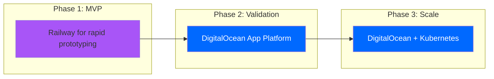

---

## 10. Implementation Roadmap

### 10.1 Week 1-2: Foundation Setup

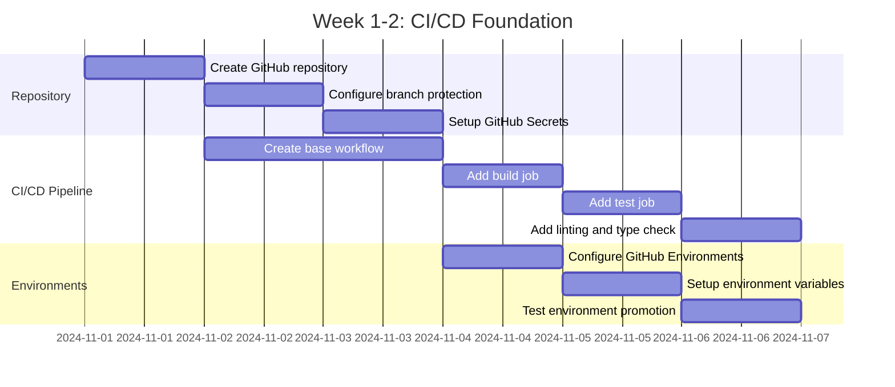

### 10.2 Week 3-4: Platform Integration

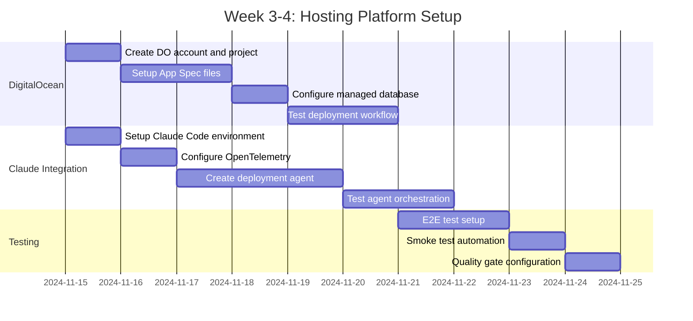

### 10.3 Week 5-6: MVP Application Deployment

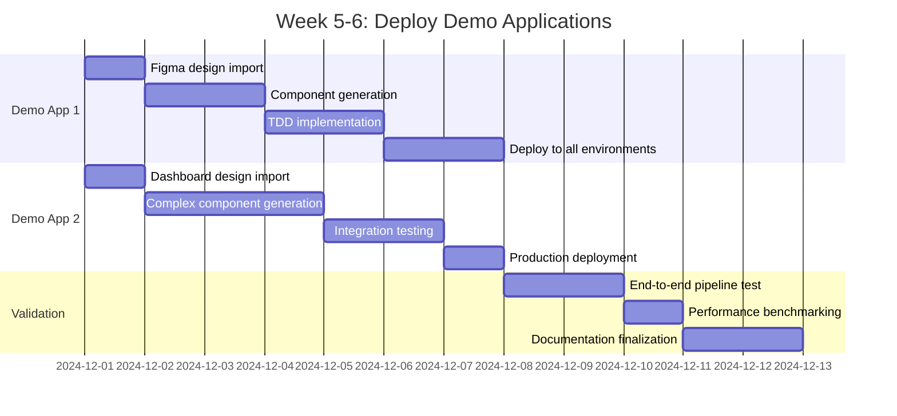

---

## Appendices

### Appendix A: GitHub Secrets Configuration

```bash
# Required Repository Secrets

# DigitalOcean
DIGITALOCEAN_ACCESS_TOKEN=dop_v1_xxx

# Vercel (if using)
VERCEL_TOKEN=xxx
VERCEL_ORG_ID=xxx
VERCEL_PROJECT_ID=xxx

# Railway (if using)
RAILWAY_TOKEN=xxx

# Supabase
DEV_SUPABASE_URL=https://xxx.supabase.co
DEV_SUPABASE_ANON_KEY=eyJxxx
TEST_SUPABASE_URL=https://yyy.supabase.co
TEST_SUPABASE_ANON_KEY=eyJyyy
PROD_SUPABASE_URL=https://zzz.supabase.co
PROD_SUPABASE_ANON_KEY=eyJzzz

# Anthropic
ANTHROPIC_API_KEY=sk-ant-xxx

# Figma
FIGMA_API_TOKEN=figd_xxx
FIGMA_WEBHOOK_SECRET=whsec_xxx

# Monitoring
SNYK_TOKEN=xxx
SLACK_WEBHOOK=https://hooks.slack.com/xxx

# OpenTelemetry
OTEL_EXPORTER_OTLP_ENDPOINT=http://collector:4317
```

### Appendix B: Complete GitHub Actions Workflow (DigitalOcean)

```yaml
# .github/workflows/complete-pipeline.yml

name: Complete PF Figma CI/CD Pipeline

on:
  push:
    branches: [main, staging, 'feature/**']
  pull_request:
    branches: [main, staging]

env:
  NODE_VERSION: '20'

jobs:
  build:
    name: Build & Test
    runs-on: ubuntu-latest
    outputs:
      coverage: ${{ steps.coverage.outputs.percentage }}
    steps:
      - uses: actions/checkout@v4
      - uses: actions/setup-node@v4
        with:
          node-version: ${{ env.NODE_VERSION }}
          cache: 'npm'
      - run: npm ci
      - run: npm run lint
      - run: npm run type-check
      - run: npm test -- --coverage
      - id: coverage
        run: echo "percentage=$(jq -r '.total.lines.pct' coverage/coverage-summary.json)" >> $GITHUB_OUTPUT
      - run: npm run build

  security:
    name: Security Scan
    runs-on: ubuntu-latest
    needs: build
    steps:
      - uses: actions/checkout@v4
      - uses: snyk/actions/node@master
        env:
          SNYK_TOKEN: ${{ secrets.SNYK_TOKEN }}

  deploy-dev:
    name: Deploy Development
    runs-on: ubuntu-latest
    needs: [build, security]
    if: github.event_name == 'pull_request'
    environment: development
    steps:
      - uses: actions/checkout@v4
      - uses: digitalocean/app_action/deploy@v2
        with:
          token: ${{ secrets.DIGITALOCEAN_ACCESS_TOKEN }}

  deploy-test:
    name: Deploy Test
    runs-on: ubuntu-latest
    needs: [build, security]
    if: github.ref == 'refs/heads/staging'
    environment: test
    steps:
      - uses: actions/checkout@v4
      - uses: digitalocean/app_action/deploy@v2
        with:
          token: ${{ secrets.DIGITALOCEAN_ACCESS_TOKEN }}
      - run: npm run test:e2e

  deploy-prod:
    name: Deploy Production
    runs-on: ubuntu-latest
    needs: [build, security]
    if: github.ref == 'refs/heads/main'
    environment: production
    steps:
      - uses: actions/checkout@v4
      - uses: digitalocean/app_action/deploy@v2
        with:
          token: ${{ secrets.DIGITALOCEAN_ACCESS_TOKEN }}
      - run: npm run test:smoke
```

### Appendix C: Monitoring Dashboard Configuration

```yaml
# monitoring/grafana-dashboard.json

{
  "dashboard": {
    "title": "PF Figma Deployment Metrics",
    "panels": [
      {
        "title": "Deployment Frequency",
        "type": "stat",
        "datasource": "Prometheus"
      },
      {
        "title": "Deployment Success Rate",
        "type": "gauge",
        "datasource": "Prometheus"
      },
      {
        "title": "Build Duration",
        "type": "timeseries",
        "datasource": "Prometheus"
      },
      {
        "title": "Test Coverage",
        "type": "stat",
        "datasource": "Prometheus"
      }
    ]
  }
}
```

### Appendix D: Rollback Procedures

```bash
# DigitalOcean App Platform Rollback
doctl apps create-deployment $APP_ID --force-rebuild=false

# Vercel Rollback
vercel rollback $DEPLOYMENT_URL

# Railway Rollback
railway rollback $DEPLOYMENT_ID

# Database Rollback
pnpm db:rollback --target=$MIGRATION_ID
```

---

**Document Control:**
- **Author:** PF Figma Platform Team
- **Reviewed By:** TBD
- **Approved By:** TBD
- **Next Review:** TBD

---

**END OF CI/CD & HOSTING STRATEGY DOCUMENT**
