# PF Figma: High-Level Design Architecture
## Front-End Solution Architect - Idea to Production Pipeline

**Document:** PF-Figma-HLD-Architecture  
**Version:** 1.0  
**Date:** November 2025  
**Classification:** Internal Technical Architecture  

---

## Table of Contents

1. [Executive Summary](#1-executive-summary)
2. [Architecture Overview](#2-architecture-overview)
3. [System Context](#3-system-context)
4. [Core Architecture Components](#4-core-architecture-components)
5. [Integration Architecture](#5-integration-architecture)
6. [Infrastructure & Environments](#6-infrastructure--environments)
7. [Value Engineering Flow](#7-value-engineering-flow)
8. [TDD Strategy Integration](#8-tdd-strategy-integration)
9. [MVP Demonstration Applications](#9-mvp-demonstration-applications)
10. [Dependencies & Constraints](#10-dependencies--constraints)
11. [Appendices](#appendices)

---

## 1. Executive Summary

PF Figma is an agentic front-end solution architecture that automates the complete lifecycle from business strategy conceptualization through production deployment. The system leverages Figma as the design visualization and prototyping tool, orchestrated by Claude Code agents that manage the entire development pipeline.

**Core Value Proposition:**
- Business Strategy (VSOM) to Production in automated pipeline
- Test-Driven Development (TDD) embedded at every stage
- Claude agents manage all system integrations
- Staged environment progression (Dev → Test → Prod)
- Figma-native design-to-code automation

**MVP Focus:** Prove the concept through 2-3 demonstration applications that validate the end-to-end pipeline from Figma design through production deployment.

---

## 2. Architecture Overview

### 2.1 System Context Diagram

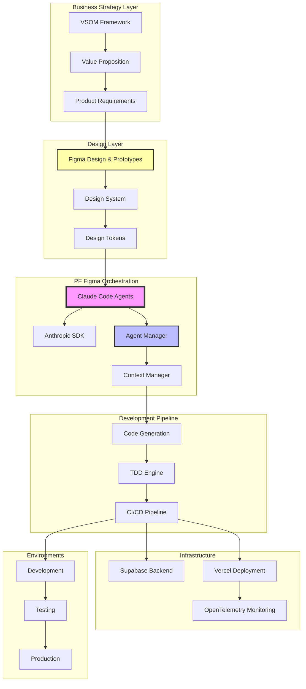
```mermaid
graph TB
    subgraph "Business Strategy Layer"
        VSOM[VSOM Framework]
        VP[Value Proposition]
        PRD[Product Requirements]
    end
    
    subgraph "Design Layer"
        FIG[Figma Design & Prototypes]
        DS[Design System]
        DT[Design Tokens]
    end
    
    subgraph "PF Figma Orchestration"
        CC[Claude Code Agents]
        SDK[Anthropic SDK]
        AM[Agent Manager]
        CTX[Context Manager]
    end
    
    subgraph "Development Pipeline"
        GEN[Code Generation]
        TDD[TDD Engine]
        CI[CI/CD Pipeline]
    end
    
    subgraph "Infrastructure"
        SB[Supabase Backend]
        VCL[Vercel Deployment]
        MON[OpenTelemetry Monitoring]
    end
    
    subgraph "Environments"
        DEV[Development]
        TEST[Testing]
        PROD[Production]
    end
    
    VSOM --> VP
    VP --> PRD
    PRD --> FIG
    FIG --> DS
    DS --> DT
    
    DT --> CC
    CC --> SDK
    CC --> AM
    AM --> CTX
    
    CTX --> GEN
    GEN --> TDD
    TDD --> CI
    
    CI --> SB
    CI --> VCL
    VCL --> MON
    
    CI --> DEV
    DEV --> TEST
    TEST --> PROD
    
    style CC fill:#f9f,stroke:#333,stroke-width:4px
    style AM fill:#bbf,stroke:#333,stroke-width:2px
    style FIG fill:#ffa,stroke:#333,stroke-width:2px
```

### 2.2 High-Level Component Architecture

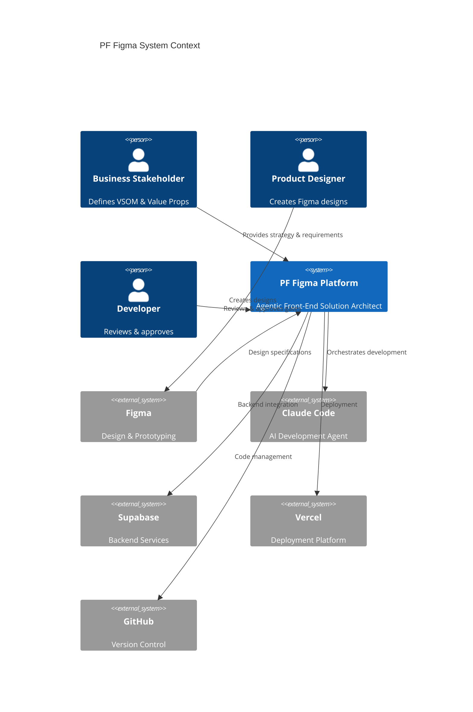
```mermaid
C4Context
    title PF Figma System Context
    
    Person(stakeholder, "Business Stakeholder", "Defines VSOM & Value Props")
    Person(designer, "Product Designer", "Creates Figma designs")
    Person(dev, "Developer", "Reviews & approves")
    
    System(pffigma, "PF Figma Platform", "Agentic Front-End Solution Architect")
    
    System_Ext(figma, "Figma", "Design & Prototyping")
    System_Ext(claude, "Claude Code", "AI Development Agent")
    System_Ext(supabase, "Supabase", "Backend Services")
    System_Ext(vercel, "Vercel", "Deployment Platform")
    System_Ext(github, "GitHub", "Version Control")
    
    Rel(stakeholder, pffigma, "Provides strategy & requirements")
    Rel(designer, figma, "Creates designs")
    Rel(figma, pffigma, "Design specifications")
    Rel(pffigma, claude, "Orchestrates development")
    Rel(pffigma, supabase, "Backend integration")
    Rel(pffigma, vercel, "Deployment")
    Rel(pffigma, github, "Code management")
    Rel(dev, pffigma, "Reviews & approves gates")
```

---

## 3. System Context

### 3.1 Primary Actors

| Actor | Role | Responsibility |
|-------|------|----------------|
| Business Stakeholder | Strategy Owner | Define VSOM, value propositions, success metrics |
| Product Owner | Requirements Manager | Translate strategy to PRDs, prioritize features |
| Product Designer | Design Creator | Create Figma designs, prototypes, design system |
| Claude Code Agents | Automation Engine | Execute all development & integration tasks |
| Developer | Quality Gatekeeper | Review agent outputs, approve deployments |
| QA Engineer | Validation Owner | Verify test coverage, acceptance criteria |

### 3.2 External Systems

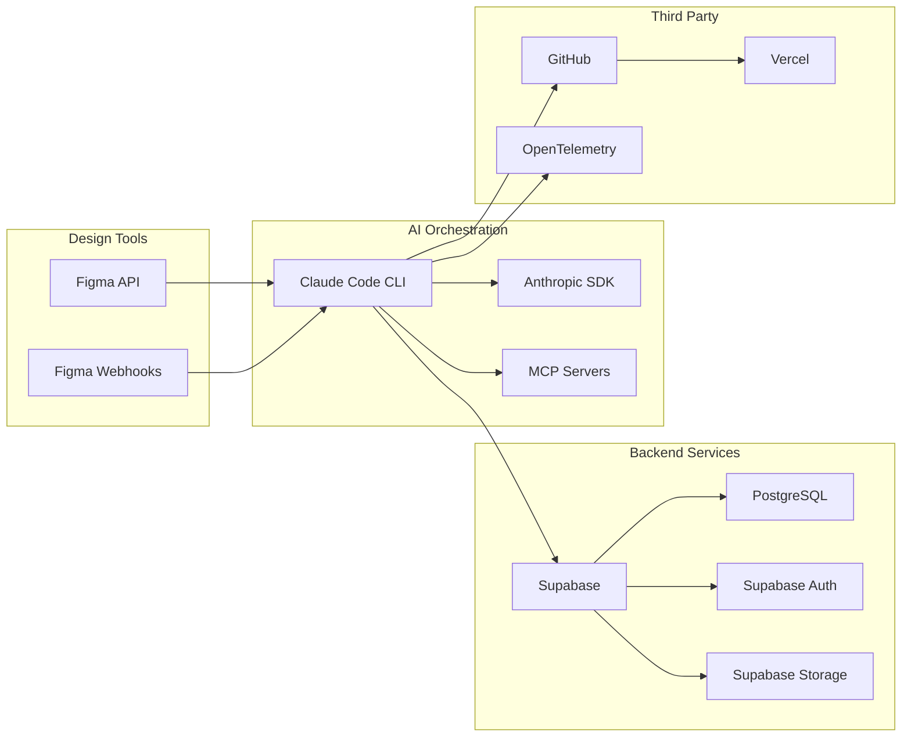
```mermaid
graph LR
    subgraph "Design Tools"
        F[Figma API]
        FW[Figma Webhooks]
    end
    
    subgraph "AI Orchestration"
        CC[Claude Code CLI]
        AS[Anthropic SDK]
        MCP[MCP Servers]
    end
    
    subgraph "Backend Services"
        SB[Supabase]
        PG[PostgreSQL]
        AUTH[Supabase Auth]
        STOR[Supabase Storage]
    end
    
    subgraph "Third Party"
        GH[GitHub]
        VCL[Vercel]
        OTEL[OpenTelemetry]
    end
    
    F --> CC
    FW --> CC
    CC --> AS
    CC --> MCP
    CC --> SB
    SB --> PG
    SB --> AUTH
    SB --> STOR
    CC --> GH
    GH --> VCL
    CC --> OTEL
```

---

## 4. Core Architecture Components

### 4.1 Agent Architecture

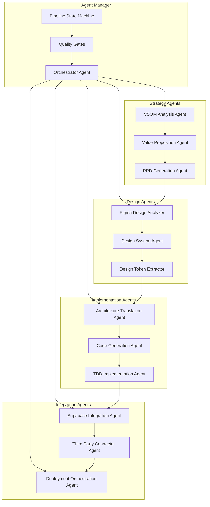
```mermaid
graph TB
    subgraph "Agent Manager"
        AM[Orchestrator Agent]
        PS[Pipeline State Machine]
        QG[Quality Gates]
    end
    
    subgraph "Strategy Agents"
        VSA[VSOM Analysis Agent]
        VPA[Value Proposition Agent]
        PRA[PRD Generation Agent]
    end
    
    subgraph "Design Agents"
        FDA[Figma Design Analyzer]
        DSA[Design System Agent]
        DTA[Design Token Extractor]
    end
    
    subgraph "Implementation Agents"
        ATA[Architecture Translation Agent]
        CGA[Code Generation Agent]
        TDA[TDD Implementation Agent]
    end
    
    subgraph "Integration Agents"
        SBA[Supabase Integration Agent]
        TPA[Third Party Connector Agent]
        DPA[Deployment Orchestration Agent]
    end
    
    AM --> VSA
    AM --> FDA
    AM --> ATA
    AM --> SBA
    AM --> DPA
    
    VSA --> VPA
    VPA --> PRA
    PRA --> FDA
    
    FDA --> DSA
    DSA --> DTA
    DTA --> ATA
    
    ATA --> CGA
    CGA --> TDA
    
    TDA --> SBA
    SBA --> TPA
    TPA --> DPA
    
    PS --> QG
    QG --> AM
```

### 4.2 Data Flow Architecture

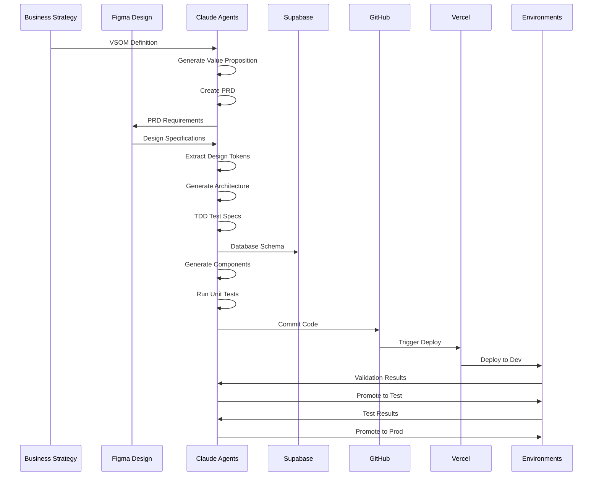
```mermaid
sequenceDiagram
    participant BS as Business Strategy
    participant FD as Figma Design
    participant CA as Claude Agents
    participant SB as Supabase
    participant GH as GitHub
    participant VL as Vercel
    participant ENV as Environments
    
    BS->>CA: VSOM Definition
    CA->>CA: Generate Value Proposition
    CA->>CA: Create PRD
    CA->>FD: PRD Requirements
    FD->>CA: Design Specifications
    CA->>CA: Extract Design Tokens
    CA->>CA: Generate Architecture
    CA->>CA: TDD Test Specs
    CA->>SB: Database Schema
    CA->>CA: Generate Components
    CA->>CA: Run Unit Tests
    CA->>GH: Commit Code
    GH->>VL: Trigger Deploy
    VL->>ENV: Deploy to Dev
    ENV->>CA: Validation Results
    CA->>ENV: Promote to Test
    ENV->>CA: Test Results
    CA->>ENV: Promote to Prod
```

### 4.3 Context Management

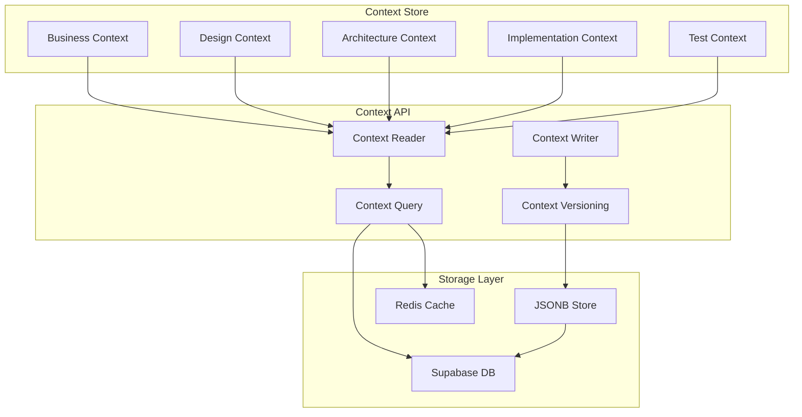
```mermaid
graph TB
    subgraph "Context Store"
        BC[Business Context]
        DC[Design Context]
        AC[Architecture Context]
        IC[Implementation Context]
        TC[Test Context]
    end
    
    subgraph "Context API"
        CR[Context Reader]
        CW[Context Writer]
        CV[Context Versioning]
        CQ[Context Query]
    end
    
    subgraph "Storage Layer"
        SBD[Supabase DB]
        JSONB[JSONB Store]
        CACHE[Redis Cache]
    end
    
    BC --> CR
    DC --> CR
    AC --> CR
    IC --> CR
    TC --> CR
    
    CR --> CQ
    CW --> CV
    CV --> JSONB
    CQ --> SBD
    JSONB --> SBD
    CQ --> CACHE
```

---

## 5. Integration Architecture

### 5.1 Figma Integration

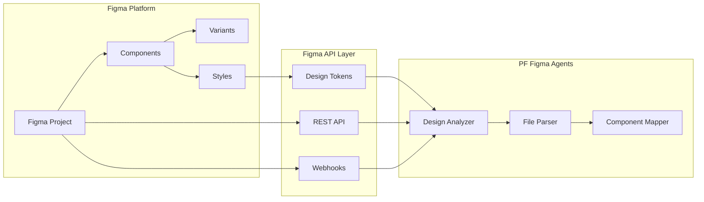
```mermaid
graph LR
    subgraph "Figma Platform"
        FP[Figma Project]
        FC[Components]
        FV[Variants]
        FS[Styles]
        FP --> FC
        FC --> FV
        FC --> FS
    end
    
    subgraph "Figma API Layer"
        REST[REST API]
        WH[Webhooks]
        DT[Design Tokens]
    end
    
    subgraph "PF Figma Agents"
        FDA[Design Analyzer]
        FPA[File Parser]
        FCA[Component Mapper]
    end
    
    FP --> REST
    FP --> WH
    FS --> DT
    
    REST --> FDA
    WH --> FDA
    DT --> FDA
    
    FDA --> FPA
    FPA --> FCA
```

**Figma Integration Points:**
- **REST API**: Component extraction, design token retrieval, file metadata
- **Webhooks**: Real-time design change notifications
- **Plugin API**: Custom design validation and export tools
- **Design Tokens**: Style dictionary generation for design system

### 5.2 Claude Code & SDK Integration

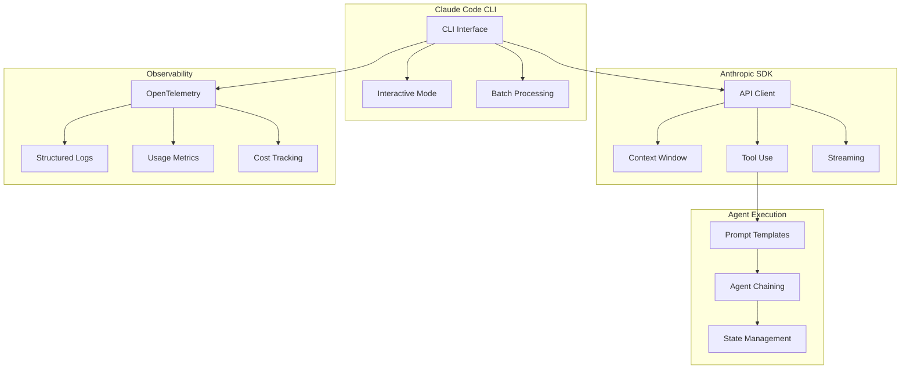
```mermaid
graph TB
    subgraph "Claude Code CLI"
        CLI[CLI Interface]
        REPL[Interactive Mode]
        BATCH[Batch Processing]
    end
    
    subgraph "Anthropic SDK"
        API[API Client]
        CTX[Context Window]
        TOOLS[Tool Use]
        STREAM[Streaming]
    end
    
    subgraph "Agent Execution"
        PROMPT[Prompt Templates]
        CHAIN[Agent Chaining]
        STATE[State Management]
    end
    
    subgraph "Observability"
        OTEL[OpenTelemetry]
        LOGS[Structured Logs]
        METRICS[Usage Metrics]
        COST[Cost Tracking]
    end
    
    CLI --> API
    CLI --> REPL
    CLI --> BATCH
    
    API --> CTX
    API --> TOOLS
    API --> STREAM
    
    TOOLS --> PROMPT
    PROMPT --> CHAIN
    CHAIN --> STATE
    
    CLI --> OTEL
    OTEL --> LOGS
    OTEL --> METRICS
    OTEL --> COST
```

**Claude Code Capabilities:**
- Terminal-based agent execution
- Multi-tool orchestration
- File system operations
- Git version control
- Environment management
- OpenTelemetry observability

### 5.3 Supabase Integration

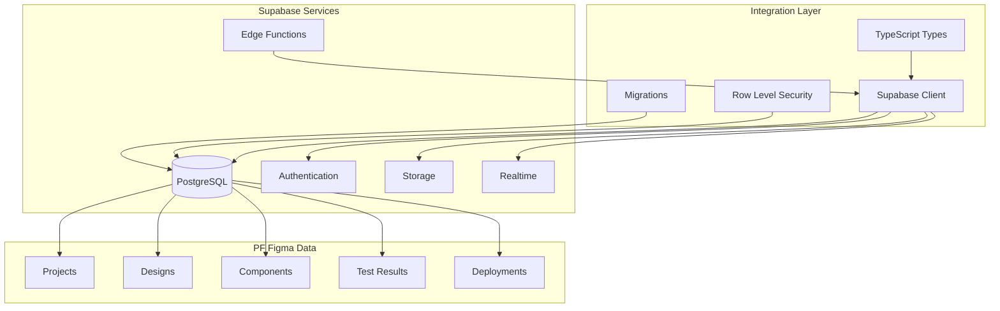
```mermaid
graph TB
    subgraph "Supabase Services"
        DB[(PostgreSQL)]
        AUTH[Authentication]
        STOR[Storage]
        RT[Realtime]
        EDGE[Edge Functions]
    end
    
    subgraph "PF Figma Data"
        PROJ[Projects]
        DES[Designs]
        COMP[Components]
        TEST[Test Results]
        DEPLOY[Deployments]
    end
    
    subgraph "Integration Layer"
        CLIENT[Supabase Client]
        RLS[Row Level Security]
        TYPES[TypeScript Types]
        MIG[Migrations]
    end
    
    DB --> PROJ
    DB --> DES
    DB --> COMP
    DB --> TEST
    DB --> DEPLOY
    
    CLIENT --> DB
    CLIENT --> AUTH
    CLIENT --> STOR
    CLIENT --> RT
    
    RLS --> DB
    TYPES --> CLIENT
    MIG --> DB
    
    EDGE --> CLIENT
```

**Supabase Data Model:**
- **Projects**: Application instances with configuration
- **Designs**: Figma file references and specifications
- **Components**: Generated component registry
- **Tests**: TDD test results and coverage
- **Deployments**: Environment deployment history

### 5.4 Third-Party Integrations

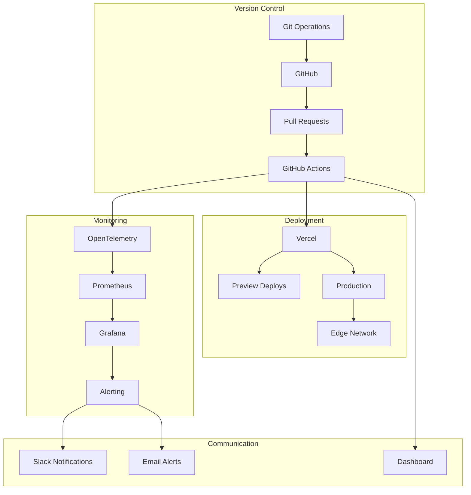
```mermaid
graph TB
    subgraph "Version Control"
        GH[GitHub]
        GIT[Git Operations]
        PR[Pull Requests]
        ACTIONS[GitHub Actions]
    end
    
    subgraph "Deployment"
        VCL[Vercel]
        PREVIEW[Preview Deploys]
        PROD[Production]
        EDGE[Edge Network]
    end
    
    subgraph "Monitoring"
        OTEL[OpenTelemetry]
        PROM[Prometheus]
        GRAF[Grafana]
        ALERT[Alerting]
    end
    
    subgraph "Communication"
        SLACK[Slack Notifications]
        EMAIL[Email Alerts]
        DASH[Dashboard]
    end
    
    GIT --> GH
    GH --> PR
    PR --> ACTIONS
    ACTIONS --> VCL
    
    VCL --> PREVIEW
    VCL --> PROD
    PROD --> EDGE
    
    ACTIONS --> OTEL
    OTEL --> PROM
    PROM --> GRAF
    GRAF --> ALERT
    
    ALERT --> SLACK
    ALERT --> EMAIL
    ACTIONS --> DASH
```

---

## 6. Infrastructure & Environments

### 6.1 Environment Architecture

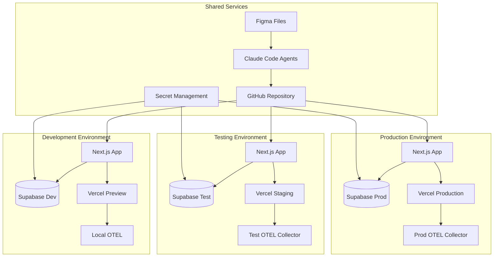
```mermaid
graph TB
    subgraph "Development Environment"
        DEV_APP[Next.js App]
        DEV_DB[(Supabase Dev)]
        DEV_VERCEL[Vercel Preview]
        DEV_OTEL[Local OTEL]
    end
    
    subgraph "Testing Environment"
        TEST_APP[Next.js App]
        TEST_DB[(Supabase Test)]
        TEST_VERCEL[Vercel Staging]
        TEST_OTEL[Test OTEL Collector]
    end
    
    subgraph "Production Environment"
        PROD_APP[Next.js App]
        PROD_DB[(Supabase Prod)]
        PROD_VERCEL[Vercel Production]
        PROD_OTEL[Prod OTEL Collector]
    end
    
    subgraph "Shared Services"
        GH_REPO[GitHub Repository]
        FIGMA[Figma Files]
        CLAUDE[Claude Code Agents]
        SECRETS[Secret Management]
    end
    
    DEV_APP --> DEV_DB
    DEV_APP --> DEV_VERCEL
    DEV_VERCEL --> DEV_OTEL
    
    TEST_APP --> TEST_DB
    TEST_APP --> TEST_VERCEL
    TEST_VERCEL --> TEST_OTEL
    
    PROD_APP --> PROD_DB
    PROD_APP --> PROD_VERCEL
    PROD_VERCEL --> PROD_OTEL
    
    GH_REPO --> DEV_APP
    GH_REPO --> TEST_APP
    GH_REPO --> PROD_APP
    
    FIGMA --> CLAUDE
    CLAUDE --> GH_REPO
    SECRETS --> DEV_DB
    SECRETS --> TEST_DB
    SECRETS --> PROD_DB
```

### 6.2 Deployment Pipeline

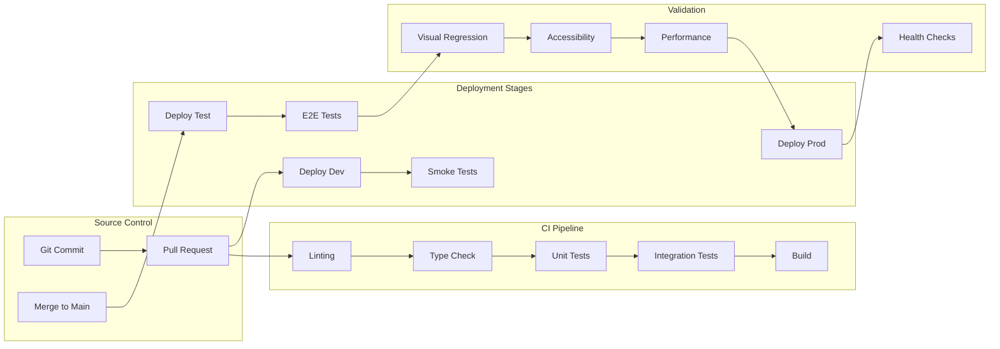
```mermaid
flowchart LR
    subgraph "Source Control"
        COMMIT[Git Commit]
        PR[Pull Request]
        MERGE[Merge to Main]
    end
    
    subgraph "CI Pipeline"
        LINT[Linting]
        TYPE[Type Check]
        UNIT[Unit Tests]
        INT[Integration Tests]
        BUILD[Build]
    end
    
    subgraph "Deployment Stages"
        DEV_DEPLOY[Deploy Dev]
        SMOKE[Smoke Tests]
        TEST_DEPLOY[Deploy Test]
        E2E[E2E Tests]
        PROD_DEPLOY[Deploy Prod]
    end
    
    subgraph "Validation"
        VR[Visual Regression]
        A11Y[Accessibility]
        PERF[Performance]
        HEALTH[Health Checks]
    end
    
    COMMIT --> PR
    PR --> LINT
    LINT --> TYPE
    TYPE --> UNIT
    UNIT --> INT
    INT --> BUILD
    
    PR --> DEV_DEPLOY
    DEV_DEPLOY --> SMOKE
    
    MERGE --> TEST_DEPLOY
    TEST_DEPLOY --> E2E
    E2E --> VR
    VR --> A11Y
    A11Y --> PERF
    
    PERF --> PROD_DEPLOY
    PROD_DEPLOY --> HEALTH
```

### 6.3 Environment Configuration

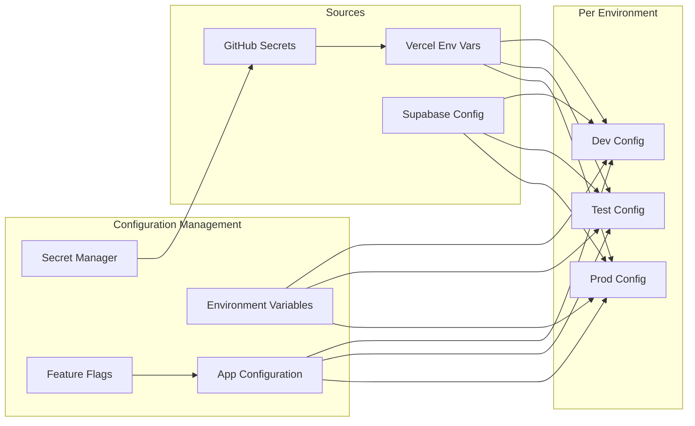
```mermaid
graph LR
    subgraph "Configuration Management"
        ENV_VARS[Environment Variables]
        SECRETS[Secret Manager]
        FEATURE[Feature Flags]
        CONFIG[App Configuration]
    end
    
    subgraph "Per Environment"
        DEV_CONFIG[Dev Config]
        TEST_CONFIG[Test Config]
        PROD_CONFIG[Prod Config]
    end
    
    subgraph "Sources"
        VERCEL_ENV[Vercel Env Vars]
        GH_SECRETS[GitHub Secrets]
        SB_CONFIG[Supabase Config]
    end
    
    ENV_VARS --> DEV_CONFIG
    ENV_VARS --> TEST_CONFIG
    ENV_VARS --> PROD_CONFIG
    
    SECRETS --> GH_SECRETS
    GH_SECRETS --> VERCEL_ENV
    VERCEL_ENV --> DEV_CONFIG
    VERCEL_ENV --> TEST_CONFIG
    VERCEL_ENV --> PROD_CONFIG
    
    FEATURE --> CONFIG
    CONFIG --> DEV_CONFIG
    CONFIG --> TEST_CONFIG
    CONFIG --> PROD_CONFIG
    
    SB_CONFIG --> DEV_CONFIG
    SB_CONFIG --> TEST_CONFIG
    SB_CONFIG --> PROD_CONFIG
```

---

## 7. Value Engineering Flow

### 7.1 Strategy to Production Pipeline

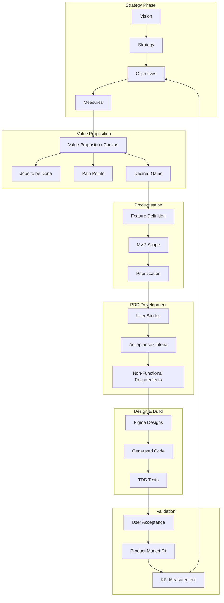
```mermaid
flowchart TB
    subgraph "Strategy Phase"
        V[Vision]
        S[Strategy]
        O[Objectives]
        M[Measures]
        V --> S --> O --> M
    end
    
    subgraph "Value Proposition"
        VP[Value Proposition Canvas]
        JOBS[Jobs to be Done]
        PAINS[Pain Points]
        GAINS[Desired Gains]
        VP --> JOBS
        VP --> PAINS
        VP --> GAINS
    end
    
    subgraph "Productisation"
        FEAT[Feature Definition]
        MVP[MVP Scope]
        PRIO[Prioritization]
        FEAT --> MVP --> PRIO
    end
    
    subgraph "PRD Development"
        US[User Stories]
        AC[Acceptance Criteria]
        NFR[Non-Functional Requirements]
        US --> AC --> NFR
    end
    
    subgraph "Design & Build"
        FIGMA[Figma Designs]
        CODE[Generated Code]
        TESTS[TDD Tests]
        FIGMA --> CODE --> TESTS
    end
    
    subgraph "Validation"
        UAT[User Acceptance]
        PMF[Product-Market Fit]
        KPI[KPI Measurement]
        UAT --> PMF --> KPI
    end
    
    M --> VP
    GAINS --> FEAT
    PRIO --> US
    NFR --> FIGMA
    TESTS --> UAT
    KPI --> O
```

### 7.2 Automated Value Capture

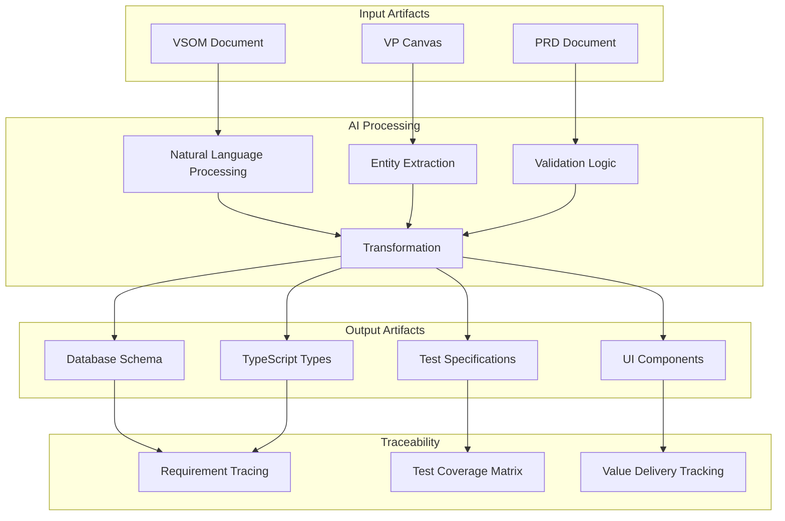
```mermaid
graph TB
    subgraph "Input Artifacts"
        VSOM_DOC[VSOM Document]
        VP_CANVAS[VP Canvas]
        PRD_DOC[PRD Document]
    end
    
    subgraph "AI Processing"
        NLP[Natural Language Processing]
        EXTRACT[Entity Extraction]
        VALIDATE[Validation Logic]
        TRANSFORM[Transformation]
    end
    
    subgraph "Output Artifacts"
        SCHEMA[Database Schema]
        TYPES[TypeScript Types]
        TESTS[Test Specifications]
        COMPONENTS[UI Components]
    end
    
    subgraph "Traceability"
        REQ_TRACE[Requirement Tracing]
        TEST_TRACE[Test Coverage Matrix]
        VALUE_TRACE[Value Delivery Tracking]
    end
    
    VSOM_DOC --> NLP
    VP_CANVAS --> EXTRACT
    PRD_DOC --> VALIDATE
    
    NLP --> TRANSFORM
    EXTRACT --> TRANSFORM
    VALIDATE --> TRANSFORM
    
    TRANSFORM --> SCHEMA
    TRANSFORM --> TYPES
    TRANSFORM --> TESTS
    TRANSFORM --> COMPONENTS
    
    SCHEMA --> REQ_TRACE
    TYPES --> REQ_TRACE
    TESTS --> TEST_TRACE
    COMPONENTS --> VALUE_TRACE
```

---

## 8. TDD Strategy Integration

### 8.1 Test Pyramid Architecture

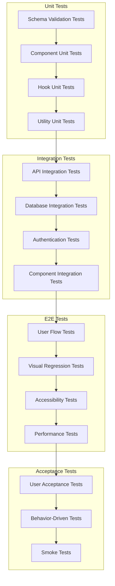
```mermaid
graph TB
    subgraph "Unit Tests"
        COMP_UNIT[Component Unit Tests]
        HOOK_UNIT[Hook Unit Tests]
        UTIL_UNIT[Utility Unit Tests]
        SCHEMA_UNIT[Schema Validation Tests]
    end
    
    subgraph "Integration Tests"
        API_INT[API Integration Tests]
        DB_INT[Database Integration Tests]
        AUTH_INT[Authentication Tests]
        COMP_INT[Component Integration Tests]
    end
    
    subgraph "E2E Tests"
        USER_E2E[User Flow Tests]
        VISUAL_E2E[Visual Regression Tests]
        A11Y_E2E[Accessibility Tests]
        PERF_E2E[Performance Tests]
    end
    
    subgraph "Acceptance Tests"
        UAT[User Acceptance Tests]
        BDD[Behavior-Driven Tests]
        SMOKE[Smoke Tests]
    end
    
    SCHEMA_UNIT --> COMP_UNIT
    COMP_UNIT --> HOOK_UNIT
    HOOK_UNIT --> UTIL_UNIT
    
    UTIL_UNIT --> API_INT
    API_INT --> DB_INT
    DB_INT --> AUTH_INT
    AUTH_INT --> COMP_INT
    
    COMP_INT --> USER_E2E
    USER_E2E --> VISUAL_E2E
    VISUAL_E2E --> A11Y_E2E
    A11Y_E2E --> PERF_E2E
    
    PERF_E2E --> UAT
    UAT --> BDD
    BDD --> SMOKE
```

### 8.2 TDD Workflow

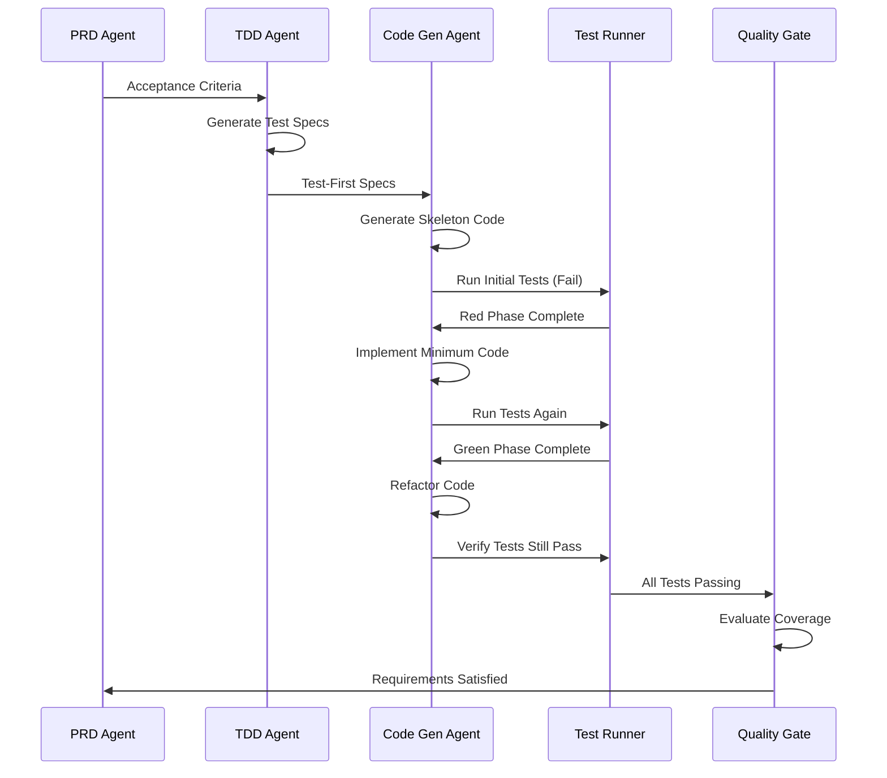
```mermaid
sequenceDiagram
    participant PRD as PRD Agent
    participant TDD as TDD Agent
    participant CODE as Code Gen Agent
    participant TEST as Test Runner
    participant GATE as Quality Gate
    
    PRD->>TDD: Acceptance Criteria
    TDD->>TDD: Generate Test Specs
    TDD->>CODE: Test-First Specs
    CODE->>CODE: Generate Skeleton Code
    CODE->>TEST: Run Initial Tests (Fail)
    TEST->>CODE: Red Phase Complete
    CODE->>CODE: Implement Minimum Code
    CODE->>TEST: Run Tests Again
    TEST->>CODE: Green Phase Complete
    CODE->>CODE: Refactor Code
    CODE->>TEST: Verify Tests Still Pass
    TEST->>GATE: All Tests Passing
    GATE->>GATE: Evaluate Coverage
    GATE->>PRD: Requirements Satisfied
```

### 8.3 Test Coverage Matrix

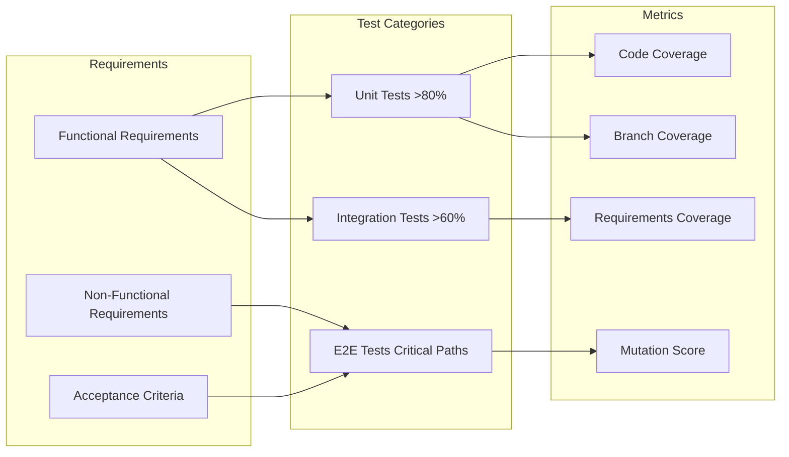
```mermaid
graph LR
    subgraph "Requirements"
        FR[Functional Requirements]
        NFR[Non-Functional Requirements]
        AC[Acceptance Criteria]
    end
    
    subgraph "Test Categories"
        UNIT[Unit Tests >80%]
        INT[Integration Tests >60%]
        E2E[E2E Tests Critical Paths]
    end
    
    subgraph "Metrics"
        COV[Code Coverage]
        BRANCH[Branch Coverage]
        REQ_COV[Requirements Coverage]
        MUTATION[Mutation Score]
    end
    
    FR --> UNIT
    FR --> INT
    NFR --> E2E
    AC --> E2E
    
    UNIT --> COV
    UNIT --> BRANCH
    INT --> REQ_COV
    E2E --> MUTATION
```

---

## 9. MVP Demonstration Applications

### 9.1 Demo Application 1: Product Showcase

**Purpose:** Validate Figma-to-Production pipeline with simple CRUD application

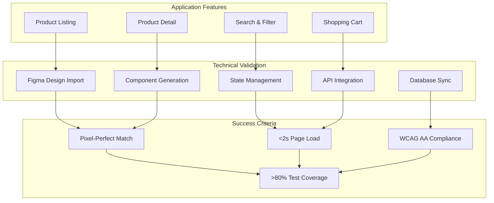
```mermaid
graph TB
    subgraph "Application Features"
        LIST[Product Listing]
        DETAIL[Product Detail]
        SEARCH[Search & Filter]
        CART[Shopping Cart]
    end
    
    subgraph "Technical Validation"
        FIGMA_DESIGN[Figma Design Import]
        COMP_GEN[Component Generation]
        STATE_MGMT[State Management]
        API_INT[API Integration]
        DB_SYNC[Database Sync]
    end
    
    subgraph "Success Criteria"
        PIXEL[Pixel-Perfect Match]
        PERF[<2s Page Load]
        A11Y[WCAG AA Compliance]
        TEST[>80% Test Coverage]
    end
    
    LIST --> FIGMA_DESIGN
    DETAIL --> COMP_GEN
    SEARCH --> STATE_MGMT
    CART --> API_INT
    
    FIGMA_DESIGN --> PIXEL
    COMP_GEN --> PIXEL
    STATE_MGMT --> PERF
    API_INT --> PERF
    DB_SYNC --> A11Y
    
    PIXEL --> TEST
    PERF --> TEST
    A11Y --> TEST
```

**Figma Design Requirements:**
- 4-5 page layouts (Home, List, Detail, Cart, Checkout)
- Responsive breakpoints (Mobile, Tablet, Desktop)
- Interactive prototypes with state variants
- Design tokens for colors, typography, spacing
- Component library with variants

### 9.2 Demo Application 2: Dashboard Analytics

**Purpose:** Validate complex UI components and real-time data integration

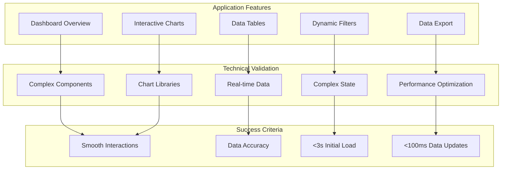
```mermaid
graph TB
    subgraph "Application Features"
        DASH[Dashboard Overview]
        CHARTS[Interactive Charts]
        TABLES[Data Tables]
        FILTERS[Dynamic Filters]
        EXPORT[Data Export]
    end
    
    subgraph "Technical Validation"
        COMPLEX_COMP[Complex Components]
        RT_DATA[Real-time Data]
        CHARTS_LIB[Chart Libraries]
        PERF_OPT[Performance Optimization]
        STATE_COMPLEX[Complex State]
    end
    
    subgraph "Success Criteria"
        INTERACTIVITY[Smooth Interactions]
        DATA_ACCURACY[Data Accuracy]
        LOAD_TIME[<3s Initial Load]
        UPDATE[<100ms Data Updates]
    end
    
    DASH --> COMPLEX_COMP
    CHARTS --> CHARTS_LIB
    TABLES --> RT_DATA
    FILTERS --> STATE_COMPLEX
    EXPORT --> PERF_OPT
    
    COMPLEX_COMP --> INTERACTIVITY
    CHARTS_LIB --> INTERACTIVITY
    RT_DATA --> DATA_ACCURACY
    STATE_COMPLEX --> LOAD_TIME
    PERF_OPT --> UPDATE
```

**Figma Design Requirements:**
- Complex dashboard layout with grid system
- Chart components (Line, Bar, Pie, Area)
- Data table with sorting, filtering, pagination
- Filter controls (dropdowns, date pickers, toggles)
- Export/download functionality

### 9.3 MVP Validation Framework

```mermaid
flowchart LR
    subgraph "Stage 1: Design Import"
        FIG_IMPORT[Import Figma File]
        TOKEN_EXTRACT[Extract Tokens]
        COMP_PARSE[Parse Components]
        VALIDATE_DESIGN[Validate Design]
    end
    
    subgraph "Stage 2: Code Generation"
        GEN_TYPES[Generate Types]
        GEN_COMP[Generate Components]
        GEN_TESTS[Generate Tests]
        GEN_API[Generate API Layer]
    end
    
    subgraph "Stage 3: Deployment"
        DEPLOY_DEV[Deploy to Dev]
        RUN_TESTS[Run Test Suite]
        DEPLOY_TEST[Deploy to Test]
        APPROVE_PROD[Approve for Prod]
    end
    
    subgraph "Stage 4: Validation"
        COMPARE_VISUAL[Visual Comparison]
        MEASURE_PERF[Performance Metrics]
        CHECK_FUNC[Functional Validation]
        ASSESS_PMF[PMF Assessment]
    end
    
    FIG_IMPORT --> TOKEN_EXTRACT
    TOKEN_EXTRACT --> COMP_PARSE
    COMP_PARSE --> VALIDATE_DESIGN
    VALIDATE_DESIGN --> GEN_TYPES
    
    GEN_TYPES --> GEN_COMP
    GEN_COMP --> GEN_TESTS
    GEN_TESTS --> GEN_API
    GEN_API --> DEPLOY_DEV
    
    DEPLOY_DEV --> RUN_TESTS
    RUN_TESTS --> DEPLOY_TEST
    DEPLOY_TEST --> APPROVE_PROD
    APPROVE_PROD --> COMPARE_VISUAL
    
    COMPARE_VISUAL --> MEASURE_PERF
    MEASURE_PERF --> CHECK_FUNC
    CHECK_FUNC --> ASSESS_PMF
```

---

## 10. Dependencies & Constraints

### 10.1 Technology Dependencies

```mermaid
graph TB
    subgraph "Core Dependencies"
        FIGMA_API[Figma API Access]
        CLAUDE[Claude Code License]
        ANTHRO_SDK[Anthropic SDK]
        SUPABASE[Supabase Project]
        VERCEL[Vercel Account]
    end
    
    subgraph "Development Stack"
        NEXTJS[Next.js 14+]
        REACT[React 18+]
        TS[TypeScript 5+]
        SHADCN[Shadcn/UI]
        TAILWIND[Tailwind CSS]
    end
    
    subgraph "Testing Stack"
        VITEST[Vitest]
        RTL[React Testing Library]
        PLAYWRIGHT[Playwright E2E]
        CHROMATIC[Chromatic Visual]
    end
    
    subgraph "CI/CD Stack"
        GITHUB[GitHub]
        GH_ACTIONS[GitHub Actions]
        OTEL[OpenTelemetry]
    end
    
    FIGMA_API --> ANTHRO_SDK
    CLAUDE --> ANTHRO_SDK
    ANTHRO_SDK --> SUPABASE
    SUPABASE --> VERCEL
    
    NEXTJS --> REACT
    REACT --> TS
    TS --> SHADCN
    SHADCN --> TAILWIND
    
    VITEST --> RTL
    RTL --> PLAYWRIGHT
    PLAYWRIGHT --> CHROMATIC
    
    GITHUB --> GH_ACTIONS
    GH_ACTIONS --> OTEL
```

### 10.2 Operational Dependencies

| Dependency | Type | Criticality | Fallback Strategy |
|------------|------|-------------|-------------------|
| Figma API | External Service | High | Cache design specs locally |
| Claude Code | AI Service | Critical | Queue tasks for retry |
| Supabase | Backend Service | Critical | Local PostgreSQL for dev |
| Vercel | Deployment Platform | High | Alternative deployment (Docker) |
| GitHub | Version Control | High | Local Git with backup remote |
| OpenTelemetry | Monitoring | Medium | Console logging fallback |

### 10.3 Constraints

**Technical Constraints:**
- Figma API rate limits (30 req/min for file reads)
- Claude context window limits (200K tokens)
- Supabase free tier limitations (50MB storage, 500MB bandwidth)
- Vercel serverless function timeouts (10-15s)
- GitHub Actions minutes quota

**Operational Constraints:**
- Human approval required for production deployments
- Design changes must go through review process
- Test coverage thresholds are hard requirements
- Security scans must pass before deployment

**Business Constraints:**
- MVP timeline: 8-12 weeks
- Budget for external services: TBD
- Team availability for reviews
- Stakeholder approval cycles

### 10.4 Risk Matrix

```mermaid
quadrantChart
    title Risk Assessment Matrix
    x-axis Low Impact --> High Impact
    y-axis Low Probability --> High Probability
    quadrant-1 Monitor
    quadrant-2 Mitigate
    quadrant-3 Accept
    quadrant-4 Prevent
    Figma API Downtime: [0.3, 0.4]
    Claude Rate Limits: [0.6, 0.7]
    Generated Code Quality: [0.7, 0.5]
    Test Flakiness: [0.4, 0.6]
    Integration Failures: [0.5, 0.4]
    Security Vulnerabilities: [0.8, 0.3]
    Performance Degradation: [0.6, 0.4]
    Cost Overruns: [0.7, 0.3]
```

---

## Appendices

### Appendix A: Glossary

| Term | Definition |
|------|------------|
| **PF Figma** | Platform Figma - Agentic front-end solution architecture |
| **VSOM** | Vision, Strategy, Objectives, Measures framework |
| **TDD** | Test-Driven Development |
| **PRD** | Product Requirements Document |
| **MVP** | Minimum Viable Product |
| **PMF** | Product-Market Fit |
| **MCP** | Model Context Protocol |
| **RLS** | Row Level Security (Supabase) |
| **OTEL** | OpenTelemetry |

### Appendix B: API Contracts

**Design Specification API:**
```typescript
interface DesignSpecification {
  id: string;
  figmaFileId: string;
  version: string;
  components: Component[];
  designTokens: DesignTokens;
  validationStatus: ValidationResult;
}
```

**Pipeline Execution API:**
```typescript
interface PipelineExecution {
  id: string;
  projectId: string;
  stage: PipelineStage;
  status: ExecutionStatus;
  artifacts: Record<string, Artifact>;
  testResults: TestResults;
  deployments: Deployment[];
}
```

### Appendix C: Environment Variables

```bash
# Figma
FIGMA_API_TOKEN=figd_xxx
FIGMA_WEBHOOK_SECRET=whsec_xxx

# Anthropic
ANTHROPIC_API_KEY=sk-ant-xxx
CLAUDE_CODE_ENABLE_TELEMETRY=1

# Supabase
NEXT_PUBLIC_SUPABASE_URL=https://xxx.supabase.co
NEXT_PUBLIC_SUPABASE_ANON_KEY=eyJxxx
SUPABASE_SERVICE_ROLE_KEY=eyJxxx

# Vercel
VERCEL_TOKEN=xxx
VERCEL_ORG_ID=xxx
VERCEL_PROJECT_ID=xxx

# OpenTelemetry
OTEL_EXPORTER_OTLP_ENDPOINT=http://localhost:4317
OTEL_METRICS_EXPORTER=otlp
OTEL_LOGS_EXPORTER=otlp

# GitHub
GITHUB_TOKEN=ghp_xxx
```

### Appendix D: Database Schema (Core Tables)

```sql
-- Projects
CREATE TABLE projects (
  id UUID PRIMARY KEY,
  name TEXT NOT NULL,
  vsom_config JSONB,
  value_proposition JSONB,
  created_at TIMESTAMPTZ DEFAULT NOW()
);

-- Designs
CREATE TABLE designs (
  id UUID PRIMARY KEY,
  project_id UUID REFERENCES projects(id),
  figma_file_id TEXT NOT NULL,
  specification JSONB NOT NULL,
  version TEXT NOT NULL
);

-- Components
CREATE TABLE components (
  id UUID PRIMARY KEY,
  design_id UUID REFERENCES designs(id),
  name TEXT NOT NULL,
  type TEXT NOT NULL,
  code TEXT NOT NULL,
  test_coverage DECIMAL(5,2)
);

-- Deployments
CREATE TABLE deployments (
  id UUID PRIMARY KEY,
  project_id UUID REFERENCES projects(id),
  environment TEXT NOT NULL,
  status TEXT NOT NULL,
  url TEXT,
  deployed_at TIMESTAMPTZ DEFAULT NOW()
);
```

### Appendix E: Quality Gate Thresholds

| Gate | Metric | Threshold | Enforcement |
|------|--------|-----------|-------------|
| Unit Tests | Coverage | ≥80% | Hard Block |
| Integration Tests | Pass Rate | 100% | Hard Block |
| Visual Regression | Similarity | ≥99% | Soft Block (Review) |
| Accessibility | WCAG AA | 0 violations | Hard Block |
| Performance | LCP | <2.5s | Soft Block (Warning) |
| Performance | FID | <100ms | Soft Block (Warning) |
| Performance | CLS | <0.1 | Soft Block (Warning) |
| Security | CVE Scan | 0 critical | Hard Block |
| Type Safety | TypeScript | 0 errors | Hard Block |
| Linting | ESLint | 0 errors | Hard Block |

### Appendix F: Monitoring Metrics

**Agent Metrics:**
- `agent_execution_duration_seconds`
- `agent_execution_total{status}`
- `agent_error_rate`
- `context_retrieval_latency_ms`

**Pipeline Metrics:**
- `pipeline_completion_time_seconds`
- `pipeline_success_rate`
- `quality_gate_pass_rate{gate}`
- `deployment_frequency`

**Application Metrics:**
- `lcp_seconds`
- `fid_milliseconds`
- `cls_score`
- `error_rate{type}`
- `api_latency_p95`

### Appendix G: Document References

1. PF-Figma-Solution-Architect-Agent-Strategy.md
2. PF-Figma-Solution-Architect-Agent-Implementation.md
3. PF-Figma-Technical-Architecture-Reference.md
4. Anthropic Claude Code Documentation
5. Figma REST API Documentation
6. Supabase Documentation
7. Next.js App Router Documentation
8. OpenTelemetry Specification

---

**Document Control:**
- **Author:** PF Figma Architecture Team
- **Reviewed By:** TBD
- **Approved By:** TBD
- **Next Review:** TBD
- **Change Log:** Initial version 1.0

---

**END OF HIGH-LEVEL DESIGN DOCUMENT**
