# PF Figma: MVP Architecture & Hosting Environment Proposal
## Scalable AI SaaS Platform for 100-1000 Customers

**Document:** PF-Figma-MVP-Architecture-Proposal  
**Version:** 1.0  
**Date:** November 2025  
**Target Scale:** 100-1000 AI SaaS Customers (Initial Phase)  

---

## Table of Contents

1. [Executive Summary](#1-executive-summary)
2. [MVP Architecture Overview](#2-mvp-architecture-overview)
3. [Solution Architect Agent MVP](#3-solution-architect-agent-mvp)
4. [CI/CD MVP Architecture](#4-cicd-mvp-architecture)
5. [Hosting Environment Analysis](#5-hosting-environment-analysis)
6. [Scalability Architecture](#6-scalability-architecture)
7. [Security Architecture](#7-security-architecture)
8. [Cost Projections](#8-cost-projections)
9. [Risk Analysis](#9-risk-analysis)
10. [Final Recommendation](#10-final-recommendation)

---

## 1. Executive Summary

This document proposes a production-ready MVP architecture for PF Figma that balances simplicity, security, and scalability for an AI SaaS platform targeting 100-1000 customers. The architecture leverages Claude Code agents for automation while maintaining operational excellence suitable for enterprise clients.

### Strategic Priorities

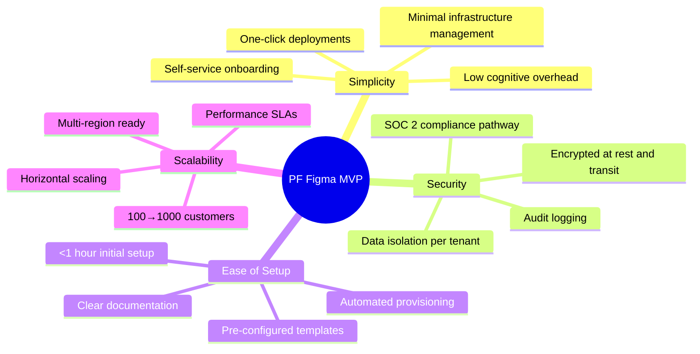

### Recommended Stack

**Primary Choice:** DigitalOcean App Platform + Supabase + Vercel (Hybrid)

- **Frontend Hosting:** Vercel (Edge optimized)
- **Agent Orchestration:** DigitalOcean App Platform (Container workloads)
- **Database & Auth:** Supabase (Multi-tenant PostgreSQL)
- **CI/CD:** GitHub Actions (Central orchestration)
- **Monitoring:** OpenTelemetry + Grafana Cloud

---

## 2. MVP Architecture Overview

### 2.1 High-Level System Architecture

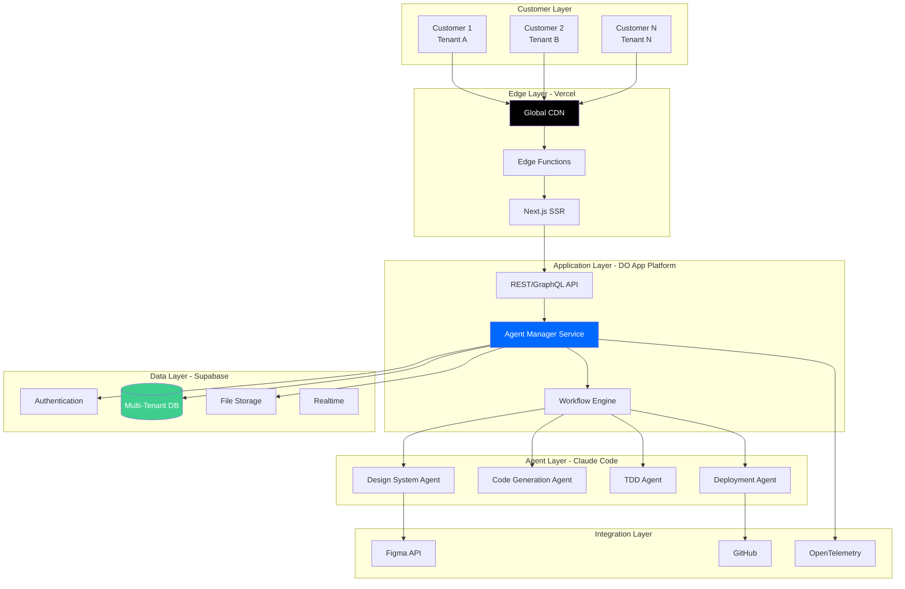

### 2.2 Multi-Tenant Architecture

```mermaid
graph TB
    subgraph "Tenant Isolation Strategy"
        direction TB
        
        subgraph "Application Tier"
            SHARED_APP[Shared Application Code]
            TENANT_CONFIG[Per-Tenant Configuration]
            FEATURE_FLAGS[Feature Flags per Tenant]
        end
        
        subgraph "Data Tier"
            RLS[Row Level Security]
            SCHEMA_ISO[Schema Isolation Option]
            ENCRYPTED[Encrypted Tenant Data]
        end
        
        subgraph "Agent Tier"
            SHARED_AGENTS[Shared Agent Pool]
            TENANT_CTX[Tenant-Specific Context]
            ISOLATED_EXEC[Isolated Execution Environment]
        end
    end
    
    SHARED_APP --> TENANT_CONFIG
    TENANT_CONFIG --> FEATURE_FLAGS
    
    RLS --> SCHEMA_ISO
    SCHEMA_ISO --> ENCRYPTED
    
    SHARED_AGENTS --> TENANT_CTX
    TENANT_CTX --> ISOLATED_EXEC
```

### 2.3 Core Components

| Component | Technology | Purpose | Scaling Strategy |
|-----------|-----------|---------|------------------|
| **Frontend** | Next.js 14 + Shadcn | Customer dashboard, design preview | Vercel Edge CDN |
| **API Gateway** | Next.js API Routes | Request routing, rate limiting | Vercel Serverless |
| **Agent Manager** | Node.js Container | Orchestrates Claude agents | DO App Platform horizontal |
| **Workflow Engine** | Custom TypeScript | Manages pipeline state | Stateless, DB-backed |
| **Authentication** | Supabase Auth | SSO, RBAC, tenant isolation | Supabase managed |
| **Database** | PostgreSQL 16 | Multi-tenant data store | Supabase scaling |
| **File Storage** | Supabase Storage | Design assets, generated code | S3-compatible CDN |
| **Message Queue** | Supabase Realtime | Async task processing | Event-driven |
| **Monitoring** | OpenTelemetry | Observability, cost tracking | Grafana Cloud |

---

## 3. Solution Architect Agent MVP

### 3.1 Simplified Agent Architecture

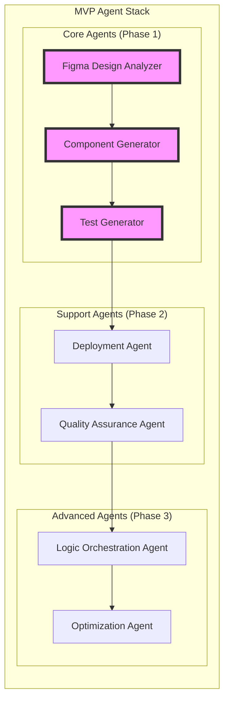

### 3.2 MVP Agent Capabilities

**Phase 1 (MVP Launch - 3 Agents)**

```typescript
// Minimal viable agent set
const mvpAgents = {
  figmaDesignAnalyzer: {
    purpose: 'Extract design specs from Figma',
    inputs: ['figmaFileId', 'accessToken'],
    outputs: ['designSpecification', 'componentList', 'designTokens'],
    complexity: 'Medium',
    estimatedTime: '30-60s per file'
  },
  
  componentGenerator: {
    purpose: 'Generate Next.js/Shadcn components',
    inputs: ['designSpecification', 'targetFramework'],
    outputs: ['reactComponents', 'typeDefinitions', 'storybook'],
    complexity: 'High',
    estimatedTime: '2-5 min per component set'
  },
  
  testGenerator: {
    purpose: 'Create TDD test suites',
    inputs: ['components', 'requirements'],
    outputs: ['unitTests', 'integrationTests', 'coverageReport'],
    complexity: 'Medium',
    estimatedTime: '1-3 min per component'
  }
};
```

### 3.3 Agent Execution Model

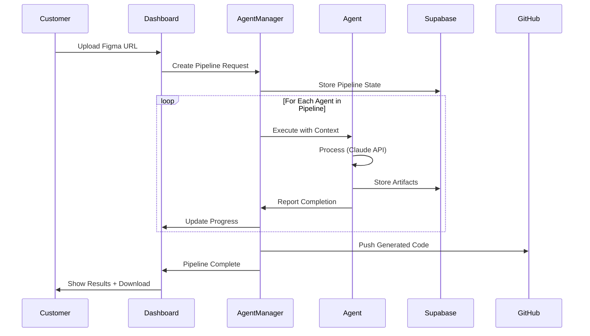

### 3.4 Context Management (Simplified)

```typescript
// Simplified context for MVP
interface MVPContext {
  // Tenant identification
  tenantId: string;
  projectId: string;
  
  // Pipeline state
  pipelineId: string;
  currentStage: 'design' | 'generation' | 'testing' | 'deployment';
  
  // Artifacts (stored in Supabase Storage)
  designSpec: string;  // URL to JSON
  generatedCode: string;  // URL to ZIP
  testResults: string;  // URL to report
  
  // Metadata
  createdAt: Date;
  updatedAt: Date;
  status: 'pending' | 'running' | 'completed' | 'failed';
}

// Context stored in Supabase with RLS
const contextTable = `
  CREATE TABLE pipeline_contexts (
    id UUID PRIMARY KEY,
    tenant_id UUID REFERENCES tenants(id),
    project_id UUID REFERENCES projects(id),
    context JSONB NOT NULL,
    created_at TIMESTAMPTZ DEFAULT NOW(),
    updated_at TIMESTAMPTZ DEFAULT NOW()
  );
  
  -- Row Level Security
  ALTER TABLE pipeline_contexts ENABLE ROW LEVEL SECURITY;
  
  CREATE POLICY "Tenants can only access their own contexts"
    ON pipeline_contexts
    FOR ALL
    USING (tenant_id = auth.uid());
`;
```

---

## 4. CI/CD MVP Architecture

### 4.1 Simplified Pipeline

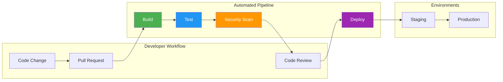

### 4.2 MVP CI/CD Configuration

```yaml
# Simplified GitHub Actions for MVP
name: PF Figma MVP Pipeline

on:
  push:
    branches: [main]
  pull_request:
    branches: [main]

jobs:
  build-test-deploy:
    runs-on: ubuntu-latest
    
    steps:
      - uses: actions/checkout@v4
      
      - name: Setup Node.js
        uses: actions/setup-node@v4
        with:
          node-version: '20'
          cache: 'npm'
      
      - name: Install & Build
        run: |
          npm ci
          npm run build
      
      - name: Test
        run: npm test -- --coverage
      
      - name: Security Scan
        uses: snyk/actions/node@master
        env:
          SNYK_TOKEN: ${{ secrets.SNYK_TOKEN }}
      
      - name: Deploy to Vercel (Frontend)
        if: github.ref == 'refs/heads/main'
        uses: amondnet/vercel-action@v25
        with:
          vercel-token: ${{ secrets.VERCEL_TOKEN }}
          vercel-org-id: ${{ secrets.VERCEL_ORG_ID }}
          vercel-project-id: ${{ secrets.VERCEL_PROJECT_ID }}
          vercel-args: '--prod'
      
      - name: Deploy to DigitalOcean (Backend)
        if: github.ref == 'refs/heads/main'
        uses: digitalocean/app_action/deploy@v2
        with:
          token: ${{ secrets.DIGITALOCEAN_TOKEN }}
```

### 4.3 Deployment Strategy for Multi-Customer

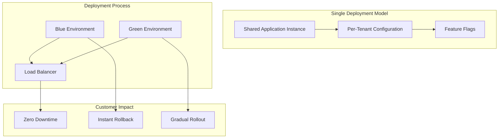

---

## 5. Hosting Environment Analysis

### 5.1 Comprehensive Comparison Matrix

```mermaid
radar
    title Hosting Platform Evaluation (1-10 Scale)
    "Simplicity" : 9, 8, 9, 6, 7
    "Security" : 8, 9, 7, 10, 9
    "Setup Ease" : 9, 8, 10, 5, 7
    "CI/CD Integration" : 9, 9, 8, 10, 8
    "Scalability" : 7, 9, 6, 10, 8
    "Cost Efficiency" : 8, 6, 9, 5, 7
```

**Platforms:** Vercel, DigitalOcean, Railway, AWS, Hybrid (Vercel + DO)

### 5.2 Option 1: Vercel (Frontend-First)

**Architecture:**
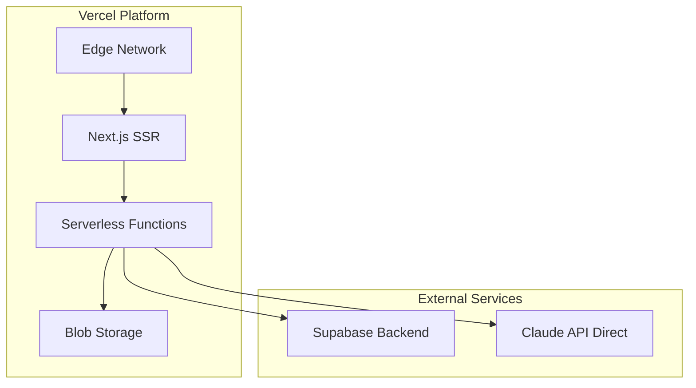

**Pros:**
- ✅ **Simplicity**: One platform for entire frontend stack
- ✅ **Setup Ease**: Deploy in under 10 minutes
- ✅ **Edge Performance**: Global CDN, sub-100ms response times
- ✅ **Preview Deployments**: Per-PR preview URLs for testing
- ✅ **Next.js Native**: Best-in-class Next.js support (creator of framework)
- ✅ **Automatic HTTPS**: Free SSL certificates
- ✅ **Zero Infrastructure**: No servers to manage

**Cons:**
- ❌ **Serverless Limits**: 10-30 second function timeouts (agent execution issue)
- ❌ **Cost at Scale**: $20/user/month + usage can escalate quickly
- ❌ **Backend Constraints**: Not ideal for long-running agent processes
- ❌ **Vendor Lock-in**: Tight coupling with Vercel platform
- ❌ **No Static IP**: Challenging for webhook integrations
- ❌ **Cold Starts**: Serverless can have latency spikes
- ❌ **Limited Compute**: Can't run Claude Code CLI directly

**Best For:** 
- Pure frontend applications
- < 50 customers (low agent execution volume)
- Teams prioritizing developer experience over flexibility

**Estimated Cost (500 customers):** $150-400/month

---

### 5.3 Option 2: DigitalOcean App Platform (Balanced)

**Architecture:**
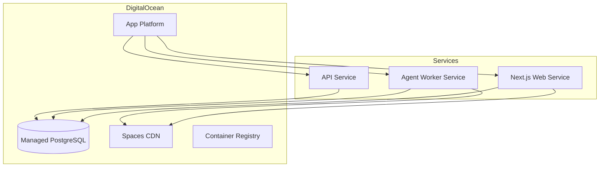

**Pros:**
- ✅ **Complete Stack**: Web, workers, databases, storage in one platform
- ✅ **Long-Running Jobs**: No function timeouts, ideal for agents
- ✅ **Predictable Costs**: Fixed pricing per resource
- ✅ **Static IP**: Available for integrations
- ✅ **GitHub Actions Native**: First-class CI/CD support
- ✅ **Container Flexibility**: Run any workload
- ✅ **Managed Database**: PostgreSQL with backups
- ✅ **Security**: SOC 2 Type II compliant

**Cons:**
- ❌ **Setup Complexity**: More configuration than Vercel (App Spec YAML)
- ❌ **No Edge Functions**: Not as fast as Vercel's edge network
- ❌ **Learning Curve**: More concepts to understand
- ❌ **CDN Not Native**: Requires Spaces configuration
- ❌ **Scaling Configuration**: Manual replica management
- ❌ **Cost at Baseline**: Higher minimum cost than serverless

**Best For:**
- Full-stack applications with backend processing
- 100-500 customers
- Teams needing agent execution flexibility

**Estimated Cost (500 customers):** $200-500/month

---

### 5.4 Option 3: Railway (Rapid MVP)

**Architecture:**
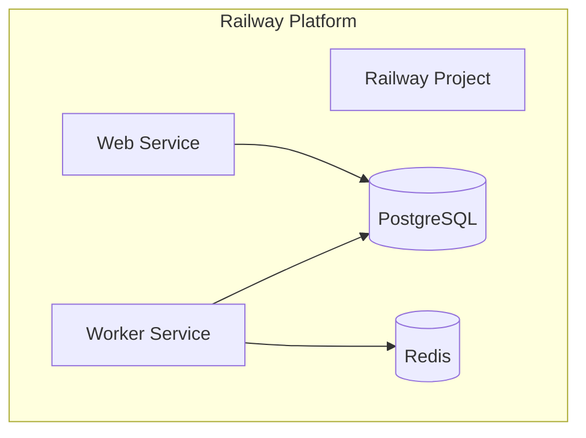

**Pros:**
- ✅ **Fastest Setup**: Deploy in under 5 minutes
- ✅ **Magical DX**: Auto-detects framework and configures
- ✅ **Built-in Databases**: PostgreSQL, MySQL, Redis one-click
- ✅ **Usage-Based**: Pay only for what you use
- ✅ **Preview Environments**: Per-branch deployments
- ✅ **Simple UI**: Intuitive dashboard
- ✅ **GitHub Integration**: Automatic deploys on push

**Cons:**
- ❌ **Enterprise Readiness**: Less mature than DO or AWS
- ❌ **No Static IP**: Can't configure fixed IPs
- ❌ **Limited Regions**: Fewer global regions than alternatives
- ❌ **Cost Unpredictability**: Usage-based can spike unexpectedly
- ❌ **Scaling Limits**: Not as robust for high-traffic scenarios
- ❌ **SOC 2 Journey**: Not yet SOC 2 certified
- ❌ **Support Tiers**: Limited enterprise support options

**Best For:**
- Initial MVP validation (< 50 customers)
- Solo developers or small teams
- Rapid prototyping before scaling

**Estimated Cost (500 customers):** $150-600/month (variable)

---

### 5.5 Option 4: AWS (Enterprise-Grade)

**Architecture:**
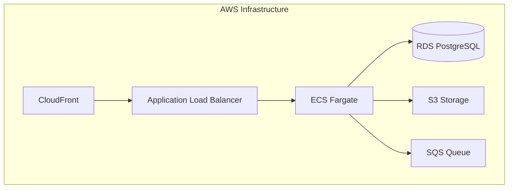

**Pros:**
- ✅ **Enterprise Security**: Comprehensive compliance certifications
- ✅ **Infinite Scalability**: Handles any traffic volume
- ✅ **Global Presence**: Most regions worldwide
- ✅ **Service Variety**: Any tool you need exists
- ✅ **Fine-Grained Control**: Complete infrastructure control
- ✅ **Mature Ecosystem**: Battle-tested for decades
- ✅ **Enterprise Support**: Premium support options

**Cons:**
- ❌ **Complexity**: Steep learning curve (100+ services)
- ❌ **Setup Time**: Days to weeks for proper configuration
- ❌ **Cost Overhead**: Expensive for small scale
- ❌ **IAM Complexity**: Security configuration is complex
- ❌ **Operational Burden**: Requires DevOps expertise
- ❌ **Billing Surprises**: Complex pricing model
- ❌ **Over-Engineering**: Overkill for MVP phase

**Best For:**
- Enterprise customers with compliance requirements
- 1000+ customers with dedicated DevOps team
- Existing AWS-heavy organizations

**Estimated Cost (500 customers):** $500-2000/month

---

### 5.6 Option 5: Hybrid Architecture (RECOMMENDED)

**Architecture:**
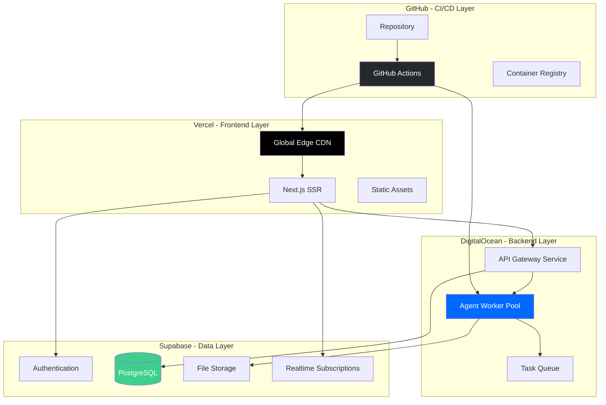

**Pros:**
- ✅ **Best of Both Worlds**: Vercel's edge + DO's backend power
- ✅ **Optimal Performance**: Edge for UI, containers for agents
- ✅ **Security**: Supabase RLS + DO's compliance
- ✅ **Scalability**: Each layer scales independently
- ✅ **Cost Effective**: Pay for specialized services
- ✅ **Flexibility**: Swap components as needed
- ✅ **Enterprise Ready**: Path to SOC 2 compliance
- ✅ **Developer Experience**: Fast deployments + powerful backend

**Cons:**
- ❌ **Multiple Vendors**: Managing 3+ services
- ❌ **Integration Complexity**: Cross-platform communication
- ❌ **Monitoring Overhead**: Observability across platforms
- ❌ **Cost Management**: Multiple bills to track
- ❌ **Setup Time**: Longer initial configuration
- ❌ **Debugging**: Issues can span platforms

**Best For:**
- 100-1000 customers (MVP to scale)
- Teams balancing DX with enterprise needs
- SaaS products requiring both speed and reliability

**Estimated Cost (500 customers):** $250-600/month

---

## 6. Scalability Architecture

### 6.1 Scaling Strategy (100 → 1000 Customers)

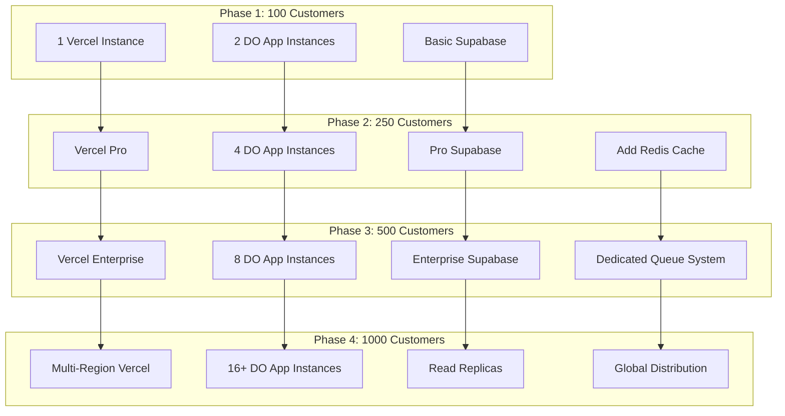

### 6.2 Performance Targets

| Customer Count | Response Time (p95) | Agent Throughput | Concurrent Pipelines | Availability |
|----------------|---------------------|------------------|----------------------|--------------|
| 100 | < 200ms | 50 jobs/hour | 10 | 99.5% |
| 250 | < 200ms | 125 jobs/hour | 25 | 99.7% |
| 500 | < 150ms | 250 jobs/hour | 50 | 99.9% |
| 1000 | < 100ms | 500 jobs/hour | 100 | 99.95% |

### 6.3 Horizontal Scaling Configuration

```yaml
# DigitalOcean App Spec for Agent Workers
services:
  - name: agent-worker
    github:
      repo: your-org/pf-figma-agents
      branch: main
    
    # Auto-scaling configuration
    instance_count: 2  # Start with 2
    instance_size_slug: professional-xs
    
    # Scale based on queue depth
    autoscaling:
      min_instance_count: 2
      max_instance_count: 16
      metrics:
        - type: CPU
          percent: 70
        - type: MEMORY
          percent: 80
    
    # Health monitoring
    health_check:
      http_path: /health
      initial_delay_seconds: 30
      period_seconds: 10
```

---

## 7. Security Architecture

### 7.1 Security Layers

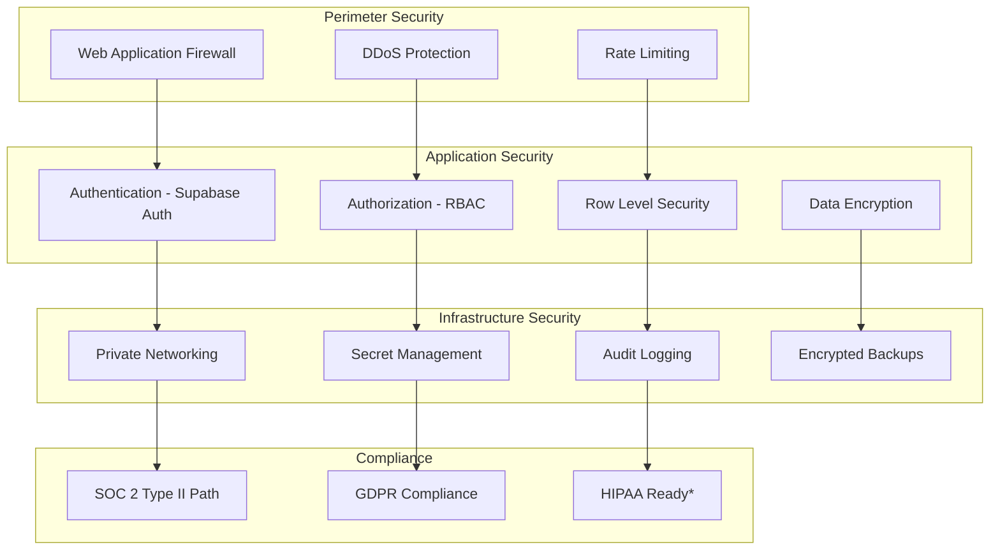

### 7.2 Multi-Tenant Data Isolation

```sql
-- Supabase Row Level Security for Multi-Tenancy
CREATE TABLE customer_projects (
  id UUID PRIMARY KEY DEFAULT uuid_generate_v4(),
  tenant_id UUID NOT NULL REFERENCES tenants(id),
  project_name TEXT NOT NULL,
  figma_file_id TEXT,
  configuration JSONB,
  created_at TIMESTAMPTZ DEFAULT NOW(),
  updated_at TIMESTAMPTZ DEFAULT NOW()
);

-- Enable RLS
ALTER TABLE customer_projects ENABLE ROW LEVEL SECURITY;

-- Tenant isolation policy
CREATE POLICY "tenant_isolation" ON customer_projects
  FOR ALL
  USING (tenant_id = (auth.jwt() ->> 'tenant_id')::UUID);

-- Audit logging
CREATE TABLE audit_logs (
  id UUID PRIMARY KEY,
  tenant_id UUID,
  user_id UUID,
  action TEXT,
  resource TEXT,
  details JSONB,
  ip_address INET,
  timestamp TIMESTAMPTZ DEFAULT NOW()
);

-- Automatic audit trigger
CREATE OR REPLACE FUNCTION log_audit()
RETURNS TRIGGER AS $$
BEGIN
  INSERT INTO audit_logs (tenant_id, user_id, action, resource, details)
  VALUES (
    NEW.tenant_id,
    auth.uid(),
    TG_OP,
    TG_TABLE_NAME,
    row_to_json(NEW)
  );
  RETURN NEW;
END;
$$ LANGUAGE plpgsql;
```

### 7.3 Secret Management

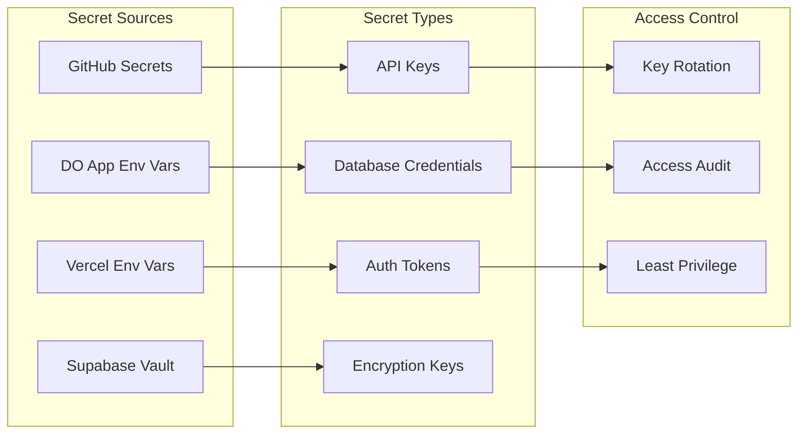

---

## 8. Cost Projections

### 8.1 Monthly Cost Breakdown (Hybrid Architecture)

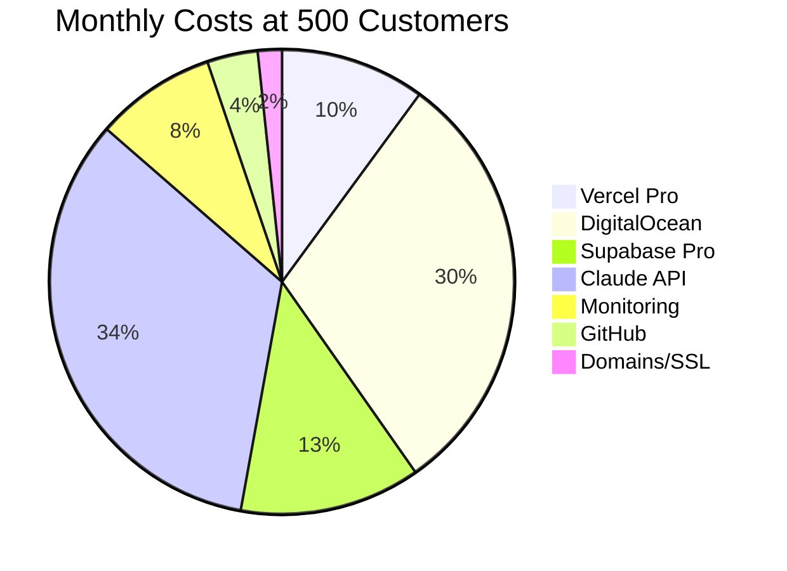

### 8.2 Detailed Cost Matrix

| Service | 100 Customers | 250 Customers | 500 Customers | 1000 Customers |
|---------|---------------|---------------|---------------|----------------|
| **Vercel** | $20/mo | $40/mo | $60/mo | $120/mo |
| **DigitalOcean** | $60/mo | $120/mo | $180/mo | $400/mo |
| **Supabase** | $25/mo | $50/mo | $75/mo | $150/mo |
| **Claude API** | $50/mo | $100/mo | $200/mo | $400/mo |
| **Monitoring** | $25/mo | $35/mo | $50/mo | $100/mo |
| **GitHub** | $21/mo | $21/mo | $21/mo | $44/mo |
| **Misc** | $10/mo | $10/mo | $10/mo | $15/mo |
| **TOTAL** | **$211/mo** | **$376/mo** | **$596/mo** | **$1,229/mo** |

### 8.3 Cost Per Customer

| Customer Count | Total Cost | Cost/Customer | Annual Cost/Customer |
|----------------|-----------|---------------|---------------------|
| 100 | $211 | $2.11 | $25.32 |
| 250 | $376 | $1.50 | $18.00 |
| 500 | $596 | $1.19 | $14.28 |
| 1000 | $1,229 | $1.23 | $14.76 |

**Target SaaS Pricing:** $49-199/customer/month = Healthy 40-90% gross margin

---

## 9. Risk Analysis

### 9.1 Risk Matrix

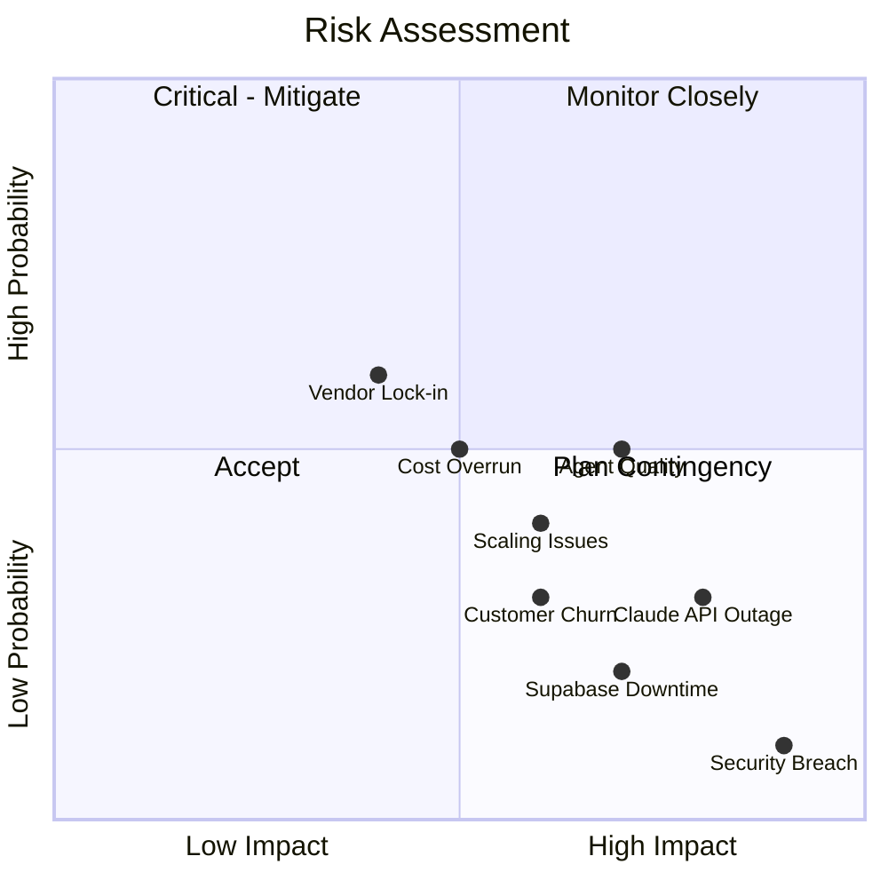

### 9.2 Mitigation Strategies

| Risk | Impact | Probability | Mitigation |
|------|--------|-------------|------------|
| **Claude API Outage** | High | Low | Queue-based retry, fallback to cached results |
| **Supabase Downtime** | High | Low | Local caching, read replicas, backup restore plan |
| **Security Breach** | Critical | Very Low | RLS, encryption, audit logging, incident response plan |
| **Cost Overrun** | Medium | Medium | Usage monitoring, budget alerts, auto-scaling limits |
| **Scaling Issues** | Medium | Medium | Load testing, capacity planning, horizontal scaling |
| **Vendor Lock-in** | Low | High | Standard APIs, export capabilities, multi-cloud design |
| **Agent Quality** | High | Medium | TDD, human review gates, feedback loops |

---

## 10. Final Recommendation

### 10.1 Recommended MVP Stack

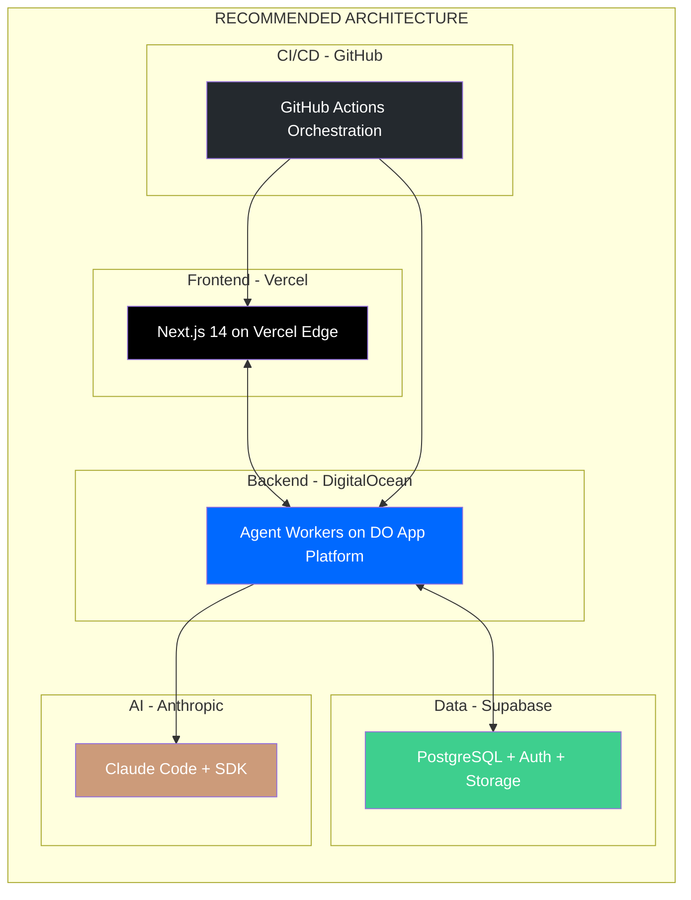

### 10.2 Why This Stack?

**Simplicity:** ⭐⭐⭐⭐⭐
- Vercel: Deploy frontend with zero config
- Supabase: Managed PostgreSQL with RLS out of the box
- GitHub: Familiar workflow for all developers

**Security:** ⭐⭐⭐⭐☆
- Supabase RLS for tenant isolation
- DigitalOcean SOC 2 compliance
- Encrypted data at rest and in transit
- Audit logging built-in

**Ease of Setup:** ⭐⭐⭐⭐☆
- Initial setup: 2-4 hours
- First deployment: < 1 day
- Full pipeline: 1 week
- Comprehensive documentation

**Scalability:** ⭐⭐⭐⭐⭐
- 100 → 1000 customers without architecture change
- Horizontal scaling for agent workers
- Database connection pooling
- CDN for global performance

**Cost Efficiency:** ⭐⭐⭐⭐☆
- ~$600/month at 500 customers
- ~$1.20/customer/month infrastructure cost
- Healthy margins with $49-199 SaaS pricing
- Predictable scaling costs

### 10.3 Implementation Timeline

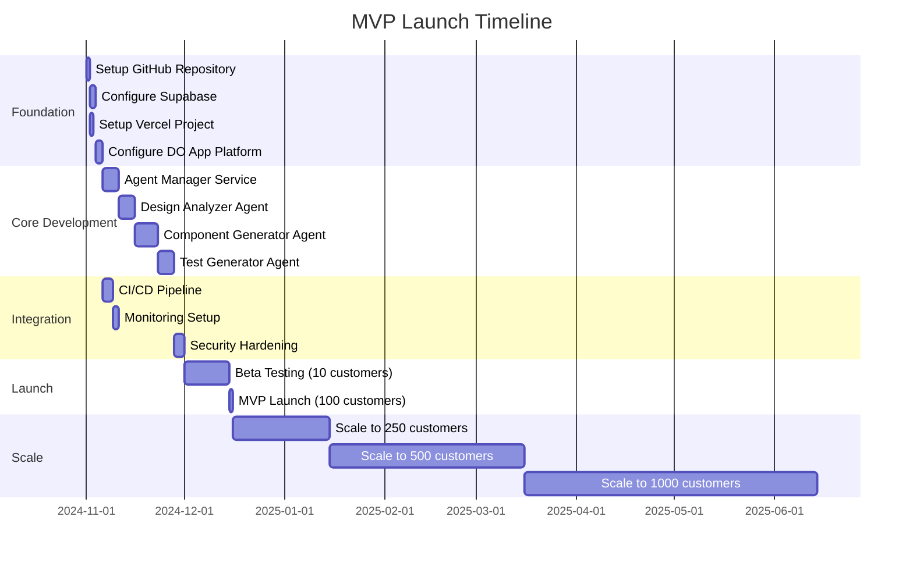

### 10.4 Success Metrics

| Metric | Target | Measurement |
|--------|--------|-------------|
| **Time to First Value** | < 10 minutes | User signup to first Figma import |
| **Pipeline Success Rate** | > 95% | Completed pipelines / total |
| **Agent Performance** | < 5 min average | Time from Figma to generated code |
| **System Availability** | 99.9% uptime | Monthly availability |
| **Customer Satisfaction** | NPS > 50 | Quarterly survey |
| **Cost per Pipeline** | < $0.50 | Total infrastructure / pipelines |
| **Customer Retention** | > 90% | Monthly retention rate |

---

## Conclusion

The **Hybrid Architecture** (Vercel + DigitalOcean + Supabase) provides the optimal balance for PF Figma's MVP phase, offering:

1. **Developer Experience**: Fast iterations with Vercel's edge deployment
2. **Backend Power**: Long-running agent processes on DO containers
3. **Data Security**: Enterprise-grade multi-tenancy with Supabase RLS
4. **Cost Efficiency**: ~$600/month for 500 customers
5. **Scalability**: Clear path from 100 to 1000+ customers
6. **Claude Integration**: Full OpenTelemetry observability for agent orchestration

This architecture positions PF Figma for rapid MVP validation while maintaining enterprise-readiness for growing AI SaaS customers.

---

**Document Control:**
- **Author:** PF Figma Architecture Team
- **Reviewed By:** TBD
- **Approved By:** TBD
- **Next Review:** Post-MVP Launch + 30 Days

---

**END OF MVP ARCHITECTURE PROPOSAL**
