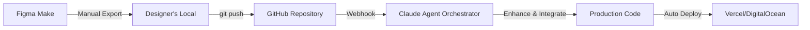
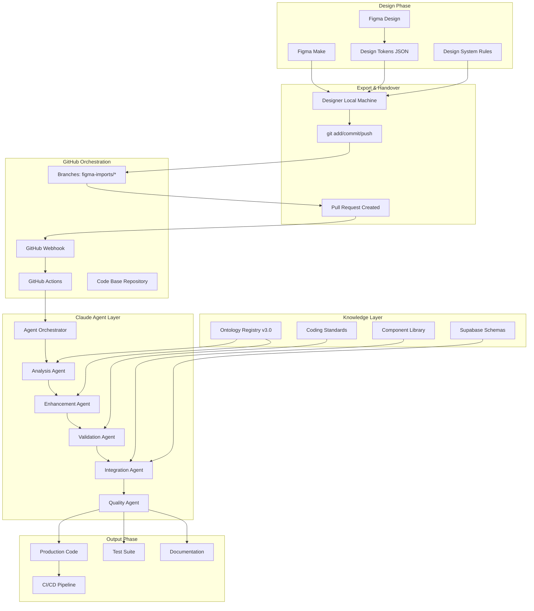
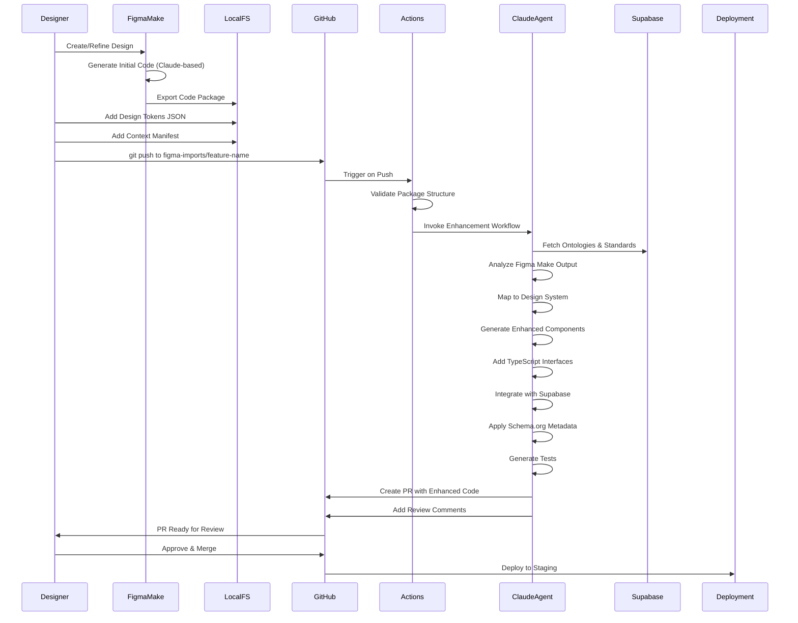
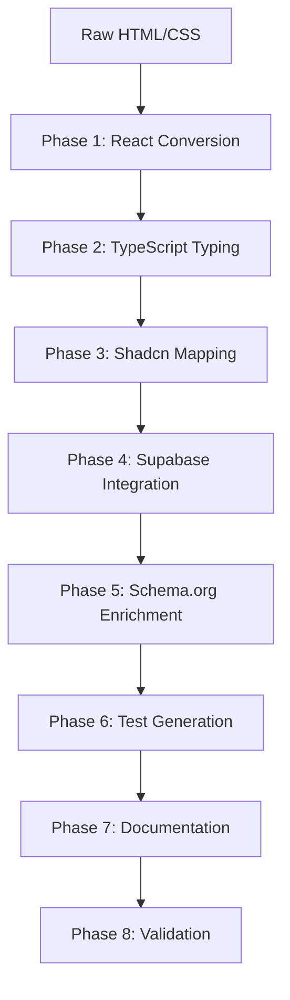
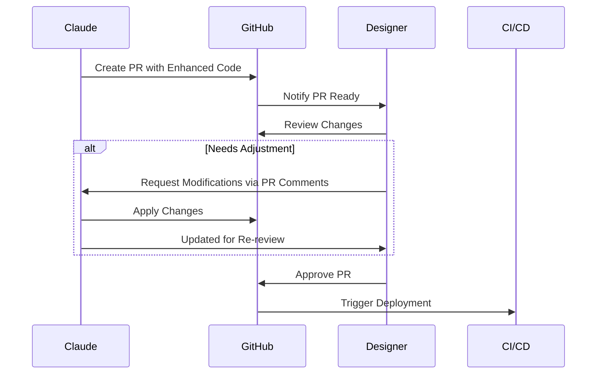

# PF Figma: Design-to-Agent Integration Architecture
## GitHub-Centric Handover from Figma Make to Claude Agentic Developer

**Document:** PF-Figma-Make-Claude-Agent-Integration-HLA  
**Version:** 1.0  
**Date:** November 2025  
**Context:** No Figma Make API - Code Export Triggers Agent Workflow

---

## Executive Summary

Figma Make generates initial code through its internal AI (Claude-based), but lacks a programmatic API. This architecture establishes **GitHub as the central orchestration point** for triggering Claude Agentic Developer workflows when design outputs are committed.

**Key Innovation:** Transform the manual export into an automated enhancement pipeline where:
1. Designer exports Figma Make code → GitHub
2. GitHub webhook triggers Claude Agent
3. Agent enhances, validates, and integrates code
4. Production-ready output deployed automatically

---

## 1. Integration Context

### 1.1 Current State: Figma Make Limitations

| Aspect | Status | Implication |
|--------|--------|-------------|
| **Programmatic API** | ❌ Not Available | No automated code extraction |
| **Webhook Support** | ❌ Not Available | No event-driven triggers |
| **Direct Git Integration** | ❌ Not Available | Manual export required |
| **Code Quality** | ⚠️ "Div Soup" | Needs refinement for production |
| **Design System Compliance** | ⚠️ Partial | May not match your component library |

### 1.2 Solution: GitHub as Orchestrator



**This pattern converts a manual step into an intelligent, automated pipeline.**

---

## 2. High-Level Architecture

### 2.1 Complete System Architecture



### 2.2 Workflow Sequence



---

## 3. GitHub Repository Structure

### 3.1 Repository Organization

```
pf-figma-app/
├── .github/
│   ├── workflows/
│   │   ├── figma-import-trigger.yml      # Main orchestrator
│   │   ├── claude-agent-enhance.yml      # Agent invocation
│   │   └── quality-gates.yml             # Validation pipeline
│   ├── CODEOWNERS                         # Auto-assign reviews
│   └── pull_request_template.md          # PR template
├── figma-imports/                         # 📥 DROP ZONE
│   ├── .gitkeep
│   └── README.md                          # Import instructions
├── agent-config/                          # Agent configuration
│   ├── analysis-prompts/
│   │   ├── component-detection.md
│   │   ├── design-token-mapping.md
│   │   └── accessibility-check.md
│   ├── enhancement-rules/
│   │   ├── typescript-standards.json
│   │   ├── shadcn-mapping.json
│   │   └── supabase-integration.json
│   └── validation-schemas/
│       ├── component-schema.json
│       └── ontology-compliance.json
├── design-system/
│   ├── tokens/
│   │   └── figma-export.json             # Exported from Figma
│   ├── components/
│   │   └── primitives/
│   └── ontologies/
│       ├── ui-component-ontology.json
│       └── interaction-ontology.json
├── src/
│   ├── components/
│   │   ├── ui/                            # Shadcn components
│   │   └── features/                      # Enhanced components
│   ├── lib/
│   └── app/
├── tests/
│   ├── components/
│   └── integration/
└── docs/
    ├── agent-logs/                        # Agent decision traces
    └── design-handover/                   # Design documentation
```

### 3.2 Figma Import Package Structure

When designer exports from Figma Make, they create this package:

```
figma-imports/
└── 2025-11-14-dashboard-cards/
    ├── MANIFEST.json                      # Required metadata
    ├── figma-make-output/
    │   ├── index.html                     # Generated HTML
    │   ├── styles.css                     # Generated CSS
    │   └── script.js                      # Generated JS (if any)
    ├── design-context/
    │   ├── screenshot.png                 # Visual reference
    │   ├── design-tokens.json             # Figma variables export
    │   ├── component-annotations.md       # Designer notes
    │   └── user-flows.md                  # Interaction descriptions
    ├── requirements/
    │   ├── acceptance-criteria.md         # What success looks like
    │   ├── data-requirements.md           # Supabase integration needs
    │   └── accessibility-notes.md         # A11y considerations
    └── references/
        ├── figma-file-url.txt             # Link to Figma file
        └── related-components.txt         # Similar existing components
```

### 3.3 MANIFEST.json Schema

```json
{
  "$schema": "https://schema.org/SoftwareSourceCode",
  "@context": "https://schema.org",
  "@type": "SoftwareSourceCode",
  "name": "Dashboard Metric Cards",
  "version": "1.0.0",
  "dateCreated": "2025-11-14T10:30:00Z",
  "author": {
    "@type": "Person",
    "name": "Designer Name",
    "email": "designer@company.com"
  },
  "programmingLanguage": "HTML/CSS/JavaScript",
  "targetProduct": {
    "@type": "SoftwareApplication",
    "name": "BAIV Platform",
    "operatingSystem": "Web"
  },
  "codeSampleType": "Prototype",
  "abstract": "Dashboard cards for displaying AI visibility metrics",
  
  "pfFigmaMetadata": {
    "figmaMakeVersion": "2025.11",
    "figmaFileKey": "abc123xyz",
    "figmaNodeId": "1:234",
    "designSystemVersion": "3.0.0",
    "targetFramework": "Next.js 14 + Shadcn UI",
    "integrationRequirements": {
      "supabaseTables": ["metrics", "visibility_scores"],
      "apiEndpoints": ["/api/metrics", "/api/visibility"],
      "stateManagement": "React Query",
      "authentication": "Supabase Auth"
    },
    "agentInstructions": {
      "priority": "high",
      "enhancementLevel": "full",
      "generateTests": true,
      "addDocumentation": true,
      "schemaOrgEnrichment": true
    }
  }
}
```

---

## 4. GitHub Actions Orchestration

### 4.1 Main Trigger Workflow

```yaml
# .github/workflows/figma-import-trigger.yml
name: Figma Make Import Processor

on:
  push:
    branches:
      - 'figma-imports/**'
    paths:
      - 'figma-imports/**/MANIFEST.json'
  workflow_dispatch:
    inputs:
      import_path:
        description: 'Path to import package'
        required: true
        type: string

env:
  ANTHROPIC_API_KEY: ${{ secrets.ANTHROPIC_API_KEY }}
  SUPABASE_URL: ${{ secrets.SUPABASE_URL }}
  SUPABASE_SERVICE_KEY: ${{ secrets.SUPABASE_SERVICE_KEY }}

jobs:
  validate-package:
    name: Validate Import Package
    runs-on: ubuntu-latest
    outputs:
      valid: ${{ steps.validate.outputs.valid }}
      manifest: ${{ steps.parse.outputs.manifest }}
      
    steps:
      - uses: actions/checkout@v4
        with:
          fetch-depth: 0
      
      - name: Find Import Package
        id: find
        run: |
          if [ "${{ github.event_name }}" == "workflow_dispatch" ]; then
            IMPORT_PATH="${{ github.event.inputs.import_path }}"
          else
            IMPORT_PATH=$(git diff --name-only HEAD^..HEAD | grep 'figma-imports/.*/MANIFEST.json' | head -1 | xargs dirname)
          fi
          echo "import_path=$IMPORT_PATH" >> $GITHUB_OUTPUT
      
      - name: Validate Package Structure
        id: validate
        run: |
          PACKAGE_PATH="${{ steps.find.outputs.import_path }}"
          
          # Required files check
          REQUIRED_FILES=(
            "MANIFEST.json"
            "figma-make-output/index.html"
            "design-context/screenshot.png"
          )
          
          VALID=true
          for file in "${REQUIRED_FILES[@]}"; do
            if [ ! -f "$PACKAGE_PATH/$file" ]; then
              echo "❌ Missing required file: $file"
              VALID=false
            fi
          done
          
          # Validate MANIFEST.json schema
          npx ajv validate -s agent-config/validation-schemas/manifest-schema.json -d "$PACKAGE_PATH/MANIFEST.json"
          
          echo "valid=$VALID" >> $GITHUB_OUTPUT
      
      - name: Parse Manifest
        id: parse
        run: |
          MANIFEST=$(cat "${{ steps.find.outputs.import_path }}/MANIFEST.json" | jq -c .)
          echo "manifest=$MANIFEST" >> $GITHUB_OUTPUT
      
      - name: Upload Package Artifact
        uses: actions/upload-artifact@v4
        with:
          name: figma-import-package
          path: ${{ steps.find.outputs.import_path }}
          retention-days: 30

  invoke-claude-agent:
    name: Claude Agent Enhancement
    needs: validate-package
    if: needs.validate-package.outputs.valid == 'true'
    runs-on: ubuntu-latest
    
    steps:
      - uses: actions/checkout@v4
      
      - name: Download Import Package
        uses: actions/download-artifact@v4
        with:
          name: figma-import-package
          path: ./import-package
      
      - name: Setup Node.js
        uses: actions/setup-node@v4
        with:
          node-version: '20'
          cache: 'npm'
      
      - name: Install Agent Dependencies
        run: |
          npm ci
          npm install @anthropic-ai/sdk tsx
      
      - name: Execute Claude Agent Orchestrator
        id: agent
        run: |
          npx tsx scripts/claude-agent-orchestrator.ts \
            --package-path ./import-package \
            --manifest '${{ needs.validate-package.outputs.manifest }}' \
            --output-path ./enhanced-output
        env:
          ANTHROPIC_API_KEY: ${{ secrets.ANTHROPIC_API_KEY }}
          GITHUB_TOKEN: ${{ secrets.GITHUB_TOKEN }}
      
      - name: Create Feature Branch
        run: |
          FEATURE_NAME=$(echo '${{ needs.validate-package.outputs.manifest }}' | jq -r '.name' | tr ' ' '-' | tr '[:upper:]' '[:lower:]')
          BRANCH_NAME="feature/enhanced-$FEATURE_NAME-$(date +%Y%m%d%H%M%S)"
          
          git config user.name "Claude Agent"
          git config user.email "claude-agent@pf-figma.com"
          
          git checkout -b "$BRANCH_NAME"
          
          # Copy enhanced output to appropriate locations
          cp -r ./enhanced-output/components/* src/components/features/
          cp -r ./enhanced-output/tests/* tests/components/
          cp -r ./enhanced-output/documentation/* docs/design-handover/
          
          # Stage changes
          git add -A
          git commit -m "✨ Enhanced Figma Make import: $FEATURE_NAME
          
          - Converted to TypeScript + React
          - Applied Shadcn UI components
          - Integrated with Supabase
          - Added Schema.org metadata
          - Generated comprehensive tests
          - Created documentation
          
          Agent Trace: ${{ steps.agent.outputs.trace_id }}"
          
          git push origin "$BRANCH_NAME"
          
          echo "branch_name=$BRANCH_NAME" >> $GITHUB_OUTPUT
      
      - name: Create Pull Request
        uses: actions/github-script@v7
        with:
          script: |
            const manifest = JSON.parse('${{ needs.validate-package.outputs.manifest }}');
            const branchName = '${{ steps.agent.outputs.branch_name }}';
            
            const prBody = `
## 🎨 Figma Make Import Enhanced by Claude Agent

### Original Design
**Name:** ${manifest.name}
**Designer:** ${manifest.author.name}
**Created:** ${manifest.dateCreated}

### Agent Enhancements Applied
- ✅ Converted HTML/CSS to React + TypeScript
- ✅ Mapped to Shadcn UI component library
- ✅ Integrated with Supabase schemas
- ✅ Applied design tokens from Figma export
- ✅ Added Schema.org JSON-LD metadata
- ✅ Generated unit and integration tests
- ✅ Created component documentation
- ✅ Validated against ontology standards

### Files Changed
\`\`\`
src/components/features/${manifest.name}/
├── ${manifest.name}.tsx
├── ${manifest.name}.types.ts
├── ${manifest.name}.styles.ts
├── ${manifest.name}.test.tsx
└── README.md
\`\`\`

### Review Checklist
- [ ] Visual fidelity matches Figma design
- [ ] TypeScript types are correct
- [ ] Shadcn components used appropriately
- [ ] Supabase integration is secure
- [ ] Tests pass and cover key scenarios
- [ ] Accessibility requirements met
- [ ] Documentation is complete

### Agent Decision Log
[View Full Trace](./docs/agent-logs/${manifest.name}-trace.md)

---
*This PR was automatically generated by the Claude Agent Enhancement Pipeline*
            `;

            await github.rest.pulls.create({
              owner: context.repo.owner,
              repo: context.repo.repo,
              title: `✨ Enhanced: ${manifest.name} from Figma Make`,
              head: branchName,
              base: 'develop',
              body: prBody,
              labels: ['figma-import', 'claude-enhanced', 'needs-review']
            });

  quality-gates:
    name: Quality Validation
    needs: invoke-claude-agent
    runs-on: ubuntu-latest
    
    steps:
      - uses: actions/checkout@v4
        with:
          ref: ${{ needs.invoke-claude-agent.outputs.branch_name }}
      
      - name: Setup Node.js
        uses: actions/setup-node@v4
        with:
          node-version: '20'
          cache: 'npm'
      
      - name: Install Dependencies
        run: npm ci
      
      - name: TypeScript Type Check
        run: npm run type-check
      
      - name: ESLint Validation
        run: npm run lint
      
      - name: Run Tests
        run: npm test -- --coverage
      
      - name: Accessibility Audit
        run: npm run a11y-check
      
      - name: Schema.org Validation
        run: npx tsx scripts/validate-schema-org.ts
      
      - name: Ontology Compliance Check
        run: npx tsx scripts/validate-ontology.ts
      
      - name: Add Quality Report to PR
        uses: actions/github-script@v7
        with:
          script: |
            // Add quality report as PR comment
            const report = require('./quality-report.json');
            await github.rest.issues.createComment({
              owner: context.repo.owner,
              repo: context.repo.repo,
              issue_number: context.issue.number,
              body: `## 🔍 Quality Gate Report\n\n${formatReport(report)}`
            });
```

---

## 5. Claude Agent Orchestrator Implementation

### 5.1 Main Orchestrator Script

```typescript
// scripts/claude-agent-orchestrator.ts
import Anthropic from '@anthropic-ai/sdk';
import * as fs from 'fs';
import * as path from 'path';
import { createClient } from '@supabase/supabase-js';

interface AgentConfig {
  packagePath: string;
  manifest: any;
  outputPath: string;
}

interface AgentResult {
  components: string[];
  tests: string[];
  documentation: string[];
  traceId: string;
  decisions: string[];
}

class FigmaMakeEnhancementOrchestrator {
  private anthropic: Anthropic;
  private supabase: any;
  private config: AgentConfig;
  private decisions: string[] = [];
  private traceId: string;

  constructor(config: AgentConfig) {
    this.config = config;
    this.anthropic = new Anthropic();
    this.supabase = createClient(
      process.env.SUPABASE_URL!,
      process.env.SUPABASE_SERVICE_KEY!
    );
    this.traceId = `trace-${Date.now()}-${Math.random().toString(36).substring(7)}`;
  }

  async orchestrate(): Promise<AgentResult> {
    console.log(`🚀 Starting enhancement orchestration: ${this.traceId}`);
    
    // Phase 1: Analysis
    const analysis = await this.runAnalysisAgent();
    
    // Phase 2: Design Token Mapping
    const tokenMapping = await this.runTokenMappingAgent(analysis);
    
    // Phase 3: Component Enhancement
    const enhancedComponents = await this.runEnhancementAgent(analysis, tokenMapping);
    
    // Phase 4: Supabase Integration
    const integratedComponents = await this.runIntegrationAgent(enhancedComponents);
    
    // Phase 5: Schema.org Enrichment
    const enrichedComponents = await this.runSchemaOrgAgent(integratedComponents);
    
    // Phase 6: Test Generation
    const tests = await this.runTestGenerationAgent(enrichedComponents);
    
    // Phase 7: Documentation
    const documentation = await this.runDocumentationAgent(enrichedComponents);
    
    // Phase 8: Validation
    await this.runValidationAgent(enrichedComponents, tests);
    
    // Write outputs
    await this.writeOutputs(enrichedComponents, tests, documentation);
    
    return {
      components: Object.keys(enrichedComponents),
      tests: tests.map(t => t.name),
      documentation: documentation.map(d => d.name),
      traceId: this.traceId,
      decisions: this.decisions
    };
  }

  private async runAnalysisAgent(): Promise<any> {
    this.logDecision('Starting Analysis Agent');
    
    const figmaMakeCode = fs.readFileSync(
      path.join(this.config.packagePath, 'figma-make-output/index.html'),
      'utf-8'
    );
    
    const designTokens = JSON.parse(
      fs.readFileSync(
        path.join(this.config.packagePath, 'design-context/design-tokens.json'),
        'utf-8'
      )
    );

    const analysisPrompt = fs.readFileSync(
      'agent-config/analysis-prompts/component-detection.md',
      'utf-8'
    );

    const response = await this.anthropic.messages.create({
      model: 'claude-sonnet-4-5-20250514',
      max_tokens: 8192,
      system: `You are a senior frontend architect analyzing Figma Make output for conversion to production React components. 
      
Your task is to:
1. Identify distinct UI components in the HTML
2. Detect component hierarchy and relationships
3. Map CSS classes to semantic meanings
4. Identify interaction patterns
5. Flag accessibility concerns
6. Suggest Shadcn UI component mappings

Output a structured JSON analysis.`,
      messages: [
        {
          role: 'user',
          content: `${analysisPrompt}

## Figma Make Output
\`\`\`html
${figmaMakeCode}
\`\`\`

## Design Tokens
\`\`\`json
${JSON.stringify(designTokens, null, 2)}
\`\`\`

## Component Context
${JSON.stringify(this.config.manifest, null, 2)}

Provide a comprehensive analysis in JSON format.`
        }
      ]
    });

    const analysis = JSON.parse((response.content[0] as any).text);
    this.logDecision(`Identified ${analysis.components.length} components`);
    
    return analysis;
  }

  private async runTokenMappingAgent(analysis: any): Promise<any> {
    this.logDecision('Starting Token Mapping Agent');
    
    const shadcnConfig = JSON.parse(
      fs.readFileSync('agent-config/enhancement-rules/shadcn-mapping.json', 'utf-8')
    );

    const response = await this.anthropic.messages.create({
      model: 'claude-sonnet-4-5-20250514',
      max_tokens: 4096,
      system: `You are a design system engineer mapping Figma design tokens to Tailwind CSS and Shadcn UI conventions.`,
      messages: [
        {
          role: 'user',
          content: `Map these design tokens to Tailwind/Shadcn equivalents:

## Analysis
${JSON.stringify(analysis, null, 2)}

## Shadcn Configuration
${JSON.stringify(shadcnConfig, null, 2)}

Output a token mapping dictionary.`
        }
      ]
    });

    return JSON.parse((response.content[0] as any).text);
  }

  private async runEnhancementAgent(analysis: any, tokenMapping: any): Promise<any> {
    this.logDecision('Starting Enhancement Agent - Converting to React/TypeScript');
    
    const typescriptStandards = JSON.parse(
      fs.readFileSync('agent-config/enhancement-rules/typescript-standards.json', 'utf-8')
    );

    const components: Record<string, any> = {};

    for (const component of analysis.components) {
      const response = await this.anthropic.messages.create({
        model: 'claude-sonnet-4-5-20250514',
        max_tokens: 16384,
        system: `You are converting Figma Make HTML output to production-grade React + TypeScript + Shadcn UI components.

Requirements:
- Use TypeScript with strict typing
- Apply Shadcn UI components where appropriate
- Follow ${JSON.stringify(typescriptStandards)}
- Use Tailwind CSS with design tokens
- Implement proper error handling
- Add loading and error states
- Include accessibility attributes
- Make components composable and reusable`,
        messages: [
          {
            role: 'user',
            content: `Convert this component to React/TypeScript:

## Component
${JSON.stringify(component, null, 2)}

## Token Mapping
${JSON.stringify(tokenMapping, null, 2)}

## Requirements from Manifest
${JSON.stringify(this.config.manifest.pfFigmaMetadata.integrationRequirements, null, 2)}

Generate:
1. Main component file (ComponentName.tsx)
2. Types file (ComponentName.types.ts)
3. Styles file if needed (ComponentName.styles.ts)

Return as JSON with file contents.`
          }
        ]
      });

      components[component.name] = JSON.parse((response.content[0] as any).text);
      this.logDecision(`Enhanced component: ${component.name}`);
    }

    return components;
  }

  private async runIntegrationAgent(components: any): Promise<any> {
    this.logDecision('Starting Supabase Integration Agent');
    
    const integrationRules = JSON.parse(
      fs.readFileSync('agent-config/enhancement-rules/supabase-integration.json', 'utf-8')
    );

    // Fetch relevant schemas from Supabase
    const { data: schemas } = await this.supabase
      .from('ontologies')
      .select('*')
      .in('schema_org_type', ['DataSet', 'DataFeed', 'Table']);

    for (const [name, component] of Object.entries(components)) {
      const response = await this.anthropic.messages.create({
        model: 'claude-sonnet-4-5-20250514',
        max_tokens: 8192,
        system: `You are integrating React components with Supabase for data fetching and state management.`,
        messages: [
          {
            role: 'user',
            content: `Add Supabase integration to this component:

## Component
${JSON.stringify(component, null, 2)}

## Integration Requirements
${JSON.stringify(this.config.manifest.pfFigmaMetadata.integrationRequirements, null, 2)}

## Available Schemas
${JSON.stringify(schemas, null, 2)}

## Integration Rules
${JSON.stringify(integrationRules, null, 2)}

Add:
- React Query hooks for data fetching
- Supabase RLS-aware queries
- Real-time subscriptions if applicable
- Error boundaries and loading states
- Optimistic updates where appropriate`
          }
        ]
      });

      (components as any)[name] = JSON.parse((response.content[0] as any).text);
    }

    return components;
  }

  private async runSchemaOrgAgent(components: any): Promise<any> {
    this.logDecision('Starting Schema.org Enrichment Agent');

    for (const [name, component] of Object.entries(components)) {
      const response = await this.anthropic.messages.create({
        model: 'claude-sonnet-4-5-20250514',
        max_tokens: 4096,
        system: `You are adding Schema.org JSON-LD structured data to React components for enhanced SEO and semantic meaning.`,
        messages: [
          {
            role: 'user',
            content: `Add Schema.org metadata to this component:

## Component
${JSON.stringify(component, null, 2)}

Add:
- Appropriate @type from schema.org
- Semantic properties that describe the component
- Accessibility enhancements
- SEO-friendly metadata
- JSONLD script tag generation

Return enhanced component with Schema.org integration.`
          }
        ]
      });

      (components as any)[name] = JSON.parse((response.content[0] as any).text);
    }

    return components;
  }

  private async runTestGenerationAgent(components: any): Promise<any[]> {
    this.logDecision('Starting Test Generation Agent');
    
    const tests: any[] = [];

    for (const [name, component] of Object.entries(components)) {
      const response = await this.anthropic.messages.create({
        model: 'claude-sonnet-4-5-20250514',
        max_tokens: 8192,
        system: `You are generating comprehensive tests for React components using Jest and React Testing Library.`,
        messages: [
          {
            role: 'user',
            content: `Generate tests for this component:

## Component
${JSON.stringify(component, null, 2)}

## Acceptance Criteria
${fs.readFileSync(path.join(this.config.packagePath, 'requirements/acceptance-criteria.md'), 'utf-8')}

Generate:
- Unit tests for all component logic
- Integration tests for Supabase interactions
- Accessibility tests using jest-axe
- Snapshot tests for visual regression
- User interaction tests
- Error state tests
- Loading state tests`
          }
        ]
      });

      tests.push({
        name: `${name}.test.tsx`,
        content: JSON.parse((response.content[0] as any).text)
      });
    }

    return tests;
  }

  private async runDocumentationAgent(components: any): Promise<any[]> {
    this.logDecision('Starting Documentation Agent');
    
    const docs: any[] = [];

    for (const [name, component] of Object.entries(components)) {
      const response = await this.anthropic.messages.create({
        model: 'claude-sonnet-4-5-20250514',
        max_tokens: 4096,
        system: `You are generating comprehensive component documentation following Storybook and JSDoc conventions.`,
        messages: [
          {
            role: 'user',
            content: `Generate documentation for:

## Component
${JSON.stringify(component, null, 2)}

## Original Designer Notes
${fs.readFileSync(path.join(this.config.packagePath, 'design-context/component-annotations.md'), 'utf-8')}

Generate:
- README.md with usage examples
- Props documentation
- Storybook stories
- Migration notes from Figma Make
- Accessibility documentation
- Performance considerations`
          }
        ]
      });

      docs.push({
        name: `${name}-README.md`,
        content: JSON.parse((response.content[0] as any).text)
      });
    }

    return docs;
  }

  private async runValidationAgent(components: any, tests: any[]): Promise<void> {
    this.logDecision('Starting Validation Agent');
    
    // Fetch ontology compliance rules
    const { data: ontologyRules } = await this.supabase
      .from('ontologies')
      .select('*')
      .eq('name', 'UI Component Ontology');

    const response = await this.anthropic.messages.create({
      model: 'claude-sonnet-4-5-20250514',
      max_tokens: 4096,
      system: `You are validating enhanced components against ontology standards and best practices.`,
      messages: [
        {
          role: 'user',
          content: `Validate these components:

## Components
${JSON.stringify(components, null, 2)}

## Ontology Rules
${JSON.stringify(ontologyRules, null, 2)}

Check for:
- TypeScript type correctness
- Shadcn UI proper usage
- Accessibility compliance (WCAG 2.1 AA)
- Performance anti-patterns
- Security vulnerabilities
- Code quality issues
- Schema.org validity

Return validation report with issues and suggestions.`
        }
      ]
    });

    const validationReport = JSON.parse((response.content[0] as any).text);
    this.logDecision(`Validation complete: ${validationReport.issues.length} issues found`);
    
    // Store validation report
    fs.writeFileSync(
      path.join(this.config.outputPath, 'validation-report.json'),
      JSON.stringify(validationReport, null, 2)
    );
  }

  private async writeOutputs(
    components: any,
    tests: any[],
    documentation: any[]
  ): Promise<void> {
    // Create output directories
    const dirs = ['components', 'tests', 'documentation'];
    for (const dir of dirs) {
      fs.mkdirSync(path.join(this.config.outputPath, dir), { recursive: true });
    }

    // Write components
    for (const [name, component] of Object.entries(components)) {
      const componentDir = path.join(this.config.outputPath, 'components', name);
      fs.mkdirSync(componentDir, { recursive: true });
      
      for (const [filename, content] of Object.entries((component as any).files)) {
        fs.writeFileSync(path.join(componentDir, filename), content as string);
      }
    }

    // Write tests
    for (const test of tests) {
      fs.writeFileSync(
        path.join(this.config.outputPath, 'tests', test.name),
        test.content
      );
    }

    // Write documentation
    for (const doc of documentation) {
      fs.writeFileSync(
        path.join(this.config.outputPath, 'documentation', doc.name),
        doc.content
      );
    }

    // Write decision trace
    fs.writeFileSync(
      path.join(this.config.outputPath, 'agent-trace.json'),
      JSON.stringify({
        traceId: this.traceId,
        timestamp: new Date().toISOString(),
        decisions: this.decisions,
        manifest: this.config.manifest
      }, null, 2)
    );
  }

  private logDecision(message: string): void {
    const entry = `[${new Date().toISOString()}] ${message}`;
    this.decisions.push(entry);
    console.log(`📝 ${entry}`);
  }
}

// Main execution
async function main() {
  const args = process.argv.slice(2);
  const config: AgentConfig = {
    packagePath: args[args.indexOf('--package-path') + 1],
    manifest: JSON.parse(args[args.indexOf('--manifest') + 1]),
    outputPath: args[args.indexOf('--output-path') + 1]
  };

  const orchestrator = new FigmaMakeEnhancementOrchestrator(config);
  const result = await orchestrator.orchestrate();

  console.log('✅ Enhancement complete');
  console.log(`📦 Components: ${result.components.join(', ')}`);
  console.log(`🧪 Tests: ${result.tests.join(', ')}`);
  console.log(`📚 Documentation: ${result.documentation.join(', ')}`);
  console.log(`🔍 Trace ID: ${result.traceId}`);

  // Output for GitHub Actions
  console.log(`::set-output name=trace_id::${result.traceId}`);
}

main().catch(console.error);
```

---

## 6. Alternative: Direct Upload to Claude Code CLI

### 6.1 Local Claude Code Integration

If GitHub is not the preferred orchestration point, designers can directly interact with Claude Code:

```bash
# Designer workflow
cd ~/figma-exports/dashboard-cards

# Initialize Claude Code agent
claude-code init --project pf-figma

# Provide context
claude-code add-context \
  --figma-export ./figma-make-output/ \
  --design-tokens ./design-context/design-tokens.json \
  --requirements ./requirements/acceptance-criteria.md

# Execute enhancement agent
claude-code enhance \
  --source ./figma-make-output/index.html \
  --target "next-shadcn" \
  --integrate-with supabase \
  --add-schema-org \
  --generate-tests

# Review and approve
claude-code review

# Push to GitHub
claude-code commit-and-push \
  --branch "feature/dashboard-cards" \
  --message "Enhanced Figma Make export with Claude Agent"
```

### 6.2 VS Code Extension Workflow

```
Designer Exports → Local Folder → VS Code Extension → Claude Agent → GitHub PR
```

---

## 7. Key Integration Patterns

### 7.1 Pattern: Event-Driven Enhancement

```mermaid
graph LR
    A[Figma Make Export] -->|git push| B[GitHub]
    B -->|Webhook| C[Claude Agent]
    C -->|Analysis| D[Component Detection]
    D -->|Enhancement| E[React/TypeScript]
    E -->|Integration| F[Supabase + Schema.org]
    F -->|Validation| G[Quality Gates]
    G -->|PR Created| H[Human Review]
    H -->|Merge| I[Auto Deploy]
```



### 7.2 Pattern: Incremental Enhancement



### 7.3 Pattern: Human-in-the-Loop



---

## 8. Benefits of This Architecture

### 8.1 Technical Benefits

| Benefit | Description |
|---------|-------------|
| **Version Control** | All transformations tracked in Git history |
| **Auditability** | Agent decisions logged and traceable |
| **Reproducibility** | Same input produces consistent output |
| **Collaboration** | Designers and developers work in familiar tools |
| **Automation** | Manual steps eliminated post-export |

### 8.2 Business Benefits

| Benefit | Impact |
|---------|--------|
| **Faster Time-to-Code** | 70-80% reduction in design-to-production time |
| **Higher Quality** | AI-enforced standards and testing |
| **Reduced Errors** | Automated validation catches issues early |
| **Knowledge Capture** | Decisions documented in ontology-compliant format |
| **Scalability** | Pattern works for any Figma Make export |

### 8.3 Agentic Development Benefits

| Benefit | How It's Achieved |
|---------|-------------------|
| **Intelligent Enhancement** | Claude analyzes and improves code quality |
| **Context Awareness** | Agent uses ontologies and design tokens |
| **Consistent Standards** | Schema.org and TypeScript enforced automatically |
| **Self-Documenting** | Tests and docs generated alongside code |
| **Continuous Learning** | Agent traces inform future improvements |

---

## 9. Next Steps

1. **Implement MANIFEST.json schema** validator
2. **Create Claude Agent orchestrator** script
3. **Set up GitHub Actions** workflow
4. **Define Shadcn UI mapping** rules
5. **Configure Supabase ontology** tables
6. **Test with sample Figma Make export**
7. **Iterate based on output quality**
8. **Document best practices** for designers

---

**This architecture transforms Figma Make's manual export limitation into a strategic advantage—using GitHub as the intelligent orchestration layer that triggers Claude Agent workflows for production-grade code enhancement.**

---

**END OF HIGH-LEVEL ARCHITECTURE DOCUMENT**
