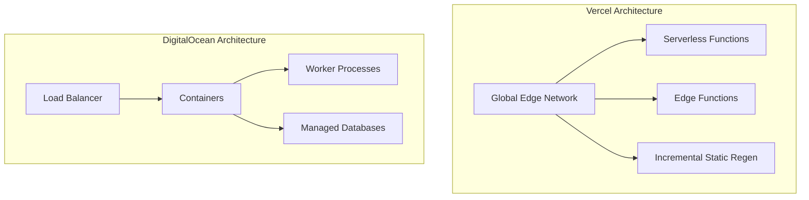
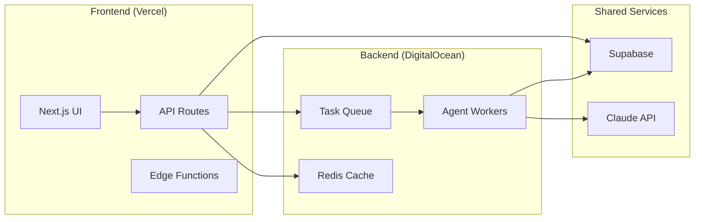
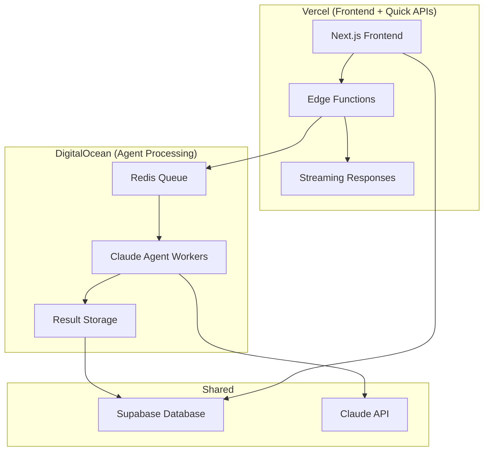
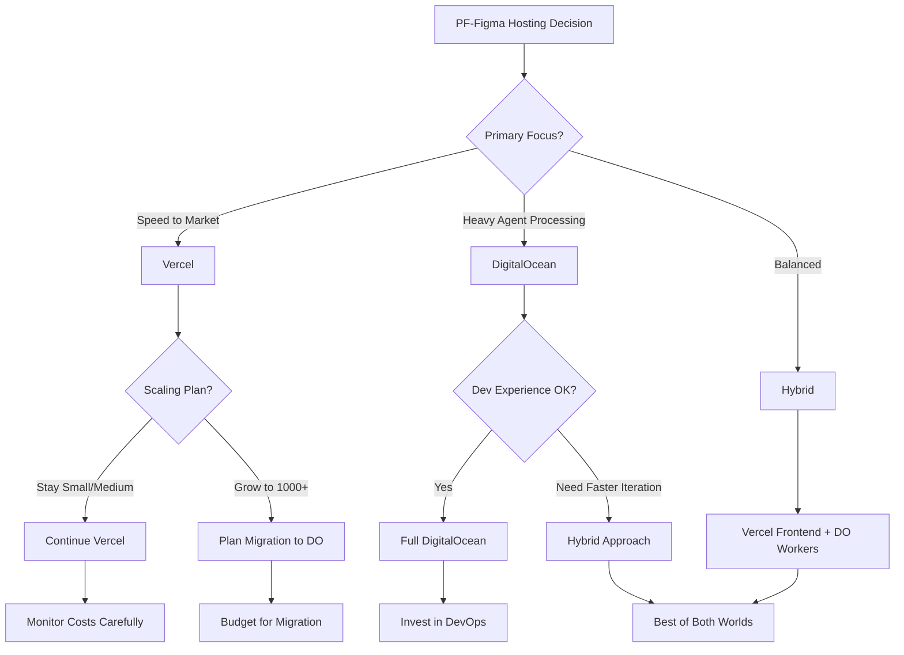
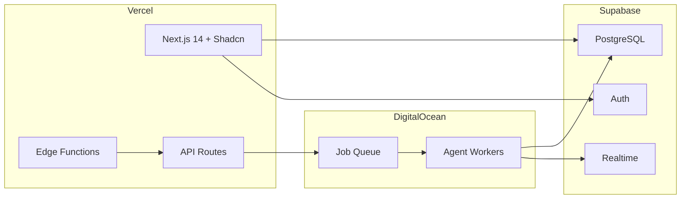

# PF Figma: Hosting Platform Comparison
## Vercel vs DigitalOcean App Platform for MVP to 1000 SaaS-AI Customers

**Document:** PF-Figma-Hosting-Comparison-Analysis  
**Version:** 1.0  
**Date:** November 2025  
**Context:** Claude Agentic Developer + PF-Figma-Front End Stack

---

## Table of Contents

1. [Executive Summary](#1-executive-summary)
2. [Platform Architecture Comparison](#2-platform-architecture-comparison)
3. [MVP Stage (0-100 Customers)](#3-mvp-stage-0-100-customers)
4. [Growth Stage (100-500 Customers)](#4-growth-stage-100-500-customers)
5. [Scale Stage (500-1000 Customers)](#5-scale-stage-500-1000-customers)
6. [Claude Agentic Developer Integration](#6-claude-agentic-developer-integration)
7. [Cost Analysis](#7-cost-analysis)
8. [Technical Capabilities Matrix](#8-technical-capabilities-matrix)
9. [Developer Experience](#9-developer-experience)
10. [Risk Assessment](#10-risk-assessment)
11. [Migration Considerations](#11-migration-considerations)
12. [Strategic Recommendation](#12-strategic-recommendation)

---

## 1. Executive Summary

### The Core Decision

Choosing between **Vercel** and **DigitalOcean App Platform** for your PF-Figma agentic platform represents a fundamental architectural decision that impacts:

- **Development velocity** during MVP phase
- **Operational complexity** as you scale
- **Cost predictability** from prototype to 1000 customers
- **Agentic workload support** for Claude-powered automation

### Quick Verdict

| Scenario | Recommended Platform | Primary Reason |
|----------|---------------------|----------------|
| **Pure MVP Speed** | Vercel | 10x faster deployment, zero config |
| **Heavy Agentic Workloads** | DigitalOcean | Long-running workers, no timeouts |
| **Predictable Costs** | DigitalOcean | Fixed pricing, no usage surprises |
| **Maximum Scalability** | Either | Both scale to enterprise level |
| **Hybrid Approach** | Vercel + DO Workers | Best of both worlds |

### Bottom Line

**For PF-Figma with Claude Agentic Developer:**
- **MVP (Months 1-6):** Start with **Vercel** for rapid iteration
- **Growth (Months 6-12):** Add **DigitalOcean workers** for agent processing
- **Scale (Year 2+):** Consider full **DigitalOcean** migration or maintain hybrid

---

## 2. Platform Architecture Comparison

### 2.1 Fundamental Architecture



| Aspect | Vercel | DigitalOcean App Platform |
|--------|--------|---------------------------|
| **Compute Model** | Serverless/Edge Functions | Containers (Kubernetes-based) |
| **Execution Duration** | Max 300s (Pro) | Unlimited (long-running) |
| **Resource Allocation** | Automatic, shared | Dedicated, fixed |
| **Network Model** | Edge-first, global CDN | Regional, static IPs |
| **State Management** | Stateless by design | Stateful possible |
| **Database Integration** | External (Supabase, etc.) | Built-in managed DBs |

### 2.2 Stack Compatibility

#### PF-Figma-Front End Stack

| Component | Vercel Support | DigitalOcean Support |
|-----------|---------------|---------------------|
| **Next.js 14** | ⭐⭐⭐⭐⭐ Native, optimized | ⭐⭐⭐⭐ Full support |
| **Shadcn UI** | ⭐⭐⭐⭐⭐ Perfect fit | ⭐⭐⭐⭐⭐ Perfect fit |
| **Supabase** | ⭐⭐⭐⭐⭐ First-class integration | ⭐⭐⭐⭐ Standard integration |
| **Claude API** | ⭐⭐⭐ Timeout constraints | ⭐⭐⭐⭐⭐ No limitations |
| **Figma API** | ⭐⭐⭐⭐⭐ Real-time webhooks | ⭐⭐⭐⭐⭐ Real-time webhooks |
| **Schema.org JSON-LD** | ⭐⭐⭐⭐⭐ Native SSR | ⭐⭐⭐⭐⭐ Full control |

---

## 3. MVP Stage (0-100 Customers)

### 3.1 Overview

**Time Frame:** Months 1-6  
**Focus:** Product-market fit validation, rapid iteration  
**Key Metrics:** Development velocity, time-to-deploy, feedback loops

### 3.2 Side-by-Side Comparison

| Factor | Vercel 🏆 | DigitalOcean |
|--------|-----------|--------------|
| **Setup Time** | 10 minutes | 2-4 hours |
| **First Deploy** | < 1 minute | 10-15 minutes |
| **CI/CD Config** | Zero-config | YAML configuration |
| **Preview URLs** | Automatic per PR | Manual setup required |
| **Learning Curve** | Minimal | Moderate |
| **Local Dev Parity** | Excellent | Good |

### 3.3 Vercel MVP Advantages

```bash
# Deploy PF-Figma MVP in under 2 minutes
npx create-next-app@latest pf-figma-mvp --typescript
cd pf-figma-mvp
vercel deploy
# ✅ Live instantly
```

**Why Vercel Wins MVP:**

1. **Zero Configuration**
   - Auto-detect Next.js
   - Framework-aware optimizations
   - No Docker, no YAML, no infrastructure code

2. **Preview Deployments**
   - Every PR gets unique URL
   - Stakeholder review simplified
   - A/B testing built-in

3. **Developer Experience**
   - `vercel dev` mirrors production
   - Environment variables sync
   - Instant rollback (one click)

4. **Speed to Market**
   - Ship features in hours, not days
   - Iterate based on user feedback immediately
   - Focus on product, not infrastructure

### 3.4 DigitalOcean MVP Advantages

```yaml
# Still need app.yaml configuration
name: pf-figma-mvp
services:
  - name: web
    github:
      repo: your-org/pf-figma-mvp
      branch: main
    build_command: npm ci && npm run build
    run_command: npm start
    instance_size_slug: basic-xxs
    instance_count: 1
```

**Why DigitalOcean Still Matters:**

1. **Cost Predictability**
   - $5/month for basic tier
   - No surprise bandwidth charges
   - Budget planning certainty

2. **Future-Proofing**
   - Container model scales linearly
   - No architectural refactoring later
   - Add workers when needed

3. **Long-Running Processes**
   - Claude agents can run 10+ minutes
   - Background jobs native
   - No function timeout gymnastics

### 3.5 MVP Cost Comparison

| Usage Level | Vercel Cost | DigitalOcean Cost | Winner |
|-------------|-------------|-------------------|--------|
| **Free Tier** | $0 (limits apply) | $0 ($200 credit) | Tie |
| **Light (1K visits/mo)** | $0-20/mo | $5-10/mo | DO |
| **Medium (10K visits/mo)** | $20-50/mo | $10-20/mo | DO |
| **Heavy (50K visits/mo)** | $50-200/mo | $20-40/mo | DO |
| **Bandwidth Overages** | $0.40/GB | $0.01/GB | DO |
| **Function Invocations** | Pay-per-use | Unlimited | DO |

**Hidden Costs:**
- Vercel: Serverless function invocations can spike unexpectedly
- DigitalOcean: Fixed, but need to right-size instances

### 3.6 MVP Recommendation

**🏆 WINNER: Vercel**

For pure MVP speed and developer experience, Vercel is unmatched. The time saved on infrastructure allows focus on product-market fit.

**Caveat:** If your MVP heavily relies on Claude agent processing (multiple API calls, long conversations), start with DigitalOcean to avoid timeout refactoring later.

---

## 4. Growth Stage (100-500 Customers)

### 4.1 Overview

**Time Frame:** Months 6-12  
**Focus:** Scaling operations, reliability, cost optimization  
**Key Metrics:** Uptime, response latency, cost per customer

### 4.2 Critical Challenges

1. **Increased Traffic**
   - 10-50x more requests
   - Concurrent user sessions
   - Database connection pooling critical

2. **Agentic Workload Growth**
   - More Claude API calls
   - Complex multi-agent orchestration
   - Background processing queues

3. **Operational Maturity**
   - Monitoring and alerting
   - Incident response
   - Cost attribution

### 4.3 Side-by-Side Comparison

| Factor | Vercel | DigitalOcean 🏆 |
|--------|--------|-----------------|
| **Horizontal Scaling** | Automatic | Manual (with autoscaling) |
| **Vertical Scaling** | Not applicable | Instance size upgrade |
| **Long-Running Jobs** | ❌ 300s max | ✅ Unlimited |
| **Worker Processes** | Via third-party | Native support |
| **Database Pooling** | External (PgBouncer) | Built-in option |
| **Cost at 500 Customers** | $200-1000/mo | $100-300/mo |

### 4.4 Vercel Growth Challenges

```typescript
// Problem: Claude agent times out at 300s
export async function POST(request: Request) {
  const anthropic = new Anthropic();
  
  // Complex multi-turn agent conversation
  const result = await runAgentPipeline(); // 400+ seconds
  // ❌ FUNCTION TIMEOUT - 300s limit
  
  return Response.json(result);
}

// Solution: Queue-based architecture (adds complexity)
export async function POST(request: Request) {
  const taskId = await queueAgentTask(request);
  return Response.json({ taskId, status: 'queued' });
  // Client must poll for results
}
```

**Pain Points:**
1. Function timeout limits (300s Pro, 900s Enterprise)
2. Cold start latency on serverless
3. Database connection limits
4. Cost scaling with usage
5. Vendor lock-in concerns

### 4.5 DigitalOcean Growth Advantages

```typescript
// No timeout constraints
async function processAgentQueue() {
  while (true) {
    const task = await getNextTask();
    if (task) {
      // Can run for hours if needed
      const result = await runComplexAgentPipeline(task);
      await saveResult(result);
    }
    await sleep(1000);
  }
}
```

**Benefits:**
1. **Unlimited execution time** - Agents run as long as needed
2. **Dedicated resources** - Predictable performance
3. **Worker services** - Native background processing
4. **Static IPs** - Easier third-party integrations
5. **Cost efficiency** - Fixed pricing model

### 4.6 Hybrid Architecture (Best of Both)



**Hybrid Benefits:**
- Vercel: Fast UI delivery, edge caching, preview deployments
- DigitalOcean: Long-running agents, background jobs, cost efficiency
- Best developer experience with enterprise-grade agent processing

### 4.7 Growth Cost Analysis

**Scenario:** 500 SaaS customers, ~50 active users concurrent

| Resource | Vercel Cost | DigitalOcean Cost |
|----------|-------------|-------------------|
| **Compute** | $300/mo (Pro + usage) | $100/mo (4x basic-xs) |
| **Bandwidth** | $100-200/mo | $20/mo |
| **Functions** | $50-100/mo | Included |
| **Workers** | External ($100+/mo) | $40/mo (2x workers) |
| **Total** | **$550-700/mo** | **$160-200/mo** |

### 4.8 Growth Recommendation

**🏆 WINNER: DigitalOcean (or Hybrid)**

As Claude agent workloads increase, DigitalOcean's lack of timeout constraints becomes critical. The cost savings also accelerate during growth phase.

**Hybrid Approach:**
- Keep Vercel for frontend and API routing
- Move agent processing to DigitalOcean workers
- Use shared Supabase for data consistency

---

## 5. Scale Stage (500-1000 Customers)

### 5.1 Overview

**Time Frame:** Year 2+  
**Focus:** Enterprise readiness, multi-tenancy, compliance  
**Key Metrics:** SLA compliance, security posture, gross margin

### 5.2 Enterprise Requirements

| Requirement | Vercel | DigitalOcean |
|-------------|--------|--------------|
| **99.99% SLA** | Enterprise plan ($$$) | Professional plan |
| **SOC 2 Type II** | ✅ Available | ✅ Available |
| **HIPAA Compliance** | Enterprise only | Custom setup |
| **GDPR Compliance** | ✅ Built-in | ✅ Built-in |
| **Private Networking** | Limited | ✅ VPC native |
| **Static IP Addresses** | ❌ Not available | ✅ Dedicated IPs |
| **Custom Domains** | ✅ Unlimited | ✅ Unlimited |
| **DDoS Protection** | ✅ Built-in | ✅ Built-in |

### 5.3 Architecture at 1000 Customers

#### Vercel Architecture

```yaml
# Requires Enterprise plan + external workers
Frontend: Vercel Edge Network
  - 10+ regions globally
  - Edge functions for personalization
  - ISR for dynamic content

API Layer: Vercel Serverless
  - Rate limiting critical
  - Connection pooling essential
  - Queue for long operations

Workers: External (AWS Lambda, etc.)
  - Claude agent processing
  - Batch operations
  - Scheduled tasks

Database: Supabase (Pro/Enterprise)
  - Connection pooling
  - Read replicas
  - Point-in-time recovery
```

**Monthly Cost: $2,000 - 5,000+**

#### DigitalOcean Architecture

```yaml
# All-in-one platform
Frontend: App Platform Web Service
  - 10+ instances (auto-scaled)
  - Load balanced
  - Regional deployment

API Layer: Same containers
  - No cold starts
  - Dedicated resources
  - Predictable latency

Workers: App Platform Workers
  - 5-10 worker instances
  - Long-running agents
  - Background processing

Database: Managed PostgreSQL + Redis
  - HA cluster
  - Connection pooling
  - Automated backups

Registry: Container Registry
  - Custom images
  - Version control
  - Fast deployments
```

**Monthly Cost: $800 - 1,500**

### 5.4 Multi-Tenant SaaS Considerations

| Consideration | Vercel | DigitalOcean |
|---------------|--------|--------------|
| **Tenant Isolation** | Application-level | Application-level |
| **Resource Quotas** | Per-function (limited) | Per-container (flexible) |
| **Custom Domains per Tenant** | ✅ Wildcard support | ✅ API manageable |
| **Data Residency** | Limited control | Full control |
| **Tenant-Specific Config** | Edge Config | Environment variables |

### 5.5 Agentic Platform at Scale

**Key Requirement:** Claude agents processing 10,000+ requests/day across 1000 customers

| Metric | Vercel | DigitalOcean 🏆 |
|--------|--------|-----------------|
| **Concurrent Agents** | Limited by functions | Limited by workers |
| **Max Agent Duration** | 300-900 seconds | Unlimited |
| **Queue Management** | External service | Native workers |
| **Cost per Agent Execution** | $0.000024+ per ms | Fixed per container |
| **Scaling Model** | Pay-per-execution | Pay-per-capacity |

**At 10,000 agent executions/day:**
- Vercel: Unpredictable costs ($500-2000/mo in functions alone)
- DigitalOcean: Fixed cost ($200-400/mo for 10 workers)

### 5.6 Observability at Scale

| Capability | Vercel | DigitalOcean |
|------------|--------|--------------|
| **Built-in Metrics** | Speed Insights, Analytics | CPU, Memory, Bandwidth |
| **Custom Metrics** | Limited | OpenTelemetry native |
| **Log Aggregation** | Vercel Logs | External (Datadog, etc.) |
| **Distributed Tracing** | Limited | Full OTLP support |
| **Error Tracking** | Built-in | External (Sentry, etc.) |
| **Alerting** | Basic | Comprehensive |

### 5.7 Scale Recommendation

**🏆 WINNER: DigitalOcean**

At 1000 customers with heavy agentic workloads:

1. **Cost Efficiency:** 3-4x cheaper than Vercel Enterprise
2. **Operational Control:** Full container orchestration
3. **Compliance Ready:** SOC 2, GDPR, configurable for HIPAA
4. **Agentic Native:** Workers designed for long-running processes
5. **Predictable Scaling:** Linear cost model

**However:** If you're on Vercel for MVP and it's working well, migration cost may not justify switch until clear pain points emerge.

---

## 6. Claude Agentic Developer Integration

### 6.1 Agentic Workload Patterns

| Pattern | Vercel Suitability | DigitalOcean Suitability |
|---------|-------------------|--------------------------|
| **Short API Calls** (< 30s) | ⭐⭐⭐⭐⭐ Excellent | ⭐⭐⭐⭐⭐ Excellent |
| **Medium Processes** (30s-5min) | ⭐⭐⭐ With queuing | ⭐⭐⭐⭐⭐ Native |
| **Long Agents** (5-30min) | ❌ Timeout | ⭐⭐⭐⭐⭐ Native |
| **Continuous Workers** | ❌ Not supported | ⭐⭐⭐⭐⭐ Ideal |
| **Multi-Agent Orchestration** | ⭐⭐ Complex setup | ⭐⭐⭐⭐ Straightforward |
| **Streaming Responses** | ⭐⭐⭐⭐⭐ Edge support | ⭐⭐⭐⭐ Standard SSE |

### 6.2 Claude API Integration Patterns

#### Pattern 1: Simple Request-Response

Both platforms handle equally well:

```typescript
// Works on both Vercel and DigitalOcean
export async function POST(request: Request) {
  const { prompt } = await request.json();
  
  const anthropic = new Anthropic();
  const message = await anthropic.messages.create({
    model: "claude-sonnet-4-5-20250514",
    max_tokens: 1024,
    messages: [{ role: "user", content: prompt }]
  });
  
  return Response.json({ response: message.content[0].text });
}
```

#### Pattern 2: Streaming Response

```typescript
// Vercel Edge Function - Excellent
export const runtime = 'edge';

export async function POST(request: Request) {
  const stream = await anthropic.messages.stream({
    model: "claude-sonnet-4-5-20250514",
    max_tokens: 4096,
    messages: [{ role: "user", content: prompt }]
  });
  
  return new Response(stream.toReadableStream(), {
    headers: { 'Content-Type': 'text/event-stream' }
  });
}
```

**Winner: Vercel** - Edge functions optimized for streaming

#### Pattern 3: Multi-Agent Pipeline

```typescript
// Vercel - Requires complex queuing
// API Route triggers queue
export async function POST(request: Request) {
  const taskId = await queue.add('agent-pipeline', {
    agents: ['analyzer', 'generator', 'validator'],
    input: await request.json()
  });
  return Response.json({ taskId });
}

// External worker (AWS Lambda, etc.)
// Process queue, manage timeouts

// DigitalOcean - Native worker
// Worker runs indefinitely
async function agentPipeline(input: any) {
  const analysis = await runAnalyzerAgent(input);     // 5 min
  const generated = await runGeneratorAgent(analysis); // 10 min
  const validated = await runValidatorAgent(generated); // 3 min
  return validated; // Total: 18 min
}
```

**Winner: DigitalOcean** - Native long-running support

#### Pattern 4: Figma Design Analysis Agent

```typescript
// Complex agent that:
// 1. Fetches Figma design
// 2. Analyzes with Claude Vision
// 3. Generates component code
// 4. Validates against ontology
// 5. Stores results

// Vercel: Must break into multiple functions
// DigitalOcean: Single worker process

// Duration: 10-20 minutes typical
```

**Winner: DigitalOcean** - No artificial constraints

### 6.3 Agent Performance Comparison

| Metric | Vercel | DigitalOcean |
|--------|--------|--------------|
| **Cold Start** | 200-500ms | None (always warm) |
| **Function Memory** | 1024MB max (Pro) | Container-based |
| **Execution Timeout** | 300s (Pro) | Unlimited |
| **Concurrent Executions** | 1000 (Pro) | Limited by instances |
| **Cost per 1M Executions** | $200+ | $50-100 (fixed) |

### 6.4 Recommended Architecture for Agentic Developer

**Hybrid Model:**



**Benefits:**
- Fast UI with Vercel Edge
- Unlimited agent processing on DigitalOcean
- Shared state in Supabase
- Best developer experience for both

---

## 7. Cost Analysis

### 7.1 Total Cost of Ownership (TCO)

#### MVP Phase (0-100 Customers)

| Component | Vercel | DigitalOcean |
|-----------|--------|--------------|
| **Hosting** | $0-50/mo | $5-20/mo |
| **Bandwidth** | Included (limits) | Included |
| **Functions** | Pay-per-use | N/A |
| **Workers** | N/A | Included |
| **Database (Supabase)** | $25/mo | $25/mo |
| **Claude API** | $50-200/mo | $50-200/mo |
| **Total TCO** | **$75-275/mo** | **$80-245/mo** |

**Winner:** Tie (slightly favor DigitalOcean for predictability)

#### Growth Phase (100-500 Customers)

| Component | Vercel | DigitalOcean |
|-----------|--------|--------------|
| **Hosting** | $300-500/mo | $100-200/mo |
| **Bandwidth Overages** | $100-200/mo | $10-20/mo |
| **Function Invocations** | $100-300/mo | N/A |
| **Workers (External)** | $100-200/mo | Included |
| **Database (Supabase Pro)** | $25/mo | $25/mo |
| **Claude API** | $500-1500/mo | $500-1500/mo |
| **Total TCO** | **$1,125-2,725/mo** | **$635-1,745/mo** |

**Winner:** DigitalOcean (40-50% savings)

#### Scale Phase (500-1000 Customers)

| Component | Vercel | DigitalOcean |
|-----------|--------|--------------|
| **Hosting** | $1,500-3,000/mo | $400-800/mo |
| **Enterprise Features** | $1,000+/mo | Included |
| **Bandwidth** | $500-1,000/mo | $50-100/mo |
| **Function/Worker** | $500-1,500/mo | $200-400/mo |
| **Database** | $100/mo | $100/mo |
| **Claude API** | $2,000-5,000/mo | $2,000-5,000/mo |
| **Total TCO** | **$5,600-11,600/mo** | **$2,750-6,400/mo** |

**Winner:** DigitalOcean (50-55% savings)

### 7.2 Cost Scaling Trajectory

```
Monthly Cost vs Customer Count

$12,000 ┤                                    ╭─── Vercel
        │                                  ╭╯
        │                                ╭╯
$8,000  ┤                              ╭╯
        │                            ╭╯
        │                          ╭╯
$4,000  ┤                        ╭╯     ╭─── DigitalOcean
        │                     ╭─╯    ╭─╯
        │                ╭───╯   ╭──╯
$1,000  ┤            ╭──╯    ╭──╯
        │        ╭──╯    ╭──╯
$0      ┴───────╯────────╯─────────────────
        0      250      500      750     1000
                    Customers
```

### 7.3 Hidden Costs

**Vercel:**
- Bandwidth overages at $0.40/GB
- Function duration charges
- Additional team seats ($20/user/mo)
- Enterprise features locked behind $$$

**DigitalOcean:**
- Build minutes (generous free tier)
- Container registry storage
- Managed database upgrades (can be significant)
- Support plans (optional but valuable)

---

## 8. Technical Capabilities Matrix

### 8.1 Core Features

| Feature | Vercel | DigitalOcean | Notes |
|---------|--------|--------------|-------|
| **Next.js Support** | Native ⭐⭐⭐⭐⭐ | Containerized ⭐⭐⭐⭐ | Vercel built by Next.js creators |
| **Edge Computing** | Global edge ⭐⭐⭐⭐⭐ | Regional ⭐⭐⭐ | Vercel has 30+ edge locations |
| **Serverless Functions** | Native ⭐⭐⭐⭐⭐ | Not available | DO uses containers |
| **Long-Running Processes** | Limited ⭐⭐ | Unlimited ⭐⭐⭐⭐⭐ | DO workers are superior |
| **Static File Hosting** | Optimized ⭐⭐⭐⭐⭐ | Standard ⭐⭐⭐⭐ | Vercel has ISR |
| **Custom Docker Images** | Not supported | Full support ⭐⭐⭐⭐⭐ | DO allows any container |
| **Database Integration** | External only | Managed DBs ⭐⭐⭐⭐⭐ | DO has built-in PG/Redis |
| **Monorepo Support** | Excellent ⭐⭐⭐⭐⭐ | Basic ⭐⭐⭐ | Vercel has advanced detection |
| **Preview Deployments** | Automatic ⭐⭐⭐⭐⭐ | Manual setup ⭐⭐⭐ | Vercel is superior here |

### 8.2 Developer Experience

| Aspect | Vercel | DigitalOcean |
|--------|--------|--------------|
| **Initial Setup** | 10 minutes | 2-4 hours |
| **CLI Experience** | Polished | Functional |
| **Dashboard UX** | Modern, intuitive | Utilitarian |
| **Documentation** | Excellent | Good |
| **Error Messages** | Clear | Technical |
| **Community Support** | Large | Growing |
| **Local Development** | `vercel dev` (excellent) | Standard Docker |

### 8.3 Operations & DevOps

| Capability | Vercel | DigitalOcean |
|------------|--------|--------------|
| **CI/CD Integration** | Git-push deploy | GitHub Actions |
| **Rollback** | One-click | CLI/Dashboard |
| **Blue-Green Deploys** | Automatic | Manual setup |
| **Canary Releases** | Not available | Possible with setup |
| **Feature Flags** | Edge Config | External service |
| **A/B Testing** | Built-in (Pro) | External service |
| **Log Management** | Built-in (limited) | External recommended |
| **APM Integration** | Basic | OpenTelemetry ready |

---

## 9. Developer Experience

### 9.1 Day-to-Day Workflow

**Vercel Developer Day:**
```bash
# Morning: Start new feature
git checkout -b feature/new-agent
npm run dev # or vercel dev

# Afternoon: Push for review
git push origin feature/new-agent
# Automatic preview URL in PR comment

# Evening: Merge to main
git merge main
# Automatic production deployment

# Total: Focus entirely on code, zero ops
```

**DigitalOcean Developer Day:**
```bash
# Morning: Start new feature
git checkout -b feature/new-agent
docker-compose up # Local development

# Afternoon: Push for review
git push origin feature/new-agent
# Manual PR comment or custom action

# Evening: Merge to main
git merge main
# GitHub Action triggers doctl deployment
# Wait for build and deployment (~10min)

# Total: Some ops overhead, but full control
```

### 9.2 Debugging & Troubleshooting

**Vercel:**
- Real-time logs in dashboard
- Clear error messages
- Stack traces in functions
- Limited to function boundaries

**DigitalOcean:**
- Container logs via `doctl logs`
- Full access to runtime
- SSH into containers (not recommended but possible)
- More visibility but more complexity

### 9.3 Team Collaboration

| Aspect | Vercel | DigitalOcean |
|--------|--------|--------------|
| **Team Seats** | $20/user/mo (Pro) | Included |
| **RBAC** | Built-in | Team roles |
| **Audit Logs** | Enterprise | Basic |
| **SSO** | Enterprise | Available |
| **Deployment Approvals** | Available | GitHub-based |

---

## 10. Risk Assessment

### 10.1 Technical Risks

| Risk | Vercel | DigitalOcean |
|------|--------|--------------|
| **Vendor Lock-in** | HIGH (proprietary edge) | MEDIUM (containers) |
| **Platform Outages** | LOW (multi-region) | LOW (HA available) |
| **Timeout Constraints** | HIGH for agents | NONE |
| **Scaling Limits** | Function concurrency | Instance capacity |
| **Data Sovereignty** | LIMITED control | FULL control |

### 10.2 Business Risks

| Risk | Vercel | DigitalOcean |
|------|--------|--------------|
| **Cost Overruns** | HIGH (usage-based) | LOW (fixed) |
| **Pricing Changes** | Possible | Stable history |
| **Acquisition Risk** | VC-funded | Stable company |
| **Migration Cost** | HIGH | MEDIUM |

### 10.3 Mitigation Strategies

**Vercel Risks:**
1. **Timeouts:** Implement queue-based architecture from start
2. **Costs:** Set billing alerts, monitor usage closely
3. **Lock-in:** Keep business logic in portable containers

**DigitalOcean Risks:**
1. **Complexity:** Invest in DevOps documentation
2. **Scaling:** Plan capacity ahead of growth
3. **Migration:** Use Kubernetes-compatible containers

---

## 11. Migration Considerations

### 11.1 Vercel → DigitalOcean Migration

**Effort Level:** MEDIUM-HIGH  
**Time Estimate:** 2-4 weeks (with team of 2)

**Steps:**
1. Containerize Next.js app (add Dockerfile)
2. Convert environment variables to app.yaml
3. Replace Vercel-specific features (Edge Config, etc.)
4. Set up GitHub Actions for CI/CD
5. Add worker services for agents
6. Configure monitoring (external tools)
7. Update DNS records
8. Test thoroughly in staging

**Code Changes:**
- Remove `export const runtime = 'edge'` directives
- Update next.config.js for standalone output
- Add Dockerfile and app.yaml
- Implement health checks
- Refactor any Vercel-specific APIs

### 11.2 DigitalOcean → Vercel Migration

**Effort Level:** MEDIUM  
**Time Estimate:** 1-2 weeks

**Steps:**
1. Remove Docker configuration
2. Simplify deployment (remove app.yaml)
3. Refactor long-running processes to queue-based
4. Add external worker service (AWS Lambda, etc.)
5. Convert environment variables
6. Update to Vercel-optimized Next.js config
7. Set up preview deployments

**Code Changes:**
- Remove Dockerfiles
- Add queue management for agents
- Implement serverless-compatible patterns
- Adjust timeout handling

### 11.3 Hybrid Approach (No Migration Needed)

**Best Path:** Start with Vercel for frontend, add DigitalOcean workers as needed.

**Architecture:**
- Vercel: Next.js frontend, API routes, edge functions
- DigitalOcean: Claude agent workers, background jobs
- Supabase: Shared database, real-time features
- Redis: Job queue coordination

**Benefits:**
- No migration required
- Best of both platforms
- Incremental adoption
- Risk distribution

---

## 12. Strategic Recommendation

### 12.1 Decision Framework



### 12.2 Phased Recommendation

#### Phase 1: MVP (0-100 Customers)
**Platform: Vercel**

```bash
# Start fast, iterate faster
vercel deploy
```

- Zero infrastructure overhead
- Maximum development velocity
- Preview deployments for stakeholder review
- Focus on product-market fit

**Cost:** $100-300/month

#### Phase 2: Growth (100-500 Customers)
**Platform: Hybrid (Vercel + DigitalOcean Workers)**

```yaml
# Add agent processing capability
Frontend: Vercel (unchanged)
Workers: DigitalOcean App Platform
Queue: Redis (Supabase or DO managed)
```

- Keep fast frontend deployment
- Add long-running agent support
- Cost optimization begins
- Operational maturity increases

**Cost:** $300-800/month

#### Phase 3: Scale (500-1000 Customers)
**Platform: Evaluate Full Migration**

```yaml
# Consider full DigitalOcean
Option A: Stay Hybrid (working well)
Option B: Full DigitalOcean Migration
Option C: Vercel Enterprise (if budget allows)
```

- Evaluate based on actual pain points
- Consider compliance requirements
- Calculate migration ROI
- Plan for next 1000 customers

**Cost:** $1,000-3,000/month

### 12.3 Final Recommendation

**🏆 HYBRID APPROACH: Vercel Frontend + DigitalOcean Workers**

**Why This Wins:**

1. **Fastest MVP deployment** with Vercel
2. **No agent timeout constraints** with DO workers
3. **Cost-effective scaling** as you grow
4. **No migration risk** - best of both worlds
5. **Flexibility to pivot** based on actual needs

**Implementation:**



**Monthly Cost Trajectory:**
- MVP: $100-300
- Growth: $300-800
- Scale: $1,000-3,000

**vs Single Platform:**
- Pure Vercel: $500-11,000+ (unpredictable)
- Pure DigitalOcean: $250-6,000 (more complex MVP)

**Total Savings Over 2 Years:** ~$50,000-100,000

---

## Appendix A: Quick Reference Cards

### Vercel Quick Reference

```
PROS:
+ 10x faster deployment
+ Zero-config CI/CD
+ Automatic preview URLs
+ Best Next.js support
+ Global edge network
+ Excellent DX

CONS:
- Function timeouts (300s max)
- Usage-based pricing (surprise bills)
- Limited long-running support
- Vendor lock-in concerns
- Expensive at scale
```

### DigitalOcean Quick Reference

```
PROS:
+ No execution timeouts
+ Fixed, predictable pricing
+ Container flexibility
+ Managed databases included
+ Full operational control
+ Enterprise-ready

CONS:
- Longer setup time
- No automatic previews
- More DevOps overhead
- Steeper learning curve
- Manual scaling (with autoscale option)
```

---

## Appendix B: Decision Checklist

### Choose Vercel If:
- [ ] Speed to market is #1 priority
- [ ] Team has limited DevOps experience
- [ ] Budget is flexible (usage-based OK)
- [ ] Agent workloads are light (< 60s)
- [ ] Preview deployments critical for workflow
- [ ] Next.js-native features important

### Choose DigitalOcean If:
- [ ] Cost predictability is critical
- [ ] Heavy Claude agent processing
- [ ] Long-running workers needed
- [ ] Container/Docker expertise exists
- [ ] Enterprise compliance requirements
- [ ] Static IP addresses required

### Choose Hybrid If:
- [ ] Want best of both worlds
- [ ] Willing to manage complexity
- [ ] Scaling from MVP to enterprise
- [ ] Mixed workload types
- [ ] Risk distribution important
- [ ] Long-term cost optimization priority

---

**END OF COMPARISON DOCUMENT**

---

**Document Prepared For:**  
PF-Figma-Front End Stack with Claude Agentic Developer  
AI/BI Digital Transformation Architecture  
MVP to 1000 SaaS-AI Customers Scaling Strategy

**Next Steps:**
1. Review with stakeholders
2. Decide initial platform strategy
3. Set up chosen infrastructure
4. Implement CI/CD pipelines
5. Deploy MVP
6. Monitor and iterate
