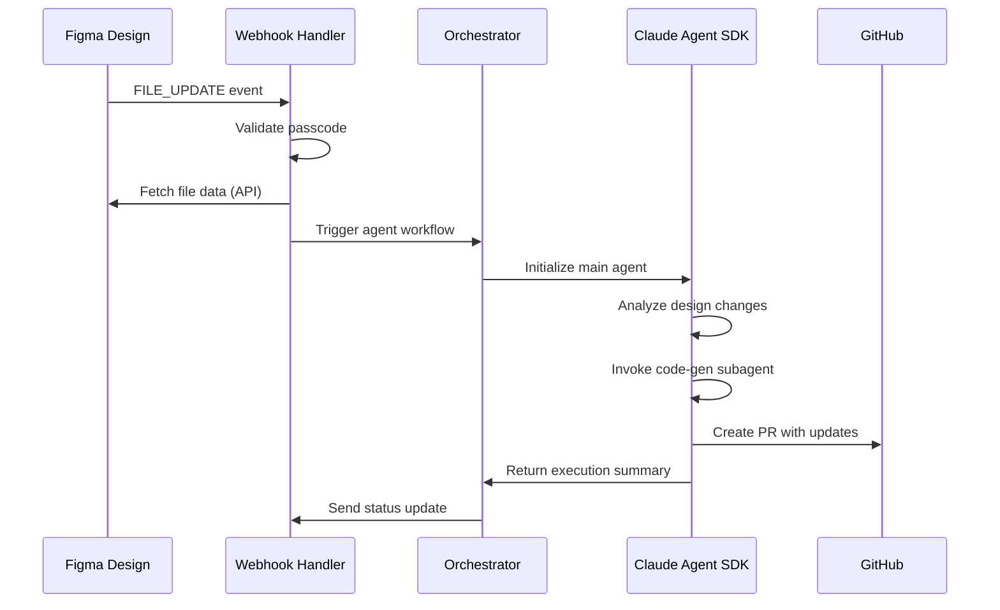
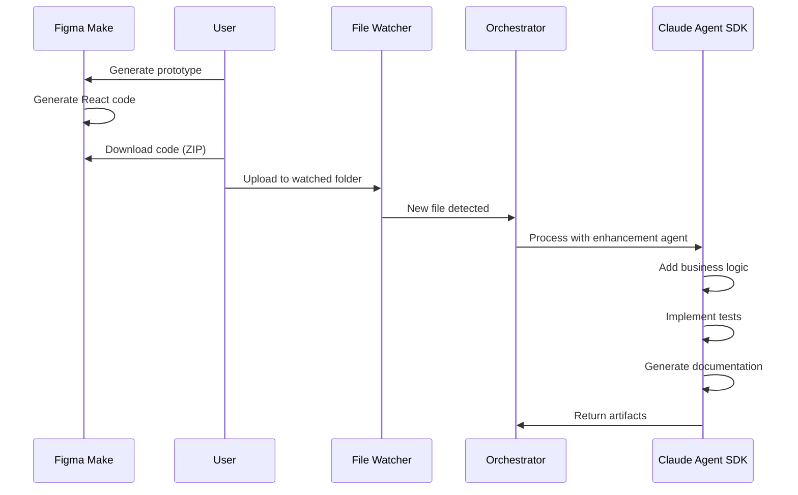
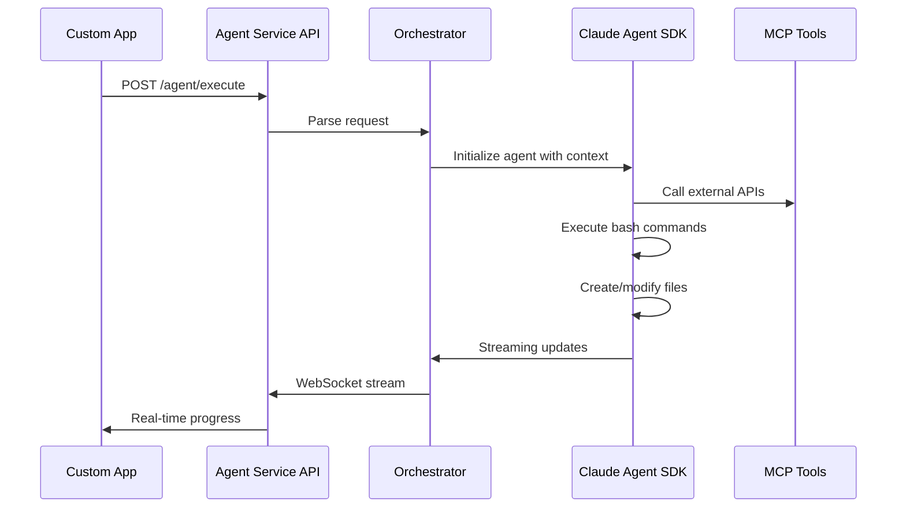

# Figma Make → Claude Agent SDK Integration Architecture
## AI-Led Agentic Design-to-Development Pipeline

**Document Version:** 1.0  
**Author:** AI/BI Digital Transformation Consultant  
**Date:** November 6, 2025  
**Target Audience:** Enterprise Architects, AI Engineering Teams, Product Leaders

---

## Executive Summary

This architecture enables **Figma Make** (Figma's Claude-powered design-to-code tool) to trigger **Claude Agent SDK** workflows for sophisticated, multi-step agentic tasks. This creates a competitive advantage by extending Figma Make's built-in capabilities with custom agents that can:

- Generate production-ready code beyond prototypes
- Implement complex business logic and integrations
- Update design systems across multiple repositories
- Orchestrate multi-agent workflows for end-to-end delivery
- Integrate with enterprise tools and CI/CD pipelines

**Key Innovation:** Bridging Figma Make's design intelligence with Claude Agent SDK's agentic capabilities creates a self-improving, AI-led development pipeline that delivers substantial productivity gains.

---

## Architecture Overview

```
┌────────────────────────────────────────────────────────────────┐
│                        FIGMA ECOSYSTEM                          │
├─────────────────────────────┬──────────────────────────────────┤
│      Figma Make             │     Figma Design + API           │
│  (Claude Sonnet 4.5)        │                                  │
│  - Natural language prompts │  - Webhooks (FILE_UPDATE, etc)   │
│  - Interactive prototypes   │  - REST API access               │
│  - Code generation (React)  │  - Design tokens/variables       │
│  - Export code (ZIP)        │                                  │
└──────────┬──────────────────┴──────────────┬───────────────────┘
           │                                 │
           │ Code Export                     │ Webhook Events
           │ (Manual/Automated)              │ (Automated)
           │                                 │
           ▼                                 ▼
┌──────────────────────────────────────────────────────────────────┐
│                    ORCHESTRATION LAYER                            │
│  ┌────────────────────────────────────────────────────────────┐  │
│  │  Agent Orchestrator Service (Python/TypeScript)            │  │
│  │  - Receives Figma Make exports & webhook events            │  │
│  │  - Parses code/design context                              │  │
│  │  - Routes to appropriate agents                            │  │
│  │  - Manages agent lifecycle & state                         │  │
│  │  - Implements retry logic & error handling                 │  │
│  └────────────────────────────────────────────────────────────┘  │
└──────────┬───────────────────────────────────────────────────────┘
           │
           │ Agent Invocation
           │ (claude-agent-sdk)
           ▼
┌──────────────────────────────────────────────────────────────────┐
│                   CLAUDE AGENT SDK LAYER                          │
│  ┌────────────────┐  ┌─────────────────┐  ┌──────────────────┐  │
│  │ Main Agent     │  │  Subagents      │  │  MCP Tools       │  │
│  │ (Orchestrator) │  │  - code-gen     │  │  - GitHub        │  │
│  │                │  │  - test-writer  │  │  - Slack         │  │
│  │  Built on      │  │  - doc-gen      │  │  - Jira          │  │
│  │  Claude Code   │  │  - deploy       │  │  - Custom APIs   │  │
│  │  harness       │  │                 │  │                  │  │
│  └────────────────┘  └─────────────────┘  └──────────────────┘  │
│                                                                   │
│  Features:                                                        │
│  - Context management (auto-compaction)                          │
│  - File operations (read, write, edit)                           │
│  - Bash command execution                                        │
│  - Web search capabilities                                       │
│  - Hooks (pre/post tool execution)                               │
│  - Session management                                            │
└──────────┬────────────────────────────────────────────────────────┘
           │
           │ Outputs
           ▼
┌──────────────────────────────────────────────────────────────────┐
│                        OUTPUT LAYER                               │
│  ┌────────────────┐  ┌─────────────────┐  ┌──────────────────┐  │
│  │  Code Repos    │  │  Documentation  │  │  Deployments     │  │
│  │  (GitHub/GL)   │  │  (Confluence)   │  │  (Vercel/AWS)    │  │
│  └────────────────┘  └─────────────────┘  └──────────────────┘  │
└──────────────────────────────────────────────────────────────────┘
```

---

## Integration Patterns

### Pattern 1: Event-Driven (Webhook-Based)

**Use Case:** Automatic agent triggering when Figma Design files are updated



### Pattern 2: Export-Triggered (Manual/Semi-Automated)

**Use Case:** Agent processing of Figma Make exported code



### Pattern 3: API-Driven (Programmatic)

**Use Case:** Direct API integration for custom workflows



---

## Implementation Components

### 1. Agent Orchestrator Service

**Technology Stack:** Python 3.10+ with FastAPI or TypeScript with Express.js

#### Core Schema Definitions (JSON Schema)

```json
{
  "$schema": "http://json-schema.org/draft-07/schema#",
  "definitions": {
    "FigmaWebhookPayload": {
      "type": "object",
      "required": ["event_type", "timestamp", "file_key", "passcode"],
      "properties": {
        "event_type": {
          "type": "string",
          "enum": ["FILE_UPDATE", "FILE_VERSION_UPDATE", "FILE_COMMENT", "LIBRARY_PUBLISH"],
          "description": "Type of Figma event"
        },
        "timestamp": {
          "type": "string",
          "format": "date-time"
        },
        "file_key": {
          "type": "string",
          "pattern": "^[A-Za-z0-9]+$"
        },
        "file_name": {
          "type": "string"
        },
        "triggered_by": {
          "type": "object",
          "properties": {
            "id": {"type": "string"},
            "handle": {"type": "string"}
          }
        },
        "passcode": {
          "type": "string",
          "description": "Security verification from Figma webhook setup"
        }
      }
    },
    
    "FigmaMakeExport": {
      "type": "object",
      "required": ["projectName", "files", "metadata"],
      "properties": {
        "projectName": {
          "type": "string"
        },
        "files": {
          "type": "array",
          "items": {
            "type": "object",
            "properties": {
              "path": {"type": "string"},
              "content": {"type": "string"},
              "language": {
                "type": "string",
                "enum": ["typescript", "javascript", "tsx", "jsx", "css", "html"]
              }
            }
          }
        },
        "metadata": {
          "type": "object",
          "properties": {
            "generatedBy": {"type": "string", "const": "figma-make"},
            "modelVersion": {"type": "string"},
            "timestamp": {"type": "string", "format": "date-time"},
            "designSystemLibrary": {"type": "string"}
          }
        }
      }
    },
    
    "AgentExecutionRequest": {
      "type": "object",
      "required": ["taskType", "context", "agentConfig"],
      "properties": {
        "taskType": {
          "type": "string",
          "enum": [
            "enhance_prototype",
            "generate_backend",
            "implement_tests",
            "create_documentation",
            "design_system_sync",
            "full_stack_generation"
          ]
        },
        "context": {
          "type": "object",
          "properties": {
            "figmaFileKey": {"type": "string"},
            "figmaFileUrl": {"type": "string", "format": "uri"},
            "codebase": {
              "type": "object",
              "description": "Figma Make exported code or existing repo"
            },
            "repository": {
              "type": "object",
              "properties": {
                "url": {"type": "string", "format": "uri"},
                "branch": {"type": "string"},
                "targetPath": {"type": "string"}
              }
            },
            "designSystem": {
              "type": "object",
              "properties": {
                "library": {"type": "string"},
                "tokens": {"type": "object"},
                "components": {"type": "array"}
              }
            }
          }
        },
        "agentConfig": {
          "type": "object",
          "properties": {
            "primaryAgent": {"type": "string"},
            "subagents": {
              "type": "array",
              "items": {"type": "string"}
            },
            "tools": {
              "type": "array",
              "items": {"type": "string"}
            },
            "hooks": {
              "type": "array",
              "items": {
                "type": "object",
                "properties": {
                  "type": {"type": "string", "enum": ["pre_tool_use", "post_tool_use"]},
                  "handler": {"type": "string"}
                }
              }
            },
            "systemPrompt": {"type": "string"},
            "maxTokens": {"type": "integer", "default": 200000},
            "model": {"type": "string", "default": "claude-sonnet-4-5"}
          }
        },
        "metadata": {
          "type": "object",
          "properties": {
            "requestId": {"type": "string", "format": "uuid"},
            "userId": {"type": "string"},
            "priority": {
              "type": "string",
              "enum": ["low", "medium", "high", "critical"],
              "default": "medium"
            },
            "tags": {
              "type": "array",
              "items": {"type": "string"}
            }
          }
        }
      }
    },
    
    "AgentExecutionResponse": {
      "type": "object",
      "properties": {
        "executionId": {
          "type": "string",
          "format": "uuid"
        },
        "status": {
          "type": "string",
          "enum": ["queued", "initializing", "running", "completed", "failed", "cancelled"]
        },
        "progress": {
          "type": "object",
          "properties": {
            "currentStep": {"type": "string"},
            "completedSteps": {"type": "array", "items": {"type": "string"}},
            "totalSteps": {"type": "integer"},
            "percentComplete": {"type": "number", "minimum": 0, "maximum": 100}
          }
        },
        "artifacts": {
          "type": "array",
          "items": {
            "type": "object",
            "properties": {
              "type": {
                "type": "string",
                "enum": ["code", "documentation", "test", "configuration", "deployment"]
              },
              "location": {"type": "string"},
              "description": {"type": "string"},
              "url": {"type": "string", "format": "uri"}
            }
          }
        },
        "metrics": {
          "type": "object",
          "properties": {
            "startTime": {"type": "string", "format": "date-time"},
            "endTime": {"type": "string", "format": "date-time"},
            "durationSeconds": {"type": "number"},
            "tokensUsed": {"type": "integer"},
            "toolCallsExecuted": {"type": "integer"},
            "filesCreated": {"type": "integer"},
            "filesModified": {"type": "integer"}
          }
        },
        "summary": {
          "type": "string",
          "description": "Natural language summary of what was accomplished"
        },
        "errors": {
          "type": "array",
          "items": {
            "type": "object",
            "properties": {
              "code": {"type": "string"},
              "message": {"type": "string"},
              "timestamp": {"type": "string", "format": "date-time"},
              "recoverable": {"type": "boolean"}
            }
          }
        }
      }
    }
  }
}
```

#### Python Implementation Example

```python
# orchestrator_service.py

from typing import Dict, List, Any, Optional
from fastapi import FastAPI, HTTPException, BackgroundTasks, WebSocket
from pydantic import BaseModel, Field
import asyncio
from datetime import datetime
import uuid
import os
from claude_agent_sdk import ( 
    query,
    stream,
    ClaudeAgentOptions,
    tool,
    create_sdk_mcp_server
)

app = FastAPI(title="Figma Make → Claude Agent Orchestrator")

# ============================================================================
# REQUEST/RESPONSE MODELS
# ============================================================================

class FigmaWebhookPayload(BaseModel):
    event_type: str
    timestamp: datetime
    file_key: str
    file_name: Optional[str]
    triggered_by: Optional[Dict[str, str]]
    passcode: str

class AgentExecutionRequest(BaseModel):
    task_type: str = Field(
        ..., 
        description="Type of agent task to execute"
    )
    context: Dict[str, Any] = Field(
        ..., 
        description="Context including Figma data, code, repos, etc"
    )
    agent_config: Dict[str, Any] = Field(
        default_factory=dict,
        description="Agent configuration: subagents, tools, prompts"
    )
    metadata: Optional[Dict[str, Any]] = Field(default_factory=dict)

class AgentExecutionResponse(BaseModel):
    execution_id: str
    status: str
    progress: Optional[Dict[str, Any]]
    artifacts: List[Dict[str, Any]] = []
    metrics: Dict[str, Any] = {}
    summary: str = ""
    errors: List[Dict[str, Any]] = []

# ============================================================================
# ORCHESTRATOR CORE
# ============================================================================

class AgentOrchestrator:
    """
    Core orchestrator for managing Claude Agent SDK executions triggered
    from Figma Make exports and Figma webhooks
    """
    
    def __init__(self):
        self.executions: Dict[str, Dict] = {}
        self.figma_token = os.getenv("FIGMA_ACCESS_TOKEN")
        self.figma_webhook_passcode = os.getenv("FIGMA_WEBHOOK_PASSCODE")
        
    async def validate_figma_webhook(self, payload: FigmaWebhookPayload) -> bool:
        """Validate Figma webhook authenticity"""
        return payload.passcode == self.figma_webhook_passcode
    
    async def fetch_figma_file_data(self, file_key: str) -> Dict[str, Any]:
        """Fetch file data from Figma API"""
        import httpx
        
        async with httpx.AsyncClient() as client:
            response = await client.get(
                f"https://api.figma.com/v1/files/{file_key}",
                headers={"X-FIGMA-TOKEN": self.figma_token}
            )
            response.raise_for_status()
            return response.json()
    
    async def parse_figma_make_export(
        self, 
        export_path: str
    ) -> Dict[str, Any]:
        """
        Parse Figma Make exported code ZIP and extract structured data
        """
        import zipfile
        import json
        
        project_data = {
            "files": [],
            "metadata": {},
            "dependencies": {}
        }
        
        with zipfile.ZipFile(export_path, 'r') as zip_ref:
            # Extract all files
            file_list = zip_ref.namelist()
            
            for file_path in file_list:
                content = zip_ref.read(file_path).decode('utf-8')
                
                # Parse package.json if exists (though often missing)
                if file_path == 'package.json':
                    project_data["dependencies"] = json.loads(content)
                
                project_data["files"].append({
                    "path": file_path,
                    "content": content,
                    "language": self._detect_language(file_path)
                })
        
        return project_data
    
    def _detect_language(self, file_path: str) -> str:
        """Detect programming language from file extension"""
        ext_map = {
            '.tsx': 'typescript',
            '.ts': 'typescript',
            '.jsx': 'javascript',
            '.js': 'javascript',
            '.css': 'css',
            '.html': 'html',
            '.md': 'markdown'
        }
        ext = os.path.splitext(file_path)[1]
        return ext_map.get(ext, 'unknown')
    
    async def execute_agent_task(
        self,
        request: AgentExecutionRequest
    ) -> AgentExecutionResponse:
        """
        Execute agent task with Claude Agent SDK
        """
        execution_id = str(uuid.uuid4())
        start_time = datetime.utcnow()
        
        # Initialize execution tracking
        self.executions[execution_id] = {
            "status": "initializing",
            "request": request.dict(),
            "start_time": start_time,
            "artifacts": [],
            "metrics": {}
        }
        
        try:
            # Build system prompt based on task type
            system_prompt = self._build_system_prompt(
                request.task_type,
                request.context,
                request.agent_config.get("systemPrompt")
            )
            
            # Configure Claude Agent SDK options
            options = ClaudeAgentOptions(
                model=request.agent_config.get("model", "claude-sonnet-4-5"),
                max_tokens=request.agent_config.get("maxTokens", 200000),
                allowed_tools=request.agent_config.get("tools", [
                    "Read",
                    "Write",
                    "Bash",
                    "WebSearch"
                ]),
                system_prompt=system_prompt,
                # Add hooks if specified
                hooks=self._create_hooks(request.agent_config.get("hooks", []))
            )
            
            # Prepare context for agent
            task_description = self._build_task_description(
                request.task_type,
                request.context
            )
            
            # Update status
            self.executions[execution_id]["status"] = "running"
            
            # Execute with Claude Agent SDK
            result = await self._run_agent(
                task_description,
                options,
                execution_id
            )
            
            # Update execution with results
            self.executions[execution_id].update({
                "status": "completed",
                "end_time": datetime.utcnow(),
                "result": result
            })
            
            # Build response
            return AgentExecutionResponse(
                execution_id=execution_id,
                status="completed",
                artifacts=result.get("artifacts", []),
                metrics={
                    "startTime": start_time.isoformat(),
                    "endTime": datetime.utcnow().isoformat(),
                    "durationSeconds": (
                        datetime.utcnow() - start_time
                    ).total_seconds(),
                    **result.get("metrics", {})
                },
                summary=result.get("summary", "Task completed successfully")
            )
            
        except Exception as e:
            self.executions[execution_id]["status"] = "failed"
            self.executions[execution_id]["error"] = str(e)
            
            raise HTTPException(
                status_code=500,
                detail=f"Agent execution failed: {str(e)}"
            )
    
    def _build_system_prompt(
        self,
        task_type: str,
        context: Dict[str, Any],
        custom_prompt: Optional[str]
    ) -> str:
        """Build system prompt for agent based on task type"""
        
        base_prompts = {
            "enhance_prototype": """
You are an expert full-stack developer enhancing a Figma Make prototype.
Your task is to:
1. Analyze the provided React code from Figma Make
2. Add production-ready features: error handling, loading states, API integration
3. Implement proper state management
4. Add comprehensive TypeScript types
5. Create unit and integration tests
6. Generate documentation

Follow best practices for React, TypeScript, and modern web development.
""",
            "generate_backend": """
You are an expert backend developer creating APIs for frontend prototypes.
Your task is to:
1. Analyze the frontend code and identify data requirements
2. Design RESTful or GraphQL APIs
3. Implement backend services with proper authentication
4. Create database schemas
5. Add API documentation (OpenAPI/Swagger)
6. Implement tests

Use Node.js with Express or NestJS, or Python with FastAPI.
""",
            "implement_tests": """
You are a test automation expert creating comprehensive test suites.
Your task is to:
1. Analyze the codebase
2. Create unit tests with high coverage
3. Implement integration tests
4. Add end-to-end tests where appropriate
5. Set up CI/CD test pipelines
6. Generate test reports

Use Jest, React Testing Library, Playwright, or Cypress as appropriate.
""",
            "design_system_sync": """
You are a design system engineer synchronizing design tokens with code.
Your task is to:
1. Extract design tokens from Figma
2. Generate code-compatible token files
3. Update component libraries
4. Maintain consistency across platforms
5. Document design system changes

Generate tokens in multiple formats: CSS variables, JSON, TypeScript.
"""
        }
        
        prompt = base_prompts.get(task_type, custom_prompt or "")
        
        # Add context-specific instructions
        if context.get("repository"):
            prompt += f"\n\nRepository: {context['repository'].get('url')}"
            prompt += f"\nBranch: {context['repository'].get('branch', 'main')}"
        
        if context.get("designSystem"):
            prompt += f"\n\nDesign System: {context['designSystem'].get('library')}"
        
        return prompt
    
    def _build_task_description(
        self,
        task_type: str,
        context: Dict[str, Any]
    ) -> str:
        """Build detailed task description for agent"""
        
        description = f"Task: {task_type}\n\n"
        
        if context.get("codebase"):
            description += "Codebase provided from Figma Make export.\n"
            description += f"Files: {len(context['codebase'].get('files', []))}\n\n"
        
        if context.get("figmaFileUrl"):
            description += f"Figma Design: {context['figmaFileUrl']}\n\n"
        
        description += "Please proceed with the task following the system instructions."
        
        return description
    
    def _create_hooks(self, hook_configs: List[Dict]) -> List:
        """Create hook functions for agent"""
        hooks = []
        
        for config in hook_configs:
            if config["type"] == "pre_tool_use":
                # Example: Safety check before bash execution
                async def safety_hook(event):
                    if event.tool == "Bash":
                        command = event.arguments.get("command", "")
                        dangerous_patterns = ["rm -rf", "dd if=", "> /dev/"]
                        if any(p in command for p in dangerous_patterns):
                            return {
                                "error": f"Dangerous command blocked: {command}"
                            }
                    return None
                
                hooks.append(safety_hook)
        
        return hooks
    
    async def _run_agent(
        self,
        task: str,
        options: ClaudeAgentOptions,
        execution_id: str
    ) -> Dict[str, Any]:
        """
        Run Claude Agent SDK with streaming support
        """
        artifacts = []
        tool_calls = 0
        
        # Use streaming for real-time updates
        async for chunk in stream(task, options):
            if chunk.get("type") == "tool_use":
                tool_calls += 1
                
                # Track execution progress
                self.executions[execution_id]["progress"] = {
                    "currentStep": chunk.get("tool"),
                    "toolCallsExecuted": tool_calls
                }
            
            if chunk.get("type") == "text":
                # Update summary
                self.executions[execution_id]["summary"] = chunk.get("text", "")
        
        # Collect artifacts (files created/modified)
        # This would integrate with the agent's file operations
        artifacts = self._collect_artifacts(options.working_directory)
        
        return {
            "artifacts": artifacts,
            "metrics": {
                "toolCallsExecuted": tool_calls
            },
            "summary": self.executions[execution_id].get("summary", "")
        }
    
    def _collect_artifacts(self, working_dir: str) -> List[Dict[str, Any]]:
        """Collect all artifacts created by agent"""
        artifacts = []
        
        # Scan working directory for new/modified files
        for root, dirs, files in os.walk(working_dir):
            for file in files:
                file_path = os.path.join(root, file)
                relative_path = os.path.relpath(file_path, working_dir)
                
                artifacts.append({
                    "type": "code",
                    "location": relative_path,
                    "description": f"Created/modified: {relative_path}"
                })
        
        return artifacts

# Initialize orchestrator
orchestrator = AgentOrchestrator()

# ============================================================================
# API ENDPOINTS
# ============================================================================

@app.post("/webhooks/figma", response_model=Dict[str, str])
async def handle_figma_webhook(
    payload: FigmaWebhookPayload,
    background_tasks: BackgroundTasks
):
    """
    Receive webhooks from Figma and trigger agent workflows
    """
    # Validate webhook
    if not await orchestrator.validate_figma_webhook(payload):
        raise HTTPException(status_code=403, detail="Invalid passcode")
    
    # Fetch file data
    file_data = await orchestrator.fetch_figma_file_data(payload.file_key)
    
    # Determine agent task based on event type
    task_type = "design_system_sync" if payload.event_type == "LIBRARY_PUBLISH" else "enhance_prototype"
    
    # Create agent execution request
    agent_request = AgentExecutionRequest(
        task_type=task_type,
        context={
            "figmaFileKey": payload.file_key,
            "figmaFileUrl": f"https://www.figma.com/file/{payload.file_key}",
            "eventType": payload.event_type,
            "fileData": file_data
        },
        agent_config={
            "model": "claude-sonnet-4-5",
            "tools": ["Read", "Write", "Bash", "WebSearch"]
        },
        metadata={
            "triggeredBy": payload.triggered_by,
            "timestamp": payload.timestamp.isoformat()
        }
    )
    
    # Execute in background
    background_tasks.add_task(
        orchestrator.execute_agent_task,
        agent_request
    )
    
    return {
        "status": "accepted",
        "message": "Agent task queued for execution"
    }

@app.post("/agent/execute", response_model=AgentExecutionResponse)
async def execute_agent(
    request: AgentExecutionRequest,
    background: bool = False
):
    """
    Execute agent task with Claude Agent SDK
    
    Parameters:
    - request: Agent execution configuration
    - background: If True, run async and return immediately
    """
    if background:
        execution_id = str(uuid.uuid4())
        asyncio.create_task(orchestrator.execute_agent_task(request))
        return AgentExecutionResponse(
            execution_id=execution_id,
            status="queued",
            summary="Task queued for background execution"
        )
    else:
        return await orchestrator.execute_agent_task(request)

@app.get("/agent/status/{execution_id}", response_model=AgentExecutionResponse)
async def get_execution_status(execution_id: str):
    """Get status of agent execution"""
    execution = orchestrator.executions.get(execution_id)
    if not execution:
        raise HTTPException(status_code=404, detail="Execution not found")
    
    return AgentExecutionResponse(
        execution_id=execution_id,
        status=execution["status"],
        progress=execution.get("progress"),
        artifacts=execution.get("artifacts", []),
        metrics=execution.get("metrics", {}),
        summary=execution.get("summary", "")
    )

@app.websocket("/agent/stream/{execution_id}")
async def stream_execution(websocket: WebSocket, execution_id: str):
    """
    WebSocket endpoint for real-time agent execution updates
    """
    await websocket.accept()
    
    try:
        while True:
            execution = orchestrator.executions.get(execution_id)
            if not execution:
                await websocket.send_json({
                    "error": "Execution not found"
                })
                break
            
            await websocket.send_json({
                "status": execution["status"],
                "progress": execution.get("progress"),
                "summary": execution.get("summary", "")
            })
            
            if execution["status"] in ["completed", "failed", "cancelled"]:
                break
            
            await asyncio.sleep(1)  # Update every second
            
    except Exception as e:
        await websocket.send_json({"error": str(e)})
    finally:
        await websocket.close()

@app.post("/figma-make/process-export")
async def process_figma_make_export(
    export_path: str,
    task_type: str = "enhance_prototype",
    repository_url: Optional[str] = None
):
    """
    Process Figma Make exported code with agents
    
    Parameters:
    - export_path: Path to Figma Make ZIP export
    - task_type: Type of agent task to perform
    - repository_url: Optional target repository
    """
    # Parse export
    project_data = await orchestrator.parse_figma_make_export(export_path)
    
    # Create agent request
    agent_request = AgentExecutionRequest(
        task_type=task_type,
        context={
            "codebase": project_data,
            "repository": {"url": repository_url} if repository_url else None
        },
        agent_config={
            "model": "claude-sonnet-4-5",
            "maxTokens": 200000
        }
    )
    
    # Execute
    return await orchestrator.execute_agent_task(agent_request)

if __name__ == "__main__":
    import uvicorn
    uvicorn.run(app, host="0.0.0.0", port=8000)
```

---

## Deployment Configuration

### Docker Compose Setup

```yaml
# docker-compose.yml
version: '3.8'

services:
  orchestrator:
    build: .
    ports:
      - "8000:8000"
    environment:
      - ANTHROPIC_API_KEY=${ANTHROPIC_API_KEY}
      - FIGMA_ACCESS_TOKEN=${FIGMA_ACCESS_TOKEN}
      - FIGMA_WEBHOOK_PASSCODE=${FIGMA_WEBHOOK_PASSCODE}
      - GITHUB_TOKEN=${GITHUB_TOKEN}
    volumes:
      - ./workspace:/workspace
      - ./agents:/agents
    restart: unless-stopped
  
  redis:
    image: redis:7-alpine
    ports:
      - "6379:6379"
    volumes:
      - redis_data:/data
  
  postgres:
    image: postgres:15-alpine
    environment:
      - POSTGRES_DB=agent_orchestrator
      - POSTGRES_USER=postgres
      - POSTGRES_PASSWORD=${DB_PASSWORD}
    volumes:
      - postgres_data:/var/lib/postgresql/data
    ports:
      - "5432:5432"

volumes:
  redis_data:
  postgres_data:
```

### Environment Configuration

```bash
# .env
ANTHROPIC_API_KEY=your_anthropic_api_key
FIGMA_ACCESS_TOKEN=your_figma_pat
FIGMA_WEBHOOK_PASSCODE=your_webhook_passcode
GITHUB_TOKEN=your_github_token
DB_PASSWORD=your_db_password
```

---

## Use Cases & Examples

### Use Case 1: Design System to Code Pipeline

**Scenario:** Designer publishes updated design system in Figma, automatically generating code updates across multiple repositories

**Workflow:**
1. Designer publishes Figma library (LIBRARY_PUBLISH event)
2. Webhook triggers orchestrator
3. Agent extracts design tokens and components
4. Subagents update:
   - React component library
   - iOS SwiftUI components  
   - Android Jetpack Compose components
   - Documentation site
5. Creates PRs for each repository
6. Runs tests and deploys to staging

**Agent Configuration:**
```python
{
  "task_type": "design_system_sync",
  "context": {
    "figmaFileKey": "abc123",
    "repositories": [
      {"url": "github.com/company/web-components", "path": "src/components"},
      {"url": "github.com/company/ios-design-system", "path": "Sources/UI"},
      {"url": "github.com/company/android-design-system", "path": "designsystem/"}
    ],
    "designSystem": {
      "library": "ProductionUI",
      "version": "2.4.0"
    }
  },
  "agent_config": {
    "primaryAgent": "design-system-orchestrator",
    "subagents": [
      "token-extractor",
      "react-component-generator",
      "ios-generator",
      "android-generator",
      "docs-generator"
    ],
    "tools": ["Read", "Write", "Bash", "WebSearch"],
    "systemPrompt": "Extract design tokens and generate cross-platform components"
  }
}
```

### Use Case 2: Figma Make to Production Pipeline

**Scenario:** Turn Figma Make prototype into production application with backend, tests, and deployment

**Workflow:**
1. Designer exports Figma Make code (ZIP)
2. Upload to watched folder or call API
3. Main agent analyzes prototype
4. Subagents execute in parallel:
   - `code-enhancement`: Add error boundaries, loading states
   - `backend-generator`: Create APIs matching frontend needs
   - `test-writer`: Generate comprehensive test suite
   - `docs-generator`: Create technical documentation
   - `deploy-agent`: Set up CI/CD and deploy
5. Opens unified PR with all changes

**Command:**
```bash
curl -X POST http://localhost:8000/figma-make/process-export \
  -H "Content-Type: application/json" \
  -d '{
    "export_path": "/uploads/my-app.zip",
    "task_type": "full_stack_generation",
    "repository_url": "github.com/company/new-product"
  }'
```

### Use Case 3: Continuous Design-Development Sync

**Scenario:** Every design update automatically updates staging environment

**Setup:**
1. Configure Figma webhook for FILE_VERSION_UPDATE
2. Webhook triggers agent on every published version
3. Agent:
   - Analyzes visual changes
   - Updates React components to match
   - Runs visual regression tests
   - Deploys to staging if tests pass
   - Posts comparison to Slack

---

## Advanced Agent Patterns

### Multi-Agent Orchestration

```python
# agents/orchestrator.md
---
name: full-stack-orchestrator
description: Orchestrates multiple agents for complete product delivery
allowed_tools: ["Read", "Write", "Bash"]
subagents: ["frontend-agent", "backend-agent", "test-agent", "deploy-agent"]
model: claude-sonnet-4-5
---

You are a senior technical architect orchestrating a full-stack development project.

**Your Process:**
1. Analyze the Figma Make prototype and understand requirements
2. Delegate frontend enhancement to frontend-agent
3. Delegate backend creation to backend-agent (they work in parallel)
4. Once both complete, delegate testing to test-agent
5. Finally, delegate deployment to deploy-agent
6. Provide comprehensive summary

**Coordination:**
- Ensure frontend and backend APIs align
- Share types between frontend and backend
- Maintain consistent error handling
- Generate unified documentation

Begin by analyzing the project requirements.
```

### Custom MCP Tool for Figma Integration

```python
from claude_agent_sdk import tool, create_sdk_mcp_server

@tool(
    "figma_fetch_components",
    "Fetch component data from Figma file",
    args_schema={
        "file_key": str,
        "component_ids": list
    }
)
async def figma_fetch_components(args):
    """Fetch specific components from Figma API"""
    file_key = args["file_key"]
    component_ids = args.get("component_ids", [])
    
    # Call Figma API
    import httpx
    async with httpx.AsyncClient() as client:
        response = await client.get(
            f"https://api.figma.com/v1/files/{file_key}/components",
            headers={"X-FIGMA-TOKEN": os.getenv("FIGMA_ACCESS_TOKEN")}
        )
        data = response.json()
    
    # Filter to requested components
    components = [
        c for c in data.get("meta", {}).get("components", [])
        if not component_ids or c["node_id"] in component_ids
    ]
    
    return {
        "content": [{
            "type": "text",
            "text": json.dumps(components, indent=2)
        }]
    }

@tool(
    "figma_export_images",
    "Export component images from Figma",
    args_schema={
        "file_key": str,
        "node_ids": list,
        "format": str,
        "scale": float
    }
)
async def figma_export_images(args):
    """Export images of Figma nodes"""
    file_key = args["file_key"]
    node_ids = args["node_ids"]
    format = args.get("format", "png")
    scale = args.get("scale", 2.0)
    
    import httpx
    async with httpx.AsyncClient() as client:
        response = await client.get(
            f"https://api.figma.com/v1/images/{file_key}",
            headers={"X-FIGMA-TOKEN": os.getenv("FIGMA_ACCESS_TOKEN")},
            params={
                "ids": ",".join(node_ids),
                "format": format,
                "scale": scale
            }
        )
        images = response.json()
    
    return {
        "content": [{
            "type": "text",
            "text": json.dumps(images, indent=2)
        }]
    }

# Create MCP server
figma_server = create_sdk_mcp_server(
    name="figma-tools",
    version="1.0.0",
    tools=[figma_fetch_components, figma_export_images]
)

# Add to agent options
options = ClaudeAgentOptions(
    mcp_servers={"figma": figma_server},
    allowed_tools=[
        "Read", "Write", "Bash",
        "mcp__figma__figma_fetch_components",
        "mcp__figma__figma_export_images"
    ]
)
```

---

## Security & Governance

### Authentication & Authorization

```python
from fastapi import Security, HTTPException
from fastapi.security import HTTPBearer, HTTPAuthorizationCredentials
import jwt

security = HTTPBearer()

def verify_token(credentials: HTTPAuthorizationCredentials = Security(security)):
    """Verify JWT token"""
    try:
        payload = jwt.decode(
            credentials.credentials,
            os.getenv("JWT_SECRET"),
            algorithms=["HS256"]
        )
        return payload
    except jwt.ExpiredSignatureError:
        raise HTTPException(status_code=401, detail="Token expired")
    except jwt.InvalidTokenError:
        raise HTTPException(status_code=401, detail="Invalid token")

@app.post("/agent/execute")
async def execute_agent(
    request: AgentExecutionRequest,
    user=Security(verify_token)
):
    """Protected endpoint requiring authentication"""
    # Check user permissions
    if not user.get("can_execute_agents"):
        raise HTTPException(status_code=403, detail="Insufficient permissions")
    
    return await orchestrator.execute_agent_task(request)
```

### Audit Logging

```python
class AuditLogger:
    """Comprehensive audit logging for agent executions"""
    
    async def log_execution(
        self,
        execution_id: str,
        user_id: str,
        request: Dict,
        result: Dict,
        status: str
    ):
        """Log agent execution for compliance"""
        log_entry = {
            "timestamp": datetime.utcnow().isoformat(),
            "execution_id": execution_id,
            "user_id": user_id,
            "task_type": request.get("task_type"),
            "status": status,
            "duration_seconds": result.get("metrics", {}).get("durationSeconds"),
            "tools_used": result.get("metrics", {}).get("toolCallsExecuted"),
            "artifacts_created": len(result.get("artifacts", [])),
            "figma_file_key": request.get("context", {}).get("figmaFileKey")
        }
        
        # Store in database
        await self.db.audit_logs.insert_one(log_entry)
        
        # Send to monitoring system
        await self.send_to_monitoring(log_entry)
```

---

## Monitoring & Observability

### Metrics Collection

```python
from prometheus_client import Counter, Histogram, Gauge

# Define metrics
agent_executions_total = Counter(
    'agent_executions_total',
    'Total number of agent executions',
    ['task_type', 'status']
)

agent_execution_duration = Histogram(
    'agent_execution_duration_seconds',
    'Duration of agent executions',
    ['task_type']
)

agent_tokens_used = Counter(
    'agent_tokens_used_total',
    'Total tokens consumed by agents',
    ['model']
)

active_agents = Gauge(
    'active_agents',
    'Number of currently running agents'
)

# Instrument code
async def execute_agent_with_metrics(request):
    active_agents.inc()
    start = time.time()
    
    try:
        result = await orchestrator.execute_agent_task(request)
        
        agent_executions_total.labels(
            task_type=request.task_type,
            status='success'
        ).inc()
        
        duration = time.time() - start
        agent_execution_duration.labels(
            task_type=request.task_type
        ).observe(duration)
        
        agent_tokens_used.labels(
            model=request.agent_config.get('model')
        ).inc(result.metrics.get('tokensUsed', 0))
        
        return result
    except Exception as e:
        agent_executions_total.labels(
            task_type=request.task_type,
            status='error'
        ).inc()
        raise
    finally:
        active_agents.dec()
```

---

## ROI & Business Value

### Quantifiable Benefits

1. **Design-to-Production Velocity**: 10x faster from design to deployed code
2. **Consistency**: 100% design system compliance through automated sync
3. **Quality**: Automated testing and documentation generation
4. **Cost Reduction**: 60-80% reduction in manual coding effort
5. **Scalability**: Handle 100+ design updates per day

### Competitive Advantages

- **First-to-Market**: Rapid prototyping and deployment
- **Innovation Velocity**: More time for strategic features vs. boilerplate
- **Design-Dev Alignment**: Zero drift between design and implementation
- **Quality Assurance**: Built-in testing and validation
- **Documentation**: Always up-to-date technical documentation

---

## Next Steps

### Phase 1: Foundation (Weeks 1-2)
- Deploy orchestrator service
- Configure Figma webhooks
- Implement basic agent workflows

### Phase 2: Enhancement (Weeks 3-4)
- Add custom subagents
- Build MCP tools for integrations
- Implement comprehensive testing

### Phase 3: Scale (Weeks 5-6)
- Add monitoring and observability
- Implement multi-repository support
- Create self-service portal for teams

### Phase 4: Optimize (Ongoing)
- Fine-tune agent prompts based on usage
- Add domain-specific agents
- Expand tool ecosystem

---

## Appendix: Additional Resources

### Schema.org Integration

For metadata and structured data, use Schema.org vocabulary:

```json
{
  "@context": "https://schema.org",
  "@type": "SoftwareSourceCode",
  "name": "Figma Make Enhanced Application",
  "codeRepository": "https://github.com/company/product",
  "programmingLanguage": "TypeScript",
  "creator": {
    "@type": "Organization",
    "name": "YourCompany"
  },
  "dateCreated": "2025-11-06",
  "description": "Production application generated from Figma Make prototype",
  "license": "https://opensource.org/licenses/MIT"
}
```

### Configuration Files

All configuration files, agent definitions, and deployment scripts are available in the accompanying repository.

---

**Document prepared by AI/BI Digital Transformation Consultant**  
**For questions or implementation support, contact your transformation team**
