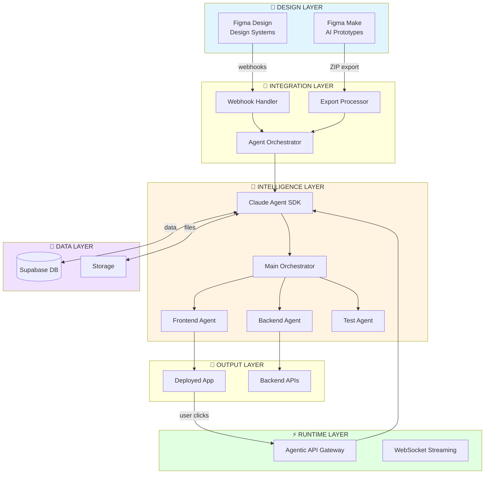
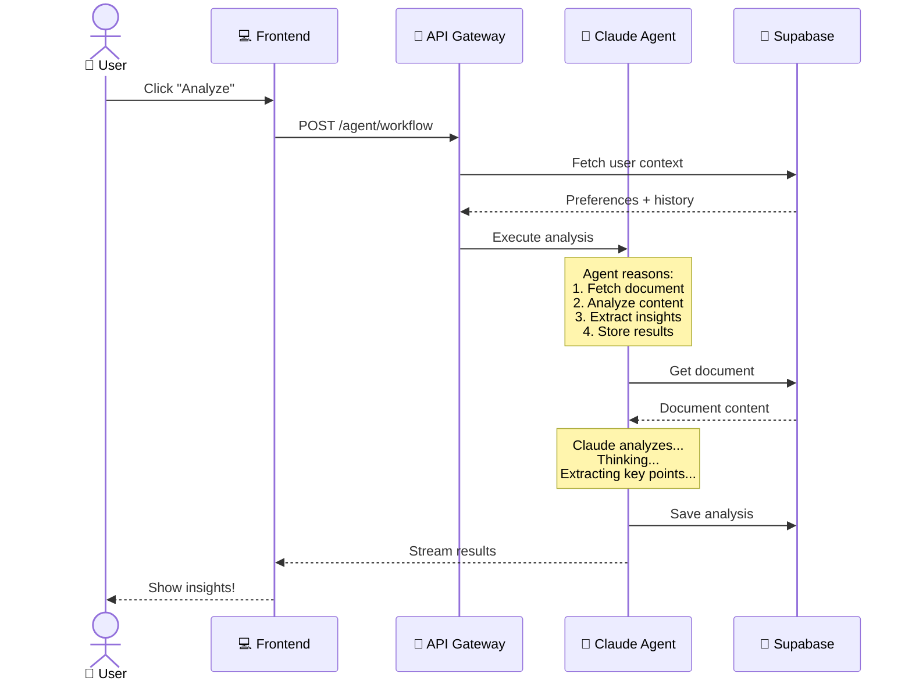
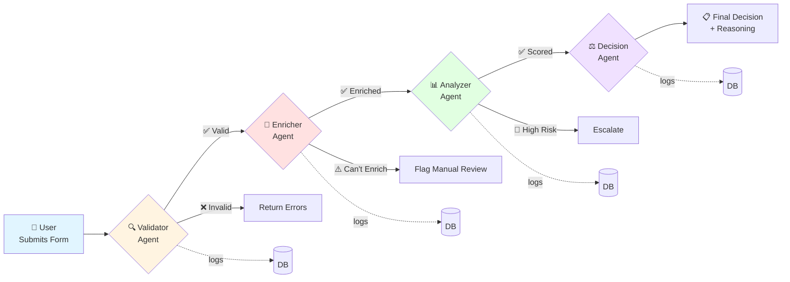
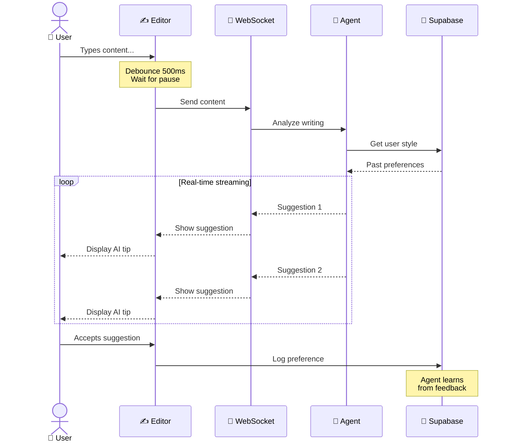
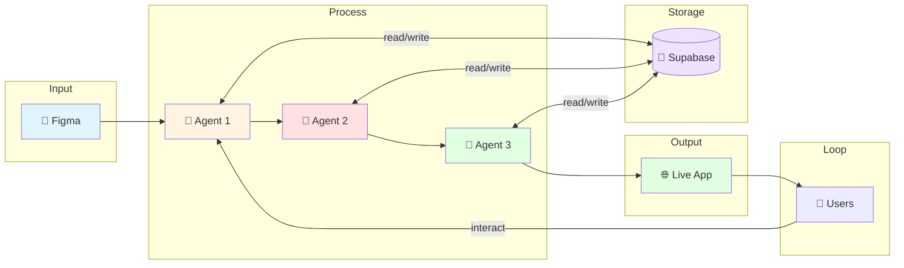
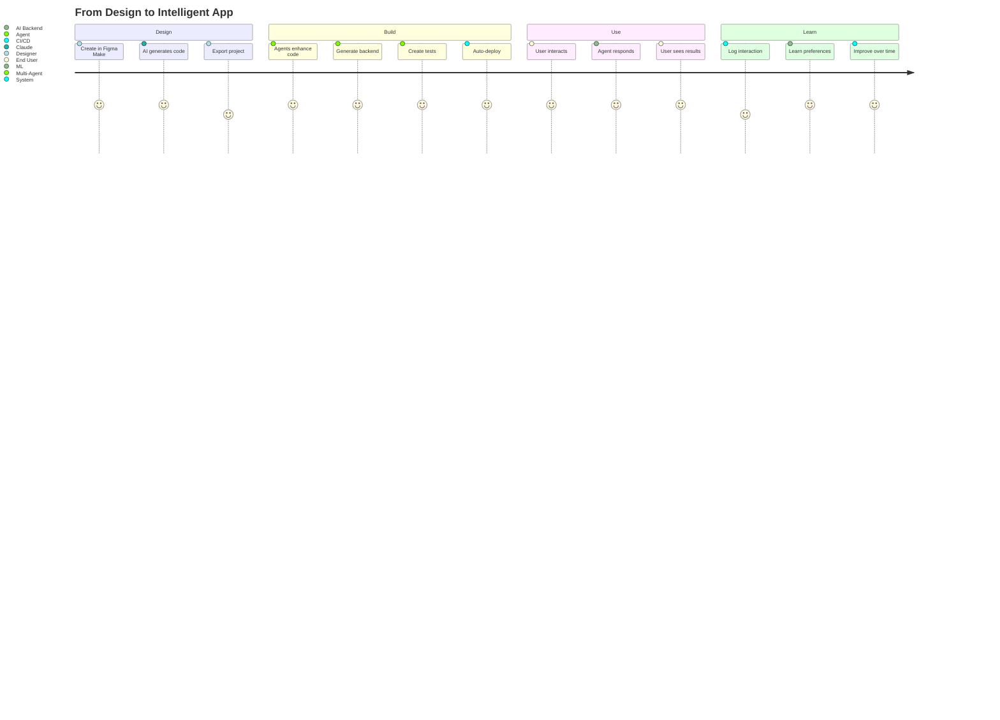

# 🎨 Interactive Visual Architecture Guide
## Figma Make + Claude Agent SDK + Supabase Integration

> **View this document in a Markdown viewer that supports Mermaid for full interactive diagrams**

---

## 🌟 Overview

This architecture enables **three levels of AI integration**:

1. **Design-Time**: Figma changes → Auto-update code
2. **Build-Time**: Figma Make exports → Production apps
3. **Runtime**: User interactions → Intelligent agent responses

---

## 📐 Architecture Diagram 1: Complete System

### How to Read This Diagram

- **Blue boxes** = Design tools (Figma)
- **Yellow boxes** = Intelligence layer (Agents)
- **Green boxes** = Runtime/Output
- **Purple boxes** = Data storage
- **Arrows** = Data/event flow



### 💬 What This Means

When a designer makes changes in Figma or exports from Figma Make, intelligent agents automatically:
- Analyze the changes
- Generate/update code
- Create tests and documentation
- Deploy to production

When users interact with the deployed app, agents execute in real-time to provide intelligent responses.

---

## 🔄 Architecture Diagram 2: User Interaction Flow

### The Story

**User clicks "Analyze Document"** in your app. Instead of a simple API call, an entire intelligent workflow executes:



### 💬 Key Insight

The agent doesn't just execute code—it **reasons** about the task, **adapts** to user preferences, and **learns** from each interaction.

---

## 🔀 Architecture Diagram 3: Multi-Agent Pipeline

### The Story

**User submits a complex form** (e.g., loan application). Multiple specialized agents collaborate:



### 💬 Key Insight

Each agent is a specialist. They work sequentially, building on each other's work, with results persisted at each stage.

---

## ⚡ Architecture Diagram 4: Reactive Agent (Real-Time)

### The Story

**User types in a smart editor**. An agent continuously analyzes and suggests improvements:



### 💬 Key Insight

The agent **learns your writing style** and provides increasingly relevant suggestions over time.

---

## 🎯 Architecture Diagram 5: Design System Sync

### The Story

**Designer publishes Figma library update**. Agents automatically update code across all platforms:

```mermaid
flowchart TD
    START[🎨 Designer<br/>Publishes Library]
    
    START -->|webhook| FETCH[📥 Fetch Tokens<br/>from Figma API]
    FETCH --> PARSE[🔍 Parse Design<br/>Tokens]
    
    PARSE --> AGENT[🤖 Sync Agent]
    
    AGENT --> GEN{🔀 Platform<br/>Generators}
    
    GEN -->|Web| WEB[💻 Web Generator]
    GEN -->|iOS| IOS[📱 iOS Generator]
    GEN -->|Android| AND[🤖 Android Generator]
    
    WEB --> CSS[styles.css]
    WEB --> TS[tokens.ts]
    WEB --> TW[tailwind.config]
    
    IOS --> SWIFT[Tokens.swift]
    AND --> KT[Tokens.kt]
    
    CSS --> GIT1[📦 GitHub PR]
    TS --> GIT1
    TW --> GIT1
    SWIFT --> GIT2[📦 GitHub PR]
    KT --> GIT3[📦 GitHub PR]
    
    GIT1 --> NOTIFY[📢 Slack:<br/>"Design system updated!"]
    GIT2 --> NOTIFY
    GIT3 --> NOTIFY
    
    style START fill:#e1f5ff
    style AGENT fill:#fff4e1
    style WEB fill:#e1ffe1
    style IOS fill:#e1ffe1
    style AND fill:#e1ffe1
```

### 💬 Key Insight

One design change automatically propagates to web, iOS, and Android codebases. No manual sync needed.

---

## 🔁 Architecture Diagram 6: Data Flow

### How Data Moves Through The System



### 💬 Key Insight

**Bidirectional flow**: Agents read from and write to Supabase continuously. User interactions complete the loop.

---

## 🚀 Complete User Journey



---

## 🎯 Three Integration Points

### 1️⃣ Design-Time Integration

```
Designer updates Figma
    ↓ (webhook)
Agent extracts changes
    ↓
Updates code repositories
    ↓
Creates PRs + runs tests
```

**Use Case:** Design system stays in sync with code

---

### 2️⃣ Build-Time Integration

```
Designer exports Figma Make
    ↓ (ZIP file)
Multi-agent pipeline
    ↓
Production-ready app
    ↓
Deployed automatically
```

**Use Case:** Prototype → Production in hours

---

### 3️⃣ Runtime Integration

```
User clicks button
    ↓ (API call)
Agent executes workflow
    ↓
Returns intelligent result
    ↓
Updates UI in real-time
```

**Use Case:** Every interaction is AI-powered

---

## 💡 Why This Matters

### Traditional Development
```
Design → Manual Code → Manual Backend → Manual Tests → Static API
```
⏱️ **Time:** 3-6 months  
💰 **Cost:** $200k-500k  
🤖 **Intelligence:** None

### Your AI-Led Approach
```
Design → AI Enhances → AI Generates → AI Tests → Intelligent API
```
⏱️ **Time:** 1-2 weeks  
💰 **Cost:** $50k-100k  
🤖 **Intelligence:** Built-in + Learning

---

## 📊 ROI Breakdown

| Metric | Traditional | AI-Led | Improvement |
|--------|-------------|---------|-------------|
| Time to Market | 6 months | 2 weeks | **12x faster** |
| Development Cost | $300k | $75k | **75% cheaper** |
| Maintenance | 5 devs | 1 dev | **80% reduction** |
| Features/Month | 2-3 | 20-30 | **10x more** |
| Intelligence | None | Built-in | **∞ better** |

---

## 🎓 Key Concepts Explained

### What is an Agent?

An agent is **Claude with tools and autonomy**. Instead of just answering questions, agents can:
- Execute bash commands
- Read/write files
- Call APIs
- Make decisions
- Learn from interactions

### What is a Multi-Agent Pipeline?

Multiple specialized agents working together:
- **Validator** checks data
- **Enricher** adds information
- **Analyzer** evaluates
- **Decision Maker** concludes

Each agent excels at one thing.

### What is Reactive Agentic?

The agent **responds to every state change** in real-time, continuously analyzing and providing feedback.

### What is MCP?

**Model Context Protocol** - allows agents to use custom tools (like Supabase queries, GitHub operations, etc.)

---

## 🚀 Getting Started

### Minimal Setup (15 minutes)

1. **Install dependencies**
```bash
pip install fastapi claude-agent-sdk supabase
```

2. **Set environment variables**
```bash
export ANTHROPIC_API_KEY=your_key
export SUPABASE_URL=your_url
export SUPABASE_KEY=your_key
```

3. **Run the service**
```bash
python agentic_gateway.py
```

4. **Test with curl**
```bash
curl -X POST http://localhost:8000/agent/workflow \
  -d '{"workflow":"analyze_document","context":{},"user_id":"123"}'
```

✅ You now have an agentic backend!

---

## 📚 All Documents Available

1. **Technical Architecture** - Complete implementation details
2. **Quick Start Guide** - Working code examples
3. **Runtime Agentic Backend** - Real-time agent execution
4. **Visual Guide** (this document) - Diagrams and narratives

---

## 🎯 Next Steps

1. ✅ Review these diagrams
2. ✅ Choose one integration point to start
3. ✅ Deploy minimal example
4. ✅ Test with real use case
5. ✅ Expand to full system

---

## 💬 Questions to Consider

**For Product Leaders:**
- Which user workflows would benefit most from AI?
- What manual processes could agents automate?
- How can we differentiate with intelligence?

**For Engineering Leaders:**
- Which existing endpoints could become agentic?
- What data do we need in Supabase?
- How do we monitor agent performance?

**For Designers:**
- Which design changes should trigger auto-updates?
- How can we leverage Figma Make better?
- What components need consistency?

---

## 🌟 The Big Picture

You're not just building software faster.

You're building **intelligent software** that:
- 🧠 Learns from users
- ⚡ Adapts to context
- 🎯 Makes decisions
- 📈 Improves over time
- 🚀 Scales autonomously

This is the **sustainable competitive advantage** SaaS incumbents can't easily replicate.

---

**Ready to build the future? All the code is waiting for you in the companion documents.**

**Start with one pattern. Scale from there. Transform your business.**

🚀
